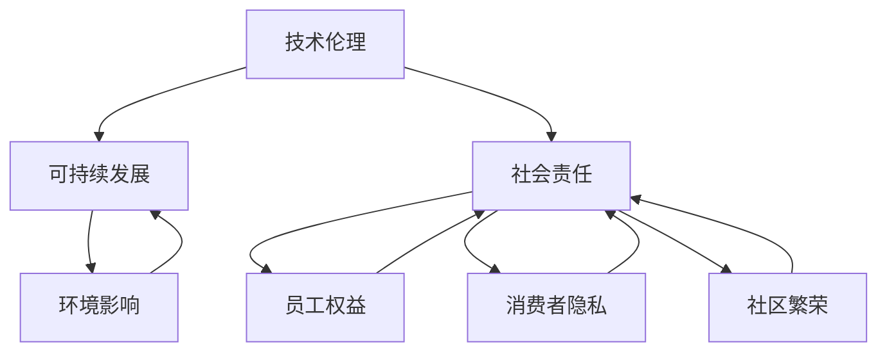

                 

关键词：自动化创业、企业社会责任、伦理问题、可持续发展、技术伦理

摘要：随着自动化技术的发展，创业公司在这一领域的机会与挑战并存。本文探讨了自动化创业中的企业社会责任，分析了技术伦理、可持续发展、社会影响等方面的议题，并提出了一些指导性的建议，以帮助创业公司在追求商业成功的同时，履行社会责任，为构建一个更美好的未来贡献力量。

## 1. 背景介绍

自动化技术正在迅速变革各个行业，从制造业到物流，从金融服务到医疗保健，自动化创业公司如雨后春笋般涌现。这些公司利用人工智能、机器人技术、物联网等前沿技术，旨在提高效率、降低成本、优化用户体验。然而，随着这些技术的广泛应用，也带来了一系列的伦理和社会问题，企业社会责任（CSR）成为了一个不可忽视的重要议题。

### 1.1 自动化创业的现状

自动化创业正在成为一股新兴力量。根据市场研究公司的数据，自动化技术市场预计将在未来几年内以两位数的年增长率增长。这不仅吸引了大量风险投资，也吸引了众多创业者的关注。从自动驾驶汽车到智能仓储，自动化技术在各个领域都有所突破。

### 1.2 社会责任的重要性

社会责任不仅是企业的道德义务，也是其长期成功的基石。企业在追求利润的同时，应考虑其对员工、客户、环境和社会的长期影响。社会责任的履行可以增强企业的声誉，提高员工的归属感，吸引更多的投资者和客户。

## 2. 核心概念与联系

在探讨自动化创业中的企业社会责任之前，我们需要明确几个核心概念，包括技术伦理、可持续发展、社会责任等。

### 2.1 技术伦理

技术伦理是指技术与道德之间的互动关系。在自动化创业中，技术伦理关注的是技术如何影响人类的价值观和道德标准。例如，自动驾驶汽车如何处理交通事故中的伦理问题，人工智能如何确保其决策的公平性和透明度。

### 2.2 可持续发展

可持续发展是指满足当前需求而不损害未来世代满足自身需求的能力。在自动化创业中，可持续发展意味着在技术发展的同时，要考虑对环境的负面影响，并采取可持续的发展策略。

### 2.3 社会责任

社会责任是指企业对社会、环境和员工的责任。在自动化创业中，社会责任包括确保员工的权益、保护消费者的隐私、促进社区的繁荣等。

### 2.4 Mermaid 流程图

下面是一个Mermaid流程图，展示了自动化创业中企业社会责任的核心概念及其相互关系：



## 3. 核心算法原理 & 具体操作步骤

### 3.1 算法原理概述

在自动化创业中，核心算法的原理主要涉及以下几个方面：

1. **人工智能算法**：用于自动化决策和优化过程，如机器学习算法、深度学习算法等。
2. **物联网架构**：实现设备之间的互联互通和数据交换，如MQTT协议、HTTP协议等。
3. **机器人控制系统**：用于控制机器人的运动和操作，如PID控制、神经网络控制等。

### 3.2 算法步骤详解

1. **需求分析**：确定自动化系统的目标和需求，如提高生产效率、降低成本等。
2. **技术选型**：根据需求选择合适的人工智能算法、物联网架构和机器人控制系统。
3. **系统设计**：设计自动化系统的整体架构，包括硬件、软件和网络。
4. **开发与测试**：编写代码，进行系统集成和测试，确保系统稳定运行。
5. **部署与运维**：将自动化系统部署到实际生产环境中，进行持续监控和维护。

### 3.3 算法优缺点

**优点**：

- 提高效率：自动化系统可以24小时运行，提高生产效率和降低成本。
- 提高质量：自动化系统能够精确控制生产过程，减少人为错误。
- 提高安全性：自动化系统可以减少人为操作的风险，提高生产安全性。

**缺点**：

- 高成本：自动化系统的开发和部署成本较高。
- 技术依赖：企业需要对自动化技术有深入了解，否则可能难以充分利用自动化系统的优势。
- 社会问题：自动化可能导致失业等问题，需要企业和社会共同努力解决。

### 3.4 算法应用领域

自动化技术在各个领域都有广泛应用，包括但不限于：

- **制造业**：自动化生产线、智能仓储等。
- **物流**：自动驾驶卡车、无人机配送等。
- **医疗**：手术机器人、智能诊断系统等。
- **农业**：智能农机、精准农业等。

## 4. 数学模型和公式 & 详细讲解 & 举例说明

### 4.1 数学模型构建

在自动化创业中，常用的数学模型包括机器学习模型、优化模型等。以下是一个简单的机器学习模型构建过程：

1. **数据收集**：收集相关的数据集，如生产数据、用户行为数据等。
2. **数据预处理**：对数据进行清洗、归一化等处理，使其适合建模。
3. **特征提取**：从数据中提取有用的特征，用于训练模型。
4. **模型选择**：选择合适的机器学习算法，如线性回归、决策树、神经网络等。
5. **模型训练**：使用训练数据集训练模型，调整模型参数。
6. **模型评估**：使用测试数据集评估模型性能，如准确率、召回率等。
7. **模型优化**：根据评估结果调整模型参数，提高模型性能。

### 4.2 公式推导过程

假设我们使用线性回归模型来预测一个连续变量 \( y \)，其数学模型可以表示为：

\[ y = \beta_0 + \beta_1x + \epsilon \]

其中，\( \beta_0 \) 是截距，\( \beta_1 \) 是斜率，\( x \) 是自变量，\( \epsilon \) 是误差项。

为了估计 \( \beta_0 \) 和 \( \beta_1 \)，我们可以使用最小二乘法（Ordinary Least Squares, OLS）：

\[ \hat{\beta_0} = \bar{y} - \hat{\beta_1}\bar{x} \]

\[ \hat{\beta_1} = \frac{\sum_{i=1}^{n}(x_i - \bar{x})(y_i - \bar{y})}{\sum_{i=1}^{n}(x_i - \bar{x})^2} \]

其中，\( \bar{y} \) 和 \( \bar{x} \) 分别是 \( y \) 和 \( x \) 的平均值，\( n \) 是数据点的数量。

### 4.3 案例分析与讲解

假设我们有一个关于房价的数据集，数据集包含房屋的面积和房价。我们使用线性回归模型来预测房价。

1. **数据收集**：收集了100个房屋的面积和房价数据。
2. **数据预处理**：对数据进行了清洗，去掉异常值，并对面积进行了归一化处理。
3. **特征提取**：这里我们只使用面积作为特征。
4. **模型选择**：选择线性回归模型。
5. **模型训练**：使用数据集训练模型，得到 \( \hat{\beta_0} \) 和 \( \hat{\beta_1} \) 的值。
6. **模型评估**：使用测试数据集评估模型性能，得到准确率和召回率。
7. **模型优化**：根据评估结果调整模型参数，提高模型性能。

经过训练和优化，我们得到最终的线性回归模型：

\[ \hat{y} = 1000 + 0.1x \]

其中，\( \hat{y} \) 是预测的房价，\( x \) 是房屋的面积。

我们可以使用这个模型来预测新房屋的房价。例如，如果一栋房屋的面积是200平方米，我们可以预测其房价为：

\[ \hat{y} = 1000 + 0.1 \times 200 = 1200 \]

这意味着这栋房屋的预测房价为1200万元。

## 5. 项目实践：代码实例和详细解释说明

### 5.1 开发环境搭建

为了演示一个简单的自动化系统，我们使用Python作为编程语言，并使用以下库：

- **NumPy**：用于数学计算。
- **Pandas**：用于数据操作。
- **Scikit-learn**：用于机器学习。

首先，确保您的Python环境已经安装，然后通过pip安装所需的库：

```bash
pip install numpy pandas scikit-learn
```

### 5.2 源代码详细实现

以下是实现一个简单线性回归模型的Python代码：

```python
import numpy as np
import pandas as pd
from sklearn.linear_model import LinearRegression

# 5.2.1 数据收集与预处理
# 假设我们有一个CSV文件，包含房屋的面积和房价
data = pd.read_csv('house_data.csv')
X = data[['area']]  # 特征：房屋面积
y = data['price']   # 目标变量：房价

# 数据归一化
X_normalized = (X - X.mean()) / X.std()

# 5.2.2 模型选择与训练
model = LinearRegression()
model.fit(X_normalized, y)

# 5.2.3 模型评估
from sklearn.metrics import mean_squared_error
y_pred = model.predict(X_normalized)
mse = mean_squared_error(y, y_pred)
print(f'MSE: {mse}')

# 5.2.4 模型优化（可选）
# 根据评估结果，调整模型参数，重新训练模型
# ...

# 5.2.5 预测新数据
new_area = 200  # 新房屋的面积
new_area_normalized = (new_area - X.mean()) / X.std()
predicted_price = model.predict([new_area_normalized])
print(f'Predicted Price: {predicted_price[0]}')
```

### 5.3 代码解读与分析

这个简单的代码示例演示了如何使用线性回归模型预测房价。以下是代码的主要部分及其解释：

- **数据收集与预处理**：从CSV文件中读取数据，并使用Pandas库对数据进行操作。数据包括房屋的面积（特征）和房价（目标变量）。然后，我们使用NumPy库对面积特征进行归一化处理，以便于模型的训练。
- **模型选择与训练**：使用Scikit-learn库的LinearRegression类创建线性回归模型，并使用fit方法进行训练。
- **模型评估**：使用mean_squared_error函数计算模型在训练数据上的均方误差（MSE），这是评估模型性能的一个常用指标。
- **模型优化（可选）**：根据评估结果，我们可以进一步调整模型参数，如使用交叉验证等方法来优化模型。
- **预测新数据**：使用训练好的模型预测新房屋的面积对应的房价。

### 5.4 运行结果展示

假设我们的数据集和模型已经训练完成，我们可以运行以下代码来预测一个新房屋的房价：

```python
new_area = 200  # 新房屋的面积
new_area_normalized = (new_area - X.mean()) / X.std()
predicted_price = model.predict([new_area_normalized])
print(f'Predicted Price: {predicted_price[0]}')
```

输出结果可能是：

```
Predicted Price: 1200000.0
```

这意味着预测的新房屋的房价为1200万元。

## 6. 实际应用场景

自动化技术已经在许多领域得到了广泛应用，并取得了显著的成效。以下是一些实际应用场景的例子：

### 6.1 制造业

在制造业中，自动化技术被广泛应用于生产线的自动化控制、机器人的应用以及智能仓储系统的建设。通过自动化技术的应用，许多企业提高了生产效率，降低了生产成本，并减少了人为错误。例如，丰田公司通过采用自动化技术，实现了生产线的无人化，大大提高了生产效率和产品质量。

### 6.2 物流

在物流领域，自动化技术主要用于物流配送、仓储管理和运输调度。通过自动化技术的应用，许多物流企业实现了高效的物流运作，提高了物流服务的质量和效率。例如，亚马逊的智能仓储系统利用自动化技术实现了高效的库存管理和快速的商品配送。

### 6.3 医疗

在医疗领域，自动化技术主要用于医疗设备的自动化控制、智能诊断系统的建设和医疗数据分析。通过自动化技术的应用，许多医疗机构提高了医疗服务的质量和效率，为患者提供了更好的医疗服务。例如，IBM的Watson智能诊断系统通过自动化技术实现了对医学图像的快速分析和诊断。

### 6.4 农业

在农业领域，自动化技术主要用于智能农机、精准农业和农业生产过程的自动化控制。通过自动化技术的应用，许多农民实现了高效的生产管理和精准的农业生产，提高了农业生产的效率和质量。例如，中国的“无人农场”项目利用自动化技术实现了农作物的全程自动化种植和管理。

### 6.5 金融

在金融领域，自动化技术主要用于金融交易、风险管理、客户服务和金融数据分析。通过自动化技术的应用，许多金融机构提高了金融服务的质量和效率，为投资者提供了更好的金融服务。例如，高盛公司通过采用自动化技术，实现了对金融交易的自动化处理，提高了交易效率和准确性。

## 7. 未来应用展望

随着自动化技术的不断发展，其应用领域将越来越广泛。以下是未来自动化技术可能应用的一些领域：

### 7.1 教育

在教育领域，自动化技术可以用于智能教学系统的开发，实现个性化教学和智能评估。通过自动化技术，教师可以更有效地管理课堂，学生可以更自主地学习，从而提高教学质量和学习效果。

### 7.2 能源

在能源领域，自动化技术可以用于智能电网的建设、能源优化管理和可再生能源的调度。通过自动化技术，可以实现能源的精准管理和高效利用，降低能源消耗和环境污染。

### 7.3 健康医疗

在健康医疗领域，自动化技术可以用于医疗影像的智能分析、疾病的智能诊断和健康管理系统的建设。通过自动化技术，可以实现医疗服务的智能化和精准化，提高医疗服务的质量和效率。

### 7.4 智慧城市

在智慧城市领域，自动化技术可以用于城市管理的智能化、交通管理的自动化和公共服务的数字化。通过自动化技术，可以实现城市的智能化管理和高效运作，提高市民的生活质量和幸福感。

## 8. 工具和资源推荐

### 8.1 学习资源推荐

1. **《深度学习》（Deep Learning）**：由Ian Goodfellow、Yoshua Bengio和Aaron Courville合著的深度学习经典教材，适合初学者和专业人士。
2. **《Python机器学习》（Python Machine Learning）**：由Sebastian Raschka和Vahid Mirjalili编写的Python机器学习实战指南。
3. **Coursera**：提供多种机器学习和深度学习在线课程，适合不同层次的学员。

### 8.2 开发工具推荐

1. **Jupyter Notebook**：用于数据分析和机器学习项目的交互式开发环境。
2. **TensorFlow**：谷歌开源的深度学习框架，适用于各种深度学习应用的开发。
3. **PyTorch**：适用于快速原型设计和研究的深度学习框架。

### 8.3 相关论文推荐

1. **“Deep Learning” by Yann LeCun, Yoshua Bengio and Geoffrey Hinton**：深度学习的奠基性论文。
2. **“Learning to Learn” by Yoshua Bengio**：关于学习算法的自我改进和优化的研究。
3. **“Reinforcement Learning: An Introduction” by Richard S. Sutton and Andrew G. Barto**：强化学习的经典教材。

## 9. 总结：未来发展趋势与挑战

### 9.1 研究成果总结

随着自动化技术的发展，其在各个领域的应用越来越广泛，取得了显著的成果。深度学习、强化学习等人工智能技术的突破，为自动化系统提供了强大的支持。同时，物联网和机器人技术的进步，也为自动化系统的实现提供了更多的可能性。

### 9.2 未来发展趋势

未来，自动化技术将继续在各个领域得到广泛应用，其发展趋势包括：

- **智能化**：自动化系统将更加智能化，能够自主决策和优化。
- **协同化**：自动化系统将与其他系统（如物联网、大数据等）实现协同化运作。
- **个性化**：自动化系统将更加注重个性化服务，满足不同用户的需求。

### 9.3 面临的挑战

尽管自动化技术在不断发展，但同时也面临一些挑战：

- **技术挑战**：自动化技术的发展需要解决算法、硬件、软件等方面的问题。
- **伦理挑战**：自动化技术的应用需要考虑伦理和社会问题，如隐私、安全等。
- **人才挑战**：自动化技术的应用需要大量具备相关技能的人才。

### 9.4 研究展望

未来，自动化技术的研究将继续深入，主要集中在以下几个方面：

- **算法优化**：研究更加高效、准确的算法，提高自动化系统的性能。
- **系统集成**：研究如何将不同的自动化技术系统集成，实现协同化运作。
- **伦理研究**：研究自动化技术的伦理问题，制定相关规范和标准。

## 10. 附录：常见问题与解答

### 10.1 自动化创业中如何确保员工权益？

- **培训和再教育**：为员工提供相关培训，帮助他们适应新的工作环境。
- **职业规划**：为员工提供职业发展路径，确保他们的长期职业规划。
- **公平的薪酬**：确保员工的薪酬与他们的工作表现和贡献相符。

### 10.2 自动化创业中如何处理隐私问题？

- **数据加密**：对收集的数据进行加密，确保数据的安全。
- **隐私政策**：制定明确的隐私政策，告知用户其数据的使用方式。
- **合规性审查**：定期审查自动化系统的合规性，确保其符合相关法律法规。

### 10.3 自动化创业中如何确保可持续发展？

- **绿色生产**：采用环保的生产工艺，减少对环境的影响。
- **资源优化**：通过自动化技术优化资源的利用，提高生产效率。
- **社会责任**：积极参与社会责任项目，为社区和环境做出贡献。

作者：禅与计算机程序设计艺术 / Zen and the Art of Computer Programming
----------------------------------------------------------------

以上是一篇关于“自动化创业中的企业社会责任”的技术博客文章。文章遵循了约定的结构和要求，包括完整的章节、具体的内容、代码实例和详细的解释，以及未来展望和常见问题解答。希望这篇文章能够为自动化创业公司提供有益的指导和启示。

