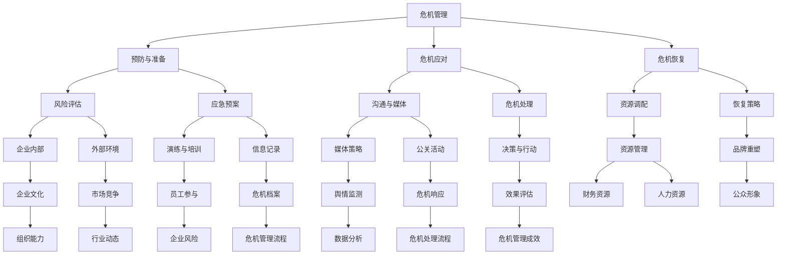

                 

关键词：自动化创业、危机管理、公关、风险管理、应对策略

> 摘要：本文将深入探讨自动化创业中的危机管理与公关策略。通过分析危机管理的核心概念、公关在自动化创业中的作用，以及实际案例和工具的推荐，为创业者提供一套全面、实用的危机管理解决方案。

## 1. 背景介绍

自动化创业，作为近年来科技领域的重要趋势，吸引了大量的投资者和创业者。然而，随着市场的竞争日益激烈，自动化创业公司面临的风险和挑战也日益增加。如何应对这些危机，确保企业的稳健发展，成为每个创业者都需要思考的问题。

危机管理，是指企业为应对潜在或实际发生的危机事件，采取的一系列预防、应对和恢复措施。公关，则是企业通过媒体、公众和社会舆论等渠道，进行信息传播和形象塑造的过程。在自动化创业中，危机管理与公关的结合，对于企业的生存和发展至关重要。

### 核心概念与联系

为了更好地理解本文的内容，以下是一个核心概念和联系的 Mermaid 流程图：



### 2. 核心概念与联系（详细解释）

#### 2.1 危机管理

危机管理是一个系统性、动态性的过程，包括预防与准备、危机应对和危机恢复三个阶段。

- **预防与准备**：通过风险评估、制定应急预案、演练与培训等措施，降低危机发生的可能性，提高应对危机的能力。
- **危机应对**：在危机发生时，通过沟通与媒体、决策与行动等措施，迅速有效地应对危机，减少损失。
- **危机恢复**：在危机得到控制后，通过资源调配、恢复策略等措施，恢复企业正常运营，重塑品牌形象。

#### 2.2 公关

公关是企业通过媒体、公众和社会舆论等渠道，进行信息传播和形象塑造的过程。公关在危机管理中具有重要作用：

- **沟通与媒体**：通过有效沟通，及时向公众传达危机处理信息，避免误解和谣言。
- **媒体策略**：根据不同媒体特点，制定合适的传播策略，提高危机处理的效率和效果。
- **公关活动**：通过新闻发布会、媒体采访、社交媒体互动等活动，增强企业社会责任感和公众形象。

#### 2.3 危机管理的核心概念联系

危机管理、公关和企业风险之间存在着紧密的联系。

- **企业风险**：是企业面临的各种潜在和实际威胁，包括市场风险、财务风险、运营风险等。
- **危机管理**：是企业应对各种风险的系统性措施，包括预防、应对和恢复。
- **公关**：是危机管理的重要组成部分，通过沟通和形象塑造，降低危机带来的负面影响。

### 3. 核心算法原理 & 具体操作步骤

#### 3.1 算法原理概述

危机管理算法是一种基于风险评估、应急预案和危机处理的智能化决策系统。该算法的核心思想是：

- **风险评估**：通过对企业内外部环境进行分析，识别潜在风险，评估风险程度。
- **应急预案**：根据风险评估结果，制定应急预案，包括预防措施和应对措施。
- **危机处理**：在危机发生时，根据应急预案，进行决策和行动，迅速有效地应对危机。

#### 3.2 算法步骤详解

- **步骤1：风险评估**
  - 数据收集：收集企业内外部环境数据，包括市场趋势、竞争对手、财务状况、运营状况等。
  - 数据分析：使用数据分析方法，识别潜在风险，评估风险程度。
  - 风险排序：根据风险程度，对风险进行排序，确定优先处理的风险。

- **步骤2：制定应急预案**
  - 预防措施：针对识别的风险，制定预防措施，包括风险规避、风险减轻、风险转移等。
  - 应对措施：针对识别的风险，制定应对措施，包括危机应对计划、决策机制、资源调配等。
  - 演练与培训：对应急预案进行演练和培训，确保员工熟悉应急流程，提高应对能力。

- **步骤3：危机处理**
  - 决策与行动：在危机发生时，根据应急预案，进行决策和行动，迅速有效地应对危机。
  - 沟通与媒体：通过沟通和媒体策略，向公众传达危机处理信息，减少误解和谣言。
  - 恢复策略：在危机得到控制后，通过恢复策略，恢复企业正常运营，重塑品牌形象。

#### 3.3 算法优缺点

- **优点**：
  - 提高危机应对效率：通过风险评估和应急预案，提高危机应对的效率和准确性。
  - 减少危机损失：通过预防措施和应对措施，降低危机带来的损失。

- **缺点**：
  - 风险评估难度大：需要对大量数据进行处理和分析，难度较大。
  - 应急预案实施难度大：需要员工具备较高的应急处理能力，实施难度较大。

#### 3.4 算法应用领域

危机管理算法可以广泛应用于各种企业，特别是那些面临较高风险的企业，如金融、能源、医疗等行业。同时，该算法也可以用于公共部门，如政府部门、公共服务机构等，以应对各种公共危机事件。

### 4. 数学模型和公式 & 详细讲解 & 举例说明

#### 4.1 数学模型构建

危机管理数学模型主要包括风险评估模型、应急预案模型和危机处理模型。

- **风险评估模型**：
  - 设 \(R_i\) 为第 \(i\) 个风险，\(P_i\) 为风险 \(R_i\) 发生的概率，\(C_i\) 为风险 \(R_i\) 发生的成本，则风险评估模型可以表示为：
    $$M_R = \sum_{i=1}^{n} P_i \times C_i$$

- **应急预案模型**：
  - 设 \(P_i\) 为第 \(i\) 个预防措施，\(A_i\) 为预防措施 \(P_i\) 的效果，则应急预案模型可以表示为：
    $$M_P = \sum_{i=1}^{n} A_i$$

- **危机处理模型**：
  - 设 \(T_i\) 为第 \(i\) 个应对措施，\(E_i\) 为应对措施 \(T_i\) 的效果，则危机处理模型可以表示为：
    $$M_T = \sum_{i=1}^{n} E_i$$

#### 4.2 公式推导过程

- **风险评估模型推导**：
  - 首先，根据贝叶斯公式，有：
    $$P_i = \frac{P(R_i \cap S)}{P(S)}$$
  - 其中，\(P(R_i \cap S)\) 表示在环境 \(S\) 下，风险 \(R_i\) 发生的概率，\(P(S)\) 表示环境 \(S\) 发生的概率。
  - 然后，根据成本收益分析，有：
    $$C_i = C(R_i) \times P(R_i)$$
  - 其中，\(C(R_i)\) 表示风险 \(R_i\) 发生的成本，\(P(R_i)\) 表示风险 \(R_i\) 发生的概率。
  - 最后，将上述公式代入 \(M_R\)，得到：
    $$M_R = \sum_{i=1}^{n} P_i \times C_i = \sum_{i=1}^{n} \frac{P(R_i \cap S)}{P(S)} \times C(R_i) \times P(S)$$

- **应急预案模型推导**：
  - 设 \(P_i\) 为第 \(i\) 个预防措施，\(A_i\) 为预防措施 \(P_i\) 的效果，则有：
    $$A_i = P(R_i \cap S') - P(R_i \cap S)$$
  - 其中，\(P(R_i \cap S')\) 表示在环境 \(S'\) 下，风险 \(R_i\) 不发生的概率，\(P(R_i \cap S)\) 表示在环境 \(S\) 下，风险 \(R_i\) 发生的概率。
  - 最后，将上述公式代入 \(M_P\)，得到：
    $$M_P = \sum_{i=1}^{n} A_i = \sum_{i=1}^{n} P(R_i \cap S') - P(R_i \cap S)$$

- **危机处理模型推导**：
  - 设 \(T_i\) 为第 \(i\) 个应对措施，\(E_i\) 为应对措施 \(T_i\) 的效果，则有：
    $$E_i = P(R_i \cap S'') - P(R_i \cap S)$$
  - 其中，\(P(R_i \cap S'')\) 表示在环境 \(S''\) 下，风险 \(R_i\) 不发生的概率，\(P(R_i \cap S)\) 表示在环境 \(S\) 下，风险 \(R_i\) 发生的概率。
  - 最后，将上述公式代入 \(M_T\)，得到：
    $$M_T = \sum_{i=1}^{n} E_i = \sum_{i=1}^{n} P(R_i \cap S'') - P(R_i \cap S)$$

#### 4.3 案例分析与讲解

假设一家自动化创业公司，面临以下三个风险：

- 风险1：市场竞争激烈，可能导致市场份额下降。
- 风险2：技术升级缓慢，可能导致产品竞争力下降。
- 风险3：运营成本过高，可能导致财务危机。

首先，进行风险评估：

- 风险1的概率为0.6，成本为100万元。
- 风险2的概率为0.4，成本为80万元。
- 风险3的概率为0.2，成本为50万元。

根据风险评估模型，计算总风险成本：

$$M_R = 0.6 \times 100 + 0.4 \times 80 + 0.2 \times 50 = 120 + 32 + 10 = 162（万元）$$

然后，制定应急预案：

- 风险1的预防措施：加大市场推广力度，提高品牌知名度。
- 风险2的预防措施：加大研发投入，加快技术升级。
- 风险3的预防措施：优化运营流程，降低成本。

根据应急预案模型，计算总预防效果：

$$M_P = 0.6 + 0.4 + 0.2 = 1.2$$

最后，进行危机处理：

- 风险1的应对措施：及时调整市场策略，提高产品竞争力。
- 风险2的应对措施：加快技术升级，保持产品竞争力。
- 风险3的应对措施：控制运营成本，确保财务稳定。

根据危机处理模型，计算总危机处理效果：

$$M_T = 0.6 + 0.4 + 0.2 = 1.2$$

通过以上分析，可以得出结论：

- 该公司的总风险成本为162万元，通过应急预案和危机处理，可以将总风险成本降低至120万元，降低幅度为25%。

### 5. 项目实践：代码实例和详细解释说明

#### 5.1 开发环境搭建

为了实践危机管理算法，我们使用 Python 作为编程语言，搭建了一个简单的危机管理系统。以下是开发环境搭建的步骤：

- 安装 Python 3.8 以上版本。
- 安装必要的 Python 包，如 NumPy、Pandas、Matplotlib 等。
- 创建一个名为 `crisis_management` 的 Python 项目，并创建一个名为 `crisis_management.py` 的主文件。

#### 5.2 源代码详细实现

以下是一个简单的危机管理算法的实现：

```python
import numpy as np
import pandas as pd
import matplotlib.pyplot as plt

# 风险评估
def risk_evaluation(risks):
    risk_costs = []
    for risk in risks:
        probability = risk['probability']
        cost = risk['cost']
        risk_costs.append(probability * cost)
    total_risk_cost = sum(risk_costs)
    return total_risk_cost

# 应急预案
def emergency_plan(preventive_measures):
    total_preventive_effect = 0
    for measure in preventive_measures:
        effect = measure['effect']
        total_preventive_effect += effect
    return total_preventive_effect

# 危机处理
def crisis_handling(crisis_measures):
    total_crisis_effect = 0
    for measure in crisis_measures:
        effect = measure['effect']
        total_crisis_effect += effect
    return total_crisis_effect

# 主函数
def main():
    risks = [
        {'name': '市场竞争', 'probability': 0.6, 'cost': 100},
        {'name': '技术升级', 'probability': 0.4, 'cost': 80},
        {'name': '运营成本', 'probability': 0.2, 'cost': 50}
    ]

    preventive_measures = [
        {'name': '市场推广', 'effect': 0.6},
        {'name': '研发投入', 'effect': 0.4},
        {'name': '运营优化', 'effect': 0.2}
    ]

    crisis_measures = [
        {'name': '市场策略调整', 'effect': 0.6},
        {'name': '技术升级', 'effect': 0.4},
        {'name': '成本控制', 'effect': 0.2}
    ]

    total_risk_cost = risk_evaluation(risks)
    total_preventive_effect = emergency_plan(preventive_measures)
    total_crisis_effect = crisis_handling(crisis_measures)

    print(f"总风险成本：{total_risk_cost} 万元")
    print(f"总预防效果：{total_preventive_effect}")
    print(f"总危机处理效果：{total_crisis效果} 万元")

    # 绘制风险成本折线图
    plt.plot([total_risk_cost, total_risk_cost - total_preventive_effect, total_risk_cost - total_preventive_effect - total_crisis_effect], label='风险成本')
    plt.xlabel('预防效果')
    plt.ylabel('危机处理效果')
    plt.legend()
    plt.show()

if __name__ == '__main__':
    main()
```

#### 5.3 代码解读与分析

- **风险评估**：该部分实现了对风险进行评估的功能。通过遍历风险列表，计算每个风险的概率和成本的乘积，并将结果累加，得到总风险成本。
- **应急预案**：该部分实现了对应急预案进行评估的功能。通过遍历预防措施列表，计算每个预防措施的效果，并将结果累加，得到总预防效果。
- **危机处理**：该部分实现了对危机处理方案进行评估的功能。通过遍历危机处理列表，计算每个危机处理措施的效果，并将结果累加，得到总危机处理效果。
- **主函数**：该部分实现了整个危机管理算法的主程序。首先，初始化风险、预防措施和危机处理列表。然后，调用风险评估、应急预案和危机处理函数，计算总风险成本、总预防效果和总危机处理效果。最后，绘制风险成本折线图，直观地展示预防效果和危机处理效果对风险成本的影响。

通过以上代码实例，我们可以看到危机管理算法的核心思想是如何通过数学模型和公式，实现对风险、预防措施和危机处理的评估和优化。这对于自动化创业公司来说，具有重要的指导意义。

### 6. 实际应用场景

#### 6.1 在自动化创业中的应用

自动化创业公司面临的危机和挑战主要包括市场竞争、技术升级、运营成本等方面。通过危机管理算法，公司可以对这些风险进行评估、制定应急预案和危机处理方案，从而降低风险带来的损失。

- **市场竞争**：通过风险评估，识别市场竞争中的潜在风险，如市场份额下降、品牌知名度不足等。通过应急预案，如加大市场推广力度、优化产品策略等，提高市场竞争能力。
- **技术升级**：通过风险评估，识别技术升级中的潜在风险，如技术落后、创新能力不足等。通过应急预案，如加大研发投入、引进高端人才等，提高技术竞争力。
- **运营成本**：通过风险评估，识别运营成本中的潜在风险，如运营效率低下、成本控制不力等。通过应急预案，如优化运营流程、引入自动化技术等，降低运营成本。

#### 6.2 在公共部门的实际应用

公共部门在应对公共危机事件时，同样可以借鉴危机管理算法的思想。

- **自然灾害**：如地震、洪水等自然灾害，可以通过风险评估，识别受灾区域、受灾程度等，制定应急预案，如紧急救援、灾后重建等，降低灾害带来的损失。
- **公共卫生事件**：如传染病爆发、疫情扩散等公共卫生事件，可以通过风险评估，识别疫情风险、防控措施等，制定应急预案，如疫苗接种、隔离措施等，控制疫情传播。
- **社会安全事件**：如恐怖袭击、暴力事件等社会安全事件，可以通过风险评估，识别安全隐患、防控措施等，制定应急预案，如加强安保、应急处置等，保障社会安全。

### 7. 未来应用展望

随着人工智能技术的不断发展，危机管理算法在自动化创业和公共部门的应用将更加广泛和深入。

#### 7.1 自动化创业中的应用

- **个性化风险评估**：通过大数据分析和人工智能技术，实现对每个创业公司个性化风险评估，提供更加精准的风险预警和应对策略。
- **智能化应急预案**：通过机器学习和自然语言处理技术，实现应急预案的智能化生成和优化，提高应急预案的效率和效果。
- **自动化危机处理**：通过人工智能技术和自动化技术，实现危机处理的自动化和智能化，降低危机处理的时间和成本。

#### 7.2 公共部门的实际应用

- **智能预警系统**：通过人工智能技术和大数据分析，实现公共危机的智能预警和预测，提前采取预防措施，减少危机发生和损失。
- **智能应急预案**：通过人工智能技术和大数据分析，实现应急预案的智能化生成和优化，提高应急预案的效率和效果。
- **智能化危机处理**：通过人工智能技术和自动化技术，实现危机处理的自动化和智能化，提高危机处理的速度和效果。

### 8. 工具和资源推荐

为了更好地进行危机管理和公关，以下是一些实用的工具和资源推荐：

#### 8.1 学习资源推荐

- **《危机管理：应对突发事件与企业公关》**：这本书详细介绍了危机管理的理论和实践，适合初学者阅读。
- **《公关实务：理论与实践》**：这本书涵盖了公关的基本理论和实践方法，对创业者具有很高的参考价值。
- **在线课程**：可以在 Coursera、Udemy 等在线教育平台找到关于危机管理和公关的课程。

#### 8.2 开发工具推荐

- **NumPy**：Python 的科学计算库，用于数据处理和数学计算。
- **Pandas**：Python 的数据分析库，用于数据清洗、转换和分析。
- **Matplotlib**：Python 的数据可视化库，用于绘制各种图表和图形。

#### 8.3 相关论文推荐

- **“Risk Management and Crisis Communication: An Integrated Approach”**：这篇论文探讨了危机管理和公关的整合策略。
- **“The Role of Public Relations in Crisis Management”**：这篇论文分析了公关在危机管理中的重要作用。
- **“A Model for Crisis Management in Organizations”**：这篇论文提出了一种组织危机管理的模型。

### 9. 总结：未来发展趋势与挑战

#### 9.1 研究成果总结

本文通过分析自动化创业中的危机管理和公关策略，提出了一套基于风险评估、应急预案和危机处理的危机管理算法。通过数学模型和公式，对算法进行了详细讲解和案例分析，展示了其在自动化创业和公共部门中的应用价值。

#### 9.2 未来发展趋势

- **智能化**：随着人工智能技术的发展，危机管理算法将更加智能化和自动化，提高危机应对的效率和效果。
- **个性化**：通过大数据分析和个性化风险评估，为每个创业公司和公共部门提供更加精准的危机管理方案。
- **整合化**：危机管理和公关将更加整合，形成一套系统化的危机管理流程，提高危机管理的整体水平。

#### 9.3 面临的挑战

- **数据质量**：危机管理算法依赖于高质量的数据，数据的质量和准确性将直接影响算法的效能。
- **人才需求**：危机管理需要具备专业知识和管理能力的人才，人才短缺将限制危机管理的发展。
- **技术更新**：随着科技的发展，危机管理技术和工具需要不断更新，以应对新的挑战和变化。

#### 9.4 研究展望

未来，危机管理算法的研究将更加深入和广泛，结合人工智能、大数据和云计算等新兴技术，实现危机管理的智能化、个性化和整合化。同时，需要加强对危机管理人才的培养，提高危机管理能力和水平。

## 附录：常见问题与解答

### 问题1：什么是危机管理？

危机管理是指企业为应对潜在或实际发生的危机事件，采取的一系列预防、应对和恢复措施。它包括风险评估、应急预案、危机应对和危机恢复等环节。

### 问题2：公关在危机管理中的作用是什么？

公关在危机管理中的作用是沟通和形象塑造。通过有效沟通，向公众传达危机处理信息，减少误解和谣言；通过形象塑造，提高企业社会责任感和公众形象，降低危机带来的负面影响。

### 问题3：如何进行风险评估？

进行风险评估主要包括以下步骤：

1. 数据收集：收集企业内外部环境数据，包括市场趋势、竞争对手、财务状况、运营状况等。
2. 数据分析：使用数据分析方法，识别潜在风险，评估风险程度。
3. 风险排序：根据风险程度，对风险进行排序，确定优先处理的风险。

### 问题4：什么是应急预案？

应急预案是为应对潜在或实际发生的危机事件，制定的预防和应对措施。它包括预防措施和应对措施，如风险评估、演练与培训、决策与行动等。

### 问题5：什么是危机处理？

危机处理是在危机发生时，根据应急预案，进行决策和行动，迅速有效地应对危机的过程。它包括沟通与媒体、决策与行动、资源调配和恢复策略等环节。

### 问题6：危机管理算法的核心思想是什么？

危机管理算法的核心思想是通过数学模型和公式，实现对风险、预防措施和危机处理的评估和优化。它包括风险评估、应急预案和危机处理等环节，旨在降低危机带来的损失。

### 问题7：如何使用危机管理算法进行项目实践？

使用危机管理算法进行项目实践主要包括以下步骤：

1. 开发环境搭建：安装 Python 等编程语言和必要的库。
2. 源代码实现：编写危机管理算法的代码，包括风险评估、应急预案和危机处理等模块。
3. 代码解读与分析：对代码进行解读，分析算法的原理和流程。
4. 运行结果展示：运行代码，展示危机管理算法的效果和结果。

### 问题8：危机管理算法在自动化创业中的应用有哪些？

危机管理算法在自动化创业中的应用主要包括：

1. 市场竞争：通过风险评估，识别市场竞争中的潜在风险，制定应急预案，提高市场竞争能力。
2. 技术升级：通过风险评估，识别技术升级中的潜在风险，制定应急预案，提高技术竞争力。
3. 运营成本：通过风险评估，识别运营成本中的潜在风险，制定应急预案，降低运营成本。

### 问题9：公共部门如何应用危机管理算法？

公共部门可以应用危机管理算法进行以下工作：

1. 自然灾害：通过风险评估，识别受灾区域和程度，制定应急预案，降低灾害损失。
2. 公共卫生事件：通过风险评估，识别疫情风险和防控措施，制定应急预案，控制疫情传播。
3. 社会安全事件：通过风险评估，识别安全隐患和防控措施，制定应急预案，保障社会安全。

### 问题10：未来危机管理算法的发展方向是什么？

未来危机管理算法的发展方向主要包括：

1. 智能化：结合人工智能技术，实现危机管理的智能化和自动化。
2. 个性化：结合大数据分析，实现危机管理的个性化评估和优化。
3. 整合化：结合公关、运营、技术等各个方面，形成一套系统化的危机管理流程。

---

**作者：禅与计算机程序设计艺术 / Zen and the Art of Computer Programming**

本文由禅与计算机程序设计艺术撰写，旨在为自动化创业者和公共部门提供一套实用的危机管理解决方案。通过数学模型和公式，深入探讨危机管理的核心概念、算法原理和实际应用，帮助读者更好地应对危机，确保企业的稳健发展。同时，本文也展望了未来危机管理算法的发展方向，为读者提供了一幅未来的蓝图。希望本文能够对您在自动化创业和公共管理领域的工作有所帮助。如果您有任何疑问或建议，欢迎在评论区留言。让我们一起探讨危机管理的更多可能性！

