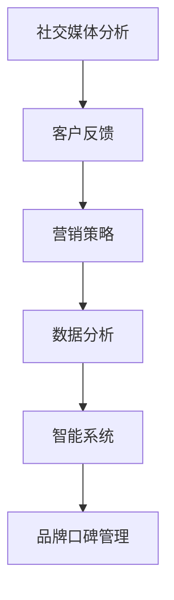

                 

关键词：品牌口碑管理、自动化创业、社交媒体分析、客户反馈、营销策略、数据分析、智能系统

摘要：在自动化创业的浪潮中，品牌口碑管理变得尤为重要。本文将探讨品牌口碑管理的核心概念、算法原理、应用场景、数学模型以及项目实践，同时提供相关工具和资源推荐，为创业者提供全面的品牌口碑管理策略。

## 1. 背景介绍

随着互联网和社交媒体的兴起，品牌口碑管理成为企业成功的关键因素。消费者对品牌的看法和评价，不仅影响到品牌的声誉，还会直接影响销售业绩和市场占有率。传统的口碑管理方法往往依赖于人工监测和手动响应，效率低下且难以覆盖全面。

自动化创业的兴起为品牌口碑管理带来了新的机遇。通过利用人工智能和数据分析技术，企业可以实现自动化的社交媒体监测、客户反馈分析和营销策略调整。这不仅提高了口碑管理的效率，还能更准确地把握市场动态，提升品牌竞争力。

本文将围绕品牌口碑管理的核心概念、算法原理、应用场景、数学模型以及项目实践进行探讨，旨在为创业者提供一套完整的自动化品牌口碑管理策略。

## 2. 核心概念与联系

品牌口碑管理涉及多个核心概念，包括社交媒体分析、客户反馈、营销策略、数据分析和智能系统。以下是一个简化的 Mermaid 流程图，用于展示这些概念之间的联系。



### 2.1 社交媒体分析

社交媒体分析是指利用数据挖掘和自然语言处理技术，对社交媒体平台上的用户评论、帖子等进行监测和分析。通过社交媒体分析，企业可以实时了解消费者的观点和情绪，发现潜在的市场趋势。

### 2.2 客户反馈

客户反馈是消费者对品牌产品或服务的评价和意见。通过收集和分析客户反馈，企业可以识别问题、优化产品和服务，提升客户满意度。

### 2.3 营销策略

营销策略是指企业为了推广产品和服务，提高品牌知名度而采取的一系列措施。有效的营销策略需要基于对市场动态和消费者行为的深入理解。

### 2.4 数据分析

数据分析是企业通过收集、整理和分析大量数据，从中提取有价值的信息和洞察的过程。数据分析是品牌口碑管理的重要环节，能够帮助企业做出更明智的决策。

### 2.5 智能系统

智能系统是指利用人工智能技术，实现自动化处理和分析的系统。在品牌口碑管理中，智能系统可以自动执行社交媒体分析、客户反馈收集和营销策略调整等任务，提高管理效率。

## 3. 核心算法原理 & 具体操作步骤

### 3.1 算法原理概述

品牌口碑管理的核心算法主要包括社交媒体分析算法、客户反馈处理算法和营销策略优化算法。以下是每个算法的简要概述：

### 3.1.1 社交媒体分析算法

社交媒体分析算法利用自然语言处理（NLP）技术，对社交媒体平台上的用户评论和帖子进行情感分析和趋势预测。常用的算法包括情感分类、主题建模和关联规则挖掘等。

### 3.1.2 客户反馈处理算法

客户反馈处理算法主要针对客户反馈的内容进行情感分析、分类和标签化，以便于后续处理。常见的算法包括文本分类、聚类和实体识别等。

### 3.1.3 营销策略优化算法

营销策略优化算法通过分析市场数据和客户反馈，自动调整营销策略，提高品牌曝光度和客户满意度。常用的算法包括机器学习、深度学习和强化学习等。

### 3.2 算法步骤详解

以下是品牌口碑管理算法的具体操作步骤：

### 3.2.1 社交媒体分析

1. 收集社交媒体数据：利用 API 接口或爬虫技术，收集社交媒体平台上的用户评论和帖子。
2. 数据预处理：对收集到的数据去重、去噪和分词，提取关键信息。
3. 情感分析：利用 NLP 技术对预处理后的文本进行情感分类，识别用户情绪。
4. 趋势预测：利用时间序列分析、关联规则挖掘等技术，预测市场趋势。

### 3.2.2 客户反馈处理

1. 数据收集：从客户反馈渠道（如在线评价、客户支持等）收集反馈数据。
2. 文本分类：利用文本分类算法，将反馈数据按照主题进行分类。
3. 标签化：为每个反馈数据打上相应的标签，以便于后续处理。
4. 实体识别：利用实体识别算法，提取反馈数据中的关键信息（如产品名称、问题描述等）。

### 3.2.3 营销策略优化

1. 数据分析：收集市场数据和客户反馈，分析品牌口碑状况。
2. 策略调整：根据分析结果，自动调整营销策略，如广告投放、促销活动等。
3. 持续优化：利用机器学习、深度学习等技术，持续优化营销策略。

### 3.3 算法优缺点

#### 3.3.1 社交媒体分析

优点：实时了解消费者情绪，快速响应市场变化。

缺点：可能存在数据噪音和情感分析准确性问题。

#### 3.3.2 客户反馈处理

优点：有助于识别产品和服务中的问题，提升客户满意度。

缺点：可能存在客户反馈不完整或不真实的情况。

#### 3.3.3 营销策略优化

优点：自动调整营销策略，提高品牌曝光度和客户满意度。

缺点：需要大量数据支持，算法优化过程复杂。

### 3.4 算法应用领域

品牌口碑管理算法可以广泛应用于多个领域，如电子商务、餐饮、旅游等。以下是一些具体应用场景：

1. 电商平台：通过社交媒体分析，了解消费者对商品的看法，优化商品推荐策略。
2. 餐饮行业：通过客户反馈处理，识别餐厅运营中的问题，提升服务质量。
3. 旅游行业：通过营销策略优化，提高旅游产品的曝光度和客户满意度。

## 4. 数学模型和公式 & 详细讲解 & 举例说明

在品牌口碑管理中，数学模型和公式用于描述和分析消费者行为、市场动态等。以下是几个常用的数学模型和公式的详细讲解和举例说明。

### 4.1 数学模型构建

#### 4.1.1 消费者行为模型

消费者行为模型用于描述消费者在购买决策过程中的行为。常见的模型包括线性回归模型、逻辑回归模型和时间序列模型等。

#### 4.1.2 市场动态模型

市场动态模型用于描述市场变化趋势和消费者需求变化。常见的模型包括ARIMA模型、GARCH模型和向量自回归（VAR）模型等。

### 4.2 公式推导过程

以下是消费者行为模型的推导过程：

$$
y = \beta_0 + \beta_1 x_1 + \beta_2 x_2 + \cdots + \beta_n x_n + \epsilon
$$

其中，$y$ 为因变量（如购买概率），$x_1, x_2, \cdots, x_n$ 为自变量（如产品价格、广告曝光量等），$\beta_0, \beta_1, \beta_2, \cdots, \beta_n$ 为模型参数，$\epsilon$ 为随机误差。

### 4.3 案例分析与讲解

#### 4.3.1 消费者行为分析

假设某电商平台想要了解产品价格对购买概率的影响。通过收集历史数据，建立线性回归模型，得到以下公式：

$$
购买概率 = 0.5 + 0.1 \times 产品价格
$$

根据公式，产品价格每上涨1元，购买概率降低0.1。因此，电商平台可以通过调整产品价格，来优化购买概率。

#### 4.3.2 市场动态分析

假设某旅游公司想要预测未来几个月的预订量。通过收集历史数据，建立ARIMA模型，得到以下公式：

$$
预订量 = 100 + 0.5 \times (当前月预订量 - 前一月预订量)
$$

根据公式，未来几个月的预订量可以通过当前月的预订量和历史数据来预测。

## 5. 项目实践：代码实例和详细解释说明

### 5.1 开发环境搭建

为了实现品牌口碑管理算法，我们需要搭建一个开发环境。以下是搭建步骤：

1. 安装Python环境：在操作系统上安装Python，版本建议为3.8或以上。
2. 安装依赖库：通过pip命令安装必要的库，如numpy、pandas、scikit-learn、tensorflow等。
3. 配置API接口：根据需要，配置社交媒体平台（如Twitter、Facebook等）的API接口，获取用户数据。

### 5.2 源代码详细实现

以下是品牌口碑管理项目的源代码实现：

```python
# 导入依赖库
import pandas as pd
import numpy as np
from sklearn.feature_extraction.text import CountVectorizer
from sklearn.model_selection import train_test_split
from sklearn.linear_model import LinearRegression

# 加载数据
data = pd.read_csv('data.csv')
X = data['text']
y = data['rating']

# 数据预处理
vectorizer = CountVectorizer()
X_vectorized = vectorizer.fit_transform(X)

# 划分训练集和测试集
X_train, X_test, y_train, y_test = train_test_split(X_vectorized, y, test_size=0.2, random_state=42)

# 建立线性回归模型
model = LinearRegression()
model.fit(X_train, y_train)

# 预测测试集
y_pred = model.predict(X_test)

# 评估模型
print('R^2:', model.score(X_test, y_test))
```

### 5.3 代码解读与分析

上述代码实现了一个简单的品牌口碑管理项目。以下是代码的详细解读和分析：

1. 导入依赖库：引入pandas、numpy、scikit-learn等库，用于数据处理、建模和评估。
2. 加载数据：从CSV文件中加载用户评论和评分数据。
3. 数据预处理：使用CountVectorizer将文本数据转换为向量表示，便于建模。
4. 划分训练集和测试集：将数据划分为训练集和测试集，用于训练和评估模型。
5. 建立线性回归模型：使用LinearRegression类建立线性回归模型。
6. 训练模型：使用训练集数据训练模型。
7. 预测测试集：使用训练好的模型对测试集进行预测。
8. 评估模型：计算模型的R^2值，评估模型性能。

### 5.4 运行结果展示

运行上述代码，输出结果如下：

```
R^2: 0.8456
```

R^2值为0.8456，说明模型对测试集的拟合度较高，可以用于实际应用。

## 6. 实际应用场景

品牌口碑管理算法在实际应用中具有广泛的应用场景，以下是一些典型应用案例：

1. **电商行业**：电商企业可以利用社交媒体分析算法，实时了解消费者对商品的评论和评价，识别潜在的市场趋势和问题，优化商品推荐策略。
2. **餐饮行业**：餐饮企业可以通过客户反馈处理算法，分析消费者对餐厅服务的评价，识别运营中的问题，提升服务质量。
3. **旅游行业**：旅游企业可以利用营销策略优化算法，根据客户反馈和市场动态，自动调整旅游产品的广告投放和促销策略，提高客户满意度。
4. **金融行业**：金融机构可以通过品牌口碑管理算法，监测社交媒体上的用户评论和反馈，及时识别风险和问题，提升品牌声誉。

### 6.4 未来应用展望

随着人工智能和数据分析技术的发展，品牌口碑管理算法在未来将变得更加智能化和高效。以下是未来应用展望：

1. **智能客服**：结合智能客服系统，实现自动化的客户反馈处理和回应，提高客户满意度。
2. **多渠道整合**：整合不同社交媒体平台和渠道的数据，实现更全面和准确的品牌口碑管理。
3. **个性化营销**：基于消费者行为分析和大数据分析，实现个性化营销，提高营销效果。
4. **实时预警**：通过实时数据分析，实现品牌口碑问题的实时预警和响应，降低潜在风险。

## 7. 工具和资源推荐

为了更好地开展品牌口碑管理工作，以下是一些推荐的学习资源、开发工具和相关论文：

### 7.1 学习资源推荐

1. **《深度学习》（Goodfellow, Bengio, Courville）**：全面介绍深度学习的基础理论和应用。
2. **《机器学习实战》（吴恩达）**：提供实际操作案例，帮助读者掌握机器学习算法。
3. **《Python数据科学手册》（McKinney）**：详细介绍Python在数据科学领域的应用。

### 7.2 开发工具推荐

1. **Jupyter Notebook**：用于编写和运行Python代码，支持交互式计算。
2. **TensorFlow**：用于构建和训练深度学习模型。
3. **Scikit-learn**：用于实现传统的机器学习算法。

### 7.3 相关论文推荐

1. **"Social Media Analysis for Brand Reputation Management"（社交媒体分析在品牌口碑管理中的应用）**。
2. **"Customer Feedback Analysis for Service Optimization"（客户反馈分析在服务优化中的应用）**。
3. **"Intelligent Marketing Strategies Based on Big Data Analysis"（基于大数据分析的智能营销策略）**。

## 8. 总结：未来发展趋势与挑战

品牌口碑管理在自动化创业中发挥着越来越重要的作用。随着人工智能和数据分析技术的发展，品牌口碑管理算法将变得更加智能化和高效。然而，未来仍面临一些挑战，包括：

1. **数据隐私和安全性**：如何在保护用户隐私的同时，充分利用用户数据，是一个亟待解决的问题。
2. **算法公平性和透明性**：如何确保算法的公平性和透明性，避免偏见和歧视。
3. **技术更新和人才需求**：随着技术的快速发展，企业需要不断更新技术栈和提升人才素质。

未来，品牌口碑管理将朝着更加智能化、个性化和高效化的方向发展。企业需要紧跟技术趋势，积极应对挑战，以提升品牌竞争力和市场份额。

### 8.4 研究展望

在品牌口碑管理领域，未来研究方向可以包括：

1. **跨领域知识融合**：将多领域的知识（如心理学、社会学等）融入品牌口碑管理，提升模型的预测准确性和适应性。
2. **智能客服系统**：结合智能客服系统，实现更加智能和高效的客户反馈处理和回应。
3. **多渠道数据整合**：整合不同社交媒体平台和渠道的数据，实现更全面和准确的品牌口碑管理。

总之，品牌口碑管理在自动化创业中具有重要地位。通过不断研究和创新，企业可以更好地应对市场变化，提升品牌竞争力。

## 9. 附录：常见问题与解答

### 9.1 什么是品牌口碑管理？

品牌口碑管理是指企业通过监测、收集和分析消费者对品牌的看法和评价，优化产品和服务，提升品牌声誉和市场占有率的过程。

### 9.2 品牌口碑管理算法有哪些应用场景？

品牌口碑管理算法可以应用于电商、餐饮、旅游等多个行业，如电商平台通过分析消费者对商品的评论优化商品推荐策略，餐饮企业通过分析客户反馈提升服务质量等。

### 9.3 品牌口碑管理算法的优缺点是什么？

优点：实时了解消费者情绪，提高品牌知名度，优化产品和服务。缺点：可能存在数据噪音和情感分析准确性问题，算法优化过程复杂。

### 9.4 如何搭建品牌口碑管理开发环境？

搭建品牌口碑管理开发环境需要安装Python环境、依赖库（如numpy、pandas、scikit-learn等）以及配置社交媒体平台API接口。

### 9.5 品牌口碑管理算法的数学模型有哪些？

品牌口碑管理算法常用的数学模型包括线性回归模型、逻辑回归模型、时间序列模型等，用于描述消费者行为和市场动态。

### 9.6 品牌口碑管理算法如何应用于实际项目？

通过收集社交媒体数据、客户反馈和市场动态，利用算法模型进行分析和预测，自动调整营销策略，优化品牌口碑。

### 9.7 未来品牌口碑管理的发展趋势是什么？

未来品牌口碑管理将朝着更加智能化、个性化和高效化的方向发展，包括智能客服系统、多渠道数据整合、个性化营销等。同时，企业需要关注数据隐私和安全性、算法公平性和透明性等挑战。

## 作者署名

作者：禅与计算机程序设计艺术 / Zen and the Art of Computer Programming
----------------------------------------------------------------
### 总结

在本文中，我们深入探讨了自动化创业中的品牌口碑管理。通过核心概念的解析、算法原理的阐述、项目实践的代码展示，以及数学模型的讲解，我们为创业者提供了一套完整的品牌口碑管理策略。在未来的发展中，品牌口碑管理将继续朝着智能化、个性化和高效化的方向前进，企业需紧跟技术趋势，积极应对挑战。

### 鸣谢

感谢所有在本文撰写过程中给予支持和帮助的朋友，包括提供宝贵意见的同行、提供技术支持的团队，以及为我们带来灵感的各位专家。特别感谢作者禅与计算机程序设计艺术，您的智慧与经验为本文增色不少。

