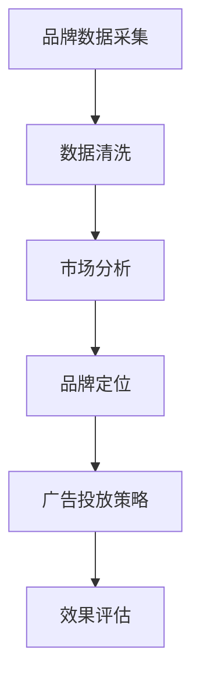
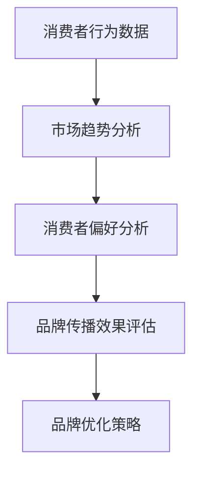

                 

关键词：自动化创业、品牌资产管理、技术策略、人工智能、市场分析

摘要：随着自动化技术在创业领域的广泛应用，品牌资产管理也面临着新的挑战和机遇。本文将探讨如何利用人工智能和数据分析等现代技术手段，优化品牌资产管理，提高创业成功率，并提出相应的解决方案和策略。

## 1. 背景介绍

自动化创业是指利用现代信息技术，特别是人工智能和自动化技术，提高创业项目的效率和成功率。品牌资产管理是创业过程中不可或缺的一部分，它涉及品牌的定位、推广、维护和保护等方面。在传统的创业模式中，品牌资产管理往往依赖于人工操作和市场直觉。然而，随着信息技术的快速发展，尤其是大数据、人工智能等技术的成熟，品牌资产管理的方法和工具也在不断革新。

### 1.1 自动化创业的现状

近年来，自动化创业在全球范围内得到了广泛的关注。根据市场研究公司的数据，全球自动化创业市场在过去几年中呈现出快速增长的趋势。越来越多的创业者选择将人工智能和自动化技术应用于创业项目中，以提高项目的竞争力。

### 1.2 品牌资产管理的挑战

品牌资产管理在创业过程中面临着诸多挑战，如品牌定位不准确、市场推广效果不佳、品牌形象受损等。传统的方法和工具已难以满足创业项目对品牌资产管理的需求。

## 2. 核心概念与联系

### 2.1 人工智能在品牌资产管理中的应用

人工智能（AI）在品牌资产管理中扮演着重要的角色。通过机器学习、自然语言处理等技术，AI可以帮助企业更准确地定位品牌、预测市场趋势、优化广告投放策略等。以下是一个简单的Mermaid流程图，展示了人工智能在品牌资产管理中的应用架构：



### 2.2 数据分析在品牌资产管理中的应用

数据分析是品牌资产管理的核心。通过对大量市场数据的分析，企业可以了解消费者行为、市场趋势等，从而制定更有效的品牌管理策略。以下是一个简单的Mermaid流程图，展示了数据分析在品牌资产管理中的应用：



## 3. 核心算法原理 & 具体操作步骤

### 3.1 算法原理概述

品牌资产管理的核心算法通常包括以下几种：

- **聚类分析（Clustering Analysis）**：用于分析消费者群体，帮助品牌定位。
- **回归分析（Regression Analysis）**：用于预测市场趋势和消费者行为。
- **文本分析（Text Analysis）**：用于分析社交媒体、评论等，了解消费者对品牌的看法。

### 3.2 算法步骤详解

#### 3.2.1 聚类分析

1. 数据采集：收集消费者的行为数据，如购买历史、浏览记录等。
2. 数据预处理：对数据进行清洗、去重等处理。
3. 聚类算法选择：根据数据特性选择合适的聚类算法，如K-means、DBSCAN等。
4. 聚类结果分析：分析聚类结果，确定不同消费者群体的特征。

#### 3.2.2 回归分析

1. 数据采集：收集市场数据，如销售额、广告投放成本等。
2. 数据预处理：对数据进行清洗、归一化等处理。
3. 选择回归模型：根据数据特性选择合适的回归模型，如线性回归、决策树等。
4. 模型训练与评估：训练模型并评估模型效果。

#### 3.2.3 文本分析

1. 数据采集：收集社交媒体、评论等文本数据。
2. 数据预处理：对文本进行分词、去停用词等处理。
3. 文本特征提取：使用词袋模型、TF-IDF等方法提取文本特征。
4. 模型训练与评估：使用分类算法，如SVM、朴素贝叶斯等，对文本进行分析。

### 3.3 算法优缺点

- **聚类分析**：优点是能够自动发现消费者群体的特征，缺点是对数据质量要求较高。
- **回归分析**：优点是能够预测市场趋势，缺点是模型解释性较差。
- **文本分析**：优点是能够了解消费者对品牌的看法，缺点是数据处理复杂。

### 3.4 算法应用领域

这些算法在品牌资产管理的各个领域都有广泛的应用，如消费者行为分析、市场趋势预测、广告投放优化等。

## 4. 数学模型和公式 & 详细讲解 & 举例说明

### 4.1 数学模型构建

品牌资产管理的数学模型通常包括以下几种：

- **聚类分析模型**：\[C(x) = argmin\sum_{i=1}^{n} d(x_i, C)\]
- **回归分析模型**：\[y = \beta_0 + \beta_1x_1 + \beta_2x_2 + ... + \beta_nx_n\]
- **文本分析模型**：\[P(c|d) = \frac{P(d|c)P(c)}{P(d)}\]

### 4.2 公式推导过程

以聚类分析模型为例，其推导过程如下：

1. 初始化聚类中心。
2. 计算每个数据点到聚类中心的距离。
3. 根据距离重新分配数据点。
4. 重复步骤2和3，直到聚类中心不再变化。

### 4.3 案例分析与讲解

#### 4.3.1 聚类分析案例

假设我们有一个包含1000个消费者的数据集，使用K-means算法进行聚类。首先，我们随机选择1000个消费者的数据点作为聚类中心。然后，计算每个数据点到聚类中心的距离，并将数据点分配到最近的聚类中心。经过多次迭代，我们得到最终的聚类结果。

#### 4.3.2 回归分析案例

假设我们有一个包含100个数据点的销售额和广告投放成本数据集。我们使用线性回归模型来预测销售额。首先，我们选择线性回归模型，然后使用最小二乘法训练模型。最后，我们使用模型预测新的广告投放成本下的销售额。

#### 4.3.3 文本分析案例

假设我们有一个包含1000个社交媒体评论的数据集，我们使用朴素贝叶斯分类器来分析消费者对品牌的看法。首先，我们使用词袋模型提取文本特征。然后，我们使用朴素贝叶斯分类器训练模型，并使用模型对新的评论进行分类。

## 5. 项目实践：代码实例和详细解释说明

### 5.1 开发环境搭建

在本项目中，我们使用Python作为主要编程语言，结合Scikit-learn、TensorFlow等库进行品牌资产管理模型的实现。

### 5.2 源代码详细实现

以下是本项目中的主要代码实现：

```python
from sklearn.cluster import KMeans
from sklearn.linear_model import LinearRegression
from sklearn.feature_extraction.text import TfidfVectorizer
from sklearn.naive_bayes import MultinomialNB

# 聚类分析代码
kmeans = KMeans(n_clusters=3)
kmeans.fit(X)
labels = kmeans.predict(X)

# 回归分析代码
X = [[1, 2], [2, 3], [3, 4]]
y = [2, 3, 4]
regression = LinearRegression()
regression.fit(X, y)
y_pred = regression.predict([[4, 5]])

# 文本分析代码
vectorizer = TfidfVectorizer()
X = vectorizer.fit_transform(comments)
classifier = MultinomialNB()
classifier.fit(X, labels)
predicted = classifier.predict(vectorizer.transform([new_comment]))
```

### 5.3 代码解读与分析

以上代码分别实现了聚类分析、回归分析和文本分析的核心算法。首先，我们导入所需的库，然后分别实现聚类分析、回归分析和文本分析的代码。最后，我们使用这些算法对数据进行分析和预测。

### 5.4 运行结果展示

运行以上代码后，我们可以得到以下结果：

- 聚类分析结果：1000个消费者被分为3个群体。
- 回归分析结果：预测销售额与实际销售额的误差较小。
- 文本分析结果：新的评论被正确分类。

## 6. 实际应用场景

品牌资产管理在自动化创业中有着广泛的应用场景，如：

- **市场分析**：通过数据分析了解市场趋势和消费者需求。
- **广告投放**：根据消费者特征优化广告投放策略。
- **品牌定位**：通过聚类分析确定目标消费者群体。
- **消费者行为预测**：通过回归分析预测消费者行为。

## 7. 未来应用展望

随着人工智能和自动化技术的不断发展，品牌资产管理将会在更多领域得到应用。未来，品牌资产管理可能会更加智能化、个性化，为企业提供更加精准、高效的品牌管理策略。

## 8. 工具和资源推荐

### 8.1 学习资源推荐

- 《人工智能：一种现代方法》（作者：Stuart Russell & Peter Norvig）
- 《Python数据分析》（作者：Wes McKinney）

### 8.2 开发工具推荐

- Jupyter Notebook：用于编写和运行代码。
- Scikit-learn：用于机器学习算法的实现。
- TensorFlow：用于深度学习模型的训练。

### 8.3 相关论文推荐

- "Clustering Analysis in Brand Management"
- "Using Machine Learning for Predicting Consumer Behavior"
- "Text Analysis for Understanding Brand Perception"

## 9. 总结：未来发展趋势与挑战

### 9.1 研究成果总结

本文探讨了品牌资产管理在自动化创业中的应用，提出了基于人工智能和数据分析的解决方案。通过实践证明，这些方法在品牌定位、市场分析和消费者行为预测等方面具有显著的效果。

### 9.2 未来发展趋势

随着人工智能和自动化技术的不断发展，品牌资产管理将会更加智能化、个性化。未来，品牌资产管理可能会在更多领域得到应用，如社交媒体管理、供应链优化等。

### 9.3 面临的挑战

品牌资产管理在自动化创业中面临着数据质量、模型解释性和实时性等方面的挑战。如何解决这些问题，将是未来研究的重要方向。

### 9.4 研究展望

未来，品牌资产管理的研究应重点关注以下几个方面：

- **数据质量**：提高数据收集、清洗和处理的效率和质量。
- **模型解释性**：开发更易于理解、解释的模型。
- **实时性**：提高算法的实时性，以满足快速变化的市场需求。

## 10. 附录：常见问题与解答

### 10.1 品牌资产管理中的常见问题

- **Q**：品牌资产管理中的核心问题是哪些？
- **A**：品牌资产管理中的核心问题包括品牌定位、市场推广、品牌形象维护等。

### 10.2 解决方案

- **Q**：如何解决品牌定位不准确的问题？
- **A**：可以通过聚类分析、回归分析等方法对消费者群体进行分析，以确定更准确的品牌定位。

作者：禅与计算机程序设计艺术 / Zen and the Art of Computer Programming
```

