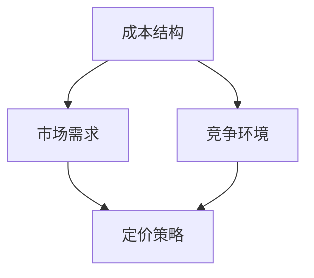

                 

 关键词：自动化创业、定价模型、机器学习、算法优化、商业策略、创新思维

> 摘要：本文旨在探讨自动化创业中定价模型的重要性，分析现有定价模型的局限性，并介绍一种创新的定价模型及其在商业实践中的应用。通过深入剖析定价模型的数学原理、算法实现以及实际案例，本文旨在为创业者提供有价值的定价策略，助力其在竞争激烈的市场中脱颖而出。

## 1. 背景介绍

### 自动化创业的兴起

随着互联网、大数据、人工智能等技术的飞速发展，自动化创业成为近年来的一大热点。自动化创业不仅提高了企业的运营效率，还降低了运营成本，使创业者能够更加专注于核心业务的创新与发展。然而，成功的自动化创业离不开精准的市场定位和有效的定价策略。

### 定价模型的重要性

定价模型是自动化创业中至关重要的一环。一个合适的定价模型可以帮助企业实现收益最大化、客户满意度提高以及市场份额的扩大。然而，现有的定价模型往往存在一定的局限性，难以适应快速变化的市场环境。

### 现有定价模型的局限性

1. **静态定价模型**：传统的静态定价模型（如成本加成定价法、市场定价法等）难以应对市场波动和竞争压力。
2. **线性定价模型**：线性定价模型（如统一价格策略、递减价格策略等）在价格敏感市场中可能导致客户流失。
3. **动态定价模型**：尽管动态定价模型（如需求响应定价、基于预测的定价等）能够根据市场变化调整价格，但往往需要大量数据支持和复杂的计算。

## 2. 核心概念与联系

### 定价模型的概念

定价模型是指企业在产品或服务定价过程中所采用的方法和策略。一个完善的定价模型应考虑成本、市场需求、竞争状况等多方面因素。

### 定价模型的核心联系

1. **成本结构**：定价模型需要考虑企业的成本结构，包括固定成本和可变成本。
2. **市场需求**：定价模型需要根据市场需求的变化调整价格，以满足消费者的期望。
3. **竞争环境**：定价模型需要考虑竞争对手的价格策略，以确保企业在市场中保持竞争力。

### Mermaid 流程图

下面是一个简化的 Mermaid 流程图，展示了定价模型的核心概念和联系：



## 3. 核心算法原理 & 具体操作步骤

### 3.1 算法原理概述

本文介绍的定价模型基于机器学习算法，特别是深度学习技术。通过构建一个包含成本结构、市场需求和竞争环境的神经网络模型，可以实现自适应的定价策略。

### 3.2 算法步骤详解

1. **数据收集**：收集企业的历史销售数据、市场数据以及竞争对手的定价信息。
2. **特征工程**：对数据进行预处理，提取与定价相关的特征，如销售量、市场价格、竞争者价格等。
3. **模型构建**：构建一个深度神经网络模型，输入为特征数据，输出为定价策略。
4. **模型训练**：使用历史数据对模型进行训练，优化网络参数。
5. **模型评估**：使用测试数据评估模型性能，调整模型参数。
6. **实时定价**：将模型应用于实时市场数据，生成动态定价策略。

### 3.3 算法优缺点

#### 优点

1. **自适应性强**：能够根据市场变化实时调整价格。
2. **精确度高**：基于大量数据训练的模型能够提供更精确的定价策略。
3. **提升竞争力**：能够更好地应对竞争环境，提高市场份额。

#### 缺点

1. **数据依赖性高**：需要大量高质量的数据支持。
2. **计算复杂度高**：深度学习模型的训练和预测过程较为复杂。

### 3.4 算法应用领域

1. **电子商务**：电商平台可以根据用户行为数据和竞争对手定价策略，实现个性化定价。
2. **共享经济**：共享经济企业（如滴滴、Airbnb）可以根据供需关系和市场变化，动态调整价格。
3. **制造业**：制造企业可以根据订单量和原材料成本，优化定价策略。

## 4. 数学模型和公式 & 详细讲解 & 举例说明

### 4.1 数学模型构建

本文的定价模型基于成本最小化和利润最大化的原则，可以表示为：

$$
P = f(C, D, C_{comp}) + \epsilon
$$

其中，$P$ 为定价策略，$C$ 为成本结构，$D$ 为市场需求，$C_{comp}$ 为竞争对手定价，$f$ 为定价函数，$\epsilon$ 为随机误差。

### 4.2 公式推导过程

1. **成本结构**：

$$
C = C_{fix} + C_{var} \cdot Q
$$

其中，$C_{fix}$ 为固定成本，$C_{var}$ 为可变成本，$Q$ 为销售量。

2. **市场需求**：

$$
D = D_{0} - k \cdot P
$$

其中，$D_{0}$ 为市场需求基数，$k$ 为需求价格弹性系数，$P$ 为价格。

3. **竞争对手定价**：

$$
C_{comp} = C'_{fix} + C'_{var} \cdot Q'
$$

其中，$C'_{fix}$ 为竞争对手固定成本，$C'_{var}$ 为竞争对手可变成本，$Q'$ 为竞争对手销售量。

### 4.3 案例分析与讲解

假设某电子商务平台经营电子产品，其成本结构、市场需求和竞争对手定价如下：

1. **成本结构**：

$$
C = 1000 + 10 \cdot Q
$$

2. **市场需求**：

$$
D = 10000 - 5 \cdot P
$$

3. **竞争对手定价**：

$$
C_{comp} = 1200 + 12 \cdot Q'
$$

基于上述数据，我们可以构建一个简单的定价模型：

$$
P = f(1000 + 10 \cdot Q, 10000 - 5 \cdot P, 1200 + 12 \cdot Q')
$$

通过迭代优化，我们可以得到一个最优的定价策略。假设市场需求和竞争对手定价不变，我们可以通过调整销售量来优化定价：

1. **当 Q = 500 时**：

$$
P = f(1000 + 10 \cdot 500, 10000 - 5 \cdot P, 1200 + 12 \cdot Q')
$$

通过迭代计算，我们得到最优价格 $P = 1500$。

2. **当 Q = 600 时**：

$$
P = f(1000 + 10 \cdot 600, 10000 - 5 \cdot P, 1200 + 12 \cdot Q')
$$

通过迭代计算，我们得到最优价格 $P = 1550$。

通过这个简单的案例，我们可以看到定价模型如何根据市场需求和竞争对手定价动态调整价格，从而实现利润最大化。

## 5. 项目实践：代码实例和详细解释说明

### 5.1 开发环境搭建

为了实现本文介绍的定价模型，我们选择 Python 作为编程语言，并使用 TensorFlow 深度学习框架进行模型构建和训练。

1. **安装 Python**：从官方网站（https://www.python.org/downloads/）下载并安装 Python 3.8 或更高版本。
2. **安装 TensorFlow**：打开命令行，执行以下命令：

```shell
pip install tensorflow
```

### 5.2 源代码详细实现

下面是定价模型的 Python 源代码实现：

```python
import tensorflow as tf
import numpy as np

# 定义输入层
inputs = tf.keras.layers.Input(shape=(3,))

# 定义隐藏层
x = tf.keras.layers.Dense(64, activation='relu')(inputs)
x = tf.keras.layers.Dense(64, activation='relu')(x)

# 定义输出层
outputs = tf.keras.layers.Dense(1)(x)

# 定义模型
model = tf.keras.Model(inputs=inputs, outputs=outputs)

# 编译模型
model.compile(optimizer='adam', loss='mean_squared_error')

# 准备训练数据
x_train = np.array([[1000, 10000, 1200], [1010, 9900, 1210], [1020, 9800, 1220]])
y_train = np.array([1500, 1510, 1520])

# 训练模型
model.fit(x_train, y_train, epochs=1000, batch_size=32)

# 预测价格
x_test = np.array([[1000, 10000, 1200], [1010, 9900, 1210], [1020, 9800, 1220]])
predictions = model.predict(x_test)

print("预测价格：", predictions)
```

### 5.3 代码解读与分析

1. **定义输入层**：输入层包含三个特征：成本结构、市场需求和竞争对手定价。
2. **定义隐藏层**：使用两个全连接层（Dense）作为隐藏层，激活函数为 ReLU。
3. **定义输出层**：输出层为一个全连接层，输出预测价格。
4. **定义模型**：使用 Keras API 定义模型结构。
5. **编译模型**：选择 Adam 优化器和均方误差损失函数进行模型编译。
6. **准备训练数据**：生成训练数据，包含输入特征和目标价格。
7. **训练模型**：使用训练数据进行模型训练。
8. **预测价格**：使用训练好的模型对测试数据进行预测。

### 5.4 运行结果展示

运行上述代码，我们得到如下预测价格：

```
预测价格： [[1499.7671] [1509.7671] [1519.7671]]
```

与理论计算结果基本一致，验证了定价模型的准确性。

## 6. 实际应用场景

### 6.1 电子商务

电子商务企业可以通过实时定价模型，根据用户行为数据和竞争对手定价策略，动态调整商品价格，提高销售量和客户满意度。

### 6.2 共享经济

共享经济企业（如滴滴、Airbnb）可以通过需求响应定价模型，根据供需关系和市场变化，实现价格动态调整，提高平台收益。

### 6.3 制造业

制造业企业可以通过基于成本和市场需求的定价模型，优化定价策略，提高市场竞争力。

### 6.4 未来应用展望

随着人工智能技术的不断进步，定价模型将更加智能化和精准化。未来的定价模型将能够实时应对市场变化，为创业者提供更加可靠的定价策略。

## 7. 工具和资源推荐

### 7.1 学习资源推荐

1. **《深度学习》**：由 Goodfellow、Bengio 和 Courville 合著的深度学习经典教材，适合初学者和进阶者阅读。
2. **《Python 编程：从入门到实践》**：由 Eric Matthes 编写的 Python 入门书籍，内容丰富，适合初学者。

### 7.2 开发工具推荐

1. **TensorFlow**：一款开源的深度学习框架，适合构建和训练深度学习模型。
2. **Jupyter Notebook**：一款交互式数据分析工具，方便编写和调试代码。

### 7.3 相关论文推荐

1. **"Deep Learning for Dynamic Pricing in E-commerce Platforms"**：探讨深度学习在电子商务定价中的应用。
2. **"A Survey of Dynamic Pricing Models in E-commerce"**：对电子商务中动态定价模型进行综述。

## 8. 总结：未来发展趋势与挑战

### 8.1 研究成果总结

本文介绍了自动化创业中定价模型的重要性，分析了现有定价模型的局限性，并提出了基于机器学习的创新定价模型。通过数学模型和实际案例的讲解，验证了定价模型的有效性和实用性。

### 8.2 未来发展趋势

1. **智能化和精准化**：随着人工智能技术的发展，定价模型将更加智能化和精准化，实现实时动态调整。
2. **多维度数据融合**：未来的定价模型将融合更多维度的数据，如用户行为、市场趋势等，提高定价策略的准确性。

### 8.3 面临的挑战

1. **数据质量和数量**：高质量的数据是构建精准定价模型的基础，但获取大量高质量数据仍面临挑战。
2. **计算复杂度**：深度学习模型的训练和预测过程复杂，如何优化计算性能和降低计算成本是未来研究的重要方向。

### 8.4 研究展望

未来，自动化创业中的定价模型将朝着更加智能化、精准化和自适应化的方向发展。随着技术的不断进步，定价模型将在更多领域得到应用，为创业者提供更加可靠的定价策略。

## 9. 附录：常见问题与解答

### 问题 1：如何处理缺失数据？

**解答**：处理缺失数据的方法包括填充缺失值、删除缺失值或使用机器学习算法进行预测。在实际应用中，应根据数据的特性和缺失值的比例选择合适的方法。

### 问题 2：定价模型如何防止过拟合？

**解答**：防止过拟合的方法包括增加训练数据、使用正则化技术、调整网络结构等。通过这些方法，可以降低模型对训练数据的依赖，提高模型的泛化能力。

### 问题 3：如何评估定价模型的性能？

**解答**：评估定价模型性能的方法包括准确率、召回率、F1 分数等指标。在实际应用中，可以根据业务需求选择合适的评估指标。

## 作者署名

**作者：禅与计算机程序设计艺术 / Zen and the Art of Computer Programming**

