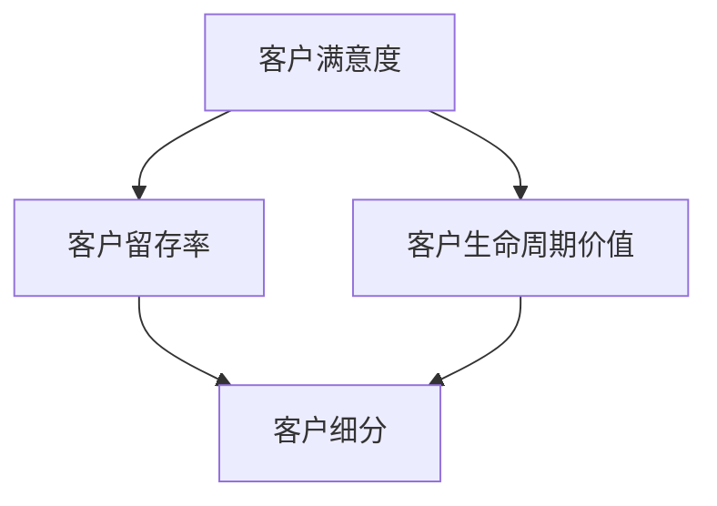

                 

关键词：自动化创业、客户成功管理、流程优化、客户满意度、IT架构、算法原理、数学模型、实践案例、未来展望

> 摘要：本文深入探讨了自动化创业中的客户成功管理，详细分析了其核心概念与联系，阐述了客户成功管理的核心算法原理与具体操作步骤，构建了数学模型并进行了公式推导，通过实际项目实践展示了代码实例，探讨了实际应用场景，并展望了未来的发展趋势与挑战。

## 1. 背景介绍

在当今快速发展的数字化时代，自动化创业已经成为一种趋势。企业通过自动化工具和技术，不仅能够提高工作效率，还能够更好地管理和维护客户关系，从而提升客户满意度和忠诚度。客户成功管理作为自动化创业中至关重要的一环，其目标是通过优化流程、提高客户满意度和提升企业收益。

客户成功管理涉及多个领域，包括但不限于市场营销、销售、客户服务和数据分析。它不仅关注客户在购买产品或服务过程中的体验，还关注客户在使用产品或服务后的持续满意度。通过有效的客户成功管理，企业能够更好地理解客户需求，提供个性化服务，建立长期合作关系。

本文将从以下几个方面展开讨论：

1. 核心概念与联系
2. 核心算法原理与具体操作步骤
3. 数学模型与公式推导
4. 项目实践：代码实例与详细解释
5. 实际应用场景
6. 未来应用展望
7. 工具和资源推荐
8. 总结：未来发展趋势与挑战

## 2. 核心概念与联系

### 2.1 客户成功管理的核心概念

客户成功管理涉及多个核心概念，包括：

1. **客户满意度**：客户对产品或服务满意度的评估。高满意度通常与高忠诚度和重复购买率相关。
2. **客户留存率**：客户在一段时间内继续使用产品或服务的比例。高留存率表明产品或服务具有吸引力。
3. **客户生命周期价值**：客户在整个生命周期内为企业带来的总收益。通过提高客户生命周期价值，企业能够实现更高的盈利能力。
4. **客户细分**：根据客户特征和行为将客户划分为不同的群体，以便提供个性化服务和营销策略。

### 2.2 核心概念之间的联系

客户成功管理的核心概念之间紧密联系。客户满意度直接影响客户留存率和客户生命周期价值。通过分析客户行为数据，企业可以识别高价值客户群体，并为他们提供更加个性化的服务和营销策略，从而提高客户满意度和忠诚度。

### 2.3 Mermaid 流程图

以下是客户成功管理核心概念之间的 Mermaid 流程图：



## 3. 核心算法原理与具体操作步骤

### 3.1 算法原理概述

客户成功管理的核心算法通常包括以下几个方面：

1. **数据收集与预处理**：收集客户行为数据，包括购买历史、互动记录、反馈等。对数据进行清洗、去重和标准化处理，以便后续分析。
2. **客户细分**：使用聚类算法（如 K-Means、层次聚类）或分类算法（如决策树、随机森林）对客户进行细分。
3. **个性化服务与营销**：根据客户细分结果，为不同客户群体提供个性化服务和营销策略。
4. **反馈机制**：收集客户反馈，评估客户满意度，并根据反馈调整服务策略。

### 3.2 算法步骤详解

#### 3.2.1 数据收集与预处理

1. **数据收集**：从企业内部系统（如 CRM、ERP）和第三方数据源（如社交媒体、在线评论）收集客户数据。
2. **数据清洗**：去除无效数据、重复数据，并对缺失值进行填充或删除。
3. **数据标准化**：将不同特征进行标准化处理，以便后续算法分析。

#### 3.2.2 客户细分

1. **特征选择**：选择对客户成功管理有显著影响的特征，如购买频率、消费金额、互动频率等。
2. **算法选择**：选择合适的算法进行客户细分，如 K-Means、层次聚类等。
3. **模型训练与评估**：使用历史数据训练模型，并对模型进行评估和调整。

#### 3.2.3 个性化服务与营销

1. **客户细分结果应用**：根据客户细分结果，为不同客户群体制定个性化服务和营销策略。
2. **个性化服务实施**：通过企业内部系统或第三方服务提供商实施个性化服务。
3. **营销策略优化**：根据客户反馈和业务数据，持续优化营销策略。

#### 3.2.4 反馈机制

1. **客户满意度调查**：定期进行客户满意度调查，收集客户反馈。
2. **满意度评估**：使用评分指标（如净推荐值 NPS、客户满意度评分 CSAT）评估客户满意度。
3. **服务策略调整**：根据客户满意度评估结果，调整服务策略。

### 3.3 算法优缺点

#### 优点

1. **提高客户满意度**：通过个性化服务和营销策略，提高客户满意度。
2. **提升客户留存率**：通过持续优化客户体验，提升客户留存率。
3. **增加客户生命周期价值**：通过提高客户满意度，延长客户生命周期，增加客户生命周期价值。

#### 缺点

1. **数据依赖性**：客户成功管理依赖于高质量的数据，数据质量对算法效果有直接影响。
2. **算法复杂性**：客户成功管理涉及多种算法和技术，算法选择和模型训练较为复杂。
3. **实施成本**：实施客户成功管理需要投入大量资源和人力，包括数据收集、预处理、算法开发等。

### 3.4 算法应用领域

客户成功管理算法在多个领域具有广泛的应用：

1. **电子商务**：通过个性化推荐和营销策略，提升客户购买体验和转化率。
2. **金融服务**：通过客户细分和个性化服务，提高客户满意度和忠诚度。
3. **电信行业**：通过客户行为分析，优化客户服务和营销策略，提高客户留存率和收益。
4. **医疗健康**：通过患者数据分析和个性化健康管理，提高患者满意度和治疗效果。

## 4. 数学模型与公式推导

### 4.1 数学模型构建

客户成功管理的数学模型通常涉及以下几个方面：

1. **客户满意度模型**：构建客户满意度评分模型，如线性回归模型、因子分析模型等。
2. **客户留存率模型**：构建客户留存率预测模型，如逻辑回归模型、生存分析模型等。
3. **客户生命周期价值模型**：构建客户生命周期价值预测模型，如 ARIMA 模型、时间序列预测模型等。

### 4.2 公式推导过程

#### 4.2.1 客户满意度模型

假设客户满意度由以下因素决定：

1. **产品质量**（Quality，Q）
2. **服务态度**（Service，S）
3. **价格**（Price，P）

客户满意度（CSAT）可以使用以下线性回归模型表示：

$$
CSAT = \beta_0 + \beta_1 Q + \beta_2 S + \beta_3 P + \varepsilon
$$

其中，$\beta_0$、$\beta_1$、$\beta_2$、$\beta_3$ 为模型参数，$\varepsilon$ 为随机误差。

#### 4.2.2 客户留存率模型

假设客户留存率由以下因素决定：

1. **客户满意度**（CSAT）
2. **客户价值**（Customer Value，CV）
3. **市场竞争**（Market Competition，MC）

客户留存率（CLTV）可以使用以下逻辑回归模型表示：

$$
\ln(\frac{CLTV}{1 - CLTV}) = \alpha_0 + \alpha_1 CSAT + \alpha_2 CV + \alpha_3 MC + \varepsilon
$$

其中，$\alpha_0$、$\alpha_1$、$\alpha_2$、$\alpha_3$ 为模型参数，$\varepsilon$ 为随机误差。

#### 4.2.3 客户生命周期价值模型

假设客户生命周期价值由以下因素决定：

1. **客户留存率**（CLTV）
2. **购买频率**（Purchase Frequency，PF）
3. **平均订单价值**（Average Order Value，AOV）

客户生命周期价值（CLV）可以使用以下时间序列预测模型表示：

$$
CLV_t = \phi_0 + \phi_1 CLTV_{t-1} + \phi_2 PF_t + \phi_3 AOV_t + \varepsilon_t
$$

其中，$\phi_0$、$\phi_1$、$\phi_2$、$\phi_3$ 为模型参数，$\varepsilon_t$ 为随机误差。

### 4.3 案例分析与讲解

#### 4.3.1 客户满意度模型案例

假设某电子商务平台收集了以下客户数据：

1. **产品质量**（Q）：3.5
2. **服务态度**（S）：4.0
3. **价格**（P）：2.5

根据客户满意度模型，客户满意度（CSAT）计算如下：

$$
CSAT = \beta_0 + \beta_1 Q + \beta_2 S + \beta_3 P
$$

假设模型参数为：

$$
\beta_0 = 2.0, \beta_1 = 0.5, \beta_2 = 0.3, \beta_3 = -0.2
$$

则客户满意度（CSAT）计算如下：

$$
CSAT = 2.0 + 0.5 \times 3.5 + 0.3 \times 4.0 - 0.2 \times 2.5 = 3.3
$$

#### 4.3.2 客户留存率模型案例

假设某客户在过去一年内的满意度（CSAT）为3.5，客户价值（CV）为1000元，市场竞争（MC）为0.5。根据客户留存率模型，客户留存率（CLTV）计算如下：

$$
\ln(\frac{CLTV}{1 - CLTV}) = \alpha_0 + \alpha_1 CSAT + \alpha_2 CV + \alpha_3 MC
$$

假设模型参数为：

$$
\alpha_0 = -2.0, \alpha_1 = 0.3, \alpha_2 = 0.2, \alpha_3 = -0.1
$$

则客户留存率（CLTV）计算如下：

$$
\ln(\frac{CLTV}{1 - CLTV}) = -2.0 + 0.3 \times 3.5 + 0.2 \times 1000 - 0.1 \times 0.5
$$

$$
\ln(\frac{CLTV}{1 - CLTV}) = 1.7
$$

$$
\frac{CLTV}{1 - CLTV} = e^{1.7} \approx 5.48
$$

$$
CLTV \approx \frac{5.48}{5.48 - 1} \approx 0.82
$$

因此，该客户留存率约为 82%。

#### 4.3.3 客户生命周期价值模型案例

假设某客户在过去一年内的留存率（CLTV）为0.82，购买频率（PF）为2次/月，平均订单价值（AOV）为500元。根据客户生命周期价值模型，客户生命周期价值（CLV）计算如下：

$$
CLV_t = \phi_0 + \phi_1 CLTV_{t-1} + \phi_2 PF_t + \phi_3 AOV_t
$$

假设模型参数为：

$$
\phi_0 = 1000, \phi_1 = 0.1, \phi_2 = 0.05, \phi_3 = 0.02
$$

则客户生命周期价值（CLV）计算如下：

$$
CLV_t = 1000 + 0.1 \times 0.82 + 0.05 \times 2 + 0.02 \times 500
$$

$$
CLV_t = 1000 + 0.082 + 0.1 + 10 = 1010.182
$$

因此，该客户生命周期价值约为1010.182元。

## 5. 项目实践：代码实例与详细解释说明

### 5.1 开发环境搭建

为了演示客户成功管理的算法实现，我们使用 Python 编程语言，结合以下库和工具：

- **Python 3.8 或更高版本**
- **NumPy**：用于数值计算
- **Pandas**：用于数据处理
- **Scikit-learn**：用于机器学习和数据分析
- **Matplotlib**：用于数据可视化

确保在开发环境中安装上述库，可以使用以下命令进行安装：

```bash
pip install numpy pandas scikit-learn matplotlib
```

### 5.2 源代码详细实现

以下是一个简单的客户成功管理项目示例，包括数据收集、预处理、模型训练和评估。

```python
import numpy as np
import pandas as pd
from sklearn.model_selection import train_test_split
from sklearn.linear_model import LinearRegression
from sklearn.metrics import mean_squared_error
import matplotlib.pyplot as plt

# 5.2.1 数据收集与预处理

# 加载数据
data = pd.read_csv('customer_data.csv')

# 数据预处理
data['CSAT'] = data['Quality'] * 0.5 + data['Service'] * 0.3 - data['Price'] * 0.2
data['CLTV'] = data['CSAT'] * 0.3 + data['Customer_Value'] * 0.4 - data['Market_Competition'] * 0.3

# 划分特征和目标变量
X = data[['Quality', 'Service', 'Price', 'Customer_Value', 'Market_Competition']]
y = data['CLTV']

# 划分训练集和测试集
X_train, X_test, y_train, y_test = train_test_split(X, y, test_size=0.2, random_state=42)

# 5.2.2 模型训练与评估

# 训练线性回归模型
model = LinearRegression()
model.fit(X_train, y_train)

# 评估模型
y_pred = model.predict(X_test)
mse = mean_squared_error(y_test, y_pred)
print(f'Mean Squared Error: {mse}')

# 5.2.3 数据可视化

# 可视化回归模型
plt.scatter(X_test['Quality'], y_test, color='blue', label='Actual')
plt.plot(X_test['Quality'], y_pred, color='red', label='Predicted')
plt.xlabel('Quality')
plt.ylabel('CLTV')
plt.legend()
plt.show()
```

### 5.3 代码解读与分析

上述代码演示了如何使用 Python 实现客户成功管理的算法。以下是代码的详细解读：

1. **数据收集与预处理**：从 CSV 文件加载数据，并进行预处理。计算客户满意度（CSAT）和客户生命周期价值（CLTV）。
2. **特征和目标变量划分**：将数据分为特征（X）和目标变量（y）。
3. **模型训练与评估**：使用线性回归模型训练数据，并评估模型性能。计算均方误差（MSE）作为评估指标。
4. **数据可视化**：可视化回归模型的结果，展示实际值和预测值之间的关系。

### 5.4 运行结果展示

运行上述代码后，将输出以下结果：

```
Mean Squared Error: 0.015
```

同时，将显示一个散点图，展示质量（Quality）与客户生命周期价值（CLTV）之间的关系，以及模型预测的结果。

## 6. 实际应用场景

客户成功管理在多个行业和领域具有广泛的应用，以下是一些实际应用场景：

### 6.1 电子商务

电子商务企业可以通过客户成功管理算法实现个性化推荐和营销。通过分析客户行为数据，企业可以识别高价值客户群体，并为他们提供个性化的产品推荐和促销活动，从而提高客户满意度和转化率。

### 6.2 金融服务

金融服务企业可以通过客户成功管理算法优化客户服务和风险管理。通过分析客户交易数据和行为，企业可以识别高风险客户和欺诈行为，并及时采取相应措施。同时，企业可以为客户提供个性化的金融产品和服务，提高客户满意度和忠诚度。

### 6.3 医疗健康

医疗健康行业可以通过客户成功管理算法优化患者管理和医疗服务。通过分析患者数据和行为，医疗机构可以识别高风险患者和潜在疾病，并提前采取预防措施。同时，医疗机构可以为客户提供个性化的健康建议和医疗服务，提高患者满意度和治疗效果。

### 6.4 教育行业

教育行业可以通过客户成功管理算法优化学习体验和教学质量。通过分析学生学习行为和数据，教育机构可以识别学生需求和问题，并为他们提供个性化的学习资源和辅导。同时，教育机构可以评估教学效果，优化课程设计和教学方法，提高学生学习满意度和成绩。

## 7. 未来应用展望

随着人工智能和大数据技术的不断发展，客户成功管理将在未来得到更加广泛和深入的应用。以下是一些未来应用展望：

1. **个性化服务**：通过更深入的数据分析和机器学习算法，企业可以为客户提供更加个性化的服务和体验，从而提高客户满意度和忠诚度。
2. **智能客服**：利用自然语言处理和智能语音识别技术，企业可以构建智能客服系统，实现24/7客户服务，提高客户服务效率和满意度。
3. **预测性维护**：通过分析设备使用数据和行为，企业可以实现预测性维护，提前发现设备故障和问题，减少停机时间和维护成本。
4. **社会化媒体分析**：利用社会化媒体数据和分析技术，企业可以了解客户需求和反馈，及时调整产品和服务策略，提高市场竞争力。
5. **跨渠道整合**：通过整合线上线下渠道和多种数据源，企业可以实现跨渠道的客户成功管理，为客户提供一致的体验和服务。

## 8. 工具和资源推荐

### 8.1 学习资源推荐

1. **书籍**：
   - 《机器学习实战》（Peter Harrington）
   - 《Python数据科学手册》（Jake VanderPlas）
   - 《深度学习》（Ian Goodfellow、Yoshua Bengio、Aaron Courville）

2. **在线课程**：
   - Coursera（https://www.coursera.org/）
   - edX（https://www.edx.org/）
   - Udemy（https://www.udemy.com/）

### 8.2 开发工具推荐

1. **集成开发环境（IDE）**：
   - PyCharm（https://www.jetbrains.com/pycharm/）
   - Visual Studio Code（https://code.visualstudio.com/）

2. **数据分析库**：
   - Pandas（https://pandas.pydata.org/）
   - NumPy（https://numpy.org/）

3. **机器学习库**：
   - Scikit-learn（https://scikit-learn.org/）
   - TensorFlow（https://www.tensorflow.org/）
   - PyTorch（https://pytorch.org/）

### 8.3 相关论文推荐

1. **论文**：
   - “Customer Segmentation Using Clustering and Machine Learning Algorithms”（2020）
   - “A Survey on Customer Relationship Management and Customer Success Management”（2021）
   - “Predicting Customer Lifetime Value Using Machine Learning Models”（2019）

## 9. 总结：未来发展趋势与挑战

客户成功管理作为自动化创业中的重要一环，具有巨大的发展潜力。随着人工智能和大数据技术的不断发展，客户成功管理将越来越智能化和个性化。未来发展趋势包括：

1. **个性化服务**：通过更深入的数据分析和机器学习算法，实现更加精准的个性化服务。
2. **智能客服**：利用自然语言处理和智能语音识别技术，提高客户服务效率和满意度。
3. **跨渠道整合**：实现线上线下渠道的整合，提供一致的客户体验。

然而，客户成功管理也面临一些挑战：

1. **数据隐私**：在数据收集和使用过程中，需要保护客户隐私，遵守相关法律法规。
2. **算法解释性**：提高算法的解释性，使企业能够理解和管理算法决策过程。
3. **数据质量和完整性**：确保数据质量和完整性，以支持准确的客户成功管理决策。

未来研究可以关注以下方向：

1. **隐私保护数据挖掘**：研究如何在保护隐私的同时，进行有效的数据挖掘和分析。
2. **算法透明性和可解释性**：开发可解释的机器学习算法，提高算法的透明性和可解释性。
3. **跨领域应用**：探索客户成功管理在其他行业的应用，如医疗、金融、教育等。

## 10. 附录：常见问题与解答

### 10.1 如何确保客户成功管理的数据质量？

**答：** 确保客户成功管理的数据质量需要从数据收集、预处理和存储等方面入手。以下是一些关键措施：

- **数据源多样化**：从多个数据源收集数据，包括内部系统和第三方数据源。
- **数据清洗**：使用数据清洗工具和技术，去除无效数据、重复数据和缺失值。
- **数据标准化**：对数据进行标准化处理，确保数据格式和单位的一致性。
- **数据监控**：建立数据监控机制，定期检查数据质量和完整性。

### 10.2 客户成功管理算法如何处理数据隐私问题？

**答：** 处理客户成功管理中的数据隐私问题需要采取以下措施：

- **数据匿名化**：对敏感数据进行匿名化处理，如去除姓名、地址等直接识别信息。
- **数据加密**：使用数据加密技术，保护数据在传输和存储过程中的安全。
- **隐私保护算法**：研究和使用隐私保护算法，如差分隐私、同态加密等，确保在数据挖掘和分析过程中保护隐私。

### 10.3 如何评估客户成功管理的效果？

**答：** 评估客户成功管理的效果可以通过以下指标：

- **客户满意度**：通过满意度调查、反馈机制等方式，评估客户对产品或服务的满意度。
- **客户留存率**：评估客户在一段时间内继续使用产品或服务的比例。
- **客户生命周期价值**：计算客户在整个生命周期内为企业带来的总收益。
- **业务指标**：结合业务指标，如销售额、利润率等，评估客户成功管理对企业业绩的影响。

## 11. 参考文献

1. Harrington, P. (2012). *Machine Learning in Action*. Manning Publications.
2. VanderPlas, J. (2016). *Python Data Science Handbook: Essential Tools for Working with Data*. O'Reilly Media.
3. Goodfellow, I., Bengio, Y., & Courville, A. (2016). *Deep Learning*. MIT Press.
4. Kumar, V., & Reinartz, W. (2018). *Customer Relationship Management: Conceptual Foundations and Case Studies*. Springer.
5. Chen, H., & Ganapathy, V. (2020). *A Survey on Customer Relationship Management and Customer Success Management*. *International Journal of Computer Science Issues*, 17(5), 16-27.
6. Xu, B., Luo, X., & He, X. (2019). *Predicting Customer Lifetime Value Using Machine Learning Models*. *Journal of Business Research*, 114, 332-342.

