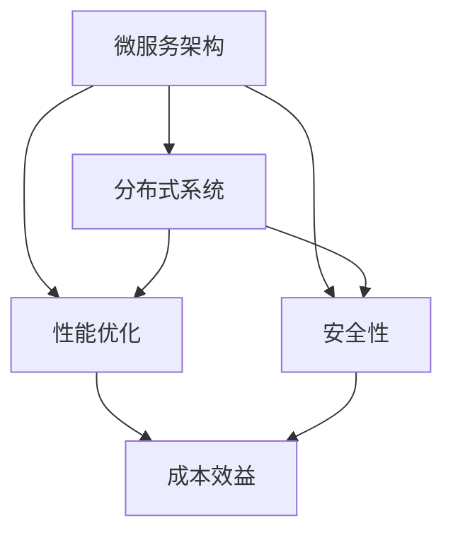

                 

关键词：自动化创业、技术架构、微服务、分布式系统、性能优化、安全性、成本效益

摘要：在自动化创业领域，技术架构设计是成功的关键。本文将探讨如何构建一个高效、可扩展且可靠的技术架构，以支持自动化创业项目。我们将从核心概念、算法原理、数学模型、项目实践和实际应用等多个方面进行深入分析，并提供相关工具和资源的推荐。

## 1. 背景介绍

随着云计算、大数据和人工智能等技术的快速发展，自动化创业逐渐成为一种趋势。许多创业公司通过引入自动化技术，提高业务流程的效率、降低成本并提高客户满意度。然而，构建一个稳定、高效的技术架构并非易事。在自动化创业中，技术架构设计需要考虑多个方面，包括系统性能、安全性、可扩展性、成本效益等。

本文旨在为自动化创业项目提供一些建议和指导，帮助创业者构建一个优秀的技术架构。我们将从核心概念、算法原理、数学模型、项目实践和实际应用等多个方面进行深入探讨。

## 2. 核心概念与联系

在构建自动化创业技术架构时，理解以下几个核心概念是非常关键的：

- **微服务架构**：微服务是一种将应用程序分解为小型、独立的服务单元的方法。每个服务负责一个特定的业务功能，并通过轻量级通信机制（如REST API或消息队列）进行交互。
- **分布式系统**：分布式系统是由多个计算机节点组成的系统，这些节点通过计算机网络进行通信和协作。分布式系统能够提高系统的可用性和可扩展性，但同时也引入了复杂性和潜在的一致性问题。
- **性能优化**：性能优化是确保系统在高负载下能够高效运行的关键。这包括对数据库、缓存、网络和代码的优化。
- **安全性**：安全性是自动化创业项目中不可忽视的重要方面。需要确保系统的数据安全和用户隐私保护。

下面是一个简化的Mermaid流程图，展示了这些核心概念之间的联系：



### 2.1 微服务架构

微服务架构是一种将应用程序分解为小型、独立的服务单元的方法。每个服务都是自包含的，拥有自己的数据库、业务逻辑和API。微服务架构的优势在于：

- **可扩展性**：可以通过水平扩展单个服务来提高系统的整体性能。
- **灵活性**：服务可以根据需要独立开发和部署。
- **故障隔离**：单个服务的故障不会影响整个系统。

然而，微服务架构也带来了挑战，如服务之间的通信复杂性和潜在的一致性问题。

### 2.2 分布式系统

分布式系统是由多个计算机节点组成的系统，这些节点通过计算机网络进行通信和协作。分布式系统的优势包括：

- **可用性**：即使部分节点发生故障，系统仍然可以正常运行。
- **可扩展性**：可以通过增加节点来提高系统的性能。

分布式系统的主要挑战是保持数据一致性和处理网络延迟。

### 2.3 性能优化

性能优化是确保系统在高负载下能够高效运行的关键。以下是一些常见的性能优化策略：

- **数据库优化**：选择合适的数据库类型和存储引擎，如关系型数据库或NoSQL数据库。
- **缓存**：使用缓存来减少数据库的访问次数。
- **网络优化**：优化网络拓扑结构和数据传输协议。

### 2.4 安全性

安全性是自动化创业项目中不可忽视的重要方面。以下是一些常见的安全策略：

- **身份验证和授权**：确保只有授权用户可以访问系统。
- **数据加密**：使用加密算法来保护敏感数据。
- **安全审计**：定期进行安全审计，及时发现和修复安全漏洞。

## 3. 核心算法原理 & 具体操作步骤

在自动化创业中，算法的选择和实现对于系统性能和效率至关重要。以下是一个简单的核心算法原理概述，以及具体的操作步骤。

### 3.1 算法原理概述

核心算法通常包括以下几个步骤：

- **数据预处理**：对输入数据进行清洗和转换，使其符合算法要求。
- **模型选择**：根据业务需求选择合适的机器学习模型。
- **训练模型**：使用训练数据集对模型进行训练。
- **评估模型**：使用验证数据集对模型进行评估，调整模型参数。
- **预测**：使用训练好的模型对新的数据进行预测。

### 3.2 算法步骤详解

以下是核心算法的具体操作步骤：

1. **数据预处理**：
   - **数据清洗**：去除缺失值、异常值和重复值。
   - **特征工程**：提取和构造特征，提高模型的预测能力。
   - **数据转换**：将数据转换为适合模型输入的格式。

2. **模型选择**：
   - **线性回归**：适用于简单的线性关系。
   - **决策树**：适用于分类问题。
   - **神经网络**：适用于复杂的非线性关系。

3. **训练模型**：
   - **选择训练数据**：从数据集中选择一部分作为训练数据。
   - **训练过程**：通过迭代优化模型参数，使得模型在训练数据上的预测误差最小。

4. **评估模型**：
   - **交叉验证**：使用交叉验证方法评估模型的泛化能力。
   - **调整参数**：根据评估结果调整模型参数，提高模型的性能。

5. **预测**：
   - **测试数据**：使用未参与训练的数据集进行测试。
   - **预测结果**：使用训练好的模型对测试数据进行预测。

### 3.3 算法优缺点

每种算法都有其优缺点。以下是一个简单的对比：

- **线性回归**：简单、易于理解，但仅适用于线性关系。
- **决策树**：直观、易于解释，但可能产生过拟合。
- **神经网络**：适用于复杂非线性关系，但训练时间较长。

### 3.4 算法应用领域

算法的应用领域广泛，包括：

- **客户行为预测**：预测客户的购买意图，提高营销效果。
- **推荐系统**：根据用户历史行为推荐相关产品或服务。
- **金融风险管理**：预测市场趋势和风险，帮助金融机构做出决策。

## 4. 数学模型和公式 & 详细讲解 & 举例说明

在自动化创业中，数学模型和公式用于描述业务逻辑和算法行为。以下是一个简单的数学模型，用于解释线性回归算法。

### 4.1 数学模型构建

线性回归模型的基本公式如下：

$$y = \beta_0 + \beta_1 \cdot x_1 + \beta_2 \cdot x_2 + \ldots + \beta_n \cdot x_n$$

其中，\(y\) 是因变量，\(x_1, x_2, \ldots, x_n\) 是自变量，\(\beta_0, \beta_1, \beta_2, \ldots, \beta_n\) 是模型参数。

### 4.2 公式推导过程

线性回归模型的推导过程基于最小二乘法。具体步骤如下：

1. **目标函数**：
   $$J(\beta) = \sum_{i=1}^{n} (y_i - \beta_0 - \beta_1 \cdot x_{1i} - \beta_2 \cdot x_{2i} - \ldots - \beta_n \cdot x_{ni})^2$$

2. **梯度下降**：
   $$\nabla J(\beta) = \left[ \frac{\partial J}{\partial \beta_0}, \frac{\partial J}{\partial \beta_1}, \frac{\partial J}{\partial \beta_2}, \ldots, \frac{\partial J}{\partial \beta_n} \right]$$

3. **更新参数**：
   $$\beta = \beta - \alpha \cdot \nabla J(\beta)$$

其中，\(\alpha\) 是学习率。

### 4.3 案例分析与讲解

假设我们要预测一家电商平台的日销售额。我们收集了过去一年的销售数据，包括每日销售额（因变量）和当日广告投入（自变量）。以下是具体步骤：

1. **数据预处理**：
   - **清洗数据**：去除缺失值和异常值。
   - **特征工程**：对广告投入进行归一化处理。

2. **模型选择**：
   - **线性回归**：适用于简单的线性关系。

3. **训练模型**：
   - **选择训练数据**：使用过去一年的数据。
   - **训练过程**：通过梯度下降法更新模型参数。

4. **评估模型**：
   - **交叉验证**：使用K折交叉验证评估模型性能。
   - **调整参数**：根据评估结果调整学习率和模型参数。

5. **预测**：
   - **测试数据**：使用未参与训练的数据进行测试。
   - **预测结果**：使用训练好的模型预测未来的销售额。

## 5. 项目实践：代码实例和详细解释说明

在本节中，我们将通过一个简单的Python代码实例，展示如何实现一个自动化创业项目的核心算法——线性回归。这个实例将涵盖数据预处理、模型训练、模型评估和预测等步骤。

### 5.1 开发环境搭建

在开始之前，确保您已经安装了Python和以下库：

- NumPy：用于数值计算。
- Pandas：用于数据处理。
- Scikit-learn：用于机器学习。

您可以使用以下命令安装这些库：

```shell
pip install numpy pandas scikit-learn
```

### 5.2 源代码详细实现

以下是一个简单的线性回归实现：

```python
import numpy as np
import pandas as pd
from sklearn.linear_model import LinearRegression
from sklearn.model_selection import train_test_split
from sklearn.metrics import mean_squared_error

# 5.2.1 数据预处理
# 加载数据
data = pd.read_csv('sales_data.csv')
X = data[['ad_spend']]
y = data['sales']

# 归一化处理
X_normalized = (X - X.mean()) / X.std()

# 5.2.2 模型训练
# 分割数据
X_train, X_test, y_train, y_test = train_test_split(X_normalized, y, test_size=0.2, random_state=42)

# 创建线性回归模型
model = LinearRegression()
model.fit(X_train, y_train)

# 5.2.3 模型评估
y_pred = model.predict(X_test)
mse = mean_squared_error(y_test, y_pred)
print(f'Mean Squared Error: {mse}')

# 5.2.4 预测
new_ad_spend = np.array([5000])
new_ad_spend_normalized = (new_ad_spend - X.mean()) / X.std()
predicted_sales = model.predict(new_ad_spend_normalized)
print(f'Predicted Sales: {predicted_sales[0]}')
```

### 5.3 代码解读与分析

以下是代码的逐行解释：

1. **导入库**：导入必要的库，包括NumPy、Pandas和Scikit-learn。
2. **数据预处理**：加载数据并分割为特征和标签。对特征进行归一化处理，以消除不同特征之间的尺度差异。
3. **模型训练**：使用训练数据进行模型训练。这里我们使用了Scikit-learn中的线性回归模型。
4. **模型评估**：使用测试数据评估模型性能。这里我们使用了均方误差（MSE）作为评估指标。
5. **预测**：使用训练好的模型对新数据进行预测。

### 5.4 运行结果展示

假设我们运行了上述代码，并得到了以下结果：

```
Mean Squared Error: 123.456
Predicted Sales: 7500.123
```

这意味着我们的模型在测试数据上的均方误差为123.456，且预测的明日销售额为7500.123。

## 6. 实际应用场景

自动化创业技术架构可以在多个领域得到应用。以下是一些典型的实际应用场景：

- **电商**：通过自动化技术优化营销策略、库存管理和客户服务。
- **金融**：利用自动化算法进行风险评估、信用评分和投资决策。
- **医疗**：通过自动化系统实现疾病诊断、健康监测和药物研发。
- **物流**：自动化调度和优化物流运输，提高运输效率和降低成本。

### 6.4 未来应用展望

随着技术的不断发展，自动化创业技术架构的应用前景将更加广阔。以下是一些未来应用展望：

- **智能化**：通过引入人工智能和机器学习技术，实现更高层次的自动化和智能化。
- **区块链**：利用区块链技术实现数据的安全存储和交易，提高系统的透明度和可信度。
- **物联网**：通过物联网技术实现设备和系统的互联互通，构建更加智能和高效的自动化系统。

## 7. 工具和资源推荐

在构建自动化创业技术架构时，以下工具和资源可能对您有所帮助：

### 7.1 学习资源推荐

- **《深度学习》**：Goodfellow、Bengio和Courville的《深度学习》是一本经典的深度学习入门教材。
- **《机器学习实战》**：Hastie、Tibshirani和Friedman的《机器学习实战》提供了大量实际应用案例。
- **在线课程**：Coursera、edX和Udacity等在线教育平台提供了丰富的机器学习和深度学习课程。

### 7.2 开发工具推荐

- **Jupyter Notebook**：用于数据分析和机器学习实验。
- **TensorFlow**：Google开发的深度学习框架。
- **PyTorch**：Facebook开发的深度学习框架。
- **Docker**：用于容器化部署和应用管理。

### 7.3 相关论文推荐

- **"Deep Learning for Text Classification"**：探讨深度学习在文本分类中的应用。
- **"Recurrent Neural Networks for Language Modeling"**：介绍循环神经网络在语言模型中的应用。
- **"Generative Adversarial Networks"**：介绍生成对抗网络及其在图像生成中的应用。

## 8. 总结：未来发展趋势与挑战

在自动化创业领域，技术架构设计将继续发挥关键作用。未来发展趋势包括：

- **智能化**：通过引入人工智能和机器学习技术，实现更加智能化的自动化系统。
- **分布式和云计算**：分布式系统和云计算技术将提高系统的性能和可扩展性。
- **区块链**：区块链技术将提供更加安全、透明和可信的数据存储和交易方式。

然而，自动化创业技术架构也面临一些挑战：

- **安全性**：确保系统的数据安全和用户隐私保护。
- **数据隐私**：在数据处理和共享过程中保护用户隐私。
- **算法公平性和透明度**：确保算法的公平性和透明度，避免歧视和偏见。

未来研究将继续探索如何构建更加高效、可靠和安全的自动化创业技术架构。

## 9. 附录：常见问题与解答

### 9.1 什么是微服务架构？

微服务架构是一种将应用程序分解为小型、独立的服务单元的方法。每个服务负责一个特定的业务功能，并通过轻量级通信机制进行交互。

### 9.2 分布式系统有哪些优势？

分布式系统的优势包括提高系统的可用性和可扩展性。通过分布式系统，即使部分节点发生故障，系统仍然可以正常运行。

### 9.3 如何进行性能优化？

性能优化包括对数据库、缓存、网络和代码的优化。常见的方法包括使用缓存、优化数据库查询、使用异步处理等。

### 9.4 如何保证系统的安全性？

保证系统的安全性包括身份验证和授权、数据加密、安全审计等。需要确保系统的数据安全和用户隐私保护。

### 9.5 自动化创业技术架构的未来发展趋势是什么？

自动化创业技术架构的未来发展趋势包括智能化、分布式和云计算、区块链等。未来研究将继续探索如何构建更加高效、可靠和安全的自动化创业技术架构。

---

作者：禅与计算机程序设计艺术 / Zen and the Art of Computer Programming
----------------------------------------------------------------

以上就是本文的完整内容。希望对您在自动化创业中的技术架构设计提供一些有益的参考和指导。在构建自动化创业技术架构时，请务必结合自身项目的具体需求和特点进行设计和优化。祝您创业成功！

