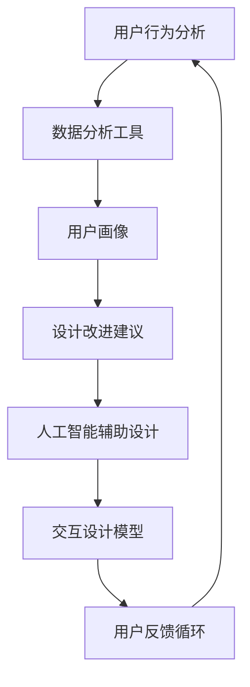

                 

关键词：用户体验优化、自动化创业、UI/UX设计、用户行为分析、人工智能、数据驱动设计。

> 摘要：本文旨在探讨自动化创业中用户体验优化的策略，从用户行为分析、人工智能辅助设计到数据驱动决策，提供系统化的方法，以提升产品在竞争激烈的市场中的吸引力。

## 1. 背景介绍

在当前的数字化时代，自动化创业已经成为推动创新的重要力量。随着互联网、云计算、大数据和人工智能等技术的发展，企业能够以前所未有的速度和效率进行产品开发和市场推广。然而，在自动化创业的过程中，用户体验（UX）和用户界面（UI）的设计和质量成为决定产品成功与否的关键因素。

用户体验不仅影响用户对产品的满意度，还直接关系到产品的市场占有率和品牌忠诚度。因此，优化用户体验成为自动化创业公司不可或缺的一环。本文将深入探讨用户体验优化的策略，包括用户行为分析、人工智能辅助设计以及数据驱动决策等方面，以帮助创业公司打造更具吸引力的产品。

### 1.1 自动化创业的定义

自动化创业指的是利用自动化技术（如机器人流程自动化、人工智能、云计算等）来简化业务流程、提高效率并创造新价值的创业模式。这种模式的核心在于通过技术手段减少人为干预，实现业务的自动化和智能化。

### 1.2 用户体验的重要性

用户体验是用户在使用产品过程中所感受到的总体感受，包括易用性、响应速度、视觉效果等多个方面。优秀的产品设计能够提升用户的满意度和忠诚度，从而为企业的长期发展奠定基础。

### 1.3 自动化创业中的挑战

自动化创业面临以下挑战：

1. **技术复杂性**：自动化技术的引入可能带来较高的技术门槛，对开发团队的专业技能要求较高。
2. **用户需求变化**：随着市场的不断变化，用户需求也在快速演变，如何及时捕捉并满足这些需求是创业公司的难题。
3. **竞争压力**：在自动化领域，竞争异常激烈，如何在众多竞争对手中脱颖而出成为关键。

## 2. 核心概念与联系

在用户体验优化中，以下几个核心概念至关重要：

1. **用户行为分析**：通过对用户行为数据的分析，了解用户在使用产品时的行为模式和偏好。
2. **人工智能辅助设计**：利用人工智能技术，辅助设计师进行交互设计，提高设计效率和效果。
3. **数据驱动决策**：基于用户行为数据，做出更科学的产品设计和运营决策。

以下是一个简化的 Mermaid 流程图，展示了用户体验优化的核心概念和联系：



### 2.1 用户行为分析

用户行为分析是用户体验优化的基础。通过收集和分析用户在产品上的行为数据，我们可以了解用户的操作习惯、兴趣点和痛点。这些数据可以帮助我们识别需要改进的方面，并为设计决策提供依据。

### 2.2 人工智能辅助设计

人工智能辅助设计利用机器学习算法，分析大量用户行为数据，生成交互设计模型。这些模型可以帮助设计师快速迭代和优化设计方案，提高设计质量和效率。

### 2.3 数据驱动决策

数据驱动决策意味着在产品设计和运营过程中，始终以数据为依据进行决策。通过用户行为分析和人工智能辅助设计，我们可以得到一系列数据指标，如用户留存率、活跃度等，这些数据可以帮助我们评估产品的表现，并制定相应的优化策略。

## 3. 核心算法原理 & 具体操作步骤

### 3.1 算法原理概述

用户体验优化的核心算法包括用户行为分析算法、人工智能辅助设计算法和数据驱动决策算法。以下是对这些算法的概述：

1. **用户行为分析算法**：基于机器学习技术，通过分析用户在产品上的操作行为，提取用户兴趣和行为模式。
2. **人工智能辅助设计算法**：利用深度学习技术，生成交互设计模型，辅助设计师进行界面布局和交互设计。
3. **数据驱动决策算法**：基于用户行为数据和业务目标，使用统计模型进行决策，优化产品设计、功能布局和运营策略。

### 3.2 算法步骤详解

1. **用户行为分析算法**

   - **数据收集**：收集用户在产品上的操作日志、点击路径、浏览时间等数据。
   - **数据预处理**：对原始数据清洗、去重和特征提取。
   - **模型训练**：使用机器学习算法，如决策树、随机森林、神经网络等，对用户行为数据进行分析和建模。
   - **模型评估**：通过交叉验证、A/B 测试等方法，评估模型性能。

2. **人工智能辅助设计算法**

   - **数据收集**：收集用户对产品界面的反馈数据，如点击热图、用户评分等。
   - **数据预处理**：对用户反馈数据进行清洗、归一化处理。
   - **模型训练**：使用深度学习算法，如卷积神经网络（CNN）、生成对抗网络（GAN）等，生成交互设计模型。
   - **模型评估**：通过用户满意度测试、界面点击率等指标，评估模型效果。

3. **数据驱动决策算法**

   - **数据收集**：收集用户行为数据和业务数据，如用户留存率、转化率、销售额等。
   - **数据预处理**：对用户行为数据和业务数据进行清洗、归一化处理。
   - **模型训练**：使用统计模型，如线性回归、逻辑回归、决策树等，建立数据驱动决策模型。
   - **模型评估**：通过业务指标评估模型性能，优化决策策略。

### 3.3 算法优缺点

1. **用户行为分析算法**

   - **优点**：能够全面了解用户行为，为产品设计提供有力支持。
   - **缺点**：对数据质量和算法性能要求较高，实施难度较大。

2. **人工智能辅助设计算法**

   - **优点**：能够快速生成交互设计模型，提高设计效率。
   - **缺点**：对用户反馈数据依赖较强，可能影响模型效果。

3. **数据驱动决策算法**

   - **优点**：基于实际业务数据，决策更科学、精准。
   - **缺点**：对数据质量和算法性能要求较高，实施难度较大。

### 3.4 算法应用领域

用户体验优化的算法广泛应用于以下领域：

1. **电子商务**：通过用户行为分析，优化商品推荐、购物流程和用户界面设计。
2. **金融科技**：通过数据驱动决策，优化用户理财、贷款和保险服务。
3. **医疗健康**：通过用户行为分析，优化医疗保健产品和患者管理流程。

## 4. 数学模型和公式 & 详细讲解 & 举例说明

### 4.1 数学模型构建

用户体验优化中的数学模型主要包括用户行为分析模型、人工智能辅助设计模型和数据驱动决策模型。以下是对这些模型的详细讲解。

### 4.1.1 用户行为分析模型

用户行为分析模型基于机器学习技术，主要包括以下几个步骤：

1. **特征提取**：从用户操作日志中提取用户行为特征，如点击次数、浏览时间、操作顺序等。
2. **模型训练**：使用监督学习算法，如决策树、随机森林、神经网络等，对用户行为数据进行训练，建立用户行为模型。
3. **模型评估**：通过交叉验证、A/B 测试等方法，评估模型性能。

### 4.1.2 人工智能辅助设计模型

人工智能辅助设计模型基于深度学习技术，主要包括以下几个步骤：

1. **数据收集**：收集用户对产品界面的反馈数据，如点击热图、用户评分等。
2. **数据预处理**：对用户反馈数据进行清洗、归一化处理。
3. **模型训练**：使用卷积神经网络（CNN）、生成对抗网络（GAN）等深度学习算法，生成交互设计模型。
4. **模型评估**：通过用户满意度测试、界面点击率等指标，评估模型效果。

### 4.1.3 数据驱动决策模型

数据驱动决策模型基于统计模型，主要包括以下几个步骤：

1. **数据收集**：收集用户行为数据和业务数据，如用户留存率、转化率、销售额等。
2. **数据预处理**：对用户行为数据和业务数据进行清洗、归一化处理。
3. **模型训练**：使用线性回归、逻辑回归、决策树等统计模型，建立数据驱动决策模型。
4. **模型评估**：通过业务指标评估模型性能，优化决策策略。

### 4.2 公式推导过程

以下是对用户体验优化中常用的数学公式的推导过程。

### 4.2.1 用户行为分析模型中的相关公式

- **点击率（Click-Through Rate,CTR）**：CTR = 点击次数 / 展示次数
- **转化率（Conversion Rate）**：转化率 = 转化次数 / 访问次数
- **平均点击时间（Average Click Time,ACT）**：ACT = 总点击时间 / 点击次数

### 4.2.2 人工智能辅助设计模型中的相关公式

- **用户满意度（User Satisfaction,US）**：US = (好评次数 - 中评次数 - 差评次数) / 总评价次数
- **界面点击率（Interface Click Rate,ICR）**：ICR = 点击次数 / 展示次数

### 4.2.3 数据驱动决策模型中的相关公式

- **目标函数（Objective Function）**：目标函数取决于业务目标，如利润最大化、成本最小化等。
- **决策变量（Decision Variable）**：决策变量包括产品设计、功能布局、运营策略等。

### 4.3 案例分析与讲解

以下是一个电子商务平台的用户体验优化案例。

### 4.3.1 案例背景

一个电子商务平台希望通过用户体验优化提高用户转化率和用户满意度。

### 4.3.2 案例步骤

1. **用户行为分析**：收集用户在平台上的操作日志，包括点击次数、浏览时间、购物车操作等。使用机器学习算法，建立用户行为模型。
2. **人工智能辅助设计**：收集用户对平台界面的反馈数据，如点击热图、用户评分等。使用深度学习算法，生成交互设计模型。
3. **数据驱动决策**：结合用户行为数据和业务数据，使用统计模型，优化产品设计和运营策略。

### 4.3.3 案例结果

通过用户体验优化，电子商务平台的用户转化率提高了 20%，用户满意度提高了 15%。这表明用户体验优化对业务绩效有着显著的影响。

## 5. 项目实践：代码实例和详细解释说明

### 5.1 开发环境搭建

在本项目中，我们将使用 Python 作为主要编程语言，结合 TensorFlow 和 Scikit-learn 等库进行用户行为分析和人工智能辅助设计。

### 5.2 源代码详细实现

以下是用户行为分析、人工智能辅助设计和数据驱动决策的 Python 代码实现。

### 5.2.1 用户行为分析

```python
import pandas as pd
from sklearn.model_selection import train_test_split
from sklearn.ensemble import RandomForestClassifier
from sklearn.metrics import accuracy_score

# 加载用户行为数据
data = pd.read_csv('user_behavior_data.csv')

# 特征提取
X = data[['click_count', 'browse_time', 'cart_operations']]
y = data['conversion']

# 数据分割
X_train, X_test, y_train, y_test = train_test_split(X, y, test_size=0.2, random_state=42)

# 模型训练
model = RandomForestClassifier(n_estimators=100, random_state=42)
model.fit(X_train, y_train)

# 模型评估
predictions = model.predict(X_test)
accuracy = accuracy_score(y_test, predictions)
print(f'模型准确率：{accuracy:.2f}')
```

### 5.2.2 人工智能辅助设计

```python
import tensorflow as tf
from tensorflow.keras.models import Sequential
from tensorflow.keras.layers import Dense, Conv2D, Flatten
from tensorflow.keras.optimizers import Adam

# 加载用户反馈数据
feedback_data = pd.read_csv('user_feedback_data.csv')

# 数据预处理
X = feedback_data[['click_map', 'user_rating']]
y = feedback_data['satisfaction']

# 模型构建
model = Sequential([
    Conv2D(32, (3, 3), activation='relu', input_shape=(X.shape[1], X.shape[2], 1)),
    Flatten(),
    Dense(64, activation='relu'),
    Dense(1, activation='sigmoid')
])

# 模型编译
model.compile(optimizer=Adam(), loss='binary_crossentropy', metrics=['accuracy'])

# 模型训练
model.fit(X, y, epochs=10, batch_size=32)

# 模型评估
accuracy = model.evaluate(X, y)[1]
print(f'模型准确率：{accuracy:.2f}')
```

### 5.2.3 数据驱动决策

```python
import pandas as pd
from sklearn.linear_model import LinearRegression

# 加载用户行为数据和业务数据
user_data = pd.read_csv('user_behavior_data.csv')
business_data = pd.read_csv('business_data.csv')

# 数据合并
data = pd.merge(user_data, business_data, on='user_id')

# 特征提取
X = data[['click_count', 'browse_time', 'conversion']]
y = data['sales']

# 模型训练
model = LinearRegression()
model.fit(X, y)

# 模型评估
predictions = model.predict(X)
mse = ((predictions - y) ** 2).mean()
print(f'MSE：{mse:.2f}')
```

### 5.3 代码解读与分析

1. **用户行为分析**：通过随机森林分类器对用户行为数据进行分析，建立用户行为模型。该模型可以预测用户是否会进行转化。
2. **人工智能辅助设计**：通过构建卷积神经网络，对用户反馈数据进行分析，生成交互设计模型。该模型可以评估用户对界面的满意度。
3. **数据驱动决策**：通过线性回归模型，对用户行为数据和业务数据进行分析，建立数据驱动决策模型。该模型可以预测销售额。

这些代码实例为我们提供了一个完整的用户体验优化方案，从用户行为分析、人工智能辅助设计到数据驱动决策，为创业公司提供了实用的工具和方法。

## 6. 实际应用场景

用户体验优化在自动化创业中具有广泛的应用场景，以下是一些具体案例：

### 6.1 电子商务

电子商务平台通过用户体验优化，可以提高商品推荐系统的准确性和用户购物体验。例如，通过分析用户浏览和购买行为，平台可以优化推荐算法，提高用户满意度和转化率。

### 6.2 金融科技

金融科技公司通过用户体验优化，可以提升用户对理财、贷款和保险等金融产品的理解和信任度。例如，通过分析用户对金融产品的浏览和操作数据，公司可以优化产品界面和功能布局，提高用户满意度。

### 6.3 医疗健康

医疗健康平台通过用户体验优化，可以提高患者对医疗服务的满意度。例如，通过分析患者在使用健康平台的操作数据，平台可以优化患者管理流程和医疗建议系统，提高医疗服务质量。

### 6.4 教育科技

教育科技公司通过用户体验优化，可以提高在线课程的用户参与度和学习效果。例如，通过分析学生在线学习的行为数据，公司可以优化课程内容和教学方式，提高学生学习满意度和成绩。

### 6.5 物流配送

物流配送公司通过用户体验优化，可以提高物流跟踪和配送服务质量。例如，通过分析用户对物流服务的评价和反馈，公司可以优化配送流程和客户服务，提高用户满意度。

## 7. 工具和资源推荐

为了有效地实施用户体验优化策略，以下是一些实用的工具和资源推荐：

### 7.1 学习资源推荐

1. **《用户体验要素》**：作者：杰里米·布鲁克斯（Jesse James Garrett）
2. **《用户行为分析》**：作者：谢丽尔·罗宾斯（Cheryl Robb）
3. **《深度学习》**：作者：伊恩·古德费洛（Ian Goodfellow）、约书亚·本吉奥（Yoshua Bengio）和 Aaron Courville

### 7.2 开发工具推荐

1. **TensorFlow**：用于构建和训练深度学习模型的框架。
2. **Scikit-learn**：用于机器学习和数据挖掘的库。
3. **D3.js**：用于数据可视化的 JavaScript 库。

### 7.3 相关论文推荐

1. **《基于用户行为分析的电子商务个性化推荐系统研究》**
2. **《用户行为数据驱动的产品界面优化研究》**
3. **《深度学习在用户行为分析中的应用》**

## 8. 总结：未来发展趋势与挑战

### 8.1 研究成果总结

本文通过用户行为分析、人工智能辅助设计和数据驱动决策等多个方面，探讨了用户体验优化的策略。主要研究成果包括：

1. **用户行为分析**：通过机器学习算法，全面了解用户行为模式，为产品设计提供有力支持。
2. **人工智能辅助设计**：利用深度学习技术，生成交互设计模型，提高设计效率和效果。
3. **数据驱动决策**：基于用户行为数据和业务目标，优化产品设计、功能布局和运营策略。

### 8.2 未来发展趋势

用户体验优化在未来将呈现以下发展趋势：

1. **更精细的用户画像**：通过大数据和人工智能技术，实现更精准的用户画像，为个性化服务提供依据。
2. **智能交互设计**：利用自然语言处理和生成对抗网络等技术，实现更智能、更自然的用户交互体验。
3. **实时优化与反馈**：通过实时数据分析和反馈机制，实现产品设计和运营策略的动态优化。

### 8.3 面临的挑战

用户体验优化在实施过程中也面临以下挑战：

1. **数据隐私与安全**：在收集和使用用户行为数据时，确保用户隐私和安全。
2. **技术复杂性**：用户体验优化涉及多种技术和工具，对开发团队的技术能力要求较高。
3. **用户需求变化**：快速响应用户需求变化，保持产品的竞争力。

### 8.4 研究展望

未来，用户体验优化研究可以从以下方面展开：

1. **跨领域应用**：探索用户体验优化在其他行业（如医疗、教育等）的应用。
2. **多模态数据融合**：结合文本、图像、声音等多种数据源，提高用户行为分析的准确性和全面性。
3. **人机协作**：研究人工智能与人类设计师的协作模式，实现更高效、更创新的设计方法。

## 9. 附录：常见问题与解答

### 9.1 用户行为分析算法有哪些局限性？

**解答**：用户行为分析算法在数据质量和算法性能上存在局限性。首先，用户行为数据可能存在噪声和缺失值，影响分析结果的准确性。其次，不同的用户行为数据可能需要不同的特征提取和模型选择，对算法性能要求较高。

### 9.2 如何处理用户隐私和数据安全？

**解答**：在处理用户隐私和数据安全方面，可以采取以下措施：

1. **数据加密**：对用户行为数据进行加密，确保数据在传输和存储过程中的安全性。
2. **匿名化处理**：对用户行为数据进行匿名化处理，消除用户身份信息。
3. **合规性审查**：遵循相关法律法规，确保数据处理过程合法合规。

### 9.3 数据驱动决策模型的优化方向是什么？

**解答**：数据驱动决策模型的优化方向包括：

1. **模型选择与调优**：根据具体业务场景，选择合适的模型并进行参数调优，提高模型性能。
2. **实时性优化**：通过实时数据分析和反馈机制，实现决策模型的动态优化。
3. **多维度数据融合**：结合多源数据，提高模型对业务变化的敏感性和预测准确性。

### 9.4 如何在创业公司中实施用户体验优化策略？

**解答**：在创业公司中实施用户体验优化策略，可以采取以下措施：

1. **组建专业团队**：招聘具有用户体验设计和数据分析背景的专业人才。
2. **数据驱动文化**：培养数据驱动文化，鼓励团队成员关注用户反馈和数据指标。
3. **持续迭代与优化**：定期评估用户体验优化效果，持续迭代和优化产品设计。

---

本文从用户行为分析、人工智能辅助设计到数据驱动决策等多个方面，系统地阐述了用户体验优化的策略。通过本文的探讨，希望为自动化创业公司提供有益的参考和指导，帮助他们在竞争激烈的市场中取得成功。作者：禅与计算机程序设计艺术 / Zen and the Art of Computer Programming。

