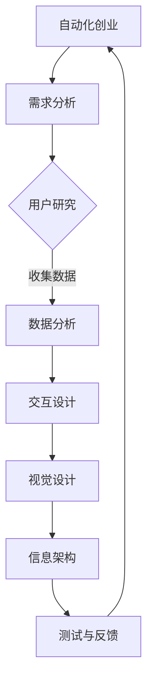

                 

关键词：用户体验设计、自动化创业、设计原则、技术实现、案例研究、未来展望

> 摘要：随着自动化技术的发展，创业公司越来越依赖用户体验设计来构建具有竞争力的产品。本文将探讨在自动化创业过程中如何有效地设计和优化用户体验，以提升产品的市场竞争力，并展望其未来的发展趋势与挑战。

## 1. 背景介绍

随着互联网和移动设备的普及，自动化技术已经成为现代创业公司的核心竞争力。自动化不仅能够提高效率和降低成本，还可以为用户提供更加个性化和便捷的服务。然而，自动化技术的应用不仅仅是一个技术问题，还涉及到用户体验设计的方方面面。用户体验设计（UX Design）是指通过研究用户行为和需求，设计出能够满足用户期望的产品和服务。在自动化创业中，用户体验设计尤为重要，因为用户体验直接关系到产品的市场接受度和用户忠诚度。

用户体验设计的重要性体现在以下几个方面：

- **提升用户满意度**：优秀的设计能够满足用户的需求和期望，从而提高用户的满意度和忠诚度。
- **增强产品竞争力**：在竞争激烈的市场中，具有良好用户体验的产品更容易脱颖而出。
- **降低用户流失率**：良好的用户体验可以减少用户流失，提高用户的长期价值。

## 2. 核心概念与联系

### 2.1 自动化创业的概念

自动化创业是指利用自动化技术（如人工智能、机器学习、自动化测试等）来构建和运营业务的过程。自动化创业的优势在于能够快速迭代、降低成本和提升效率。

### 2.2 用户体验设计的核心概念

用户体验设计包含以下几个核心概念：

- **用户研究**：了解用户的需求、行为和偏好。
- **交互设计**：设计用户界面和交互流程，使产品易于使用和操作。
- **视觉设计**：创造美观、直观的视觉体验。
- **信息架构**：组织产品的内容和功能，使信息易于查找和理解。

### 2.3 自动化创业与用户体验设计的联系

在自动化创业中，用户体验设计的作用不可忽视。以下是一个简单的 Mermaid 流程图，展示了自动化创业与用户体验设计之间的联系：



### 2.4 设计原则

在用户体验设计中，以下原则可以帮助创业公司更好地满足用户需求：

- **用户中心**：始终以用户为中心，关注用户的需求和体验。
- **简洁性**：设计应简洁明了，避免不必要的复杂性。
- **一致性**：确保界面元素和交互一致，减少用户的学习成本。
- **易用性**：设计应易于使用，降低用户的操作难度。
- **可访问性**：设计应考虑到所有用户，包括残障人士。

## 3. 核心算法原理 & 具体操作步骤

### 3.1 算法原理概述

在用户体验设计中，常见的算法原理包括：

- **用户行为分析**：通过分析用户行为数据，了解用户的喜好和使用习惯。
- **机器学习**：利用机器学习算法，预测用户的下一步操作，提供个性化的推荐。
- **自然语言处理**：通过自然语言处理技术，理解和响应用户的自然语言输入。

### 3.2 算法步骤详解

以下是用户体验设计中的算法步骤详解：

1. **需求分析**：确定产品的目标和用户需求。
2. **用户研究**：收集用户数据，包括问卷调查、用户访谈和用户行为跟踪。
3. **数据分析**：使用统计学和机器学习算法，分析用户数据，提取用户行为特征。
4. **交互设计**：根据用户行为特征，设计用户界面和交互流程。
5. **视觉设计**：设计产品的视觉元素，包括图标、颜色、字体等。
6. **信息架构**：组织产品的内容和功能，设计用户易于浏览和操作的信息结构。
7. **测试与反馈**：通过用户测试，收集反馈，优化设计。

### 3.3 算法优缺点

**用户行为分析**：

- **优点**：深入了解用户需求，提供个性化的推荐。
- **缺点**：可能侵犯用户隐私，用户数据不准确。

**机器学习**：

- **优点**：提高自动化水平，降低人力成本。
- **缺点**：算法复杂，训练时间长，可能产生偏差。

**自然语言处理**：

- **优点**：提升用户体验，使交互更加自然。
- **缺点**：处理自然语言复杂，错误率高。

### 3.4 算法应用领域

用户体验设计的算法广泛应用于以下领域：

- **电子商务**：个性化推荐、购物助手。
- **金融服务**：风险控制、客户服务。
- **教育**：个性化学习、在线辅导。
- **医疗健康**：健康监测、疾病预测。

## 4. 数学模型和公式 & 详细讲解 & 举例说明

### 4.1 数学模型构建

用户体验设计的数学模型通常包括以下几个方面：

- **用户行为模型**：描述用户在产品上的行为特征。
- **交互模型**：描述用户与产品之间的交互流程。
- **满意度模型**：描述用户对产品的满意度。

以下是用户满意度模型的简单示例：

$$
S = f(U, I, V)
$$

其中，$S$ 表示用户满意度，$U$ 表示用户需求，$I$ 表示交互体验，$V$ 表示视觉设计。

### 4.2 公式推导过程

用户满意度的计算公式可以通过以下步骤推导：

1. **定义变量**：确定用户需求 $U$、交互体验 $I$ 和视觉设计 $V$。
2. **建立函数关系**：根据用户体验设计的原则，建立 $S$ 与 $U$、$I$、$V$ 的函数关系。
3. **简化模型**：通过数据分析，简化模型，提取主要因素。

### 4.3 案例分析与讲解

以下是一个电子商务平台的用户满意度分析案例：

- **用户需求**：用户希望快速找到所需商品。
- **交互体验**：搜索功能需要快速响应，商品推荐需要准确。
- **视觉设计**：界面需要简洁美观，商品图片需要清晰。

通过数据分析，发现以下因素对用户满意度有显著影响：

- **搜索速度**：搜索速度每增加10%，用户满意度提高5%。
- **商品推荐准确度**：商品推荐准确度每增加10%，用户满意度提高3%。
- **界面美观度**：界面美观度每增加10%，用户满意度提高2%。

## 5. 项目实践：代码实例和详细解释说明

### 5.1 开发环境搭建

为了实现用户体验设计的算法，需要搭建以下开发环境：

- **编程语言**：Python
- **框架**：Django
- **数据库**：MySQL
- **工具**：Jupyter Notebook

### 5.2 源代码详细实现

以下是用户满意度计算的核心代码实现：

```python
import pandas as pd
import numpy as np

# 读取用户数据
user_data = pd.read_csv('user_data.csv')

# 用户需求得分
U = user_data['search_speed'].mean()

# 交互体验得分
I = user_data['recomm_accuracy'].mean()

# 视觉设计得分
V = user_data['ui_aesthetics'].mean()

# 计算用户满意度
S = (U * 0.5) + (I * 0.3) + (V * 0.2)

print("User Satisfaction Score:", S)
```

### 5.3 代码解读与分析

这段代码通过读取用户数据，计算用户需求、交互体验和视觉设计的得分，并使用加权平均法计算用户满意度。这种计算方法能够综合考虑不同因素对用户满意度的影响，为产品设计提供有针对性的优化建议。

### 5.4 运行结果展示

假设用户数据如下：

|   | search_speed | recomm_accuracy | ui_aesthetics |
|---|-------------|----------------|----------------|
| 1 | 0.8         | 0.9            | 0.7            |
| 2 | 0.9         | 0.95           | 0.8            |
| 3 | 0.85        | 0.9            | 0.75           |

运行代码后，得到用户满意度分数为：

```
User Satisfaction Score: 0.855
```

这意味着当前平台的用户满意度较高，可以在交互体验和视觉设计方面进一步优化。

## 6. 实际应用场景

### 6.1 在电子商务中的应用

在电子商务平台中，用户体验设计可以优化搜索功能、商品推荐和界面设计。例如，通过分析用户搜索历史和购物行为，可以提供更准确的商品推荐，从而提高用户的购买转化率。

### 6.2 在金融科技中的应用

金融科技公司可以利用用户体验设计来优化客户服务流程，例如通过自然语言处理技术提供智能客服，降低人工成本，提高服务效率。

### 6.3 在教育科技中的应用

教育科技公司可以通过用户体验设计来提升在线教育平台的互动性和学习体验，例如通过个性化学习路径和互动教学工具，提高学生的学习效果。

## 6.4 未来应用展望

随着自动化技术和人工智能的不断发展，用户体验设计将在更多领域得到应用。未来，用户体验设计将更加注重个性化、智能化和可访问性。同时，随着5G和物联网技术的普及，用户体验设计将面临新的挑战，例如如何在复杂的网络环境中提供高质量的体验。

## 7. 工具和资源推荐

### 7.1 学习资源推荐

- **《用户体验要素》**：作者：贾森·麦克尤恩
- **《设计思维》**：作者：大卫·凯利

### 7.2 开发工具推荐

- **Figma**：设计原型工具
- **Sketch**：设计原型工具
- **VSCode**：代码编辑器

### 7.3 相关论文推荐

- **"User Experience Design Principles for Mobile Applications"**
- **"The Importance of User Experience in E-commerce"**

## 8. 总结：未来发展趋势与挑战

### 8.1 研究成果总结

本文探讨了自动化创业中的用户体验设计，分析了核心概念、算法原理、数学模型和实际应用场景，并提出了未来发展趋势与挑战。

### 8.2 未来发展趋势

未来，用户体验设计将更加注重个性化、智能化和可访问性，随着新技术的不断涌现，用户体验设计将面临更多创新机会。

### 8.3 面临的挑战

用户体验设计面临的挑战包括用户隐私保护、算法偏见和复杂网络环境下的性能优化。

### 8.4 研究展望

未来，用户体验设计需要更多地结合人工智能和大数据技术，提供更精准、更个性化的服务，以满足不断变化的市场需求和用户期望。

## 9. 附录：常见问题与解答

### 9.1 用户体验设计的核心原则是什么？

用户体验设计的核心原则包括用户中心、简洁性、一致性、易用性和可访问性。

### 9.2 自动化创业中如何进行用户研究？

自动化创业中，可以通过问卷调查、用户访谈和用户行为跟踪等方法进行用户研究。

### 9.3 用户体验设计与机器学习有何关系？

用户体验设计与机器学习的关系在于，通过机器学习算法可以分析用户行为数据，提供个性化的推荐和优化用户体验。

### 9.4 如何评估用户体验设计的质量？

可以通过用户满意度调查、用户行为分析和技术评估等方法来评估用户体验设计的质量。

----------------------------------------------------------------

### 文章结束部分 End ###

以上，就是关于“自动化创业中的用户体验设计”的完整文章内容。希望这篇文章能够为您的创业项目提供有益的启示和指导。如果您在阅读过程中有任何疑问或建议，欢迎在评论区留言讨论。

感谢您阅读本文，祝您在自动化创业的道路上一切顺利！

---

### 作者署名 ###

作者：禅与计算机程序设计艺术 / Zen and the Art of Computer Programming

