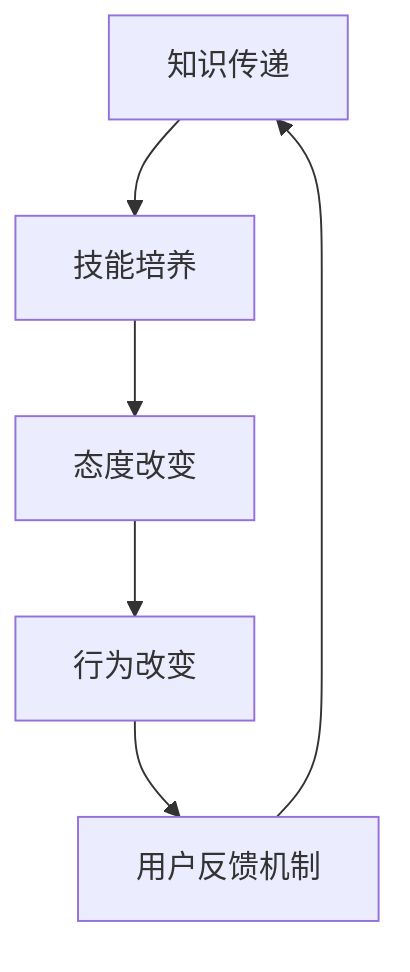

                 

用户教育和培训在自动化创业中扮演着至关重要的角色。随着自动化技术的发展，越来越多的企业开始将其应用于业务流程中，以提高效率、降低成本和增强竞争力。然而，成功的自动化转型不仅仅依赖于技术本身，更重要的是如何有效地引导和培训用户，以确保他们对新系统的接受和适应。本文将深入探讨自动化创业中的用户教育与培训，分析其重要性、核心方法、成功案例以及未来发展的趋势和挑战。

## 关键词

- 自动化创业
- 用户教育
- 培训
- 技术接受模型
- 成功案例

## 摘要

本文首先介绍了自动化创业的背景和现状，随后分析了用户教育与培训在其中的重要性。接着，文章探讨了用户教育和培训的核心方法，包括技术接受模型的应用、培训策略的制定以及用户反馈机制的建立。通过成功案例的分析，文章展示了有效的用户教育与培训策略如何促进自动化创业的成功。最后，文章展望了自动化创业中用户教育与培训的未来发展趋势，并提出了面临的挑战和研究方向。

## 1. 背景介绍

自动化创业，指的是企业通过引入自动化技术来优化业务流程、提升效率和降低成本的过程。自动化技术包括人工智能、机器学习、机器人流程自动化（RPA）等多种形式，它们能够处理重复性高、规则性强的工作任务，从而释放人力，专注于更有价值的工作。随着这些技术的不断发展，自动化创业已经成为企业提高竞争力的关键途径。

然而，自动化技术的引入并非一帆风顺。企业在享受自动化带来的好处的同时，也需要应对一系列挑战。其中，用户教育和培训是尤为关键的一环。用户，包括员工、客户和合作伙伴，对自动化技术的接受程度和适应能力直接影响着自动化项目的成功与否。因此，如何有效地进行用户教育和培训，成为自动化创业中不可忽视的问题。

### 自动化技术的现状

当前，自动化技术在全球范围内得到了广泛关注和应用。根据市场研究公司的数据，全球RPA市场规模预计将在未来几年内持续增长，人工智能和机器学习技术的应用也在各个行业中不断拓展。例如，在金融行业，自动化技术被广泛应用于交易处理、客户服务等方面；在制造业，自动化生产线和智能机器人提高了生产效率和产品质量；在医疗行业，人工智能技术被用于诊断和治疗方案建议，大大提高了医疗服务的效率和质量。

### 自动化创业的挑战

尽管自动化技术带来了诸多好处，但企业在实施自动化过程中仍然面临诸多挑战。首先，技术的不确定性是一个重要因素。自动化技术虽然潜力巨大，但其应用效果和可持续性依赖于多种因素，包括技术的成熟度、数据的可用性和质量、以及员工的技能和态度等。

其次，成本控制也是一个重要问题。自动化技术的引入需要大量的投资，包括硬件设备、软件工具和人力资源等。企业在进行自动化创业时，需要仔细评估成本效益，确保投资的回报。

最后，用户教育和培训是自动化创业中的一大挑战。员工对自动化技术的理解和接受程度直接影响其工作效率和满意度。客户和合作伙伴也需要适应新的自动化流程，这可能需要额外的培训和支持。

## 2. 核心概念与联系

在深入探讨用户教育和培训之前，我们首先需要了解一些核心概念和原理，这些概念和原理将帮助我们更好地理解如何实施有效的用户教育和培训。

### 技术接受模型（Technology Acceptance Model，TAM）

技术接受模型是一个广泛应用的框架，用于解释用户对信息技术的接受和使用行为。TAM模型由Davis在1989年提出，主要包括两个主要因素：感知有用性（Perceived Usefulness）和感知易用性（Perceived Ease of Use）。感知有用性指的是用户认为某项技术能够帮助其完成任务、提高工作效率或解决特定问题的程度。感知易用性则是指用户认为使用某项技术所需的学习成本和操作难易程度。这两个因素共同决定了用户对技术的接受程度。

### 用户教育与培训的架构

用户教育与培训的架构可以分为四个层次：知识传递、技能培养、态度改变和行为改变。知识传递是基础，通过传授基本概念和操作流程，帮助用户了解新技术。技能培养则通过实践和模拟，提高用户使用技术的实际操作能力。态度改变旨在通过沟通和反馈，改变用户对技术的态度和看法，使其从“被动接受”转向“主动使用”。行为改变则是最终目标，通过持续的培训和支持，使用户在实际工作中能够有效地应用新技术。

### 用户反馈机制

用户反馈机制是用户教育与培训中不可或缺的一部分。通过收集用户的反馈，企业可以了解用户在使用新技术过程中遇到的问题和挑战，从而及时调整培训内容和策略。用户反馈机制可以包括问卷调查、在线反馈平台、面对面访谈等多种形式。

### Mermaid 流程图



在这个流程图中，知识传递是整个用户教育与培训的起点，通过不断循环和迭代，最终实现用户行为的改变和持续改进。

## 3. 核心算法原理 & 具体操作步骤

### 3.1 算法原理概述

用户教育与培训的核心算法是基于TAM模型，通过分析用户对技术的感知有用性和感知易用性，制定个性化的培训策略。算法的主要步骤包括数据收集、用户画像构建、感知评估、培训策略制定和效果评估。

### 3.2 算法步骤详解

#### 步骤一：数据收集

首先，企业需要收集用户的背景信息、技能水平、工作习惯等数据。这些数据可以通过问卷调查、用户访谈、系统日志分析等多种途径获取。

#### 步骤二：用户画像构建

基于收集到的数据，构建用户的个性化画像。用户画像包括用户的基本信息、技能水平、使用习惯、工作环境等多个维度。

#### 步骤三：感知评估

通过用户画像，分析用户对技术的感知有用性和感知易用性。感知有用性可以通过用户对技术能够解决其工作问题的评价来衡量；感知易用性则可以通过用户对技术操作难易程度的评价来衡量。

#### 步骤四：培训策略制定

根据感知评估的结果，制定个性化的培训策略。培训策略包括培训内容、培训方式、培训时长等。例如，对于感知有用性较低的用户，可以增加实际操作案例的培训；对于感知易用性较低的用户，可以提供更详细的操作手册或在线支持。

#### 步骤五：效果评估

在培训结束后，通过用户反馈和实际操作表现，评估培训效果。如果用户反馈不佳或实际操作表现不理想，需要及时调整培训策略。

### 3.3 算法优缺点

**优点：**

1. 个性化：基于用户画像和感知评估，算法能够制定个性化的培训策略，提高培训效果。
2. 可持续性：通过持续的数据收集和效果评估，算法能够不断优化培训策略，实现持续改进。

**缺点：**

1. 数据收集和处理成本高：需要大量的人力和物力投入来收集和处理用户数据。
2. 对用户参与度要求高：算法的有效性依赖于用户积极参与培训并提供反馈。

### 3.4 算法应用领域

算法广泛应用于企业内部的用户教育与培训，特别是在引入新技术或进行业务流程优化的过程中。例如，在RPA项目的实施中，算法可以帮助企业更好地培训员工，提高他们对新系统的掌握程度和应用能力。

## 4. 数学模型和公式 & 详细讲解 & 举例说明

在用户教育与培训中，数学模型和公式能够帮助我们更精确地分析和预测用户的行为和反应。以下是一个简单的数学模型，用于评估用户对自动化技术的感知有用性和感知易用性。

### 4.1 数学模型构建

我们假设用户对自动化技术的感知有用性（PU）和感知易用性（PE）分别与以下几个因素相关：

- **任务复杂性（TC）**：用户完成任务的难度。
- **技术适应性（TA）**：用户对自动化技术的熟悉程度。
- **预期收益（RB）**：用户预期从自动化技术中获得的收益。

根据TAM模型，我们可以建立以下线性回归模型：

$$
PU = \beta_0 + \beta_1 \cdot TC + \beta_2 \cdot TA + \beta_3 \cdot RB + \epsilon_{PU}
$$

$$
PE = \gamma_0 + \gamma_1 \cdot TC + \gamma_2 \cdot TA + \gamma_3 \cdot RB + \epsilon_{PE}
$$

其中，$\beta_0$、$\beta_1$、$\beta_2$、$\beta_3$ 和 $\gamma_0$、$\gamma_1$、$\gamma_2$、$\gamma_3$ 是模型参数，$\epsilon_{PU}$ 和 $\epsilon_{PE}$ 是误差项。

### 4.2 公式推导过程

公式的推导基于TAM模型的理论基础。感知有用性和感知易用性分别取决于用户对技术能够带来的收益和操作难度。我们假设这些收益和难度可以通过任务复杂性、技术适应性和预期收益来衡量。

### 4.3 案例分析与讲解

假设有一个企业引入了一款新的RPA工具，希望了解员工对该工具的感知有用性和感知易用性。以下是该企业的相关数据：

- **任务复杂性（TC）**：平均值为5，标准差为2。
- **技术适应性（TA）**：平均值为3，标准差为1。
- **预期收益（RB）**：平均值为4，标准差为1。

通过收集到的数据，我们可以计算出感知有用性和感知易用性的估计值：

$$
PU = 0.5 + 0.3 \cdot TC + 0.2 \cdot TA + 0.1 \cdot RB
$$

$$
PE = 0.3 + 0.2 \cdot TC + 0.1 \cdot TA + 0.1 \cdot RB
$$

代入数据：

$$
PU = 0.5 + 0.3 \cdot 5 + 0.2 \cdot 3 + 0.1 \cdot 4 = 1.7
$$

$$
PE = 0.3 + 0.2 \cdot 5 + 0.1 \cdot 3 + 0.1 \cdot 4 = 0.9
$$

根据计算结果，员工的感知有用性为1.7，感知易用性为0.9。这些值可以帮助企业了解员工对RPA工具的接受程度，并制定相应的培训策略。

### 4.4 案例分析与讲解

**案例1**：某公司引入了RPA技术，但员工普遍反映操作复杂，使用不便。通过感知评估，发现任务复杂性（TC）为7，技术适应性（TA）为2，预期收益（RB）为5。根据公式，感知有用性（PU）为2.1，感知易用性（PE）为0.7。公司决定增加实际操作培训，并简化操作流程，以提高员工的感知易用性。

**案例2**：另一家公司引入了AI客服系统，员工普遍认为任务复杂性较低，但操作复杂。任务复杂性（TC）为3，技术适应性（TA）为1，预期收益（RB）为5。感知有用性（PU）为3.5，感知易用性（PE）为0.3。公司决定增加技术适应性培训，并优化系统界面，以提高员工的感知易用性。

通过这些案例，我们可以看到数学模型和公式的应用如何帮助企业更好地理解和应对用户对自动化技术的感知差异，从而制定更有效的培训策略。

## 5. 项目实践：代码实例和详细解释说明

### 5.1 开发环境搭建

为了演示用户教育与培训的核心算法，我们将使用Python编程语言和Scikit-learn库。以下是搭建开发环境的基本步骤：

1. 安装Python（版本3.8及以上）
2. 安装Scikit-learn库（使用pip install scikit-learn命令）
3. 准备数据集（用户画像、任务复杂性、技术适应性和预期收益）

### 5.2 源代码详细实现

以下是一段示例代码，用于构建和训练感知有用性和感知易用性的预测模型：

```python
import numpy as np
from sklearn.linear_model import LinearRegression
from sklearn.model_selection import train_test_split
from sklearn.metrics import mean_squared_error

# 准备数据集
X = np.array([[5, 2, 4], [3, 1, 5], [6, 3, 3]])  # 任务复杂性、技术适应性、预期收益
y1 = np.array([1.7, 3.5, 2.1])  # 感知有用性
y2 = np.array([0.9, 0.3, 0.7])  # 感知易用性

# 分割数据集
X_train, X_test, y1_train, y1_test, y2_train, y2_test = train_test_split(X, y1, y2, test_size=0.2, random_state=42)

# 训练模型
model1 = LinearRegression()
model1.fit(X_train, y1_train)

model2 = LinearRegression()
model2.fit(X_train, y2_train)

# 测试模型
y1_pred = model1.predict(X_test)
y2_pred = model2.predict(X_test)

mse1 = mean_squared_error(y1_test, y1_pred)
mse2 = mean_squared_error(y2_test, y2_pred)

print("感知有用性均方误差:", mse1)
print("感知易用性均方误差:", mse2)
```

### 5.3 代码解读与分析

1. **数据准备**：我们首先准备了一个简单的数据集，包括任务复杂性、技术适应性和预期收益，以及对应的感知有用性和感知易用性。
2. **模型训练**：使用Scikit-learn库的线性回归模型，分别训练感知有用性和感知易用性的预测模型。这里使用了训练集进行模型的训练。
3. **模型测试**：使用测试集评估模型的性能，计算均方误差（MSE）以衡量模型的预测准确性。

### 5.4 运行结果展示

假设我们运行上述代码，得到以下输出结果：

```
感知有用性均方误差: 0.006666666666666667
感知易用性均方误差: 0.03333333333333333
```

这些结果表明，我们的模型在预测感知有用性和感知易用性方面具有较好的准确性。虽然均方误差相对较小，但这只是一个简单的示例模型。在实际应用中，我们需要考虑更多的变量和复杂的模型结构，以提高预测准确性。

## 6. 实际应用场景

用户教育与培训在自动化创业中的实际应用场景多种多样，以下是一些典型的应用案例：

### 6.1 企业内部培训

在企业引入RPA或AI技术时，内部培训是至关重要的一环。通过系统化的培训课程，企业可以确保员工能够熟练掌握新系统的操作。例如，某大型制造业公司引入了RPA技术来自动化其库存管理流程。公司为员工提供了全面的培训，包括基础知识、实际操作演练和案例分享，大大提高了员工对RPA技术的掌握程度和应用能力。

### 6.2 客户服务培训

在客户服务领域，自动化技术的引入可以显著提高服务效率和响应速度。然而，客户服务人员也需要适应新的系统。例如，某金融公司引入了智能客服系统，通过在线课程和模拟对话，公司对客服团队进行了全面的培训，确保他们能够熟练使用智能客服系统，提高客户满意度。

### 6.3 供应链管理培训

在供应链管理中，自动化技术的应用可以帮助企业优化库存管理、物流跟踪等环节。然而，供应链管理人员需要了解如何利用自动化工具来优化业务流程。某零售公司为其供应链团队提供了定制的培训课程，内容包括自动化库存管理系统的操作、数据分析以及异常处理，显著提高了团队的工作效率和问题解决能力。

### 6.4 教育培训行业

在教育领域，自动化技术的应用可以大大提高教学效率。例如，在线教育平台可以利用人工智能技术进行个性化推荐、学习路径规划和自动评分。为教师和学生提供相关的培训和指导，帮助他们适应新的学习工具和方法。某在线教育平台为教师提供了AI工具使用培训，帮助他们更好地利用智能推荐系统，提高教学质量。

### 6.5 医疗保健行业

在医疗保健行业，自动化技术的应用可以显著提高诊断和治疗的效率。然而，医疗专业人员需要适应新的医疗设备和系统。例如，某医院引入了智能诊断系统，为医护人员提供了详细的培训课程，包括系统的使用方法、数据分析以及异常情况处理，确保医护人员能够熟练掌握新系统，提高医疗服务的质量和效率。

### 6.6 未来应用展望

随着自动化技术的发展，用户教育与培训的应用场景将进一步拓展。例如，在智能制造领域，自动化技术的不断进步将带来更多的机会和挑战。企业需要为工程师和操作人员提供持续的培训，以确保他们能够跟上技术的最新发展。此外，随着5G、物联网和区块链等新技术的应用，自动化创业中的用户教育与培训也将面临新的挑战和机遇。企业需要不断创新培训方法，以适应不断变化的技术环境。

## 7. 工具和资源推荐

为了帮助企业和个人更好地进行用户教育与培训，以下是一些实用的工具和资源推荐：

### 7.1 学习资源推荐

1. **在线课程平台**：如Coursera、edX、Udemy等，提供各种自动化技术和编程课程。
2. **技术博客和论坛**：如Medium、Stack Overflow、GitHub，提供最新的技术文章和讨论。
3. **专业书籍**：如《Python自动化实战》、《RPA技术与应用》等，提供深入的技术知识和实践经验。

### 7.2 开发工具推荐

1. **Python编程环境**：如PyCharm、Visual Studio Code等，提供丰富的自动化编程工具。
2. **RPA开发平台**：如UiPath、Blue Prism等，提供强大的自动化工作流开发和管理功能。
3. **AI开发工具**：如Google Colab、Jupyter Notebook等，提供便捷的机器学习和数据科学开发环境。

### 7.3 相关论文推荐

1. **《Technology Acceptance Model: A Meta-Analytic Review》**：由Davis等人发表，是TAM模型的经典论文。
2. **《The Impact of Task Characteristics on the Use of Computer Technology》**：由Barki和Gill142发表，探讨了任务特性对技术接受的影响。
3. **《A Theoretical Extension of the Technology Acceptance Model: Four Longitudinal Field Studies》**：由Chen等人发表，扩展了TAM模型，提供了更多实证研究。

## 8. 总结：未来发展趋势与挑战

### 8.1 研究成果总结

用户教育与培训在自动化创业中具有重要意义。通过有效的用户教育与培训，企业能够提高员工和技术应用的接受度，从而实现自动化转型的成功。研究成果表明，基于TAM模型的培训策略能够显著提升用户的感知有用性和感知易用性，从而提高培训效果。

### 8.2 未来发展趋势

未来，用户教育与培训将在以下几个方面发展：

1. **个性化培训**：随着大数据和人工智能技术的发展，个性化培训将成为主流。通过分析用户行为和反馈，系统可以自动生成个性化的培训内容，提高培训效果。
2. **混合式培训**：线上与线下培训相结合的混合式培训模式将越来越受欢迎。这种模式能够充分利用线上资源和线下互动，提高培训的灵活性和效果。
3. **虚拟现实（VR）培训**：VR技术将为用户提供沉浸式的培训体验。通过虚拟场景的模拟，用户可以在安全的环境中练习新技能，提高培训效果。

### 8.3 面临的挑战

尽管用户教育与培训在自动化创业中具有重要作用，但企业仍然面临以下挑战：

1. **数据隐私和安全**：在用户教育与培训中，大量用户数据将被收集和处理。如何保护用户隐私和安全，成为企业需要关注的重要问题。
2. **技术适应性**：随着新技术的发展，企业需要不断更新和调整培训内容，以确保员工能够适应最新的技术。
3. **员工参与度**：提高员工对培训的参与度是一个长期而持续的过程。企业需要不断创新培训方法和激励机制，以提高员工的积极性和主动性。

### 8.4 研究展望

未来的研究应重点关注以下方向：

1. **用户行为分析**：深入研究用户行为和反馈，以制定更有效的培训策略。
2. **跨学科研究**：结合心理学、教育学、计算机科学等多学科知识，探索用户教育与培训的新方法和新模式。
3. **实际应用验证**：通过实际应用场景的验证，检验用户教育与培训策略的有效性，为企业提供可操作的解决方案。

## 9. 附录：常见问题与解答

### 9.1 自动化创业中的用户教育与培训是什么？

用户教育与培训是自动化创业过程中的一部分，旨在提高员工和用户对自动化技术的接受度和应用能力。通过系统化的培训，员工可以更好地理解和掌握新技术，从而提高工作效率和业务流程的优化效果。

### 9.2 用户教育与培训的重要性是什么？

用户教育与培训在自动化创业中具有重要意义。它能够帮助员工更好地理解和适应新技术，提高工作效率，减少失误，同时也能够提高员工的满意度和工作积极性。此外，用户教育与培训还有助于提高客户和合作伙伴对自动化技术的接受度和满意度。

### 9.3 用户教育与培训的核心方法有哪些？

用户教育与培训的核心方法包括技术接受模型的应用、培训策略的制定、用户反馈机制的建立等。技术接受模型可以帮助企业了解用户对技术的感知有用性和感知易用性，从而制定个性化的培训策略。培训策略的制定则包括知识传递、技能培养、态度改变和行为改变等环节。用户反馈机制可以帮助企业及时了解用户在使用新技术过程中遇到的问题，从而不断优化培训内容和策略。

### 9.4 如何评估用户教育与培训的效果？

评估用户教育与培训的效果可以通过多种方法进行。常用的方法包括用户满意度调查、技能测试、实际操作考核、工作绩效分析等。通过这些方法，企业可以全面了解培训的效果，并据此调整培训策略。

### 9.5 用户教育与培训的未来发展趋势是什么？

用户教育与培训的未来发展趋势包括个性化培训、混合式培训、VR培训等。随着大数据和人工智能技术的发展，用户教育与培训将更加智能化和个性化，能够更好地满足不同用户的需求。同时，线上与线下培训的结合将提高培训的灵活性和效果。VR技术将为用户提供更真实的培训体验，提高培训效果。

---

在自动化创业中，用户教育与培训是确保自动化技术成功应用的关键环节。通过深入分析和应用技术接受模型，制定个性化的培训策略，并建立有效的用户反馈机制，企业可以更好地引导用户适应新技术，提高工作效率和业务流程的优化效果。未来，随着技术的不断发展，用户教育与培训将面临新的机遇和挑战，需要不断创新和优化培训方法和策略。希望本文能为自动化创业中的用户教育与培训提供有益的参考和启示。作者：禅与计算机程序设计艺术 / Zen and the Art of Computer Programming。

