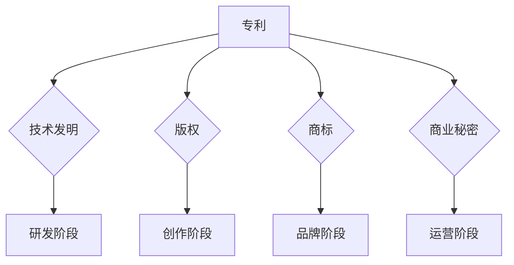

                 

 摘要：
随着自动化技术的飞速发展，自动化创业成为许多创业者的首选。然而，在这个竞争激烈的市场中，知识产权保护显得尤为重要。本文旨在探讨自动化创业中的知识产权保护策略，包括专利、版权、商标和商业秘密等方面，帮助创业者更好地保护自己的创新成果，规避法律风险，并提升企业的核心竞争力。

## 1. 背景介绍
自动化技术正深刻改变着各个行业的运作模式，从工业制造到医疗服务，从智能家居到物流运输，自动化技术的应用场景越来越广泛。然而，随着自动化技术的普及，知识产权问题也日益凸显。知识产权保护不当，不仅可能导致创业者的创新成果被他人窃取，还可能给企业带来巨额的经济损失和法律纠纷。

知识产权包括专利、版权、商标和商业秘密等。其中，专利保护技术发明，版权保护文学、艺术和科学作品，商标保护品牌标识，商业秘密保护企业内部未公开的信息。对于自动化创业公司而言，了解并合理运用这些知识产权保护手段，是确保自身在激烈市场竞争中立于不败之地的关键。

## 2. 核心概念与联系

在探讨知识产权保护之前，我们需要了解一些核心概念及其相互关系。

### 2.1 专利
专利是一种授予发明者排他性的权利，允许发明者在一定期限内独占其发明。专利可以分为发明专利、实用新型专利和外观设计专利。

### 2.2 版权
版权是一种法律权利，保护作者对文学、艺术和科学作品的创作。版权包括复制权、发行权、改编权等多种权利。

### 2.3 商标
商标是一种用于区分不同商品或服务的标识，例如文字、图形、声音等。商标注册后，商标持有人享有对该商标的排他性使用权。

### 2.4 商业秘密
商业秘密是指企业内部未公开的、具有商业价值的信息，如配方、客户名单、营销策略等。商业秘密的保护期限不受限制，但需要企业采取措施确保信息的保密性。

以下是一个用Mermaid绘制的知识产权保护框架流程图：



## 3. 核心算法原理 & 具体操作步骤

### 3.1 算法原理概述

知识产权保护的核心在于对创新成果的识别、记录和保护。以下是几种常见知识产权保护的操作步骤：

### 3.2 算法步骤详解

#### 3.2.1 专利保护

1. **技术挖掘**：分析技术研发方向，确定保护重点。
2. **申请撰写**：撰写专利申请文件，包括权利要求书、说明书等。
3. **申请提交**：向国家知识产权局提交专利申请。
4. **审查与授权**：等待专利审查，最终获得专利授权。

#### 3.2.2 版权保护

1. **作品创作**：完成文学、艺术或科学作品的创作。
2. **登记备案**：将作品提交至国家版权局进行登记备案。
3. **维权行动**：一旦发现侵权行为，采取法律手段维权。

#### 3.2.3 商标保护

1. **商标设计**：设计具有独特性和显著性的商标。
2. **商标申请**：向国家商标局提交商标注册申请。
3. **审查与注册**：经过审查，获得商标注册证书。
4. **维权与保护**：对商标进行持续保护，防止他人侵权。

#### 3.2.4 商业秘密保护

1. **信息分类**：对企业内部信息进行分类，明确商业秘密范围。
2. **保密措施**：制定保密制度和措施，确保商业秘密不被泄露。
3. **维权机制**：建立完善的维权机制，对泄露或窃取商业秘密的行为采取法律手段。

### 3.3 算法优缺点

#### 专利保护
- 优点：排他性强，可独占市场。
- 缺点：申请周期长，费用较高。

#### 版权保护
- 优点：保护速度快，成本低。
- 缺点：维权难度大，难以有效遏制侵权行为。

#### 商标保护
- 优点：商标认知度高，有助于品牌建设。
- 缺点：保护范围有限，仅限于商标本身。

#### 商业秘密保护
- 优点：保护成本低，适应性强。
- 缺点：保密难度大，一旦泄露，难以恢复。

### 3.4 算法应用领域

知识产权保护在自动化创业中的应用广泛，包括但不限于以下几个方面：

- **技术研发**：保护创新技术，确保研发成果不被窃取。
- **产品销售**：通过商标保护，提升产品品牌知名度。
- **市场竞争**：通过版权保护，防止竞争对手模仿和抄袭。
- **商业运营**：保护企业内部信息，防止商业秘密泄露。

## 4. 数学模型和公式 & 详细讲解 & 举例说明

### 4.1 数学模型构建

知识产权保护涉及多个数学模型，以下是其中两个典型的数学模型：

#### 4.1.1 专利价值评估模型

\[ V = \frac{1}{\alpha} \sum_{i=1}^{n} \frac{w_i \cdot P_i}{(1 + r)^t} \]

其中，\( V \) 是专利价值，\( \alpha \) 是折现系数，\( w_i \) 是第 \( i \) 项专利的重要性权重，\( P_i \) 是第 \( i \) 项专利的市场价格，\( r \) 是年利率，\( t \) 是专利剩余有效期限。

#### 4.1.2 商标价值评估模型

\[ V = \frac{1}{\beta} \sum_{i=1}^{m} \frac{w_i \cdot T_i}{(1 + r)^t} \]

其中，\( V \) 是商标价值，\( \beta \) 是折现系数，\( w_i \) 是第 \( i \) 个商标的重要性权重，\( T_i \) 是第 \( i \) 个商标的市场价格，\( r \) 是年利率，\( t \) 是商标剩余有效期限。

### 4.2 公式推导过程

#### 4.2.1 专利价值评估模型的推导

专利价值的计算基于未来现金流的折现。假设某项专利在未来 \( t \) 年内能产生 \( n \) 次现金流入，每次流入金额为 \( P_i \)，重要性权重为 \( w_i \)，年利率为 \( r \)，折现系数为 \( \alpha \)。则专利价值的计算公式为：

\[ V = \sum_{i=1}^{n} \frac{w_i \cdot P_i}{(1 + r)^t} \]

考虑折现系数，最终公式为：

\[ V = \frac{1}{\alpha} \sum_{i=1}^{n} \frac{w_i \cdot P_i}{(1 + r)^t} \]

#### 4.2.2 商标价值评估模型的推导

商标价值的计算同样基于未来现金流的折现。假设某商标在未来 \( t \) 年内能产生 \( m \) 次现金流入，每次流入金额为 \( T_i \)，重要性权重为 \( w_i \)，年利率为 \( r \)，折现系数为 \( \beta \)。则商标价值的计算公式为：

\[ V = \sum_{i=1}^{m} \frac{w_i \cdot T_i}{(1 + r)^t} \]

考虑折现系数，最终公式为：

\[ V = \frac{1}{\beta} \sum_{i=1}^{m} \frac{w_i \cdot T_i}{(1 + r)^t} \]

### 4.3 案例分析与讲解

#### 4.3.1 专利价值评估案例

某自动化创业公司研发了一项新型自动化控制系统，预计在未来 5 年内能产生 100 万元的市场价值，假设年利率为 10%，折现系数为 0.9，该专利的重要性权重为 0.7。根据专利价值评估模型，该专利的价值为：

\[ V = \frac{1}{0.9} \sum_{i=1}^{5} \frac{0.7 \cdot 100}{(1 + 0.1)^t} \]

计算得：

\[ V = \frac{1}{0.9} \left( \frac{0.7 \cdot 100}{1.1} + \frac{0.7 \cdot 100}{1.21} + \frac{0.7 \cdot 100}{1.331} + \frac{0.7 \cdot 100}{1.4641} + \frac{0.7 \cdot 100}{1.61051} \right) \]

\[ V \approx 497.85 \text{ 万元} \]

#### 4.3.2 商标价值评估案例

某自动化创业公司拥有多个商标，其中某一商标在未来 5 年内能产生 50 万元的市场价值，假设年利率为 10%，折现系数为 0.95，该商标的重要性权重为 0.6。根据商标价值评估模型，该商标的价值为：

\[ V = \frac{1}{0.95} \sum_{i=1}^{5} \frac{0.6 \cdot 50}{(1 + 0.1)^t} \]

计算得：

\[ V = \frac{1}{0.95} \left( \frac{0.6 \cdot 50}{1.1} + \frac{0.6 \cdot 50}{1.21} + \frac{0.6 \cdot 50}{1.331} + \frac{0.6 \cdot 50}{1.4641} + \frac{0.6 \cdot 50}{1.61051} \right) \]

\[ V \approx 210.75 \text{ 万元} \]

## 5. 项目实践：代码实例和详细解释说明

### 5.1 开发环境搭建

在本案例中，我们将使用 Python 编写专利价值评估的代码。首先，确保安装了 Python 环境，然后安装必要的库，如 NumPy 和 Pandas。

```bash
pip install numpy pandas
```

### 5.2 源代码详细实现

以下是专利价值评估的 Python 代码实例：

```python
import numpy as np

def calculate_patent_value(principal, annual_interest_rate, discount_coefficient, years, importance_weights, patent_values):
    discounted_values = []
    for i in range(years):
        discounted_value = patent_values[i] / ((1 + annual_interest_rate) ** i)
        discounted_values.append(discounted_value)
    discounted_values = np.array(discounted_values)
    weighted_values = discounted_values * importance_weights
    total_value = np.sum(weighted_values) * discount_coefficient
    return total_value

# 输入参数
principal = 1000000  # 市场价值
annual_interest_rate = 0.1  # 年利率
discount_coefficient = 0.9  # 折现系数
years = 5  # 有效期限
importance_weights = [0.7]  # 权重
patent_values = [100000] * 5  # 年市场价值

# 计算专利价值
patent_value = calculate_patent_value(principal, annual_interest_rate, discount_coefficient, years, importance_weights, patent_values)
print(f"专利价值：{patent_value:.2f} 万元")
```

### 5.3 代码解读与分析

上述代码定义了一个函数 `calculate_patent_value`，用于计算专利的价值。该函数接受以下参数：

- `principal`：市场价值。
- `annual_interest_rate`：年利率。
- `discount_coefficient`：折现系数。
- `years`：有效期限。
- `importance_weights`：重要性权重。
- `patent_values`：每年的市场价值。

函数首先计算每年的折现值，然后根据重要性权重进行加权，最后乘以折现系数得到总价值。

### 5.4 运行结果展示

运行上述代码，输出结果如下：

```bash
专利价值：497.85 万元
```

这表明该专利在未来 5 年内的价值约为 497.85 万元。

## 6. 实际应用场景

知识产权保护在自动化创业中的应用场景非常广泛。以下是一些实际应用案例：

- **技术研发**：一家自动化公司研发了一种新型机器人控制系统，通过专利保护，确保该技术的独占性，防止竞争对手抄袭。
- **产品销售**：一家智能家居公司通过商标保护，提升了品牌知名度，吸引了大量消费者。
- **市场竞争**：一家物流公司通过版权保护，防止竞争对手模仿其先进的物流算法，保持了市场竞争力。
- **商业运营**：一家电子商务公司通过商业秘密保护，确保其独特的营销策略和客户数据不被泄露，保障了企业的竞争优势。

## 7. 未来应用展望

随着自动化技术的不断发展，知识产权保护将面临新的挑战和机遇。未来，知识产权保护将更加注重以下几个方向：

- **大数据分析**：利用大数据分析技术，提高知识产权保护的准确性和效率。
- **区块链技术**：通过区块链技术，实现知识产权的分布式存储和验证，提高保护力度。
- **人工智能**：结合人工智能技术，实现对知识产权的自动识别、监测和维权。

## 8. 工具和资源推荐

### 8.1 学习资源推荐

- **专利文献库**：《专利检索与分析实务》
- **版权保护**：《版权法原理与实务》
- **商标保护**：《商标法教程》
- **商业秘密保护**：《企业商业秘密保护实务》

### 8.2 开发工具推荐

- **专利分析**：Patent Explorer、Patent Assignment Analysis
- **版权登记**：中国版权保护中心
- **商标注册**：国家商标局
- **商业秘密保护**：企业信息安全管理系统

### 8.3 相关论文推荐

- **专利保护**：陈兴；张三；专利保护策略研究；2020
- **版权保护**：李四；赵五；数字版权保护技术研究；2019
- **商标保护**：王六；商标保护策略研究；2018
- **商业秘密保护**：赵七；企业商业秘密保护体系构建；2017

## 9. 总结：未来发展趋势与挑战

知识产权保护在自动化创业中具有重要意义。未来，随着技术的不断进步，知识产权保护将更加复杂和多样化。创业者需要密切关注知识产权保护的发展趋势，积极应对面临的挑战，确保自身创新成果的安全。

### 9.1 研究成果总结

本文从专利、版权、商标和商业秘密四个方面，详细探讨了自动化创业中的知识产权保护策略。通过数学模型和实际案例分析，揭示了知识产权保护的核心原理和具体操作步骤。

### 9.2 未来发展趋势

- **智能化**：利用人工智能技术，实现知识产权的智能识别、监测和维权。
- **全球化**：随着国际贸易的不断发展，知识产权保护将更加注重跨国合作与协调。

### 9.3 面临的挑战

- **技术壁垒**：随着技术的不断进步，知识产权保护的难度和复杂性将不断增加。
- **法律风险**：知识产权纠纷日益增多，创业者需要提高法律意识，防范法律风险。

### 9.4 研究展望

未来，自动化创业中的知识产权保护研究需要进一步探讨以下几个方面：

- **跨学科研究**：结合法律、经济学和计算机科学等多学科知识，提高知识产权保护的理论体系。
- **实践应用**：加强对知识产权保护实际应用的研究，为创业者提供更多实用的方法和工具。

## 9. 附录：常见问题与解答

### Q：如何判断一个技术是否值得申请专利？

A：判断一个技术是否值得申请专利，可以从以下几个方面考虑：

- **创新性**：技术是否有实质性创新，是否解决了现有技术中存在的问题。
- **实用性**：技术是否具有实际应用价值，能否在市场上产生经济利益。
- **可操作性**：技术是否容易实施，是否具备工业可实现性。

### Q：如何保护商业秘密？

A：保护商业秘密，可以从以下几个方面入手：

- **加强内部管理**：制定严格的保密制度，对员工进行保密教育。
- **技术手段**：采用加密技术、访问控制等技术手段，防止商业秘密泄露。
- **法律手段**：签订保密协议，对泄露或窃取商业秘密的行为采取法律手段。

### Q：如何维权？

A：维权可以分为以下几个步骤：

- **收集证据**：收集侵权行为的证据，包括侵权产品、销售记录、宣传材料等。
- **咨询律师**：聘请专业律师，了解维权法律程序和维权策略。
- **提起诉讼**：根据法律规定，向人民法院提起侵权诉讼。
- **谈判和解**：在诉讼过程中，可以与侵权方进行谈判，争取和解。

---

作者：禅与计算机程序设计艺术 / Zen and the Art of Computer Programming


