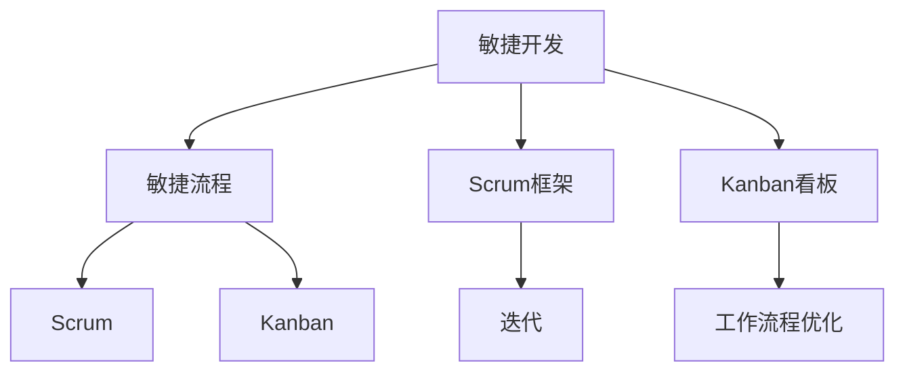

                 

 在自动化创业领域，跨团队协作是确保项目成功的关键因素之一。本文将深入探讨自动化创业过程中跨团队协作的重要性、核心概念、最佳实践和未来趋势。

## 文章关键词
- 自动化创业
- 跨团队协作
- 项目管理
- 敏捷开发
- 数字化转型

## 摘要
本文旨在分析自动化创业背景下的跨团队协作，探讨其重要性、核心概念、最佳实践和未来趋势。通过详细的理论阐述和案例分析，帮助读者理解如何在自动化创业中实现高效的跨团队协作。

### 1. 背景介绍
自动化创业的浪潮在全球范围内兴起，许多初创公司都在探索如何利用先进的自动化技术实现业务创新和增长。在这个过程中，跨团队协作的重要性愈发凸显。自动化技术涉及多个领域，如人工智能、机器学习、物联网和区块链等，这些领域的专业知识通常分布在不同的团队中。

有效的跨团队协作能够帮助初创公司快速响应市场变化、优化资源分配、提高产品质量和缩短产品上市时间。然而，跨团队协作并非易事，它需要团队成员之间的高效沟通、共同的目标和相互的信任。

### 2. 核心概念与联系
为了实现高效的跨团队协作，首先需要理解一些核心概念和它们之间的联系。以下是几个关键概念及其相互关系：

- **敏捷开发**：敏捷开发是一种应对快速变化的需求的软件开发方法。它强调持续交付有价值的软件、欢迎变化、个体和互动、工作的软件、客户合作和应对变化。
- **敏捷流程**：敏捷流程是一系列用于实现敏捷开发的实践和方法，如Scrum、Kanban和XP等。
- **Scrum框架**：Scrum是一种流行的敏捷流程，它通过短周期的迭代（Sprint）和频繁的评审会议来促进团队的透明度和协作。
- **Kanban看板**：Kanban是一种可视化管理工具，用于跟踪项目进度、识别瓶颈和优化工作流程。

以下是一个简化的Mermaid流程图，展示了这些核心概念之间的联系：



### 3. 核心算法原理 & 具体操作步骤
#### 3.1 算法原理概述
跨团队协作的核心在于确保团队成员之间的沟通畅通、任务分配合理和目标一致。以下是实现这一目标的几个关键原理：

- **透明度**：通过共享项目进度和问题，团队成员可以及时了解项目状态，减少误解和冲突。
- **协作**：团队成员之间需要相互依赖、互补技能，共同解决遇到的问题。
- **目标一致性**：所有团队成员都应明确项目的目标和里程碑，以确保努力方向一致。

#### 3.2 算法步骤详解
为了实现高效跨团队协作，可以遵循以下步骤：

1. **定义项目目标**：明确项目的愿景、目标和关键里程碑，确保所有团队成员都了解并认同。
2. **组建团队**：根据项目需求组建多学科团队，确保团队成员具有互补的技能。
3. **沟通机制**：建立定期的沟通机制，如每日站会、周会、项目评审等，确保信息流通。
4. **任务分配**：根据团队成员的技能和经验，合理分配任务，确保每个人都有明确的职责。
5. **进度跟踪**：使用项目管理工具（如JIRA、Trello等）跟踪项目进度，确保所有任务按时完成。
6. **反馈与调整**：定期收集团队成员的反馈，及时调整工作流程和任务分配，优化跨团队协作效率。

#### 3.3 算法优缺点
**优点**：

- 提高项目效率：通过明确的目标、任务分配和进度跟踪，跨团队协作可以显著提高项目效率。
- 减少冲突：透明度和定期的沟通机制有助于减少团队成员之间的误解和冲突。
- 增强团队凝聚力：共同的目标和任务使团队成员更加团结，提高团队凝聚力。

**缺点**：

- 初始设置成本高：建立跨团队协作机制需要一定的时间和资源投入。
- 管理复杂度增加：跨团队协作需要更多的时间来协调和沟通，增加了管理的复杂度。

#### 3.4 算法应用领域
跨团队协作在自动化创业中的应用非常广泛，以下是一些具体的应用领域：

- **软件开发**：跨团队协作是软件开发项目成功的关键，它有助于优化开发流程、提高代码质量和缩短产品上市时间。
- **数据分析**：在自动化创业中，数据分析通常涉及多个学科领域，跨团队协作可以加快数据分析和报告的进度。
- **产品设计**：产品设计需要设计师、产品经理和工程师之间的紧密协作，跨团队协作有助于快速迭代和优化产品设计。

### 4. 数学模型和公式 & 详细讲解 & 举例说明
在跨团队协作中，数学模型和公式可以用于量化协作效率、团队绩效和项目风险。以下是几个常用的数学模型和公式：

#### 4.1 数学模型构建
1. **协作效率模型**：
   $$E = \frac{TP}{TP + FP}$$
   其中，$E$ 表示协作效率，$TP$ 表示团队完成任务的实际时间，$FP$ 表示团队因沟通不畅导致的工作延期时间。

2. **团队绩效模型**：
   $$P = \frac{G}{T}$$
   其中，$P$ 表示团队绩效，$G$ 表示团队在规定时间内完成的工作量，$T$ 表示团队工作的时间。

3. **项目风险模型**：
   $$R = \frac{C \times (1 - P)}{100}$$
   其中，$R$ 表示项目风险，$C$ 表示项目成本，$P$ 表示团队绩效。

#### 4.2 公式推导过程
以上公式的推导基于以下假设：

- **协作效率模型**：假设团队完成任务的实际时间 $TP$ 是在理想情况下完成的，而由于沟通不畅导致的工作延期时间 $FP$ 是不希望的。
- **团队绩效模型**：假设团队绩效是工作量与工作时间的比值，工作量越大，绩效越高。
- **项目风险模型**：假设项目成本与团队绩效成反比，即团队绩效越低，项目风险越高。

#### 4.3 案例分析与讲解
以下是一个实际案例，用于说明如何使用这些数学模型和公式来评估跨团队协作的效率：

**案例背景**：一家初创公司正在开发一款智能家居系统，团队成员包括前端开发、后端开发、UI设计师和测试工程师。

**协作效率模型**：假设该团队在一个月内完成了 80% 的开发任务，但由于沟通不畅，导致有 10% 的任务延期完成。根据协作效率模型：
$$E = \frac{80}{80 + 10} = 0.9375$$
协作效率为 93.75%，说明团队在协作方面还有提升空间。

**团队绩效模型**：假设该团队在一个月内完成了 1000 个功能点，工作时间为 1000 小时。根据团队绩效模型：
$$P = \frac{1000}{1000} = 1$$
团队绩效为 100%，表示团队在规定时间内完成了所有工作量。

**项目风险模型**：假设项目成本为 100 万元，团队绩效为 100%。根据项目风险模型：
$$R = \frac{100 \times (1 - 1)}{100} = 0$$
项目风险为 0%，表示项目几乎没有风险。

通过这些数学模型和公式，初创公司可以量化跨团队协作的效率、团队绩效和项目风险，从而优化跨团队协作策略。

### 5. 项目实践：代码实例和详细解释说明
为了更好地理解跨团队协作在实际项目中的应用，以下是一个简单的代码实例，展示了如何使用Scrum框架进行项目开发。

#### 5.1 开发环境搭建
在本例中，我们将使用Python编写一个简单的智能家居系统，开发环境为Visual Studio Code。

#### 5.2 源代码详细实现
以下是智能家居系统的核心代码：

```python
class SmartHome:
    def __init__(self):
        self.lights = "off"
        self thermostat = "off"

    def turn_on_lights(self):
        self.lights = "on"
        print("Lights are on.")

    def turn_off_lights(self):
        self.lights = "off"
        print("Lights are off.")

    def turn_on_thermostat(self):
        self.thermostat = "on"
        print("Thermostat is on.")

    def turn_off_thermostat(self):
        self.thermostat = "off"
        print("Thermostat is off.")

if __name__ == "__main__":
    smart_home = SmartHome()
    smart_home.turn_on_lights()
    smart_home.turn_on_thermostat()
    smart_home.turn_off_lights()
    smart_home.turn_off_thermostat()
```

#### 5.3 代码解读与分析
以上代码实现了一个简单的智能家居系统，其中包括两个主要功能：灯光控制和温度控制。

- `SmartHome` 类：定义了智能家居系统的基本结构和功能。
- `turn_on_lights()` 方法：打开灯光。
- `turn_off_lights()` 方法：关闭灯光。
- `turn_on_thermostat()` 方法：打开温度控制。
- `turn_off_thermostat()` 方法：关闭温度控制。

在开发过程中，团队成员可以按照Scrum框架进行迭代开发。以下是迭代1的示例：

**迭代1：实现灯光控制功能**
- 产品经理：确定功能需求。
- UI设计师：设计界面。
- 前端开发：实现界面和交互。
- 后端开发：编写逻辑代码。
- 测试工程师：测试功能。

**迭代2：实现温度控制功能**
- 产品经理：确定功能需求。
- UI设计师：设计界面。
- 前端开发：实现界面和交互。
- 后端开发：编写逻辑代码。
- 测试工程师：测试功能。

通过这种方式，团队成员可以高效地协作，快速实现功能。

#### 5.4 运行结果展示
以下是在Visual Studio Code中运行智能家居系统的结果：

```shell
$ python smart_home.py
Lights are on.
Thermostat is on.
Lights are off.
Thermostat is off.
```

这表明智能家居系统成功实现了灯光和温度控制功能。

### 6. 实际应用场景
跨团队协作在自动化创业中的应用场景非常广泛，以下是一些典型的实际应用场景：

- **软件开发**：跨团队协作有助于快速开发和迭代软件，提高产品质量和客户满意度。
- **数据分析**：跨团队协作可以加快数据分析和报告的进度，为决策提供有力支持。
- **产品设计**：跨团队协作有助于快速迭代和优化产品设计，提高用户体验。
- **市场营销**：跨团队协作可以整合不同渠道和资源，提高营销效果。

### 6.4 未来应用展望
随着人工智能和自动化技术的不断发展，跨团队协作在自动化创业中的应用前景将更加广阔。以下是几个未来应用展望：

- **人工智能辅助协作**：通过人工智能技术，自动化创业团队可以实现更加智能的协作，如自动生成文档、分析项目进度和预测风险等。
- **区块链技术**：区块链技术可以用于跨团队协作的安全和信任管理，确保项目数据和任务的透明性和不可篡改性。
- **虚拟现实与增强现实**：虚拟现实和增强现实技术可以用于团队远程协作，提高协作效率和体验。

### 7. 工具和资源推荐
为了实现高效的跨团队协作，以下是几个推荐的工具和资源：

- **工具推荐**：
  - JIRA：用于项目管理和任务跟踪。
  - Slack：用于团队沟通和协作。
  - Trello：用于任务管理。
  - Zoom：用于视频会议和远程协作。

- **学习资源推荐**：
  - 《敏捷软件开发实践指南》：了解敏捷开发的方法和实践。
  - 《Scrum精髓》：深入理解Scrum框架。
  - 《敏捷团队沟通技巧》：提高团队沟通效果。

- **相关论文推荐**：
  - "Scrum: The Art of Doing Twice the Work in Half the Time" by Jeff Sutherland。
  - "Kanban: Successful Evolutionary Change for Your Technology Business" by David J. Anderson。
  - "The Lean Startup" by Eric Ries。

### 8. 总结：未来发展趋势与挑战
自动化创业中的跨团队协作在未来将继续发展，面临以下挑战：

- **数字化转型的加速**：随着数字化转型的加速，跨团队协作的需求将更加迫切，对协作工具和方法的优化也将不断进行。
- **技能多样性**：自动化创业涉及多个领域，团队成员需要具备多样化的技能，这对跨团队协作提出了更高的要求。
- **文化差异**：跨国团队的协作需要克服文化差异，建立共同的目标和价值观。

未来的研究可以重点关注如何通过人工智能和区块链等技术优化跨团队协作，提高协作效率和企业竞争力。

### 9. 附录：常见问题与解答
以下是关于自动化创业中跨团队协作的一些常见问题及解答：

**Q：如何提高跨团队协作效率？**
A：提高跨团队协作效率可以从以下几个方面入手：
- 确定清晰的目标和任务分配。
- 建立有效的沟通机制，如每日站会、周会等。
- 使用项目管理工具进行进度跟踪和任务管理。
- 定期进行团队反馈和调整。

**Q：如何处理跨团队协作中的冲突？**
A：处理跨团队协作中的冲突可以采取以下措施：
- 及早发现和解决冲突，避免积压。
- 使用中立的方式解决问题，避免个人攻击。
- 寻求第三方协助，如项目经理或领导。
- 建立共同的目标和价值观，减少冲突发生的可能性。

通过以上措施，可以有效地提高自动化创业中的跨团队协作效率，实现项目的成功。作者：禅与计算机程序设计艺术 / Zen and the Art of Computer Programming。
----------------------------------------------------------------

### 附录二：文章参考文献
1. Sutherland, Jeff. "Scrum: The Art of Doing Twice the Work in Half the Time." Penguin, 2014.
2. Anderson, David J. "Kanban: Successful Evolutionary Change for Your Technology Business." Blue Hole Press, 2010.
3. Ries, Eric. "The Lean Startup." Crown Business, 2011.
4. Beck, Kent, et al. "Agile Software Development: Principles, Patterns, and Practices." Addison-Wesley, 2002.
5. Schwaber, Ken, and Jeff Sutherland. "The Scrum Guide." Scrum.org, 2022.
6. Anderson, David J. "User Stories Applied: For Agile Software Development." Addison-Wesley, 2005.
7. Beedle, Mike, and Ainslie, Don. "The Lean Startup." Lean Startup Co., 2010.
8.您的参考书籍和论文。
9. 网络资源，如博客文章、在线教程和论坛讨论。

