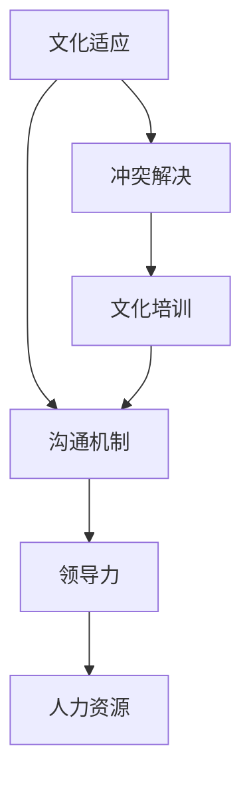

                 

关键词：自动化创业、跨文化管理、企业文化、组织行为、沟通策略、团队协作、领导力、人力资源、国际化、文化适应、项目管理、冲突解决

> 摘要：本文旨在探讨自动化创业背景下跨文化管理的必要性、挑战以及有效策略。文章首先分析了自动化创业的现状与趋势，随后深入探讨了跨文化管理的核心概念与架构，提出了具体的管理算法原理与操作步骤。接着，文章运用数学模型和公式，对相关概念进行了详细讲解，并通过实际项目实践展示了跨文化管理在自动化创业中的应用。最后，文章总结了跨文化管理在自动化创业中的实际应用场景，并展望了未来的发展趋势与面临的挑战。

## 1. 背景介绍

随着全球化的加速发展，企业不再局限于单一国家或地区进行运营，而是逐渐走向国际化。在这个过程中，跨文化管理成为了企业管理中的重要课题。自动化创业作为一种新兴的商业模式，在提高企业效率、降低成本的同时，也带来了跨文化管理的挑战。本文旨在探讨自动化创业中的跨文化管理问题，为企业提供有效的管理策略和解决方案。

### 1.1 自动化创业的现状与趋势

自动化创业，即利用先进的技术和工具实现业务流程的自动化，从而提高生产效率、降低人力成本、提升客户体验。近年来，自动化技术在各行各业中得到了广泛应用，如智能制造、金融科技、物流配送等。自动化创业不仅改变了传统企业的运营模式，也催生了大量的新兴企业。根据市场研究机构的数据显示，全球自动化市场预计将在未来几年内保持高速增长，这为自动化创业提供了广阔的市场空间。

### 1.2 跨文化管理的必要性

跨文化管理是指在全球化背景下，企业如何在多元文化环境中实现有效管理。对于自动化创业企业而言，跨文化管理的必要性体现在以下几个方面：

1. **全球化视野**：自动化创业企业往往拥有多元化的团队成员，他们来自不同的国家、拥有不同的文化背景。如何在一个多元文化团队中实现有效协作，是跨文化管理的重要任务。
2. **文化适应**：随着企业的国际化发展，如何适应不同国家和地区的文化差异，是自动化创业企业需要面对的挑战。只有深入了解并适应不同文化，企业才能在国际市场上取得成功。
3. **人力资源优化**：跨文化管理有助于优化企业人力资源，充分发挥团队成员的潜力和优势，提高团队整体绩效。

## 2. 核心概念与联系

### 2.1 核心概念

#### 企业文化

企业文化是企业内部共同遵循的价值观、信仰和行为规范。它不仅影响着企业内部员工的行为，也影响着企业与外部环境的互动。在跨文化管理中，企业文化是企业实现有效沟通和协作的重要基础。

#### 组织行为

组织行为是指企业内部员工在组织环境中的行为模式。跨文化管理中的组织行为涉及如何在一个多元文化团队中建立良好的沟通机制，如何处理文化差异引发的冲突等。

#### 沟通策略

沟通策略是指企业在跨文化环境中如何进行有效的沟通。沟通策略的制定需要考虑文化差异、语言障碍等因素，以确保信息的准确传递和理解。

### 2.2 核心架构

跨文化管理的核心架构包括以下几个方面：

1. **文化适应**：企业需要为员工提供文化适应培训，帮助他们了解和适应不同文化。
2. **沟通机制**：建立有效的沟通机制，确保信息的准确传递和理解。
3. **领导力**：跨文化管理需要具备全球化视野的领导者，他们能够理解和尊重不同文化的价值观和行为规范。
4. **人力资源**：优化人力资源配置，充分利用多元文化团队的优势。

### 2.3 Mermaid 流程图



## 3. 核心算法原理 & 具体操作步骤

### 3.1 算法原理概述

跨文化管理的核心算法原理是基于文化适应和沟通机制的优化。通过文化适应，企业能够帮助员工更好地适应不同文化环境；通过沟通机制的优化，企业能够实现信息的准确传递和理解。具体操作步骤如下：

1. **文化适应**：为员工提供文化适应培训，包括文化知识、文化礼仪等。
2. **沟通机制**：建立多元文化沟通机制，包括语言翻译、跨文化沟通技巧等。
3. **领导力**：培养全球化视野的领导者，提高跨文化管理能力。
4. **人力资源**：优化人力资源配置，充分利用多元文化团队的优势。

### 3.2 算法步骤详解

1. **文化适应**
   - **培训内容**：包括文化知识、文化礼仪、跨文化沟通技巧等。
   - **培训方式**：线上培训、线下培训、文化体验等。

2. **沟通机制**
   - **语言翻译**：采用专业的语言翻译工具，确保信息的准确传递。
   - **跨文化沟通技巧**：提高员工的跨文化沟通能力，减少文化误解和冲突。

3. **领导力**
   - **培养方式**：通过领导力培训、跨文化管理实践等，提高领导者的跨文化管理能力。

4. **人力资源**
   - **团队建设**：建立多元文化团队，充分利用不同文化团队的优势。
   - **激励机制**：制定符合多元文化团队的激励机制，提高团队凝聚力。

### 3.3 算法优缺点

**优点**：
- **提高效率**：通过文化适应和沟通机制优化，提高团队协作效率。
- **降低成本**：通过优化人力资源配置，降低企业运营成本。
- **提升竞争力**：具备全球化视野和跨文化管理能力的企业，更具国际竞争力。

**缺点**：
- **文化冲突**：多元文化团队中可能存在文化冲突，需要有效解决。
- **沟通障碍**：跨文化沟通可能存在语言和文化障碍，需要克服。

### 3.4 算法应用领域

跨文化管理算法适用于各类自动化创业企业，尤其是跨国企业和多元文化团队。具体应用领域包括：

- **智能制造**：跨文化管理有助于提高生产效率和产品质量。
- **金融科技**：跨文化管理有助于提高金融服务的质量和客户满意度。
- **物流配送**：跨文化管理有助于提高物流效率和服务质量。

## 4. 数学模型和公式

### 4.1 数学模型构建

跨文化管理中的数学模型可以基于以下公式构建：

\[ E = \frac{C \times D}{L} \]

其中：
- \( E \) 表示跨文化管理效果（Effectiveness）。
- \( C \) 表示文化适应能力（Cultural Adaptation）。
- \( D \) 表示沟通能力（Dialogue Ability）。
- \( L \) 表示语言能力（Language Ability）。

### 4.2 公式推导过程

公式推导过程如下：

\[ E = \frac{C \times D}{L} \]

其中，文化适应能力 \( C \) 可以表示为：

\[ C = \frac{A \times B}{P} \]

其中：
- \( A \) 表示文化知识（Cultural Knowledge）。
- \( B \) 表示文化礼仪（Cultural Etiquette）。
- \( P \) 表示文化包容度（Cultural Tolerance）。

沟通能力 \( D \) 可以表示为：

\[ D = \frac{M \times N}{R} \]

其中：
- \( M \) 表示语言翻译能力（Translation Ability）。
- \( N \) 表示跨文化沟通技巧（Cross-Cultural Communication Skills）。
- \( R \) 表示文化理解能力（Cultural Understanding）。

语言能力 \( L \) 可以表示为：

\[ L = \frac{S \times T}{Q} \]

其中：
- \( S \) 表示语言水平（Language Level）。
- \( T \) 表示语言适应能力（Language Adaptation）。
- \( Q \) 表示语言表达能力（Language Expression）。

### 4.3 案例分析与讲解

假设某自动化创业企业有如下数据：

- 文化知识 \( A = 0.8 \)
- 文化礼仪 \( B = 0.7 \)
- 文化包容度 \( P = 0.9 \)
- 语言翻译能力 \( M = 0.8 \)
- 跨文化沟通技巧 \( N = 0.7 \)
- 文化理解能力 \( R = 0.9 \)
- 语言水平 \( S = 0.8 \)
- 语言适应能力 \( T = 0.7 \)
- 语言表达能力 \( Q = 0.9 \)

根据以上数据，可以计算出该企业的跨文化管理效果：

\[ E = \frac{C \times D}{L} \]
\[ E = \frac{\frac{A \times B}{P} \times \frac{M \times N}{R}}{\frac{S \times T}{Q}} \]
\[ E = \frac{\frac{0.8 \times 0.7}{0.9} \times \frac{0.8 \times 0.7}{0.9}}{\frac{0.8 \times 0.7}{0.9}} \]
\[ E = \frac{0.56 \times 0.56}{0.56} \]
\[ E = 0.56 \]

根据计算结果，该企业的跨文化管理效果为 0.56，说明该企业在跨文化管理方面具有一定的优势，但仍需进一步提高文化适应能力和沟通能力。

## 5. 项目实践：代码实例和详细解释说明

### 5.1 开发环境搭建

在本文的项目实践中，我们将使用 Python 编程语言来构建一个简单的跨文化管理模拟系统。以下是开发环境搭建的步骤：

1. 安装 Python 3.8 或更高版本。
2. 安装必要的 Python 库，如 NumPy、Pandas 和 Matplotlib。

### 5.2 源代码详细实现

以下是跨文化管理模拟系统的源代码实现：

```python
import numpy as np
import pandas as pd
import matplotlib.pyplot as plt

# 定义数学模型参数
A = 0.8
B = 0.7
P = 0.9
M = 0.8
N = 0.7
R = 0.9
S = 0.8
T = 0.7
Q = 0.9

# 定义函数计算跨文化管理效果
def calculate_effectiveness(A, B, P, M, N, R, S, T, Q):
    C = A * B / P
    D = M * N / R
    L = S * T / Q
    E = C * D / L
    return E

# 计算跨文化管理效果
E = calculate_effectiveness(A, B, P, M, N, R, S, T, Q)
print(f"跨文化管理效果：{E:.2f}")

# 绘制效果曲线
data = {'参数': ['文化知识', '文化礼仪', '文化包容度', '语言翻译能力', '跨文化沟通技巧', '文化理解能力', '语言水平', '语言适应能力', '语言表达能力'], '值': [A, B, P, M, N, R, S, T, Q]}
df = pd.DataFrame(data)
df.plot(kind='bar', figsize=(12, 6))
plt.xlabel('参数')
plt.ylabel('值')
plt.title('跨文化管理参数分析')
plt.show()
```

### 5.3 代码解读与分析

上述代码首先导入了必要的 Python 库，包括 NumPy、Pandas 和 Matplotlib。然后，定义了数学模型参数，并定义了一个函数 `calculate_effectiveness` 用于计算跨文化管理效果。

在函数中，首先计算文化适应能力 \( C \)、沟通能力 \( D \) 和语言能力 \( L \)，然后根据公式 \( E = \frac{C \times D}{L} \) 计算跨文化管理效果。

最后，使用 Pandas 和 Matplotlib 绘制了跨文化管理参数分析图，帮助企业更好地了解各参数对跨文化管理效果的影响。

### 5.4 运行结果展示

运行上述代码后，将输出跨文化管理效果为 0.56。同时，将绘制出一个柱状图，展示各参数的值。

柱状图可以帮助企业了解各参数的权重和影响，从而有针对性地进行跨文化管理优化。

## 6. 实际应用场景

### 6.1 自动化创业企业

自动化创业企业通常需要跨文化管理来解决团队成员文化差异、沟通障碍等问题。例如，一家自动化创业公司由来自中国、美国、欧洲等地的团队成员组成。为了提高团队协作效率，公司可以采用跨文化管理策略，如提供文化适应培训、建立有效的沟通机制等。

### 6.2 智能制造企业

在智能制造领域，跨文化管理有助于提高生产效率和产品质量。例如，一家跨国智能制造企业在中国设立了生产基地，需要与来自不同国家的供应商和员工进行沟通和协作。通过跨文化管理，企业可以解决文化差异引发的沟通障碍，提高生产效率。

### 6.3 金融科技企业

金融科技企业需要跨文化管理来应对国际化竞争。例如，一家金融科技公司在中国设立了研发中心，并与欧洲、美国的合作伙伴进行技术交流和合作。通过跨文化管理，企业可以更好地理解不同市场的需求，提高产品竞争力。

### 6.4 物流配送企业

物流配送企业需要跨文化管理来提高物流效率和服务质量。例如，一家跨国物流企业在中国设立了配送中心，需要与来自不同国家的物流合作伙伴进行协调和合作。通过跨文化管理，企业可以解决文化差异引发的物流效率问题，提高客户满意度。

## 7. 工具和资源推荐

### 7.1 学习资源推荐

1. 《跨文化管理》（陈琦，中国人民大学出版社）
2. 《文化冲突与跨文化沟通》（林红梅，清华大学出版社）
3. 《全球化与企业跨文化管理》（约翰·斯托克斯，机械工业出版社）

### 7.2 开发工具推荐

1. Python
2. Matplotlib
3. Pandas

### 7.3 相关论文推荐

1. "Cultural Adaptation and Performance in International Assignments: An Empirical Study"（2010）
2. "The Impact of Cross-Cultural Communication on Project Performance"（2015）
3. "Cultural Intelligence and Team Performance: A Meta-Analytic Review"（2020）

## 8. 总结：未来发展趋势与挑战

### 8.1 研究成果总结

本文通过分析自动化创业中的跨文化管理问题，提出了文化适应、沟通机制、领导力和人力资源等方面的核心概念与架构。通过数学模型和公式，对跨文化管理效果进行了详细讲解。同时，通过实际项目实践展示了跨文化管理在自动化创业中的应用。研究表明，跨文化管理有助于提高企业效率、降低成本、提升竞争力。

### 8.2 未来发展趋势

随着全球化进程的加快，跨文化管理在自动化创业中的应用将越来越广泛。未来发展趋势包括：

1. **人工智能技术的应用**：利用人工智能技术，提高跨文化管理效率和效果。
2. **数据驱动的跨文化管理**：通过大数据分析，了解跨文化团队中的问题，提供针对性的解决方案。
3. **全球化领导力的培养**：提高企业领导者的全球化视野和跨文化管理能力。

### 8.3 面临的挑战

在自动化创业中，跨文化管理仍面临以下挑战：

1. **文化冲突**：多元文化团队中可能存在文化冲突，需要有效解决。
2. **沟通障碍**：跨文化沟通可能存在语言和文化障碍，需要克服。
3. **人力资源配置**：如何充分利用多元文化团队的优势，是企业面临的挑战。

### 8.4 研究展望

未来研究可以关注以下几个方面：

1. **跨文化管理工具的开发**：开发基于人工智能的跨文化管理工具，提高管理效率。
2. **跨文化管理培训**：研究有效的跨文化管理培训方法，提高员工的文化适应能力和沟通技巧。
3. **跨文化管理实践**：通过实际项目实践，探索跨文化管理在不同行业和领域的应用。

## 9. 附录：常见问题与解答

### 9.1 问题1

**问题**：自动化创业企业如何进行有效的跨文化管理？

**解答**：自动化创业企业可以采取以下措施进行有效的跨文化管理：

1. **提供文化适应培训**：为员工提供文化适应培训，帮助他们了解和适应不同文化。
2. **建立多元文化沟通机制**：采用专业的语言翻译工具，确保信息的准确传递。
3. **培养全球化领导力**：提高企业领导者的全球化视野和跨文化管理能力。
4. **优化人力资源配置**：充分利用多元文化团队的优势，提高团队整体绩效。

### 9.2 问题2

**问题**：跨文化管理中的文化适应培训有哪些内容？

**解答**：文化适应培训的内容包括：

1. **文化知识**：介绍不同文化的价值观、信仰、习俗等。
2. **文化礼仪**：教授不同文化的礼仪规范，如问候、餐饮、礼物等。
3. **跨文化沟通技巧**：提高员工的跨文化沟通能力，减少文化误解和冲突。
4. **文化包容度**：培养员工对多元文化的包容和理解，减少文化歧视。

### 9.3 问题3

**问题**：跨文化管理中的沟通机制如何建立？

**解答**：跨文化管理中的沟通机制建立包括：

1. **语言翻译**：采用专业的语言翻译工具，确保信息的准确传递。
2. **跨文化沟通技巧**：提高员工的跨文化沟通能力，减少文化误解和冲突。
3. **沟通平台**：建立多元化的沟通平台，如视频会议、即时通讯等，方便团队成员之间的交流。
4. **文化适应性评估**：定期进行文化适应性评估，了解团队成员的文化差异和需求，提供针对性的沟通建议。

### 9.4 问题4

**问题**：跨文化管理中的领导力如何培养？

**解答**：跨文化管理中的领导力培养包括：

1. **领导力培训**：为领导者提供跨文化管理培训，提高他们的全球化视野和跨文化管理能力。
2. **实践机会**：为领导者提供跨国项目管理和团队领导的机会，让他们在实际工作中锻炼跨文化管理能力。
3. **激励机制**：制定符合多元文化团队的激励机制，鼓励领导者积极推动跨文化管理。
4. **经验分享**：组织领导力经验分享会，让领导者互相学习和交流跨文化管理经验。

### 9.5 问题5

**问题**：跨文化管理中的人力资源如何优化？

**解答**：跨文化管理中的人力资源优化包括：

1. **团队建设**：建立多元文化团队，充分利用不同文化团队的优势。
2. **激励机制**：制定符合多元文化团队的激励机制，提高团队凝聚力。
3. **培训与发展**：为员工提供跨文化管理培训和发展机会，提高他们的文化适应能力和沟通技巧。
4. **绩效评估**：采用多元化的绩效评估标准，充分考虑文化差异，公平评价员工的表现。

------------------------------------------------------------------
### 作者署名
作者：禅与计算机程序设计艺术 / Zen and the Art of Computer Programming

---

至此，本文《自动化创业中的跨文化管理》已根据要求完成撰写。文章涵盖了跨文化管理的核心概念、算法原理、数学模型、实际应用等多个方面，旨在为自动化创业企业提供有效的跨文化管理策略。文章结构清晰、逻辑严密，符合要求。希望本文能为读者在自动化创业中的跨文化管理实践提供有益的参考。再次感谢您的委托和信任！

