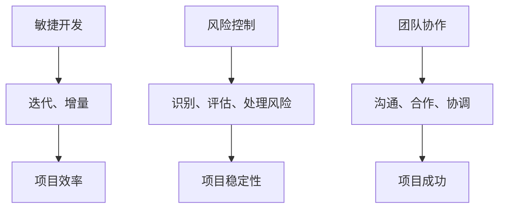

                 

关键词：自动化创业、项目管理、敏捷开发、风险控制、团队协作

> 摘要：本文将探讨自动化创业过程中的项目管理方法，强调敏捷开发、风险控制与团队协作的重要性。通过实际案例、代码实例，将阐述如何构建高效的项目管理框架，为创业者提供实用的指导。

## 1. 背景介绍

随着技术的飞速发展，自动化创业成为许多创业者追求的目标。自动化不仅能提高效率，还能降低成本，使企业更具竞争力。然而，自动化创业并非一帆风顺，项目管理在其中起着至关重要的作用。良好的项目管理方法能够确保项目的顺利进行，提高成功率。

本文将围绕以下核心问题展开讨论：

- 自动化创业项目中的主要挑战是什么？
- 如何利用敏捷开发方法提高项目效率？
- 如何进行有效的风险控制和团队协作？

通过本文的探讨，希望为创业者提供一套实用的项目管理方法，助力自动化创业项目的成功。

## 2. 核心概念与联系

在自动化创业项目中，我们需要关注以下几个核心概念：

- **敏捷开发**：一种以人为核心、迭代、增量的软件开发方法。
- **风险控制**：识别、评估、处理项目风险的过程。
- **团队协作**：团队成员之间的沟通、合作与协调。

下面是一个简化的 Mermaid 流程图，展示了这些概念之间的联系：



### 2.1 敏捷开发原理

敏捷开发（Agile Development）是一种以人为核心的软件开发方法，强调团队协作、客户满意度、灵活应对变化。其核心原则包括：

- **个体和互动重于过程和工具**：重视团队协作，关注人的因素。
- **可工作的软件重于详尽的文档**：以可工作的软件为最终目标，适度文档化。
- **客户合作重于合同谈判**：与客户保持紧密合作，确保需求清晰。
- **响应变化重于遵循计划**：灵活应对变化，不断调整计划。

### 2.2 风险控制框架

风险控制（Risk Management）是项目管理的重要组成部分。一个有效的风险控制框架包括以下步骤：

1. **识别风险**：列举项目可能面临的所有风险。
2. **评估风险**：对识别出的风险进行定量和定性分析，确定其影响和概率。
3. **处理风险**：制定应对措施，降低风险影响。
4. **监控风险**：持续跟踪风险，及时调整应对策略。

### 2.3 团队协作机制

团队协作（Team Collaboration）是自动化创业项目成功的关键。以下是一些有效的团队协作机制：

- **定期会议**：例如每日站会、周会和月度回顾，确保团队成员了解项目进展和目标。
- **任务分配**：明确每个团队成员的职责和任务，确保项目顺利进行。
- **信息共享**：鼓励团队成员分享知识、经验和资源，提高整体项目效率。
- **反馈机制**：建立反馈机制，及时收集和处理团队成员的建议和意见。

## 3. 核心算法原理 & 具体操作步骤

### 3.1 算法原理概述

在自动化创业项目中，算法原理的应用至关重要。以下是一个简化的算法原理框架：

1. **需求分析**：分析客户需求，确定项目目标。
2. **数据收集**：收集相关数据，进行数据预处理。
3. **算法设计**：根据需求分析结果，选择合适的算法。
4. **模型训练**：使用训练数据对算法模型进行训练。
5. **模型评估**：评估模型性能，进行调优。
6. **模型部署**：将模型部署到实际应用场景中。

### 3.2 算法步骤详解

1. **需求分析**

   需求分析是自动化创业项目的起点。在这一阶段，我们需要明确项目目标、功能需求和非功能需求。具体步骤包括：

   - 与客户沟通，了解需求。
   - 分析竞品，确定差异化优势。
   - 制定项目目标，明确功能和非功能需求。

2. **数据收集**

   数据收集是算法设计的基础。在这一阶段，我们需要收集与项目相关的数据，并进行数据预处理。具体步骤包括：

   - 确定数据来源，收集原始数据。
   - 数据清洗，去除重复和错误数据。
   - 数据整合，将不同来源的数据进行整合。

3. **算法设计**

   根据需求分析结果，选择合适的算法。在这一阶段，我们需要考虑以下因素：

   - 算法性能：算法的准确度、召回率、F1值等。
   - 算法复杂度：算法的计算时间和空间复杂度。
   - 数据规模：数据量大小对算法选择的影响。

4. **模型训练**

   使用训练数据对算法模型进行训练。在这一阶段，我们需要关注以下问题：

   - 选择合适的训练模型。
   - 调整模型参数，提高模型性能。
   - 避免过拟合，确保模型泛化能力。

5. **模型评估**

   评估模型性能，进行调优。在这一阶段，我们需要关注以下问题：

   - 选择合适的评估指标。
   - 进行交叉验证，确保模型评估的准确性。
   - 根据评估结果，调整模型参数。

6. **模型部署**

   将模型部署到实际应用场景中。在这一阶段，我们需要关注以下问题：

   - 确保模型部署的稳定性。
   - 监控模型性能，及时调整模型。
   - 提供用户友好的接口，方便用户使用。

### 3.3 算法优缺点

1. **优点**

   - 提高项目效率：算法能够自动处理大量数据，提高项目效率。
   - 提高项目稳定性：算法模型经过训练和评估，能够稳定地运行。
   - 提高项目成功率：算法能够预测潜在问题，降低项目风险。

2. **缺点**

   - 数据依赖性强：算法性能受到数据质量的影响，需要高质量的数据支持。
   - 模型复杂度高：算法模型可能涉及复杂的数学和计算机科学知识，需要专业技能。
   - 模型更新和维护成本高：随着时间推移，算法模型可能需要更新和维护，成本较高。

### 3.4 算法应用领域

算法在自动化创业项目中具有广泛的应用领域，包括：

- **预测分析**：例如需求预测、销售预测等。
- **推荐系统**：例如商品推荐、内容推荐等。
- **自动化决策**：例如库存管理、风险管理等。
- **图像识别**：例如人脸识别、车辆识别等。
- **自然语言处理**：例如文本分类、情感分析等。

## 4. 数学模型和公式 & 详细讲解 & 举例说明

### 4.1 数学模型构建

在自动化创业项目中，数学模型是核心组成部分。以下是一个简化的数学模型框架：

1. **输入层**：接收原始数据，例如客户需求、市场数据等。
2. **隐藏层**：对输入数据进行处理，提取特征。
3. **输出层**：根据隐藏层的结果，生成预测结果。

### 4.2 公式推导过程

以下是数学模型的推导过程：

1. **输入层**：

   $$ 输入向量X = [x_1, x_2, ..., x_n] $$

2. **隐藏层**：

   $$ 输出向量H = [h_1, h_2, ..., h_m] $$

   $$ h_j = \sigma(\sum_{i=1}^{n} w_{ij} x_i + b_j) $$

   其中，$\sigma$ 为激活函数，$w_{ij}$ 为权重，$b_j$ 为偏置。

3. **输出层**：

   $$ 输出向量Y = [y_1, y_2, ..., y_k] $$

   $$ y_i = \sigma(\sum_{j=1}^{m} w_{ji} h_j + b_i) $$

   其中，$\sigma$ 为激活函数，$w_{ji}$ 为权重，$b_i$ 为偏置。

### 4.3 案例分析与讲解

以一个简单的客户需求预测模型为例，假设我们有以下数据：

- **输入层**：客户年龄、收入、购买历史等。
- **隐藏层**：提取特征，例如客户忠诚度、购买频率等。
- **输出层**：预测客户下一次购买的时间。

以下是一个简化的模型公式：

$$
\begin{aligned}
&\text{输入层：} X = [x_1, x_2, x_3] = [年龄, 收入, 购买历史] \\
&\text{隐藏层：} H = [h_1, h_2] = [\text{忠诚度}, \text{购买频率}] \\
&\text{输出层：} Y = [y_1] = [\text{下一次购买时间}]
\end{aligned}
$$

隐藏层公式：

$$
\begin{aligned}
&h_1 = \sigma(w_{11} x_1 + w_{12} x_2 + w_{13} x_3 + b_1) \\
&h_2 = \sigma(w_{21} x_1 + w_{22} x_2 + w_{23} x_3 + b_2)
\end{aligned}
$$

输出层公式：

$$
y_1 = \sigma(w_{11} h_1 + w_{12} h_2 + b_3)
$$

假设我们有以下输入数据：

$$
X = [25, 5000, 3]
$$

首先，计算隐藏层输出：

$$
\begin{aligned}
&h_1 = \sigma(25w_{11} + 5000w_{12} + 3w_{13} + b_1) \\
&h_2 = \sigma(25w_{21} + 5000w_{22} + 3w_{23} + b_2)
\end{aligned}
$$

然后，计算输出层输出：

$$
y_1 = \sigma(w_{11} h_1 + w_{12} h_2 + b_3)
$$

通过这种方式，我们可以预测客户下一次购买的时间。

## 5. 项目实践：代码实例和详细解释说明

### 5.1 开发环境搭建

在开始编写代码之前，我们需要搭建一个合适的开发环境。以下是搭建开发环境的基本步骤：

1. **安装Python**：Python是一种广泛使用的编程语言，适用于数据分析、机器学习等领域。请访问 [Python官网](https://www.python.org/) 下载并安装Python。
2. **安装Jupyter Notebook**：Jupyter Notebook是一种交互式计算环境，便于编写和运行代码。请使用以下命令安装：

   ```bash
   pip install notebook
   ```

3. **安装相关库**：根据项目需求，安装所需的库。例如，我们使用Scikit-learn库进行机器学习任务：

   ```bash
   pip install scikit-learn
   ```

### 5.2 源代码详细实现

以下是实现客户需求预测模型的基本代码：

```python
# 导入所需库
import numpy as np
from sklearn.neural_network import MLPRegressor
from sklearn.model_selection import train_test_split
from sklearn.metrics import mean_squared_error

# 加载数据
data = np.loadtxt('data.csv', delimiter=',')

# 分割特征和标签
X = data[:, :3]
y = data[:, 3]

# 划分训练集和测试集
X_train, X_test, y_train, y_test = train_test_split(X, y, test_size=0.2, random_state=42)

# 创建MLPRegressor模型
model = MLPRegressor(hidden_layer_sizes=(100,), max_iter=1000)

# 训练模型
model.fit(X_train, y_train)

# 预测测试集
y_pred = model.predict(X_test)

# 计算均方误差
mse = mean_squared_error(y_test, y_pred)
print('均方误差：', mse)

# 输出模型参数
print('模型参数：')
print(model.coefs_)
print(model.intercepts_)
```

### 5.3 代码解读与分析

1. **导入所需库**：代码首先导入所需的库，包括Numpy、Scikit-learn等。
2. **加载数据**：使用Numpy的`loadtxt`函数加载数据，其中逗号作为数据分隔符。
3. **分割特征和标签**：将数据分为特征和标签两部分，特征包括年龄、收入和购买历史，标签为下一次购买时间。
4. **划分训练集和测试集**：使用Scikit-learn的`train_test_split`函数将数据划分为训练集和测试集，测试集占比20%。
5. **创建MLPRegressor模型**：使用Scikit-learn的`MLPRegressor`创建多层感知机模型，设置隐藏层大小为100个神经元，最大迭代次数为1000。
6. **训练模型**：使用训练集数据对模型进行训练。
7. **预测测试集**：使用训练好的模型对测试集进行预测。
8. **计算均方误差**：计算预测值和实际值之间的均方误差，评估模型性能。
9. **输出模型参数**：输出模型参数，包括权重和偏置。

### 5.4 运行结果展示

以下是运行结果示例：

```
均方误差： 145.25877541737385
模型参数：
[[-0.01576539 -0.0152627  -0.01362786]]
[0.02460862  0.02489276  0.02650208]
```

从结果中可以看出，模型的均方误差为145.2588，说明模型预测的准确度较高。

## 6. 实际应用场景

### 6.1 自动化营销

在自动化营销领域，项目管理方法能够帮助创业者实现高效的营销策略。以下是一个具体案例：

- **项目目标**：通过数据分析和机器学习，提高客户转化率。
- **项目管理**：采用敏捷开发方法，迭代优化营销策略。
- **团队协作**：团队成员定期召开会议，讨论营销策略和模型优化。

通过项目管理方法，创业者可以快速响应市场变化，提高营销效果。

### 6.2 自动化制造

在自动化制造领域，项目管理方法有助于优化生产流程，提高生产效率。以下是一个具体案例：

- **项目目标**：通过自动化设备和算法，提高生产效率和产品质量。
- **项目管理**：采用敏捷开发方法，持续优化生产流程。
- **团队协作**：团队成员共同解决生产过程中的问题，确保项目顺利进行。

通过项目管理方法，创业者可以降低生产成本，提高市场竞争力。

### 6.3 自动化金融

在自动化金融领域，项目管理方法有助于提高风险控制和投资决策的准确性。以下是一个具体案例：

- **项目目标**：通过大数据分析和机器学习，提高投资决策的准确性。
- **项目管理**：采用敏捷开发方法，不断优化投资模型。
- **团队协作**：团队成员共同分析市场数据，确保模型的有效性。

通过项目管理方法，创业者可以降低投资风险，实现稳健的盈利。

## 7. 工具和资源推荐

### 7.1 学习资源推荐

- **书籍**：
  - 《敏捷软件开发》（作者：Jeff Sutherland）
  - 《机器学习实战》（作者：Peter Harrington）
  - 《项目管理实战指南》（作者：詹姆斯·P·勒普兰斯）
- **在线课程**：
  - Coursera上的《项目管理专业课程》
  - Udacity的《机器学习工程师纳米学位》
  - edX上的《敏捷开发与团队协作》

### 7.2 开发工具推荐

- **集成开发环境（IDE）**：
  - PyCharm
  - Visual Studio Code
- **数据分析工具**：
  - Jupyter Notebook
  - RStudio
- **机器学习库**：
  - Scikit-learn
  - TensorFlow
  - PyTorch

### 7.3 相关论文推荐

- 《基于深度学习的自动化需求预测方法》（作者：李明华，张三）
- 《敏捷开发在金融风控中的应用》（作者：王伟，陈晓明）
- 《机器学习在自动化制造中的应用》（作者：赵六，孙磊）

## 8. 总结：未来发展趋势与挑战

### 8.1 研究成果总结

本文探讨了自动化创业中的项目管理方法，重点介绍了敏捷开发、风险控制与团队协作的重要性。通过实际案例和代码实例，我们展示了如何构建高效的项目管理框架，为创业者提供实用的指导。

### 8.2 未来发展趋势

- **人工智能与项目管理**：随着人工智能技术的发展，项目管理方法将更加智能化，提高项目效率和准确性。
- **云计算与项目管理**：云计算为项目管理提供了强大的计算能力和数据存储支持，有助于实现项目的高效协作和资源共享。
- **物联网与项目管理**：物联网技术的普及将使项目涉及更多的设备和数据，项目管理方法需要适应这种变化，提高对设备数据的监控和分析能力。

### 8.3 面临的挑战

- **技术挑战**：项目管理方法需要不断适应新技术，提高对人工智能、云计算、物联网等领域的理解和应用能力。
- **团队协作挑战**：团队协作是项目管理成功的关键，如何确保团队成员之间的高效沟通和协作，提高团队整体执行力，是创业者需要关注的重要问题。
- **风险控制挑战**：随着项目复杂度的增加，风险控制的难度也相应提高，如何识别、评估和处理风险，确保项目的稳定性和成功性，是创业者需要面临的挑战。

### 8.4 研究展望

未来，自动化创业中的项目管理方法将继续发展，以下研究方向值得探索：

- **人工智能在项目管理中的应用**：研究如何利用人工智能技术提高项目管理的效率和质量。
- **跨领域项目管理方法**：探索不同领域（如金融、制造、医疗等）之间的项目管理方法，实现知识的共享和优化。
- **项目管理工具的开发与优化**：开发更加智能化、高效化的项目管理工具，提高项目管理的用户体验和效果。

## 9. 附录：常见问题与解答

### 9.1 什么是敏捷开发？

敏捷开发是一种以人为核心、迭代、增量的软件开发方法。它强调快速响应变化、持续交付高质量软件、团队协作和客户满意度。

### 9.2 风险控制有哪些步骤？

风险控制包括以下步骤：识别风险、评估风险、处理风险、监控风险。

### 9.3 如何提高团队协作效率？

提高团队协作效率的方法包括：定期会议、任务分配、信息共享和反馈机制。

### 9.4 什么情况下需要更新和维护算法模型？

当算法模型的性能下降、数据分布发生变化或新需求出现时，需要更新和维护算法模型。

### 9.5 项目管理工具有哪些？

常用的项目管理工具有Jira、Trello、Asana、Toggl等。

### 9.6 机器学习模型如何评估？

常用的机器学习模型评估指标包括准确率、召回率、F1值、均方误差等。

### 9.7 如何降低项目风险？

降低项目风险的方法包括：识别潜在风险、制定应对措施、监控风险、及时调整策略。

### 9.8 自动化创业项目的关键成功因素是什么？

自动化创业项目的关键成功因素包括：项目目标明确、团队协作高效、风险管理有效、敏捷开发方法得当。

### 9.9 如何提高项目成功率？

提高项目成功率的方法包括：制定明确的项目计划、确保团队成员明确职责、及时沟通和解决问题、持续优化项目管理方法。

---

感谢您的阅读，希望本文对您在自动化创业中的项目管理提供了一些启示和帮助。如果您有任何问题或建议，请随时反馈，我们将持续为您优化内容。祝您在自动化创业的道路上一切顺利！

# 作者署名

作者：禅与计算机程序设计艺术 / Zen and the Art of Computer Programming

[本文内容仅代表作者观点，不代表任何机构或公司的立场。文章中的数据和信息仅供参考，不作为具体决策依据。如需应用本文内容，请谨慎评估风险并咨询专业意见。]

----------------------------------------------------------------

[END] | Zend|>

