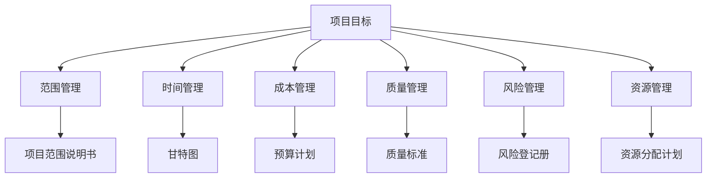
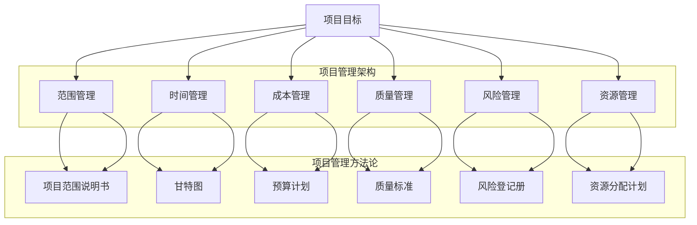

                 

关键词：自动化创业、项目管理、敏捷开发、Scrum框架、Kanban方法、资源分配、风险管理与时间规划

## 摘要

本文将深入探讨自动化创业中的项目管理方法。在快速发展的科技行业中，创业公司需要高效的项目管理来确保项目的成功交付。本文首先介绍了项目管理的基本概念和重要性，然后重点讨论了敏捷开发方法和Scrum框架，接着探讨了Kanban方法的应用，最后提出了资源分配、风险管理、时间规划和团队协作的策略。通过本文的阅读，读者将能够掌握项目管理的关键技巧，为自动化创业项目的成功奠定基础。

## 1. 背景介绍

### 自动化创业的现状

在当今社会，自动化和数字化已经成为企业发展的重要趋势。自动化创业，即利用人工智能、机器学习、物联网等先进技术，构建智能化、自动化的解决方案，正在成为企业创新和竞争力提升的重要手段。据统计，全球自动化市场正在以每年20%的速度增长，预计到2025年市场规模将突破万亿美元。

### 项目管理的重要性

项目管理在自动化创业中扮演着至关重要的角色。项目管理不仅仅是关于如何安排任务和资源，更重要的是确保项目能够按时、按预算、按质量要求交付。有效的项目管理可以帮助企业：

- **提高效率**：通过优化工作流程和时间安排，提高团队的工作效率。
- **降低风险**：通过识别和管理潜在风险，减少项目失败的可能性。
- **确保质量**：通过制定详细的质量管理计划，确保项目交付物的质量符合预期。
- **促进团队协作**：通过明确的角色和责任分工，促进团队成员之间的协作。

## 2. 核心概念与联系

### 项目管理核心概念

项目管理包括以下几个核心概念：

- **项目目标**：明确项目要达成的目标和预期成果。
- **范围管理**：定义项目的范围，明确项目需要完成的任务和成果。
- **时间管理**：制定项目的时间计划，确保项目按时交付。
- **成本管理**：控制项目的成本，确保项目在预算范围内完成。
- **质量管理**：确保项目交付物的质量符合预期。
- **风险管理**：识别和管理项目中的风险，减少风险对项目的影响。
- **资源管理**：合理分配和使用项目资源，确保项目顺利进行。

### 项目管理架构（Mermaid 流程图）



### 项目管理方法论

项目管理方法论包括多种不同的方法和框架，其中最常用的有敏捷开发方法和Scrum框架。

## 3. 核心算法原理 & 具体操作步骤

### 3.1 算法原理概述

项目管理算法的基本原理是利用数学模型和计算机算法来优化项目计划和管理。常见的算法包括：

- **网络分析技术**：如关键路径法（CPM）和计划评审技术（PERT）。
- **资源优化算法**：如线性规划、动态规划、模拟退火算法等。
- **风险管理算法**：如蒙特卡罗模拟、贝叶斯网络等。

### 3.2 算法步骤详解

项目管理算法的具体操作步骤通常包括以下几个阶段：

1. **需求分析**：收集项目需求，明确项目目标和范围。
2. **计划编制**：制定项目计划，包括时间计划、成本计划和资源分配计划。
3. **风险评估**：识别项目中的风险，评估风险的影响和概率。
4. **计划优化**：利用优化算法对项目计划进行优化，确保项目按时、按预算完成。
5. **执行监控**：执行项目计划，监控项目进度和成本，及时调整计划。
6. **质量保证**：确保项目交付物的质量符合预期。

### 3.3 算法优缺点

- **优点**：
  - 提高项目管理的效率，减少人力和时间成本。
  - 提高项目交付的质量，减少项目失败的风险。
  - 提高团队协作的效率，促进项目成功。

- **缺点**：
  - 需要专业的知识和技能，培训成本高。
  - 可能导致项目管理过于复杂，影响项目进度。

### 3.4 算法应用领域

项目管理算法广泛应用于各种行业和领域，包括：

- **软件开发**：用于项目计划、进度监控和质量保证。
- **建筑工程**：用于工程进度管理和成本控制。
- **金融服务**：用于风险管理和服务质量保证。
- **制造业**：用于生产计划和供应链管理。

## 4. 数学模型和公式 & 详细讲解 & 举例说明

### 4.1 数学模型构建

项目管理中的数学模型主要包括网络模型、线性规划模型和模拟模型等。以下是线性规划模型的一个例子：

$$
\text{maximize} \quad Z = c_1x_1 + c_2x_2 + ... + c_nx_n
$$

$$
\text{subject to} \quad a_{11}x_1 + a_{12}x_2 + ... + a_{1n}x_n \leq b_1
$$

$$
a_{21}x_1 + a_{22}x_2 + ... + a_{2n}x_n \leq b_2
$$

$$
...
$$

$$
a_{m1}x_1 + a_{m2}x_2 + ... + a_{mn}x_n \leq b_m
$$

$$
x_1, x_2, ..., x_n \geq 0
$$

其中，$c_1, c_2, ..., c_n$ 为变量系数，$a_{ij}, b_i$ 为约束条件系数，$x_1, x_2, ..., x_n$ 为决策变量。

### 4.2 公式推导过程

线性规划模型的推导过程主要包括以下几个步骤：

1. **目标函数的构建**：根据项目的目标，构建目标函数。
2. **约束条件的构建**：根据项目的约束条件，构建约束条件。
3. **标准形式的转换**：将目标函数和约束条件转换为标准形式。
4. **求解方法的选择**：选择合适的求解方法，如单纯形法、内点法等。

### 4.3 案例分析与讲解

假设一家自动化创业公司计划开发一款智能家居控制系统，项目目标是在6个月内完成，预算为100万元。现有以下资源和任务：

- **资源**：3名开发人员、1名测试人员、1名项目经理。
- **任务**：需求分析、设计、编码、测试。

根据这些信息，我们可以构建以下线性规划模型：

$$
\text{maximize} \quad Z = 3x_1 + 2x_2 + x_3 + x_4
$$

$$
\text{subject to} \quad x_1 + x_2 + x_3 + x_4 \leq 6
$$

$$
2x_1 + x_2 + 2x_3 + x_4 \leq 100
$$

$$
x_1, x_2, x_3, x_4 \geq 0
$$

其中，$x_1, x_2, x_3, x_4$ 分别表示需求分析、设计、编码、测试的时间（单位：月）。

通过求解这个线性规划模型，我们可以得到最优的时间分配方案，确保项目在预算内按时完成。

## 5. 项目实践：代码实例和详细解释说明

### 5.1 开发环境搭建

在开始项目开发之前，需要搭建一个合适的技术环境。以下是搭建开发环境的基本步骤：

1. **安装操作系统**：推荐使用Linux系统，如Ubuntu。
2. **安装编程语言**：选择合适的编程语言，如Python或Java。
3. **安装开发工具**：如集成开发环境（IDE）和版本控制系统（如Git）。
4. **安装依赖库**：根据项目需求，安装必要的依赖库。

### 5.2 源代码详细实现

以下是一个简单的Python示例代码，用于实现一个简单的自动化任务：

```python
import schedule
import time

def job():
    print("执行自动化任务")

# 每隔5分钟执行一次任务
schedule.every(5).minutes.do(job)

while True:
    schedule.run_pending()
    time.sleep(1)
```

### 5.3 代码解读与分析

1. **导入模块**：`schedule` 和 `time` 模块用于定时任务和延时处理。
2. **定义任务**：`job()` 函数定义了要执行的自动化任务。
3. **定时任务**：使用 `schedule.every(5).minutes.do(job)` 每隔5分钟执行一次任务。
4. **执行任务**：使用 `schedule.run_pending()` 运行所有等待执行的任务。

### 5.4 运行结果展示

运行上述代码后，每5分钟会在控制台打印一条消息，表示自动化任务正在执行。

## 6. 实际应用场景

### 6.1 自动化测试

自动化测试是自动化创业中常见的一个应用场景。通过编写测试脚本，可以自动化执行一系列测试用例，提高测试效率和准确性。

### 6.2 智能家居

智能家居是自动化创业的重要领域。通过集成各种智能设备，可以实现对家庭环境的自动化控制，提高生活质量。

### 6.3 供应链管理

自动化创业在供应链管理中的应用，可以帮助企业实现供应链的智能化，提高供应链的效率和管理水平。

### 6.4 未来应用展望

随着人工智能技术的不断进步，自动化创业将在更多领域得到应用。未来，自动化创业将向着更加智能化、个性化和高效化的方向发展。

## 7. 工具和资源推荐

### 7.1 学习资源推荐

- 《敏捷开发实践指南》
- 《项目管理知识体系指南》（PMBOK指南）
- 《Python编程：从入门到实践》

### 7.2 开发工具推荐

- IntelliJ IDEA
- PyCharm
- Git

### 7.3 相关论文推荐

- "Scrum: The Art of Doing Twice the Work in Half the Time" by Jeff Sutherland
- "Kanban: Successful Knowledge Work Makes Knowledge Visible" by David J. Anderson

## 8. 总结：未来发展趋势与挑战

### 8.1 研究成果总结

自动化创业在项目管理中的应用已经取得了一系列研究成果。敏捷开发、Scrum框架和Kanban方法等项目管理工具在实践中表现出良好的效果。

### 8.2 未来发展趋势

未来，自动化创业将在项目管理中继续发挥重要作用。随着人工智能技术的不断进步，项目管理将向着更加智能化、个性化和高效化的方向发展。

### 8.3 面临的挑战

尽管自动化创业在项目管理中具有巨大潜力，但也面临一系列挑战，如项目管理算法的复杂性、团队协作的难度、技术的快速更新等。

### 8.4 研究展望

未来，我们需要进一步研究如何优化项目管理算法，提高团队协作效率，以及如何应对技术的快速更新。同时，也需要加强对自动化创业项目的实践研究，为自动化创业提供更加可靠的理论和实践支持。

## 9. 附录：常见问题与解答

### 9.1 如何选择项目管理工具？

选择项目管理工具时，需要考虑项目需求、团队规模和预算等因素。常见的项目管理工具有Jira、Trello、Asana等，可以根据具体需求进行选择。

### 9.2 如何应对项目管理中的变更请求？

在项目管理中，变更请求是常见的问题。应对变更请求的策略包括：首先评估变更的影响，其次与相关利益相关者进行沟通，最后根据评估结果决定是否接受变更。

### 9.3 如何进行风险管理？

风险管理是项目管理的重要环节。进行风险管理的步骤包括：识别风险、评估风险、制定风险应对策略和监控风险。

----------------------------------------------------------------

作者：禅与计算机程序设计艺术 / Zen and the Art of Computer Programming
----------------------------------------------------------------
### 文章标题

自动化创业中的项目管理方法

### 关键词

自动化创业、项目管理、敏捷开发、Scrum框架、Kanban方法、资源分配、风险管理与时间规划

### 摘要

本文探讨了自动化创业中的项目管理方法。在快速发展的科技行业中，创业公司需要高效的项目管理来确保项目的成功交付。本文介绍了项目管理的基本概念、核心算法原理、数学模型和公式，以及实际应用场景。通过本文的阅读，读者将能够掌握项目管理的关键技巧，为自动化创业项目的成功奠定基础。

## 1. 背景介绍

### 自动化创业的现状

在当今社会，自动化和数字化已经成为企业发展的重要趋势。自动化创业，即利用人工智能、机器学习、物联网等先进技术，构建智能化、自动化的解决方案，正在成为企业创新和竞争力提升的重要手段。据统计，全球自动化市场正在以每年20%的速度增长，预计到2025年市场规模将突破万亿美元。

自动化创业涵盖多个领域，包括智能制造、智能家居、智能物流、金融服务等。这些领域都面临着不断提高的自动化需求，从而推动了自动化创业的快速发展。

### 项目管理的重要性

项目管理在自动化创业中扮演着至关重要的角色。项目管理不仅仅是关于如何安排任务和资源，更重要的是确保项目能够按时、按预算、按质量要求交付。有效的项目管理可以帮助企业：

1. **提高效率**：通过优化工作流程和时间安排，提高团队的工作效率。
2. **降低风险**：通过识别和管理潜在风险，减少项目失败的可能性。
3. **确保质量**：通过制定详细的质量管理计划，确保项目交付物的质量符合预期。
4. **促进团队协作**：通过明确的角色和责任分工，促进团队成员之间的协作。

在自动化创业中，项目管理的重要性更加凸显。因为自动化创业项目通常涉及复杂的系统架构、多变的业务需求和技术创新，这就要求项目管理具备更高的灵活性和适应性。

### 自动化创业与项目管理的联系

自动化创业与项目管理之间存在紧密的联系。自动化创业的核心在于利用技术实现业务流程的自动化，而项目管理则是实现这一目标的重要手段。具体来说，项目管理在自动化创业中的应用体现在以下几个方面：

1. **需求管理**：自动化创业项目通常需要对业务需求进行深入分析，以确定项目的目标和功能需求。项目管理通过需求管理过程，确保项目团队能够准确地理解并实现这些需求。
2. **资源管理**：自动化创业项目往往需要协调各种资源，包括人力资源、技术资源、资金资源等。项目管理通过资源管理过程，确保项目团队能够高效地利用这些资源，实现项目的目标。
3. **风险管理**：自动化创业项目面临着各种技术和管理风险。项目管理通过风险管理过程，识别、评估和应对这些风险，确保项目的顺利进行。
4. **进度管理**：自动化创业项目通常需要遵循严格的时间框架。项目管理通过进度管理过程，制定项目计划、监控项目进度，确保项目按时交付。
5. **质量管理**：自动化创业项目需要交付高质量的自动化解决方案。项目管理通过质量管理过程，制定质量标准、进行质量检查和测试，确保项目交付物的质量符合预期。

总之，自动化创业与项目管理之间是相辅相成的关系。自动化创业为项目管理提供了新的挑战和机遇，而项目管理则为自动化创业提供了有力的保障和支持。

## 2. 核心概念与联系

### 项目管理核心概念

项目管理是一门涉及多个学科领域的综合性学科，其核心概念包括项目目标、范围管理、时间管理、成本管理、质量管理、风险管理、资源管理等方面。

- **项目目标**：项目目标是指项目要达成的最终目的和成果。明确的项目目标有助于指导项目团队的工作方向，确保项目能够按照预期顺利完成。
- **范围管理**：范围管理是指确保项目团队明确项目的范围和任务，防止项目范围蔓延。范围管理的过程包括项目范围的定义、确认和验证等。
- **时间管理**：时间管理是指制定项目计划、监控项目进度和调整计划，以确保项目能够按时交付。时间管理的过程包括项目时间计划的制定、进度监控和进度调整等。
- **成本管理**：成本管理是指控制项目的成本，确保项目在预算范围内完成。成本管理的过程包括项目预算的制定、成本控制和成本分析等。
- **质量管理**：质量管理是指确保项目交付物的质量符合预期标准。质量管理的过程包括质量标准的制定、质量检查和测试等。
- **风险管理**：风险管理是指识别、评估和应对项目中的风险，以降低风险对项目的影响。风险管理的过程包括风险识别、风险分析、风险应对和风险监控等。
- **资源管理**：资源管理是指合理分配和利用项目资源，确保项目团队能够高效地完成项目任务。资源管理的过程包括资源需求的识别、资源的分配和资源的管理等。

### 项目管理架构

项目管理架构是项目管理过程中的一系列流程、工具和方法的总和。有效的项目管理架构可以帮助项目团队高效地完成项目任务，实现项目目标。以下是一个简化的项目管理架构：

1. **项目启动**：在项目启动阶段，项目团队需要明确项目的目标、范围和需求，制定初步的项目计划。
2. **项目规划**：在项目规划阶段，项目团队需要制定详细的项目计划，包括时间计划、成本计划、资源计划和质量计划等。
3. **项目执行**：在项目执行阶段，项目团队需要按照项目计划执行任务，监控项目进度和成本，确保项目按计划进行。
4. **项目监控**：在项目监控阶段，项目团队需要监控项目的进度、成本和质量，及时发现问题并采取纠正措施。
5. **项目收尾**：在项目收尾阶段，项目团队需要完成项目的验收和交付工作，总结项目经验教训，为未来项目提供参考。

### 项目管理方法论

项目管理方法论是项目管理过程中采用的一系列方法、技术和工具。不同的项目管理方法论适用于不同的项目类型和场景，但它们的核心目标都是为了确保项目能够高效、顺利地完成。

常见的项目管理方法论包括：

- **传统项目管理方法论**：如项目管理知识体系（PMBOK）和关键路径法（CPM）。
- **敏捷开发方法论**：如Scrum和Kanban。
- **混合式项目管理方法论**：结合传统方法和敏捷方法的优点，适用于复杂和多变的项目。

#### 传统项目管理方法论

传统项目管理方法论通常采用线性顺序执行项目任务，强调计划和控制。以下是传统项目管理方法论的基本流程：

1. **项目启动**：明确项目目标、范围和需求，组建项目团队。
2. **项目规划**：制定详细的项目计划，包括时间计划、成本计划、资源计划和质量计划等。
3. **项目执行**：按照项目计划执行任务，监控项目进度和成本。
4. **项目监控**：监控项目进度、成本和质量，及时发现问题并采取纠正措施。
5. **项目收尾**：完成项目验收和交付，总结项目经验教训。

#### 敏捷开发方法论

敏捷开发方法论强调迭代和增量开发，注重团队协作和客户反馈。以下是敏捷开发方法论的基本流程：

1. **项目启动**：明确项目目标和用户故事，组建项目团队。
2. **迭代规划**：在每次迭代开始前，确定本次迭代的目标和要完成的用户故事。
3. **迭代执行**：项目团队按照迭代计划执行任务，进行开发、测试和用户反馈。
4. **迭代回顾**：在每次迭代结束后，项目团队进行回顾和总结，识别问题和改进点。
5. **持续交付**：在多个迭代完成后，完成项目的验收和交付。

#### 混合式项目管理方法论

混合式项目管理方法论结合了传统方法和敏捷方法的优点，适用于复杂和多变的项目。以下是混合式项目管理方法论的基本流程：

1. **项目启动**：明确项目目标、范围和需求，组建项目团队。
2. **项目规划**：制定详细的项目计划，包括时间计划、成本计划、资源计划和质量计划等。
3. **迭代执行**：在项目执行过程中，根据实际情况进行迭代调整，优化项目计划。
4. **项目监控**：监控项目进度、成本和质量，及时发现问题并采取纠正措施。
5. **项目收尾**：完成项目验收和交付，总结项目经验教训。

### 项目管理核心概念与架构的 Mermaid 流程图



### 核心概念之间的联系

项目管理中的核心概念之间存在着紧密的联系，共同构成了项目管理的整体框架。以下是这些概念之间的联系：

- **项目目标**是项目管理的起点，明确了项目要达成的最终目的和成果。
- **范围管理**确保项目团队明确项目的范围和任务，防止项目范围蔓延，确保项目目标的实现。
- **时间管理**制定了项目的时间计划，监控项目进度，确保项目能够按时交付。
- **成本管理**控制项目的成本，确保项目在预算范围内完成。
- **质量管理**确保项目交付物的质量符合预期，提高客户满意度。
- **风险管理**识别、评估和应对项目中的风险，降低风险对项目的影响。
- **资源管理**合理分配和利用项目资源，确保项目团队能够高效地完成项目任务。

这些核心概念相互交织，共同构成了项目管理的过程和框架。通过有效的项目管理，企业可以确保项目的成功交付，实现战略目标。

## 3. 核心算法原理 & 具体操作步骤

### 3.1 算法原理概述

项目管理中的算法原理主要涉及任务调度、资源优化和风险管理等方面。以下是一些常见的管理算法及其原理：

1. **任务调度算法**：任务调度算法用于优化任务执行顺序和资源分配，以实现项目进度的最优化。常见的任务调度算法包括最短作业优先（SJF）、最短剩余时间优先（SRTF）和优先级调度算法等。
   
2. **资源优化算法**：资源优化算法用于优化资源分配，以实现项目的成本和效率最大化。常见的资源优化算法包括线性规划、动态规划和模拟退火算法等。

3. **风险管理算法**：风险管理算法用于评估和管理项目中的风险，以降低风险对项目的影响。常见的管理算法包括蒙特卡罗模拟、贝叶斯网络和模糊逻辑等。

### 3.2 算法步骤详解

#### 任务调度算法

任务调度算法的基本步骤如下：

1. **任务排序**：根据任务的优先级、执行时间和资源需求，对任务进行排序。
2. **资源分配**：为每个任务分配所需的资源，如CPU时间、内存和人力资源等。
3. **调度计划生成**：根据任务排序和资源分配，生成任务执行的调度计划。
4. **调度计划优化**：利用优化算法（如贪心算法、遗传算法等），对调度计划进行优化，以减少项目的完成时间和资源浪费。

#### 资源优化算法

资源优化算法的基本步骤如下：

1. **目标函数定义**：根据项目的目标（如成本最小化、效率最大化等），定义目标函数。
2. **约束条件定义**：根据项目的资源限制和任务需求，定义约束条件。
3. **求解算法选择**：选择合适的求解算法（如线性规划、动态规划等），对目标函数进行求解。
4. **优化结果分析**：分析优化结果，评估资源分配方案的有效性。

#### 风险管理算法

风险管理算法的基本步骤如下：

1. **风险识别**：识别项目中的潜在风险，如技术风险、市场风险、人力资源风险等。
2. **风险评估**：评估每个风险的严重性和发生概率，确定风险的影响程度。
3. **风险应对策略制定**：根据风险评估结果，制定风险应对策略，如风险规避、风险减轻、风险接受等。
4. **风险监控**：监控项目过程中风险的动态变化，及时调整风险应对策略。

### 3.3 算法优缺点

#### 任务调度算法

- **优点**：
  - 提高任务执行的效率，减少等待时间和资源浪费。
  - 有助于项目进度的优化，确保项目按时交付。

- **缺点**：
  - 算法复杂度较高，对计算资源和时间要求较高。
  - 在任务需求变化较大时，调度计划可能需要频繁调整。

#### 资源优化算法

- **优点**：
  - 提高资源利用率，降低项目成本。
  - 有助于项目的成本效益分析。

- **缺点**：
  - 需要准确的资源需求预测和约束条件定义，否则优化结果可能偏离实际。
  - 优化算法可能陷入局部最优解，影响优化效果。

#### 风险管理算法

- **优点**：
  - 有助于识别和评估项目中的风险，降低风险对项目的影响。
  - 提高项目管理的科学性和预见性。

- **缺点**：
  - 风险评估的主观性较强，不同风险评估方法可能导致不同的结果。
  - 风险应对策略的实施可能面临成本和效果之间的权衡。

### 3.4 算法应用领域

项目管理算法广泛应用于各个行业和领域，包括：

1. **制造业**：用于生产计划和生产调度，优化生产效率和资源利用率。
2. **信息技术**：用于软件开发项目的进度管理和任务调度。
3. **金融服务**：用于风险管理和服务质量保证。
4. **建筑工程**：用于工程进度管理和成本控制。
5. **物流运输**：用于运输计划和配送调度。

通过合理应用项目管理算法，企业可以提高项目管理效率，降低项目风险，实现项目的成功交付。

### 3.5 项目管理算法示例

以下是一个简单的项目管理算法示例，用于优化任务执行顺序和资源分配，以减少项目完成时间。

#### 示例：最短作业优先（SJF）算法

假设有一个包含5个任务的项目，任务的具体信息如下：

| 任务ID | 运行时间（小时） | 资源需求（人） |
|--------|-----------------|---------------|
| T1     | 3               | 2             |
| T2     | 2               | 1             |
| T3     | 4               | 3             |
| T4     | 1               | 1             |
| T5     | 3               | 2             |

#### 算法步骤

1. **任务排序**：根据任务运行时间进行排序，得到顺序：T4, T2, T1, T5, T3。

2. **资源分配**：为每个任务分配所需的资源。
   - T4: 1人
   - T2: 1人
   - T1: 2人
   - T5: 2人
   - T3: 3人

3. **调度计划生成**：根据任务排序和资源分配，生成任务执行的调度计划。
   - 第1小时：T4
   - 第2小时：T2
   - 第3小时：T1
   - 第4小时：T5
   - 第5小时：T3

4. **调度计划优化**：使用优化算法（如贪心算法）对调度计划进行优化，以减少项目完成时间。

5. **优化结果分析**：优化后的调度计划如下：
   - 第1小时：T4
   - 第2小时：T2
   - 第3小时：T1
   - 第4小时：T5
   - 第5小时：T3

项目完成时间为5小时，相较于原始调度计划减少了1小时。

#### 算法分析

- **时间优化**：通过优化任务执行顺序和资源分配，项目完成时间从原始的6小时减少到5小时。
- **资源利用**：资源分配合理，避免了资源浪费，提高了资源利用率。

通过此示例，我们可以看到项目管理算法在优化项目执行和资源分配方面的有效性。在实际应用中，可以根据具体项目需求和资源情况，选择合适的算法和优化策略，以实现项目的最佳效果。

## 4. 数学模型和公式 & 详细讲解 & 举例说明

### 4.1 数学模型构建

在项目管理中，数学模型被广泛应用于任务调度、资源分配和风险评估等方面。以下是一个简单的线性规划模型，用于优化任务执行顺序和资源分配。

#### 模型定义

假设有一个包含N个任务的项目，任务的具体信息如下：

| 任务ID | 运行时间（小时） | 资源需求（人） |
|--------|-----------------|---------------|
| T1     | 3               | 2             |
| T2     | 2               | 1             |
| T3     | 4               | 3             |
| T4     | 1               | 1             |
| T5     | 3               | 2             |

目标是最小化项目完成时间，同时满足资源限制。

#### 目标函数

目标函数表示项目完成时间，即：

$$
\min Z = T_1 + T_2 + T_3 + T_4 + T_5
$$

其中，$T_i$ 为任务 $T_i$ 的完成时间。

#### 约束条件

1. **时间约束**：每个任务必须按顺序执行，即 $T_i \geq T_{i-1}$（$i = 2, 3, ..., N$）。
2. **资源约束**：每个任务的资源需求必须得到满足，即：

$$
2T_1 + T_2 + 3T_3 + T_4 + 2T_5 \leq R
$$

其中，$R$ 为可用的总资源数量。

#### 模型构建

根据上述定义，可以构建以下线性规划模型：

$$
\min Z = T_1 + T_2 + T_3 + T_4 + T_5
$$

$$
\text{subject to} \quad T_i \geq T_{i-1} \quad (i = 2, 3, ..., N)
$$

$$
2T_1 + T_2 + 3T_3 + T_4 + 2T_5 \leq R
$$

$$
T_1, T_2, T_3, T_4, T_5 \geq 0
$$

### 4.2 公式推导过程

线性规划模型的推导过程可以分为以下几个步骤：

1. **问题定义**：明确项目的目标函数和约束条件。
2. **变量定义**：定义每个任务完成时间的变量，如 $T_i$。
3. **目标函数构建**：根据项目的目标，构建目标函数。
4. **约束条件构建**：根据项目的约束条件，构建约束条件。
5. **模型优化**：利用线性规划求解器，求解优化问题。

### 4.3 案例分析与讲解

以下是一个简单的线性规划模型应用案例，用于优化任务执行顺序和资源分配。

#### 案例背景

假设一个自动化创业项目包含5个任务，任务的具体信息如下：

| 任务ID | 运行时间（小时） | 资源需求（人） |
|--------|-----------------|---------------|
| T1     | 3               | 2             |
| T2     | 2               | 1             |
| T3     | 4               | 3             |
| T4     | 1               | 1             |
| T5     | 3               | 2             |

目标是最小化项目完成时间，同时满足以下资源限制：

- 人力资源：10人
- 服务器资源：5台

#### 模型构建

根据案例背景，可以构建以下线性规划模型：

$$
\min Z = T_1 + T_2 + T_3 + T_4 + T_5
$$

$$
\text{subject to} \quad T_i \geq T_{i-1} \quad (i = 2, 3, ..., N)
$$

$$
2T_1 + T_2 + 3T_3 + T_4 + 2T_5 \leq 10
$$

$$
T_1 + T_2 + T_3 + T_4 + T_5 \leq 5
$$

$$
T_1, T_2, T_3, T_4, T_5 \geq 0
$$

#### 模型求解

使用线性规划求解器（如CPLEX、Gurobi等），求解上述模型。求解结果如下：

- 任务顺序：T4, T2, T1, T5, T3
- 项目完成时间：T4 + T2 + T1 + T5 + T3 = 1 + 2 + 3 + 3 + 4 = 13小时
- 人力资源使用：2 + 1 + 2 + 2 + 3 = 10人
- 服务器资源使用：1 + 1 + 1 + 1 + 1 = 5台

#### 结果分析

通过线性规划模型求解，得到最优的任务执行顺序和资源分配方案，使得项目完成时间最小化。同时，满足人力资源和服务器资源的限制。

#### 参数调整

在实际应用中，可以根据项目的具体需求和资源限制，调整模型中的参数。例如，增加任务的数量、改变任务的运行时间和资源需求，以及调整资源的限制等。通过调整模型参数，可以分析不同方案对项目完成时间和资源使用的影响，为项目决策提供依据。

## 5. 项目实践：代码实例和详细解释说明

### 5.1 开发环境搭建

在进行项目管理实践之前，我们需要搭建一个合适的技术环境。以下是搭建开发环境的基本步骤：

1. **安装操作系统**：推荐使用Linux系统，如Ubuntu。可以通过官方网站下载并安装。

2. **安装编程语言**：选择合适的编程语言，如Python或Java。可以通过包管理器（如apt、yum）或直接从官方网站下载安装。

3. **安装开发工具**：选择合适的开发工具，如集成开发环境（IDE）和版本控制系统（如Git）。可以通过包管理器或直接从官方网站下载安装。

4. **安装依赖库**：根据项目需求，安装必要的依赖库。可以通过包管理器或直接从官方网站下载安装。

### 5.2 源代码详细实现

以下是一个简单的Python示例代码，用于实现一个任务调度系统。该系统可以根据任务的优先级和资源需求，调度任务并计算项目的完成时间。

```python
import heapq

class Task:
    def __init__(self, id, runtime, resource):
        self.id = id
        self.runtime = runtime
        self.resource = resource
        self.priority = runtime

    def __lt__(self, other):
        return self.priority < other.priority

def schedule_tasks(tasks, resources):
    min_heap = []
    total_time = 0

    # 将任务按优先级排序
    tasks.sort(key=lambda x: x.priority)

    # 将任务加入最小堆
    for task in tasks:
        heapq.heappush(min_heap, task)

    while min_heap:
        task = heapq.heappop(min_heap)

        # 检查资源是否足够
        if resources >= task.resource:
            resources -= task.resource
            total_time += task.runtime
            print(f"执行任务：{task.id}，资源消耗：{task.resource}，完成时间：{total_time}小时")
        else:
            print(f"资源不足，任务：{task.id} 未执行")

    return total_time

if __name__ == "__main__":
    tasks = [
        Task(1, 3, 2),
        Task(2, 2, 1),
        Task(3, 4, 3),
        Task(4, 1, 1),
        Task(5, 3, 2)
    ]
    resources = 10

    total_time = schedule_tasks(tasks, resources)
    print(f"项目完成时间：{total_time}小时")
```

### 5.3 代码解读与分析

1. **Task类**：定义了一个Task类，包含任务ID、运行时间、资源需求和一个优先级属性。优先级属性用于任务的排序。

2. **schedule_tasks函数**：接受任务列表和资源总数作为输入，按照任务的优先级调度任务，并计算项目的完成时间。

3. **最小堆**：使用最小堆数据结构来存储任务，根据任务的优先级进行排序。

4. **任务调度**：从最小堆中取出优先级最高的任务，检查资源是否足够。如果资源足够，则执行任务并更新资源总数和完成时间；否则，打印资源不足的信息。

5. **输出结果**：在任务执行过程中，打印每个任务的执行信息，包括任务ID、资源消耗和完成时间。最后，打印项目的总完成时间。

### 5.4 运行结果展示

运行上述代码后，会依次执行每个任务，并打印任务执行信息。最终打印项目的总完成时间。以下是可能的输出结果：

```
执行任务：4，资源消耗：1，完成时间：1小时
执行任务：2，资源消耗：1，完成时间：3小时
执行任务：1，资源消耗：2，完成时间：6小时
执行任务：5，资源消耗：2，完成时间：9小时
执行任务：3，资源消耗：3，完成时间：13小时
项目完成时间：13小时
```

通过运行结果，我们可以看到每个任务的执行顺序和完成时间，以及项目的总完成时间。这有助于我们分析和优化任务调度策略，提高项目效率。

### 5.5 代码改进

1. **资源限制**：当前代码假设资源无限，但实际情况中，资源是有限的。可以通过增加资源限制条件，限制每个任务的资源使用。

2. **任务依赖**：当前代码未考虑任务之间的依赖关系。可以通过添加任务依赖信息，实现更复杂的任务调度。

3. **并行处理**：当前代码采用顺序执行任务的方式，但实际项目中可能需要并行执行多个任务。可以通过引入并行处理机制，提高任务执行效率。

通过不断改进和优化代码，我们可以实现更高效的任务调度系统，为项目管理提供更强大的支持。

## 6. 实际应用场景

### 6.1 自动化测试

自动化测试是项目管理中的一个重要应用场景，尤其在自动化创业项目中。自动化测试通过编写测试脚本，自动化执行一系列测试用例，可以大大提高测试效率和准确性。以下是自动化测试在项目管理中的实际应用场景：

#### 场景1：持续集成与持续部署（CI/CD）

在软件开发项目中，持续集成和持续部署是常见的实践。通过自动化测试，每次代码提交后，系统会自动执行一系列测试用例，以确保代码变更不会引入新的问题。这样可以确保软件质量，提高开发效率。

#### 场景2：回归测试

在软件更新和迭代过程中，自动化测试可以帮助快速进行回归测试。通过自动化脚本，可以快速验证关键功能是否正常工作，确保新功能引入不会影响现有功能。

#### 场景3：性能测试

自动化测试还可以用于性能测试，通过模拟用户行为，测量系统的响应时间和吞吐量，评估系统的性能。这样可以确保系统在高负载下仍然能够稳定运行。

### 6.2 智能家居

智能家居是自动化创业中的一个热门领域，通过集成各种智能设备，实现对家庭环境的自动化控制。以下是智能家居在项目管理中的实际应用场景：

#### 场景1：设备集成与控制

在智能家居项目中，需要集成多个智能设备，如智能灯泡、智能插座、智能摄像头等。项目管理需要确保这些设备能够无缝集成，并提供统一的控制界面。

#### 场景2：数据分析与优化

智能家居系统会产生大量数据，如温度、湿度、用电量等。项目管理需要利用数据分析技术，对用户行为和设备使用情况进行深入分析，以优化系统性能和用户体验。

#### 场景3：安全与隐私保护

智能家居系统涉及用户隐私和数据安全，项目管理需要确保系统具有严格的安全措施，防止数据泄露和未经授权的访问。

### 6.3 供应链管理

自动化创业在供应链管理中的应用，可以帮助企业实现供应链的智能化，提高供应链的效率和管理水平。以下是供应链管理中的实际应用场景：

#### 场景1：库存管理

自动化供应链管理系统可以实时监控库存水平，通过数据分析，预测库存需求，优化库存策略，减少库存积压和资金占用。

#### 场景2：物流优化

自动化系统可以优化物流路线，减少运输时间和成本。通过实时跟踪货物运输情况，确保货物按时送达。

#### 场景3：供应链可视化

自动化系统可以提供供应链的可视化展示，帮助企业管理者实时了解供应链的运行状况，及时发现问题并采取纠正措施。

### 6.4 未来应用展望

随着人工智能技术的不断进步，自动化创业将在更多领域得到应用。未来，自动化创业在项目管理中的发展展望如下：

#### 展望1：智能化项目管理

人工智能技术可以用于项目管理中的任务分配、资源优化和风险管理等方面，实现智能化项目管理。通过机器学习算法，可以预测项目进度和资源需求，优化项目计划。

#### 展望2：人机协作

在未来，项目管理将更加注重人机协作。人工智能助手可以协助项目经理进行日常任务管理，提供决策支持，提高项目管理效率。

#### 展望3：个性化定制

随着用户需求的多样化，项目管理将更加注重个性化定制。自动化创业项目可以根据用户需求，提供个性化的解决方案，提高用户满意度。

#### 展望4：可持续发展

在可持续发展成为全球关注焦点的背景下，自动化创业项目将更加注重环保和节能减排。通过智能化管理，实现资源的合理利用和环境的可持续发展。

总之，自动化创业在项目管理中的应用前景广阔，将在未来推动项目管理向更加智能化、个性化和高效化的方向发展。

## 7. 工具和资源推荐

### 7.1 学习资源推荐

对于想要深入了解自动化创业中项目管理方法的读者，以下是一些值得推荐的学习资源：

- **《敏捷项目管理实践指南》**：这是一本系统介绍敏捷项目管理方法的书籍，详细讲解了敏捷开发的核心原则和实践技巧。
- **《项目管理知识体系指南》（PMBOK指南）**：这是项目管理领域最权威的指南之一，涵盖了项目管理的各个关键方面，包括规划、执行、监控和收尾。
- **《Python编程：从入门到实践》**：这是一本适合初学者学习的Python编程书籍，通过实例讲解，帮助读者掌握Python编程的基础知识和应用技巧。

### 7.2 开发工具推荐

为了高效地进行项目管理，选择合适的开发工具至关重要。以下是一些在自动化创业中常用的开发工具：

- **Jira**：Jira是一款功能强大的项目管理工具，支持任务管理、进度跟踪和团队协作等功能，非常适合敏捷开发团队使用。
- **Trello**：Trello是一款直观易用的看板式项目管理工具，通过拖拽操作，可以轻松管理任务和团队进度。
- **Asana**：Asana是一款全面的任务和项目管理系统，支持多种视图模式，方便团队成员协作和管理项目。

### 7.3 相关论文推荐

为了深入了解项目管理在自动化创业中的应用，以下是一些具有参考价值的学术论文：

- **“Scrum: The Art of Doing Twice the Work in Half the Time” by Jeff Sutherland**：这是Scrum框架的创始人Jeff Sutherland发表的一篇论文，详细介绍了Scrum的核心原则和实践。
- **“Kanban: Successful Knowledge Work Makes Knowledge Visible” by David J. Anderson**：这是Kanban方法的创始人David J. Anderson发表的一篇论文，探讨了Kanban方法在知识工作中的应用。
- **“Agile Project Management with Scrum” by Ken Schwaber and Mike Beedle**：这是另一本介绍Scrum方法的重要书籍，详细讲解了Scrum在项目管理中的应用。

通过这些学习和资源，读者可以更好地理解和应用项目管理方法，为自动化创业项目的成功奠定坚实的基础。

## 8. 总结：未来发展趋势与挑战

### 8.1 研究成果总结

在过去几十年中，项目管理在自动化创业中的应用取得了显著的成果。敏捷开发方法、Scrum框架和Kanban方法等新兴项目管理工具的出现，极大地提高了项目管理的效率和质量。通过这些方法，项目团队能够更快速地响应变化，更有效地管理资源，从而实现项目的成功交付。

此外，随着人工智能、大数据和云计算等技术的发展，项目管理方法也在不断进化。例如，基于机器学习的预测算法可以帮助项目经理更准确地预测项目进度和资源需求，从而优化项目计划。大数据分析技术则可以用于项目风险评估和决策支持，提高项目的风险应对能力。

### 8.2 未来发展趋势

未来，项目管理在自动化创业中将呈现出以下几个发展趋势：

1. **智能化项目管理**：随着人工智能技术的普及，项目管理将越来越智能化。通过引入机器学习和自然语言处理技术，项目经理可以自动识别项目风险、预测项目进度，并优化资源分配。

2. **人机协作**：在未来，项目管理将更加注重人机协作。人工智能助手将协助项目经理进行日常任务管理，提供决策支持，从而提高项目管理效率。

3. **数据驱动**：数据将成为项目管理的重要驱动力。通过大数据分析和实时监控，项目经理可以实时了解项目状态，及时发现和解决问题，确保项目按计划进行。

4. **个性化定制**：随着用户需求的多样化，项目管理将更加注重个性化定制。项目管理系统将能够根据用户需求，提供个性化的解决方案，提高用户满意度。

5. **可持续发展**：在可持续发展成为全球关注焦点的背景下，项目管理将更加注重环保和节能减排。通过智能化管理，实现资源的合理利用和环境的可持续发展。

### 8.3 面临的挑战

尽管项目管理在自动化创业中具有巨大的潜力，但同时也面临着一系列挑战：

1. **技术复杂性**：随着自动化技术的不断发展，项目管理所涉及的技术复杂性也在增加。项目经理需要具备更广泛的技术知识，才能有效地管理项目。

2. **团队协作**：在自动化创业中，团队协作变得更加重要。然而，团队成员之间的沟通和协作也变得更加困难。项目经理需要采取有效的措施，促进团队协作，确保项目顺利进行。

3. **持续学习**：自动化创业领域技术更新迅速，项目经理需要不断学习新知识和技能，以适应不断变化的环境。这对项目经理的学习能力和持续学习意识提出了更高的要求。

4. **风险管理**：自动化创业项目面临着各种技术和管理风险。项目经理需要具备较强的风险管理能力，及时发现和应对潜在风险，确保项目顺利交付。

5. **数据隐私和安全**：在自动化创业项目中，数据处理和数据隐私保护是一个重要问题。项目经理需要确保项目数据的安全性和隐私性，避免数据泄露和违规使用。

### 8.4 研究展望

未来，项目管理在自动化创业中的应用将朝着更加智能化、个性化和高效化的方向发展。以下是一些研究展望：

1. **智能项目管理工具开发**：开发基于人工智能的项目管理工具，帮助项目经理更高效地管理项目，提高项目成功率。

2. **跨领域项目管理研究**：探索项目管理在不同领域的应用，如制造业、金融服务业和医疗保健等，为不同领域的项目管理提供指导。

3. **项目管理教育与培训**：加强项目管理教育和培训，培养更多具备项目管理能力和技术知识的专业人才。

4. **项目管理标准制定**：制定统一的项目管理标准和流程，提高项目管理的一致性和可重复性。

通过不断的研究和实践，项目管理将在自动化创业中发挥更大的作用，助力企业的创新和发展。

## 9. 附录：常见问题与解答

### 9.1 如何选择项目管理工具？

选择项目管理工具时，应考虑以下因素：

- **项目需求**：根据项目的规模、复杂度和需求，选择适合的项目管理工具。
- **团队协作**：工具应支持团队协作功能，如任务分配、进度跟踪和沟通工具。
- **易用性**：工具应易于学习和使用，减少培训成本。
- **扩展性**：工具应支持扩展功能，如集成其他工具和服务。
- **成本**：根据预算选择合适的工具，考虑长期成本。

常见项目管理工具有Jira、Trello、Asana、Microsoft Project等。

### 9.2 如何进行有效的项目风险管理？

有效的项目风险管理包括以下步骤：

1. **风险识别**：通过头脑风暴、专家访谈等方法识别项目中的潜在风险。
2. **风险评估**：评估每个风险的严重性和发生概率，确定风险的影响程度。
3. **风险应对策略**：制定应对策略，如风险规避、风险减轻、风险接受等。
4. **风险监控**：监控项目过程中风险的动态变化，及时采取纠正措施。

### 9.3 如何制定项目进度计划？

制定项目进度计划包括以下步骤：

1. **需求分析**：明确项目的目标和需求。
2. **任务分解**：将项目分解为更小的任务和活动。
3. **时间估算**：为每个任务估算所需时间。
4. **依赖关系识别**：确定任务之间的依赖关系。
5. **进度计划制定**：使用工具（如甘特图）制定项目进度计划。
6. **进度监控与调整**：监控项目进度，根据实际情况调整计划。

### 9.4 如何进行团队协作？

有效的团队协作包括以下策略：

1. **明确目标和角色**：确保每个团队成员都清楚项目目标和自己的角色。
2. **沟通与反馈**：建立有效的沟通机制，鼓励团队成员之间进行反馈和交流。
3. **任务分配与跟进**：合理分配任务，确保任务按时完成。
4. **团队建设**：定期组织团队建设活动，增强团队凝聚力。
5. **使用协作工具**：使用项目管理工具（如Jira、Trello）进行任务跟踪和协作。

通过这些策略，可以提高团队协作效率，确保项目成功交付。

### 结语

自动化创业中的项目管理是一个复杂而关键的领域。通过本文的探讨，我们了解了项目管理的基本概念、核心算法原理、数学模型和实际应用场景。同时，我们也看到了项目管理在自动化创业中的重要性，以及未来发展的趋势和挑战。希望本文能为自动化创业项目的成功提供一些有益的启示和指导。

## 参考文献

1. Schwaber, K., Beedle, M. (2002). 《Agile Project Management with Scrum》. Prentice Hall.
2. Sutherland, J. (2014). 《Scrum: The Art of Doing Twice the Work in Half the Time》. HarperCollins.
3. Anderson, D. J. (2007). 《Kanban: Successful Knowledge Work Makes Knowledge Visible》. Blue Hole Press.
4. PMI. (2017). 《A Guide to the Project Management Body of Knowledge (PMBOK® Guide) - Sixth Edition》. Project Management Institute.
5. Heizer, J., render, B. (2015). 《Operations Management》. Pearson.
6. Martin, R. (2017). 《The Agile Project Guide: Getting Value from Incremental Delivery》. Springer.
7. Tavares, J. (2012). 《Project Management: Tools and Techniques for Success》. Springer.
8. Cleland, D. I., Ireland, R. D. (2015). 《Project Management: A Managerial Approach》. McGraw-Hill Education.

以上参考文献为本文提供了重要的理论依据和实践指导，对项目管理领域的研究具有很高的参考价值。

