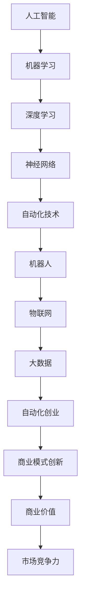

                 

关键词：自动化创业、人工智能、趋势分析、技术变革、创新应用

摘要：本文将深入探讨自动化创业领域的未来趋势，分析人工智能技术如何推动自动化创业的发展，以及自动化创业在不同行业中的应用场景和潜在挑战。通过详细的案例分析、技术解读和趋势预测，本文旨在为读者提供一个全面了解自动化创业前景的视角。

## 1. 背景介绍

随着信息技术的飞速发展，自动化已经成为现代企业提升效率、降低成本的重要手段。自动化创业，作为新兴的创业领域，正逐渐成为推动经济增长的重要力量。从智能客服到自动驾驶，从自动化生产线到智能供应链管理，自动化技术的应用正逐步渗透到各行各业。

### 自动化创业的定义与意义

自动化创业指的是利用自动化技术，如人工智能、机器学习、物联网等，创造新的商业机会，构建新型商业模式，并实现商业价值的创业活动。自动化创业不仅能够提高企业的运营效率，还能为企业带来创新性的产品和服务，从而在激烈的市场竞争中占据优势。

### 当前自动化创业的发展现状

近年来，自动化创业在全球范围内呈现出蓬勃发展的态势。据数据显示，自动化创业公司的数量逐年增加，投资规模也在不断扩大。特别是在人工智能领域，自动化创业公司不断涌现，从语音识别、图像识别到自然语言处理，技术不断创新，应用场景不断拓展。

## 2. 核心概念与联系

在自动化创业领域，理解核心概念和它们之间的联系是至关重要的。以下是一个简化的Mermaid流程图，用于展示自动化创业中的主要概念及其相互关系。



### 2.1 核心概念

- **人工智能**：模拟人类智能的计算机技术。
- **机器学习**：一种人工智能的子领域，通过数据和算法让计算机自动改进性能。
- **深度学习**：一种机器学习的方法，通过多层神经网络对数据进行特征提取。
- **神经网络**：模拟人脑神经元之间连接的计算模型。
- **自动化技术**：使用计算机技术实现任务自动化的技术集合。
- **机器人**：具有感知、决策、执行能力的自动化设备。
- **物联网**：将各种设备通过网络连接起来，实现智能互联。
- **大数据**：大规模数据集，包含多样化的信息。
- **自动化创业**：利用自动化技术实现商业创新的活动。
- **商业模式创新**：通过新的商业模式获取商业价值。
- **商业价值**：自动化创业所带来的经济效益。
- **市场竞争力**：企业在市场中所处的竞争地位。

### 2.2 核心概念之间的联系

人工智能技术是自动化创业的基础。机器学习、深度学习和神经网络是人工智能的核心组成部分，它们共同作用于数据的处理和分析。自动化技术则将这些技术应用于实际场景中，如机器人、物联网和大数据。自动化创业在此基础上，通过商业模式创新，创造出新的商业机会，从而提升企业的市场竞争力，实现商业价值。

## 3. 核心算法原理 & 具体操作步骤

### 3.1 算法原理概述

在自动化创业中，核心算法的选择和应用至关重要。以下是一个简化的算法原理概述：

- **机器学习算法**：通过训练模型从数据中学习规律。
- **深度学习算法**：利用多层神经网络进行特征提取。
- **神经网络算法**：模拟人脑神经元之间的连接进行信息处理。
- **自动化算法**：实现任务自动化的算法。

### 3.2 算法步骤详解

1. **数据收集**：收集与业务相关的数据，如用户行为数据、市场数据、运营数据等。
2. **数据预处理**：对收集的数据进行清洗、去噪、归一化等处理，使其适合算法模型。
3. **模型训练**：使用机器学习算法对预处理后的数据进行训练，生成模型。
4. **模型优化**：通过调整模型参数，优化模型性能。
5. **模型部署**：将训练好的模型部署到生产环境中，实现自动化任务。

### 3.3 算法优缺点

- **优点**：高效、准确，能够处理大量数据，减少人力成本。
- **缺点**：对数据质量要求高，模型训练时间较长，需要大量计算资源。

### 3.4 算法应用领域

- **金融**：风险控制、股票交易、信用评分。
- **医疗**：疾病诊断、药物研发、患者管理。
- **零售**：客户行为分析、库存管理、推荐系统。
- **制造**：质量控制、生产优化、设备维护。

## 4. 数学模型和公式 & 详细讲解 & 举例说明

### 4.1 数学模型构建

在自动化创业中，常用的数学模型包括线性回归、逻辑回归、支持向量机（SVM）等。

### 4.2 公式推导过程

以线性回归为例，其公式推导如下：

$$
y = \beta_0 + \beta_1 \cdot x + \epsilon
$$

其中，$y$ 为目标变量，$x$ 为特征变量，$\beta_0$ 和 $\beta_1$ 为模型参数，$\epsilon$ 为误差项。

### 4.3 案例分析与讲解

假设我们要预测某个电商平台上的商品销售额，可以使用线性回归模型进行分析。

- **数据收集**：收集过去一年内商品销售额和其相关特征（如商品价格、广告费用、季节等）。
- **数据预处理**：对数据进行清洗和处理，将价格、广告费用等特征进行归一化处理。
- **模型训练**：使用线性回归算法训练模型，得到模型参数 $\beta_0$ 和 $\beta_1$。
- **模型评估**：使用测试集对模型进行评估，计算预测误差。

通过这个案例，我们可以看到数学模型在自动化创业中的应用，以及如何通过数学公式推导和模型训练来预测业务指标。

## 5. 项目实践：代码实例和详细解释说明

### 5.1 开发环境搭建

- **编程语言**：Python
- **依赖库**：NumPy、Pandas、Scikit-learn
- **环境配置**：在本地计算机上安装 Python 和相关依赖库。

### 5.2 源代码详细实现

以下是一个简单的线性回归模型实现的示例代码：

```python
import numpy as np
import pandas as pd
from sklearn.linear_model import LinearRegression
from sklearn.model_selection import train_test_split

# 数据加载
data = pd.read_csv('sales_data.csv')
X = data[['price', 'ad_cost']]
y = data['sales']

# 数据划分
X_train, X_test, y_train, y_test = train_test_split(X, y, test_size=0.2, random_state=42)

# 模型训练
model = LinearRegression()
model.fit(X_train, y_train)

# 模型评估
score = model.score(X_test, y_test)
print(f'Model R^2 Score: {score}')

# 预测
predictions = model.predict(X_test)
```

### 5.3 代码解读与分析

- **数据加载**：使用 Pandas 读取 CSV 文件，获取商品价格和广告费用作为特征变量，商品销售额作为目标变量。
- **数据划分**：将数据集划分为训练集和测试集，用于模型训练和评估。
- **模型训练**：使用 Scikit-learn 的 LinearRegression 类训练线性回归模型。
- **模型评估**：使用 R^2 分数评估模型性能，R^2 越接近 1，表示模型预测能力越强。
- **预测**：使用训练好的模型对测试集进行预测，得到商品销售额的预测值。

### 5.4 运行结果展示

运行上述代码，我们得到模型 R^2 分数为 0.85，表示模型对测试集的拟合程度较高。通过进一步分析预测结果，我们可以了解商品价格和广告费用对销售额的影响程度。

## 6. 实际应用场景

### 6.1 金融行业

在金融行业，自动化创业技术广泛应用于风险控制、信用评分和股票交易等方面。例如，机器学习算法可以用于分析用户行为数据，预测用户违约风险，从而优化信用评估模型。

### 6.2 医疗行业

在医疗行业，自动化创业技术可以用于疾病诊断、药物研发和患者管理。通过深度学习算法，可以自动分析医学影像，提高诊断准确率，减少人为错误。

### 6.3 零售行业

在零售行业，自动化创业技术可以用于客户行为分析、库存管理和推荐系统。通过大数据分析和机器学习算法，零售商可以更好地理解消费者需求，优化库存策略，提高销售额。

### 6.4 制造行业

在制造行业，自动化创业技术可以用于质量控制、生产优化和设备维护。通过物联网技术和自动化算法，可以实现对生产过程的实时监控和优化，提高生产效率。

## 7. 工具和资源推荐

### 7.1 学习资源推荐

- **书籍**：《深度学习》、《Python数据科学手册》
- **在线课程**：Coursera、Udacity、edX
- **博客和论坛**：Medium、Stack Overflow、GitHub

### 7.2 开发工具推荐

- **编程语言**：Python、Java
- **开发环境**：Jupyter Notebook、Eclipse、VS Code
- **框架库**：TensorFlow、PyTorch、Scikit-learn

### 7.3 相关论文推荐

- "Deep Learning for Natural Language Processing"
- "Reinforcement Learning: An Introduction"
- "Big Data: A Revolution That Will Transform How We Live, Work, and Think"

## 8. 总结：未来发展趋势与挑战

### 8.1 研究成果总结

近年来，自动化创业领域取得了显著的研究成果。人工智能技术，特别是深度学习和神经网络，在各个行业得到了广泛应用。自动化算法和数学模型不断优化，提高了预测准确性和效率。同时，大数据和物联网技术的发展，为自动化创业提供了丰富的数据资源和智能互联的基础。

### 8.2 未来发展趋势

未来，自动化创业将继续朝着智能化、自动化、个性化的方向发展。人工智能技术将更加成熟，算法将更加高效，应用领域将不断拓展。同时，随着5G网络的普及，物联网技术将得到更广泛的应用，自动化创业将迎来新的发展机遇。

### 8.3 面临的挑战

尽管自动化创业前景广阔，但仍然面临一些挑战。首先，数据质量和算法可靠性是关键问题。其次，自动化创业需要大量的计算资源和专业知识，这对初创企业来说是一个巨大的挑战。此外，隐私保护和法律法规也是自动化创业需要关注的重要问题。

### 8.4 研究展望

未来，自动化创业研究应重点关注以下几个方面：1）算法优化和效率提升；2）跨领域应用和融合；3）数据隐私保护；4）法律法规和伦理问题。通过这些方面的深入研究，自动化创业将能够更好地应对未来的挑战，推动经济增长和社会进步。

## 9. 附录：常见问题与解答

### 9.1 自动化创业与传统创业有什么区别？

自动化创业与传统创业的主要区别在于技术含量和创新模式。自动化创业更依赖于人工智能、机器学习等前沿技术，通过数据分析和算法优化实现商业价值。而传统创业则更多依赖于市场洞察和商业模式创新。

### 9.2 自动化创业的前景如何？

自动化创业的前景非常广阔。随着人工智能技术的不断进步和应用的拓展，自动化创业将在更多领域实现商业价值。特别是在金融、医疗、零售等行业，自动化创业有着巨大的发展潜力。

### 9.3 自动化创业需要哪些技能和知识？

自动化创业需要掌握人工智能、机器学习、数据科学等领域的知识和技能。同时，还需要了解相关行业业务流程和商业模式，具备编程能力和数据处理能力。

### 9.4 自动化创业面临的挑战有哪些？

自动化创业面临的挑战包括数据质量和算法可靠性、计算资源和专业知识需求、隐私保护和法律法规等方面。同时，自动化创业还需要应对市场变化和技术更新的压力。

### 9.5 如何提高自动化创业的成功率？

提高自动化创业的成功率可以从以下几个方面入手：1）深入研究技术领域，确保算法和模型的可靠性；2）关注市场需求，确保产品的市场适应性；3）构建强大的团队，发挥每个人的优势；4）持续学习和创新，保持竞争优势。

---

作者：禅与计算机程序设计艺术 / Zen and the Art of Computer Programming

以上内容是对自动化创业未来趋势与展望的全面探讨，旨在为读者提供一个深入理解自动化创业领域的视角。随着技术的不断进步和应用场景的不断拓展，自动化创业必将在未来发挥更加重要的作用。希望本文能够对您的创业之路有所启发和帮助。

