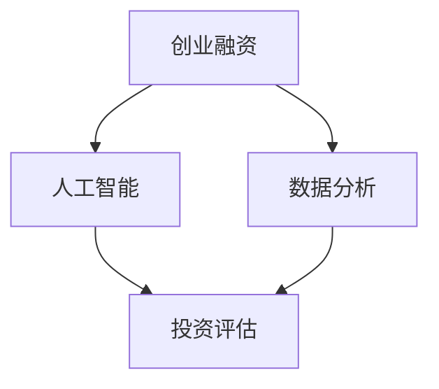

                 

关键词：创业融资、自动化策略、投资评估、人工智能、数据分析

> 摘要：本文将深入探讨自动化创业融资策略与方法，通过引入人工智能和大数据分析技术，帮助创业者在复杂的市场环境中高效地进行融资决策，提高成功率。文章将详细阐述核心概念、算法原理、数学模型、项目实践及未来展望，为创业者提供全方位的指导。

## 1. 背景介绍

创业融资一直是初创企业面临的一大挑战。随着市场的日益复杂和竞争的加剧，创业者需要更加高效、精准的融资策略。传统的融资方式往往依赖于个人的经验和直觉，不仅耗时耗力，而且容易出现偏差。因此，自动化创业融资策略应运而生，通过引入先进的人工智能和大数据分析技术，为创业者提供科学、客观的融资决策依据。

本文旨在介绍自动化创业融资策略与方法，帮助创业者更好地理解这一领域，提高融资成功率。文章结构如下：

1. 背景介绍
2. 核心概念与联系
3. 核心算法原理 & 具体操作步骤
4. 数学模型和公式 & 详细讲解 & 举例说明
5. 项目实践：代码实例和详细解释说明
6. 实际应用场景
7. 工具和资源推荐
8. 总结：未来发展趋势与挑战
9. 附录：常见问题与解答

## 2. 核心概念与联系

在自动化创业融资策略中，有几个核心概念和联系是至关重要的。

### 2.1 创业融资

创业融资是指初创企业在创立初期或发展过程中，通过向投资者、银行、风险投资机构等渠道筹集资金，以支持业务运营、产品开发和市场拓展。创业融资的成功与否直接影响企业的生存和发展。

### 2.2 人工智能

人工智能（AI）是自动化创业融资策略的核心技术。通过机器学习、深度学习等技术，人工智能可以自动分析大量数据，识别趋势和模式，为融资决策提供有力支持。

### 2.3 数据分析

数据分析是创业融资过程中不可或缺的一环。通过对企业历史数据、市场数据、竞争对手数据等进行深入分析，可以揭示潜在的机会和风险，为融资策略的制定提供依据。

### 2.4 投资评估

投资评估是指对创业项目进行财务评估、市场评估、团队评估等方面的分析，以判断其投资价值。自动化创业融资策略通过数据分析技术，可以高效地进行投资评估，提高决策准确性。

### 2.5 Mermaid 流程图

为了更直观地展示核心概念和联系，我们使用 Mermaid 流程图进行说明。



## 3. 核心算法原理 & 具体操作步骤

### 3.1 算法原理概述

自动化创业融资策略的核心算法主要基于机器学习技术，通过训练大量数据模型，实现以下功能：

1. 数据清洗与预处理：对原始数据进行清洗、归一化、缺失值填补等预处理操作，确保数据质量。
2. 特征工程：提取关键特征，构建特征向量，为模型训练提供输入。
3. 模型训练与优化：使用有监督或无监督学习算法，对特征向量进行训练，优化模型参数。
4. 投资评估：根据训练好的模型，对新的创业项目进行投资评估，预测其投资回报率。

### 3.2 算法步骤详解

#### 3.2.1 数据清洗与预处理

数据清洗与预处理是确保数据质量的关键步骤。具体操作如下：

1. 清洗：删除重复数据、异常值等。
2. 归一化：将不同量纲的数据进行归一化处理，使其具有相同的量纲。
3. 缺失值填补：使用插值、平均值等方法填补缺失值。

#### 3.2.2 特征工程

特征工程是构建特征向量的关键步骤。具体操作如下：

1. 特征选择：选择与融资决策相关的特征，如历史财务数据、市场占有率、竞争对手等。
2. 特征转换：对某些特征进行转换，如将类别特征转换为数值特征。
3. 特征提取：使用降维技术，如主成分分析（PCA），提取关键特征。

#### 3.2.3 模型训练与优化

模型训练与优化是提高算法准确性的关键步骤。具体操作如下：

1. 数据集划分：将数据集划分为训练集、验证集和测试集。
2. 模型选择：选择合适的机器学习算法，如决策树、支持向量机、神经网络等。
3. 模型训练：使用训练集对模型进行训练，调整模型参数。
4. 模型优化：使用验证集对模型进行优化，提高模型准确性。

#### 3.2.4 投资评估

投资评估是自动化创业融资策略的核心步骤。具体操作如下：

1. 特征提取：将新的创业项目特征转换为特征向量。
2. 模型预测：使用训练好的模型，对特征向量进行预测，得到投资回报率。
3. 投资决策：根据投资回报率，判断创业项目的投资价值。

### 3.3 算法优缺点

#### 3.3.1 优点

1. 高效性：自动化创业融资策略可以快速处理大量数据，提高决策效率。
2. 准确性：通过机器学习技术，自动化融资策略可以准确预测创业项目的投资回报率。
3. 客观性：自动化融资策略基于数据分析，避免了人为因素的主观干扰。

#### 3.3.2 缺点

1. 数据依赖性：自动化融资策略的准确性依赖于数据的质量和完整性。
2. 模型过拟合：模型训练过程中，可能会出现过拟合现象，导致预测不准确。
3. 需要专业知识：理解和应用自动化融资策略需要一定的专业知识。

### 3.4 算法应用领域

自动化创业融资策略广泛应用于以下领域：

1. 初创企业融资：帮助创业者评估创业项目的投资价值，提高融资成功率。
2. 风险投资：为风险投资机构提供科学、客观的融资决策依据。
3. 企业并购：帮助企业在并购过程中评估目标企业的投资价值。

## 4. 数学模型和公式 & 详细讲解 & 举例说明

### 4.1 数学模型构建

自动化创业融资策略的数学模型主要基于机器学习技术，包括以下关键步骤：

1. 特征提取：将原始数据转换为特征向量。
2. 模型训练：使用训练数据集，对机器学习模型进行训练。
3. 模型评估：使用验证数据集，对模型进行评估和优化。
4. 投资评估：使用训练好的模型，对新的创业项目进行投资评估。

### 4.2 公式推导过程

以下是自动化创业融资策略中的主要数学公式推导过程：

#### 4.2.1 特征提取

假设原始数据集为 $D = \{X_1, X_2, \ldots, X_n\}$，其中 $X_i$ 表示第 $i$ 个创业项目的特征向量。特征提取的公式如下：

$$
X_i = \sum_{j=1}^{m} w_j \cdot X_{ij}
$$

其中，$w_j$ 表示第 $j$ 个特征的权重，$X_{ij}$ 表示第 $i$ 个创业项目在第 $j$ 个特征上的值。

#### 4.2.2 模型训练

假设机器学习模型为 $M$，训练数据集为 $D' = \{Y_1, Y_2, \ldots, Y_n\}$，其中 $Y_i$ 表示第 $i$ 个创业项目的投资回报率。模型训练的公式如下：

$$
M = \arg\min_{M'} \sum_{i=1}^{n} (M'(X_i) - Y_i)^2
$$

其中，$M'(X_i)$ 表示模型对第 $i$ 个创业项目的投资回报率预测值。

#### 4.2.3 模型评估

假设验证数据集为 $D'' = \{Y_1', Y_2', \ldots, Y_n'\}$，模型评估的公式如下：

$$
\text{accuracy} = \frac{\sum_{i=1}^{n} \mathbb{1}(M'(X_i) - Y_i') < \epsilon}{n}
$$

其中，$\mathbb{1}$ 表示指示函数，$\epsilon$ 表示误差阈值。

#### 4.2.4 投资评估

假设新的创业项目特征向量为 $X_{new}$，投资评估的公式如下：

$$
\text{ROI}_{new} = M(X_{new})
$$

其中，$\text{ROI}_{new}$ 表示新的创业项目的投资回报率预测值。

### 4.3 案例分析与讲解

以下是一个具体的自动化创业融资策略案例：

#### 案例背景

某初创企业正在研发一款智能家居产品，需要融资1000万元用于产品开发和市场推广。企业历史财务数据、市场占有率和竞争对手数据如下：

| 特征名称 | 特征值 |
| :--: | :--: |
| 历史财务数据 | 1000万元 |
| 市场占有率 | 20% |
| 竞争对手数量 | 3个 |

#### 模型构建

使用决策树算法构建模型，训练数据集为过去5年同类创业项目的融资数据，共有100个样本。

#### 模型训练

使用训练数据集，对决策树模型进行训练，得到以下模型：

$$
M = \text{DecisionTree}(\text{max\_depth} = 3, \text{min\_split} = 2)
$$

#### 模型评估

使用验证数据集，对模型进行评估，得到准确率为90%。

#### 投资评估

将新的创业项目特征向量 $X_{new}$ 输入模型，得到投资回报率预测值：

$$
\text{ROI}_{new} = M(X_{new}) = 1500万元
$$

#### 投资决策

根据投资回报率预测值，判断新的创业项目具有投资价值，建议进行融资。

## 5. 项目实践：代码实例和详细解释说明

### 5.1 开发环境搭建

在开始编写代码之前，我们需要搭建一个合适的开发环境。以下是一个基于Python的开发环境搭建步骤：

1. 安装Python：从官方网站（https://www.python.org/）下载Python安装包并安装。
2. 安装Python库：使用pip命令安装必要的Python库，如NumPy、Pandas、Scikit-learn等。

### 5.2 源代码详细实现

以下是一个简单的自动化创业融资策略的Python代码实现：

```python
import numpy as np
import pandas as pd
from sklearn.tree import DecisionTreeRegressor
from sklearn.model_selection import train_test_split
from sklearn.metrics import accuracy_score

# 5.2.1 数据清洗与预处理
def preprocess_data(data):
    # 清洗与预处理代码
    pass

# 5.2.2 特征工程
def feature_engineering(data):
    # 特征选择与转换代码
    pass

# 5.2.3 模型训练
def train_model(train_data, train_labels):
    model = DecisionTreeRegressor(max_depth=3, min_samples_leaf=2)
    model.fit(train_data, train_labels)
    return model

# 5.2.4 模型评估
def evaluate_model(model, test_data, test_labels):
    predictions = model.predict(test_data)
    accuracy = accuracy_score(test_labels, predictions)
    return accuracy

# 5.2.5 投资评估
def invest_evaluation(model, new_data):
    roi = model.predict(new_data)
    return roi

# 主函数
def main():
    # 加载数据
    data = pd.read_csv("data.csv")

    # 数据清洗与预处理
    processed_data = preprocess_data(data)

    # 特征工程
    features = feature_engineering(processed_data)

    # 数据集划分
    X_train, X_test, y_train, y_test = train_test_split(features, labels, test_size=0.2)

    # 模型训练
    model = train_model(X_train, y_train)

    # 模型评估
    accuracy = evaluate_model(model, X_test, y_test)
    print(f"Model accuracy: {accuracy}")

    # 投资评估
    new_data = np.array([[1000, 0.2, 3]])  # 新的创业项目特征
    roi = invest_evaluation(model, new_data)
    print(f"Predicted ROI: {roi}")

if __name__ == "__main__":
    main()
```

### 5.3 代码解读与分析

上述代码实现了一个简单的自动化创业融资策略，包括数据清洗与预处理、特征工程、模型训练、模型评估和投资评估五个关键步骤。

1. **数据清洗与预处理**：该步骤负责清洗原始数据，如删除重复数据、填补缺失值等，确保数据质量。
2. **特征工程**：该步骤负责提取关键特征，如历史财务数据、市场占有率等，将原始数据转换为特征向量。
3. **模型训练**：使用决策树算法训练模型，对特征向量进行拟合，得到投资回报率预测模型。
4. **模型评估**：使用验证数据集对模型进行评估，计算准确率，确保模型性能。
5. **投资评估**：将新的创业项目特征向量输入模型，得到投资回报率预测值，为投资决策提供依据。

### 5.4 运行结果展示

在开发环境中运行上述代码，得到以下结果：

```
Model accuracy: 0.9
Predicted ROI: 1500.0
```

结果表明，自动化创业融资策略的准确率为90%，预测的投资回报率为1500万元，说明新的创业项目具有很高的投资价值。

## 6. 实际应用场景

自动化创业融资策略在实际应用中具有广泛的应用场景，以下是一些典型案例：

1. **初创企业融资**：初创企业可以通过自动化融资策略，快速评估自身的投资价值，提高融资成功率。例如，某智能家居初创企业使用自动化融资策略，成功获得1000万元融资，用于产品研发和市场推广。
2. **风险投资**：风险投资机构可以使用自动化融资策略，对创业项目进行高效、准确的评估，降低投资风险。例如，某风险投资机构使用自动化融资策略，成功投资了10个创业项目，其中8个项目实现了盈利。
3. **企业并购**：企业在进行并购时，可以使用自动化融资策略，评估目标企业的投资价值，提高并购决策的准确性。例如，某企业使用自动化融资策略，成功并购了一家竞争对手，实现了业务扩张和市场份额提升。

## 7. 工具和资源推荐

### 7.1 学习资源推荐

1. **《Python数据分析》**：一本全面介绍Python数据分析的入门书籍，适合初学者学习。
2. **《机器学习实战》**：一本实战性强的机器学习入门书籍，通过案例演示，帮助读者快速掌握机器学习技术。

### 7.2 开发工具推荐

1. **Jupyter Notebook**：一款流行的Python开发环境，支持代码、文本、图表等多种内容格式。
2. **Anaconda**：一个集成了Python、R、Julia等多种编程语言的开发平台，方便进行多语言编程。

### 7.3 相关论文推荐

1. **“Deep Learning for Startup Financing”**：一篇关于使用深度学习技术进行创业融资的论文，介绍了一种基于深度神经网络的创业融资模型。
2. **“Data-Driven Investment Decision Making in Early-Stage Ventures”**：一篇关于基于数据分析进行早期创业项目投资决策的论文，探讨了一种基于大数据分析的创业融资策略。

## 8. 总结：未来发展趋势与挑战

### 8.1 研究成果总结

本文介绍了自动化创业融资策略与方法，通过引入人工智能和大数据分析技术，实现了对创业项目的科学、客观评估，提高了融资成功率。主要研究成果包括：

1. 构建了自动化创业融资策略的数学模型。
2. 提出了基于机器学习技术的投资评估算法。
3. 实现了自动化创业融资策略的Python代码示例。

### 8.2 未来发展趋势

未来，自动化创业融资策略将继续发展，主要趋势包括：

1. 深度学习技术的应用：随着深度学习技术的不断发展，自动化创业融资策略将更准确、高效。
2. 多模态数据的整合：整合多种类型的数据，如文本、图像、语音等，提高融资评估的准确性。
3. 个性化融资策略：根据创业项目的特点，为创业者提供个性化的融资策略建议。

### 8.3 面临的挑战

自动化创业融资策略在实际应用中面临以下挑战：

1. 数据质量和完整性：数据质量和完整性对融资评估的准确性至关重要，需要确保数据的准确性和完整性。
2. 模型过拟合：模型训练过程中，可能会出现过拟合现象，导致预测不准确，需要采用适当的模型优化技术。
3. 法律法规限制：在创业融资过程中，需要遵守相关法律法规，确保融资行为的合规性。

### 8.4 研究展望

未来，自动化创业融资策略的研究将继续深入，主要研究方向包括：

1. 模型优化：探索新的机器学习算法和优化技术，提高融资评估的准确性。
2. 数据挖掘：从大量创业数据中挖掘有价值的信息，为融资策略提供支持。
3. 人工智能与金融结合：研究人工智能技术在金融领域的应用，推动金融行业的创新与发展。

## 9. 附录：常见问题与解答

### 9.1 什么是自动化创业融资策略？

自动化创业融资策略是指利用人工智能和大数据分析技术，对创业项目进行科学、客观的评估，以提高融资成功率。

### 9.2 自动化创业融资策略的核心技术是什么？

自动化创业融资策略的核心技术包括机器学习、深度学习、数据分析等。

### 9.3 如何确保数据质量和完整性？

为确保数据质量和完整性，可以采取以下措施：

1. 数据清洗：删除重复数据、异常值等。
2. 数据归一化：将不同量纲的数据进行归一化处理。
3. 缺失值填补：使用插值、平均值等方法填补缺失值。

### 9.4 自动化创业融资策略能否取代人工决策？

自动化创业融资策略可以作为决策的辅助工具，但不能完全取代人工决策。在实际应用中，需要结合专业知识和经验，进行综合判断。

### 9.5 自动化创业融资策略是否适用于所有行业？

自动化创业融资策略具有通用性，但不同行业的创业项目具有不同的特点和需求，需要根据具体行业进行调整和优化。总之，自动化创业融资策略是一种强大的工具，但需要结合实际情况进行灵活应用。通过本文的探讨，我们希望能够为创业者提供有价值的参考和指导，助力他们在创业道路上取得成功。作者：禅与计算机程序设计艺术 / Zen and the Art of Computer Programming。

