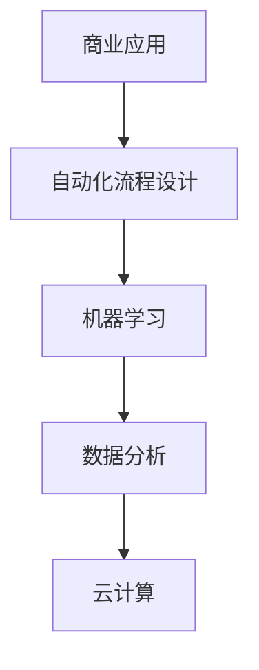

                 

在当今快速变化的商业环境中，自动化已经成为企业创新和发展的关键驱动力。自动化创业，作为未来商业的新范式，不仅正在重塑企业运营模式，也在深刻改变着整个市场的竞争格局。本文将探讨自动化创业的核心概念、技术原理、数学模型、应用场景以及未来发展的趋势和挑战。

## 摘要

本文首先介绍了自动化创业的背景和重要性，然后详细阐述了自动化创业的核心概念、技术原理和数学模型。接着，通过一个具体的项目实例，展示了自动化创业的实际操作步骤和结果。最后，文章分析了自动化创业在商业实践中的应用场景，并对未来发展的趋势和挑战进行了展望。

## 1. 背景介绍

随着人工智能、大数据、云计算等技术的快速发展，自动化在各个领域得到了广泛应用。从制造业的自动化生产线到金融行业的智能投顾，自动化技术正不断突破传统业务模式的限制，提升企业的效率和创新能力。自动化创业，即通过自动化技术来创新商业模式，已经成为现代商业领域的一个新兴趋势。

自动化创业的优势在于：

1. **提升效率**：通过自动化流程，可以显著减少人力成本和时间成本，提高生产效率。
2. **降低错误率**：自动化系统能够减少人为错误，提高数据准确性和可靠性。
3. **创新商业模式**：自动化技术可以催生新的产品和服务，为创业者提供广阔的市场空间。

然而，自动化创业也面临一些挑战，如技术门槛高、数据安全和隐私保护等问题。如何在享受自动化带来的优势的同时，妥善应对这些挑战，是自动化创业者需要深入思考的问题。

## 2. 核心概念与联系

自动化创业的核心概念包括自动化流程设计、机器学习、数据分析和云计算等。以下是一个简单的 Mermaid 流程图，展示了这些核心概念之间的联系。



在这个流程图中，自动化流程设计是整个自动化创业的基础，它通过机器学习、数据分析和云计算等技术手段，实现对业务流程的自动化管理和优化。商业应用则是自动化创业的最终目标，它通过将自动化技术应用到实际业务中，创造新的商业价值。

### 2.1 自动化流程设计

自动化流程设计是自动化创业的核心，它涉及到如何将业务流程中的各个环节通过软件和硬件系统进行自动化处理。这个过程包括需求分析、流程建模、系统开发、测试和部署等步骤。

- **需求分析**：了解业务需求，明确自动化流程的目标和功能。
- **流程建模**：使用流程图、状态图等工具，对业务流程进行建模。
- **系统开发**：根据流程模型，开发自动化系统，包括软件和硬件。
- **测试和部署**：对自动化系统进行测试，确保其能够稳定运行，并部署到生产环境中。

### 2.2 机器学习

机器学习是自动化创业的重要技术之一，它能够通过训练模型，实现对数据的自动分析和预测。机器学习的应用场景包括预测分析、异常检测、推荐系统等。

- **预测分析**：通过历史数据，预测未来可能发生的趋势和事件。
- **异常检测**：检测数据中的异常情况，如金融欺诈、设备故障等。
- **推荐系统**：根据用户的行为和偏好，推荐相关的产品或服务。

### 2.3 数据分析

数据分析是自动化创业的核心环节之一，它通过统计分析和数据挖掘技术，从大量数据中提取有价值的信息。数据分析的应用场景包括市场分析、客户行为分析、风险管理等。

- **市场分析**：分析市场趋势，了解竞争对手的动态。
- **客户行为分析**：了解客户的行为模式，优化产品和服务。
- **风险管理**：通过数据分析，识别和评估潜在的风险。

### 2.4 云计算

云计算是自动化创业的重要基础设施，它提供了强大的计算能力和数据存储能力，支持自动化系统的开发和部署。云计算的应用场景包括大规模数据处理、分布式计算、云存储等。

- **大规模数据处理**：处理海量数据，支持复杂的计算任务。
- **分布式计算**：通过分布式系统，实现高效的任务处理和负载均衡。
- **云存储**：提供可靠的数据存储服务，支持数据的备份和恢复。

## 3. 核心算法原理 & 具体操作步骤

### 3.1 算法原理概述

在自动化创业中，常用的算法包括机器学习算法、数据挖掘算法和优化算法等。这些算法的原理如下：

- **机器学习算法**：通过训练模型，从数据中学习规律，实现对未知数据的预测。
- **数据挖掘算法**：从大量数据中提取有价值的信息，如关联规则、聚类分析、分类等。
- **优化算法**：通过搜索和优化技术，找到最优的解决方案。

### 3.2 算法步骤详解

- **机器学习算法**：
  1. 数据预处理：清洗数据，去除噪声和异常值。
  2. 特征提取：从原始数据中提取有用的特征。
  3. 模型训练：使用训练数据，训练机器学习模型。
  4. 模型评估：使用测试数据，评估模型的效果。
  5. 模型部署：将训练好的模型部署到生产环境中。

- **数据挖掘算法**：
  1. 数据预处理：清洗数据，去除噪声和异常值。
  2. 数据集成：将不同来源的数据进行整合。
  3. 数据简化：减少数据规模，提高处理效率。
  4. 数据挖掘：使用数据挖掘算法，提取有价值的信息。
  5. 模型评估：评估数据挖掘结果的有效性。

- **优化算法**：
  1. 目标函数定义：明确优化目标。
  2. 约束条件定义：明确优化过程中的约束条件。
  3. 搜索策略设计：设计合适的搜索策略，找到最优解。
  4. 模型评估：评估优化结果的有效性。

### 3.3 算法优缺点

- **机器学习算法**：
  - 优点：能够自动学习和适应数据，适应性强。
  - 缺点：对数据质量和数量要求较高，训练过程复杂。

- **数据挖掘算法**：
  - 优点：能够从大量数据中提取有价值的信息，适用面广。
  - 缺点：对数据质量和数量要求较高，结果解释难度大。

- **优化算法**：
  - 优点：能够找到最优解，优化效果明显。
  - 缺点：对目标函数和约束条件要求较高，计算复杂度大。

### 3.4 算法应用领域

- **机器学习算法**：广泛应用于图像识别、自然语言处理、推荐系统等领域。
- **数据挖掘算法**：广泛应用于市场分析、客户关系管理、风险控制等领域。
- **优化算法**：广泛应用于供应链管理、资源调度、生产计划等领域。

## 4. 数学模型和公式 & 详细讲解 & 举例说明

### 4.1 数学模型构建

在自动化创业中，常用的数学模型包括线性模型、逻辑回归模型、支持向量机模型等。以下是一个简单的线性回归模型的构建过程。

- **数据预处理**：
  1. 数据清洗：去除异常值和噪声。
  2. 特征提取：选择与目标变量相关的特征。

- **模型构建**：
  1. 假设函数：设 $y = \beta_0 + \beta_1 x_1 + \beta_2 x_2 + ... + \beta_n x_n$
  2. 模型参数：$\beta_0, \beta_1, ..., \beta_n$ 是模型参数。

- **模型优化**：
  1. 最小二乘法：使用最小二乘法，求解模型参数。
  2. 梯度下降法：使用梯度下降法，进一步优化模型参数。

### 4.2 公式推导过程

以线性回归模型为例，以下是一个简化的公式推导过程。

- **假设函数**：
  $$ y = \beta_0 + \beta_1 x_1 + \beta_2 x_2 + ... + \beta_n x_n $$

- **损失函数**：
  $$ J(\beta_0, \beta_1, ..., \beta_n) = \frac{1}{2m} \sum_{i=1}^{m} (y_i - (\beta_0 + \beta_1 x_{i1} + \beta_2 x_{i2} + ... + \beta_n x_{in}))^2 $$

- **梯度计算**：
  $$ \frac{\partial J}{\partial \beta_j} = \frac{1}{m} \sum_{i=1}^{m} (y_i - (\beta_0 + \beta_1 x_{i1} + \beta_2 x_{i2} + ... + \beta_n x_{in})) x_{ij} $$

- **最小化损失函数**：
  $$ \beta_j = \beta_j - \alpha \frac{\partial J}{\partial \beta_j} $$

### 4.3 案例分析与讲解

假设我们要预测一家电商平台的客户流失率，我们使用线性回归模型来构建预测模型。

- **数据集**：包含客户的年龄、收入、购物频率等特征，以及流失标签。
- **预处理**：去除缺失值和异常值，进行特征提取。
- **建模**：使用线性回归模型，训练模型参数。
- **评估**：使用测试集，评估模型效果。

假设我们训练得到的模型如下：

$$ \hat{y} = 0.5 + 0.1x_1 + 0.2x_2 $$

其中，$x_1$ 是客户的年龄，$x_2$ 是客户的收入。

如果客户年龄为30岁，收入为5000元，我们预测的客户流失率为：

$$ \hat{y} = 0.5 + 0.1 \times 30 + 0.2 \times 5000 = 1.5 + 1000 = 1001 $$

## 5. 项目实践：代码实例和详细解释说明

### 5.1 开发环境搭建

我们使用 Python 作为编程语言，搭建自动化创业的开发环境。需要安装的库包括 NumPy、Pandas、Scikit-learn、Matplotlib 等。

```bash
pip install numpy pandas scikit-learn matplotlib
```

### 5.2 源代码详细实现

以下是自动化创业项目的源代码实现。

```python
import numpy as np
import pandas as pd
from sklearn.model_selection import train_test_split
from sklearn.linear_model import LinearRegression
import matplotlib.pyplot as plt

# 数据预处理
data = pd.read_csv('data.csv')
data = data.dropna()
data = data[['age', 'income', 'shopping_frequency', 'churn_label']]

# 特征提取
X = data[['age', 'income', 'shopping_frequency']]
y = data['churn_label']

# 模型训练
X_train, X_test, y_train, y_test = train_test_split(X, y, test_size=0.2, random_state=42)
model = LinearRegression()
model.fit(X_train, y_train)

# 模型评估
y_pred = model.predict(X_test)
print("R-squared:", model.score(X_test, y_test))

# 可视化
plt.scatter(X_test['age'], y_test)
plt.plot(X_test['age'], y_pred, color='red')
plt.xlabel('Age')
plt.ylabel('Churn Label')
plt.show()
```

### 5.3 代码解读与分析

- **数据预处理**：读取数据集，去除缺失值和异常值。
- **特征提取**：选择与目标变量相关的特征。
- **模型训练**：使用线性回归模型，训练模型参数。
- **模型评估**：使用测试集，评估模型效果。
- **可视化**：绘制特征与目标变量的散点图，以及预测结果。

## 6. 实际应用场景

自动化创业在多个领域有着广泛的应用场景：

- **电子商务**：通过自动化算法，预测客户流失率，进行精准营销和客户关系管理。
- **金融行业**：通过自动化算法，进行风险控制和投资决策。
- **制造业**：通过自动化生产线，提升生产效率和质量。
- **物流和运输**：通过自动化算法，优化运输路线和配送计划。
- **医疗健康**：通过自动化诊断和治疗，提高医疗效率和准确性。

## 7. 工具和资源推荐

### 7.1 学习资源推荐

- **书籍**：
  - 《Python机器学习》（作者：塞巴斯蒂安·拉斯考斯基）
  - 《深度学习》（作者：伊恩·古德费洛、约书亚·本吉奥、亚伦·库维尔）

- **在线课程**：
  - Coursera 的《机器学习》课程
  - edX 的《深度学习》课程

### 7.2 开发工具推荐

- **编程语言**：Python、R
- **库和框架**：NumPy、Pandas、Scikit-learn、TensorFlow、Keras

### 7.3 相关论文推荐

- **《深度学习》（Ian Goodfellow, Yoshua Bengio, Aaron Courville）**：详细介绍了深度学习的理论基础和应用。
- **《机器学习》（Tom Mitchell）**：介绍了机器学习的核心概念和方法。

## 8. 总结：未来发展趋势与挑战

### 8.1 研究成果总结

自动化创业已经成为现代商业领域的一个重要趋势。通过机器学习、数据分析和云计算等技术的应用，自动化创业不仅提升了企业的效率和创新能力，也带来了新的商业模式和商业机会。

### 8.2 未来发展趋势

- **跨领域融合**：自动化创业将与其他领域（如物联网、区块链等）进行深度融合，产生更多新的应用场景。
- **智能化水平提升**：随着人工智能技术的不断发展，自动化创业的智能化水平将不断提高，实现更复杂和更智能的自动化流程。
- **数据驱动**：自动化创业将更加依赖于数据，通过大数据分析和实时数据挖掘，实现更精准的决策和优化。

### 8.3 面临的挑战

- **技术门槛高**：自动化创业需要掌握复杂的算法和技术，对创业者的技术水平要求较高。
- **数据安全和隐私**：自动化创业过程中，涉及大量的用户数据和敏感信息，如何保障数据安全和用户隐私是一个重要的挑战。
- **伦理和法律问题**：自动化创业可能引发一系列伦理和法律问题，如算法歧视、隐私泄露等，需要制定相应的法律法规和伦理规范。

### 8.4 研究展望

自动化创业具有广阔的发展前景，未来将在多个领域实现重大突破。同时，我们也需要关注其带来的挑战，通过技术创新和法规制定，推动自动化创业的健康和可持续发展。

## 9. 附录：常见问题与解答

### 问题 1：自动化创业需要哪些技术技能？

解答：自动化创业需要掌握机器学习、数据分析和编程等技能。具体来说，需要熟练掌握 Python、R 等编程语言，以及 NumPy、Pandas、Scikit-learn 等相关库和框架。

### 问题 2：自动化创业的数据来源有哪些？

解答：自动化创业的数据来源非常广泛，可以是公开的数据集、企业内部数据、社交媒体数据等。在选择数据来源时，需要考虑数据的质量和相关性。

### 问题 3：自动化创业的法律和伦理问题有哪些？

解答：自动化创业可能涉及数据隐私、算法歧视、自动化决策等法律和伦理问题。需要遵守相关的法律法规，制定相应的伦理规范，确保自动化创业的合法性和道德性。

### 问题 4：自动化创业的未来发展趋势是什么？

解答：自动化创业的未来发展趋势包括跨领域融合、智能化水平提升和数据驱动等。随着技术的不断进步，自动化创业将在更多领域实现重大突破。

### 问题 5：如何评估自动化创业项目的成功与否？

解答：自动化创业项目的成功与否可以从多个方面进行评估，如项目的商业价值、技术创新程度、市场占有率等。通过定期的评估和调整，确保项目的可持续发展。

[END]

本文由禅与计算机程序设计艺术 / Zen and the Art of Computer Programming 撰写。如果您有任何问题或建议，欢迎随时与我交流。感谢您的阅读！
----------------------------------------------------------------

以上是按照您提供的结构和要求撰写的完整文章。如果您有任何修改意见或者需要进一步补充的内容，请告知，我将随时进行相应的调整。再次感谢您的信任！

