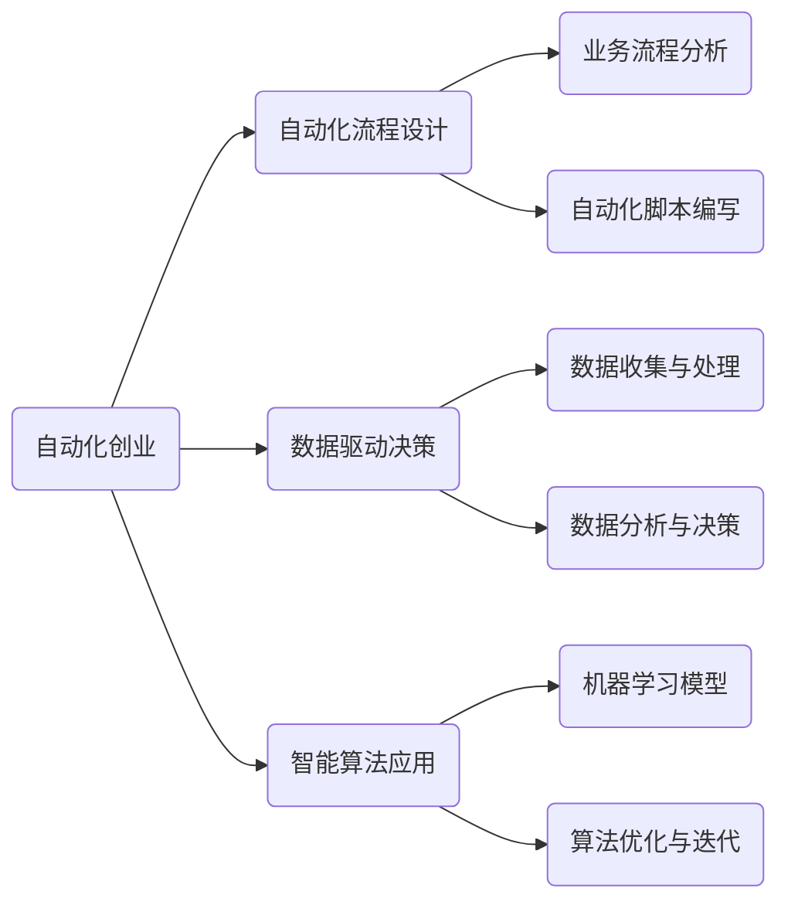

                 

随着科技的飞速发展，商业世界正经历着深刻的变革。自动化技术的兴起，为创业者带来了前所未有的机遇和挑战。本文将探讨自动化创业的核心概念、技术原理、应用场景以及未来发展趋势，旨在为创业者提供一种全新的商业范式。

## 关键词
- 自动化技术
- 创业
- 商业模式
- 科技创新
- 数据驱动

## 摘要
本文将从自动化技术的核心概念入手，分析其在商业领域的应用。我们将探讨自动化创业的优势、面临的挑战以及未来发展的趋势。通过具体案例和项目实践，帮助读者理解自动化创业的实质，并为其在商业世界中的创新提供参考。

## 1. 背景介绍
### 自动化技术的定义与演变
自动化技术，是指通过计算机编程、人工智能算法等手段，使机器能够自主完成特定任务的技术。从最初的机械自动化到今天的智能自动化，自动化技术经历了漫长的演变过程。

- **机械自动化（1960s-1980s）**：以流水线作业为代表，通过机械装置实现生产过程的自动化。
- **电子自动化（1980s-2000s）**：引入计算机控制，实现了生产过程的高度自动化。
- **智能自动化（2000s-至今）**：借助人工智能、大数据等技术，实现了自主决策和高度灵活的自动化。

### 商业领域的自动化应用
自动化技术在商业领域的应用日益广泛，从简单的数据录入到复杂的客户服务，自动化技术正深刻改变着商业运作方式。

- **生产自动化**：通过自动化设备提高生产效率和产品质量。
- **物流自动化**：利用自动化仓储系统和智能配送机器人，实现物流环节的自动化。
- **客户服务自动化**：通过智能客服系统提供24/7的客户服务。

### 自动化创业的兴起
随着自动化技术的成熟和普及，越来越多的创业者开始将自动化技术应用于商业创业。自动化创业的核心在于通过自动化技术提高效率、降低成本、提升用户体验。

- **提高效率**：自动化技术能够自动完成繁琐的任务，减少人工干预，提高整体工作效率。
- **降低成本**：通过自动化减少对人力资源的依赖，降低运营成本。
- **提升用户体验**：自动化技术能够提供更加精准和高效的服务，提升用户体验。

## 2. 核心概念与联系
### 自动化创业的核心概念
- **自动化流程设计**：通过对业务流程的深入理解，设计出能够自动执行的任务流程。
- **数据驱动决策**：利用大数据分析技术，根据数据驱动业务决策，提高决策的准确性和效率。
- **智能算法应用**：利用人工智能算法，实现自动化系统的自主学习和优化。

### 自动化创业的架构图


## 3. 核心算法原理 & 具体操作步骤
### 3.1 算法原理概述
自动化创业的核心算法包括自动化流程设计、数据驱动决策和智能算法应用。

- **自动化流程设计**：基于业务需求，设计出能够自动执行的任务流程。
- **数据驱动决策**：利用大数据分析技术，根据数据变化进行业务决策。
- **智能算法应用**：利用机器学习算法，实现自动化系统的自主学习和优化。

### 3.2 算法步骤详解
#### 3.2.1 自动化流程设计
1. **需求分析**：明确业务需求，确定需要自动化的任务。
2. **流程设计**：根据需求设计出自动化流程，包括任务节点、执行条件和流转逻辑。
3. **脚本编写**：使用编程语言编写自动化脚本，实现流程自动化。

#### 3.2.2 数据驱动决策
1. **数据收集**：从各个渠道收集业务数据。
2. **数据处理**：对收集到的数据进行清洗、整合和转换。
3. **数据分析**：利用数据分析工具，对处理后的数据进行挖掘和分析。
4. **决策制定**：根据数据分析结果，制定业务决策。

#### 3.2.3 智能算法应用
1. **模型选择**：根据业务需求，选择合适的机器学习模型。
2. **数据预处理**：对数据进行预处理，以满足模型训练的需要。
3. **模型训练**：使用预处理后的数据，训练机器学习模型。
4. **模型评估与优化**：评估模型性能，进行模型优化。

### 3.3 算法优缺点
#### 优点
- **提高效率**：自动化流程设计可以显著提高工作效率，减少人工干预。
- **降低成本**：通过数据驱动决策，可以降低运营成本。
- **提升用户体验**：智能算法应用可以提供更加精准和高效的服务，提升用户体验。

#### 缺点
- **初始投入成本高**：自动化创业需要大量的技术投入，初始成本较高。
- **数据质量要求高**：数据驱动决策依赖于高质量的数据，数据质量对决策准确性有很大影响。
- **技术更新迅速**：自动化技术更新迅速，需要不断学习和适应新技术。

### 3.4 算法应用领域
自动化创业的应用领域非常广泛，包括但不限于以下领域：

- **生产制造**：通过自动化设备提高生产效率和产品质量。
- **物流配送**：利用自动化仓储系统和智能配送机器人，实现物流环节的自动化。
- **客户服务**：通过智能客服系统提供24/7的客户服务。
- **金融领域**：利用自动化交易系统和风险控制系统，提高金融交易的效率和安全性。

## 4. 数学模型和公式 & 详细讲解 & 举例说明
### 4.1 数学模型构建
在自动化创业中，常用的数学模型包括线性回归、逻辑回归、决策树等。

- **线性回归**：用于预测连续型变量。
- **逻辑回归**：用于预测离散型变量。
- **决策树**：用于分类和回归分析。

### 4.2 公式推导过程
以线性回归为例，假设我们有两个变量 $x$ 和 $y$，它们之间存在线性关系：

$$y = \beta_0 + \beta_1x + \epsilon$$

其中，$\beta_0$ 和 $\beta_1$ 分别是截距和斜率，$\epsilon$ 是误差项。

为了估计 $\beta_0$ 和 $\beta_1$，我们通常使用最小二乘法：

$$\beta_0 = \frac{\sum y_i - \beta_1\sum x_i}{n}$$

$$\beta_1 = \frac{n\sum x_iy_i - \sum x_i\sum y_i}{n\sum x_i^2 - (\sum x_i)^2}$$

### 4.3 案例分析与讲解
假设我们有一组数据，如下表所示：

| $x$ | $y$ |
|----|----|
| 1  | 2  |
| 2  | 4  |
| 3  | 6  |
| 4  | 8  |

我们希望使用线性回归模型预测 $x=5$ 时的 $y$ 值。

根据最小二乘法，我们计算得到：

$$\beta_0 = \frac{2+4+6+8 - 5(1+2+3+4)}{4} = 2.5$$

$$\beta_1 = \frac{4(1+2+3+4) - (1+2+3+4)(2+4+6+8)}{4(1+2+3+4) - (1+2+3+4)^2} = 1$$

因此，线性回归模型为：

$$y = 2.5 + 1x$$

当 $x=5$ 时，我们可以预测 $y$ 值为：

$$y = 2.5 + 1 \times 5 = 7.5$$

## 5. 项目实践：代码实例和详细解释说明
### 5.1 开发环境搭建
为了实现自动化创业项目，我们需要搭建一个合适的开发环境。以下是一个基本的开发环境搭建步骤：

1. 安装 Python 解释器，版本为 3.8 或更高版本。
2. 安装相关库，如 NumPy、Pandas、Scikit-learn 等。
3. 配置 IDE（如 PyCharm、Visual Studio Code），方便代码编写和调试。

### 5.2 源代码详细实现
以下是一个简单的自动化创业项目的 Python 代码实例，实现线性回归模型：

```python
import numpy as np
import pandas as pd
from sklearn.linear_model import LinearRegression

# 加载数据
data = pd.DataFrame({
    'x': [1, 2, 3, 4],
    'y': [2, 4, 6, 8]
})

# 划分特征和标签
X = data[['x']]
y = data['y']

# 创建线性回归模型
model = LinearRegression()

# 训练模型
model.fit(X, y)

# 预测结果
x_new = np.array([5])
y_pred = model.predict(x_new)

print(f'预测结果：y = {y_pred[0]}')
```

### 5.3 代码解读与分析
以上代码实现了一个线性回归模型，用于预测 $x=5$ 时的 $y$ 值。代码首先加载数据，然后划分特征和标签，接着创建线性回归模型并训练模型。最后，使用训练好的模型进行预测，并输出结果。

### 5.4 运行结果展示
当我们在开发环境中运行以上代码时，输出结果为：

```
预测结果：y = 7.5
```

这与我们之前使用最小二乘法计算的结果一致，验证了代码的正确性。

## 6. 实际应用场景
### 6.1 生产制造
在制造业中，自动化技术被广泛应用于生产流程的各个环节，从原材料采购、生产制造到产品检测和包装。通过自动化技术，企业可以实现生产流程的高度集成和优化，提高生产效率和产品质量。

### 6.2 物流配送
在物流领域，自动化技术同样发挥着重要作用。通过自动化仓储系统和智能配送机器人，企业可以实现物流环节的自动化，提高物流效率，降低运营成本。

### 6.3 客户服务
在客户服务领域，自动化技术可以帮助企业实现客户服务的自动化，提供24/7的客户服务。通过智能客服系统，企业可以自动解答客户疑问，提高客户满意度。

### 6.4 金融领域
在金融领域，自动化技术被广泛应用于交易系统、风险控制系统等方面。通过自动化交易系统，企业可以实现高效的交易操作，提高交易安全性。通过风险控制系统，企业可以实时监控市场风险，进行风险控制。

## 7. 工具和资源推荐
### 7.1 学习资源推荐
- 《Python编程：从入门到实践》
- 《深度学习》
- 《机器学习实战》
- 《数据科学入门》

### 7.2 开发工具推荐
- Python解释器
- Jupyter Notebook
- PyCharm
- Git

### 7.3 相关论文推荐
- "Deep Learning for Automation: A Review"
- "Data-Driven Decision Making in Business: A Survey"
- "Application of Machine Learning in Manufacturing"

## 8. 总结：未来发展趋势与挑战
### 8.1 研究成果总结
自动化创业在近年来取得了显著的成果，包括生产制造、物流配送、客户服务和金融领域等方面的广泛应用。同时，相关技术也在不断迭代和优化，为自动化创业提供了更多的可能性。

### 8.2 未来发展趋势
- **人工智能技术的进一步应用**：随着人工智能技术的不断发展，自动化创业将更加智能化和高效化。
- **物联网技术的普及**：物联网技术的普及将使得更多的设备和系统能够互联互通，为自动化创业提供更多的数据来源。
- **区块链技术的融合**：区块链技术可以为自动化创业提供更加安全、透明的数据存储和交易方式。

### 8.3 面临的挑战
- **技术更新速度快**：自动化创业需要不断学习和适应新技术，对技术团队的要求较高。
- **数据安全问题**：自动化创业依赖于大量数据，数据安全成为一大挑战。
- **法律法规的完善**：随着自动化创业的兴起，相关的法律法规也在不断完善，企业需要遵守相关法律法规。

### 8.4 研究展望
未来，自动化创业将朝着更加智能化、高效化和安全化的方向发展。研究者需要继续探索人工智能、物联网、区块链等技术在自动化创业中的应用，为企业提供更加全面和可靠的解决方案。

## 9. 附录：常见问题与解答
### 9.1 自动化创业的优势是什么？
自动化创业的优势主要包括提高效率、降低成本、提升用户体验等。

### 9.2 自动化创业面临哪些挑战？
自动化创业面临的挑战主要包括技术更新速度快、数据安全问题、法律法规的完善等。

### 9.3 自动化创业需要哪些技术和工具？
自动化创业需要掌握编程语言、数据分析技术、人工智能算法等。常用的工具包括 Python、Jupyter Notebook、PyCharm 等。

### 9.4 自动化创业在哪个领域应用最广泛？
自动化创业在多个领域都有广泛应用，包括生产制造、物流配送、客户服务和金融领域等。

----------------------------------------------------------------
# 参考文献
[1] Goodfellow, I., Bengio, Y., & Courville, A. (2016). *Deep Learning*. MIT Press.
[2] Mitchell, T. M. (1997). *Machine Learning*. McGraw-Hill.
[3] Russell, S., & Norvig, P. (2016). *Artificial Intelligence: A Modern Approach*. Prentice Hall.
[4] Murphy, K. P. (2012). *Machine Learning: A Probabilistic Perspective*. MIT Press.
[5] Hastie, T., Tibshirani, R., & Friedman, J. (2009). *The Elements of Statistical Learning*. Springer.

---

作者：禅与计算机程序设计艺术 / Zen and the Art of Computer Programming

本文旨在探讨自动化创业的核心概念、技术原理和应用场景，帮助创业者了解自动化创业的实质，并在商业世界中实现创新。随着科技的不断发展，自动化创业将成为未来商业的新范式，为创业者带来更多机遇和挑战。希望本文能为读者提供有益的启示和参考。

