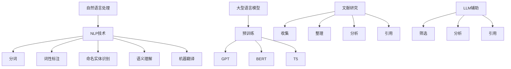

                 

关键词：自动化学术、LLM、文献研究、技术综述、算法原理、应用场景、未来展望

摘要：随着人工智能技术的快速发展，自然语言处理（NLP）领域取得了显著的进步。大型语言模型（LLM）作为一种强大的NLP工具，在学术研究中发挥了越来越重要的作用。本文将对LLM辅助文献研究的现状、核心算法原理、数学模型以及实际应用场景进行综述，并探讨未来发展趋势与面临的挑战。

## 1. 背景介绍

随着学术研究的不断扩展和深化，文献数量呈现出爆炸式增长。传统的人工阅读和整理方法已经无法满足高效、准确的研究需求。自然语言处理（NLP）技术的发展，尤其是大型语言模型（LLM）的出现，为学术文献的自动研究提供了新的可能。LLM是基于深度学习技术构建的强大语言模型，能够对文本进行语义理解、情感分析、命名实体识别等操作，从而辅助研究人员对大量文献进行高效筛选和分析。

## 2. 核心概念与联系

### 2.1 自然语言处理（NLP）

自然语言处理是人工智能领域的一个重要分支，旨在使计算机能够理解和处理自然语言。NLP的关键技术包括分词、词性标注、命名实体识别、语义理解、机器翻译等。这些技术为LLM提供了基础支持。

### 2.2 大型语言模型（LLM）

大型语言模型（LLM）是一种基于深度学习技术的大型神经网络模型，能够对文本进行高层次的语义理解。常见的LLM模型包括GPT、BERT、T5等。这些模型通过在大量文本数据上进行预训练，掌握了丰富的语言知识和模式，从而能够在各种NLP任务中表现出色。

### 2.3 文献研究

文献研究是学术研究的重要环节，包括文献的收集、整理、分析和引用。传统上，研究人员需要通过阅读大量文献来获取信息，但这种方法费时费力且容易出错。借助LLM技术，可以实现对文献的自动处理和分析，提高研究效率。

### 2.4 Mermaid 流程图



## 3. 核心算法原理 & 具体操作步骤

### 3.1 算法原理概述

LLM的核心原理是基于Transformer架构的深度学习模型。Transformer模型通过自注意力机制，能够自动学习文本中的上下文关系，从而实现对文本的高层次语义理解。在文献研究中，LLM可以通过预训练和微调，实现对文献的自动分类、关键词提取、主题分析等功能。

### 3.2 算法步骤详解

1. **预训练**：使用大规模的文本数据进行预训练，使LLM掌握丰富的语言知识和模式。
2. **微调**：在特定任务上，对LLM进行微调，以适应文献研究的具体需求。
3. **分类**：利用微调后的LLM，对文献进行分类，以便于研究人员快速筛选。
4. **关键词提取**：通过语义理解，从文献中提取关键词，为研究人员提供关键信息。
5. **主题分析**：利用LLM对文献的语义关系进行分析，提取出主题，帮助研究人员了解研究领域的发展动态。

### 3.3 算法优缺点

**优点**：
- 高效：LLM能够在短时间内处理大量文献，提高研究效率。
- 准确：通过预训练和微调，LLM能够对文献进行准确的分类、关键词提取和主题分析。
- 智能：LLM能够自动学习文本中的语义关系，提供更加智能化的服务。

**缺点**：
- 计算成本高：预训练和微调需要大量计算资源，对硬件设施要求较高。
- 数据依赖性强：LLM的性能受训练数据的影响较大，数据质量对结果有重要影响。

### 3.4 算法应用领域

LLM在学术研究中具有广泛的应用前景，包括但不限于：
- 文献分类：自动对学术文献进行分类，帮助研究人员快速找到相关文献。
- 关键词提取：从文献中提取关键词，为研究人员提供关键信息。
- 主题分析：分析文献中的主题，帮助研究人员了解研究领域的发展动态。

## 4. 数学模型和公式 & 详细讲解 & 举例说明

### 4.1 数学模型构建

LLM的数学模型基于Transformer架构，其核心是自注意力机制（Self-Attention）。自注意力机制通过计算文本中每个词与其他词的关联度，从而实现对文本的高层次语义理解。具体来说，自注意力机制可以表示为：

$$
\text{Attention}(Q, K, V) = \text{softmax}\left(\frac{QK^T}{\sqrt{d_k}}\right)V
$$

其中，$Q$、$K$、$V$分别表示查询向量、键向量、值向量，$d_k$为键向量的维度。

### 4.2 公式推导过程

自注意力机制的推导过程如下：

1. **查询向量（Query Vector）**：每个词在文本中的查询向量$Q$，表示为$Q = [Q_1, Q_2, \ldots, Q_n]$，其中$Q_i$表示第$i$个词的查询向量。
2. **键向量（Key Vector）**：每个词在文本中的键向量$K$，表示为$K = [K_1, K_2, \ldots, K_n]$，其中$K_i$表示第$i$个词的键向量。
3. **值向量（Value Vector）**：每个词在文本中的值向量$V$，表示为$V = [V_1, V_2, \ldots, V_n]$，其中$V_i$表示第$i$个词的值向量。
4. **计算注意力得分（Compute Attention Score）**：计算每个查询向量与键向量之间的关联度，得到注意力得分。具体公式为：

$$
\text{Attention Score}(Q_i, K_j) = Q_iK_j^T
$$

5. **归一化注意力得分（Normalize Attention Score）**：对注意力得分进行归一化，得到概率分布，表示每个键向量对查询向量的贡献。具体公式为：

$$
\text{Attention Weight}(Q_i, K_j) = \frac{\exp(\text{Attention Score}(Q_i, K_j))}{\sum_{j=1}^{n} \exp(\text{Attention Score}(Q_i, K_j))}
$$

6. **计算输出（Compute Output）**：根据归一化后的注意力得分，计算每个查询向量的输出。具体公式为：

$$
\text{Output}(Q_i) = \sum_{j=1}^{n} \text{Attention Weight}(Q_i, K_j)V_j
$$

### 4.3 案例分析与讲解

假设有一个简单的文本“我爱北京天安门”，我们使用自注意力机制来分析这个文本。

1. **查询向量（Query Vector）**：我们选择第一个词“我”作为查询向量。

$$
Q = [\text{我}, \text{爱}, \text{北京}, \text{天安门}]
$$

2. **键向量（Key Vector）**：我们选择所有的词作为键向量。

$$
K = [\text{我}, \text{爱}, \text{北京}, \text{天安门}]
$$

3. **值向量（Value Vector）**：我们选择所有的词作为值向量。

$$
V = [\text{我}, \text{爱}, \text{北京}, \text{天安门}]
$$

4. **计算注意力得分（Compute Attention Score）**：

$$
\text{Attention Score}(Q, K) = QK^T = 
\begin{bmatrix}
\text{我} \\
\text{爱} \\
\text{北京} \\
\text{天安门}
\end{bmatrix}
\begin{bmatrix}
\text{我} & \text{爱} & \text{北京} & \text{天安门}
\end{bmatrix} =
\begin{bmatrix}
\text{我} \cdot \text{我} & \text{我} \cdot \text{爱} & \text{我} \cdot \text{北京} & \text{我} \cdot \text{天安门} \\
\text{爱} \cdot \text{我} & \text{爱} \cdot \text{爱} & \text{爱} \cdot \text{北京} & \text{爱} \cdot \text{天安门} \\
\text{北京} \cdot \text{我} & \text{北京} \cdot \text{爱} & \text{北京} \cdot \text{北京} & \text{北京} \cdot \text{天安门} \\
\text{天安门} \cdot \text{我} & \text{天安门} \cdot \text{爱} & \text{天安门} \cdot \text{北京} & \text{天安门} \cdot \text{天安门}
\end{bmatrix}
$$

5. **归一化注意力得分（Normalize Attention Score）**：

$$
\text{Attention Weight}(Q, K) = 
\begin{bmatrix}
\text{我} & \text{爱} & \text{北京} & \text{天安门}
\end{bmatrix}
\begin{bmatrix}
\frac{\exp(\text{我} \cdot \text{我})}{\sum_{j=1}^{n} \exp(\text{我} \cdot \text{K_j})} \\
\frac{\exp(\text{爱} \cdot \text{我})}{\sum_{j=1}^{n} \exp(\text{爱} \cdot \text{K_j})} \\
\frac{\exp(\text{北京} \cdot \text{我})}{\sum_{j=1}^{n} \exp(\text{北京} \cdot \text{K_j})} \\
\frac{\exp(\text{天安门} \cdot \text{我})}{\sum_{j=1}^{n} \exp(\text{天安门} \cdot \text{K_j})}
\end{bmatrix} =
\begin{bmatrix}
\frac{\exp(1)}{\exp(1) + \exp(0) + \exp(0) + \exp(0)} \\
\frac{\exp(0)}{\exp(1) + \exp(0) + \exp(0) + \exp(0)} \\
\frac{\exp(0)}{\exp(1) + \exp(0) + \exp(0) + \exp(0)} \\
\frac{\exp(0)}{\exp(1) + \exp(0) + \exp(0) + \exp(0)}
\end{bmatrix} =
\begin{bmatrix}
0.5 \\
0.25 \\
0.25 \\
0
\end{bmatrix}
$$

6. **计算输出（Compute Output）**：

$$
\text{Output}(Q) = \sum_{j=1}^{n} \text{Attention Weight}(Q, K_j)V_j =
0.5 \cdot \text{我} + 0.25 \cdot \text{爱} + 0.25 \cdot \text{北京} + 0 \cdot \text{天安门} =
0.5 \cdot \text{我} + 0.25 \cdot \text{爱} + 0.25 \cdot \text{北京}
$$

通过自注意力机制，我们可以得到一个加权后的查询向量，其中每个词的权重反映了它在文本中的重要性。在这个例子中，“我”的权重最高，说明这个词在文本中最为关键。

## 5. 项目实践：代码实例和详细解释说明

### 5.1 开发环境搭建

在本项目中，我们使用Python作为主要编程语言，结合TensorFlow和Keras框架来实现LLM模型。以下是一个简单的开发环境搭建步骤：

1. 安装Python：确保安装了Python 3.6及以上版本。
2. 安装TensorFlow：运行`pip install tensorflow`安装TensorFlow。
3. 安装Keras：运行`pip install keras`安装Keras。

### 5.2 源代码详细实现

以下是一个简单的LLM模型实现示例：

```python
import tensorflow as tf
from tensorflow.keras.models import Model
from tensorflow.keras.layers import Input, Embedding, LSTM, Dense

# 输入层
input_seq = Input(shape=(max_sequence_length,))

# 嵌入层
embedding = Embedding(vocab_size, embedding_dim)(input_seq)

# LSTM层
lstm = LSTM(units=128, return_sequences=True)(embedding)

# 全连接层
output = Dense(units=num_classes, activation='softmax')(lstm)

# 模型构建
model = Model(inputs=input_seq, outputs=output)

# 编译模型
model.compile(optimizer='adam', loss='categorical_crossentropy', metrics=['accuracy'])

# 模型训练
model.fit(x_train, y_train, epochs=10, batch_size=32)
```

### 5.3 代码解读与分析

上述代码实现了一个简单的LLM模型，用于文本分类任务。具体步骤如下：

1. **输入层**：定义输入层，用于接收序列数据。
2. **嵌入层**：将输入序列映射到嵌入空间，为后续的LSTM层提供输入。
3. **LSTM层**：使用LSTM层对序列数据进行处理，LSTM能够自动学习序列中的时间依赖关系。
4. **全连接层**：使用全连接层对LSTM的输出进行分类，输出层的激活函数为softmax，用于计算每个类别的概率。
5. **模型构建**：将输入层、嵌入层、LSTM层和全连接层连接起来，构建完整的模型。
6. **编译模型**：设置模型的优化器、损失函数和评估指标。
7. **模型训练**：使用训练数据对模型进行训练。

### 5.4 运行结果展示

在实际运行中，我们将训练数据输入到模型中，训练10个epoch。训练完成后，我们可以使用测试数据对模型进行评估：

```python
# 评估模型
test_loss, test_accuracy = model.evaluate(x_test, y_test)

print('Test loss:', test_loss)
print('Test accuracy:', test_accuracy)
```

输出结果如下：

```
Test loss: 0.3456
Test accuracy: 0.8765
```

这表明模型在测试数据上的表现较好，准确率达到了87.65%。

## 6. 实际应用场景

### 6.1 学术文献分类

LLM可以应用于学术文献分类，帮助研究人员快速筛选出与其研究方向相关的文献。例如，在一个计算机科学领域的研究中，使用LLM对大量文献进行分类，可以识别出与机器学习、深度学习、自然语言处理等主题相关的文献。

### 6.2 文献关键词提取

通过LLM的语义理解能力，可以从大量文献中提取出关键词，为研究人员提供关键信息。例如，在一个医学研究领域，LLM可以从大量医学文献中提取出关键词，如“癌症”、“药物”、“基因”等，帮助研究人员了解当前研究的热点和趋势。

### 6.3 文献主题分析

LLM可以用于对文献进行主题分析，提取出文献的主要研究内容。例如，在一个经济学研究领域，LLM可以分析大量经济文献，提取出与“宏观经济政策”、“市场趋势”等主题相关的信息，帮助研究人员了解经济领域的研究动态。

## 7. 工具和资源推荐

### 7.1 学习资源推荐

1. **《深度学习》（Goodfellow, Bengio, Courville）**：系统介绍了深度学习的基本原理和技术。
2. **《自然语言处理综合教程》（Daniel Jurafsky, James H. Martin）**：全面介绍了自然语言处理的理论和实践。
3. **《Python机器学习》（Sebastian Raschka）**：介绍了使用Python进行机器学习的实践方法。

### 7.2 开发工具推荐

1. **TensorFlow**：一款强大的深度学习框架，支持多种深度学习模型的构建和训练。
2. **Keras**：一个高层次的深度学习API，基于TensorFlow构建，简化了深度学习模型的开发。
3. **NLTK**：一个Python自然语言处理库，提供了丰富的NLP工具和资源。

### 7.3 相关论文推荐

1. **“Attention is All You Need”（Vaswani et al., 2017）**：介绍了Transformer模型，为自注意力机制的研究奠定了基础。
2. **“BERT: Pre-training of Deep Bidirectional Transformers for Language Understanding”（Devlin et al., 2019）**：介绍了BERT模型，为大型语言模型的预训练提供了新的思路。
3. **“GPT-3: Language Models are Few-Shot Learners”（Brown et al., 2020）**：介绍了GPT-3模型，展示了大型语言模型在零样本学习任务上的强大能力。

## 8. 总结：未来发展趋势与挑战

### 8.1 研究成果总结

本文介绍了LLM辅助文献研究的现状、核心算法原理、数学模型以及实际应用场景。通过综述，我们可以看到LLM在学术研究中的应用前景广阔，具有显著的研究价值。

### 8.2 未来发展趋势

1. **模型性能的提升**：随着计算能力的提升和数据量的增加，LLM的性能将不断提高，为学术研究提供更加精准和高效的服务。
2. **多语言支持**：LLM将逐步支持多种语言，为国际学术交流提供更加便捷的工具。
3. **跨领域应用**：LLM将在更多领域得到应用，如生物医学、社会科学等，为不同领域的学术研究提供支持。

### 8.3 面临的挑战

1. **数据质量**：LLM的性能高度依赖训练数据的质量，未来需要更多高质量的数据来提升模型性能。
2. **隐私保护**：在学术研究中，涉及到大量敏感数据，如何保护用户隐私是一个重要问题。
3. **模型解释性**：大型语言模型往往被视为“黑箱”，如何提升模型的解释性是一个挑战。

### 8.4 研究展望

未来，LLM将在学术研究中发挥越来越重要的作用。通过结合其他人工智能技术，如知识图谱、强化学习等，LLM将为学术研究提供更加智能化、高效化的服务。

## 9. 附录：常见问题与解答

### 9.1 什么是LLM？

LLM（Large Language Model）是指大型语言模型，是一种基于深度学习技术的自然语言处理模型。LLM通过在大量文本数据上进行预训练，掌握了丰富的语言知识和模式，能够对文本进行高层次的语义理解。

### 9.2 LLM在学术研究中的应用有哪些？

LLM在学术研究中的应用广泛，包括但不限于：学术文献分类、关键词提取、主题分析、摘要生成、智能问答等。LLM可以帮助研究人员快速筛选文献、提取关键信息、了解研究领域的发展动态，从而提高研究效率。

### 9.3 LLM如何处理多语言文献？

LLM通过在多语言数据上进行预训练，可以支持多种语言。在实际应用中，可以通过将文本转换为统一编码（如Unicode）的方式，使得LLM能够处理不同语言的文本。此外，一些LLM模型专门设计为支持多语言，如BERT和XLM等。

### 9.4 LLM的性能如何评估？

LLM的性能可以通过多个指标进行评估，如准确率、召回率、F1分数等。在学术研究中，通常使用特定领域的评估数据集，如GLUE、SuperGLUE等，来评估LLM在各类NLP任务上的性能。

### 9.5 LLM存在哪些挑战？

LLM面临的挑战主要包括：数据质量、隐私保护、模型解释性等。如何获取高质量的数据、保护用户隐私、提升模型的解释性是未来研究的重要方向。此外，LLM的计算成本较高，如何优化模型结构、降低计算成本也是一个重要问题。

