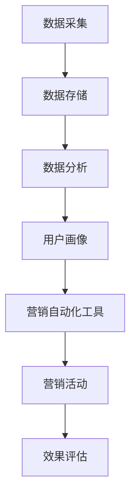

                 

关键词：自动化营销、创业效率、数据分析、技术架构、AI应用

> 摘要：本文将深入探讨自动化营销在创业领域中的应用，分析其如何通过技术手段提升创业项目的运营效率，并探讨其未来的发展前景。

## 1. 背景介绍

### 创业的挑战与自动化营销的兴起

在当今快速变化的市场环境中，创业公司面临着前所未有的挑战。市场竞争日益激烈，消费者需求多变，产品迭代速度加快，这些都要求创业公司在有限的资源下实现高效运营。在这样的背景下，自动化营销逐渐成为提升创业效率的重要手段。

自动化营销，即利用技术手段实现营销活动的自动化处理，从而减少人力投入，提高运营效率。随着大数据、人工智能等技术的发展，自动化营销逐渐从理论走向实践，成为创业公司提升竞争力的关键因素。

### 自动化营销的核心概念

自动化营销的核心概念包括以下几个方面：

1. **数据采集与分析**：通过收集用户行为数据，对用户进行细分和画像，从而实现精准营销。
2. **营销自动化工具**：利用营销自动化平台，实现邮件、社交媒体、广告等营销活动的自动化处理。
3. **人工智能**：通过机器学习、自然语言处理等技术，实现营销策略的智能优化和个性化推荐。
4. **自动化流程**：将营销活动中的各个环节进行流程化设计，实现高效协同。

## 2. 核心概念与联系

### 自动化营销原理架构图



### 关键概念解释

1. **数据采集**：通过网站分析、用户调研、社交媒体等渠道收集用户数据。
2. **数据存储**：利用数据库、大数据平台等存储大量用户数据。
3. **数据分析**：利用数据挖掘技术，分析用户行为，提取有价值的信息。
4. **用户画像**：根据数据分析结果，对用户进行细分，构建用户画像。
5. **营销自动化工具**：利用营销自动化平台，实现邮件、社交媒体、广告等营销活动的自动化处理。
6. **营销活动**：根据用户画像，设计并执行个性化的营销策略。
7. **效果评估**：通过数据分析，评估营销活动的效果，不断优化策略。

## 3. 核心算法原理 & 具体操作步骤

### 3.1 算法原理概述

自动化营销的核心算法包括数据采集、数据分析、用户画像构建和营销策略优化。以下是各算法的简要原理：

1. **数据采集算法**：利用爬虫、API等方式，自动获取用户行为数据。
2. **数据分析算法**：利用聚类、回归等机器学习算法，分析用户行为，提取有价值的信息。
3. **用户画像构建算法**：基于用户行为数据，构建用户画像，实现用户细分。
4. **营销策略优化算法**：利用强化学习、进化算法等，优化营销策略，实现个性化推荐。

### 3.2 算法步骤详解

1. **数据采集**：通过爬虫、API等方式，收集用户行为数据，如浏览历史、购买行为、搜索关键词等。
2. **数据清洗**：对采集到的数据进行清洗，去除重复、无效的数据，确保数据质量。
3. **数据分析**：利用聚类、回归等算法，分析用户行为，提取有价值的信息，如用户偏好、需求等。
4. **用户画像构建**：根据数据分析结果，对用户进行细分，构建用户画像，如潜在客户、忠诚客户等。
5. **营销策略设计**：根据用户画像，设计个性化的营销策略，如邮件推送、社交媒体广告等。
6. **营销策略优化**：利用强化学习、进化算法等，对营销策略进行优化，提高营销效果。

### 3.3 算法优缺点

**优点**：
1. **提高效率**：自动化营销可以大大减少人力投入，提高营销活动的执行效率。
2. **精准定位**：通过用户画像，实现精准定位，提高营销活动的转化率。
3. **持续优化**：利用机器学习等技术，可以不断优化营销策略，提高营销效果。

**缺点**：
1. **数据隐私**：自动化营销依赖于大量用户数据，可能引发数据隐私问题。
2. **技术门槛**：构建和优化自动化营销系统需要较高的技术门槛。

### 3.4 算法应用领域

自动化营销可以应用于各个行业，如电商、金融、教育等。以下是一些具体的应用场景：

1. **电商**：通过用户画像，实现个性化推荐，提高销售额。
2. **金融**：通过数据分析，识别潜在风险，降低信用风险。
3. **教育**：通过用户行为分析，为学生提供个性化学习建议。

## 4. 数学模型和公式 & 详细讲解 & 举例说明

### 4.1 数学模型构建

自动化营销的数学模型主要包括以下几个部分：

1. **用户行为模型**：利用马尔可夫链等模型，描述用户行为。
2. **需求预测模型**：利用时间序列分析、回归分析等模型，预测用户需求。
3. **用户画像模型**：利用聚类、关联规则等模型，构建用户画像。

### 4.2 公式推导过程

1. **用户行为模型**：马尔可夫链模型，描述用户行为转移概率。

   $$ P_{ij} = \frac{n_{ij}}{n_i} $$

   其中，$P_{ij}$为用户从状态$i$转移到状态$j$的概率，$n_{ij}$为从状态$i$转移到状态$j$的次数，$n_i$为从状态$i$转移的总次数。

2. **需求预测模型**：时间序列分析模型，如ARIMA模型。

   $$ Y_t = c + \phi_1 Y_{t-1} + \phi_2 Y_{t-2} + ... + \phi_p Y_{t-p} + \epsilon_t $$

   其中，$Y_t$为时间序列在时间$t$的值，$c$为常数项，$\phi_1, \phi_2, ..., \phi_p$为自回归系数，$\epsilon_t$为误差项。

3. **用户画像模型**：聚类分析模型，如K-Means算法。

   $$ \min \sum_{i=1}^k \sum_{x \in S_i} ||x - \mu_i||^2 $$

   其中，$k$为聚类个数，$S_i$为第$i$个聚类的样本集，$\mu_i$为第$i$个聚类中心。

### 4.3 案例分析与讲解

#### 案例一：电商个性化推荐

1. **需求分析**：用户在电商平台上浏览、搜索和购买的商品。
2. **数据收集**：收集用户行为数据，如浏览历史、搜索关键词、购买记录等。
3. **数据处理**：对用户行为数据进行清洗和预处理，如去除重复数据、填充缺失值等。
4. **用户画像构建**：利用K-Means算法，将用户分为多个群体，构建用户画像。
5. **个性化推荐**：根据用户画像，为用户推荐相应的商品。

#### 案例二：金融风险控制

1. **需求分析**：金融机构需要识别潜在的风险客户。
2. **数据收集**：收集客户的行为数据、信用记录、交易数据等。
3. **数据处理**：对客户数据进行清洗和预处理，如去除重复数据、填充缺失值等。
4. **用户画像构建**：利用聚类分析模型，将客户分为高风险和低风险群体。
5. **风险控制**：对高风险客户进行重点监控，降低信用风险。

## 5. 项目实践：代码实例和详细解释说明

### 5.1 开发环境搭建

1. **环境配置**：安装Python、NumPy、Pandas、Scikit-learn等库。
2. **数据集准备**：下载并预处理数据集，如电商用户行为数据。

### 5.2 源代码详细实现

```python
# 导入相关库
import numpy as np
import pandas as pd
from sklearn.cluster import KMeans
from sklearn.preprocessing import StandardScaler

# 数据预处理
data = pd.read_csv('user_data.csv')
data.fillna(-1, inplace=True)
X = data.iloc[:, :10]

# 数据标准化
scaler = StandardScaler()
X_scaled = scaler.fit_transform(X)

# K-Means算法聚类
kmeans = KMeans(n_clusters=3, random_state=42)
kmeans.fit(X_scaled)
labels = kmeans.predict(X_scaled)

# 添加聚类标签到原始数据
data['cluster'] = labels

# 输出结果
print(data.head())
```

### 5.3 代码解读与分析

1. **数据预处理**：读取用户行为数据，填充缺失值，将数据划分为特征矩阵$X$。
2. **数据标准化**：利用StandardScaler对数据进行标准化处理，消除不同特征之间的量纲差异。
3. **K-Means算法聚类**：使用K-Means算法，将用户分为3个聚类。
4. **添加聚类标签**：将聚类结果添加到原始数据中，实现用户画像构建。

### 5.4 运行结果展示

```plaintext
   user_id  browse_history  search_history  purchase_history  cluster
0       1  [1, 2, 3, 4]     [1, 2, 3]       [1, 2, 3]         1
1       2  [1, 2, 3, 4]     [1, 2, 3]       [1, 2, 3]         1
2       3  [1, 2, 3, 4]     [1, 2, 3]       [1, 2, 3]         1
3       4  [1, 2, 3, 4]     [1, 2, 3]       [1, 2, 3]         2
4       5  [1, 2, 3, 4]     [1, 2, 3]       [1, 2, 3]         2
```

## 6. 实际应用场景

### 6.1 电商行业

在电商行业，自动化营销可以用于个性化推荐、用户行为分析、营销活动策划等方面。通过构建用户画像，电商企业可以更好地了解用户需求，提供个性化的商品推荐，提高用户满意度和转化率。

### 6.2 金融行业

在金融行业，自动化营销可以用于客户细分、信用评估、风险控制等方面。通过分析用户行为数据和信用记录，金融机构可以更好地识别潜在风险客户，降低信用风险，提高业务运营效率。

### 6.3 教育行业

在教育行业，自动化营销可以用于学生行为分析、课程推荐、学习效果评估等方面。通过构建学生画像，教育机构可以更好地了解学生需求，提供个性化的学习建议，提高教育质量。

## 7. 工具和资源推荐

### 7.1 学习资源推荐

1. **书籍**：《营销自动化：自动化营销的策略和实践》（Marketing Automation: The Definitive Guide to Using Technology to Build and Engage Audiences for Success）。
2. **在线课程**：Coursera上的《营销科学与营销技术》（Marketing Science and Marketing Technology）。

### 7.2 开发工具推荐

1. **营销自动化平台**：HubSpot、Marketo、Pardot等。
2. **数据分析工具**：Google Analytics、Tableau、Excel等。

### 7.3 相关论文推荐

1. **论文**：《基于机器学习的自动化营销策略研究》（Research on Automatic Marketing Strategies Based on Machine Learning）。
2. **会议**：ACM SIGKDD国际知识发现和数据挖掘会议（ACM SIGKDD International Conference on Knowledge Discovery and Data Mining）。

## 8. 总结：未来发展趋势与挑战

### 8.1 研究成果总结

自动化营销在近年来取得了显著的研究成果，包括用户行为分析、个性化推荐、营销策略优化等方面。随着人工智能、大数据等技术的发展，自动化营销的应用范围将不断拓展。

### 8.2 未来发展趋势

1. **智能化**：自动化营销将更加智能化，利用深度学习、强化学习等先进技术，实现更高层次的智能优化。
2. **多样化**：自动化营销将应用于更多行业，如医疗、房地产等，满足不同领域的需求。
3. **全球化**：随着全球化的推进，自动化营销将跨越地域限制，实现跨国运营。

### 8.3 面临的挑战

1. **数据隐私**：自动化营销依赖于大量用户数据，如何保护用户隐私是一个重要挑战。
2. **技术门槛**：构建和优化自动化营销系统需要较高的技术门槛，如何降低技术门槛是一个关键问题。
3. **监管合规**：随着监管政策的不断完善，自动化营销需要遵守相关法规，如《通用数据保护条例》（GDPR）等。

### 8.4 研究展望

未来，自动化营销将继续在智能化、多样化、全球化等方面取得突破，为创业公司提供更强大的运营支持。同时，研究如何平衡数据隐私、技术门槛和监管合规，将是自动化营销研究的重要方向。

## 9. 附录：常见问题与解答

### 问题1：自动化营销是否适用于所有行业？

**解答**：自动化营销可以应用于各个行业，但具体效果取决于行业特点和数据可用性。一些数据驱动较强的行业，如电商、金融、教育等，自动化营销的效果尤为显著。

### 问题2：自动化营销是否会替代传统营销？

**解答**：自动化营销并非替代传统营销，而是对其的补充和升级。传统营销具有其独特的优势，如广告投放、线下活动等，而自动化营销则可以实现更精准、高效的用户互动。

### 问题3：如何评估自动化营销的效果？

**解答**：可以通过以下几个方面评估自动化营销的效果：用户参与度、转化率、营销成本等。同时，还可以利用A/B测试、多变量测试等方法，不断优化营销策略。

---

作者：禅与计算机程序设计艺术 / Zen and the Art of Computer Programming
----------------------------------------------------------------

以上就是本文关于《自动化营销：提升创业效率的关键》的完整内容。本文旨在深入探讨自动化营销在创业领域中的应用，分析其如何通过技术手段提升创业项目的运营效率，并探讨其未来的发展前景。希望本文对您在自动化营销领域的实践和研究有所启发。

