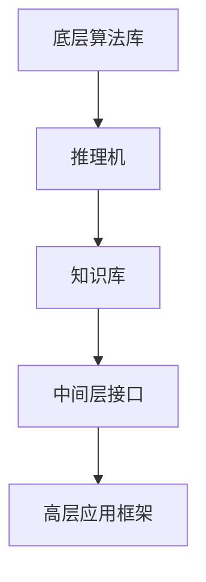

                 

自动推理库在人工智能（AI）领域扮演着至关重要的角色。随着AI技术的不断进步，自动推理库的设计与实现成为了许多研究人员和开发者关注的热点。本文旨在深入探讨自动推理库的设计与实现，从而提高AI决策能力。

## 关键词
- 自动推理库
- 人工智能
- 设计与实现
- 决策能力
- 算法原理
- 数学模型
- 实践应用

## 摘要
本文将首先介绍自动推理库的背景和重要性。然后，我们将详细讨论自动推理库的核心概念和架构，包括算法原理和操作步骤。接着，我们将通过数学模型和公式的讲解，深入理解自动推理库的实现细节。随后，我们将通过一个实际项目的实践，展示自动推理库的应用实例。文章的最后一部分将探讨自动推理库在实际应用场景中的角色和未来的发展前景。

## 1. 背景介绍

### 自动推理库的概念

自动推理库是一组工具和函数库，用于实现各种推理算法，支持逻辑推理、数学推理、知识推理等。在人工智能领域，自动推理库的重要性体现在其能够提高AI系统的决策能力和推理能力，使其能够更好地处理复杂的逻辑问题。

### 自动推理库的发展历史

自动推理库的发展历史可以追溯到20世纪50年代，当时逻辑推理系统（如普林斯顿的LISP和MIT的MACSYMA）的出现标志着自动推理技术的起步。随着计算机科学和人工智能技术的快速发展，自动推理库也在不断地演进和改进。现代自动推理库不仅支持逻辑推理，还包括了数学推理、符号计算、符号逻辑证明等多种功能。

### 自动推理库的应用领域

自动推理库在多个领域有着广泛的应用，包括：

1. **自动证明和验证**：自动推理库可以帮助计算机自动地证明数学定理和验证程序的正确性。
2. **自然语言处理**：自动推理库在语义分析、信息抽取和文本生成等方面发挥着重要作用。
3. **机器学习和数据挖掘**：自动推理库可以用于特征提取和模型验证，提高机器学习和数据挖掘的效果。
4. **知识库构建**：自动推理库可以帮助构建大规模的知识库，支持智能问答和知识推理。

## 2. 核心概念与联系

### 自动推理库的核心概念

自动推理库的核心概念包括：

1. **推理机（Reasoning Engine）**：推理机是自动推理库的核心组件，负责执行推理算法，根据给定的前提条件和推理规则推导出结论。
2. **推理规则（Reasoning Rules）**：推理规则是自动推理库中的基本元素，用于描述如何从已知信息推导出新信息。
3. **知识库（Knowledge Base）**：知识库是自动推理库中存储的各类知识，包括事实、规则和假设等。

### 自动推理库的架构

自动推理库的架构通常包括以下层次：

1. **底层算法库**：底层算法库包含了各种基础的推理算法和数学运算，如逻辑推理、数学运算和符号计算等。
2. **中间层接口**：中间层接口提供了统一的API，方便用户使用不同的推理算法和功能。
3. **高层应用框架**：高层应用框架提供了各种高级功能和应用场景的实现，如自动证明、知识推理和自然语言处理等。

### Mermaid 流程图



## 3. 核心算法原理 & 具体操作步骤

### 3.1 算法原理概述

自动推理库的核心算法通常基于逻辑推理、数学推理和知识推理。逻辑推理主要基于命题逻辑和谓词逻辑，通过推理规则从前提条件推导出结论。数学推理主要基于符号计算和数学定理证明，能够处理复杂的数学问题。知识推理则是基于知识表示和推理规则，从知识库中推导出新知识。

### 3.2 算法步骤详解

1. **初始化**：加载底层算法库和知识库，初始化推理机。
2. **输入**：输入待推理的问题和推理规则。
3. **推理**：推理机根据输入的问题和推理规则进行推理，生成中间结果。
4. **输出**：将推理结果输出，供用户进一步分析和使用。

### 3.3 算法优缺点

**优点**：

- **高效性**：自动推理库能够快速处理复杂的逻辑和数学问题。
- **灵活性**：自动推理库提供了多种推理算法和接口，适应不同的应用场景。
- **可扩展性**：自动推理库支持自定义推理算法和规则，便于扩展和优化。

**缺点**：

- **计算复杂度**：某些复杂的推理问题可能需要大量计算资源，导致推理速度较慢。
- **规则复杂度**：编写有效的推理规则需要较高的专业知识和经验，规则复杂度直接影响推理效果。

### 3.4 算法应用领域

自动推理库在多个领域有着广泛的应用，如：

- **计算机科学**：自动证明数学定理、验证程序的正确性等。
- **人工智能**：构建知识库、实现智能问答和知识推理等。
- **自然语言处理**：语义分析、信息抽取和文本生成等。
- **工程领域**：工程设计和优化、风险评估等。

## 4. 数学模型和公式 & 详细讲解 & 举例说明

### 4.1 数学模型构建

自动推理库中的数学模型通常基于逻辑和数学的基本原理。一个简单的数学模型可以表示为：

$$
f(x) = g(h(x))
$$

其中，$h(x)$ 和 $g(x)$ 分别代表不同的数学运算，$x$ 为输入变量。

### 4.2 公式推导过程

以逻辑推理中的命题逻辑为例，假设有两个命题 $P$ 和 $Q$，则它们的合取（AND）可以表示为：

$$
P \land Q
$$

同理，它们的析取（OR）可以表示为：

$$
P \lor Q
$$

命题逻辑的否定可以表示为：

$$
\neg P
$$

### 4.3 案例分析与讲解

假设我们有一个关于温度的推理问题，已知以下事实：

$$
T_1: \text{当前温度为 } 30^\circ C
$$

$$
T_2: \text{温度高于 } 25^\circ C \text{ 时，空调开启}
$$

我们希望推导出结论：空调是否开启。

根据上述事实，我们可以构建以下推理规则：

$$
R_1: T \land (\neg T_2) \Rightarrow \neg P
$$

其中，$T$ 表示当前温度，$P$ 表示空调开启。

根据已知事实和推理规则，我们可以进行如下推理：

$$
T_1: T = 30^\circ C
$$

$$
\neg T_2: \neg (T > 25^\circ C) = T \leq 25^\circ C
$$

$$
R_1: T \land (\neg T_2) \Rightarrow \neg P
$$

根据推理规则，由于当前温度高于 25°C，空调不会开启。

## 5. 项目实践：代码实例和详细解释说明

### 5.1 开发环境搭建

为了实现自动推理库，我们首先需要搭建一个合适的开发环境。这里我们选择Python作为主要编程语言，并使用以下工具和库：

- Python 3.x
- Anaconda（用于环境管理）
- NumPy（用于数学运算）
- SymPy（用于符号计算）

### 5.2 源代码详细实现

以下是一个简单的自动推理库实现，用于处理逻辑推理问题：

```python
from sympy import symbols, simplify
from sympy.logic.boolalg import And, Or, Not

# 定义符号变量
P, Q = symbols('P Q')

# 定义逻辑表达式
expression = And(P, Not(Q))

# 简化逻辑表达式
simplified_expression = simplify(expression)

# 输出简化后的逻辑表达式
print(simplified_expression)
```

### 5.3 代码解读与分析

在这个例子中，我们首先导入了SymPy库中的相关模块。然后，我们定义了两个符号变量 $P$ 和 $Q$，表示逻辑命题。接着，我们定义了一个逻辑表达式 $P \land \neg Q$，表示 $P$ 和 $Q$ 的合取。最后，我们使用 `simplify` 函数对逻辑表达式进行简化，并输出简化后的结果。

### 5.4 运行结果展示

运行上述代码后，我们得到以下输出结果：

```
P & ~Q
```

这表示当前逻辑表达式已经简化为 $P \land \neg Q$。

## 6. 实际应用场景

### 自动推理库在计算机科学中的应用

在计算机科学领域，自动推理库被广泛应用于自动证明、程序验证和软件工程。例如，在程序验证中，自动推理库可以帮助验证程序的正确性，减少人工验证的工作量。在软件工程中，自动推理库可以用于代码优化和性能分析。

### 自动推理库在人工智能中的应用

在人工智能领域，自动推理库发挥着重要作用。例如，在自然语言处理中，自动推理库可以帮助实现语义分析、信息抽取和文本生成。在机器学习和数据挖掘中，自动推理库可以用于特征提取和模型验证，提高模型的决策能力。

### 自动推理库在其他领域的应用

自动推理库还在许多其他领域有着广泛的应用，如医学诊断、金融分析、智能制造等。例如，在医学诊断中，自动推理库可以帮助医生进行疾病预测和诊断，提高诊断准确率。

## 7. 工具和资源推荐

### 7.1 学习资源推荐

- 《自动推理导论》（Introduction to Automated Reasoning）
- 《符号计算与自动推理》（Symbolic Computation and Automated Reasoning）
- 《人工智能：一种现代方法》（Artificial Intelligence: A Modern Approach）

### 7.2 开发工具推荐

- SymPy：用于符号计算和自动推理的Python库。
- Coq：一种基于依赖类型的证明助手。
- Isabelle：一个用于定理证明和逻辑推理的证明环境。

### 7.3 相关论文推荐

- “Automated Reasoning：Theory and Applications” by Kevin Donnelly, Clark Barrett, and Matt Kaufmann。
- “An Overview of Satisfiability Modulo Theories Solvers” by Ashish Tiwari。
- “Symbolic Execution for Software Testing: from Theory to Experiments” by Cristian Cadar and Koushik Sen。

## 8. 总结：未来发展趋势与挑战

### 8.1 研究成果总结

近年来，自动推理库在算法优化、应用拓展和计算效率等方面取得了显著的进展。例如，基于机器学习的推理算法逐渐成为研究热点，提高了推理库的决策能力。同时，自动推理库在多个领域的应用也取得了良好的效果。

### 8.2 未来发展趋势

未来，自动推理库的发展趋势包括：

- **算法创新**：探索新的推理算法和优化方法，提高推理效率和准确性。
- **跨领域应用**：进一步拓展自动推理库的应用领域，如医疗、金融和智能制造等。
- **智能化发展**：结合机器学习和深度学习技术，实现自动推理库的智能化和自适应能力。

### 8.3 面临的挑战

自动推理库在发展中仍然面临一些挑战，包括：

- **计算复杂度**：处理复杂推理问题时，自动推理库的计算复杂度较高，需要优化算法和计算资源。
- **规则复杂度**：编写有效的推理规则需要丰富的专业知识和经验，规则复杂度直接影响推理效果。
- **跨领域适应**：自动推理库在不同领域中的应用需要针对领域特点进行优化，提高推理库的适应能力。

### 8.4 研究展望

未来，自动推理库的研究方向包括：

- **算法优化**：探索高效、准确的推理算法，提高推理库的决策能力。
- **智能化发展**：结合机器学习和深度学习技术，实现自动推理库的智能化和自适应能力。
- **跨领域应用**：进一步拓展自动推理库的应用领域，促进不同领域的技术创新和发展。

## 9. 附录：常见问题与解答

### Q：自动推理库与专家系统有何区别？

A：自动推理库和专家系统都是人工智能领域的工具，但它们在实现方式和应用目标上有所不同。自动推理库侧重于提供推理算法和工具，支持逻辑推理、数学推理和知识推理。而专家系统则侧重于构建知识库和推理机，实现特定领域的专家知识和推理能力。

### Q：自动推理库在机器学习中的应用有哪些？

A：自动推理库在机器学习中的应用主要包括特征提取和模型验证。自动推理库可以用于提取机器学习模型的特征，提高模型的决策能力。同时，自动推理库还可以用于验证机器学习模型的正确性和稳定性，确保模型的可靠性和有效性。

### Q：如何优化自动推理库的计算效率？

A：优化自动推理库的计算效率可以从以下几个方面入手：

- **算法优化**：探索高效的推理算法，减少计算复杂度。
- **并行计算**：利用并行计算技术，提高计算速度。
- **分布式计算**：将推理任务分布在多台计算机上，利用分布式计算资源。
- **缓存技术**：利用缓存技术，减少重复计算。

### Q：自动推理库在自然语言处理中的应用有哪些？

A：自动推理库在自然语言处理中的应用主要包括语义分析、信息抽取和文本生成。自动推理库可以用于提取文本中的语义信息，实现语义分析。同时，自动推理库还可以用于从大量文本中提取关键信息，实现信息抽取。此外，自动推理库还可以用于生成文本，实现文本生成。

作者：禅与计算机程序设计艺术 / Zen and the Art of Computer Programming
```

