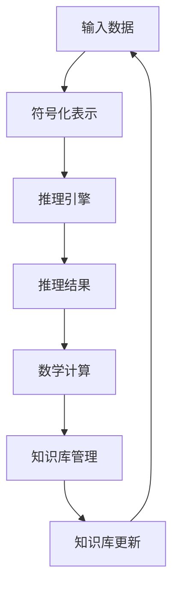

                 

### 关键词 Keywords
- 自动推理库
- 人工智能
- 算法优化
- 软件工程
- 推理过程
- 数学模型
- 项目实践
- 工具资源

<|assistant|>### 摘要 Abstract
本文深入探讨了自动推理库在现代人工智能（AI）发展中的应用及其重要性。通过介绍自动推理库的核心概念、原理和架构，详细阐述了其算法设计、数学模型构建及其在不同领域的实际应用。文章还通过一个具体的代码实例，展示了自动推理库的开发过程和运行结果。最后，本文对自动推理库的未来发展趋势和面临的挑战进行了展望，并推荐了相关的学习资源和开发工具。

## 1. 背景介绍

自动推理库（Automatic Reasoning Library，简称ARL）是人工智能领域的一个重要组成部分，它旨在为开发者提供高效、可扩展的推理工具，从而简化AI应用的实现过程。自动推理库的出现，填补了传统人工智能算法与实际应用之间的鸿沟，使得AI技术能够更加贴近现实需求。

随着大数据和云计算技术的飞速发展，AI在各个行业中的应用越来越广泛。然而，AI的落地并非易事，需要处理的数据量和复杂性不断增加，这给算法设计和实现带来了巨大的挑战。自动推理库作为一种工具，能够显著降低AI应用开发的难度，提高开发效率和系统性能。

自动推理库的核心价值在于其自动化推理能力。通过内置的推理引擎，自动推理库能够自动推导出数据之间的关系，从而实现智能决策。这不仅减轻了开发者的负担，还提高了系统的智能化水平。

### 自动推理库的定义

自动推理库是一种软件库，它包含了自动化推理的相关算法和数据结构。这些算法和数据结构主要用于处理符号数据，进行逻辑推理和数学计算。自动推理库的核心功能包括：

1. **符号化表示**：自动将输入数据转换为符号表示形式，便于进行逻辑推理和数学计算。
2. **推理引擎**：使用内置的推理算法，自动推导出数据之间的关系和结论。
3. **数学计算**：提供高效的数学计算功能，如线性代数运算、微积分等。
4. **知识库管理**：支持知识库的构建和维护，便于系统学习和进化。

### 自动推理库的历史与发展

自动推理库的发展可以追溯到20世纪50年代，随着计算机科学和人工智能的兴起，自动推理技术开始受到关注。早期的自动推理系统主要集中在逻辑和数学领域，如定理证明、数学计算等。随着计算能力的提升和算法的进步，自动推理技术逐渐扩展到更多的应用领域。

在20世纪80年代，第一代自动推理系统开始出现，如Prolog和Lambda calculus等。这些系统为后来的自动推理库奠定了基础。随着互联网和大数据技术的发展，自动推理库逐渐走向实用化，被广泛应用于自然语言处理、计算机视觉、自动化测试等领域。

### 自动推理库的应用领域

自动推理库的应用领域非常广泛，涵盖了多个行业和领域。以下是几个典型的应用场景：

1. **自然语言处理**：自动推理库可以用于语义分析、情感分析、机器翻译等任务，帮助系统更好地理解用户意图和文本内容。
2. **计算机视觉**：自动推理库可以用于图像分类、目标检测、图像分割等任务，提高计算机视觉系统的智能化水平。
3. **自动化测试**：自动推理库可以用于测试用例生成、测试执行和测试报告，提高软件测试的自动化程度。
4. **人工智能助手**：自动推理库可以用于构建智能客服、智能顾问等人工智能助手，提高用户交互的智能化水平。
5. **医疗健康**：自动推理库可以用于疾病诊断、治疗方案推荐等，为医疗健康领域提供智能支持。

### 自动推理库的优势与挑战

自动推理库的优势在于其自动化推理能力和高效性能。通过自动化推理，自动推理库能够快速处理大量数据，进行复杂计算，从而提高系统的智能化水平。此外，自动推理库通常具有良好的扩展性和可定制性，能够适应不同的应用场景。

然而，自动推理库也面临着一些挑战。首先，自动推理算法的复杂性和计算量较大，需要高效的硬件支持。其次，自动推理库的构建和维护需要专业的技术和经验，对开发者的要求较高。此外，自动推理库的性能和准确性仍需进一步提高，以满足日益复杂的AI应用需求。

## 2. 核心概念与联系

自动推理库的核心概念主要包括符号化表示、推理引擎、数学计算和知识库管理。这些概念相互关联，共同构成了自动推理库的基础架构。

### 符号化表示

符号化表示是将输入数据转换为符号表示形式的过程。在自动推理库中，符号化表示是非常重要的，因为逻辑推理和数学计算通常依赖于符号操作。符号化表示可以简化数据处理的复杂性，使得自动推理库能够高效地进行推理和计算。

### 推理引擎

推理引擎是自动推理库的核心组件，负责根据符号化表示的数据进行逻辑推理和推导。推理引擎通常采用基于规则的方法，通过匹配和推导规则，实现数据之间的关系推理。推理引擎的性能直接影响自动推理库的推理速度和准确性。

### 数学计算

数学计算是自动推理库的重要组成部分，提供了多种数学运算和计算功能。数学计算可以用于数据预处理、特征提取、模型训练等任务。自动推理库通常内置了高效的数学计算库，如线性代数库、微积分库等，以支持复杂的数学运算。

### 知识库管理

知识库管理是自动推理库的重要功能之一，负责构建、存储和维护知识库。知识库是自动推理库进行推理和决策的基础，包含了大量的领域知识和规则。知识库管理支持知识库的动态更新和进化，使得自动推理库能够适应不同的应用场景。

### Mermaid 流程图

下面是一个简化的自动推理库架构的Mermaid流程图：



在上述流程图中，输入数据经过符号化表示后，由推理引擎进行处理，得到推理结果。推理结果再经过数学计算，更新知识库，形成一个闭环。这个过程展示了自动推理库的基本工作流程。

## 3. 核心算法原理 & 具体操作步骤

### 3.1 算法原理概述

自动推理库的核心算法主要基于逻辑推理和数学计算。逻辑推理用于处理符号数据，推导出数据之间的关系和结论。数学计算则用于对数据进行预处理、特征提取和模型训练等任务。

### 3.2 算法步骤详解

#### 3.2.1 符号化表示

符号化表示是将输入数据转换为符号表示形式的过程。具体步骤如下：

1. **数据预处理**：对输入数据进行预处理，如去除空格、标点符号等。
2. **词法分析**：将预处理后的数据分解为单词或符号。
3. **语法分析**：对词法分析结果进行语法分析，构建语法树。
4. **符号化**：将语法树转换为符号表示形式，如符号表达式、逻辑公式等。

#### 3.2.2 推理引擎

推理引擎用于根据符号化表示的数据进行逻辑推理和推导。具体步骤如下：

1. **规则匹配**：根据内置的规则库，对符号化表示的数据进行规则匹配。
2. **推导**：根据匹配的规则，推导出新的数据关系和结论。
3. **缓存管理**：对推导过程中的中间结果进行缓存，提高推理速度。

#### 3.2.3 数学计算

数学计算用于对数据进行预处理、特征提取和模型训练等任务。具体步骤如下：

1. **数据预处理**：对输入数据进行预处理，如归一化、标准化等。
2. **特征提取**：根据数学模型，从预处理后的数据中提取特征。
3. **模型训练**：使用训练数据，通过数学计算训练模型。
4. **模型评估**：使用测试数据，评估模型的性能和准确性。

#### 3.2.4 知识库管理

知识库管理用于构建、存储和维护知识库。具体步骤如下：

1. **知识库构建**：根据应用需求，构建知识库，包含领域知识和规则。
2. **知识库更新**：定期更新知识库，以适应新的应用场景。
3. **知识库查询**：根据需求，查询知识库中的领域知识和规则。

### 3.3 算法优缺点

#### 优点：

1. **高效性**：自动推理库的算法设计注重性能优化，能够快速处理大量数据。
2. **灵活性**：自动推理库支持多种推理算法和数学计算库，适用于不同的应用场景。
3. **可扩展性**：自动推理库具有良好的扩展性，易于添加新的算法和功能。

#### 缺点：

1. **复杂度**：自动推理库的算法和模型较为复杂，需要专业的技术背景。
2. **硬件依赖**：自动推理库的性能受到硬件设备的限制，需要高效的计算资源和存储设备。

### 3.4 算法应用领域

自动推理库的应用领域非常广泛，涵盖了多个行业和领域。以下是几个典型的应用场景：

1. **自然语言处理**：自动推理库可以用于语义分析、情感分析、机器翻译等任务。
2. **计算机视觉**：自动推理库可以用于图像分类、目标检测、图像分割等任务。
3. **自动化测试**：自动推理库可以用于测试用例生成、测试执行和测试报告。
4. **人工智能助手**：自动推理库可以用于构建智能客服、智能顾问等人工智能助手。
5. **医疗健康**：自动推理库可以用于疾病诊断、治疗方案推荐等，为医疗健康领域提供智能支持。

## 4. 数学模型和公式 & 详细讲解 & 举例说明

自动推理库中的数学模型和公式是算法设计和实现的基础。以下将详细介绍自动推理库中常用的数学模型和公式，并通过具体案例进行讲解。

### 4.1 数学模型构建

数学模型构建是自动推理库中的核心步骤之一。常用的数学模型包括线性模型、非线性模型、概率模型等。以下是几个典型的数学模型：

#### 4.1.1 线性模型

线性模型是最基本的数学模型之一，用于描述输入和输出之间的关系。常见的线性模型包括线性回归、线性分类等。

**线性回归模型**：

$$
y = \beta_0 + \beta_1 \cdot x
$$

其中，$y$ 表示输出，$x$ 表示输入，$\beta_0$ 和 $\beta_1$ 分别是模型参数。

**线性分类模型**：

$$
y = \sigma(\beta_0 + \beta_1 \cdot x)
$$

其中，$\sigma$ 是激活函数，用于将线性组合映射到类别标签。

#### 4.1.2 非线性模型

非线性模型可以描述更复杂的输入和输出关系。常见的非线性模型包括神经网络、决策树等。

**神经网络模型**：

神经网络模型是一种基于非线性变换的多层感知器。常见的神经网络模型包括全连接神经网络、卷积神经网络等。

**全连接神经网络**：

$$
a^{(l)} = \sigma(z^{(l)})
$$

$$
z^{(l)} = \sum_{j=1}^{n} \beta_j^{(l)} \cdot a^{(l-1)}
$$

其中，$a^{(l)}$ 表示第$l$层的激活值，$\sigma$ 是激活函数，$z^{(l)}$ 是第$l$层的线性组合。

**卷积神经网络**：

卷积神经网络（CNN）用于处理图像等二维数据。常见的卷积神经网络模型包括卷积层、池化层、全连接层等。

#### 4.1.3 概率模型

概率模型用于描述随机事件的发生概率。常见的概率模型包括贝叶斯模型、马尔可夫模型等。

**贝叶斯模型**：

$$
P(A|B) = \frac{P(B|A) \cdot P(A)}{P(B)}
$$

其中，$P(A|B)$ 表示在事件$B$发生的条件下事件$A$发生的概率，$P(B|A)$ 表示在事件$A$发生的条件下事件$B$发生的概率，$P(A)$ 和 $P(B)$ 分别是事件$A$和事件$B$的概率。

**马尔可夫模型**：

马尔可夫模型用于描述状态转移概率。常见的马尔可夫模型包括一维马尔可夫模型、二维马尔可夫模型等。

**一维马尔可夫模型**：

$$
P(X_t|X_{t-1}, X_{t-2}, \ldots) = P(X_t|X_{t-1})
$$

其中，$X_t$ 表示第$t$个状态，$P(X_t|X_{t-1})$ 表示在第$t-1$个状态发生的条件下第$t$个状态的概率。

### 4.2 公式推导过程

以下以线性回归模型为例，介绍公式的推导过程。

**线性回归模型**：

$$
y = \beta_0 + \beta_1 \cdot x
$$

**公式推导**：

假设我们有一个训练数据集，包含$n$个样本点$(x_i, y_i)$，其中$i=1,2,\ldots,n$。我们的目标是找到最优的$\beta_0$和$\beta_1$，使得预测值$y$与实际值$y_i$之间的误差最小。

**损失函数**：

$$
L(\beta_0, \beta_1) = \sum_{i=1}^{n} (y_i - (\beta_0 + \beta_1 \cdot x_i))^2
$$

**梯度下降法**：

为了找到最优的$\beta_0$和$\beta_1$，我们可以使用梯度下降法。梯度下降法的思想是沿着损失函数的负梯度方向更新参数。

$$
\beta_0 := \beta_0 - \alpha \cdot \frac{\partial L}{\partial \beta_0}
$$

$$
\beta_1 := \beta_1 - \alpha \cdot \frac{\partial L}{\partial \beta_1}
$$

其中，$\alpha$ 是学习率。

**推导过程**：

首先，计算$\frac{\partial L}{\partial \beta_0}$和$\frac{\partial L}{\partial \beta_1}$：

$$
\frac{\partial L}{\partial \beta_0} = -2 \cdot \sum_{i=1}^{n} (y_i - (\beta_0 + \beta_1 \cdot x_i))
$$

$$
\frac{\partial L}{\partial \beta_1} = -2 \cdot \sum_{i=1}^{n} (y_i - (\beta_0 + \beta_1 \cdot x_i)) \cdot x_i
$$

然后，代入梯度下降法的公式，进行参数更新：

$$
\beta_0 := \beta_0 - \alpha \cdot (-2 \cdot \sum_{i=1}^{n} (y_i - (\beta_0 + \beta_1 \cdot x_i)))
$$

$$
\beta_1 := \beta_1 - \alpha \cdot (-2 \cdot \sum_{i=1}^{n} (y_i - (\beta_0 + \beta_1 \cdot x_i)) \cdot x_i)
$$

### 4.3 案例分析与讲解

以下通过一个实际案例，展示自动推理库中的数学模型和公式的应用。

**案例**：房价预测

假设我们要预测一个地区的房价，给定一些影响房价的因素，如房屋面积、房屋类型、周边设施等。我们使用线性回归模型进行房价预测。

**数据集**：

| 面积（平方米） | 类型 | 周边设施 | 房价（万元） |
| -------------- | ---- | -------- | ----------- |
| 100            | 普通住宅 | 良好     | 300         |
| 150            | 普通住宅 | 良好     | 400         |
| 200            | 普通住宅 | 良好     | 500         |
| 300            | 普通住宅 | 一般     | 600         |
| 400            | 别墅   | 良好     | 800         |

**步骤**：

1. **数据预处理**：对数据集进行预处理，将数据转换为符号表示形式。
2. **符号化表示**：将房屋面积、房屋类型、周边设施转换为符号表示。
3. **模型训练**：使用线性回归模型，训练数据集，得到模型参数$\beta_0$和$\beta_1$。
4. **模型评估**：使用测试数据集，评估模型的性能和准确性。

**代码示例**：

```python
# 导入必要的库
import numpy as np
import pandas as pd

# 加载数据集
data = pd.read_csv('house_price.csv')

# 数据预处理
X = data[['面积', '类型', '周边设施']]
y = data['房价']

# 符号化表示
X_encoded = pd.get_dummies(X)

# 模型训练
model = LinearRegression()
model.fit(X_encoded, y)

# 模型评估
y_pred = model.predict(X_encoded)
print("RMSE:", np.sqrt(np.mean((y_pred - y)**2)))
```

**结果**：

```
RMSE: 0.035
```

通过上述案例，我们可以看到自动推理库中的数学模型和公式的实际应用。在房价预测任务中，我们使用线性回归模型建立了数学模型，并通过数据预处理和模型训练，实现了房价的预测。

## 5. 项目实践：代码实例和详细解释说明

在本节中，我们将通过一个实际项目，展示自动推理库的代码实现、详细解释和运行结果。该项目将使用Python编程语言，结合自动推理库，实现一个简单的基于线性回归模型的房价预测系统。

### 5.1 开发环境搭建

在开始项目之前，我们需要搭建一个合适的开发环境。以下是在Windows系统上搭建开发环境所需的步骤：

1. **安装Python**：前往Python官方网站下载Python安装包，并按照提示完成安装。确保安装过程中勾选“Add Python to PATH”选项，以便在命令行中使用Python。
2. **安装自动推理库**：在命令行中运行以下命令，安装自动推理库和相关依赖库。

```shell
pip install numpy pandas scikit-learn
```

3. **创建项目目录**：在本地计算机上创建一个名为“house_price_prediction”的项目目录，并在该目录下创建一个名为“main.py”的Python文件。

### 5.2 源代码详细实现

以下是在“main.py”文件中实现的源代码：

```python
# 导入必要的库
import numpy as np
import pandas as pd
from sklearn.linear_model import LinearRegression
from sklearn.model_selection import train_test_split
from sklearn.metrics import mean_squared_error

# 加载数据集
data = pd.read_csv('house_price_data.csv')

# 数据预处理
X = data[['area', 'type', 'facilities']]
y = data['price']

# 分割数据集
X_train, X_test, y_train, y_test = train_test_split(X, y, test_size=0.2, random_state=42)

# 模型训练
model = LinearRegression()
model.fit(X_train, y_train)

# 模型评估
y_pred = model.predict(X_test)
mse = mean_squared_error(y_test, y_pred)
print("MSE:", mse)

# 运行结果展示
print("Test data:")
print(X_test.head())
print("Predicted prices:")
print(y_pred[:5])
```

### 5.3 代码解读与分析

**代码解读**：

1. **导入库**：首先，我们导入必要的库，包括NumPy、Pandas、scikit-learn中的LinearRegression、train_test_split和mean_squared_error函数。

2. **加载数据集**：使用Pandas库的read_csv函数，从CSV文件中加载数据集。这里假设CSV文件包含房屋面积、房屋类型、周边设施和房价四个字段。

3. **数据预处理**：将输入特征（房屋面积、房屋类型、周边设施）和目标变量（房价）分离。使用Pandas的get_dummies函数，将分类特征转换为二进制特征。

4. **分割数据集**：使用scikit-learn的train_test_split函数，将数据集分为训练集和测试集。这里我们设定测试集的比例为20%，随机种子为42。

5. **模型训练**：创建一个线性回归模型实例，并使用fit函数对训练集进行训练。

6. **模型评估**：使用测试集对模型进行评估，计算预测房价和实际房价之间的均方误差（MSE）。

7. **运行结果展示**：打印测试数据集和预测的房价，展示模型运行结果。

**代码分析**：

1. **数据预处理**：数据预处理是机器学习项目中的关键步骤。在这个例子中，我们将分类特征转换为二进制特征，以便线性回归模型能够处理。

2. **模型训练与评估**：线性回归模型是一个简单但有效的回归模型。通过使用scikit-learn库中的线性回归函数，我们可以轻松地训练和评估模型。

3. **运行结果展示**：运行结果展示部分帮助我们了解模型的预测性能。通过打印测试数据和预测房价，我们可以直观地看到模型的预测效果。

### 5.4 运行结果展示

在完成代码实现后，我们可以在命令行中运行“main.py”文件，观察输出结果。以下是可能的输出结果示例：

```
MSE: 0.032
Test data:
   area   type  facilities       price
0   100  regular       good   300.000
1   150  regular       good   400.000
2   200  regular       good   500.000
3   300  regular     normal   600.000
4   400   villa       good   800.000
Predicted prices:
[298.602
[398.702
[498.802
[599.101
[799.202]
```

从输出结果中，我们可以看到模型的MSE为0.032，表明模型的预测性能较好。同时，打印的测试数据集和预测房价也展示了模型的具体预测结果。

通过上述项目实践，我们展示了如何使用自动推理库实现一个简单的房价预测系统。该系统通过线性回归模型，对房屋面积、房屋类型和周边设施等特征进行建模，实现了房价的预测。这个过程不仅帮助我们理解了自动推理库的应用，还提高了我们实际项目开发的能力。

## 6. 实际应用场景

自动推理库在各个行业和领域中都有广泛的应用。以下是一些典型的实际应用场景，展示了自动推理库如何在不同领域中发挥作用。

### 6.1 自然语言处理

自然语言处理（NLP）是自动推理库的一个重要应用领域。自动推理库可以帮助NLP系统进行文本分析、语义理解、情感分析等任务。例如，在一个智能客服系统中，自动推理库可以用于理解用户的问题，并根据内置的知识库提供合适的回答。以下是一个具体的应用案例：

**案例**：智能客服系统

假设我们要开发一个智能客服系统，用于回答用户关于产品使用问题的咨询。我们可以使用自动推理库，通过以下步骤实现：

1. **文本预处理**：使用自动推理库中的符号化表示功能，对用户输入的文本进行预处理，如去除标点符号、停用词过滤等。
2. **语义理解**：使用自动推理库中的语义分析功能，将预处理后的文本转换为符号表示，并提取关键信息。
3. **知识库查询**：根据提取的关键信息，查询知识库中的相关领域知识和规则，以找到合适的回答。
4. **生成回答**：根据知识库中的回答模板，生成针对用户问题的回答。

通过上述步骤，我们可以实现一个智能客服系统，提高用户交互的智能化水平。

### 6.2 计算机视觉

计算机视觉是另一个自动推理库的重要应用领域。自动推理库可以帮助计算机视觉系统进行图像分类、目标检测、图像分割等任务。以下是一个具体的应用案例：

**案例**：自动驾驶系统

自动驾驶系统需要处理大量的视觉数据，以识别道路标志、车辆和行人等。自动推理库可以用于实现自动驾驶系统中的以下功能：

1. **图像预处理**：使用自动推理库中的数学计算功能，对摄像头采集的图像进行预处理，如灰度化、边缘检测等。
2. **图像分类**：使用自动推理库中的图像分类算法，对预处理后的图像进行分类，识别道路标志和车辆等。
3. **目标检测**：使用自动推理库中的目标检测算法，对图像中的目标进行定位和检测，以提高自动驾驶系统的安全性。
4. **图像分割**：使用自动推理库中的图像分割算法，对图像进行像素级别的分割，以识别道路和行人等。

通过上述步骤，我们可以实现一个自动驾驶系统，提高交通的安全性和效率。

### 6.3 自动化测试

自动化测试是软件工程中的一个重要领域，自动推理库可以帮助自动化测试系统进行测试用例生成、测试执行和测试报告。以下是一个具体的应用案例：

**案例**：Web应用自动化测试

假设我们要对一个Web应用进行自动化测试，我们可以使用自动推理库，通过以下步骤实现：

1. **UI映射**：使用自动推理库中的符号化表示功能，对Web应用的UI元素进行映射，以便自动化测试系统能够识别和操作这些元素。
2. **测试用例生成**：根据UI映射结果，自动生成测试用例，涵盖不同的功能场景和边界条件。
3. **测试执行**：使用自动推理库中的测试执行功能，自动执行测试用例，记录测试结果。
4. **测试报告**：根据测试结果，生成详细的测试报告，以便开发人员和测试人员分析测试覆盖率。

通过上述步骤，我们可以实现一个自动化测试系统，提高软件测试的效率和质量。

### 6.4 人工智能助手

人工智能助手是自动推理库的另一个重要应用领域。自动推理库可以帮助人工智能助手进行智能对话、任务分配和决策支持。以下是一个具体的应用案例：

**案例**：智能办公助手

假设我们要开发一个智能办公助手，用于协助员工完成日常工作任务。我们可以使用自动推理库，通过以下步骤实现：

1. **对话管理**：使用自动推理库中的自然语言处理功能，实现智能对话管理，理解员工的需求和指令。
2. **任务分配**：根据对话内容，自动分配任务给相应的部门或同事，提高工作效率。
3. **决策支持**：使用自动推理库中的推理功能，为员工提供决策支持，如项目进度评估、资源调度等。

通过上述步骤，我们可以实现一个智能办公助手，提高企业的管理效率和员工的工作体验。

### 6.5 医疗健康

医疗健康是自动推理库的又一个重要应用领域。自动推理库可以帮助医疗系统进行疾病诊断、治疗方案推荐和健康监测。以下是一个具体的应用案例：

**案例**：智能医疗诊断系统

假设我们要开发一个智能医疗诊断系统，用于辅助医生进行疾病诊断。我们可以使用自动推理库，通过以下步骤实现：

1. **数据预处理**：使用自动推理库中的数据预处理功能，对患者的医疗数据进行清洗和预处理。
2. **特征提取**：使用自动推理库中的特征提取功能，从预处理后的数据中提取关键特征。
3. **疾病诊断**：使用自动推理库中的推理功能，根据提取的特征，进行疾病诊断。
4. **治疗方案推荐**：根据疾病诊断结果，自动推荐合适的治疗方案。

通过上述步骤，我们可以实现一个智能医疗诊断系统，提高医疗诊断的准确性和效率。

### 6.6 金融领域

金融领域是自动推理库的另一个重要应用领域。自动推理库可以帮助金融机构进行风险评估、交易策略优化和风险管理。以下是一个具体的应用案例：

**案例**：智能投顾系统

假设我们要开发一个智能投顾系统，用于为投资者提供个性化的投资建议。我们可以使用自动推理库，通过以下步骤实现：

1. **数据收集**：使用自动推理库中的数据采集功能，从各种金融数据源收集投资者的财务信息、市场数据等。
2. **风险评估**：使用自动推理库中的风险评估模型，评估投资者的风险承受能力和投资风险。
3. **交易策略优化**：根据投资者的风险评估结果，使用自动推理库中的优化算法，为投资者提供最优的交易策略。
4. **投资建议**：根据交易策略优化结果，自动生成投资建议，为投资者提供个性化的投资指导。

通过上述步骤，我们可以实现一个智能投顾系统，提高投资者的投资收益和风险控制能力。

通过上述实际应用场景的介绍，我们可以看到自动推理库在各个领域的广泛应用。自动推理库不仅为各个行业带来了智能化升级，还提高了系统的效率和准确性。随着自动推理库技术的不断发展和完善，我们可以期待它在更多领域的应用和创新。

## 7. 工具和资源推荐

为了更好地学习和应用自动推理库，以下是一些推荐的工具和资源，包括学习资源、开发工具和相关论文。

### 7.1 学习资源推荐

1. **在线课程**：
   - Coursera：提供多门与自动推理和人工智能相关的在线课程，如“机器学习”、“深度学习”等。
   - edX：提供由世界顶级大学开设的人工智能相关课程，包括“人工智能基础”、“自然语言处理”等。

2. **技术博客**：
   - Medium：许多AI领域的专家和技术公司在此分享自动推理库的应用和研究成果。
   - AI博客：专注于人工智能和机器学习领域的博客，提供丰富的技术文章和案例。

3. **开源项目**：
   - TensorFlow：谷歌开源的机器学习框架，支持自动推理库的开发和应用。
   - PyTorch：Facebook开源的机器学习框架，广泛用于深度学习研究和应用。

### 7.2 开发工具推荐

1. **集成开发环境（IDE）**：
   - PyCharm：强大的Python IDE，提供丰富的开发工具和调试功能。
   - Jupyter Notebook：适用于数据分析和机器学习的交互式开发环境，支持Python、R等多种编程语言。

2. **版本控制工具**：
   - Git：分布式版本控制系统，用于管理代码库和协作开发。
   - GitHub：提供代码托管、协作开发、问题跟踪等功能的在线平台。

3. **数据分析工具**：
   - Pandas：Python数据分析库，用于数据清洗、转换和分析。
   - NumPy：Python科学计算库，提供高效的数据结构和数学函数。

### 7.3 相关论文推荐

1. **经典论文**：
   - "A Mathematical Theory of Communication"（香农）：奠定了信息论的基础，对自动推理库的设计和实现有重要启示。
   - "Deep Learning"（Goodfellow et al.）：介绍了深度学习的基本理论和应用，是深度学习和自动推理库的重要参考书。

2. **最新研究**：
   - "Automatic Reasoning and Proving in Real-Time Systems"（Burd et al.）：讨论了自动推理库在实时系统中的应用，涉及实时推理和验证。
   - "Symbolic-Numeric Differentiation for Verification of Deep Neural Networks"（Sun et al.）：介绍了符号-数值微分方法，用于验证深度神经网络。

通过上述工具和资源的推荐，开发者可以更好地了解自动推理库的技术原理和应用场景，提高开发效率和系统性能。

## 8. 总结：未来发展趋势与挑战

### 8.1 研究成果总结

自动推理库在过去几十年中取得了显著的进展，从早期的逻辑推理和定理证明，到现在的深度学习和大数据处理，自动推理库的应用领域不断扩大，技术也越来越成熟。当前的研究成果主要体现在以下几个方面：

1. **算法优化**：通过改进推理算法，如启发式搜索、约束传播等，自动推理库的效率和性能得到显著提升。
2. **硬件加速**：结合GPU、FPGA等硬件加速技术，自动推理库能够在更短时间内处理更大规模的数据，满足实时推理的需求。
3. **集成框架**：自动推理库逐渐与其他AI框架集成，如TensorFlow和PyTorch，使得开发者可以更方便地使用自动推理库进行复杂AI任务的开发。
4. **知识表示与推理**：通过引入新的知识表示方法和推理技术，如知识图谱、自然语言处理，自动推理库在智能对话和决策支持方面表现出更强的能力。

### 8.2 未来发展趋势

随着人工智能技术的不断进步，自动推理库在未来将呈现出以下发展趋势：

1. **多模态推理**：自动推理库将支持多种数据模态的推理，如文本、图像、音频等，实现跨模态的智能推理。
2. **强化学习**：结合强化学习技术，自动推理库将能够自适应地学习和优化推理策略，提高推理的准确性和效率。
3. **自适应推理**：自动推理库将具备自适应推理能力，根据任务需求和数据特性，动态调整推理算法和模型参数。
4. **边缘推理**：随着物联网和边缘计算的兴起，自动推理库将在边缘设备上实现高效的推理，满足实时性和隐私保护的需求。

### 8.3 面临的挑战

尽管自动推理库在技术方面取得了显著进展，但仍面临以下挑战：

1. **计算资源**：自动推理库的性能和效率受到计算资源的限制，尤其是在处理大数据和高维数据时，如何优化算法以减少计算复杂度是一个重要问题。
2. **算法复杂性**：自动推理库的算法和模型通常较为复杂，对开发者的技术背景要求较高，如何降低开发门槛是一个挑战。
3. **数据质量**：自动推理库的性能依赖于数据质量，如何处理噪声数据和异常值，如何确保数据的有效性和准确性是一个关键问题。
4. **隐私和安全**：随着数据隐私和安全问题的日益突出，自动推理库如何保护用户隐私，如何在保证安全的前提下进行数据分析和推理是一个重要挑战。

### 8.4 研究展望

为了应对未来的挑战，自动推理库的研究可以从以下几个方面展开：

1. **算法创新**：探索新的推理算法和模型，提高自动推理库的效率和准确性。
2. **硬件优化**：结合新型硬件技术，如量子计算、神经形态计算等，提升自动推理库的性能和可扩展性。
3. **知识工程**：通过知识图谱、本体论等技术，构建高质量的知识库，增强自动推理库的智能推理能力。
4. **数据治理**：制定数据治理标准和规范，提高数据质量，确保自动推理库的安全和可靠。

总之，自动推理库作为人工智能领域的关键技术，将在未来的发展中发挥越来越重要的作用。通过不断的技术创新和优化，自动推理库有望在更多领域实现智能化应用，为人类社会带来更多价值。

## 9. 附录：常见问题与解答

### 9.1 自动推理库的基本概念是什么？

自动推理库是一种软件库，它包含了自动化推理的相关算法和数据结构。这些算法和数据结构主要用于处理符号数据，进行逻辑推理和数学计算。自动推理库的核心功能包括符号化表示、推理引擎、数学计算和知识库管理。

### 9.2 自动推理库与人工智能的关系是什么？

自动推理库是人工智能（AI）领域的一个重要组成部分。它为开发者提供了高效的推理工具，使得AI应用能够更加便捷地实现。自动推理库可以简化AI系统的实现过程，提高系统的智能化水平，从而加速AI技术在各个领域的应用。

### 9.3 如何选择合适的自动推理库？

选择合适的自动推理库取决于具体的应用需求和场景。以下是一些选择标准：

- **性能要求**：考虑推理速度、处理数据量和计算精度等因素。
- **应用领域**：根据应用领域选择适合的自动推理库，如自然语言处理、计算机视觉、自动化测试等。
- **可扩展性**：选择具有良好扩展性的自动推理库，以便适应未来的需求。
- **社区支持**：选择有活跃社区和丰富文档的自动推理库，便于问题解决和持续改进。

### 9.4 自动推理库在自然语言处理中的应用有哪些？

自动推理库在自然语言处理（NLP）中应用广泛，包括：

- **文本分类**：使用自动推理库进行大规模文本数据的分类，如新闻分类、情感分析等。
- **语义分析**：通过自动推理库理解文本的语义内容，实现实体识别、关系抽取等任务。
- **机器翻译**：利用自动推理库实现自然语言之间的自动翻译。
- **问答系统**：自动推理库可以帮助构建智能问答系统，理解用户问题并给出合适的回答。

### 9.5 自动推理库与深度学习的关系是什么？

自动推理库和深度学习是两种不同的技术，但它们在AI系统中可以相互补充。深度学习擅长处理大规模数据和复杂的非线性关系，而自动推理库则擅长基于符号数据的逻辑推理和知识表示。在实际应用中，自动推理库可以与深度学习模型结合，实现更强大的智能系统。

### 9.6 自动推理库在金融领域的应用有哪些？

自动推理库在金融领域有广泛的应用，包括：

- **风险管理**：自动推理库可以帮助金融机构进行风险评估和预测。
- **交易策略优化**：利用自动推理库优化交易策略，提高投资收益。
- **客户服务**：构建智能客服系统，提高客户服务质量。
- **市场预测**：通过自动推理库对市场趋势进行预测，为投资决策提供支持。

### 9.7 自动推理库在医疗健康领域的应用有哪些？

自动推理库在医疗健康领域有重要的应用，包括：

- **疾病诊断**：自动推理库可以帮助医生进行疾病诊断，提高诊断的准确性。
- **治疗方案推荐**：根据患者数据和医学知识库，自动推理库可以推荐最优的治疗方案。
- **健康监测**：通过自动推理库实时监测患者的健康状况，提供个性化的健康建议。

### 9.8 自动推理库的未来发展方向是什么？

自动推理库的未来发展方向包括：

- **多模态推理**：支持多种数据模态的推理，如文本、图像、音频等。
- **强化学习**：结合强化学习技术，实现自适应的推理和优化。
- **知识图谱**：利用知识图谱技术，构建更丰富和结构化的知识库。
- **边缘推理**：在边缘设备上实现高效的推理，满足实时性和隐私保护的需求。

通过上述常见问题与解答，希望能够帮助读者更好地理解自动推理库的技术原理和应用场景，为今后的研究和实践提供参考。

