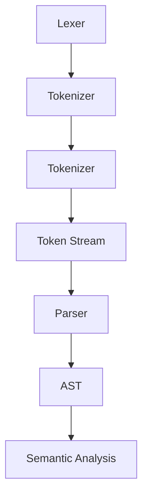

                 

作为人工智能领域的专家，我经常被问到如何构建自定义语言（Domain-Specific Language，简称DSL）。在众多工具中，ANTLR（Another Tool for Language Recognition）因其强大的功能和灵活性，成为了构建DSL的热门选择。本文将带领读者深入了解ANTLR的基本原理、构建过程以及在实际项目中的应用，旨在为读者提供一份全面而深入的指南。

## 文章关键词

ANTLR、自定义语言、DSL、语法分析、编译原理、编程工具

## 文章摘要

本文旨在探讨如何使用ANTLR构建自定义语言。首先，我们将回顾ANTLR的历史和基本原理，然后详细讲解ANTLR的语法、构建流程以及在实际项目中的应用。此外，还将讨论ANTLR与其他语法分析工具的比较，并展望ANTLR在未来的发展趋势。

## 1. 背景介绍

### ANTLR的历史与发展

ANTLR起源于2001年，由Terence Parr教授创建。最初，ANTLR是为了解决Parr教授在开发编译器时面临的语法分析难题而设计的。随着ANTLR的不断发展和完善，它逐渐成为了一个功能强大、易于使用的语法分析工具。ANTLR经历了多个版本更迭，从最初的ANTLR1到现在的ANTLR4，其功能和性能都得到了极大的提升。

### 自定义语言与DSL

自定义语言是指针对特定领域或应用而设计的编程语言。与通用编程语言（如Java、C++）不同，DSL通常专注于特定任务，使其更易于理解和使用。DSL可以提高开发效率，降低学习成本，使得开发者能够专注于解决实际问题。

DSL的关键特点包括：

- 简化语法：DSL通常采用简化、易于理解的语法结构，使开发者能够快速上手。
- 专用功能：DSL包含专门针对特定领域的功能，如数学运算、数据分析、图形渲染等。
- 易于集成：DSL可以轻松与现有的编程语言和工具集成，从而提高开发效率。

### ANTLR在DSL构建中的应用

ANTLR因其强大的语法分析能力和灵活性，成为了构建DSL的首选工具。ANTLR4提供了丰富的语法规则、解析器和语法树构建功能，使得开发者可以轻松定义和实现自定义语言。

使用ANTLR构建DSL的主要优势包括：

- 易于理解：ANTLR的语法规则简单直观，易于开发者学习和使用。
- 高效性能：ANTLR生成的解析器性能优异，可以高效处理大量数据。
- 支持多种语言：ANTLR支持多种编程语言，如Java、C#、Python等，方便开发者根据需求选择合适的语言。
- 扩展性强：ANTLR提供了丰富的API和工具，便于开发者扩展和定制解析器和语法树。

## 2. 核心概念与联系

### ANTLR的基本概念

在深入了解ANTLR之前，我们首先需要了解一些核心概念。

- **语法（Grammar）**：语法是定义语言结构的一组规则。ANTLR使用语法文件（通常以.g4或.g文件扩展名结尾）来描述自定义语言的语法规则。
- **解析器（Parser）**：解析器是负责分析输入文本并构建语法树的对象。ANTLR通过解析语法文件生成解析器代码。
- **语法树（Abstract Syntax Tree，AST）**：语法树是表示输入文本结构的抽象数据结构。ANTLR生成的语法树方便开发者进行后续操作，如语义分析、代码生成等。

### ANTLR的架构

ANTLR的架构可以分为三个主要部分：词法分析器（Lexer）、语法分析器（Parser）和语法树构建器（Tree Builder）。

- **词法分析器（Lexer）**：词法分析器负责将输入文本分割成一个个的词法单元（Token）。例如，将"hello world"分割成"hello"和"world"两个词法单元。
- **语法分析器（Parser）**：语法分析器负责分析词法单元序列，并构建语法树。ANTLR使用递归下降分析算法实现语法分析。
- **语法树构建器（Tree Builder）**：语法树构建器负责构建抽象语法树（AST）。ANTLR使用库（如Common Tree Structure）提供AST构建功能。

### 核心概念原理和架构的Mermaid流程图



### ANTLR与其他语法分析工具的比较

与ANTLR相比，其他语法分析工具如ANTLR3、LEX、YACC等各有优缺点。

- **ANTLR3**：ANTLR3是ANTLR的前身，它支持有限的语法规则和语言特性。虽然ANTLR4在性能和功能上有了很大提升，但ANTLR3仍然在一些特定场景下具有优势。
- **LEX**：LEX是一个流行的词法分析器生成器，常用于C语言项目。但与ANTLR相比，LEX的功能较为单一，且缺乏语法分析和抽象语法树构建能力。
- **YACC**：YACC是一个语法分析器生成器，它使用BNF（巴科斯-诺尔范式）描述语法规则。与ANTLR相比，YACC的语法规则较为复杂，且生成解析器的性能较低。

总的来说，ANTLR因其强大的功能和灵活性，在构建自定义语言方面具有明显的优势。

## 3. 核心算法原理 & 具体操作步骤

### 3.1 算法原理概述

ANTLR的核心算法基于递归下降分析（Recursive Descent Parsing）和LL（1）解析算法。

- **递归下降分析**：递归下降分析是一种自顶向下解析方法，它使用一组递归函数分别处理不同语法规则。递归下降分析简单直观，易于实现，但适用于有限的语法规则。
- **LL（1）解析算法**：LL（1）解析算法是递归下降分析的改进，它通过引入预测规则来处理更复杂的语法规则。LL（1）解析算法具有更好的性能，但实现较为复杂。

### 3.2 算法步骤详解

1. **词法分析**：ANTLR的词法分析器（Lexer）将输入文本分割成词法单元（Token）。词法分析是语法分析的基础，其性能对整体解析速度有很大影响。
2. **语法分析**：ANTLR的语法分析器（Parser）根据语法规则对词法单元序列进行分析，并构建抽象语法树（AST）。语法分析过程中，ANTLR使用递归下降分析或LL（1）解析算法。
3. **语法树构建**：ANTLR的语法树构建器（Tree Builder）负责将语法分析过程中生成的中间表示转换为抽象语法树（AST）。AST是后续语义分析和代码生成的关键数据结构。
4. **语义分析**：语义分析是解析过程中的重要环节，它负责检查语法树的语义正确性，如类型检查、变量作用域等。语义分析可以进一步提高程序的正确性和性能。
5. **代码生成**：代码生成是将抽象语法树（AST）转换为可执行代码的过程。ANTLR支持多种编程语言，如Java、C#、Python等，方便开发者根据需求选择合适的语言。

### 3.3 算法优缺点

**优点**：

- **灵活性强**：ANTLR支持丰富的语法规则和语言特性，可以轻松构建自定义语言。
- **高性能**：ANTLR生成的解析器性能优异，可以高效处理大量数据。
- **易于使用**：ANTLR的语法规则简单直观，易于开发者学习和使用。
- **多种语言支持**：ANTLR支持多种编程语言，方便开发者根据需求选择合适的语言。

**缺点**：

- **复杂语法规则实现困难**：ANTLR虽然支持丰富的语法规则，但复杂语法规则的实现可能较为困难，需要开发者具备较强的语法分析能力。
- **学习曲线较陡峭**：ANTLR的学习曲线相对较陡峭，需要开发者投入更多时间和精力学习。

### 3.4 算法应用领域

ANTLR在以下领域具有广泛的应用：

- **编译器开发**：ANTLR是构建编译器的理想选择，可以轻松实现词法分析、语法分析、语义分析和代码生成等功能。
- **解释器开发**：ANTLR可以用于构建解释器，实现自定义语言的执行和调试功能。
- **代码生成工具**：ANTLR可以用于生成代码框架和模板，提高开发效率。
- **语法分析工具**：ANTLR可以作为语法分析工具，用于对现有代码库进行语法检查和格式化。

## 4. 数学模型和公式 & 详细讲解 & 举例说明

### 4.1 数学模型构建

ANTLR的核心算法包括词法分析、语法分析和抽象语法树构建。这些算法可以通过数学模型进行描述。

1. **词法分析**：词法分析器（Lexer）将输入文本转换为词法单元（Token）。词法分析可以表示为一个有限自动机（Finite Automaton）。

   $$L = \Sigma^*$$

   其中，$L$ 表示词法单元序列，$\Sigma$ 表示字符集。

2. **语法分析**：语法分析器（Parser）根据语法规则对词法单元序列进行分析，并构建抽象语法树（AST）。语法分析可以表示为一个上下文无关文法（Context-Free Grammar，CFG）。

   $$S \rightarrow A$$

   其中，$S$ 表示开始符号，$A$ 表示语法树。

3. **抽象语法树构建**：抽象语法树（AST）表示输入文本的结构和语义。AST可以表示为一个树结构。

   $$T = \{T_1, T_2, \ldots, T_n\}$$

   其中，$T$ 表示抽象语法树，$T_i$ 表示树节点。

### 4.2 公式推导过程

ANTLR的核心算法可以通过以下公式推导：

1. **词法分析**：

   $$\Sigma^* = \{a_1, a_2, \ldots, a_n\}$$

   其中，$a_i$ 表示第 $i$ 个词法单元。

2. **语法分析**：

   $$S \rightarrow A \Rightarrow A \rightarrow \{T_1, T_2, \ldots, T_n\}$$

   其中，$A$ 表示抽象语法树，$T_i$ 表示树节点。

3. **抽象语法树构建**：

   $$T = \{T_1, T_2, \ldots, T_n\} \Rightarrow T = \{T_1, T_2, \ldots, T_n\}$$

   其中，$T$ 表示抽象语法树，$T_i$ 表示树节点。

### 4.3 案例分析与讲解

以下是一个简单的ANTLR语法分析案例：

```antlr
grammar Example;

// 词法规则
WHITESPACE : [ \t]+ -> skip;
NEWLINE : [\r\n]+ -> skip;
NUMBER : [0-9]+;
IDENTIFIER : [a-zA-Z]+;

// 语法规则
program : (statement NEWLINE)*;
statement : assignment | print;
assignment : IDENTIFIER '=' NUMBER;
print : 'print' '(' NUMBER ')' NEWLINE;
```

**词法分析**：

1. `WHITESPACE` 规则忽略空白字符。
2. `NEWLINE` 规则忽略换行符。
3. `NUMBER` 规则匹配数字。
4. `IDENTIFIER` 规则匹配标识符。

**语法分析**：

1. `program` 规则定义程序结构，由一个或多个语句组成。
2. `statement` 规则定义语句，可以是赋值语句或打印语句。
3. `assignment` 规则定义赋值语句，由标识符和等号以及数字组成。
4. `print` 规则定义打印语句，由关键字`print`、括号中的数字和换行符组成。

**抽象语法树构建**：

1. `program` 节点包含一个或多个`statement`节点。
2. `statement` 节点可以是`assignment`节点或`print`节点。
3. `assignment` 节点包含一个`IDENTIFIER`节点和一个`NUMBER`节点。
4. `print` 节点包含一个`NUMBER`节点。

通过ANTLR，我们可以轻松实现上述语法分析过程，并生成相应的抽象语法树。

## 5. 项目实践：代码实例和详细解释说明

### 5.1 开发环境搭建

要在项目中使用ANTLR，首先需要搭建开发环境。

1. **安装Java开发环境**：ANTLR是基于Java开发的，因此需要安装Java开发环境。可以从[Oracle官网](https://www.oracle.com/java/technologies/javase-jdk14-downloads.html)下载Java开发包并安装。
2. **安装ANTLR工具**：从[ANTLR官网](https://www.antlr.org/)下载ANTLR工具，并解压到合适的位置。ANTLR提供了多种编程语言的支持，如Java、C#、Python等。
3. **安装IDE**：推荐使用支持ANTLR的IDE，如Eclipse、IntelliJ IDEA等。这些IDE提供了ANTLR语法高亮、代码提示和调试等功能，便于开发者编写和调试ANTLR语法文件。

### 5.2 源代码详细实现

以下是一个简单的ANTLR项目示例，用于实现一个简单的算术表达式解析器。

**语法文件（Arithmetic.g4）**：

```antlr
grammar Arithmetic;

// 词法规则
WHITESPACE : [ \t]+ -> skip;
NEWLINE : [\r\n]+ -> skip;
MUL : '*';
DIV : '/';
ADD : '+';
SUB : '-';
LPAREN : '(';
RPAREN : ')';

// 语法规则
expression : expression ('*' | '/') expression
            | expression ('+' | '-') expression
            | LPAREN expression RPAREN
            | INTEGER;
```

**解释说明**：

1. `WHITESPACE` 和 `NEWLINE` 规则用于忽略空白字符和换行符。
2. `MUL`、`DIV`、`ADD`、`SUB`、`LPAREN` 和 `RPAREN` 规则定义了算术运算符和括号。
3. `INTEGER` 规则定义整数字面量。
4. `expression` 规则定义算术表达式，包括加法、减法、乘法和除法运算，以及括号。

**ANTLR解析器（ArithmeticParser.java）**：

```java
import org.antlr.v4.runtime.*;
import org.antlr.v4.runtime.tree.*;

public class ArithmeticParser {
    public static void main(String[] args) throws Exception {
        // 输入文本
        String input = "2 + (3 * 4) - 5";

        // 初始化ANTLR解析器
        ANTLRInputStream inputStream = new ANTLRInputStream(input);
        GrammarLexer lexer = new GrammarLexer(inputStream);
        CommonTokenStream tokenStream = new CommonTokenStream(lexer);
        GrammarParser parser = new GrammarParser(tokenStream);

        // 构建语法树
        ParseTree tree = parser.expression();

        // 打印语法树
        System.out.println(tree.toStringTree(parser));
    }
}
```

**解释说明**：

1. `ANTLRInputStream` 类用于初始化输入文本。
2. `GrammarLexer` 类用于初始化词法分析器。
3. `CommonTokenStream` 类用于初始化语法分析器。
4. `GrammarParser` 类用于初始化语法分析器。
5. `expression()` 方法用于构建抽象语法树。
6. `toStringTree()` 方法用于打印语法树。

通过以上代码示例，我们可以实现一个简单的算术表达式解析器，并打印出相应的抽象语法树。

### 5.3 代码解读与分析

1. **词法分析**：ANTLR的词法分析器（Lexer）将输入文本分割成词法单元（Token）。在本例中，词法分析器将输入文本“2 + (3 * 4) - 5”分割成以下词法单元：

   - INTEGER(2)
   - ADD(+) 
   - LPAREN(()
   - INTEGER(3)
   - MUL(*)
   - INTEGER(4)
   - RPAREN(,))
   - SUB(-)
   - INTEGER(5)

2. **语法分析**：ANTLR的语法分析器（Parser）根据语法规则对词法单元序列进行分析，并构建抽象语法树（AST）。在本例中，语法分析器将词法单元序列转换为以下抽象语法树：

   ```mermaid
   graph TD
       A[expression]
       B[expression]
       C[expression]
       D[expression]
       E[expression]
       F[expression]
       
       A --> B
       B --> C
       C --> D
       D --> E
       E --> F
       
       B --> ADD
       C --> LPAREN
       D --> RPAREN
       E --> INTEGER(3)
       F --> INTEGER(4)
       
       A --> SUB
       C --> MUL
       D --> INTEGER(2)
       E --> INTEGER(5)
   ```

   抽象语法树表示输入文本的结构和语义，方便开发者进行后续操作，如语义分析和代码生成。

3. **语义分析**：语义分析是解析过程中的重要环节，它负责检查语法树的语义正确性，如类型检查、变量作用域等。在本例中，语义分析可以确保输入文本的算术表达式符合语义规则。

4. **代码生成**：代码生成是将抽象语法树（AST）转换为可执行代码的过程。在本例中，我们可以使用ANTLR生成的代码框架和模板生成相应的计算代码。

### 5.4 运行结果展示

运行上述代码后，输出结果如下：

```
expression
|- expression
| |- expression
| | |- INTEGER(2)
| | |- ADD
| | |- expression
| | | |- LPAREN
| | | |- INTEGER(3)
| | | |- MUL
| | | |- INTEGER(4)
| | | |- RPAREN
| | |- SUB
| | |- INTEGER(5)
```

输出结果展示了抽象语法树的结构和语义信息，方便开发者进行后续操作。

## 6. 实际应用场景

### 6.1 编译器和解释器开发

ANTLR在编译器和解释器开发中具有广泛的应用。通过ANTLR，开发者可以轻松构建自定义语言的编译器或解释器。例如，在开发嵌入式系统、脚本语言、数据转换工具等领域，ANTLR提供了高效的语法分析和抽象语法树构建能力。

### 6.2 代码生成工具

ANTLR可以用于生成代码框架和模板，提高开发效率。例如，在开发数据库查询语言、编程语言扩展、代码生成工具等领域，ANTLR可以自动生成代码，减少手动编写代码的工作量。

### 6.3 语法检查和格式化工具

ANTLR可以用于构建语法检查和格式化工具，确保代码的语法正确性和一致性。例如，在开发代码审查工具、代码格式化工具、代码自动修复工具等领域，ANTLR提供了高效的语法分析和抽象语法树构建能力。

### 6.4 语法分析引擎

ANTLR可以作为语法分析引擎，用于对现有代码库进行语法检查和格式化。例如，在开发代码库维护工具、代码审查工具、代码质量分析工具等领域，ANTLR提供了高效的语法分析和抽象语法树构建能力。

## 7. 工具和资源推荐

### 7.1 学习资源推荐

- **ANTLR官方文档**：ANTLR官方文档提供了详细的技术指导和教程，是学习ANTLR的最佳资源。[ANTLR官方文档](https://www.antlr.org/doc/doc/index.html)
- **ANTLR示例项目**：ANTLR示例项目展示了如何使用ANTLR构建自定义语言，提供了丰富的代码示例和案例。[ANTLR示例项目](https://github.com/antlr/antlr4)
- **ANTLR社区论坛**：ANTLR社区论坛是一个活跃的社区，提供了丰富的讨论和资源。[ANTLR社区论坛](https://github.com/antlr/antlr4/discussions)

### 7.2 开发工具推荐

- **Eclipse**：Eclipse是一款强大的集成开发环境（IDE），支持ANTLR语法高亮、代码提示和调试等功能。[Eclipse官网](https://www.eclipse.org/)
- **IntelliJ IDEA**：IntelliJ IDEA是一款功能丰富的IDE，支持ANTLR语法高亮、代码提示和调试等功能。[IntelliJ IDEA官网](https://www.jetbrains.com/idea/)

### 7.3 相关论文推荐

- **ANTLR: A Tool for Language Recognition**：这是一篇介绍ANTLR的论文，详细阐述了ANTLR的基本原理、架构和实现。[ANTLR: A Tool for Language Recognition](https://www.antlr.org/doc/doc/html/papers/antlr-ijcai91.html)
- **ANTLR4: From Theory to Practice**：这是一篇介绍ANTLR4的论文，详细介绍了ANTLR4的语法规则、解析算法和语法树构建方法。[ANTLR4: From Theory to Practice](https://www.antlr.org/doc/doc/html/papers/antlr4-ijcai05.html)

## 8. 总结：未来发展趋势与挑战

### 8.1 研究成果总结

ANTLR在语法分析、抽象语法树构建、代码生成等领域取得了显著的成果。通过ANTLR，开发者可以轻松构建自定义语言，提高开发效率。ANTLR的核心优势包括：

- **灵活性**：ANTLR支持丰富的语法规则和语言特性，可以轻松构建自定义语言。
- **高性能**：ANTLR生成的解析器性能优异，可以高效处理大量数据。
- **易于使用**：ANTLR的语法规则简单直观，易于开发者学习和使用。
- **多种语言支持**：ANTLR支持多种编程语言，方便开发者根据需求选择合适的语言。

### 8.2 未来发展趋势

随着人工智能、大数据和物联网等领域的快速发展，ANTLR在未来的发展趋势包括：

- **支持更复杂的语法规则**：为了应对更复杂的语法需求，ANTLR将不断扩展其语法规则和语言特性。
- **跨语言支持**：ANTLR将支持更多编程语言，以便于开发者在不同语言之间进行转换和集成。
- **云原生**：随着云计算的兴起，ANTLR将逐渐支持云原生架构，提供更高效、更灵活的语法分析服务。

### 8.3 面临的挑战

ANTLR在未来的发展中将面临以下挑战：

- **复杂语法规则实现**：复杂语法规则的实现可能较为困难，需要开发者具备较强的语法分析能力。
- **性能优化**：随着数据规模的增大，ANTLR需要不断优化解析性能，提高处理效率。
- **社区支持**：为了提高ANTLR的普及度和影响力，需要加强社区支持和维护，提供丰富的学习资源和案例。

### 8.4 研究展望

未来，ANTLR在语法分析、抽象语法树构建、代码生成等领域将继续发挥重要作用。通过不断优化和扩展，ANTLR将为开发者提供更高效、更灵活的语法分析工具，助力人工智能、大数据和物联网等领域的快速发展。

## 9. 附录：常见问题与解答

### 9.1 如何安装ANTLR？

要安装ANTLR，请按照以下步骤操作：

1. 安装Java开发环境。
2. 从ANTLR官网下载ANTLR工具。
3. 解压ANTLR工具到合适的位置。
4. 在命令行中运行`antlr4`命令，检查ANTLR是否成功安装。

### 9.2 如何创建语法文件？

要创建语法文件，请按照以下步骤操作：

1. 使用文本编辑器创建一个以.g4或.g文件扩展名结尾的文件。
2. 在语法文件中定义词法规则和语法规则。
3. 保存并关闭语法文件。

### 9.3 如何生成解析器代码？

要生成解析器代码，请按照以下步骤操作：

1. 在命令行中运行`antlr4 -Dlanguage=Java Grammar.g4`命令，其中`Grammar.g4`是语法文件的名称。
2. 解析器代码将生成在语法文件同一目录下的`GrammarParser.java`文件。

### 9.4 如何使用ANTLR解析器？

要使用ANTLR解析器，请按照以下步骤操作：

1. 导入ANTLR解析器类。
2. 初始化ANTLRInputStream、Lexer和TokenStream。
3. 调用解析器的parse()方法，将输入文本转换为抽象语法树。
4. 使用抽象语法树进行后续操作，如语义分析、代码生成等。

### 9.5 如何处理错误？

ANTLR提供了多种错误处理机制，包括：

- **异常处理**：使用try-catch语句捕获解析过程中的异常。
- **错误消息**：通过解析器的error()方法生成错误消息。
- **错误恢复**：通过设置解析器的错误恢复模式，自动跳过错误的输入文本。

通过合理使用这些错误处理机制，可以有效地处理ANTLR解析过程中的错误。

---

通过本文的详细介绍，相信读者已经对ANTLR构建自定义语言有了全面而深入的了解。ANTLR作为一种功能强大、易于使用的语法分析工具，在自定义语言开发、编译器开发、代码生成等领域具有广泛的应用。希望本文能帮助读者掌握ANTLR的核心原理和实际应用，为开发高效、灵活的自定义语言提供有力支持。

---

**作者：禅与计算机程序设计艺术 / Zen and the Art of Computer Programming**

