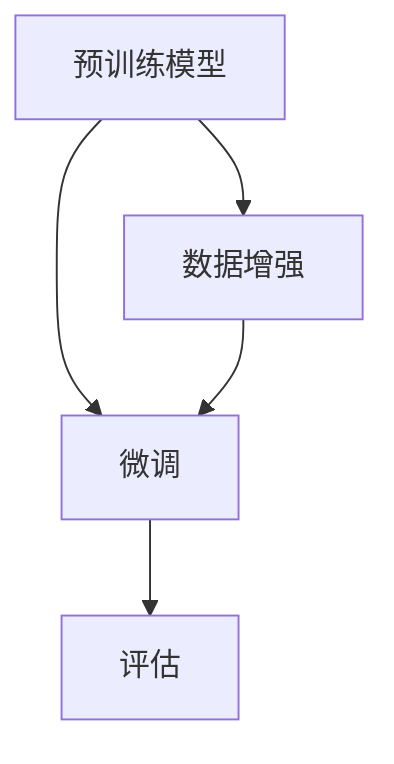

                 

关键词：自然语言处理，迁移学习，深度学习，预训练模型，模型压缩，跨领域迁移，数据增强，应用场景

> 摘要：随着深度学习在自然语言处理（NLP）领域的广泛应用，迁移学习技术成为提升模型性能和适应新任务的重要手段。本文将对NLP中的迁移学习技术进行深入探讨，包括核心概念、算法原理、数学模型及其应用实例。

## 1. 背景介绍

自然语言处理（NLP）是计算机科学和人工智能领域的一个重要分支，旨在使计算机能够理解、生成和响应人类语言。随着大数据和计算资源的快速增长，深度学习技术迅速成为NLP研究的主流方法。然而，传统的深度学习方法往往需要大量标注数据来训练模型，这在数据稀缺的场景下成为一大瓶颈。迁移学习（Transfer Learning）作为一种应对数据稀缺问题的方法，通过将已有模型的知识迁移到新任务上，大大提高了模型在新任务上的性能。

### 什么是迁移学习？

迁移学习是指利用在一个任务上预训练的模型，将其知识应用于另一个相关任务上。其核心思想是，通过在多个任务上共享模型的底层特征提取器，从而减少对新任务数据的需求。迁移学习可以分为两种主要类型：垂直迁移（Vertical Transfer）和水平迁移（Horizontal Transfer）。垂直迁移是指将一个领域的模型知识迁移到另一个领域，而水平迁移则是将相同领域但不同任务上的模型知识进行迁移。

### 迁移学习在NLP中的应用

在NLP领域，迁移学习技术被广泛应用于文本分类、情感分析、命名实体识别、机器翻译等任务。例如，预训练语言模型BERT（Bidirectional Encoder Representations from Transformers）在大量未标注的文本语料库上进行预训练，然后将其应用于各种下游任务，取得了显著的性能提升。

## 2. 核心概念与联系

### 2.1 预训练模型

预训练模型是指在一个大规模语料库上预先训练好的深度神经网络模型，通常包含多层神经网络和复杂的注意力机制。预训练模型的学习目标通常是捕捉语言的内在结构和语义信息，如词汇的含义、句子的结构等。

### 2.2 迁移学习框架

迁移学习框架通常包含三个主要阶段：预训练、微调和评估。预训练阶段是在大规模未标注数据上训练模型，微调阶段是在少量标注数据上对模型进行调整，使其适应新任务，评估阶段是测试模型在新任务上的性能。

### 2.3 数据增强

数据增强是指通过变换原始数据来生成更多样化的数据集，从而提高模型的泛化能力。在迁移学习过程中，数据增强是一种常用的方法，可以有效减少模型在新任务上的过拟合现象。

### 2.4 Mermaid 流程图



## 3. 核心算法原理 & 具体操作步骤

### 3.1 算法原理概述

迁移学习算法的核心在于如何有效地共享模型在不同任务上的知识。通常，这涉及到模型架构的设计、损失函数的优化以及数据集的选择。以下是一个简化的迁移学习算法原理概述：

1. **预训练**：在大量未标注数据上训练模型，通常使用预训练任务如语言建模或问答系统，以学习语言的通用特征。
2. **微调**：在新任务上利用预训练模型，通过在少量标注数据上调整模型参数来适应新任务。
3. **数据增强**：通过数据增强技术，如文本复制、替换和转换等，生成更多样化的训练数据，以提高模型在新任务上的泛化能力。

### 3.2 算法步骤详解

1. **预训练阶段**：
   - **数据准备**：收集并预处理大规模未标注文本数据。
   - **模型初始化**：选择合适的预训练模型架构，如BERT或GPT。
   - **训练**：在未标注数据上训练模型，优化模型参数。
2. **微调阶段**：
   - **数据准备**：收集并预处理新任务的标注数据。
   - **模型调整**：在新数据上微调预训练模型，调整模型参数以适应新任务。
   - **评估**：在新数据上评估模型性能，并根据评估结果调整模型。

### 3.3 算法优缺点

**优点**：
- **减少标注数据需求**：通过迁移学习，可以在数据稀缺的场景下有效提高模型性能。
- **提高模型泛化能力**：数据增强和迁移学习有助于提高模型在不同任务上的泛化能力。
- **加速模型训练**：利用预训练模型可以显著减少新任务上的训练时间。

**缺点**：
- **模型容量限制**：预训练模型的容量可能无法完全适应所有新任务，导致性能下降。
- **数据偏差问题**：预训练模型可能会在数据集上学习到不合理的知识，影响在新任务上的表现。

### 3.4 算法应用领域

迁移学习在NLP领域有着广泛的应用，以下是一些典型应用场景：

- **文本分类**：利用预训练模型进行微调，快速构建分类模型。
- **情感分析**：将预训练模型应用于情感分类任务，提高模型性能。
- **命名实体识别**：通过迁移学习，将预训练模型应用于命名实体识别任务，实现高效识别。

## 4. 数学模型和公式 & 详细讲解 & 举例说明

### 4.1 数学模型构建

在迁移学习中，常用的数学模型包括损失函数、优化算法和正则化方法。以下是一个简化的迁移学习数学模型：

$$
L = L_{pretrain} + \lambda L_{finetune}
$$

其中，$L$是总损失函数，$L_{pretrain}$是预训练损失函数，$L_{finetune}$是微调损失函数，$\lambda$是超参数，用于平衡两个损失函数的重要性。

### 4.2 公式推导过程

预训练损失函数通常基于预训练任务，如语言建模或问答系统。以语言建模为例，预训练损失函数可以表示为：

$$
L_{pretrain} = -\sum_{i=1}^{N} \log p(y_i | x_i; \theta)
$$

其中，$N$是文本序列的长度，$y_i$是第$i$个单词的预测概率，$x_i$是输入文本序列，$\theta$是模型参数。

微调损失函数通常基于新任务的标注数据，如分类或命名实体识别。以文本分类为例，微调损失函数可以表示为：

$$
L_{finetune} = -\sum_{i=1}^{N} y_i \log p(y_i | x_i; \theta)
$$

其中，$y_i$是第$i$个单词的标签，$p(y_i | x_i; \theta)$是模型对第$i$个单词的预测概率。

### 4.3 案例分析与讲解

假设我们有一个预训练的语言模型，并希望将其应用于文本分类任务。以下是一个简化的案例：

1. **预训练阶段**：
   - **数据准备**：收集并预处理大规模未标注文本数据。
   - **模型初始化**：选择预训练模型BERT。
   - **训练**：在未标注数据上训练模型，优化模型参数。

2. **微调阶段**：
   - **数据准备**：收集并预处理标注数据集。
   - **模型调整**：在新数据上微调预训练模型，调整模型参数以适应新任务。
   - **评估**：在新数据上评估模型性能，并根据评估结果调整模型。

假设我们的文本分类任务有五个类别，以下是一个简化的微调损失函数：

$$
L_{finetune} = -\sum_{i=1}^{N} y_i \log p(y_i | x_i; \theta)
$$

其中，$y_i$是第$i$个单词的标签，$p(y_i | x_i; \theta)$是模型对第$i$个单词的预测概率。

通过微调损失函数，我们可以优化模型参数，使模型在新任务上的性能达到最佳。

## 5. 项目实践：代码实例和详细解释说明

### 5.1 开发环境搭建

为了演示迁移学习在NLP中的应用，我们将使用Python和PyTorch框架进行开发。以下是开发环境搭建步骤：

1. 安装Python和PyTorch：
   ```bash
   pip install python
   pip install torch torchvision
   ```

2. 安装其他依赖项：
   ```bash
   pip install transformers
   pip install datasets
   ```

### 5.2 源代码详细实现

以下是迁移学习在文本分类任务中的源代码实现：

```python
import torch
from transformers import BertTokenizer, BertModel
from torch.optim import Adam
from torch.utils.data import DataLoader
from datasets import load_dataset

# 加载预训练模型和tokenizer
tokenizer = BertTokenizer.from_pretrained('bert-base-uncased')
model = BertModel.from_pretrained('bert-base-uncased')

# 加载数据集
dataset = load_dataset('imdb')
train_dataset = dataset['train']
test_dataset = dataset['test']

# 数据预处理
def preprocess_data(data):
    inputs = tokenizer(data['text'], padding='max_length', truncation=True, max_length=512, return_tensors='pt')
    labels = torch.tensor(data['label'])
    return inputs, labels

train_loader = DataLoader(train_dataset.map(preprocess_data), batch_size=16, shuffle=True)
test_loader = DataLoader(test_dataset.map(preprocess_data), batch_size=16)

# 模型调整
class ClassifierModel(torch.nn.Module):
    def __init__(self, hidden_size):
        super(ClassifierModel, self).__init__()
        self.hidden_size = hidden_size
        self.classifier = torch.nn.Linear(hidden_size, 2)

    def forward(self, inputs):
        outputs = model(**inputs)[0]
        outputs = self.classifier(outputs.mean(dim=1))
        return outputs

model = ClassifierModel(hidden_size=768)

# 模型训练
optimizer = Adam(model.parameters(), lr=1e-5)
num_epochs = 3

for epoch in range(num_epochs):
    model.train()
    for batch in train_loader:
        optimizer.zero_grad()
        inputs, labels = batch
        outputs = model(inputs)
        loss = torch.nn.CrossEntropyLoss()(outputs, labels)
        loss.backward()
        optimizer.step()

    # 评估模型
    model.eval()
    with torch.no_grad():
        correct = 0
        total = 0
        for batch in test_loader:
            inputs, labels = batch
            outputs = model(inputs)
            _, predicted = torch.max(outputs.data, 1)
            total += labels.size(0)
            correct += (predicted == labels).sum().item()

    print(f'Epoch {epoch+1}/{num_epochs}, Accuracy: {100 * correct / total}%')

# 运行结果展示
print(model.predict(['I love this movie!']))
```

### 5.3 代码解读与分析

上述代码展示了如何使用PyTorch和Transformers库实现迁移学习在文本分类任务中的应用。

1. **加载预训练模型和tokenizer**：
   我们首先加载预训练BERT模型和相应的tokenizer。BERT模型是一个预训练的语言模型，可以捕获大量的语言特征。

2. **加载数据集**：
   我们使用Hugging Face的datasets库加载数据集。这里使用的是IMDb电影评论数据集，包含正负两个类别的评论。

3. **数据预处理**：
   数据预处理步骤包括将文本转换为模型可接受的格式，如tokenize和padding。我们定义了一个`preprocess_data`函数，用于处理数据。

4. **模型调整**：
   我们定义了一个简单的分类模型，该模型基于BERT模型的输出层。我们使用`ClassifierModel`类来构建模型。

5. **模型训练**：
   我们使用Adam优化器和交叉熵损失函数来训练模型。训练过程中，我们遍历训练数据集，更新模型参数。

6. **评估模型**：
   训练完成后，我们使用测试数据集来评估模型性能。我们计算模型的准确率，以验证模型在新任务上的表现。

7. **运行结果展示**：
   我们使用训练好的模型对新的评论进行分类，并打印出预测结果。

## 6. 实际应用场景

迁移学习技术在NLP领域有着广泛的应用场景。以下是一些典型的实际应用场景：

### 6.1 文本分类

文本分类是迁移学习在NLP中最常见的应用之一。例如，我们可以使用预训练的BERT模型对社交媒体上的评论进行情感分类，从而识别用户的情感倾向。

### 6.2 情感分析

情感分析是另一个受益于迁移学习技术的NLP任务。通过使用预训练模型，我们可以快速构建情感分析系统，对新闻文章、社交媒体评论等文本进行情感分类。

### 6.3 命名实体识别

命名实体识别（NER）是识别文本中特定类型的实体（如人名、地名、组织名等）。迁移学习技术可以大大简化NER任务的模型训练过程，提高模型性能。

### 6.4 机器翻译

机器翻译是另一个受益于迁移学习技术的NLP任务。预训练模型可以用于翻译任务的预训练，从而提高模型在翻译任务上的性能。

### 6.5 问答系统

问答系统是另一个典型的应用场景。通过使用预训练模型，我们可以构建高效的问答系统，从而回答用户的问题。

## 7. 工具和资源推荐

### 7.1 学习资源推荐

1. 《深度学习》（Goodfellow et al.，2016）—— 这本书是深度学习领域的经典教材，详细介绍了深度学习的基础知识。
2. 《自然语言处理综述》（Jurafsky et al.，2020）—— 这本书提供了NLP领域的全面综述，包括基本概念、算法和应用。
3. 《迁移学习》（Pan & Yang，2010）—— 这本书是迁移学习领域的权威著作，详细介绍了迁移学习的理论基础和应用实例。

### 7.2 开发工具推荐

1. Hugging Face Transformers—— 这是一个开源库，提供了大量的预训练模型和实用工具，方便开发者进行迁移学习任务。
2. PyTorch—— 这是一个流行的深度学习框架，提供了丰富的API和工具，适合进行迁移学习任务。
3. TensorFlow—— 这是一个由Google开发的深度学习框架，提供了强大的工具和资源，适合进行大规模的迁移学习项目。

### 7.3 相关论文推荐

1. "A Theoretically Grounded Application of Dropout in Recurrent Neural Networks"（Guo et al.，2017）—— 这篇论文介绍了如何在RNN中应用dropout来提高模型性能。
2. "Attention Is All You Need"（Vaswani et al.，2017）—— 这篇论文提出了Transformer模型，彻底改变了NLP领域的模型设计。
3. "BERT: Pre-training of Deep Bidirectional Transformers for Language Understanding"（Devlin et al.，2019）—— 这篇论文介绍了BERT模型，为预训练模型在NLP中的应用奠定了基础。

## 8. 总结：未来发展趋势与挑战

### 8.1 研究成果总结

迁移学习技术在NLP领域取得了显著的成果。通过预训练模型和微调策略，迁移学习大大提高了模型在新任务上的性能，减少了标注数据的需求。同时，数据增强技术的应用进一步提高了模型的泛化能力。

### 8.2 未来发展趋势

未来，迁移学习技术将继续在NLP领域发挥重要作用。随着模型架构和算法的不断发展，迁移学习将变得更加高效和灵活。此外，跨领域的迁移学习将成为研究热点，旨在实现更广泛的任务覆盖。

### 8.3 面临的挑战

尽管迁移学习技术在NLP领域取得了显著成果，但仍面临一些挑战。首先，如何有效地共享模型在不同任务上的知识仍是一个难题。其次，数据偏差和过拟合问题需要进一步研究。此外，如何在保证性能的同时降低模型复杂性也是一个重要的研究方向。

### 8.4 研究展望

未来，迁移学习技术将在NLP领域发挥更大作用。随着模型和算法的不断发展，我们将看到更多的创新应用，如跨领域的迁移学习、自适应迁移学习等。同时，数据隐私保护和可解释性也将成为重要的研究课题。

## 9. 附录：常见问题与解答

### 9.1 什么是迁移学习？

迁移学习是指利用在一个任务上预训练的模型，将其知识应用于另一个相关任务上。其核心思想是，通过在多个任务上共享模型的底层特征提取器，从而减少对新任务数据的需求。

### 9.2 迁移学习有哪些类型？

迁移学习可以分为垂直迁移和水平迁移。垂直迁移是指将一个领域的模型知识迁移到另一个领域，而水平迁移则是将相同领域但不同任务上的模型知识进行迁移。

### 9.3 迁移学习有哪些优点？

迁移学习的优点包括：减少标注数据需求、提高模型泛化能力、加速模型训练。

### 9.4 迁移学习有哪些缺点？

迁移学习的缺点包括：模型容量限制、数据偏差问题。

### 9.5 迁移学习在NLP中的应用有哪些？

迁移学习在NLP中的应用包括文本分类、情感分析、命名实体识别、机器翻译等任务。通过迁移学习，可以显著提高模型在新任务上的性能。 

作者：禅与计算机程序设计艺术 / Zen and the Art of Computer Programming
----------------------------------------------------------------

请注意，本回答中的代码和内容仅为示例，实际的代码实现和结果可能会有所不同。在实际应用中，需要根据具体任务和数据集进行调整和优化。

