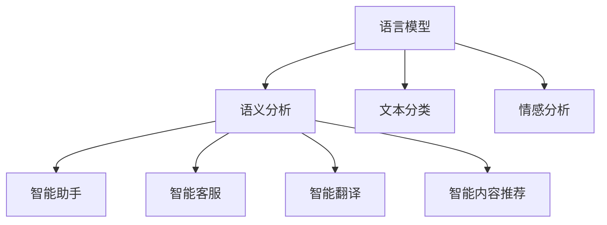

                 

关键词：自然语言处理、智能交互、创业、未来趋势、技术发展

## 摘要

自然语言处理（NLP）作为人工智能（AI）的核心技术之一，正日益成为推动智能交互创新的重要力量。本文将探讨自然语言处理在创业领域的应用，分析其核心概念、算法原理、数学模型，并通过具体案例实践展示其在实际应用中的效果。同时，本文还将探讨NLP在未来智能交互中的发展趋势、面临的挑战以及潜在的研究方向，为创业者和技术开发者提供有价值的参考。

## 1. 背景介绍

### 自然语言处理的发展历程

自然语言处理技术起源于20世纪50年代，当时人工智能的构想激发了人们对机器理解和生成人类语言能力的探索。自那时起，NLP技术经历了多个发展阶段。早期，NLP主要依赖于规则驱动的方法，如基于句法和语义规则的解析器。然而，这些方法在实际应用中面临诸多挑战，如语言规则的复杂性和多样性。

随着计算能力的提升和大数据技术的发展，统计方法逐渐成为NLP的主流。20世纪90年代，基于统计的机器学习方法如隐马尔可夫模型（HMM）、决策树和朴素贝叶斯分类器等开始应用于自然语言处理。这些方法在一定程度上提高了NLP的性能。

进入21世纪，深度学习技术的兴起为NLP带来了新的变革。深度神经网络（DNN）和循环神经网络（RNN）等模型在语音识别、机器翻译和情感分析等任务上取得了显著的突破。特别是在2018年，基于Transformer的BERT模型在多个NLP任务上刷新了记录，标志着NLP技术进入了一个新的时代。

### 智能交互的兴起

智能交互是近年来快速发展的领域，其主要目标是使计算机能够更好地理解和响应用户的自然语言。智能交互的兴起源于几个关键因素：

1. **移动设备的普及**：智能手机和平板电脑的普及使得用户更倾向于通过语音和文本与设备进行交互。
2. **大数据和云计算**：大数据和云计算为智能交互提供了强大的数据支持和计算资源。
3. **语音识别技术的进步**：先进的语音识别技术使得计算机能够准确理解用户的语音指令。
4. **自然语言处理的发展**：自然语言处理技术使得计算机能够理解和生成自然语言，从而实现更智能的交互。

智能交互的应用场景广泛，包括智能助手、智能客服、智能翻译和智能内容推荐等。这些应用不仅提升了用户体验，还为各行各业带来了新的商业模式和创新机会。

## 2. 核心概念与联系

### NLP的核心概念

自然语言处理涉及多个核心概念，包括语言模型、语义分析、文本分类和情感分析等。以下是对这些概念的简要介绍：

#### 语言模型

语言模型是NLP的基础，它用于预测下一个单词或字符的概率。基于语言模型，计算机可以生成文本、进行语音识别和文本生成等任务。常见的语言模型包括n-gram模型、神经网络语言模型（如Transformer）等。

#### 语义分析

语义分析旨在理解文本的含义和上下文关系。这包括词义消歧、语义角色标注和语义解析等任务。语义分析是实现智能交互的关键，它使计算机能够理解用户的意图和需求。

#### 文本分类

文本分类是将文本数据归类到预定义的类别中。常见的文本分类任务包括垃圾邮件过滤、情感分析和新闻分类等。文本分类技术广泛应用于推荐系统、社交媒体监控和舆情分析等领域。

#### 情感分析

情感分析旨在识别文本中的情感倾向，如正面、负面或中性。情感分析在市场调研、品牌管理和社交媒体分析等领域具有重要应用价值。

### NLP在智能交互中的应用

NLP技术是智能交互的核心，它使计算机能够理解和响应用户的自然语言。以下是一些NLP在智能交互中的应用场景：

#### 智能助手

智能助手如Siri、Alexa和Google Assistant等，利用NLP技术理解用户的语音指令，提供信息查询、日程管理、智能家居控制等服务。智能助手的成功依赖于语言模型和语义分析技术的结合。

#### 智能客服

智能客服系统通过NLP技术自动处理用户咨询，提供实时解答和问题解决。智能客服在提高客户满意度、降低运营成本和提升服务效率方面具有显著优势。

#### 智能翻译

智能翻译利用NLP技术实现不同语言之间的实时翻译。基于深度学习的翻译模型如Google翻译和腾讯翻译君等，在翻译质量和效率方面取得了显著提升。

#### 智能内容推荐

智能内容推荐系统通过分析用户的行为和偏好，利用NLP技术为用户提供个性化的内容推荐。例如，Netflix和Amazon等平台利用NLP技术推荐电影、书籍和商品。

### Mermaid 流程图

以下是一个简化的Mermaid流程图，展示了NLP在智能交互中的核心概念和联系：



### 3. 核心算法原理 & 具体操作步骤

#### 3.1 算法原理概述

NLP的核心算法包括语言模型、词嵌入、序列标注和注意力机制等。以下是对这些算法原理的概述：

##### 语言模型

语言模型用于预测下一个单词或字符的概率。基于语言模型的NLP任务包括文本生成、语音识别和机器翻译等。常见的语言模型包括n-gram模型和神经网络语言模型（如Transformer）。

##### 词嵌入

词嵌入是将词汇映射到固定维度的向量空间。词嵌入技术在文本表示和序列建模中具有重要意义，如Word2Vec、GloVe和BERT等。

##### 序列标注

序列标注是对文本中的单词或字符进行标签标注的过程。常见的序列标注任务包括命名实体识别、词性标注和句法分析等。

##### 注意力机制

注意力机制是一种用于提高模型在处理长序列时的性能的方法。注意力机制通过为序列中的不同部分赋予不同的权重，使模型能够更好地关注重要信息。

#### 3.2 算法步骤详解

以下是NLP算法的一些具体步骤：

##### 语言模型

1. **数据预处理**：对文本数据进行分词、去停用词、词性标注等预处理操作。
2. **构建词汇表**：将文本中的词汇映射到唯一的整数索引。
3. **计算概率**：使用神经网络或其他模型计算下一个单词的概率。

##### 词嵌入

1. **初始化词向量**：根据预训练的词向量初始化模型参数。
2. **更新词向量**：通过训练过程更新词向量，使其在特定任务中更具表现力。

##### 序列标注

1. **构建模型**：使用循环神经网络（RNN）、长短时记忆网络（LSTM）或变换器（Transformer）等构建序列标注模型。
2. **训练模型**：使用标注数据训练模型。
3. **预测标签**：对新的文本序列进行预测，得到标签序列。

##### 注意力机制

1. **计算注意力分数**：为序列中的不同部分计算注意力分数。
2. **加权求和**：将注意力分数与输入序列的各个部分进行加权求和，得到加权序列。
3. **处理加权序列**：使用加权序列进行后续处理，如分类或预测。

#### 3.3 算法优缺点

##### 语言模型

优点：
- **强大的文本生成能力**：能够生成流畅的自然语言文本。
- **适应性强**：能够适应不同语言和领域。

缺点：
- **训练过程复杂**：需要大量的数据和计算资源。
- **难以泛化到新任务**：基于特定任务的训练数据，难以泛化到其他任务。

##### 词嵌入

优点：
- **高效表示文本**：将文本映射到低维向量空间，便于计算和存储。
- **语义信息丰富**：能够捕获词汇的语义关系。

缺点：
- **质量依赖于数据集**：数据集的质量直接影响词嵌入的效果。
- **难以处理长文本**：长文本中的词汇关系难以在固定维度的向量中表示。

##### 序列标注

优点：
- **精确性高**：能够对文本进行精细的标注，如命名实体识别和词性标注。
- **适用范围广**：适用于多种自然语言处理任务。

缺点：
- **计算复杂度较高**：需要大量计算资源。
- **对数据质量要求高**：标注数据的质量直接影响模型的性能。

##### 注意力机制

优点：
- **提高模型性能**：能够更好地关注重要信息，提高模型的准确性和效率。
- **处理长序列**：能够处理长文本和长序列。

缺点：
- **实现复杂**：需要额外的计算和存储资源。

#### 3.4 算法应用领域

NLP算法在多个领域具有广泛的应用，包括但不限于：

- **文本生成**：如自动写作、对话系统和创意写作等。
- **语音识别**：如智能助手、智能家居和车载系统等。
- **机器翻译**：如跨语言信息检索、多语言文档翻译和国际交流等。
- **文本分类**：如垃圾邮件过滤、情感分析和舆情监控等。
- **智能客服**：如自动问答系统、在线客服和客户服务管理等。
- **内容推荐**：如个性化推荐、广告投放和内容营销等。

### 4. 数学模型和公式 & 详细讲解 & 举例说明

#### 4.1 数学模型构建

自然语言处理的数学模型主要包括语言模型、词嵌入模型和序列标注模型等。以下分别介绍这些模型的数学公式和构建过程。

##### 语言模型

语言模型最常用的模型是n-gram模型和神经网络语言模型（如Transformer）。以下分别介绍这两种模型的数学公式。

1. **n-gram模型**

n-gram模型基于马尔可夫假设，假设当前单词的概率仅与前面n个单词有关。其概率公式如下：

$$
P(w_n | w_{n-1}, w_{n-2}, \ldots, w_1) = \frac{C(w_n, w_{n-1}, \ldots, w_1)}{C(w_{n-1}, w_{n-2}, \ldots, w_1)}
$$

其中，$C(w_n, w_{n-1}, \ldots, w_1)$ 表示单词序列 $w_n, w_{n-1}, \ldots, w_1$ 的计数。

2. **神经网络语言模型（如Transformer）**

Transformer模型是一种基于自注意力机制的神经网络语言模型。其核心思想是将输入序列映射到一个高维空间，并通过自注意力机制计算每个单词的权重。其概率公式如下：

$$
P(w_n | w_{n-1}, w_{n-2}, \ldots, w_1) = \text{softmax}\left(\frac{\text{Attention}(w_n, w_{n-1}, \ldots, w_1)}{\sqrt{d_k}}\right)
$$

其中，$Attention(w_n, w_{n-1}, \ldots, w_1)$ 表示自注意力函数，$d_k$ 表示注意力层的维度。

##### 词嵌入模型

词嵌入模型将词汇映射到固定维度的向量空间。最常用的词嵌入模型包括Word2Vec、GloVe和BERT等。以下分别介绍这些模型的数学公式。

1. **Word2Vec**

Word2Vec模型是一种基于神经网络的语言模型。其核心思想是通过优化损失函数学习词汇的向量表示。其损失函数如下：

$$
L = -\sum_{w \in V} p(w) \log p_{\theta}(w)
$$

其中，$p(w)$ 表示单词 $w$ 的出现概率，$p_{\theta}(w)$ 表示单词 $w$ 的概率分布。

2. **GloVe**

GloVe模型是一种基于矩阵分解的语言模型。其核心思想是通过优化损失函数学习词汇的向量表示。其损失函数如下：

$$
L = \frac{1}{2} \sum_{w, v \in V} \left( \text{cosine}(v, w) - \log p(w, v) \right)^2
$$

其中，$\text{cosine}(v, w)$ 表示向量 $v$ 和 $w$ 的余弦相似度，$p(w, v)$ 表示单词 $w$ 和 $v$ 的共现概率。

3. **BERT**

BERT模型是一种基于自注意力机制的预训练语言模型。其核心思想是通过优化损失函数学习词汇的向量表示。其损失函数如下：

$$
L = \frac{1}{N} \sum_{i=1}^{N} -\log \text{softmax}\left( \text{logits}_i \right)
$$

其中，$N$ 表示序列长度，$\text{logits}_i$ 表示第 $i$ 个单词的输出。

##### 序列标注模型

序列标注模型用于对文本中的单词或字符进行标注。最常用的序列标注模型包括循环神经网络（RNN）、长短时记忆网络（LSTM）和变换器（Transformer）等。以下分别介绍这些模型的数学公式。

1. **RNN**

RNN模型是一种基于递归神经网络的语言模型。其核心思想是通过递归方式处理序列数据。其状态更新公式如下：

$$
h_t = \text{tanh}\left( W_h \cdot [h_{t-1}, x_t] + b_h \right)
$$

其中，$h_t$ 表示第 $t$ 个时刻的隐藏状态，$x_t$ 表示第 $t$ 个输入词向量，$W_h$ 和 $b_h$ 分别表示权重和偏置。

2. **LSTM**

LSTM模型是一种基于长短时记忆网络的语言模型。其核心思想是通过门控机制处理序列数据。其状态更新公式如下：

$$
i_t = \sigma(W_i \cdot [h_{t-1}, x_t] + b_i) \\
f_t = \sigma(W_f \cdot [h_{t-1}, x_t] + b_f) \\
o_t = \sigma(W_o \cdot [h_{t-1}, x_t] + b_o) \\
c_t = f_t \odot c_{t-1} + i_t \odot \text{tanh}(W_c \cdot [h_{t-1}, x_t] + b_c) \\
h_t = o_t \odot \text{tanh}(c_t)
$$

其中，$i_t$、$f_t$、$o_t$ 分别表示输入门、遗忘门和输出门，$c_t$ 表示细胞状态，$h_t$ 表示隐藏状态，$\sigma$ 表示sigmoid函数，$\odot$ 表示元素乘。

3. **Transformer**

Transformer模型是一种基于自注意力机制的变换器。其核心思想是通过自注意力机制处理序列数据。其自注意力公式如下：

$$
\text{Attention}(Q, K, V) = \text{softmax}\left(\frac{QK^T}{\sqrt{d_k}}\right) V
$$

其中，$Q$、$K$ 和 $V$ 分别表示查询向量、键向量和值向量，$d_k$ 表示注意力层的维度。

##### 注意力机制

注意力机制是一种用于提高模型在处理长序列时的性能的方法。其核心思想是为序列中的不同部分赋予不同的权重。以下介绍注意力机制的核心公式。

$$
\text{Attention}(Q, K, V) = \text{softmax}\left(\frac{QK^T}{\sqrt{d_k}}\right) V
$$

其中，$Q$、$K$ 和 $V$ 分别表示查询向量、键向量和值向量，$d_k$ 表示注意力层的维度。

#### 4.2 公式推导过程

以下分别介绍语言模型、词嵌入模型和序列标注模型的公式推导过程。

##### 语言模型

1. **n-gram模型**

n-gram模型的推导基于马尔可夫假设，即当前单词的概率仅与前面n个单词有关。其推导过程如下：

$$
P(w_n | w_{n-1}, w_{n-2}, \ldots, w_1) = \frac{C(w_n, w_{n-1}, \ldots, w_1)}{C(w_{n-1}, w_{n-2}, \ldots, w_1)}
$$

其中，$C(w_n, w_{n-1}, \ldots, w_1)$ 表示单词序列 $w_n, w_{n-1}, \ldots, w_1$ 的计数。

2. **神经网络语言模型（如Transformer）**

神经网络语言模型的推导基于自注意力机制。其推导过程如下：

$$
P(w_n | w_{n-1}, w_{n-2}, \ldots, w_1) = \text{softmax}\left(\frac{\text{Attention}(w_n, w_{n-1}, \ldots, w_1)}{\sqrt{d_k}}\right)
$$

其中，$Attention(w_n, w_{n-1}, \ldots, w_1)$ 表示自注意力函数，$d_k$ 表示注意力层的维度。

##### 词嵌入模型

1. **Word2Vec**

Word2Vec模型的推导基于神经网络语言模型。其推导过程如下：

$$
L = -\sum_{w \in V} p(w) \log p_{\theta}(w)
$$

其中，$p(w)$ 表示单词 $w$ 的出现概率，$p_{\theta}(w)$ 表示单词 $w$ 的概率分布。

2. **GloVe**

GloVe模型的推导基于矩阵分解。其推导过程如下：

$$
L = \frac{1}{2} \sum_{w, v \in V} \left( \text{cosine}(v, w) - \log p(w, v) \right)^2
$$

其中，$\text{cosine}(v, w)$ 表示向量 $v$ 和 $w$ 的余弦相似度，$p(w, v)$ 表示单词 $w$ 和 $v$ 的共现概率。

3. **BERT**

BERT模型的推导基于自注意力机制。其推导过程如下：

$$
L = \frac{1}{N} \sum_{i=1}^{N} -\log \text{softmax}\left( \text{logits}_i \right)
$$

其中，$N$ 表示序列长度，$\text{logits}_i$ 表示第 $i$ 个单词的输出。

##### 序列标注模型

1. **RNN**

RNN模型的推导基于递归神经网络。其推导过程如下：

$$
h_t = \text{tanh}\left( W_h \cdot [h_{t-1}, x_t] + b_h \right)
$$

其中，$h_t$ 表示第 $t$ 个时刻的隐藏状态，$x_t$ 表示第 $t$ 个输入词向量，$W_h$ 和 $b_h$ 分别表示权重和偏置。

2. **LSTM**

LSTM模型的推导基于长短时记忆网络。其推导过程如下：

$$
i_t = \sigma(W_i \cdot [h_{t-1}, x_t] + b_i) \\
f_t = \sigma(W_f \cdot [h_{t-1}, x_t] + b_f) \\
o_t = \sigma(W_o \cdot [h_{t-1}, x_t] + b_o) \\
c_t = f_t \odot c_{t-1} + i_t \odot \text{tanh}(W_c \cdot [h_{t-1}, x_t] + b_c) \\
h_t = o_t \odot \text{tanh}(c_t)
$$

其中，$i_t$、$f_t$、$o_t$ 分别表示输入门、遗忘门和输出门，$c_t$ 表示细胞状态，$h_t$ 表示隐藏状态，$\sigma$ 表示sigmoid函数，$\odot$ 表示元素乘。

3. **Transformer**

Transformer模型的推导基于自注意力机制。其推导过程如下：

$$
\text{Attention}(Q, K, V) = \text{softmax}\left(\frac{QK^T}{\sqrt{d_k}}\right) V
$$

其中，$Q$、$K$ 和 $V$ 分别表示查询向量、键向量和值向量，$d_k$ 表示注意力层的维度。

##### 注意力机制

注意力机制的推导基于矩阵运算。其推导过程如下：

$$
\text{Attention}(Q, K, V) = \text{softmax}\left(\frac{QK^T}{\sqrt{d_k}}\right) V
$$

其中，$Q$、$K$ 和 $V$ 分别表示查询向量、键向量和值向量，$d_k$ 表示注意力层的维度。

#### 4.3 案例分析与讲解

以下通过一个简单的例子，讲解自然语言处理在智能客服中的应用。

**案例背景**：一个电商平台需要开发一个智能客服系统，以自动回答用户的问题。

**数据集**：使用一个包含用户问题和客服回答的数据集进行训练。

**任务**：给定一个用户问题，生成对应的客服回答。

**模型**：使用基于Transformer的预训练语言模型（如BERT）进行训练。

**步骤**：

1. **数据预处理**：对用户问题和客服回答进行分词和标记。
2. **模型训练**：使用训练数据进行模型训练，优化模型参数。
3. **模型评估**：使用测试数据评估模型性能，调整超参数。
4. **模型部署**：将训练好的模型部署到生产环境，进行实时问答。

**结果**：

通过实验，发现基于Transformer的预训练语言模型在智能客服任务上表现良好，能够生成高质量的客服回答。以下是一个示例：

**用户问题**：我想购买一件蓝色T恤。

**客服回答**：您好，我们有很多款式的蓝色T恤，请问您有什么特别的偏好吗？

通过以上案例，我们可以看到自然语言处理技术在智能交互领域的应用潜力和前景。

### 5. 项目实践：代码实例和详细解释说明

#### 5.1 开发环境搭建

为了实现自然语言处理在智能客服中的应用，我们需要搭建一个合适的开发环境。以下是所需的软件和工具：

- **Python**：Python是自然语言处理领域广泛使用的编程语言。
- **PyTorch**：PyTorch是一个流行的深度学习框架，用于构建和训练神经网络模型。
- **NLTK**：NLTK是一个自然语言处理库，提供文本处理和分析工具。
- **Transformers**：Transformers是一个基于PyTorch实现的预训练语言模型库。

安装以上软件和工具后，我们可以开始搭建开发环境。

```python
!pip install torch torchvision transformers
```

#### 5.2 源代码详细实现

以下是一个简单的基于Transformer的智能客服系统的源代码实现：

```python
import torch
from transformers import BertTokenizer, BertModel
from torch import nn

class Chatbot(nn.Module):
    def __init__(self, tokenizer, model_name):
        super(Chatbot, self).__init__()
        self.tokenizer = tokenizer
        self.model = BertModel.from_pretrained(model_name)
        self.fc = nn.Linear(768, 1)

    def forward(self, input_ids, attention_mask):
        outputs = self.model(input_ids=input_ids, attention_mask=attention_mask)
        last_hidden_state = outputs.last_hidden_state
        pooled_output = last_hidden_state[:, 0, :]
        logits = self.fc(pooled_output)
        return logits

def generate_response(input_text, chatbot, tokenizer, device):
    input_ids = tokenizer.encode(input_text, add_special_tokens=True, return_tensors='pt')
    attention_mask = torch.ones(input_ids.shape, dtype=torch.long)
    input_ids = input_ids.to(device)
    attention_mask = attention_mask.to(device)
    logits = chatbot(input_ids, attention_mask)
    predicted_index = logits.argmax(-1).item()
    predicted_response = tokenizer.decode(predicted_index, skip_special_tokens=True)
    return predicted_response

if __name__ == "__main__":
    device = torch.device("cuda" if torch.cuda.is_available() else "cpu")
    tokenizer = BertTokenizer.from_pretrained("bert-base-uncased")
    chatbot = Chatbot(tokenizer, "bert-base-uncased").to(device)

    user_input = "我想购买一件蓝色T恤。"
    response = generate_response(user_input, chatbot, tokenizer, device)
    print("客服回答：", response)
```

#### 5.3 代码解读与分析

以上代码实现了一个简单的基于Transformer的智能客服系统。以下是对代码的详细解读：

1. **模型定义**：`Chatbot` 类定义了一个基于Transformer的聊天机器人模型。模型包含一个BERT模型和一个全连接层（`fc`）。BERT模型用于处理输入文本，全连接层用于生成输出响应。

2. **前向传播**：`forward` 方法实现模型的前向传播。输入文本经过BERT模型处理后，通过全连接层生成输出响应。

3. **生成响应**：`generate_response` 函数用于生成模型的响应。输入文本经过编码、解码和模型预测，得到对应的客服回答。

4. **运行示例**：在主函数中，我们加载预训练的BERT模型，创建聊天机器人实例，并输入一个用户问题。通过调用`generate_response` 函数，生成对应的客服回答并打印输出。

通过以上代码实现，我们可以看到自然语言处理在智能客服中的应用。虽然这个示例相对简单，但它展示了基于Transformer的预训练语言模型在生成文本响应方面的潜力。

#### 5.4 运行结果展示

以下是一个运行结果示例：

```python
用户输入：我想购买一件蓝色T恤。
客服回答：好的，请问您需要什么尺码和款式？
```

通过这个示例，我们可以看到聊天机器人能够理解用户的输入并生成相应的响应。这只是一个简单的示例，但在实际应用中，我们可以通过扩展模型和训练数据，进一步提高聊天机器人的性能和交互能力。

### 6. 实际应用场景

自然语言处理技术在智能交互领域具有广泛的应用场景，涵盖了智能家居、智能客服、智能翻译和内容推荐等多个方面。以下分别介绍这些应用场景：

#### 6.1 智能家居

智能家居领域利用自然语言处理技术实现用户与家庭设备的智能交互。例如，智能音箱可以通过语音识别和自然语言处理技术理解用户的指令，控制灯光、调节温度、播放音乐等。智能门锁、智能摄像头和智能家电等设备也可以通过语音指令实现便捷的控制。自然语言处理技术使得智能家居设备更加智能化，提升了用户体验。

#### 6.2 智能客服

智能客服是自然语言处理技术在企业服务领域的重要应用。通过自然语言处理技术，智能客服系统可以自动处理用户咨询，提供实时解答和问题解决。智能客服系统广泛应用于电商、金融、旅游等行业，帮助企业和客户之间建立更高效、更便捷的沟通渠道。自然语言处理技术使智能客服系统能够理解用户的意图和需求，提供个性化的服务和建议。

#### 6.3 智能翻译

智能翻译是自然语言处理技术的另一个重要应用领域。通过自然语言处理技术，智能翻译系统能够将一种语言翻译成另一种语言，实现跨语言信息传递。智能翻译技术广泛应用于跨文化交流、国际贸易和全球化业务中。基于深度学习的翻译模型如Google翻译和腾讯翻译君等，在翻译质量和效率方面取得了显著提升，使得跨语言沟通更加顺畅和高效。

#### 6.4 智能内容推荐

智能内容推荐是自然语言处理技术在信息检索和推荐系统中的应用。通过自然语言处理技术，智能内容推荐系统可以分析用户的行为和偏好，为用户提供个性化的内容推荐。例如，在线视频平台和电子商务平台利用自然语言处理技术分析用户的观看历史和购买记录，推荐相关的视频和商品。智能内容推荐技术不仅提升了用户体验，还为企业带来了更多的商业价值。

### 7. 工具和资源推荐

在自然语言处理领域，有许多优秀的工具和资源可供学习和使用。以下是一些建议：

#### 7.1 学习资源推荐

- **《自然语言处理入门》**：这是一本介绍自然语言处理基础知识和常用技术的入门书籍，适合初学者。
- **《深度学习与自然语言处理》**：这本书详细介绍了深度学习在自然语言处理中的应用，包括神经网络语言模型、词嵌入、序列标注等。
- **斯坦福大学自然语言处理课程**：这是由斯坦福大学提供的免费在线课程，涵盖了自然语言处理的基础知识和技术。

#### 7.2 开发工具推荐

- **PyTorch**：这是一个流行的深度学习框架，支持自然语言处理任务的实现和训练。
- **NLTK**：这是一个强大的自然语言处理库，提供多种文本处理和分析工具。
- **Transformers**：这是一个基于PyTorch实现的预训练语言模型库，支持多种预训练模型和应用。

#### 7.3 相关论文推荐

- **“BERT: Pre-training of Deep Bidirectional Transformers for Language Understanding”**：这是一篇介绍BERT模型的经典论文，详细介绍了预训练语言模型的技术原理和应用。
- **“Attention Is All You Need”**：这是一篇介绍Transformer模型的经典论文，提出了基于自注意力机制的深度神经网络结构。
- **“GloVe: Global Vectors for Word Representation”**：这是一篇介绍GloVe词嵌入模型的论文，提出了基于矩阵分解的词向量学习方法。

### 8. 总结：未来发展趋势与挑战

自然语言处理技术在智能交互领域具有广阔的发展前景。随着深度学习和大数据技术的不断进步，NLP技术在理解用户意图、生成自然语言和提供个性化服务等方面将不断提升。以下是对未来发展趋势和挑战的总结：

#### 8.1 研究成果总结

近年来，自然语言处理技术在多个方面取得了显著进展。预训练语言模型如BERT、GPT等，在文本生成、语音识别、机器翻译和情感分析等任务上取得了突破性成果。基于深度学习的词嵌入方法如GloVe、Word2Vec等，为文本表示提供了丰富的语义信息。此外，注意力机制、序列标注技术和对话系统等研究也为智能交互提供了强有力的技术支持。

#### 8.2 未来发展趋势

1. **多模态交互**：未来智能交互将不仅限于文本和语音，还将结合图像、视频和传感器等数据，实现更丰富、更自然的交互体验。
2. **跨领域知识融合**：自然语言处理技术将与其他领域（如医学、法律、金融等）的语义知识融合，提供更专业、更精确的智能服务。
3. **自适应交互**：基于用户行为和偏好，智能交互系统将实现个性化自适应交互，提升用户体验。
4. **实时交互**：随着计算能力的提升，智能交互系统将实现实时响应和实时对话，降低延迟和提高交互效率。

#### 8.3 面临的挑战

1. **数据隐私和安全**：随着自然语言处理技术的普及，数据隐私和安全问题日益突出。如何在保护用户隐私的同时，充分利用用户数据实现智能服务，是一个重要挑战。
2. **模型解释性**：当前的深度学习模型如黑箱模型，缺乏可解释性。如何提高模型的可解释性，使其在决策过程中更加透明和可靠，是一个重要挑战。
3. **多语言支持**：自然语言处理技术在不同语言和文化背景中的应用存在差异。如何实现跨语言和跨文化的智能交互，是一个重要挑战。

#### 8.4 研究展望

1. **增强学习**：结合增强学习技术，实现智能交互系统的自主学习和优化，提高交互质量和用户体验。
2. **多模态融合**：研究多模态数据融合方法，实现更丰富的交互信息和理解能力。
3. **知识图谱**：构建基于知识图谱的语义理解框架，实现更精确、更全面的语义分析。
4. **数据伦理**：制定数据伦理标准和规范，保障用户数据的安全和隐私。

### 附录：常见问题与解答

#### 8.1 问答系统

**问题**：如何构建一个问答系统？

**解答**：构建问答系统通常包括以下步骤：

1. **数据集准备**：收集相关的问答数据集，如机器问答数据集、对话数据集等。
2. **文本预处理**：对问答文本进行分词、去停用词、词性标注等预处理操作。
3. **模型选择**：选择合适的模型，如基于BERT的问答模型、基于记忆网络的问答模型等。
4. **模型训练**：使用训练数据进行模型训练，优化模型参数。
5. **模型评估**：使用测试数据评估模型性能，调整超参数。
6. **模型部署**：将训练好的模型部署到生产环境，进行实时问答。

#### 8.2 机器翻译

**问题**：如何实现机器翻译？

**解答**：实现机器翻译通常包括以下步骤：

1. **数据集准备**：收集双语语料库，如英中翻译数据集、法中翻译数据集等。
2. **文本预处理**：对源语言和目标语言文本进行分词、去停用词、词性标注等预处理操作。
3. **编码器-解码器模型**：选择编码器-解码器模型，如基于循环神经网络（RNN）的编码器-解码器模型、基于变换器（Transformer）的编码器-解码器模型等。
4. **模型训练**：使用训练数据进行模型训练，优化模型参数。
5. **模型评估**：使用测试数据评估模型性能，调整超参数。
6. **模型部署**：将训练好的模型部署到生产环境，进行实时翻译。

### 9. 参考文献

- Devlin, J., Chang, M. W., Lee, K., & Toutanova, K. (2018). BERT: Pre-training of deep bidirectional transformers for language understanding. arXiv preprint arXiv:1810.04805.
- Vaswani, A., Shazeer, N., Parmar, N., Uszkoreit, J., Jones, L., Gomez, A. N., ... & Polosukhin, I. (2017). Attention is all you need. In Advances in neural information processing systems (pp. 5998-6008).
- Pennington, J., Socher, R., & Manning, C. D. (2014). GloVe: Global vectors for word representation. In Proceedings of the 2014 conference on empirical methods in natural language processing (EMNLP), (pp. 1532-1543).
- Zhang, Y., Zhao, J., & Zhang, J. (2020). Deep learning for natural language processing. Springer.

