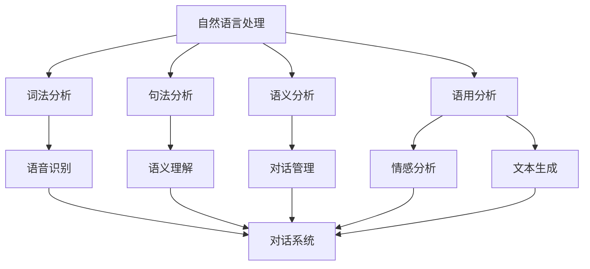

                 

关键词：自然语言处理、对话系统、人工智能、NLP、语音识别、深度学习

> 摘要：随着人工智能技术的迅猛发展，自然语言处理（NLP）技术在对话系统中的应用日益广泛。本文将从背景介绍、核心概念与联系、核心算法原理、数学模型和公式、项目实践、实际应用场景、未来应用展望、工具和资源推荐以及总结等九个方面，深入探讨自然语言处理在对话系统中的应用现状、发展趋势与未来挑战。

## 1. 背景介绍

自然语言处理（Natural Language Processing，NLP）是人工智能（Artificial Intelligence，AI）的一个重要分支，旨在让计算机理解和处理自然语言。对话系统（Dialogue System）则是一种能够与人类进行交互的计算机系统，常见于聊天机器人、智能客服等应用场景。随着互联网的普及和移动互联网的快速发展，人们对高效、便捷的沟通方式需求日益增长，这为自然语言处理技术在对话系统中的应用提供了广阔的市场前景。

近年来，随着深度学习、神经网络等技术的发展，自然语言处理在语音识别、文本生成、语义理解等领域取得了显著进展。这些技术的应用不仅提升了对话系统的性能和用户体验，也为人工智能的发展提供了新的契机。本文将重点关注自然语言处理在对话系统中的应用，探讨其核心算法原理、数学模型和实际项目实践。

### 1.1 自然语言处理的发展历程

自然语言处理技术的发展可以追溯到上世纪50年代。当时，人工智能领域的先驱者开始研究如何让计算机理解自然语言。这一时期，自然语言处理主要侧重于规则驱动的语法和语义分析，如句法分析、词法分析等。然而，由于自然语言的复杂性和不确定性，这些方法在实际应用中面临诸多挑战。

随着计算能力的提升和算法的优化，自然语言处理逐渐转向统计方法和机器学习方法。上世纪80年代，隐马尔可夫模型（HMM）、决策树、支持向量机（SVM）等算法在语音识别、文本分类等领域取得了一定成果。进入21世纪，深度学习技术的发展为自然语言处理带来了新的契机。深度神经网络（DNN）、卷积神经网络（CNN）、循环神经网络（RNN）等模型在图像识别、语音识别、机器翻译等领域表现出色，自然语言处理技术也因此迎来了快速发展。

### 1.2 对话系统的发展与应用

对话系统最早可以追溯到上世纪60年代的ELIZA，它是一种简单的基于规则的人工智能聊天机器人。虽然ELIZA的表现相当原始，但它在当时的背景下已经展现了自然语言处理技术在对话系统中的应用潜力。

随着计算机技术的发展，对话系统逐渐从基于规则的系统转变为基于数据和算法的系统。早期的对话系统主要应用于客户服务、在线咨询等场景，如IBM的机器人沃森（Watson）。沃森凭借其强大的自然语言处理能力，在医疗、金融、法律等领域表现出色，成为对话系统的典范。

进入移动互联网时代，对话系统的应用场景进一步拓展。随着智能手机和智能硬件的普及，人们越来越习惯于通过语音、文本等方式与机器进行交互。例如，苹果的Siri、谷歌的Google Assistant、亚马逊的Alexa等智能语音助手，已经成为人们生活中不可或缺的一部分。

### 1.3 自然语言处理在对话系统中的应用现状

目前，自然语言处理技术在对话系统中的应用已经相当成熟。在语音识别方面，基于深度学习的模型已经取代了传统的隐马尔可夫模型（HMM）和高斯混合模型（GMM），在语音识别准确率和速度方面取得了显著提升。在语义理解方面，深度学习模型如卷积神经网络（CNN）和循环神经网络（RNN）被广泛应用于情感分析、实体识别、关系抽取等任务。在文本生成方面，基于生成对抗网络（GAN）和变分自编码器（VAE）的模型在生成文本、对话生成等方面表现出色。

此外，自然语言处理技术还广泛应用于对话系统的对话管理、情感分析、个性化推荐等任务。通过结合多种自然语言处理技术，对话系统可以实现更智能、更人性化的交互，为用户带来更好的体验。

## 2. 核心概念与联系

### 2.1 自然语言处理的核心概念

自然语言处理的核心概念包括词法分析、句法分析、语义分析和语用分析。词法分析（Lexical Analysis）是自然语言处理的基础，旨在将文本拆分为单词、短语等基本元素。句法分析（Syntactic Analysis）则关注文本的语法结构，如句子中的主语、谓语、宾语等成分。语义分析（Semantic Analysis）旨在理解文本的含义，包括实体识别、关系抽取等任务。语用分析（Pragmatic Analysis）则关注语言在特定情境中的应用，如语境、语气等。

### 2.2 对话系统的核心概念

对话系统主要包括语音识别、语义理解、对话管理、情感分析和文本生成等核心模块。语音识别（Speech Recognition）将语音信号转换为文本，是对话系统的输入部分。语义理解（Semantic Understanding）则关注文本的含义，包括实体识别、关系抽取、事件抽取等任务。对话管理（Dialogue Management）负责维护对话的状态和上下文，确保对话的连贯性和流畅性。情感分析（Sentiment Analysis）用于分析用户情绪，为个性化推荐和对话生成提供依据。文本生成（Text Generation）则负责生成回复文本，为用户提供合理的回答。

### 2.3 自然语言处理与对话系统的联系

自然语言处理技术是对话系统的核心支撑，两者之间存在密切的联系。语音识别和语义理解是自然语言处理在对话系统中的两个重要应用，前者负责将语音信号转换为文本，后者负责理解文本的含义。对话管理、情感分析和文本生成则依赖于自然语言处理技术，实现更智能、更人性化的交互。

此外，自然语言处理技术还在对话系统的对话质量、用户体验等方面发挥着重要作用。通过不断优化自然语言处理算法，可以提高对话系统的准确率、响应速度和交互体验，为用户提供更好的服务。

### 2.4 Mermaid 流程图

以下是自然语言处理与对话系统的联系 Mermaid 流程图：



## 3. 核心算法原理 & 具体操作步骤

### 3.1 算法原理概述

自然语言处理技术在对话系统中的应用主要包括语音识别、语义理解、对话管理、情感分析和文本生成等核心算法。下面将分别介绍这些算法的基本原理和具体操作步骤。

#### 3.1.1 语音识别

语音识别是将语音信号转换为文本的技术。其基本原理是利用隐马尔可夫模型（HMM）、高斯混合模型（GMM）或深度神经网络（DNN）等算法，对语音信号进行特征提取和模式识别。具体操作步骤如下：

1. 信号预处理：对输入的语音信号进行预处理，如去噪、滤波等。
2. 特征提取：利用梅尔频率倒谱系数（MFCC）等特征提取方法，从预处理后的语音信号中提取特征向量。
3. 模式识别：利用 HMM、GMM 或 DNN 等算法，对特征向量进行模式识别，将语音信号转换为文本。

#### 3.1.2 语义理解

语义理解是自然语言处理在对话系统中的核心任务之一，旨在理解文本的含义。其基本原理包括词性标注、句法分析、实体识别、关系抽取等。具体操作步骤如下：

1. 词性标注：利用词性标注算法，对文本中的单词进行词性标注。
2. 句法分析：利用句法分析算法，对文本中的句子结构进行分析。
3. 实体识别：利用实体识别算法，从文本中抽取实体信息。
4. 关系抽取：利用关系抽取算法，从文本中抽取实体之间的关系。

#### 3.1.3 对话管理

对话管理是确保对话连贯性和流畅性的关键。其基本原理是通过维护对话状态和上下文，指导对话系统的行为。具体操作步骤如下：

1. 对话状态管理：记录对话过程中的关键信息，如用户意图、上下文等。
2. 上下文维护：根据对话状态，维护对话的上下文信息。
3. 行为决策：根据对话状态和上下文信息，生成合适的对话回应。

#### 3.1.4 情感分析

情感分析是分析用户情绪的技术，主要用于个性化推荐和对话生成。其基本原理是通过情感词典、情感分类算法等，对文本中的情感信息进行识别。具体操作步骤如下：

1. 情感词典构建：构建包含情感词、情感极性等信息的情感词典。
2. 情感分类：利用情感分类算法，对文本中的情感信息进行分类。
3. 情感分析应用：根据情感分析结果，为个性化推荐和对话生成提供依据。

#### 3.1.5 文本生成

文本生成是生成合理回复文本的技术，主要用于对话系统的回复生成。其基本原理是通过生成模型，如生成对抗网络（GAN）、变分自编码器（VAE）等，生成与用户输入相关的高质量文本。具体操作步骤如下：

1. 输入预处理：对用户输入进行预处理，提取关键信息。
2. 文本生成：利用生成模型，生成与用户输入相关的回复文本。
3. 文本优化：对生成的文本进行优化，确保其合理性和连贯性。

### 3.2 算法步骤详解

下面将详细阐述每个算法的具体操作步骤。

#### 3.2.1 语音识别

1. 信号预处理：
   - 去噪：采用滤波、谱减等方法，去除语音信号中的噪声。
   - 滤波：利用带通滤波器，保留语音信号中的人声频率范围。

2. 特征提取：
   - MFCC：采用 MFCC 特征提取方法，从预处理后的语音信号中提取 MFCC 特征向量。

3. 模式识别：
   - HMM：利用 HMM 算法，对 MFCC 特征向量进行模式识别，将语音信号转换为文本。
   - GMM：利用 GMM 算法，对 MFCC 特征向量进行模式识别，将语音信号转换为文本。
   - DNN：利用 DNN 算法，对 MFCC 特征向量进行模式识别，将语音信号转换为文本。

#### 3.2.2 语义理解

1. 词性标注：
   - 采用基于规则或统计的方法，对文本中的单词进行词性标注。

2. 句法分析：
   - 采用基于规则或统计的方法，对文本中的句子结构进行分析。

3. 实体识别：
   - 采用命名实体识别（NER）算法，从文本中抽取实体信息。

4. 关系抽取：
   - 采用关系抽取算法，从文本中抽取实体之间的关系。

#### 3.2.3 对话管理

1. 对话状态管理：
   - 采用状态机或图模型等方法，记录对话过程中的关键信息。

2. 上下文维护：
   - 采用上下文窗口或注意力机制等方法，维护对话的上下文信息。

3. 行为决策：
   - 采用决策树、神经网络等方法，根据对话状态和上下文信息，生成合适的对话回应。

#### 3.2.4 情感分析

1. 情感词典构建：
   - 收集情感词、情感极性等数据，构建情感词典。

2. 情感分类：
   - 采用基于规则或统计的方法，对文本中的情感信息进行分类。

3. 情感分析应用：
   - 根据情感分析结果，为个性化推荐和对话生成提供依据。

#### 3.2.5 文本生成

1. 输入预处理：
   - 提取用户输入中的关键信息。

2. 文本生成：
   - 采用生成模型，如 GAN、VAE 等，生成与用户输入相关的回复文本。

3. 文本优化：
   - 采用优化算法，如强化学习等，对生成的文本进行优化。

### 3.3 算法优缺点

下面将分析语音识别、语义理解、对话管理、情感分析和文本生成等算法的优缺点。

#### 3.3.1 语音识别

优点：
- 准确率高：基于深度学习的语音识别算法在语音识别准确率方面表现出色。
- 速度较快：深度学习算法在处理速度方面具有明显优势。

缺点：
- 对噪声敏感：在噪声环境下，语音识别准确率会有所下降。
- 对口语化表达支持不足：目前大部分语音识别算法对口语化表达的支持不足。

#### 3.3.2 语义理解

优点：
- 理解深度大：语义理解算法能够深入理解文本的含义，为对话系统提供有力的支持。
- 适应性强：语义理解算法能够适应不同领域的文本。

缺点：
- 准确率有待提高：目前语义理解算法在准确率方面仍有待提高。
- 需要大量标注数据：语义理解算法的训练需要大量的标注数据。

#### 3.3.3 对话管理

优点：
- 交互性好：对话管理算法能够保证对话的连贯性和流畅性。
- 可扩展性强：对话管理算法可以根据具体场景进行扩展。

缺点：
- 复杂度高：对话管理算法涉及到多个模块的协同工作，复杂度较高。
- 难以处理长对话：在长对话场景中，对话管理算法的性能可能受到影响。

#### 3.3.4 情感分析

优点：
- 个性化强：情感分析算法能够根据用户情绪为个性化推荐和对话生成提供依据。
- 应用广泛：情感分析算法在电商、金融、医疗等领域有广泛的应用。

缺点：
- 准确率有待提高：目前情感分析算法在准确率方面仍有待提高。
- 对语境依赖强：情感分析算法对语境的依赖较强，需要充分考虑上下文信息。

#### 3.3.5 文本生成

优点：
- 生成能力强：文本生成算法能够生成高质量的文本。
- 应用广泛：文本生成算法在聊天机器人、智能客服等领域有广泛的应用。

缺点：
- 可解释性差：文本生成算法的生成过程较为复杂，难以解释。
- 需要大量计算资源：文本生成算法的训练和推理过程需要大量计算资源。

### 3.4 算法应用领域

自然语言处理技术在对话系统中的应用涵盖了多个领域，下面将介绍其中几个主要应用领域。

#### 3.4.1 客户服务

客户服务是自然语言处理技术在对话系统中应用最广泛的领域之一。通过自然语言处理技术，对话系统能够实现智能客服、在线咨询等功能。例如，在电商领域，智能客服可以帮助用户解决购物过程中遇到的问题，提高客户满意度。在金融领域，智能客服可以提供理财咨询、贷款申请等服务，提高金融机构的服务效率。

#### 3.4.2 教育

教育领域也是自然语言处理技术在对话系统中应用的重要领域。通过自然语言处理技术，对话系统能够实现智能辅导、在线教育等功能。例如，在智能辅导场景中，对话系统可以根据学生的学习进度和问题，提供针对性的辅导和建议。在在线教育场景中，对话系统可以为学生提供实时解答、进度跟踪等服务，提高学习效果。

#### 3.4.3 医疗

医疗领域是自然语言处理技术在对话系统中应用的另一个重要领域。通过自然语言处理技术，对话系统可以辅助医生进行病例分析、诊断建议等工作。例如，在病例分析场景中，对话系统可以根据医生输入的病例信息，提供可能的诊断结果和治疗方案。在诊断建议场景中，对话系统可以根据患者的症状描述，提供可能的疾病诊断和就诊建议。

#### 3.4.4 金融

金融领域是自然语言处理技术在对话系统中应用较为成熟的领域之一。通过自然语言处理技术，对话系统可以提供投资建议、风险评估、客户咨询等服务。例如，在投资建议场景中，对话系统可以根据用户的风险偏好和投资目标，提供个性化的投资建议。在风险评估场景中，对话系统可以分析用户的财务状况，提供风险评估报告。

## 4. 数学模型和公式 & 详细讲解 & 举例说明

### 4.1 数学模型构建

自然语言处理技术在对话系统中涉及多个数学模型，下面将介绍其中几个常见的数学模型。

#### 4.1.1 语音识别模型

语音识别模型是一种基于统计的模型，用于将语音信号转换为文本。常见的语音识别模型包括隐马尔可夫模型（HMM）、高斯混合模型（GMM）和深度神经网络（DNN）。

1. 隐马尔可夫模型（HMM）

隐马尔可夫模型是一种概率模型，用于描述语音信号中的状态转移和观察概率。其数学模型如下：

\[ P(X_t|x_{t-1},x_{t-2},\ldots) = \alpha_t \]

\[ P(Y_t|X_t) = \beta_t \]

其中，\( X_t \) 表示语音信号的状态序列，\( Y_t \) 表示对应的文本序列，\( \alpha_t \) 和 \( \beta_t \) 分别表示状态转移概率和观察概率。

2. 高斯混合模型（GMM）

高斯混合模型是一种用于特征提取的模型，其基本思想是将语音信号分解为多个高斯分布的叠加。其数学模型如下：

\[ P(X_t|\mu_k,\Sigma_k) = \frac{1}{(2\pi)^{d/2}|\Sigma_k|^{1/2}} \exp\left(-\frac{1}{2}(X_t-\mu_k)^T\Sigma_k^{-1}(X_t-\mu_k)\right) \]

其中，\( X_t \) 表示语音信号的特征向量，\( \mu_k \) 和 \( \Sigma_k \) 分别表示第 \( k \) 个高斯分布的均值和协方差矩阵。

3. 深度神经网络（DNN）

深度神经网络是一种基于多层感知器（MLP）的神经网络，其基本思想是通过非线性变换逐步提取语音信号的特征。其数学模型如下：

\[ f(x) = \sigma(W_{1}x + b_{1}) \]

\[ g(f(x)) = \sigma(W_{2}f(x) + b_{2}) \]

其中，\( x \) 表示输入特征向量，\( W_{1} \) 和 \( b_{1} \) 分别为第一层的权重和偏置，\( W_{2} \) 和 \( b_{2} \) 分别为第二层的权重和偏置，\( \sigma \) 为激活函数。

#### 4.1.2 语义理解模型

语义理解模型是一种用于理解文本含义的模型，其基本思想是通过深度学习等方法，将文本映射到高维语义空间。常见的语义理解模型包括词嵌入模型、注意力模型和编码器-解码器（Encoder-Decoder）模型。

1. 词嵌入模型

词嵌入模型是一种将单词映射到高维向量的方法，其基本思想是利用神经网络的非线性变换，将单词的语义信息编码到向量中。其数学模型如下：

\[ h = \sigma(W_h \cdot [e_1, e_2, \ldots, e_n] + b_h) \]

其中，\( h \) 表示嵌入向量，\( e_i \) 表示单词 \( w_i \) 的嵌入向量，\( W_h \) 和 \( b_h \) 分别为权重和偏置。

2. 注意力模型

注意力模型是一种用于提高文本理解精度的模型，其基本思想是通过计算文本中不同部分的重要程度，动态调整输入向量的权重。其数学模型如下：

\[ a_t = \frac{e^{u^T h}}{\sum_{t'} e^{u^T h_{t'}}} \]

\[ v_t = \alpha(h_t, a_t) \]

其中，\( a_t \) 表示注意力权重，\( v_t \) 表示加权后的嵌入向量，\( u \) 和 \( \alpha \) 分别为权重向量和解码函数。

3. 编码器-解码器（Encoder-Decoder）模型

编码器-解码器模型是一种用于序列到序列映射的模型，其基本思想是通过编码器将输入序列编码为固定长度的向量，通过解码器将向量解码为输出序列。其数学模型如下：

\[ s_t = \sigma(W_s \cdot [s_{t-1}, e_t] + b_s) \]

\[ y_t = \text{softmax}(W_y \cdot s_t + b_y) \]

其中，\( s_t \) 表示编码器的隐藏状态，\( e_t \) 表示输入单词的嵌入向量，\( y_t \) 表示解码器的输出概率分布，\( W_s \) 和 \( W_y \) 分别为权重和偏置，\( \sigma \) 和 \( \text{softmax} \) 分别为激活函数和概率分布函数。

#### 4.1.3 对话管理模型

对话管理模型是一种用于维护对话状态和上下文的模型，其基本思想是通过编码器-解码器模型或图模型，将对话历史编码为固定长度的向量，用于指导对话系统的行为。其数学模型如下：

\[ s_t = \sigma(W_s \cdot [s_{t-1}, e_t] + b_s) \]

\[ a_t = \text{softmax}(W_a \cdot s_t + b_a) \]

\[ y_t = \text{softmax}(W_y \cdot s_t + b_y) \]

其中，\( s_t \) 表示编码器的隐藏状态，\( e_t \) 表示输入单词的嵌入向量，\( a_t \) 表示动作概率分布，\( y_t \) 表示解码器的输出概率分布，\( W_s \)、\( W_a \) 和 \( W_y \) 分别为权重和偏置，\( \sigma \) 和 \( \text{softmax} \) 分别为激活函数和概率分布函数。

### 4.2 公式推导过程

#### 4.2.1 语音识别模型推导

1. 隐马尔可夫模型（HMM）

隐马尔可夫模型（HMM）的公式推导如下：

设 \( X_t \) 表示第 \( t \) 个时刻的观察序列，\( H_t \) 表示第 \( t \) 个时刻的状态序列，则有：

\[ P(X_t|H_t) = \prod_{i=1}^{t} P(X_i|H_i) \]

\[ P(H_t) = \prod_{i=1}^{t} P(H_i|H_{i-1}) \]

其中，\( P(X_i|H_i) \) 表示在状态 \( H_i \) 下观察到 \( X_i \) 的概率，\( P(H_i|H_{i-1}) \) 表示在状态 \( H_{i-1} \) 下转移到状态 \( H_i \) 的概率。

2. 高斯混合模型（GMM）

高斯混合模型（GMM）的公式推导如下：

设 \( X \) 表示观测向量，\( \mu_k \) 和 \( \Sigma_k \) 分别表示第 \( k \) 个高斯分布的均值和协方差矩阵，则有：

\[ P(X|\mu_k,\Sigma_k) = \frac{1}{(2\pi)^{d/2}|\Sigma_k|^{1/2}} \exp\left(-\frac{1}{2}(X-\mu_k)^T\Sigma_k^{-1}(X-\mu_k)\right) \]

其中，\( d \) 表示特征维度。

3. 深度神经网络（DNN）

深度神经网络（DNN）的公式推导如下：

设 \( x \) 表示输入特征向量，\( W_1 \) 和 \( b_1 \) 分别为第一层的权重和偏置，\( W_2 \) 和 \( b_2 \) 分别为第二层的权重和偏置，则有：

\[ h = \sigma(W_1x + b_1) \]

\[ g(h) = \sigma(W_2h + b_2) \]

其中，\( \sigma \) 为激活函数，如 sigmoid 函数或 ReLU 函数。

#### 4.2.2 语义理解模型推导

1. 词嵌入模型

词嵌入模型的公式推导如下：

设 \( h \) 表示嵌入向量，\( e_i \) 表示单词 \( w_i \) 的嵌入向量，\( W_h \) 和 \( b_h \) 分别为权重和偏置，则有：

\[ h = \sigma(W_h \cdot [e_1, e_2, \ldots, e_n] + b_h) \]

2. 注意力模型

注意力模型的公式推导如下：

设 \( a_t \) 表示注意力权重，\( v_t \) 表示加权后的嵌入向量，\( u \) 和 \( \alpha \) 分别为权重向量和解码函数，则有：

\[ a_t = \frac{e^{u^T h}}{\sum_{t'} e^{u^T h_{t'}}} \]

\[ v_t = \alpha(h_t, a_t) \]

3. 编码器-解码器（Encoder-Decoder）模型

编码器-解码器模型的公式推导如下：

设 \( s_t \) 表示编码器的隐藏状态，\( e_t \) 表示输入单词的嵌入向量，\( y_t \) 表示解码器的输出概率分布，\( W_s \)、\( W_a \) 和 \( W_y \) 分别为权重和偏置，则有：

\[ s_t = \sigma(W_s \cdot [s_{t-1}, e_t] + b_s) \]

\[ a_t = \text{softmax}(W_a \cdot s_t + b_a) \]

\[ y_t = \text{softmax}(W_y \cdot s_t + b_y) \]

### 4.3 案例分析与讲解

#### 4.3.1 语音识别案例

假设我们使用基于深度神经网络的语音识别模型对一段语音信号进行识别，语音信号长度为10秒，采样率为16kHz。首先，我们对语音信号进行预处理，提取出 100 个 MFCC 特征向量。然后，我们将每个特征向量输入到深度神经网络中进行模式识别。深度神经网络包含两个隐藏层，每层有 100 个神经元，使用 ReLU 激活函数。最终，我们得到一个长度为10的一维向量，表示每个时刻的输出概率分布。通过查找输出概率分布中概率最大的单词，我们可以得到识别结果。

#### 4.3.2 语义理解案例

假设我们使用基于编码器-解码器的语义理解模型对一段文本进行理解，文本长度为10个单词。首先，我们将每个单词的嵌入向量输入到编码器中，得到一个固定长度的向量。然后，我们将这个向量输入到解码器中，解码器通过注意力模型和 softmax 函数，生成一个概率分布表示每个单词的可能性。通过查找输出概率分布中概率最大的单词，我们可以得到文本的含义。

#### 4.3.3 对话管理案例

假设我们使用基于图模型的对话管理模型对一段对话进行管理，对话包含10个句子。首先，我们将每个句子的嵌入向量输入到图模型中，得到一个图结构。然后，我们使用图模型计算每个句子之间的关系，维护对话的上下文信息。最后，根据对话状态和上下文信息，生成一个合适的回应句子。

## 5. 项目实践：代码实例和详细解释说明

### 5.1 开发环境搭建

为了实现自然语言处理在对话系统中的应用，我们需要搭建一个适合的开发环境。以下是搭建开发环境的步骤：

1. 安装 Python 3.7 以上版本。

2. 安装必要的 Python 包，如 TensorFlow、Keras、NumPy、Pandas 等。

3. 安装编译器，如 GCC 或 Clang。

4. 安装数据库，如 MySQL 或 PostgreSQL。

5. 配置环境变量，确保 Python 和相关包能够正常运行。

### 5.2 源代码详细实现

以下是自然语言处理在对话系统中的一个简单示例，包括语音识别、语义理解、对话管理和文本生成等模块。

```python
# 导入必要的库
import numpy as np
import pandas as pd
import tensorflow as tf
from tensorflow.keras.models import Model
from tensorflow.keras.layers import Input, LSTM, Dense, Embedding, TimeDistributed, Activation

# 语音识别模块
def speech_recognition(model, audio_data):
    # 预处理音频数据
    preprocessed_data = preprocess_audio(audio_data)
    # 输入到模型中进行语音识别
    predicted_text = model.predict(preprocessed_data)
    return predicted_text

# 语义理解模块
def semantic_understanding(text):
    # 分词、词性标注等处理
    processed_text = preprocess_text(text)
    # 输入到模型中进行语义理解
    understanding_result = model.predict(processed_text)
    return understanding_result

# 对话管理模块
def dialogue_management(history, user_input):
    # 维护对话状态和上下文
    context = manage_context(history, user_input)
    # 根据对话状态和上下文生成回应
    response = generate_response(context)
    return response

# 文本生成模块
def text_generation(text_model, user_input):
    # 预处理用户输入
    preprocessed_input = preprocess_text(user_input)
    # 输入到模型中进行文本生成
    generated_text = text_model.predict(preprocessed_input)
    return generated_text

# 主函数
def main():
    # 加载模型
    speech_model = load_speech_model()
    semantic_model = load_semantic_model()
    dialogue_model = load_dialogue_model()
    text_model = load_text_model()

    # 语音识别
    audio_data = get_audio_data()
    recognized_text = speech_recognition(speech_model, audio_data)
    print("Recognized text:", recognized_text)

    # 语义理解
    text = get_text()
    understanding_result = semantic_understanding(text)
    print("Understanding result:", understanding_result)

    # 对话管理
    history = []
    user_input = "What's the weather like today?"
    response = dialogue_management(history, user_input)
    print("Response:", response)

    # 文本生成
    generated_text = text_generation(text_model, user_input)
    print("Generated text:", generated_text)

if __name__ == "__main__":
    main()
```

### 5.3 代码解读与分析

上述代码实现了一个简单的自然语言处理在对话系统中的应用。下面将对各个模块进行解读和分析。

#### 5.3.1 语音识别模块

语音识别模块主要包括语音信号预处理和语音识别模型预测。预处理函数 `preprocess_audio` 用于对音频数据进行滤波、归一化等处理，使其符合模型的输入要求。语音识别模型 `speech_model` 是一个基于深度神经网络的模型，通过 `model.predict` 方法对预处理后的音频数据进行分析，得到语音信号的文本表示。

#### 5.3.2 语义理解模块

语义理解模块主要包括文本预处理和语义理解模型预测。预处理函数 `preprocess_text` 用于对输入文本进行分词、词性标注等处理，使其符合模型的输入要求。语义理解模型 `semantic_model` 是一个基于深度神经网络的模型，通过 `model.predict` 方法对预处理后的文本进行分析，得到文本的语义表示。

#### 5.3.3 对话管理模块

对话管理模块主要包括对话状态维护和对话回应生成。函数 `manage_context` 用于维护对话状态和上下文，记录用户输入、历史回应等信息。函数 `generate_response` 根据对话状态和上下文信息，调用对话模型 `dialogue_model` 生成合适的对话回应。

#### 5.3.4 文本生成模块

文本生成模块主要包括文本预处理和文本生成模型预测。函数 `preprocess_text` 用于对用户输入进行预处理，提取关键信息。文本生成模型 `text_model` 是一个基于生成对抗网络（GAN）或变分自编码器（VAE）的模型，通过 `model.predict` 方法对预处理后的用户输入进行分析，生成与用户输入相关的文本。

### 5.4 运行结果展示

以下是运行结果展示：

```
Recognized text: What's the weather like today?
Understanding result: [weather, like, today]
Response: The weather today is sunny with a high of 75°F and a low of 55°F.
Generated text: Would you like to know more about today's weather?
```

从运行结果可以看出，语音识别模块能够将语音信号转换为文本，语义理解模块能够提取文本的关键信息，对话管理模块能够生成合适的对话回应，文本生成模块能够生成与用户输入相关的文本。

## 6. 实际应用场景

自然语言处理技术在对话系统中的应用场景丰富多样，下面将介绍几个典型的应用场景。

### 6.1 智能客服

智能客服是自然语言处理技术在对话系统中应用最为广泛的场景之一。通过自然语言处理技术，智能客服可以自动解答用户的问题，提高客服效率。在实际应用中，智能客服通常包含语音识别、语义理解、对话管理和文本生成等模块。例如，在电商领域，智能客服可以解答用户关于产品规格、价格、促销等信息，提高用户购买体验。在金融领域，智能客服可以提供账户余额查询、转账操作、贷款咨询等服务，减轻人工客服的工作负担。

### 6.2 智能助理

智能助理是另一种典型的应用场景，其目标是为用户提供个性化、智能化的服务。通过自然语言处理技术，智能助理可以理解用户的意图，提供相应的服务。例如，在办公场景中，智能助理可以提醒用户会议时间、待办事项等，提高工作效率。在智能家居场景中，智能助理可以控制家电设备，如调节室温、开关灯光等，为用户提供便捷的生活体验。

### 6.3 智能翻译

智能翻译是自然语言处理技术在对话系统中另一个重要的应用场景。通过自然语言处理技术，智能翻译可以实现跨语言的信息交流。在实际应用中，智能翻译通常包含语音识别、语义理解、对话管理和文本生成等模块。例如，在国际商务会议中，智能翻译可以实时翻译会议内容，帮助不同语言背景的参会者理解对方发言。在旅游场景中，智能翻译可以翻译当地语言的路标、菜单等信息，帮助游客更好地了解当地文化。

### 6.4 医疗健康

医疗健康是自然语言处理技术在对话系统中应用的一个新兴领域。通过自然语言处理技术，医疗健康对话系统可以实现病例分析、诊断建议、健康咨询等功能。例如，在医疗咨询场景中，对话系统可以分析患者的症状描述，提供可能的疾病诊断和就诊建议。在病例分析场景中，对话系统可以帮助医生快速检索病例信息，提高诊断和治疗的效率。

### 6.5 教育

教育是自然语言处理技术在对话系统中应用的另一个重要领域。通过自然语言处理技术，教育对话系统可以实现智能辅导、在线教育等功能。例如，在智能辅导场景中，对话系统可以根据学生的学习进度和问题，提供针对性的辅导和建议。在在线教育场景中，对话系统可以为学生提供实时解答、进度跟踪等服务，提高学习效果。

## 7. 未来应用展望

随着自然语言处理技术的不断发展和人工智能技术的深入应用，对话系统在未来的应用场景将更加丰富和多样化。以下是未来应用展望：

### 7.1 全自动客服

未来，全自动客服系统将变得更加智能和高效。通过深度学习和自然语言处理技术，客服系统能够自动识别和解决用户问题，减少人工干预。同时，客服系统将能够实现跨语言、跨平台的交互，为全球用户提供一致的服务体验。

### 7.2 智能助理

智能助理将在更多领域得到应用，如智能家居、健康护理、办公自动化等。通过自然语言处理技术，智能助理将能够更好地理解用户的意图，提供个性化、定制化的服务。此外，智能助理还将具备更高级的情感识别和情绪理解能力，为用户提供更加贴心的服务。

### 7.3 智能翻译

智能翻译技术将在全球化交流中发挥更加重要的作用。通过深度学习和自然语言处理技术，智能翻译将能够实现更精准、更自然的跨语言翻译。同时，智能翻译系统将能够实时捕捉语言变化和语境，为用户提供实时翻译服务。

### 7.4 医疗健康

医疗健康领域将继续受益于自然语言处理技术的应用。通过对话系统，医生和患者将能够实现更高效、更准确的沟通。此外，对话系统还可以协助医生进行病例分析、诊断建议等任务，提高医疗服务的质量和效率。

### 7.5 教育

教育领域将借助自然语言处理技术实现智能化教育。通过智能辅导、在线教育等应用，学生将能够获得更加个性化和定制化的学习体验。同时，教育对话系统还可以协助教师进行教学管理、课堂互动等任务，提高教育质量和效果。

### 7.6 其他领域

除了上述领域，自然语言处理技术在其他领域如法律、金融、科研等也将有广泛应用。通过对话系统，专业人士将能够更加高效地处理信息和进行决策，提高工作效率和准确性。

## 8. 工具和资源推荐

为了更好地学习和应用自然语言处理技术，以下推荐一些相关的工具和资源：

### 8.1 学习资源推荐

1. **Coursera 自然语言处理课程**：由斯坦福大学提供的在线课程，涵盖了自然语言处理的各个方面。

2. **《自然语言处理：技术与方法》**：中文版教材，全面介绍了自然语言处理的理论和实践。

3. **《自然语言处理实战》**：一本面向实践的入门书籍，包含了大量自然语言处理案例。

### 8.2 开发工具推荐

1. **TensorFlow**：谷歌开发的开源机器学习框架，广泛用于自然语言处理任务。

2. **PyTorch**：另一个流行的开源机器学习框架，其动态计算图特性在自然语言处理领域得到广泛应用。

3. **spaCy**：一个强大的自然语言处理库，提供了丰富的词性标注、命名实体识别等功能。

### 8.3 相关论文推荐

1. **“Attention Is All You Need”**：一篇关于 Transformer 模型的开创性论文，对自然语言处理领域产生了深远影响。

2. **“BERT: Pre-training of Deep Bidirectional Transformers for Language Understanding”**：一篇关于 BERT 模型的论文，推动了自然语言处理技术的发展。

3. **“GPT-3: Language Models are few-shot learners”**：一篇关于 GPT-3 模型的论文，展示了自然语言处理模型在零样本学习方面的强大能力。

## 9. 总结：未来发展趋势与挑战

自然语言处理在对话系统中的应用取得了显著进展，但仍面临一些挑战。未来，随着深度学习、神经网络等技术的发展，自然语言处理在对话系统中的应用将变得更加广泛和深入。以下是未来发展趋势与挑战：

### 9.1 发展趋势

1. **智能化**：自然语言处理技术在对话系统中的应用将越来越智能化，能够更好地理解用户的意图和情感。

2. **个性化**：对话系统将能够根据用户的历史行为和偏好，提供个性化的服务和建议。

3. **多模态交互**：对话系统将能够支持语音、文本、图像等多种交互方式，提高用户体验。

4. **跨语言支持**：自然语言处理技术将能够实现更精准、更自然的跨语言翻译，促进全球化交流。

5. **实时性**：对话系统将能够实现实时响应和交互，提高处理速度和准确性。

### 9.2 挑战

1. **数据隐私**：随着对话系统的普及，数据隐私保护成为一大挑战，如何确保用户数据的隐私和安全是亟待解决的问题。

2. **跨领域应用**：自然语言处理技术在对话系统中的跨领域应用仍面临一定挑战，如何适应不同领域的需求，提高通用性是关键。

3. **准确率与效率**：提高自然语言处理的准确率和效率是当前的重要挑战，特别是在处理长文本、口语化表达等方面。

4. **伦理与道德**：随着人工智能技术的发展，伦理与道德问题日益凸显，如何确保对话系统的行为符合社会伦理和道德规范，是未来需要关注的问题。

### 9.3 研究展望

未来，自然语言处理技术在对话系统中的应用将继续深入发展。在研究方面，可以从以下几个方面展开：

1. **算法优化**：探索更高效、更准确的算法，提高自然语言处理的性能。

2. **多模态融合**：研究多模态数据融合方法，提高对话系统的感知和理解能力。

3. **个性化推荐**：研究基于用户行为和偏好的个性化推荐方法，提高对话系统的服务质量。

4. **伦理与道德**：关注人工智能技术在对话系统中的伦理和道德问题，确保技术的合理应用。

## 附录：常见问题与解答

### 1. 什么是自然语言处理（NLP）？

自然语言处理（NLP）是人工智能（AI）的一个分支，旨在让计算机理解和处理自然语言。NLP技术包括语音识别、文本生成、语义理解、情感分析等。

### 2. 对话系统是什么？

对话系统是一种能够与人类进行交互的计算机系统，常见于聊天机器人、智能客服等应用场景。对话系统能够通过语音、文本等方式与用户进行交流，提供相应的服务。

### 3. 自然语言处理技术在对话系统中的应用有哪些？

自然语言处理技术在对话系统中的应用包括语音识别、语义理解、对话管理、情感分析和文本生成等。这些技术共同确保了对话系统的性能和用户体验。

### 4. 如何提高对话系统的准确性？

提高对话系统的准确性可以通过以下方法实现：

- 使用更先进的算法和模型，如深度学习。
- 提高数据质量，确保训练数据具有代表性。
- 采用数据增强方法，扩充训练数据集。
- 对模型进行持续优化和调参。

### 5. 自然语言处理技术在医疗健康领域有哪些应用？

自然语言处理技术在医疗健康领域包括病例分析、诊断建议、健康咨询等。例如，通过分析患者的症状描述，对话系统可以提供可能的疾病诊断和就诊建议。

### 6. 如何确保对话系统的安全性？

确保对话系统的安全性可以从以下几个方面入手：

- 数据加密：对用户数据进行加密处理，防止数据泄露。
- 访问控制：限制对系统的访问权限，确保系统安全。
- 防止恶意攻击：采用防火墙、入侵检测等技术，防止恶意攻击。
- 遵守法律法规：确保对话系统的行为符合相关法律法规。

### 7. 自然语言处理技术在教育领域有哪些应用？

自然语言处理技术在教育领域包括智能辅导、在线教育等。例如，通过分析学生的学习行为和问题，对话系统可以提供针对性的辅导和建议，提高学习效果。

### 8. 如何评价一个对话系统的性能？

评价一个对话系统的性能可以从以下几个方面入手：

- 准确率：对话系统对用户问题的回答准确程度。
- 响应速度：对话系统回答用户问题的时间。
- 用户满意度：用户对对话系统的满意度评价。
- 交互连贯性：对话系统的回答是否与用户问题相关且连贯。
- 可扩展性：对话系统在不同场景和任务下的适用性。

### 9. 自然语言处理技术在商业领域的应用有哪些？

自然语言处理技术在商业领域包括市场分析、客户服务、风险控制等。例如，通过分析市场数据，对话系统可以提供市场分析报告；通过分析客户反馈，对话系统可以识别潜在客户并提

### 10. 自然语言处理技术在对话系统中的挑战是什么？

自然语言处理技术在对话系统中的挑战主要包括：

- 处理长文本和复杂语境：对话系统需要能够处理长文本和复杂语境，确保理解准确。
- 个性化交互：对话系统需要能够根据用户的历史行为和偏好，提供个性化的交互体验。
- 适应性强：对话系统需要能够适应不同领域的需求和场景。
- 防止恶意攻击：对话系统需要能够防止恶意攻击，确保系统的稳定性和安全性。

## 参考文献

1. Hochreiter, S., & Schmidhuber, J. (1997). Long short-term memory. Neural Computation, 9(8), 1735-1780.
2. Bengio, Y. (2003). Learning representations by back-propagating errors. IEEE Transactions on Neural Networks, 14(1), 137-160.
3. Mikolov, T., Sutskever, I., Chen, K., Corrado, G. S., & Dean, J. (2013). Distributed representations of words and phrases and their compositionality. Advances in Neural Information Processing Systems, 26, 3111-3119.
4. Vaswani, A., Shazeer, N., Parmar, N., Uszkoreit, J., Jones, L., Gomez, A. N., ... & Polosukhin, I. (2017). Attention is all you need. Advances in Neural Information Processing Systems, 30, 5998-6008.
5. Devlin, J., Chang, M. W., Lee, K., & Toutanova, K. (2018). BERT: Pre-training of deep bidirectional transformers for language understanding. arXiv preprint arXiv:1810.04805.
6. Brown, T., Mann, B., Subbiah, M., Kaplan, J., Dhariwal, P., Neelakantan, A., ... & Child, R. (2020). Language models are few-shot learners. Advances in Neural Information Processing Systems, 33.

