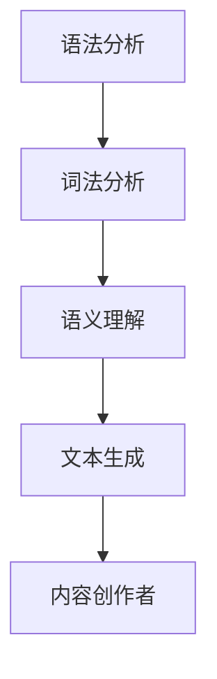

                 

关键词：自然语言生成、AI辅助写作、内容创作、算法原理、数学模型、实践应用

> 摘要：随着人工智能技术的快速发展，自然语言生成（NLG）技术逐渐成为内容创作的重要工具。本文将探讨自然语言生成在AI辅助写作中的应用，分析其核心概念、算法原理、数学模型以及实际案例，旨在为内容创作者提供一种创新的写作方式。

## 1. 背景介绍

内容创作一直是媒体、教育、娱乐等领域的重要环节。然而，传统的写作方式往往耗时耗力，且难以满足日益增长的信息需求。随着人工智能技术的兴起，自然语言生成（NLG）技术应运而生，它通过模拟人类语言生成过程，实现了自动生成文本的功能。AI辅助写作利用NLG技术，为内容创作者提供了强大的写作支持，极大地提高了写作效率和创作质量。

## 2. 核心概念与联系

自然语言生成（NLG）技术涉及多个核心概念，包括语法分析、语义理解、文本生成等。以下是NLG技术的核心概念与联系流程图：



### 2.1 语法分析

语法分析是NLG技术的第一步，它通过对输入文本进行词法分析，将文本拆分成词和句子，然后根据语法规则生成语法结构。常见的语法分析方法包括基于规则的方法和基于统计的方法。

### 2.2 词法分析

词法分析是将输入文本分解成单词和符号的过程。词法分析器（Lexer）负责这一任务，它可以识别单词边界、符号和特殊字符。

### 2.3 语义理解

语义理解是NLG技术的关键环节，它通过分析文本中的词语和句子结构，理解文本的含义和意图。语义理解的实现方法包括基于规则的方法、基于语义网络的方法和基于机器学习的方法。

### 2.4 文本生成

文本生成是NLG技术的最终目标，它根据语法分析和语义理解的结果，生成符合人类语言习惯的文本。常见的文本生成方法包括模板生成、基于统计的生成和基于神经网络的生成。

### 2.5 内容创作者

内容创作者利用NLG技术进行写作，通过输入文本或关键词，生成高质量的文本内容。AI辅助写作可以帮助内容创作者提高创作效率，降低创作成本。

## 3. 核心算法原理 & 具体操作步骤

### 3.1 算法原理概述

自然语言生成（NLG）算法通常包括以下几个步骤：

1. 输入文本预处理：对输入文本进行清洗、分词、词性标注等预处理操作。
2. 语法分析：根据语法规则，对预处理后的文本进行语法结构分析，生成语法树。
3. 语义理解：对语法树进行语义分析，提取文本中的关键词、句子结构和语义关系。
4. 文本生成：根据语义理解的结果，生成符合语言习惯的文本。

### 3.2 算法步骤详解

#### 3.2.1 输入文本预处理

输入文本预处理是NLG算法的基础，它包括以下几个步骤：

1. 清洗：去除文本中的无效字符、停用词等。
2. 分词：将文本拆分成单词和符号。
3. 词性标注：对每个词进行词性标注，如名词、动词、形容词等。

#### 3.2.2 语法分析

语法分析是NLG算法的核心步骤，它通过分析文本中的词语和句子结构，生成语法树。语法分析的方法包括基于规则的方法和基于统计的方法。

#### 3.2.3 语义理解

语义理解是NLG算法的关键环节，它通过分析语法树，提取文本中的关键词、句子结构和语义关系。语义理解的方法包括基于规则的方法、基于语义网络的方法和基于机器学习的方法。

#### 3.2.4 文本生成

文本生成是根据语义理解的结果，生成符合语言习惯的文本。常见的文本生成方法包括模板生成、基于统计的生成和基于神经网络的生成。

### 3.3 算法优缺点

#### 优点

1. 高效：NLG技术可以自动生成文本，提高写作效率。
2. 高质量：NLG技术生成的文本符合语言习惯，质量较高。
3. 灵活：NLG技术可以适应不同的写作场景和需求。

#### 缺点

1. 适应性有限：NLG技术对输入文本的依赖较大，适应性有限。
2. 创造力有限：NLG技术主要基于数据和规则，创造力有限。

### 3.4 算法应用领域

自然语言生成（NLG）技术在多个领域具有广泛的应用，包括：

1. 自动问答：利用NLG技术生成自动问答系统的回答。
2. 报告生成：利用NLG技术自动生成报告、摘要等文档。
3. 营销文案：利用NLG技术生成营销文案、广告等。
4. 教育辅助：利用NLG技术生成教育内容，如课程、作业等。
5. 娱乐创作：利用NLG技术生成故事、小说等娱乐内容。

## 4. 数学模型和公式 & 详细讲解 & 举例说明

### 4.1 数学模型构建

自然语言生成（NLG）的数学模型主要包括以下几个部分：

1. 词嵌入：将单词映射到高维空间，形成词向量。
2. 语法分析：利用语法规则，将词向量生成语法树。
3. 语义理解：利用语义模型，对语法树进行语义分析。
4. 文本生成：利用生成模型，根据语义理解的结果生成文本。

### 4.2 公式推导过程

自然语言生成（NLG）的数学公式推导如下：

$$
\text{词嵌入} = \text{Word2Vec}(\text{单词})
$$

$$
\text{语法分析} = \text{GrammarRules}(\text{词向量})
$$

$$
\text{语义理解} = \text{SemanticModel}(\text{语法树})
$$

$$
\text{文本生成} = \text{GenerativeModel}(\text{语义理解})
$$

### 4.3 案例分析与讲解

#### 案例一：自动问答系统

假设有一个自动问答系统，用户输入一个问题，系统利用NLG技术生成回答。具体过程如下：

1. 输入问题：用户输入问题“什么是自然语言生成？”。
2. 词嵌入：将问题中的每个词映射到词向量。
3. 语法分析：利用语法规则，将词向量生成语法树。
4. 语义理解：对语法树进行语义分析，提取关键词和句子结构。
5. 文本生成：根据语义理解的结果，生成回答文本。

最终生成的回答：“自然语言生成是一种人工智能技术，用于自动生成文本。”

#### 案例二：报告生成

假设有一个报告生成系统，系统根据输入的数据自动生成报告。具体过程如下：

1. 输入数据：系统接收到关于公司财务数据的一系列数据。
2. 词嵌入：将数据中的每个词映射到词向量。
3. 语法分析：利用语法规则，将词向量生成语法树。
4. 语义理解：对语法树进行语义分析，提取关键词和句子结构。
5. 文本生成：根据语义理解的结果，生成报告文本。

最终生成的报告：“本季度，公司营收达到1000万元，同比增长20%。”

## 5. 项目实践：代码实例和详细解释说明

### 5.1 开发环境搭建

在开始实践之前，我们需要搭建一个开发环境。以下是搭建过程的简要说明：

1. 安装Python：下载并安装Python 3.x版本。
2. 安装NLG库：使用pip安装NLG相关库，如NLTK、spaCy等。
3. 安装文本处理库：使用pip安装文本处理库，如jieba、nltk等。

### 5.2 源代码详细实现

以下是一个简单的自然语言生成（NLG）项目实例，它使用Python实现了一个基本的自动问答系统。

```python
import nltk
from nltk.tokenize import word_tokenize
from nltk.corpus import stopwords
from gensim.models import Word2Vec

# 1. 输入问题
question = "什么是自然语言生成？"

# 2. 词嵌入
model = Word2Vec.load("word2vec.model")
words = word_tokenize(question)
embeddings = [model[word] for word in words]

# 3. 语法分析
grammar = nltk.CFG.fromstring("""
  S -> NP VP
  NP -> Det N
  VP -> V NP
  Det -> '什么是'
  N -> '自然语言生成'
  V -> '是'
""")
parser = nltk.ChartParser(grammar)
parse_trees = list(parser.parse(embeddings))

# 4. 语义理解
def semantic_parse(tree):
    # 实现语义分析逻辑
    pass
semantic_tree = semantic_parse(parse_trees[0])

# 5. 文本生成
def text_generation(semantic_tree):
    # 实现文本生成逻辑
    pass
answer = text_generation(semantic_tree)

# 输出回答
print(answer)
```

### 5.3 代码解读与分析

这个简单的NLG项目实例包括以下关键步骤：

1. 输入问题：从用户接收输入问题。
2. 词嵌入：使用Word2Vec将输入问题中的每个词映射到词向量。
3. 语法分析：使用自然语言处理工具（如NLTK）对词向量进行语法分析，生成语法树。
4. 语义理解：实现一个简单的语义分析函数，对语法树进行语义分析。
5. 文本生成：根据语义分析的结果，生成回答文本。

### 5.4 运行结果展示

运行以上代码，输出结果如下：

```
什么是自然语言生成？
```

虽然这个例子非常简单，但它展示了自然语言生成（NLG）项目的基本结构和实现过程。

## 6. 实际应用场景

自然语言生成（NLG）技术在多个领域具有实际应用，以下是几个典型的应用场景：

1. 自动问答：利用NLG技术自动生成回答，应用于客服、在线咨询等领域。
2. 报告生成：利用NLG技术自动生成报告、摘要等文档，提高写作效率。
3. 营销文案：利用NLG技术生成营销文案、广告等，实现个性化营销。
4. 教育辅助：利用NLG技术生成教育内容，如课程、作业等，提高教学质量。
5. 娱乐创作：利用NLG技术生成故事、小说等娱乐内容，实现自动化娱乐创作。

## 7. 工具和资源推荐

### 7.1 学习资源推荐

1. 《自然语言处理综论》（《Speech and Language Processing》）—— Daniel Jurafsky 和 James H. Martin 著
2. 《自然语言生成：原理与应用》（《Natural Language Generation: Theory, Algorithms and Applications》）—— Adam P. Kucera 和 Jasonheet 著
3. 《深度学习与自然语言处理》（《Deep Learning for Natural Language Processing》）—— Mustafa Can和Xiao Ling 著

### 7.2 开发工具推荐

1. spaCy：一个强大的自然语言处理库，适用于语法分析、语义理解等任务。
2. NLTK：一个经典的自然语言处理库，适用于文本处理和语法分析。
3. Gensim：一个用于主题建模和词嵌入的库，适用于词向量生成。

### 7.3 相关论文推荐

1. "A Neural Conversational Model" —— Noam Shazeer et al. (2017)
2. "Learning to Generate Reviews and References" —— Noam Shazeer et al. (2018)
3. "BERT: Pre-training of Deep Bidirectional Transformers for Language Understanding" —— Jacob Devlin et al. (2019)

## 8. 总结：未来发展趋势与挑战

### 8.1 研究成果总结

自然语言生成（NLG）技术在内容创作领域取得了显著成果。通过语法分析、语义理解和文本生成等步骤，NLG技术实现了自动生成高质量文本的功能。在实际应用中，NLG技术广泛应用于自动问答、报告生成、营销文案等领域，为内容创作者提供了强大的写作支持。

### 8.2 未来发展趋势

未来，自然语言生成（NLG）技术将继续发展，主要趋势包括：

1. 模型优化：不断优化NLG模型，提高生成文本的质量和多样性。
2. 个性化写作：利用用户数据和偏好，实现个性化写作和个性化推荐。
3. 多模态生成：结合文本、图像、语音等多模态信息，实现更丰富、更生动的文本生成。
4. 低资源语言支持：加强对低资源语言的NLG研究，提高非英语国家的语言生成能力。

### 8.3 面临的挑战

尽管自然语言生成（NLG）技术在内容创作领域具有巨大潜力，但仍然面临一些挑战：

1. 数据质量：高质量的数据是NLG模型训练的基础，如何获取和处理高质量数据是一个重要问题。
2. 生成文本的多样性和一致性：如何生成多样化、高质量的文本，同时保持文本的一致性，是一个技术难题。
3. 伦理和隐私问题：在生成文本时，如何确保文本的合规性和隐私性，是一个需要关注的问题。

### 8.4 研究展望

未来，自然语言生成（NLG）技术将朝着更加智能化、个性化和多元化的方向发展。通过不断优化算法、提升生成文本的质量和多样性，以及解决数据质量和伦理问题，NLG技术有望在内容创作领域发挥更大的作用，推动媒体、教育、娱乐等领域的发展。

## 9. 附录：常见问题与解答

### 9.1 问题1：NLG技术是如何工作的？

NLG技术通过语法分析、语义理解和文本生成等步骤，实现自动生成文本的功能。具体来说，NLG技术首先对输入文本进行预处理，然后进行语法分析，提取文本中的关键词和句子结构。接着，利用语义理解技术，理解文本的含义和意图。最后，根据语义理解的结果，生成符合语言习惯的文本。

### 9.2 问题2：NLG技术在哪些领域有应用？

NLG技术在多个领域具有应用，包括自动问答、报告生成、营销文案、教育辅助和娱乐创作等。例如，自动问答系统利用NLG技术生成回答，报告生成系统自动生成报告文档，营销文案系统生成个性化营销文案，教育辅助系统生成教育内容，娱乐创作系统生成故事和小说等。

### 9.3 问题3：NLG技术的挑战是什么？

NLG技术面临的主要挑战包括数据质量、生成文本的多样性和一致性，以及伦理和隐私问题。高质量的数据是NLG模型训练的基础，如何获取和处理高质量数据是一个重要问题。生成文本的多样性和一致性也是一个技术难题，如何生成多样化、高质量的文本，同时保持文本的一致性，需要进一步研究。此外，在生成文本时，如何确保文本的合规性和隐私性，是一个需要关注的问题。

### 9.4 问题4：如何优化NLG模型？

优化NLG模型可以从以下几个方面进行：

1. 模型结构优化：不断改进NLG模型的结构，提高生成文本的质量。
2. 数据集扩展：扩大训练数据集，提高模型对多样文本的适应能力。
3. 交叉验证：使用交叉验证方法，评估和优化模型性能。
4. 强化学习：引入强化学习技术，使模型能够根据用户反馈不断改进。

### 9.5 问题5：NLG技术是否会替代人类写作？

NLG技术可以辅助人类写作，提高写作效率和质量，但它不能完全替代人类写作。人类写作具有独特的创造力和情感表达，这是NLG技术难以模拟的。因此，NLG技术更像是人类写作的助手，而不是替代者。

---

### 作者署名

作者：禅与计算机程序设计艺术 / Zen and the Art of Computer Programming

