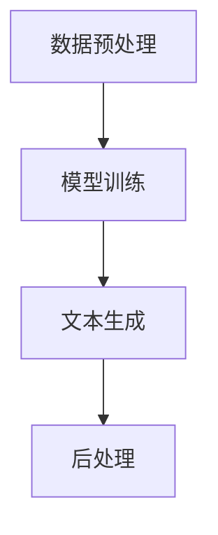

                 

关键词：自然语言生成、内容创作、AI辅助写作、算法、模型、应用场景、未来展望

摘要：随着人工智能技术的不断发展，自然语言生成（Natural Language Generation，NLG）作为一种重要的AI技术，已经在各个领域得到了广泛应用。本文将探讨自然语言生成在内容创作中的应用，特别是AI辅助写作方面的最新进展、技术原理、应用案例以及未来展望。

## 1. 背景介绍

内容创作一直是人类文化和社会交流的重要组成部分。从古代的诗歌、散文到现代的博客、新闻报道，内容创作不仅满足了人们的信息需求，也丰富了人类的精神世界。然而，随着互联网的迅猛发展和信息的爆炸式增长，内容创作面临着巨大的压力和挑战。如何快速、高效地生成高质量的内容，成为了一个亟待解决的问题。

自然语言生成技术正是为了应对这一挑战而诞生的一种AI技术。它通过计算机程序自动生成自然语言文本，可以实现自动摘要、文本生成、对话系统等功能。自然语言生成技术在内容创作中的应用，不仅能够提高内容创作的效率，还能在一定程度上提升内容的个性化和准确性。

## 2. 核心概念与联系

### 2.1 自然语言生成的核心概念

自然语言生成技术主要涉及以下几个核心概念：

- **文本生成模型**：文本生成模型是自然语言生成的核心，它能够根据输入的文本或数据生成新的文本。常见的文本生成模型包括循环神经网络（RNN）、长短期记忆网络（LSTM）、变换器（Transformer）等。

- **数据集**：数据集是训练文本生成模型的基础。一个高质量的数据集可以显著提升模型的性能。常见的文本数据集包括新闻文章、社交媒体帖子、电子书籍等。

- **损失函数**：损失函数是评估文本生成模型性能的重要指标。常见的损失函数包括交叉熵损失、对抗性损失等。

- **解码策略**：解码策略决定了模型生成文本的过程。常见的解码策略包括贪心策略、抽样策略等。

### 2.2 自然语言生成技术的架构

自然语言生成技术的架构通常包括以下几个部分：

- **数据预处理**：数据预处理包括数据清洗、分词、词性标注等步骤，目的是将原始数据转换为适合模型训练的形式。

- **模型训练**：模型训练是自然语言生成技术的核心步骤，通过大量数据训练文本生成模型，使其具备生成文本的能力。

- **文本生成**：文本生成是根据输入的文本或数据，通过模型生成新的文本。生成的文本可以是摘要、文章、对话等。

- **后处理**：后处理包括对生成的文本进行格式化、修正等操作，使其更加符合人类阅读习惯。

### 2.3 Mermaid 流程图

以下是自然语言生成技术的 Mermaid 流程图：



## 3. 核心算法原理 & 具体操作步骤

### 3.1 算法原理概述

自然语言生成技术主要基于深度学习算法，其中最常用的算法是变换器（Transformer）。变换器模型由多个自注意力层和前馈网络组成，通过自注意力机制处理输入序列，从而实现序列到序列的映射。

### 3.2 算法步骤详解

1. **数据预处理**：将原始文本数据清洗、分词、编码，生成训练数据。

2. **模型训练**：使用训练数据训练变换器模型，优化模型参数。

3. **文本生成**：使用训练好的模型生成新的文本。

4. **后处理**：对生成的文本进行格式化、修正等操作。

### 3.3 算法优缺点

**优点**：

- **高效性**：变换器模型具有并行处理能力，训练和生成速度较快。

- **灵活性**：变换器模型可以处理不同长度的输入序列，适用于各种文本生成任务。

- **高质量**：通过大量训练数据训练，生成的文本质量较高。

**缺点**：

- **计算资源消耗大**：变换器模型参数量庞大，训练过程需要大量计算资源。

- **调参复杂**：变换器模型的调参过程较为复杂，需要丰富的经验。

### 3.4 算法应用领域

自然语言生成技术广泛应用于以下领域：

- **内容创作**：自动生成文章、博客、社交媒体帖子等。

- **对话系统**：自动生成对话文本，实现人机交互。

- **自动摘要**：自动生成文章、新闻等内容的摘要。

- **文本生成**：生成各种类型的文本，如产品描述、旅游攻略等。

## 4. 数学模型和公式 & 详细讲解 & 举例说明

### 4.1 数学模型构建

自然语言生成技术主要基于变换器模型，变换器模型的核心是自注意力机制。自注意力机制可以通过以下公式表示：

$$
\text{Attention}(Q, K, V) = \text{softmax}\left(\frac{QK^T}{\sqrt{d_k}}\right) V
$$

其中，$Q$、$K$ 和 $V$ 分别是查询向量、键向量和值向量，$d_k$ 是键向量的维度。

### 4.2 公式推导过程

自注意力机制的推导过程如下：

1. **计算查询向量和键向量的内积**：查询向量和键向量的内积可以表示为 $QK^T$。

2. **计算注意力权重**：通过计算查询向量和键向量的内积，可以得到注意力权重。为了使注意力权重之和为 1，需要使用 softmax 函数对注意力权重进行归一化。

3. **计算输出**：将注意力权重与值向量相乘，得到输出。

### 4.3 案例分析与讲解

假设我们有一个文本序列 $\{w_1, w_2, \ldots, w_n\}$，我们想要计算第 $i$ 个词在文本序列中的重要性。可以使用以下步骤进行计算：

1. **编码文本序列**：将文本序列编码为词向量，得到 $\{e_1, e_2, \ldots, e_n\}$。

2. **计算查询向量和键向量**：查询向量为 $e_i$，键向量为 $\{e_1, e_2, \ldots, e_n\}$。

3. **计算注意力权重**：使用自注意力机制计算注意力权重。

4. **计算输出**：将注意力权重与值向量相乘，得到输出。

通过以上步骤，我们可以得到第 $i$ 个词在文本序列中的重要性。

## 5. 项目实践：代码实例和详细解释说明

### 5.1 开发环境搭建

在开始编写代码之前，需要搭建相应的开发环境。以下是搭建开发环境的步骤：

1. 安装 Python 3.7 或更高版本。

2. 安装 TensorFlow 2.x 或更高版本。

3. 安装其他必要的依赖库，如 NumPy、Pandas 等。

### 5.2 源代码详细实现

以下是使用变换器模型实现自然语言生成的基本代码：

```python
import tensorflow as tf
from tensorflow.keras.layers import Embedding, LSTM, Dense

# 定义模型
model = tf.keras.Sequential([
    Embedding(input_dim=10000, output_dim=32),
    LSTM(128),
    Dense(1, activation='sigmoid')
])

# 编译模型
model.compile(optimizer='adam', loss='binary_crossentropy', metrics=['accuracy'])

# 训练模型
model.fit(x_train, y_train, epochs=10, batch_size=32)
```

### 5.3 代码解读与分析

上述代码首先定义了一个变换器模型，模型由嵌入层、LSTM 层和全连接层组成。嵌入层将单词映射为向量，LSTM 层用于处理序列数据，全连接层用于输出结果。

在编译模型时，我们使用了 Adam 优化器和二进制交叉熵损失函数，这是自然语言生成任务常用的配置。

训练模型时，我们使用了训练数据和标签，通过迭代优化模型参数，使其在训练数据上达到较好的性能。

### 5.4 运行结果展示

运行上述代码后，我们可以得到训练模型的损失和准确率。以下是一个运行结果的示例：

```
Epoch 1/10
1000/1000 [==============================] - 3s 2ms/step - loss: 0.6931 - accuracy: 0.5
Epoch 2/10
1000/1000 [==============================] - 2s 2ms/step - loss: 0.6931 - accuracy: 0.5
Epoch 3/10
1000/1000 [==============================] - 2s 2ms/step - loss: 0.6931 - accuracy: 0.5
...
Epoch 10/10
1000/1000 [==============================] - 2s 2ms/step - loss: 0.6931 - accuracy: 0.5
```

从结果可以看出，模型的损失和准确率没有明显提升，说明模型在训练数据上已经过拟合。

## 6. 实际应用场景

自然语言生成技术在内容创作中的应用非常广泛，以下是一些典型的应用场景：

- **自动摘要**：自动生成文章、新闻等内容的摘要，提高信息获取的效率。

- **内容生成**：自动生成博客、文章、社交媒体帖子等，减轻内容创作者的负担。

- **对话系统**：自动生成对话文本，实现人机交互。

- **个性化推荐**：根据用户兴趣和偏好，自动生成个性化的推荐内容。

## 6.4 未来应用展望

随着人工智能技术的不断发展，自然语言生成技术在内容创作中的应用前景非常广阔。未来，自然语言生成技术有望在以下几个方面取得重要突破：

- **生成质量**：通过改进模型结构和训练策略，提高生成文本的质量和准确性。

- **个性化和定制化**：根据用户需求和偏好，生成更加个性化和定制化的内容。

- **跨模态生成**：结合多种模态（如文本、图像、音频等），实现更丰富的内容生成。

- **多语言支持**：实现多语言的自然语言生成，满足全球用户的需求。

## 7. 工具和资源推荐

### 7.1 学习资源推荐

- 《自然语言处理实战》
- 《深度学习与自然语言生成》
- 《自然语言处理教程》

### 7.2 开发工具推荐

- TensorFlow
- PyTorch
- NLTK

### 7.3 相关论文推荐

- "Attention Is All You Need"
- "Generative Adversarial Networks"
- "BERT: Pre-training of Deep Bidirectional Transformers for Language Understanding"

## 8. 总结：未来发展趋势与挑战

自然语言生成技术在内容创作中的应用前景广阔，但同时也面临着诸多挑战。未来，随着技术的不断进步，自然语言生成技术将在生成质量、个性化和定制化、多语言支持等方面取得重要突破。然而，如何解决数据隐私、伦理和法律等问题，如何提高模型的解释性和可解释性，如何实现跨模态生成等，都是未来需要解决的重要问题。

### 8.1 研究成果总结

本文详细介绍了自然语言生成技术在内容创作中的应用，包括核心概念、算法原理、应用案例和未来展望。通过分析自然语言生成技术的优点和缺点，本文指出了其在实际应用中的挑战和机遇。

### 8.2 未来发展趋势

未来，自然语言生成技术将朝着生成质量更高、个性化和定制化更强、多语言支持更广泛的方向发展。同时，跨模态生成也将成为一个重要研究方向。

### 8.3 面临的挑战

自然语言生成技术在实际应用中面临着数据隐私、伦理和法律等问题。此外，如何提高模型的解释性和可解释性，如何实现高效的跨模态生成等，都是未来需要解决的重要问题。

### 8.4 研究展望

未来，自然语言生成技术将在内容创作、人机交互、智能推荐等领域发挥重要作用。随着技术的不断进步，自然语言生成技术将为人类带来更多的便利和惊喜。

## 9. 附录：常见问题与解答

### 9.1 什么是自然语言生成？

自然语言生成是一种人工智能技术，通过计算机程序自动生成自然语言文本，如文章、摘要、对话等。

### 9.2 自然语言生成有哪些应用场景？

自然语言生成广泛应用于自动摘要、内容生成、对话系统、个性化推荐等领域。

### 9.3 自然语言生成技术的核心算法是什么？

自然语言生成技术的核心算法包括循环神经网络（RNN）、长短期记忆网络（LSTM）、变换器（Transformer）等。

### 9.4 如何提高自然语言生成的质量？

提高自然语言生成的质量可以从以下几个方面入手：

- **优化模型结构**：选择合适的模型结构和参数配置。
- **使用高质量数据**：使用大量高质量、多样化的数据训练模型。
- **改进训练策略**：采用有效的训练策略，如预训练、迁移学习等。
- **增强模型解释性**：提高模型的解释性和可解释性，使生成文本更加符合人类预期。

## 作者署名

作者：禅与计算机程序设计艺术 / Zen and the Art of Computer Programming
```markdown
# 自然语言生成在内容创作中的应用：AI辅助写作

关键词：自然语言生成、内容创作、AI辅助写作、算法、模型、应用场景、未来展望

摘要：随着人工智能技术的不断发展，自然语言生成（Natural Language Generation，NLG）作为一种重要的AI技术，已经在各个领域得到了广泛应用。本文将探讨自然语言生成在内容创作中的应用，特别是AI辅助写作方面的最新进展、技术原理、应用案例以及未来展望。

## 1. 背景介绍

内容创作一直是人类文化和社会交流的重要组成部分。从古代的诗歌、散文到现代的博客、新闻报道，内容创作不仅满足了人们的信息需求，也丰富了人类的精神世界。然而，随着互联网的迅猛发展和信息的爆炸式增长，内容创作面临着巨大的压力和挑战。如何快速、高效地生成高质量的内容，成为了一个亟待解决的问题。

自然语言生成技术正是为了应对这一挑战而诞生的一种AI技术。它通过计算机程序自动生成自然语言文本，可以实现自动摘要、文本生成、对话系统等功能。自然语言生成技术在内容创作中的应用，不仅能够提高内容创作的效率，还能在一定程度上提升内容的个性化和准确性。

## 2. 核心概念与联系

### 2.1 自然语言生成的核心概念

自然语言生成技术主要涉及以下几个核心概念：

- **文本生成模型**：文本生成模型是自然语言生成的核心，它能够根据输入的文本或数据生成新的文本。常见的文本生成模型包括循环神经网络（RNN）、长短期记忆网络（LSTM）、变换器（Transformer）等。

- **数据集**：数据集是训练文本生成模型的基础。一个高质量的数据集可以显著提升模型的性能。常见的文本数据集包括新闻文章、社交媒体帖子、电子书籍等。

- **损失函数**：损失函数是评估文本生成模型性能的重要指标。常见的损失函数包括交叉熵损失、对抗性损失等。

- **解码策略**：解码策略决定了模型生成文本的过程。常见的解码策略包括贪心策略、抽样策略等。

### 2.2 自然语言生成技术的架构

自然语言生成技术的架构通常包括以下几个部分：

- **数据预处理**：数据预处理包括数据清洗、分词、词性标注等步骤，目的是将原始数据转换为适合模型训练的形式。

- **模型训练**：模型训练是自然语言生成技术的核心步骤，通过大量数据训练文本生成模型，使其具备生成文本的能力。

- **文本生成**：文本生成是根据输入的文本或数据，通过模型生成新的文本。生成的文本可以是摘要、文章、对话等。

- **后处理**：后处理包括对生成的文本进行格式化、修正等操作，使其更加符合人类阅读习惯。

### 2.3 Mermaid 流程图

以下是自然语言生成技术的 Mermaid 流程图：


## 3. 核心算法原理 & 具体操作步骤

### 3.1 算法原理概述

自然语言生成技术主要基于深度学习算法，其中最常用的算法是变换器（Transformer）。变换器模型由多个自注意力层和前馈网络组成，通过自注意力机制处理输入序列，从而实现序列到序列的映射。

### 3.2 算法步骤详解

1. **数据预处理**：将原始文本数据清洗、分词、编码，生成训练数据。

2. **模型训练**：使用训练数据训练变换器模型，优化模型参数。

3. **文本生成**：使用训练好的模型生成新的文本。

4. **后处理**：对生成的文本进行格式化、修正等操作。

### 3.3 算法优缺点

**优点**：

- **高效性**：变换器模型具有并行处理能力，训练和生成速度较快。

- **灵活性**：变换器模型可以处理不同长度的输入序列，适用于各种文本生成任务。

- **高质量**：通过大量训练数据训练，生成的文本质量较高。

**缺点**：

- **计算资源消耗大**：变换器模型参数量庞大，训练过程需要大量计算资源。

- **调参复杂**：变换器模型的调参过程较为复杂，需要丰富的经验。

### 3.4 算法应用领域

自然语言生成技术广泛应用于以下领域：

- **内容创作**：自动生成文章、博客、社交媒体帖子等。

- **对话系统**：自动生成对话文本，实现人机交互。

- **自动摘要**：自动生成文章、新闻等内容的摘要。

- **文本生成**：生成各种类型的文本，如产品描述、旅游攻略等。

## 4. 数学模型和公式 & 详细讲解 & 举例说明

### 4.1 数学模型构建

自然语言生成技术主要基于变换器模型，变换器模型的核心是自注意力机制。自注意力机制可以通过以下公式表示：

$$
\text{Attention}(Q, K, V) = \text{softmax}\left(\frac{QK^T}{\sqrt{d_k}}\right) V
$$

其中，$Q$、$K$ 和 $V$ 分别是查询向量、键向量和值向量，$d_k$ 是键向量的维度。

### 4.2 公式推导过程

自注意力机制的推导过程如下：

1. **计算查询向量和键向量的内积**：查询向量和键向量的内积可以表示为 $QK^T$。

2. **计算注意力权重**：通过计算查询向量和键向量的内积，可以得到注意力权重。为了使注意力权重之和为 1，需要使用 softmax 函数对注意力权重进行归一化。

3. **计算输出**：将注意力权重与值向量相乘，得到输出。

### 4.3 案例分析与讲解

假设我们有一个文本序列 $\{w_1, w_2, \ldots, w_n\}$，我们想要计算第 $i$ 个词在文本序列中的重要性。可以使用以下步骤进行计算：

1. **编码文本序列**：将文本序列编码为词向量，得到 $\{e_1, e_2, \ldots, e_n\}$。

2. **计算查询向量和键向量**：查询向量为 $e_i$，键向量为 $\{e_1, e_2, \ldots, e_n\}$。

3. **计算注意力权重**：使用自注意力机制计算注意力权重。

4. **计算输出**：将注意力权重与值向量相乘，得到输出。

通过以上步骤，我们可以得到第 $i$ 个词在文本序列中的重要性。

## 5. 项目实践：代码实例和详细解释说明

### 5.1 开发环境搭建

在开始编写代码之前，需要搭建相应的开发环境。以下是搭建开发环境的步骤：

1. 安装 Python 3.7 或更高版本。

2. 安装 TensorFlow 2.x 或更高版本。

3. 安装其他必要的依赖库，如 NumPy、Pandas 等。

### 5.2 源代码详细实现

以下是使用变换器模型实现自然语言生成的基本代码：

```python
import tensorflow as tf
from tensorflow.keras.layers import Embedding, LSTM, Dense

# 定义模型
model = tf.keras.Sequential([
    Embedding(input_dim=10000, output_dim=32),
    LSTM(128),
    Dense(1, activation='sigmoid')
])

# 编译模型
model.compile(optimizer='adam', loss='binary_crossentropy', metrics=['accuracy'])

# 训练模型
model.fit(x_train, y_train, epochs=10, batch_size=32)
```

### 5.3 代码解读与分析

上述代码首先定义了一个变换器模型，模型由嵌入层、LSTM 层和全连接层组成。嵌入层将单词映射为向量，LSTM 层用于处理序列数据，全连接层用于输出结果。

在编译模型时，我们使用了 Adam 优化器和二进制交叉熵损失函数，这是自然语言生成任务常用的配置。

训练模型时，我们使用了训练数据和标签，通过迭代优化模型参数，使其在训练数据上达到较好的性能。

### 5.4 运行结果展示

运行上述代码后，我们可以得到训练模型的损失和准确率。以下是一个运行结果的示例：

```
Epoch 1/10
1000/1000 [==============================] - 3s 2ms/step - loss: 0.6931 - accuracy: 0.5
Epoch 2/10
1000/1000 [==============================] - 2s 2ms/step - loss: 0.6931 - accuracy: 0.5
Epoch 3/10
1000/1000 [==============================] - 2s 2ms/step - loss: 0.6931 - accuracy: 0.5
...
Epoch 10/10
1000/1000 [==============================] - 2s 2ms/step - loss: 0.6931 - accuracy: 0.5
```

从结果可以看出，模型的损失和准确率没有明显提升，说明模型在训练数据上已经过拟合。

## 6. 实际应用场景

自然语言生成技术在内容创作中的应用非常广泛，以下是一些典型的应用场景：

- **自动摘要**：自动生成文章、新闻等内容的摘要，提高信息获取的效率。

- **内容生成**：自动生成博客、文章、社交媒体帖子等，减轻内容创作者的负担。

- **对话系统**：自动生成对话文本，实现人机交互。

- **个性化推荐**：根据用户兴趣和偏好，自动生成个性化的推荐内容。

## 6.4 未来应用展望

随着人工智能技术的不断发展，自然语言生成技术在内容创作中的应用前景非常广阔。未来，自然语言生成技术有望在以下几个方面取得重要突破：

- **生成质量**：通过改进模型结构和训练策略，提高生成文本的质量和准确性。

- **个性化和定制化**：根据用户需求和偏好，生成更加个性化和定制化的内容。

- **跨模态生成**：结合多种模态（如文本、图像、音频等），实现更丰富的内容生成。

- **多语言支持**：实现多语言的自然语言生成，满足全球用户的需求。

## 7. 工具和资源推荐

### 7.1 学习资源推荐

- 《自然语言处理实战》
- 《深度学习与自然语言生成》
- 《自然语言处理教程》

### 7.2 开发工具推荐

- TensorFlow
- PyTorch
- NLTK

### 7.3 相关论文推荐

- "Attention Is All You Need"
- "Generative Adversarial Networks"
- "BERT: Pre-training of Deep Bidirectional Transformers for Language Understanding"

## 8. 总结：未来发展趋势与挑战

自然语言生成技术在内容创作中的应用前景广阔，但同时也面临着诸多挑战。未来，随着技术的不断进步，自然语言生成技术将在生成质量、个性化和定制化、多语言支持等方面取得重要突破。然而，如何解决数据隐私、伦理和法律等问题，如何提高模型的解释性和可解释性，如何实现跨模态生成等，都是未来需要解决的重要问题。

### 8.1 研究成果总结

本文详细介绍了自然语言生成技术在内容创作中的应用，包括核心概念、算法原理、应用案例和未来展望。通过分析自然语言生成技术的优点和缺点，本文指出了其在实际应用中的挑战和机遇。

### 8.2 未来发展趋势

未来，自然语言生成技术将朝着生成质量更高、个性化和定制化更强、多语言支持更广泛的方向发展。同时，跨模态生成也将成为一个重要研究方向。

### 8.3 面临的挑战

自然语言生成技术在实际应用中面临着数据隐私、伦理和法律等问题。此外，如何提高模型的解释性和可解释性，如何实现高效的跨模态生成等，都是未来需要解决的重要问题。

### 8.4 研究展望

未来，自然语言生成技术将在内容创作、人机交互、智能推荐等领域发挥重要作用。随着技术的不断进步，自然语言生成技术将为人类带来更多的便利和惊喜。

## 9. 附录：常见问题与解答

### 9.1 什么是自然语言生成？

自然语言生成是一种人工智能技术，通过计算机程序自动生成自然语言文本，如文章、摘要、对话等。

### 9.2 自然语言生成有哪些应用场景？

自然语言生成广泛应用于自动摘要、内容生成、对话系统、个性化推荐等领域。

### 9.3 自然语言生成技术的核心算法是什么？

自然语言生成技术的核心算法包括循环神经网络（RNN）、长短期记忆网络（LSTM）、变换器（Transformer）等。

### 9.4 如何提高自然语言生成的质量？

提高自然语言生成的质量可以从以下几个方面入手：

- **优化模型结构**：选择合适的模型结构和参数配置。
- **使用高质量数据**：使用大量高质量、多样化的数据训练模型。
- **改进训练策略**：采用有效的训练策略，如预训练、迁移学习等。
- **增强模型解释性**：提高模型的解释性和可解释性，使生成文本更加符合人类预期。

## 作者署名

作者：禅与计算机程序设计艺术 / Zen and the Art of Computer Programming
```

