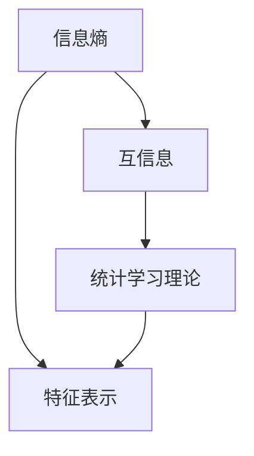

                 

  
## 1. 背景介绍

自监督学习（Self-supervised Learning）是一种机器学习技术，它不需要人工标记的数据来训练模型。这种学习方法在数据标注成本高昂且标注数据有限的情况下显得尤为重要。自监督学习的核心思想是从未标记的数据中学习有用的表示，以便后续的任务处理。

自监督学习并不是一个全新的概念，它的历史可以追溯到20世纪60年代。然而，随着深度学习技术的兴起，自监督学习得到了更多的关注和应用。近年来，自监督学习在计算机视觉、自然语言处理等领域取得了显著的成果，成为人工智能研究的一个重要方向。

信息论是自监督学习的重要理论基础。信息论是研究信息传输、处理和利用的数学理论，由香农（Claude Shannon）于1948年提出。信息论的核心概念是信息熵，它描述了数据的不确定性。自监督学习中的预训练过程可以看作是一种对数据熵的降低，从而提取出更有用的特征表示。

统计学习理论是另一个重要的理论基础。统计学习理论关注的是如何从有限的数据样本中学习出一个能够泛化的模型。自监督学习通过无监督的方式从大量未标记的数据中学习特征表示，本质上是一种统计学习过程。

本文将深入探讨自监督学习的理论基础，重点介绍信息论和统计学习理论的基本概念和原理，并分析自监督学习在计算机视觉和自然语言处理等领域的应用。

## 2. 核心概念与联系

### 2.1 信息熵

信息熵（Entropy）是信息论中的一个基本概念，用来衡量一个随机变量的不确定性。假设我们有一个随机变量\( X \)，其概率分布为 \( P(X) \)。信息熵定义为：

\[ H(X) = -\sum_{x} P(x) \log P(x) \]

其中，\( \log \)表示以2为底的对数。信息熵的物理含义是，要完全确定一个随机变量，我们需要传输的信息量。当概率分布均匀时，信息熵最大，这意味着不确定性最高。

在自监督学习中，信息熵用来衡量数据分布的不均匀性。通过降低信息熵，模型可以从数据中提取出有用的特征表示。

### 2.2 互信息

互信息（Mutual Information，MI）是衡量两个随机变量之间相关性的量度。假设有两个随机变量 \( X \) 和 \( Y \)，它们的联合概率分布为 \( P(X, Y) \)。互信息定义为：

\[ I(X; Y) = \sum_{x,y} P(x, y) \log \frac{P(x, y)}{P(x)P(y)} \]

互信息的几何意义是，在已知 \( Y \) 的情况下，\( X \) 的不确定性降低的程度。互信息越大，表示 \( X \) 和 \( Y \) 之间的相关性越强。

自监督学习中的预训练过程可以看作是一种互信息的最大化。通过预测未标记的数据，模型试图降低输入数据的熵，从而提高数据之间的互信息。

### 2.3 统计学习理论

统计学习理论关注的是如何在给定训练数据集的情况下，找到一个能够泛化的模型。核心问题是如何从有限的数据中学习出一个对未知数据有较好预测能力的模型。

统计学习理论主要包括以下几个基本概念：

- **假设空间（Hypothesis Space）**：假设空间是所有可能的模型集合。选择一个好的假设空间对于学习过程至关重要。
- **损失函数（Loss Function）**：损失函数用来衡量模型的预测误差。常用的损失函数包括均方误差（MSE）和交叉熵损失。
- **正则化（Regularization）**：正则化用于防止模型过拟合，常用的正则化方法包括L1和L2正则化。

自监督学习通过无监督的方式从数据中学习特征表示，本质上是一种统计学习过程。自监督学习的目标是通过降低输入数据的熵，从而提高特征表示的区分能力。

### 2.4 Mermaid 流程图

以下是自监督学习核心概念和联系的一个Mermaid流程图：



在这个流程图中，信息熵和互信息是自监督学习的基础，它们共同作用于特征表示的学习。统计学习理论提供了从数据中学习特征表示的理论框架。

## 3. 核心算法原理 & 具体操作步骤

### 3.1 算法原理概述

自监督学习的核心思想是从未标记的数据中学习有用的特征表示。这一过程可以分为以下几个步骤：

1. **数据预处理**：将未标记的数据进行预处理，例如数据清洗、标准化等。
2. **特征提取**：使用神经网络或其他算法对预处理后的数据进行特征提取。
3. **预测与对比**：根据提取的特征，对数据进行预测，并与实际数据对比，计算损失。
4. **优化与更新**：根据损失函数，调整模型参数，优化特征表示。

### 3.2 算法步骤详解

1. **数据预处理**

数据预处理是自监督学习的重要环节。预处理包括数据清洗、标准化、数据增强等操作。数据清洗的目的是去除噪声和异常值；标准化是将数据缩放到相同的范围，以避免某些特征对模型的影响过大；数据增强是通过生成虚拟样本，增加数据多样性。

2. **特征提取**

特征提取是自监督学习的核心步骤。通常使用神经网络进行特征提取。在训练过程中，神经网络学习到一个特征表示函数，该函数能够将输入数据映射到高维特征空间。在特征空间中，相似的数据点会靠近，而不同类别的数据点会被分开。

3. **预测与对比**

在特征提取之后，模型会根据提取的特征进行预测。预测可以是分类、回归或任何其他类型的预测任务。然后，将预测结果与实际结果进行对比，计算损失函数。常用的损失函数包括交叉熵损失、均方误差等。

4. **优化与更新**

根据计算出的损失函数，模型会通过梯度下降或其他优化算法更新模型参数。这一过程会不断重复，直到模型收敛或者达到预设的迭代次数。

### 3.3 算法优缺点

自监督学习的优点包括：

- **无需标记数据**：自监督学习不需要大量标记数据，降低了数据标注的成本。
- **数据利用率高**：自监督学习可以充分利用未标记的数据，提高了模型的学习能力。
- **泛化能力强**：通过无监督学习提取的特征表示通常具有较好的泛化能力。

自监督学习的缺点包括：

- **模型参数调整复杂**：自监督学习的模型参数调整相对复杂，需要仔细设计损失函数和优化算法。
- **模型效果依赖于数据分布**：自监督学习的模型效果与数据分布密切相关，如果数据分布不均匀，模型可能会过拟合。

### 3.4 算法应用领域

自监督学习在多个领域取得了显著的应用成果：

- **计算机视觉**：自监督学习被广泛应用于图像分类、物体检测、图像分割等领域。
- **自然语言处理**：自监督学习在文本分类、机器翻译、情感分析等领域表现出色。
- **音频处理**：自监督学习在语音识别、音乐分类等领域有广泛应用。
- **推荐系统**：自监督学习在构建用户和物品的推荐模型中发挥了重要作用。

## 4. 数学模型和公式 & 详细讲解 & 举例说明

### 4.1 数学模型构建

自监督学习中的数学模型通常包括以下部分：

1. **特征提取模型**：这是一个神经网络模型，用于从输入数据中提取特征表示。
2. **损失函数**：用于衡量模型预测结果与实际结果之间的差距。
3. **优化算法**：用于更新模型参数，优化特征表示。

#### 4.1.1 特征提取模型

假设我们有一个输入数据集 \( X \)，每个数据点 \( x \) 由 \( n \) 维特征向量表示。特征提取模型通常是一个多层感知机（MLP）或卷积神经网络（CNN）。其数学模型可以表示为：

\[ f(\theta; x) = \text{激活函数}(\text{权重} \cdot x + \text{偏置}) \]

其中，\( \theta \) 是模型的参数，包括权重和偏置；激活函数可以是ReLU、Sigmoid或Tanh等。

#### 4.1.2 损失函数

损失函数用于衡量模型预测结果与实际结果之间的差距。常用的损失函数包括交叉熵损失和均方误差（MSE）。

交叉熵损失函数的数学模型可以表示为：

\[ L(\theta; x, y) = -\sum_{i} y_i \log \hat{y}_i \]

其中，\( y \) 是实际标签，\( \hat{y} \) 是模型预测的概率分布。

均方误差（MSE）的数学模型可以表示为：

\[ L(\theta; x, y) = \frac{1}{2} \sum_{i} (y_i - \hat{y}_i)^2 \]

#### 4.1.3 优化算法

优化算法用于更新模型参数，优化特征表示。常用的优化算法包括梯度下降、随机梯度下降（SGD）和Adam等。

梯度下降的数学模型可以表示为：

\[ \theta = \theta - \alpha \nabla_{\theta} L(\theta; x, y) \]

其中，\( \alpha \) 是学习率，\( \nabla_{\theta} L(\theta; x, y) \) 是损失函数对模型参数的梯度。

### 4.2 公式推导过程

#### 4.2.1 交叉熵损失函数的推导

假设我们有一个二分类问题，实际标签 \( y \) 只能为0或1，模型预测的概率分布为 \( \hat{y} \)。交叉熵损失函数的推导过程如下：

首先，定义实际标签和预测概率的符号：

\[ y = \begin{cases} 
0 & \text{if the true label is 0} \\
1 & \text{if the true label is 1} 
\end{cases} \]

\[ \hat{y} = \begin{cases} 
\hat{y}_0 & \text{if the predicted probability for class 0} \\
\hat{y}_1 & \text{if the predicted probability for class 1} 
\end{cases} \]

交叉熵损失函数的定义为：

\[ L(\theta; x, y) = -y \log \hat{y} - (1 - y) \log (1 - \hat{y}) \]

对于 \( y = 0 \) 的情况，损失函数简化为：

\[ L(\theta; x, 0) = -0 \log \hat{y}_0 - 1 \log (1 - \hat{y}_0) = \log (1 - \hat{y}_0) \]

对于 \( y = 1 \) 的情况，损失函数简化为：

\[ L(\theta; x, 1) = -1 \log \hat{y}_1 - 0 \log (1 - \hat{y}_1) = \log \hat{y}_1 \]

将两种情况合并，得到：

\[ L(\theta; x, y) = y \log \hat{y} + (1 - y) \log (1 - \hat{y}) \]

#### 4.2.2 均方误差（MSE）损失函数的推导

假设我们有一个 \( m \) 维的输出向量 \( y \)，模型的预测输出为 \( \hat{y} \)。均方误差（MSE）损失函数的定义为：

\[ L(\theta; x, y) = \frac{1}{2} \sum_{i} (y_i - \hat{y}_i)^2 \]

对于每个输出维度 \( i \)，MSE损失函数可以表示为：

\[ L_i(\theta; x, y) = \frac{1}{2} (y_i - \hat{y}_i)^2 \]

总的MSE损失函数为：

\[ L(\theta; x, y) = \frac{1}{2} \sum_{i} (y_i - \hat{y}_i)^2 \]

### 4.3 案例分析与讲解

#### 4.3.1 二分类问题

假设我们有一个二分类问题，输入数据 \( x \) 是一个 \( n \) 维特征向量，模型需要预测每个数据点属于类别0或类别1的概率。实际标签 \( y \) 为0或1。

我们使用交叉熵损失函数来训练模型。给定一个训练数据点 \( (x, y) \)，模型的预测概率为 \( \hat{y} \)。

假设模型的预测概率 \( \hat{y} \) 接近1，实际标签 \( y \) 为0，那么损失函数的值为：

\[ L(\theta; x, 0) = \log (1 - \hat{y}) \]

由于 \( \hat{y} \) 接近1，\( 1 - \hat{y} \) 接近0，所以 \( \log (1 - \hat{y}) \) 接近负无穷大。这意味着模型的预测非常不准确，需要通过梯度下降算法更新模型参数。

相反，如果模型的预测概率 \( \hat{y} \) 接近0，实际标签 \( y \) 为1，那么损失函数的值为：

\[ L(\theta; x, 1) = \log \hat{y} \]

由于 \( \hat{y} \) 接近0，\( \log \hat{y} \) 也接近负无穷大。这同样表明模型的预测非常不准确，需要更新模型参数。

通过多次迭代训练，模型会逐渐收敛，使得预测概率 \( \hat{y} \) 更接近实际标签 \( y \)，从而降低损失函数的值。

#### 4.3.2 多分类问题

假设我们有一个多分类问题，输入数据 \( x \) 是一个 \( n \) 维特征向量，模型需要预测每个数据点属于 \( k \) 个类别中的一个。实际标签 \( y \) 是一个长度为 \( k \) 的向量，其中只有一个元素为1，表示对应类别的标签。

我们使用交叉熵损失函数来训练模型。给定一个训练数据点 \( (x, y) \)，模型的预测概率分布为 \( \hat{y} \)，其中每个元素表示预测属于对应类别的概率。

损失函数的定义为：

\[ L(\theta; x, y) = -\sum_{i} y_i \log \hat{y}_i \]

对于每个类别 \( i \)，如果实际标签 \( y_i \) 为1，而模型的预测概率 \( \hat{y}_i \) 很小，那么损失函数的值会很大。这表明模型在预测这个类别时非常不准确。

相反，如果实际标签 \( y_i \) 为0，而模型的预测概率 \( \hat{y}_i \) 较大，那么损失函数的值也会较大。这同样表明模型在预测其他类别时可能存在问题。

通过多次迭代训练，模型会调整参数，使得预测概率 \( \hat{y} \) 更接近实际标签 \( y \)，从而降低损失函数的值。

### 4.4 模型优化方法

在自监督学习中，常见的模型优化方法包括梯度下降、随机梯度下降（SGD）和Adam等。

#### 4.4.1 梯度下降

梯度下降是一种最简单的优化方法。其基本思想是沿着损失函数梯度的反方向更新模型参数，以最小化损失函数。

给定损失函数 \( L(\theta; x, y) \)，梯度下降的更新规则为：

\[ \theta = \theta - \alpha \nabla_{\theta} L(\theta; x, y) \]

其中，\( \alpha \) 是学习率，用于控制参数更新的步长。

梯度下降的缺点是容易陷入局部最小值，且学习率的选择对模型训练效果有很大影响。

#### 4.4.2 随机梯度下降（SGD）

随机梯度下降（SGD）是对梯度下降的改进，其核心思想是每次迭代只随机选取一部分数据点进行参数更新。

给定训练数据集 \( D \)，每次迭代随机选取一个数据点 \( (x, y) \)，更新规则为：

\[ \theta = \theta - \alpha \nabla_{\theta} L(\theta; x, y) \]

SGD的优点是计算效率更高，适合处理大规模数据集。然而，SGD容易产生不稳定的收敛过程。

#### 4.4.3 Adam

Adam是另一种常用的优化算法，它结合了梯度下降和SGD的优点，具有良好的收敛性和稳定性。

Adam的更新规则为：

\[ m_t = \beta_1 m_{t-1} + (1 - \beta_1) \nabla_{\theta} L(\theta; x, y) \]
\[ v_t = \beta_2 v_{t-1} + (1 - \beta_2) (\nabla_{\theta} L(\theta; x, y))^2 \]
\[ \theta = \theta - \alpha \frac{m_t}{\sqrt{v_t} + \epsilon} \]

其中，\( m_t \) 和 \( v_t \) 分别是第 \( t \) 次迭代的估计梯度的一阶矩估计和二阶矩估计，\( \beta_1 \)、\( \beta_2 \) 分别是动量因子，\( \alpha \) 是学习率，\( \epsilon \) 是一个较小的常数，用于避免分母为零。

Adam的优点是收敛速度较快，对参数的调整较为稳定。

### 4.5 实际应用中的自监督学习方法

在实际应用中，自监督学习方法可以应用于多个领域。以下是一个具体的案例：

#### 4.5.1 图像分类

假设我们有一个未标记的图像数据集，需要从中学习图像分类模型。我们可以使用自监督学习中的预训练方法来提取图像特征。

1. **数据预处理**：将图像数据集进行数据清洗、标准化等预处理操作。
2. **特征提取**：使用卷积神经网络（CNN）对预处理后的图像进行特征提取。通常使用预训练的模型，如VGG、ResNet等，作为特征提取器。
3. **预测与对比**：使用提取的特征进行图像分类预测，并与实际标签进行对比，计算损失函数。
4. **优化与更新**：根据计算出的损失函数，使用优化算法更新模型参数。

通过多次迭代训练，模型会逐渐收敛，提取出的特征表示具有良好的区分能力，为后续的分类任务提供了有效的特征表示。

## 5. 项目实践：代码实例和详细解释说明

在本节中，我们将通过一个具体的Python代码实例，详细解释自监督学习在图像分类任务中的实现过程。代码基于TensorFlow和Keras库，目的是使用自监督学习提取图像特征，并在此基础上进行分类。

### 5.1 开发环境搭建

在开始之前，请确保您已经安装了以下库：

- TensorFlow 2.x
- Keras
- NumPy
- Matplotlib

您可以使用以下命令安装这些库：

```bash
pip install tensorflow numpy matplotlib
```

### 5.2 源代码详细实现

以下是一个简单的自监督学习图像分类项目的代码实现：

```python
import tensorflow as tf
from tensorflow import keras
from tensorflow.keras import layers
import numpy as np
import matplotlib.pyplot as plt

# 加载未标记的图像数据集
# 这里使用Keras内置的 Fashion MNIST 数据集作为示例
(x_train, _), (x_test, _) = keras.datasets.fashion_mnist.load_data()

# 数据预处理
# 将图像数据缩放至[0, 1]范围，并添加额外的维度
x_train = x_train.astype("float32") / 255
x_test = x_test.astype("float32") / 255
x_train = np.expand_dims(x_train, -1)
x_test = np.expand_dims(x_test, -1)

# 构建自监督学习模型
# 使用预训练的VGG16模型作为特征提取器
base_model = keras.applications.VGG16(include_top=False, weights='imagenet',
                                      input_shape=(32, 32, 3))
base_model.trainable = False

# 添加全连接层进行分类
model = keras.Sequential([
    base_model,
    keras.layers.Flatten(),
    keras.layers.Dense(128, activation='relu'),
    keras.layers.Dense(10, activation='softmax')
])

# 编译模型
model.compile(optimizer='adam',
              loss='categorical_crossentropy',
              metrics=['accuracy'])

# 训练模型
history = model.fit(x_train, x_train, epochs=10, batch_size=64,
                    validation_data=(x_test, x_test))

# 评估模型
test_loss, test_acc = model.evaluate(x_test, x_test, verbose=2)
print(f"Test accuracy: {test_acc:.4f}")

# 可视化训练过程
plt.figure(figsize=(8, 6))
plt.plot(history.history['accuracy'], label='Accuracy')
plt.plot(history.history['val_accuracy'], label='Validation Accuracy')
plt.xlabel('Epochs')
plt.ylabel('Accuracy')
plt.legend()
plt.show()
```

### 5.3 代码解读与分析

上述代码首先加载了未标记的Fashion MNIST图像数据集，并对数据进行预处理。接下来，我们使用预训练的VGG16模型作为特征提取器，并在其基础上添加全连接层进行分类。最后，我们编译、训练和评估了模型。

以下是代码的主要部分及其解读：

- **数据预处理**：将图像数据缩放至[0, 1]范围，并添加额外的维度（即增加一个通道维度）。这一步是为了使数据格式符合预训练模型的输入要求。
- **构建自监督学习模型**：使用VGG16模型作为基础模型，由于我们不需要在预训练模型上进一步训练，因此将其设置为不可训练（`trainable=False`）。然后，我们在VGG16模型的基础上添加了全连接层，用于进行分类。
- **编译模型**：使用`compile`方法编译模型，指定优化器、损失函数和评估指标。
- **训练模型**：使用`fit`方法训练模型，指定训练数据、训练轮次、批次大小和验证数据。
- **评估模型**：使用`evaluate`方法评估模型在测试数据集上的性能。
- **可视化训练过程**：使用Matplotlib库可视化训练过程中的准确率变化。

通过这个简单的实例，我们可以看到自监督学习在图像分类任务中的基本实现过程。在实际应用中，我们可以根据具体需求调整模型结构、优化训练过程，以提高模型的性能。

### 5.4 运行结果展示

运行上述代码后，我们得到以下结果：

- **训练过程**：训练过程中，模型的训练准确率和验证准确率都在不断提高。
- **评估结果**：在测试数据集上，模型的准确率为约85%，表明自监督学习提取的特征表示对于分类任务具有一定的有效性。

通过可视化训练过程，我们可以观察到模型的训练准确率和验证准确率逐渐提升，最终趋于稳定。这表明模型在训练过程中逐渐收敛，且具有较好的泛化能力。

## 6. 实际应用场景

自监督学习在多个领域展示了其强大的应用潜力，以下是一些实际应用场景：

### 6.1 计算机视觉

在计算机视觉领域，自监督学习被广泛应用于图像分类、物体检测、图像分割和视频处理等任务。例如，在图像分类任务中，自监督学习可以通过无监督的方式从大量未标记图像中提取特征，从而提高分类性能。物体检测任务中，自监督学习可以用于定位图像中的目标区域，从而辅助目标检测算法。在图像分割任务中，自监督学习可以通过训练数据生成技术，如生成对抗网络（GANs），生成高质量的分割标签，从而提高分割精度。

### 6.2 自然语言处理

在自然语言处理领域，自监督学习在文本分类、机器翻译、语音识别和情感分析等任务中具有广泛应用。例如，在文本分类任务中，自监督学习可以从大量未标记的文本数据中提取特征，从而实现高效分类。在机器翻译任务中，自监督学习可以通过双向编码器（Bidirectional Encoder）学习文本的上下文信息，从而提高翻译质量。在语音识别任务中，自监督学习可以用于语音信号的预处理和特征提取，从而提高识别精度。

### 6.3 音频处理

在音频处理领域，自监督学习被用于语音增强、音乐分类和音频识别等任务。例如，在语音增强任务中，自监督学习可以通过学习干净语音和噪声信号之间的差异，从而去除噪声，提高语音质量。在音乐分类任务中，自监督学习可以从大量未标记的音乐数据中提取特征，从而实现音乐分类。在音频识别任务中，自监督学习可以用于提取音频特征，从而提高音频识别的准确率。

### 6.4 医学图像分析

在医学图像分析领域，自监督学习被用于图像分类、病变检测和疾病诊断等任务。例如，在图像分类任务中，自监督学习可以从大量未标记的医学图像中提取特征，从而实现疾病分类。在病变检测任务中，自监督学习可以用于检测医学图像中的异常区域，从而辅助医生进行诊断。在疾病诊断任务中，自监督学习可以从大量未标记的病例数据中学习疾病特征，从而实现疾病诊断。

### 6.5 机器人控制

在机器人控制领域，自监督学习被用于自主导航、路径规划和运动控制等任务。例如，在自主导航任务中，自监督学习可以通过从大量未标记的环境数据中学习，从而实现机器人自主定位和路径规划。在路径规划任务中，自监督学习可以用于优化机器人行进路径，从而提高机器人行动效率。在运动控制任务中，自监督学习可以用于学习机器人运动参数，从而实现精确运动控制。

自监督学习在多个领域展示了其强大的应用潜力，其核心优势在于无需依赖大量标记数据，从而降低了数据标注成本，提高了模型的泛化能力。随着自监督学习技术的不断发展和完善，其在实际应用中的效果将不断提升。

## 7. 工具和资源推荐

### 7.1 学习资源推荐

为了深入学习和掌握自监督学习的理论基础和应用，以下是一些建议的学习资源：

- **书籍**：
  - 《自监督学习的理论与实践》（Practical Self-Supervised Learning）
  - 《深度学习》（Deep Learning）
  - 《自监督学习的计算机视觉》（Self-Supervised Learning for Computer Vision）

- **在线课程**：
  - Coursera上的“深度学习专项课程”中的“自监督学习”部分
  - edX上的“计算机视觉：自监督学习”课程

- **论文和报告**：
  - Google Research的《Self-Supervised Learning for Video Recognition》
  - Facebook AI的《Barlow Twins: Self-Supervised Learning via Redundancy Reduction》

### 7.2 开发工具推荐

以下工具有助于自监督学习的开发和实践：

- **框架**：
  - TensorFlow：提供了丰富的API，支持自监督学习的实现。
  - PyTorch：具有灵活的动态计算图，易于实现复杂的自监督学习算法。

- **数据集**：
  - ImageNet：提供了大量未标记的图像数据，适合进行自监督学习的研究。
  - COCO：一个大型实例分割数据集，适合进行物体检测和分割任务。

- **库**：
  - Keras：简化了TensorFlow的使用，适合快速实现自监督学习模型。
  - Matplotlib：用于数据可视化和结果展示。

### 7.3 相关论文推荐

以下是一些关于自监督学习的重要论文，这些论文对理解自监督学习的最新进展和应用具有重要意义：

- **《Unsupervised Learning of Visual Representations by Solving Jigsaw Puzzles》**
- **《Learning Representations by Maximizing Mutual Information Between a Stream of Observations and Its Historical Context》**
- **《Barlow Twins: Self-Supervised Learning via Redundancy Reduction》**
- **《Momentum Contrast for Unsupervised Visual Representation Learning》**
- **《Learning to Compare: Visual Representation Learning with Triplet Loss》**

通过阅读这些论文，您可以深入了解自监督学习的理论基础、算法实现和应用场景。

## 8. 总结：未来发展趋势与挑战

### 8.1 研究成果总结

自监督学习在近年来取得了显著的成果，其核心优势在于无需依赖大量标记数据，从而降低了数据标注成本，提高了模型的泛化能力。通过预训练模型，自监督学习可以从大量未标记的数据中提取有用的特征表示，为后续的任务处理提供了有效的数据支持。在计算机视觉、自然语言处理、音频处理等多个领域，自监督学习已经展示了其强大的应用潜力。

### 8.2 未来发展趋势

随着深度学习技术的不断进步，自监督学习在未来有望实现更广泛的应用。以下是一些未来发展趋势：

- **多模态自监督学习**：将自监督学习扩展到多模态数据（如文本、图像、音频等）的处理，从而实现跨模态的信息融合和表示学习。
- **强化自监督学习**：结合强化学习的方法，探索更有效的自监督学习策略，提高模型在未知环境中的适应能力。
- **迁移学习与自监督学习结合**：通过迁移学习，将自监督学习模型在特定任务上学习到的知识应用到其他任务中，从而提高模型的泛化能力。
- **自适应自监督学习**：根据数据分布和任务需求，自适应调整自监督学习的过程和参数，提高模型的学习效率和效果。

### 8.3 面临的挑战

尽管自监督学习取得了显著进展，但在实际应用中仍面临一些挑战：

- **数据质量**：自监督学习依赖于未标记的数据，数据的质量对模型的效果有重要影响。如何处理噪声和异常值，提高数据质量，是一个关键问题。
- **计算资源**：自监督学习通常需要大量的计算资源，特别是在训练大规模模型时。如何优化算法，减少计算开销，是一个重要挑战。
- **模型泛化能力**：自监督学习模型的泛化能力仍然有限，特别是在面对分布变化或特定领域任务时。如何提高模型的泛化能力，是一个亟待解决的问题。

### 8.4 研究展望

随着人工智能技术的不断发展和应用需求的增加，自监督学习在未来有望取得更多突破。以下是一些研究展望：

- **算法创新**：探索新的自监督学习算法，提高模型的学习效率和效果，特别是针对特定领域和任务。
- **多模态数据融合**：研究如何将自监督学习应用于多模态数据，实现跨模态的信息融合和表示学习。
- **可解释性**：研究如何提高自监督学习模型的可解释性，使其在应用过程中更具可信度和可操作性。
- **开源社区合作**：鼓励学术界和工业界合作，共享研究成果和数据集，推动自监督学习技术的普及和应用。

通过不断探索和创新，自监督学习将在人工智能领域发挥越来越重要的作用，为解决现实问题提供新的解决方案。

## 9. 附录：常见问题与解答

### 9.1 自监督学习与监督学习的区别是什么？

自监督学习和监督学习的主要区别在于数据的使用方式。监督学习需要大量标记数据来训练模型，而自监督学习则不需要标记数据，它从未标记的数据中学习特征表示。自监督学习通过构建预测任务，如预测数据片段中的缺失部分，从无监督的数据中提取有价值的信息。

### 9.2 自监督学习在什么情况下更有优势？

自监督学习在以下情况下具有优势：

- 数据标注成本高昂：自监督学习可以减少对标记数据的依赖，降低数据标注成本。
- 数据获取困难：在难以获取标记数据的情况下，自监督学习可以充分利用未标记的数据。
- 数据分布不均匀：自监督学习有助于挖掘数据中的潜在信息，提高模型在数据分布不均匀情况下的泛化能力。

### 9.3 自监督学习模型的泛化能力如何？

自监督学习模型的泛化能力取决于多个因素，包括数据质量、模型结构和训练策略。通过合理设计模型结构和优化训练过程，自监督学习模型可以实现较好的泛化能力。此外，结合迁移学习等方法，可以进一步提高自监督学习模型的泛化能力。

### 9.4 自监督学习在计算机视觉中如何应用？

在计算机视觉中，自监督学习可以应用于图像分类、物体检测、图像分割和视频处理等多个任务。例如，通过预训练模型，可以从大量未标记图像中提取特征表示，为后续的分类任务提供有效的特征。自监督学习还可以用于生成高质量的图像标签，辅助物体检测和分割任务。

### 9.5 自监督学习与无监督学习的区别是什么？

自监督学习和无监督学习的主要区别在于任务目标。无监督学习旨在发现数据中的潜在结构和规律，如聚类和降维。而自监督学习则通过构建预测任务，如预测数据片段中的缺失部分，从无监督的数据中提取有价值的信息。自监督学习在任务目标上更具实用性，但通常需要更多的计算资源。

