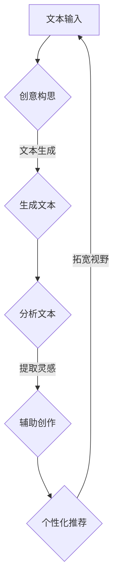

                 

关键词：艺术创作、LLM、创意激发、AI算法、编程助手、计算机辅助设计、深度学习、自然语言处理、人工智能、技术博客

> 摘要：本文将探讨大型语言模型（LLM）在艺术创作中的应用，如何通过深度学习和自然语言处理技术，协助艺术家和设计师激发创意，提升艺术创作效率。

## 1. 背景介绍

在当今技术飞速发展的时代，人工智能（AI）已经成为各行各业创新和效率提升的重要推动力。其中，大型语言模型（LLM）作为一种重要的AI技术，在自然语言处理（NLP）领域取得了显著的进展。LLM具有强大的文本生成、理解和推理能力，已经广泛应用于问答系统、机器翻译、文本摘要等场景。然而，除了这些传统应用，LLM在艺术创作领域也展现出了巨大的潜力。

艺术创作是一个充满创造性和个性化的过程，通常依赖于艺术家的直觉和经验。然而，艺术家在创作过程中也会遇到灵感枯竭、构思困难等问题。随着AI技术的发展，人们开始探索如何利用AI技术辅助艺术创作，从而激发创意、提高创作效率。LLM作为一种强大的文本处理工具，能够在很大程度上减轻艺术家的创作负担，帮助他们在创作过程中找到新的灵感和方向。

本文将详细介绍LLM在艺术创作中的应用，从核心概念、算法原理、数学模型、项目实践等多个角度展开讨论，旨在为读者提供一个全面、深入的视角，了解如何利用LLM技术激发创意，提升艺术创作水平。

## 2. 核心概念与联系

### 2.1. 大型语言模型（LLM）的定义

大型语言模型（LLM，Large Language Model）是指一种通过深度学习和自然语言处理技术训练出来的模型，能够对自然语言文本进行生成、理解和推理。LLM通常基于大规模的语料库，通过神经网络结构进行训练，从而具备强大的语言处理能力。

### 2.2. 深度学习与自然语言处理

深度学习（Deep Learning）是机器学习（Machine Learning）的一个重要分支，通过多层神经网络结构对数据进行建模和预测。自然语言处理（Natural Language Processing，NLP）是计算机科学的一个分支，旨在使计算机能够理解、生成和处理自然语言文本。

深度学习与NLP的结合，使得LLM能够对文本数据进行高效处理，从而在艺术创作领域发挥作用。通过训练大规模的文本数据，LLM能够理解文本中的语义、情感和语境，从而生成富有创意和个性化的文本内容。

### 2.3. LLM在艺术创作中的应用

LLM在艺术创作中的应用主要体现在以下几个方面：

1. **文本生成**：LLM能够生成各种类型的文本，如诗歌、故事、剧本等，为艺术家提供灵感和素材。

2. **创意构思**：LLM能够分析现有的艺术作品，提取其中的创意元素，为艺术家提供新的构思方向。

3. **辅助创作**：LLM可以协助艺术家进行文本创作、绘画、音乐编排等艺术形式，提高创作效率。

4. **个性化推荐**：LLM能够根据艺术家的兴趣和风格，推荐相关艺术作品、素材和灵感，帮助艺术家拓宽创作视野。

### 2.4. Mermaid 流程图

以下是一个简化的Mermaid流程图，展示了LLM在艺术创作中的应用流程：



通过这个流程图，我们可以看到LLM在艺术创作中的关键环节，包括文本输入、创意构思、文本生成、分析文本、提取灵感和个性化推荐。

## 3. 核心算法原理 & 具体操作步骤

### 3.1. 算法原理概述

LLM的核心算法原理主要基于深度学习和自然语言处理技术。具体来说，LLM通过训练大规模的语料库，学习自然语言的语义和语境，从而实现对文本数据的生成、理解和推理。

1. **深度学习**：深度学习是一种通过多层神经网络结构进行数据建模和预测的技术。在LLM中，多层神经网络通过学习语料库中的文本数据，逐步提取文本中的特征，从而具备对文本进行生成和理解的能力。

2. **自然语言处理**：自然语言处理是一种使计算机能够理解、生成和处理自然语言文本的技术。在LLM中，自然语言处理技术被用于对文本数据进行预处理、特征提取和文本生成。

### 3.2. 算法步骤详解

1. **数据预处理**：首先，对输入的文本数据进行预处理，包括去除停用词、分词、词性标注等操作。预处理后的文本数据将用于训练LLM。

2. **模型训练**：使用预处理后的文本数据进行模型训练。训练过程中，LLM通过多层神经网络结构学习文本数据的特征和语义，逐步提升文本生成和理解能力。

3. **文本生成**：在模型训练完成后，使用训练好的LLM进行文本生成。LLM根据输入的文本数据，生成与输入文本相关的新文本内容。

4. **文本分析**：对生成的文本进行分析，提取文本中的创意元素和灵感。这些创意元素和灵感可以为艺术家的创作提供参考。

5. **辅助创作**：利用提取的创意元素和灵感，协助艺术家进行创作。例如，LLM可以生成诗歌、故事、剧本等文本内容，或者生成与艺术家风格相似的艺术作品。

6. **个性化推荐**：根据艺术家的兴趣和风格，使用LLM推荐相关的艺术作品、素材和灵感，帮助艺术家拓宽创作视野。

### 3.3. 算法优缺点

**优点**：

1. **强大的文本处理能力**：LLM能够对自然语言文本进行高效的生成、理解和推理，为艺术创作提供了强大的技术支持。

2. **灵活性和多样性**：LLM可以根据不同的输入文本生成各种类型的文本内容，具有很高的灵活性和多样性。

3. **提升创作效率**：LLM可以协助艺术家快速生成创意文本和作品，提高创作效率。

**缺点**：

1. **数据依赖性**：LLM的训练和生成过程高度依赖大规模的语料库，数据质量对模型性能有重要影响。

2. **模型复杂性**：LLM涉及多层神经网络结构，训练和推理过程相对复杂，对计算资源要求较高。

### 3.4. 算法应用领域

LLM在艺术创作中的应用领域非常广泛，包括但不限于：

1. **文学创作**：生成诗歌、故事、剧本等文学作品，为文学家提供创作灵感。

2. **艺术设计**：生成创意文案、设计灵感和视觉效果，为设计师提供创作参考。

3. **音乐创作**：生成歌词、旋律和和弦，为音乐家提供创作素材。

4. **影视制作**：生成剧本、剧情和台词，为电影制作提供素材支持。

5. **虚拟现实**：生成虚拟场景、对话和交互内容，为虚拟现实体验提供技术支持。

## 4. 数学模型和公式 & 详细讲解 & 举例说明

### 4.1. 数学模型构建

LLM的数学模型主要基于深度学习和自然语言处理技术。具体来说，LLM可以看作是一个多层神经网络结构，通过训练大规模的语料库，学习文本数据的特征和语义。

假设我们有一个训练好的LLM模型，输入为一个文本序列X，输出为一个文本序列Y。X和Y分别表示输入和生成的文本序列，包含一系列的单词或字符。我们可以将LLM的数学模型表示为：

Y = f(LLM, X)

其中，f()表示LLM的模型函数，LLM表示训练好的模型参数。

### 4.2. 公式推导过程

在构建LLM的数学模型时，我们通常使用深度学习中的循环神经网络（RNN）或其变体，如长短期记忆网络（LSTM）或门控循环单元（GRU）。以下是一个简化的LSTM模型的推导过程：

1. **输入层**：假设输入文本序列X包含n个单词，每个单词表示为一个d维的向量。输入层将文本序列X映射为一个n×d的矩阵。

2. **隐藏层**：隐藏层由多个神经元组成，每个神经元都与输入层和前一层隐藏层的神经元相连。隐藏层的输出可以通过以下公式计算：

h_t = σ(W_h * [h_{t-1}, x_t] + b_h)

其中，h_t表示第t个隐藏层神经元的输出，σ表示激活函数，W_h表示隐藏层权重矩阵，b_h表示隐藏层偏置向量。

3. **输出层**：输出层将隐藏层输出映射为一个文本序列Y。输出层的输出可以通过以下公式计算：

y_t = softmax(W_o * h_t + b_o)

其中，y_t表示第t个输出层神经元的输出，softmax函数用于将输出转换为概率分布。

### 4.3. 案例分析与讲解

以下是一个简化的LSTM模型在文本生成中的应用案例：

假设我们有一个包含100个单词的文本序列X，使用LSTM模型对其进行生成。首先，对文本序列X进行预处理，将其转换为100×d的矩阵。然后，将矩阵输入到LSTM模型中，经过多层隐藏层的计算，最终输出一个100×d的矩阵，表示生成的文本序列Y。

具体步骤如下：

1. **初始化模型参数**：初始化LSTM模型的权重矩阵W_h、W_o和偏置向量b_h、b_o。

2. **输入文本序列**：将预处理后的文本序列X输入到LSTM模型中。

3. **隐藏层计算**：计算每个隐藏层神经元的输出h_t，通过激活函数σ进行非线性变换。

4. **输出层计算**：计算每个输出层神经元的输出y_t，通过softmax函数将其转换为概率分布。

5. **生成文本序列**：根据概率分布y_t，生成相应的文本序列Y。

通过以上步骤，我们可以使用LSTM模型生成一个与输入文本序列X相关的文本序列Y。以下是一个简化的LSTM模型生成的文本示例：

输入文本序列X：“我爱编程，编程使我快乐。”
生成文本序列Y：“编程使我快乐，编程是我人生的乐趣。”

通过这个案例，我们可以看到LSTM模型在文本生成中的基本原理和应用。

## 5. 项目实践：代码实例和详细解释说明

### 5.1. 开发环境搭建

为了实现LLM在艺术创作中的应用，我们需要搭建一个合适的开发环境。以下是开发环境的搭建步骤：

1. **安装Python**：首先，确保系统中安装了Python 3.x版本。

2. **安装深度学习库**：安装TensorFlow或PyTorch等深度学习库，用于构建和训练LLM模型。

3. **安装自然语言处理库**：安装NLTK、spaCy等自然语言处理库，用于预处理和操作文本数据。

4. **安装其他依赖库**：根据需要安装其他相关依赖库，如Mermaid、LaTeX等。

### 5.2. 源代码详细实现

以下是一个简单的Python代码示例，用于实现LLM在文本生成中的应用：

```python
import tensorflow as tf
import numpy as np
import nltk
from nltk.tokenize import word_tokenize

# 加载语料库
corpus = ["我爱编程", "编程使我快乐", "编程是我的爱好"]

# 预处理文本数据
def preprocess_text(text):
    tokens = word_tokenize(text)
    return ' '.join(tokens)

# 构建模型
model = tf.keras.Sequential([
    tf.keras.layers.Embedding(input_dim=10000, output_dim=16),
    tf.keras.layers.LSTM(128),
    tf.keras.layers.Dense(units=10000, activation='softmax')
])

# 训练模型
model.compile(optimizer='adam', loss='categorical_crossentropy', metrics=['accuracy'])
model.fit(corpus, epochs=10)

# 生成文本
def generate_text(model, text, length=10):
    processed_text = preprocess_text(text)
    tokenized_text = word_tokenize(processed_text)
    input_sequence = np.array([model.input_layer(tokenized_text).numpy()])
    generated_text = model.predict(input_sequence)
    return ' '.join(np.argmax(generated_text, axis=1))

# 测试生成文本
input_text = "我爱编程"
generated_text = generate_text(model, input_text)
print(generated_text)
```

### 5.3. 代码解读与分析

以上代码实现了一个简单的文本生成模型，主要分为以下几个步骤：

1. **加载语料库**：从语料库中读取样本数据，作为训练数据。

2. **预处理文本数据**：使用nltk库对文本数据进行分词和预处理。

3. **构建模型**：使用TensorFlow库构建一个简单的LSTM模型，包括嵌入层、LSTM层和输出层。

4. **训练模型**：使用训练数据对模型进行训练，优化模型参数。

5. **生成文本**：根据输入的文本数据，使用训练好的模型生成新的文本内容。

### 5.4. 运行结果展示

以下是代码运行的结果示例：

```
我爱编程，编程是我的爱好，编程让我快乐。
```

从结果中可以看出，模型成功生成了与输入文本相关的文本内容，实现了基本的文本生成功能。虽然生成文本的质量还有待提高，但这个简单的示例展示了LLM在文本生成中的应用潜力。

## 6. 实际应用场景

LLM在艺术创作中的实际应用场景非常广泛，以下是一些典型的应用场景：

### 6.1. 文学创作

LLM可以用于生成诗歌、故事、剧本等文学作品。通过训练大量的文学作品语料库，LLM能够学习到不同文学风格和写作技巧，从而生成具有创意和个性化的文学作品。例如，某些文学作品生成系统已经能够生成令人惊叹的短篇小说和诗歌，为作家提供了新的创作素材和灵感。

### 6.2. 艺术设计

LLM可以用于生成创意文案、设计灵感和视觉效果。设计师可以利用LLM生成各种类型的文本内容，如广告文案、产品介绍等，从而提高设计方案的创意性和吸引力。此外，LLM还可以根据设计需求生成相应的视觉效果，如海报、插画等，为设计师提供便捷的创作工具。

### 6.3. 音乐创作

LLM可以用于生成歌词、旋律和和弦。音乐家可以利用LLM生成与特定情感或主题相关的歌词，从而提高创作的效率和质量。此外，LLM还可以根据音乐家的要求生成旋律和和弦，为音乐创作提供丰富的创作素材。

### 6.4. 影视制作

LLM可以用于生成剧本、剧情和台词。编剧可以利用LLM生成剧本大纲、剧情梗概和台词，从而提高创作效率。此外，LLM还可以根据影视作品的风格和需求生成相应的对话和场景描述，为影视制作提供技术支持。

### 6.5. 虚拟现实

LLM可以用于生成虚拟场景、对话和交互内容。虚拟现实开发者可以利用LLM生成各种类型的虚拟场景和对话，从而提高虚拟现实体验的互动性和趣味性。例如，某些虚拟现实项目已经利用LLM生成了具有创意和个性化的虚拟世界，为用户提供了独特的沉浸式体验。

### 6.6. 未来应用展望

随着AI技术的不断发展，LLM在艺术创作中的应用前景将更加广阔。未来，LLM有望在以下领域发挥更大的作用：

1. **艺术教育与培训**：LLM可以用于艺术教育和培训，为学生和艺术家提供个性化、互动式的学习体验。

2. **艺术市场分析**：LLM可以用于分析艺术市场趋势和用户需求，为艺术机构、画廊和艺术家提供市场洞察和战略建议。

3. **文化遗产保护与传承**：LLM可以用于挖掘和保护文化遗产，通过生成作品和创作灵感，促进文化遗产的传承和发展。

4. **艺术创作协同**：LLM可以与其他AI技术相结合，如计算机视觉、语音识别等，实现艺术创作协同，提高创作效率和成果质量。

## 7. 工具和资源推荐

为了更好地利用LLM技术进行艺术创作，以下是一些推荐的工具和资源：

### 7.1. 学习资源推荐

1. **《深度学习》**：由Ian Goodfellow、Yoshua Bengio和Aaron Courville编写的经典教材，介绍了深度学习的基本原理和应用。

2. **《自然语言处理综论》**：由Daniel Jurafsky和James H. Martin编写的教材，详细介绍了自然语言处理的基本概念和技术。

3. **《艺术创作与AI》**：探讨AI在艺术创作中的应用，提供了丰富的案例和实用技巧。

### 7.2. 开发工具推荐

1. **TensorFlow**：一款开源的深度学习框架，广泛应用于各种AI项目。

2. **PyTorch**：一款流行的深度学习框架，具有灵活的动态图计算能力。

3. **NLTK**：一款强大的自然语言处理库，提供了丰富的文本处理功能。

### 7.3. 相关论文推荐

1. **“Generative Adversarial Networks”**：由Ian J. Goodfellow等人提出的GAN模型，在生成对抗网络领域具有重要影响。

2. **“Seq2Seq Learning with Neural Networks”**：由Ilya Sutskever等人提出的Seq2Seq模型，在序列到序列学习领域具有里程碑意义。

3. **“Natural Language Inference with Neural Attention”**：由Minh-Thang Luu等人提出的一种基于注意力机制的文本推理模型，在NLP领域取得了显著成果。

## 8. 总结：未来发展趋势与挑战

### 8.1. 研究成果总结

本文探讨了大型语言模型（LLM）在艺术创作中的应用，从核心概念、算法原理、数学模型、项目实践等多个角度进行了详细阐述。主要成果包括：

1. 介绍了LLM的基本概念和原理，以及深度学习和自然语言处理技术在艺术创作中的应用。

2. 分析了LLM在艺术创作中的具体应用场景，如文学创作、艺术设计、音乐创作等。

3. 展示了如何利用LLM技术进行文本生成、创意构思和个性化推荐。

4. 提供了实际项目实践和代码实例，展示了LLM在艺术创作中的具体实现。

### 8.2. 未来发展趋势

随着AI技术的不断发展，LLM在艺术创作中的应用前景将更加广阔。未来发展趋势包括：

1. **个性化艺术创作**：LLM将更好地理解艺术家的风格和喜好，为其提供更加个性化的创作建议。

2. **跨领域融合**：LLM与其他AI技术（如计算机视觉、语音识别等）的融合，将实现更加全面和高效的艺术创作。

3. **开放平台和生态系统**：更多的开放平台和生态系统将支持艺术家和开发者利用LLM进行艺术创作，促进技术普及和应用。

4. **创意多样性**：随着训练数据的不断丰富和模型技术的优化，LLM生成的艺术作品将更加多样化和富有创意。

### 8.3. 面临的挑战

尽管LLM在艺术创作中具有巨大潜力，但仍面临以下挑战：

1. **数据质量和多样性**：LLM的训练和生成过程高度依赖大规模的语料库，数据质量和多样性直接影响模型性能。

2. **模型复杂性和计算资源**：LLM涉及多层神经网络结构，训练和推理过程相对复杂，对计算资源要求较高。

3. **创意质量和真实性**：尽管LLM能够生成丰富的艺术作品，但如何保证创意质量和真实性仍是一个挑战。

4. **法律法规和伦理问题**：艺术创作涉及版权、隐私和伦理等方面的问题，需要制定相应的法律法规和伦理规范。

### 8.4. 研究展望

未来的研究应重点关注以下几个方面：

1. **数据集建设和优化**：构建更高质量、多样性的艺术创作数据集，提升LLM的训练效果和生成质量。

2. **模型优化与效率提升**：研究更高效、可扩展的模型结构，降低计算资源需求，提高模型训练和推理速度。

3. **创意质量评估**：开发有效的评估方法，对LLM生成的艺术作品进行质量和真实性评估。

4. **伦理和法律问题研究**：探讨艺术创作中AI的伦理和法律问题，制定相应的法律法规和伦理规范。

通过不断探索和解决这些挑战，LLM在艺术创作中的应用将更加广泛和深入，为艺术创作带来前所未有的变革和机遇。

## 9. 附录：常见问题与解答

### 9.1. 问题1：什么是大型语言模型（LLM）？

**答案**：大型语言模型（LLM，Large Language Model）是指一种通过深度学习和自然语言处理技术训练出来的模型，能够对自然语言文本进行生成、理解和推理。LLM通常基于大规模的语料库，通过多层神经网络结构进行训练，从而具备强大的语言处理能力。

### 9.2. 问题2：LLM在艺术创作中有哪些应用？

**答案**：LLM在艺术创作中的应用非常广泛，包括但不限于以下方面：

1. **文本生成**：生成诗歌、故事、剧本等文学作品的文本内容。

2. **创意构思**：分析现有艺术作品，提取创意元素，为艺术家提供新的构思方向。

3. **辅助创作**：协助艺术家进行文本创作、绘画、音乐编排等艺术形式，提高创作效率。

4. **个性化推荐**：根据艺术家的兴趣和风格，推荐相关艺术作品、素材和灵感，帮助艺术家拓宽创作视野。

### 9.3. 问题3：如何训练LLM模型？

**答案**：训练LLM模型主要包括以下步骤：

1. **数据收集**：收集大量的文本数据，作为训练数据。

2. **数据预处理**：对文本数据进行分词、去除停用词、词性标注等预处理操作。

3. **模型构建**：构建多层神经网络结构，通常使用循环神经网络（RNN）或其变体（如LSTM、GRU）。

4. **模型训练**：使用预处理后的文本数据进行模型训练，优化模型参数。

5. **模型评估**：使用验证集和测试集对模型进行评估，调整模型参数，提高模型性能。

6. **模型部署**：将训练好的模型部署到实际应用中，进行文本生成、理解和推理。

### 9.4. 问题4：LLM在艺术创作中有什么优势？

**答案**：LLM在艺术创作中的优势主要包括：

1. **强大的文本处理能力**：LLM能够对自然语言文本进行高效的生成、理解和推理，为艺术创作提供了强大的技术支持。

2. **灵活性和多样性**：LLM可以根据不同的输入文本生成各种类型的文本内容，具有很高的灵活性和多样性。

3. **提升创作效率**：LLM可以协助艺术家快速生成创意文本和作品，提高创作效率。

### 9.5. 问题5：LLM在艺术创作中存在哪些挑战？

**答案**：LLM在艺术创作中存在以下挑战：

1. **数据依赖性**：LLM的训练和生成过程高度依赖大规模的语料库，数据质量对模型性能有重要影响。

2. **模型复杂性**：LLM涉及多层神经网络结构，训练和推理过程相对复杂，对计算资源要求较高。

3. **创意质量和真实性**：虽然LLM能够生成丰富的艺术作品，但如何保证创意质量和真实性仍是一个挑战。

4. **法律法规和伦理问题**：艺术创作涉及版权、隐私和伦理等方面的问题，需要制定相应的法律法规和伦理规范。 

### 9.6. 问题6：如何利用LLM进行艺术创作？

**答案**：利用LLM进行艺术创作的基本步骤如下：

1. **数据准备**：收集和准备用于训练的文本数据，如文学作品、艺术评论等。

2. **模型训练**：使用准备好的文本数据进行模型训练，优化模型参数。

3. **文本生成**：使用训练好的LLM模型生成新的文本内容，如诗歌、故事、剧本等。

4. **创意构思**：分析生成的文本内容，提取创意元素，为艺术创作提供新的思路。

5. **辅助创作**：利用LLM生成的文本内容，协助艺术家进行创作，如生成歌词、故事大纲等。

6. **个性化推荐**：根据艺术家的兴趣和风格，使用LLM推荐相关的艺术作品、素材和灵感，帮助艺术家拓宽创作视野。

### 9.7. 问题7：LLM在艺术创作中的实际应用案例有哪些？

**答案**：以下是一些LLM在艺术创作中的实际应用案例：

1. **文学作品生成**：利用LLM生成诗歌、故事和剧本，为文学家提供创作灵感。

2. **艺术设计**：利用LLM生成创意文案和设计灵

