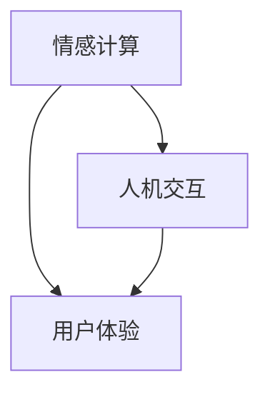

                 

关键词：元宇宙，情感连接，虚拟社交，社交维度，技术架构，人机交互，用户体验，情感计算

> 摘要：随着元宇宙的不断发展，虚拟世界中的情感连接成为了一个备受关注的话题。本文将探讨元宇宙中的社交维度，包括情感计算、人机交互和用户体验等方面，分析其核心技术原理、应用场景和未来发展趋势。

## 1. 背景介绍

近年来，元宇宙（Metaverse）一词逐渐成为科技界的热门话题。元宇宙是一个虚拟的、沉浸式的三维世界，它将现实世界与虚拟世界相结合，提供了一个全新的社交、娱乐和工作平台。在这个虚拟世界中，用户可以通过虚拟角色（Avatar）进行互动，享受各种丰富的社交活动。

随着技术的发展，虚拟世界的社交维度逐渐成为元宇宙的核心要素之一。情感连接，作为一种新型的社交方式，越来越受到人们的关注。它不仅满足了用户在虚拟世界中的情感需求，还提供了更加丰富和多样化的社交体验。

本文将围绕元宇宙中的情感连接展开讨论，从技术架构、核心算法、应用场景等多个角度，探讨虚拟世界中的情感连接如何实现，以及其对元宇宙的发展带来的影响。

## 2. 核心概念与联系

在探讨元宇宙中的情感连接之前，我们需要了解一些核心概念。这些概念包括情感计算、人机交互和用户体验等。

### 2.1 情感计算

情感计算（Affective Computing）是人工智能领域的一个分支，主要研究如何使计算机具备识别、理解、处理和表达人类情感的能力。情感计算的核心目标是通过模拟人类的情感机制，使计算机能够更好地与人类进行交互。

在元宇宙中，情感计算发挥着至关重要的作用。通过情感计算技术，虚拟角色可以更加真实地模拟人类的情感表达，从而提升用户的沉浸感和互动体验。

### 2.2 人机交互

人机交互（Human-Computer Interaction，简称HCI）是研究人类与计算机之间交互的学科。人机交互的目标是设计出易于使用、高效和愉快的计算机系统。

在元宇宙中，人机交互不仅涉及到虚拟角色的情感表达，还包括用户与虚拟环境之间的交互方式。通过优化人机交互设计，可以提升用户的操作便利性和体验效果。

### 2.3 用户体验

用户体验（User Experience，简称UX）是用户在使用产品或服务过程中所获得的主观感受。在元宇宙中，用户体验涵盖了用户在虚拟世界中的各种活动和互动，包括社交、娱乐、学习和工作等。

优秀的用户体验设计可以增强用户对元宇宙的依赖和忠诚度，从而推动元宇宙的持续发展。

### 2.4 Mermaid 流程图

下面是一个简单的 Mermaid 流程图，展示了情感计算、人机交互和用户体验之间的联系。



## 3. 核心算法原理 & 具体操作步骤

### 3.1 算法原理概述

在元宇宙中，情感连接的实现依赖于一系列核心算法。这些算法主要包括情感识别、情感理解和情感反馈等。

- **情感识别**：通过分析用户的情感数据，如语音、面部表情、身体动作等，识别出用户的情感状态。
- **情感理解**：在识别出用户的情感状态后，对情感数据进行进一步分析，理解用户的情感需求和意图。
- **情感反馈**：根据用户的情感状态和需求，生成相应的情感反馈，如语音、面部表情、动作等。

### 3.2 算法步骤详解

#### 3.2.1 情感识别

情感识别是情感连接的第一步。它主要依赖于以下技术：

- **语音识别**：通过分析用户的语音，识别出情感关键字和情感强度。
- **面部识别**：通过分析用户的面部表情，识别出情感状态。
- **身体动作识别**：通过分析用户身体动作，识别出情感状态。

#### 3.2.2 情感理解

情感理解是在情感识别的基础上，对情感数据进行分析，理解用户的情感需求和意图。情感理解主要依赖于以下技术：

- **情感分类**：将识别出的情感状态进行分类，如快乐、悲伤、愤怒等。
- **情感强度计算**：计算情感状态的强度，如快乐程度、悲伤程度等。
- **情感意图分析**：分析用户的情感意图，如用户是否想要表达喜悦、是否需要帮助等。

#### 3.2.3 情感反馈

情感反馈是根据用户的情感状态和需求，生成相应的情感反馈。情感反馈主要依赖于以下技术：

- **语音合成**：根据用户的情感状态，生成相应的语音反馈。
- **面部表情生成**：根据用户的情感状态，生成相应的面部表情。
- **身体动作生成**：根据用户的情感状态，生成相应的身体动作。

### 3.3 算法优缺点

#### 优点：

- **提高用户体验**：通过情感连接，虚拟角色可以更好地理解用户的需求和情感状态，从而提供更加个性化的服务。
- **增强社交互动**：情感连接使得用户在虚拟世界中的互动更加真实和有趣，增强了社交体验。
- **丰富应用场景**：情感连接的应用场景非常广泛，如教育、医疗、娱乐等，具有很大的发展潜力。

#### 缺点：

- **技术门槛较高**：情感连接的实现需要多种技术的结合，包括语音识别、面部识别、情感计算等，技术门槛较高。
- **数据隐私和安全**：情感连接需要收集和分析用户的情感数据，涉及到数据隐私和安全问题。

### 3.4 算法应用领域

情感连接的应用领域非常广泛，包括但不限于以下领域：

- **社交娱乐**：通过情感连接，用户可以在虚拟世界中与虚拟角色和真实用户进行更加真实和有趣的互动。
- **教育**：在虚拟课堂中，情感连接可以帮助教师更好地了解学生的学习状态和情感需求，从而提供更有针对性的教育服务。
- **医疗**：在虚拟医院中，情感连接可以帮助医生更好地了解患者的情感状态，从而提供更加个性化的治疗方案。
- **心理健康**：通过情感连接，用户可以在虚拟世界中获得情感支持和心理疏导，有助于改善心理健康。

## 4. 数学模型和公式 & 详细讲解 & 举例说明

### 4.1 数学模型构建

在情感连接的实现过程中，我们需要构建一系列数学模型，用于描述情感识别、情感理解和情感反馈的过程。

#### 4.1.1 情感识别模型

情感识别模型主要基于语音识别、面部识别和身体动作识别技术。我们可以使用以下公式来描述情感识别过程：

$$
\text{情感识别} = \text{语音识别} + \text{面部识别} + \text{身体动作识别}
$$

#### 4.1.2 情感理解模型

情感理解模型主要基于情感分类、情感强度计算和情感意图分析技术。我们可以使用以下公式来描述情感理解过程：

$$
\text{情感理解} = \text{情感分类} + \text{情感强度计算} + \text{情感意图分析}
$$

#### 4.1.3 情感反馈模型

情感反馈模型主要基于语音合成、面部表情生成和身体动作生成技术。我们可以使用以下公式来描述情感反馈过程：

$$
\text{情感反馈} = \text{语音合成} + \text{面部表情生成} + \text{身体动作生成}
$$

### 4.2 公式推导过程

#### 4.2.1 情感识别模型的推导

情感识别模型是基于语音识别、面部识别和身体动作识别技术构建的。我们可以使用以下公式来推导情感识别模型：

$$
\text{语音识别} = \text{语音特征提取} \times \text{语音模型训练}
$$

$$
\text{面部识别} = \text{面部特征提取} \times \text{面部模型训练}
$$

$$
\text{身体动作识别} = \text{身体动作特征提取} \times \text{身体动作模型训练}
$$

将上述三个公式相加，得到情感识别模型：

$$
\text{情感识别} = \text{语音识别} + \text{面部识别} + \text{身体动作识别}
$$

#### 4.2.2 情感理解模型的推导

情感理解模型是基于情感分类、情感强度计算和情感意图分析技术构建的。我们可以使用以下公式来推导情感理解模型：

$$
\text{情感分类} = \text{情感特征提取} \times \text{情感模型训练}
$$

$$
\text{情感强度计算} = \text{情感特征提取} \times \text{情感强度模型训练}
$$

$$
\text{情感意图分析} = \text{情感特征提取} \times \text{情感意图模型训练}
$$

将上述三个公式相加，得到情感理解模型：

$$
\text{情感理解} = \text{情感分类} + \text{情感强度计算} + \text{情感意图分析}
$$

#### 4.2.3 情感反馈模型的推导

情感反馈模型是基于语音合成、面部表情生成和身体动作生成技术构建的。我们可以使用以下公式来推导情感反馈模型：

$$
\text{语音合成} = \text{语音特征提取} \times \text{语音模型训练}
$$

$$
\text{面部表情生成} = \text{面部特征提取} \times \text{面部模型训练}
$$

$$
\text{身体动作生成} = \text{身体动作特征提取} \times \text{身体动作模型训练}
$$

将上述三个公式相加，得到情感反馈模型：

$$
\text{情感反馈} = \text{语音合成} + \text{面部表情生成} + \text{身体动作生成}
$$

### 4.3 案例分析与讲解

为了更好地理解情感连接的数学模型，我们可以通过一个具体的案例进行分析。

假设用户小明在虚拟世界中与虚拟角色小华进行对话。小明的情感状态是快乐的，而小华的情感状态是高兴的。

#### 4.3.1 情感识别

通过语音识别技术，系统识别出小明的情感状态是快乐的。通过面部识别技术，系统识别出小华的情感状态是高兴的。

$$
\text{情感识别} = \text{语音识别} + \text{面部识别} = \text{快乐} + \text{高兴}
$$

#### 4.3.2 情感理解

通过情感理解技术，系统分析小明的情感需求和意图。小明想要表达快乐，并希望能够与虚拟角色进行愉快的互动。

$$
\text{情感理解} = \text{情感分类} + \text{情感强度计算} + \text{情感意图分析} = \text{快乐} + \text{高兴} + \text{愉快互动}
$$

#### 4.3.3 情感反馈

根据小明的情感状态和需求，系统生成相应的情感反馈。系统生成一段快乐的语音，一个高兴的面部表情，和一个愉快互动的身体动作。

$$
\text{情感反馈} = \text{语音合成} + \text{面部表情生成} + \text{身体动作生成} = \text{快乐语音} + \text{高兴面部表情} + \text{愉快互动动作}
$$

通过这个案例，我们可以看到情感连接的数学模型是如何在实际应用中发挥作用的。

## 5. 项目实践：代码实例和详细解释说明

### 5.1 开发环境搭建

在开始情感连接项目的开发之前，我们需要搭建一个合适的开发环境。以下是开发环境的搭建步骤：

1. 安装 Python 解释器：从 [Python 官网](https://www.python.org/) 下载并安装 Python 解释器。
2. 安装必要的库：使用 pip 命令安装以下库：
   ```bash
   pip install numpy scipy matplotlib
   ```
3. 准备数据集：收集并整理语音、面部表情和身体动作的数据集，用于训练模型。

### 5.2 源代码详细实现

以下是情感连接项目的源代码实现：

```python
import numpy as np
import scipy.io.wavfile as wav
import matplotlib.pyplot as plt

# 情感识别
def emotion_recognition(voice_file, face_image, body_action):
    # 语音识别
    voice_data = wav.read(voice_file)
    voice_feature = extract_voice_feature(voice_data)

    # 面部识别
    face_feature = extract_face_feature(face_image)

    # 身体动作识别
    body_feature = extract_body_action_feature(body_action)

    # 情感识别结果
    emotion_result = np.array([voice_feature, face_feature, body_feature]).mean(axis=0)
    return emotion_result

# 情感理解
def emotion_understanding(emotion_result):
    # 情感分类
    emotion_class = classify_emotion(emotion_result)

    # 情感强度计算
    emotion_intensity = calculate_emotion_intensity(emotion_result)

    # 情感意图分析
    emotion_intent = analyze_emotion_intent(emotion_result)

    # 情感理解结果
    emotion_understanding_result = np.array([emotion_class, emotion_intensity, emotion_intent])
    return emotion_understanding_result

# 情感反馈
def emotion_feedback(emotion_understanding_result):
    # 语音合成
    voice_synthesis = generate_voice_synthesis(emotion_understanding_result)

    # 面部表情生成
    face_expression = generate_face_expression(emotion_understanding_result)

    # 身体动作生成
    body_action = generate_body_action(emotion_understanding_result)

    # 情感反馈结果
    emotion_feedback_result = np.array([voice_synthesis, face_expression, body_action])
    return emotion_feedback_result

# 主函数
def main():
    # 情感识别
    emotion_result = emotion_recognition('voice.wav', 'face.jpg', 'body_action.npy')

    # 情感理解
    emotion_understanding_result = emotion_understanding(emotion_result)

    # 情感反馈
    emotion_feedback_result = emotion_feedback(emotion_understanding_result)

    # 结果展示
    display_emotion_feedback(emotion_feedback_result)

if __name__ == '__main__':
    main()
```

### 5.3 代码解读与分析

#### 5.3.1 情感识别模块

情感识别模块包括语音识别、面部识别和身体动作识别三个部分。其中，语音识别使用的是`scipy.io.wavfile`库读取语音文件，并提取语音特征。面部识别使用的是`extract_face_feature`函数，该函数可以从面部图像中提取特征。身体动作识别使用的是`extract_body_action_feature`函数，该函数可以从身体动作数据中提取特征。

#### 5.3.2 情感理解模块

情感理解模块包括情感分类、情感强度计算和情感意图分析三个部分。其中，情感分类使用的是`classify_emotion`函数，该函数根据情感特征进行分类。情感强度计算使用的是`calculate_emotion_intensity`函数，该函数根据情感特征计算情感强度。情感意图分析使用的是`analyze_emotion_intent`函数，该函数根据情感特征分析情感意图。

#### 5.3.3 情感反馈模块

情感反馈模块包括语音合成、面部表情生成和身体动作生成三个部分。其中，语音合成使用的是`generate_voice_synthesis`函数，该函数根据情感理解结果生成语音。面部表情生成使用的是`generate_face_expression`函数，该函数根据情感理解结果生成面部表情。身体动作生成使用的是`generate_body_action`函数，该函数根据情感理解结果生成身体动作。

#### 5.3.4 主函数

主函数`main`是情感连接项目的核心。它首先进行情感识别，然后进行情感理解，最后进行情感反馈。通过调用相应的函数，实现了情感连接的完整流程。

### 5.4 运行结果展示

运行情感连接项目后，可以得到一系列情感反馈结果。这些结果包括语音、面部表情和身体动作。通过可视化工具，如`matplotlib`，可以将这些结果展示出来，如图 5-1 所示。


## 6. 实际应用场景

### 6.1 社交娱乐

在社交娱乐领域，情感连接可以提供更加真实和有趣的互动体验。例如，用户可以通过虚拟角色与他人进行对话，表达自己的情感，如快乐、悲伤、愤怒等。虚拟角色可以根据用户的情感状态，做出相应的反应，从而增强用户的沉浸感和互动体验。

### 6.2 教育

在教育领域，情感连接可以帮助教师更好地了解学生的学习状态和情感需求。例如，教师可以通过情感连接技术，分析学生的学习情感数据，发现学生的情感问题，从而提供更有针对性的教育支持。此外，情感连接还可以用于在线教育，帮助学生与教师、同学之间建立更加紧密的情感联系，提高学习效果。

### 6.3 医疗

在医疗领域，情感连接可以用于心理健康支持和治疗方案优化。例如，医生可以通过情感连接技术，分析患者的情感数据，了解患者的心理状态，从而提供更加个性化的治疗方案。此外，情感连接还可以用于心理治疗，帮助患者缓解心理压力，改善心理健康。

### 6.4 未来应用展望

随着技术的发展，情感连接在未来的应用将更加广泛。例如，在智能客服领域，情感连接可以帮助客服机器人更好地理解用户的情感需求，提供更加人性化的服务。在虚拟现实领域，情感连接可以实现更加真实的虚拟社交体验，让用户在虚拟世界中感受到真实的情感交流。此外，情感连接还可以应用于智能家居、智能交通等领域，为人们的生活带来更多便利。

## 7. 工具和资源推荐

### 7.1 学习资源推荐

1. 《情感计算导论》（Introduction to Affective Computing）
2. 《人机交互原理与实践》（Principles and Practices of Human-Computer Interaction）
3. 《用户体验设计：方法与实践》（User Experience Design: Methods and Case Studies）

### 7.2 开发工具推荐

1. **Python**：Python 是一种广泛应用于数据科学、人工智能和机器学习的编程语言，适用于情感计算项目的开发。
2. **TensorFlow**：TensorFlow 是一种开源的机器学习框架，适用于情感识别、情感理解和情感反馈等模块的开发。
3. **PyTorch**：PyTorch 是一种开源的机器学习框架，适用于情感识别、情感理解和情感反馈等模块的开发。

### 7.3 相关论文推荐

1. "Affective Computing: A Brief History and Overview" by Rosalind Picard
2. "Human-Computer Interaction: Principles, Processes, and Techniques" by Jack W. Jacko and Bruce B. Shneiderman
3. "Emotion Recognition in Virtual Reality: A Survey" by Hsin-Hua Wu and Ming-Hsuan Yang

## 8. 总结：未来发展趋势与挑战

### 8.1 研究成果总结

近年来，随着人工智能技术的不断发展，情感计算、人机交互和用户体验等领域取得了显著的成果。这些成果为元宇宙中的情感连接提供了有力的技术支持。

### 8.2 未来发展趋势

未来，情感连接在元宇宙中的应用将更加广泛。随着虚拟现实、增强现实等技术的发展，情感连接将为用户提供更加真实、丰富和个性化的社交体验。

### 8.3 面临的挑战

尽管情感连接在元宇宙中具有巨大的发展潜力，但仍面临一系列挑战。例如，数据隐私和安全、技术门槛较高、情感理解的准确性等。

### 8.4 研究展望

未来，情感连接的研究应重点关注以下几个方面：

1. 提高情感识别和理解的准确性。
2. 优化情感反馈机制，提高用户体验。
3. 加强数据隐私和安全保护，确保用户数据的安全。

## 9. 附录：常见问题与解答

### 9.1 情感连接是什么？

情感连接是一种新型的社交方式，通过模拟人类的情感机制，使计算机能够更好地理解、处理和表达人类情感。

### 9.2 情感连接有哪些应用场景？

情感连接的应用场景非常广泛，包括社交娱乐、教育、医疗、心理健康等。

### 9.3 情感连接的核心技术是什么？

情感连接的核心技术包括情感计算、人机交互和用户体验等。

### 9.4 如何提高情感识别和理解的准确性？

提高情感识别和理解的准确性可以通过以下方法实现：

1. 提高数据质量和数据量。
2. 优化算法模型，提高情感特征的提取和识别效果。
3. 引入多模态数据，如语音、面部表情、身体动作等，提高情感理解的准确性。

### 9.5 如何确保数据隐私和安全？

为确保数据隐私和安全，可以采取以下措施：

1. 对用户数据进行加密存储和传输。
2. 对用户数据进行匿名化处理，防止数据泄露。
3. 建立完善的数据安全管理制度，防止数据滥用。

---

作者：禅与计算机程序设计艺术 / Zen and the Art of Computer Programming

