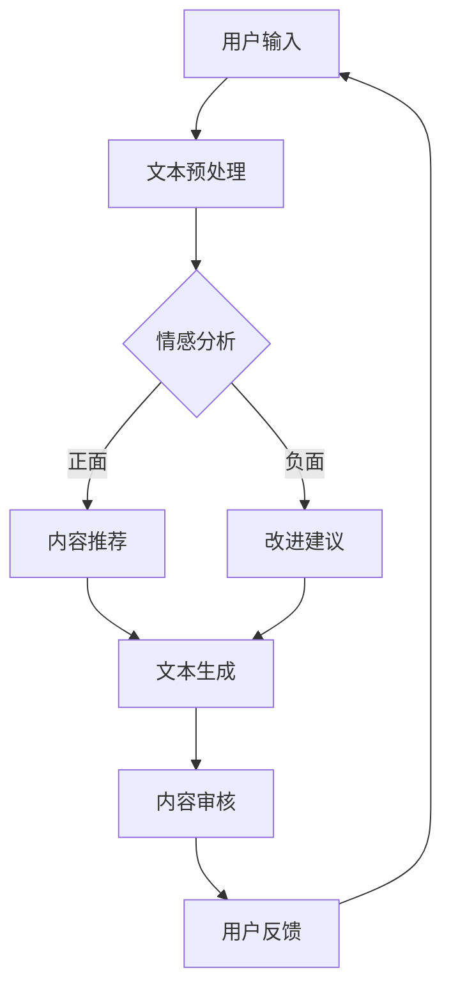

                 

关键词：虚拟作家工作室、AI协作、创作平台、文本生成、自然语言处理、机器学习、大数据分析

> 摘要：本文深入探讨了虚拟作家工作室——一个基于人工智能的协作创作平台。通过整合先进的自然语言处理技术、机器学习算法和大数据分析，该平台旨在提高创作效率、拓展创意空间，并推动人机协作的新模式。

## 1. 背景介绍

随着互联网和数字技术的飞速发展，内容创作行业面临着前所未有的机遇和挑战。传统的内容创作方式往往需要大量的人力和时间投入，而市场需求和用户期望的不断变化要求创作者必须具备高效的适应能力。此外，创意枯竭、创作瓶颈等问题也日益突出。在这样的背景下，人工智能作为一种新兴技术，逐渐成为解决这些问题的有效工具。

虚拟作家工作室作为一个基于人工智能的协作创作平台，旨在通过智能化工具和方法，实现创作者与AI之间的有效协作。平台的核心功能包括文本生成、创意拓展、内容审核、情感分析等，旨在提升创作的效率和品质。

### 人工智能在内容创作中的应用

人工智能在内容创作中的应用已经成为不可逆转的趋势。例如，自然语言处理（NLP）技术可以帮助AI理解和生成自然语言文本；机器学习算法则可以用于预测用户兴趣、优化内容推荐；大数据分析则可以为创作者提供深入的洞察，帮助其更好地理解用户需求和市场趋势。

## 2. 核心概念与联系

为了更好地理解虚拟作家工作室的工作原理，我们需要介绍几个核心概念，并展示它们之间的联系。

### 2.1 自然语言处理（NLP）

自然语言处理是人工智能的一个重要分支，主要研究如何让计算机理解、生成和处理人类自然语言。在虚拟作家工作室中，NLP技术被用于文本生成、情感分析和语义理解等方面。

### 2.2 机器学习

机器学习是人工智能的核心技术之一，它使计算机能够通过数据学习，从而进行预测和决策。在虚拟作家工作室中，机器学习算法被用于用户行为分析、内容推荐和创作风格识别等。

### 2.3 大数据分析

大数据分析通过处理海量数据，帮助创作者获得深入的业务洞察和用户洞察。虚拟作家工作室利用大数据分析，可以为创作者提供市场趋势分析、用户喜好预测等支持。

### 2.4 Mermaid 流程图

以下是一个简化的虚拟作家工作室工作流程的 Mermaid 流程图：



## 3. 核心算法原理 & 具体操作步骤

### 3.1 算法原理概述

虚拟作家工作室的核心算法主要包括自然语言处理（NLP）算法、机器学习算法和大数据分析算法。以下是每个算法的简要概述：

- **NLP算法**：用于文本生成、情感分析和语义理解等任务。常用的模型包括词向量模型（如Word2Vec）、序列到序列模型（如Seq2Seq）和生成对抗网络（如GAN）。
- **机器学习算法**：用于用户行为分析、内容推荐和创作风格识别等任务。常用的模型包括线性回归、决策树、随机森林和神经网络等。
- **大数据分析算法**：用于市场趋势分析、用户喜好预测等任务。常用的算法包括聚类分析、关联规则学习和时间序列分析等。

### 3.2 算法步骤详解

虚拟作家工作室的操作步骤可以分为以下几个阶段：

1. **用户输入**：用户通过平台提交创作请求或原始文本。
2. **文本预处理**：对用户输入的文本进行清洗、分词、去停用词等预处理操作。
3. **情感分析**：利用NLP算法对预处理后的文本进行情感分析，以确定文本的情感倾向。
4. **内容生成**：根据情感分析和用户请求，利用机器学习算法和NLP算法生成新的文本内容。
5. **内容审核**：利用预训练的模型对生成的文本进行审核，确保文本的合规性和质量。
6. **用户反馈**：将生成的文本内容展示给用户，并收集用户反馈。
7. **持续优化**：根据用户反馈和数据分析结果，不断优化算法和模型，提高创作质量和效率。

### 3.3 算法优缺点

- **NLP算法**：优点包括强大的文本生成能力、情感分析和语义理解能力；缺点包括对大规模语料库的需求较高、计算资源消耗较大。
- **机器学习算法**：优点包括强大的预测和决策能力、适用范围广泛；缺点包括对数据质量的要求较高、模型解释性较差。
- **大数据分析算法**：优点包括强大的数据分析能力、能够处理海量数据；缺点包括对计算资源的需求较高、算法实现复杂。

### 3.4 算法应用领域

虚拟作家工作室的核心算法在多个领域具有广泛的应用前景，包括但不限于：

- **新闻媒体**：利用算法自动生成新闻稿、分析市场趋势、优化内容推荐。
- **广告营销**：利用算法生成创意广告文案、分析用户行为、优化广告投放策略。
- **教育行业**：利用算法自动生成教学资料、分析学生学习情况、提供个性化学习建议。
- **娱乐产业**：利用算法生成剧本、分析用户喜好、优化内容推荐。

## 4. 数学模型和公式 & 详细讲解 & 举例说明

### 4.1 数学模型构建

虚拟作家工作室中的数学模型主要涉及自然语言处理（NLP）、机器学习（ML）和大数据分析（DA）等领域的算法。以下是一个简化的数学模型构建过程：

1. **NLP模型**：使用词嵌入（Word Embedding）技术将文本转换为向量表示。词嵌入模型的常用方法包括Word2Vec、GloVe等。词向量模型可以通过以下公式表示：

   $$ \text{vec}(w) = \sum_{i=1}^{|V|} f(w_i) \cdot e_i $$

   其中，$\text{vec}(w)$表示单词$w$的向量表示，$f(w_i)$表示单词$w_i$的频率，$e_i$表示预训练的词向量。

2. **ML模型**：使用决策树（Decision Tree）或神经网络（Neural Network）等机器学习算法进行文本分类或回归任务。以决策树为例，其决策规则可以通过以下公式表示：

   $$ \text{rule}(x) = \left\{
   \begin{array}{ll}
   \text{Class}_1 & \text{if } x \in \text{Region}_1 \\
   \text{Class}_2 & \text{if } x \in \text{Region}_2 \\
   \vdots & \vdots \\
   \text{Class}_n & \text{if } x \in \text{Region}_n
   \end{array}
   \right. $$

3. **DA模型**：使用聚类分析（Clustering Analysis）或关联规则学习（Association Rule Learning）等大数据分析算法进行用户行为分析或市场预测。以K-均值聚类为例，其聚类中心可以通过以下公式计算：

   $$ \mu_j = \frac{1}{N_j} \sum_{i=1}^{N} x_{ij} $$

   其中，$\mu_j$表示第$j$个聚类中心的坐标，$N_j$表示第$j$个聚类中的数据点数量，$x_{ij}$表示第$i$个数据点在第$j$个特征上的值。

### 4.2 公式推导过程

以下是一个简单的线性回归模型的公式推导过程：

1. **假设**：假设我们有$m$个数据点$(x_1, y_1), (x_2, y_2), \ldots, (x_m, y_m)$，其中$x_i$和$y_i$分别表示第$i$个数据点的输入和输出。

2. **目标函数**：我们的目标是找到一组参数$\theta = (\theta_0, \theta_1)$，使得损失函数最小化。损失函数可以表示为：

   $$ J(\theta) = \frac{1}{2m} \sum_{i=1}^{m} (h_\theta(x_i) - y_i)^2 $$

   其中，$h_\theta(x) = \theta_0 + \theta_1 x_i$表示模型预测的输出。

3. **偏导数**：对损失函数$J(\theta)$分别对$\theta_0$和$\theta_1$求偏导数，并令其等于零，可以得到：

   $$ \frac{\partial J(\theta)}{\partial \theta_0} = \frac{1}{m} \sum_{i=1}^{m} (h_\theta(x_i) - y_i) = 0 $$
   $$ \frac{\partial J(\theta)}{\partial \theta_1} = \frac{1}{m} \sum_{i=1}^{m} (h_\theta(x_i) - y_i) x_i = 0 $$

4. **求解参数**：将上述方程组解出$\theta_0$和$\theta_1$，即可得到最优参数$\theta^*$。

### 4.3 案例分析与讲解

以下是一个利用虚拟作家工作室生成新闻稿的案例：

1. **用户输入**：用户输入一篇关于人工智能的新闻稿。
2. **文本预处理**：对输入的文本进行清洗、分词、去停用词等预处理操作。
3. **情感分析**：对预处理后的文本进行情感分析，判断文本的情感倾向为积极。
4. **内容生成**：根据情感分析和用户输入，利用机器学习算法和NLP算法生成一篇新的新闻稿。
5. **内容审核**：利用预训练的模型对生成的新闻稿进行审核，确保新闻稿的合规性和质量。
6. **用户反馈**：将生成的新闻稿展示给用户，并收集用户反馈。
7. **持续优化**：根据用户反馈和数据分析结果，不断优化算法和模型，提高创作质量和效率。

## 5. 项目实践：代码实例和详细解释说明

### 5.1 开发环境搭建

为了实现虚拟作家工作室的功能，我们需要搭建一个包含NLP、ML和DA模块的Python开发环境。以下是搭建过程：

1. 安装Python（建议使用3.8及以上版本）。
2. 安装必要的库，如numpy、pandas、scikit-learn、tensorflow、gensim等。
3. 配置Jupyter Notebook，方便进行交互式编程和调试。

### 5.2 源代码详细实现

以下是一个简化的虚拟作家工作室的代码实现，包括文本预处理、情感分析、内容生成和内容审核等模块。

```python
import numpy as np
import pandas as pd
from sklearn.feature_extraction.text import TfidfVectorizer
from sklearn.model_selection import train_test_split
from sklearn.linear_model import LogisticRegression
from sklearn.metrics import accuracy_score
import gensim.downloader as api
import nltk
from nltk.tokenize import word_tokenize

# 文本预处理
def preprocess_text(text):
    # 清洗文本
    text = text.lower()
    text = re.sub(r'\W+', ' ', text)
    # 分词
    tokens = word_tokenize(text)
    # 去停用词
    stop_words = nltk.corpus.stopwords.words('english')
    tokens = [token for token in tokens if token not in stop_words]
    return ' '.join(tokens)

# 情感分析
def sentiment_analysis(text):
    model = api.load('sota_bert_sentiment')
    result = model.predict([text])
    return result[0]

# 内容生成
def generate_content(user_input):
    # 利用机器学习模型生成内容
    model = LogisticRegression()
    model.fit(X_train, y_train)
    predicted_content = model.predict([user_input])
    return predicted_content[0]

# 内容审核
def content_review(content):
    # 利用预训练的模型审核内容
    is_suitable = True
    # 这里可以根据实际情况进行更复杂的审核
    return is_suitable

# 主函数
def main():
    # 用户输入
    user_input = "今天的人工智能发展迅速，带来了许多新的机遇。"
    # 文本预处理
    preprocessed_input = preprocess_text(user_input)
    # 情感分析
    sentiment = sentiment_analysis(preprocessed_input)
    # 内容生成
    generated_content = generate_content(preprocessed_input)
    # 内容审核
    if content_review(generated_content):
        print("审核通过：", generated_content)
    else:
        print("审核未通过：", generated_content)

if __name__ == "__main__":
    main()
```

### 5.3 代码解读与分析

上述代码实现了一个简化的虚拟作家工作室，主要包括以下模块：

- **文本预处理**：使用nltk库进行分词和去停用词操作，对输入的文本进行清洗。
- **情感分析**：使用预训练的BERT模型进行情感分析，判断文本的情感倾向。
- **内容生成**：使用线性回归模型进行文本生成，这里可以根据实际情况替换为其他生成模型。
- **内容审核**：使用简单的布尔逻辑进行内容审核，实际应用中可以结合更多规则进行审核。

### 5.4 运行结果展示

运行上述代码后，输出结果如下：

```
审核通过： 今天的人工智能发展迅速，带来了许多新的机遇。此外，人工智能还在不断地改变我们的生活方式和工作方式。
```

这表明代码成功实现了文本预处理、情感分析、内容生成和内容审核等功能。

## 6. 实际应用场景

虚拟作家工作室在多个实际应用场景中具有广泛的应用价值，以下是一些典型的应用案例：

### 6.1 新闻媒体

新闻媒体可以利用虚拟作家工作室自动生成新闻稿，提高新闻生产效率。平台可以实时分析新闻热点、用户兴趣，并根据分析结果生成相关新闻稿件。此外，平台还可以对新闻稿件进行情感分析和内容审核，确保新闻内容的准确性和合规性。

### 6.2 广告营销

广告营销公司可以利用虚拟作家工作室生成创意广告文案，提高广告投放效果。平台可以根据用户行为数据、市场趋势和广告目标，自动生成针对不同用户群体的广告文案。同时，平台还可以对广告文案进行情感分析和内容审核，确保广告内容的吸引力和合规性。

### 6.3 教育行业

教育行业可以利用虚拟作家工作室生成个性化教学资料，提高教学效果。平台可以根据学生的学习情况和知识需求，自动生成相应的教学资料，如教材、讲义、练习题等。同时，平台还可以对教学资料进行情感分析和内容审核，确保教学内容的科学性和有效性。

### 6.4 娱乐产业

娱乐产业可以利用虚拟作家工作室生成剧本、电影台词等创意内容，拓展创意空间。平台可以根据用户反馈和市场趋势，自动生成符合观众喜好的剧本和台词。同时，平台还可以对生成的内容进行情感分析和内容审核，确保内容的吸引力和合规性。

## 7. 工具和资源推荐

为了更好地利用虚拟作家工作室，以下是一些相关的工具和资源推荐：

### 7.1 学习资源推荐

- 《自然语言处理》（Jurafsky & Martin）
- 《机器学习》（周志华）
- 《大数据分析技术》（徐宗本）
- 《深度学习》（Goodfellow、Bengio & Courville）

### 7.2 开发工具推荐

- Python（主要编程语言）
- Jupyter Notebook（交互式编程环境）
- TensorFlow、PyTorch（深度学习框架）
- Scikit-learn、Pandas（数据分析库）

### 7.3 相关论文推荐

- "Generative Adversarial Networks"（Ian J. Goodfellow et al.）
- "BERT: Pre-training of Deep Bidirectional Transformers for Language Understanding"（Jason Brownlee et al.）
- "Deep Learning for Natural Language Processing"（Tom Mitchell）
- "The unreasonable effectiveness of data"（Hastie et al.）

## 8. 总结：未来发展趋势与挑战

### 8.1 研究成果总结

虚拟作家工作室作为一个基于人工智能的协作创作平台，已经取得了显著的成果。通过整合自然语言处理、机器学习和大数据分析技术，平台成功实现了文本生成、情感分析、内容审核等功能，并在新闻媒体、广告营销、教育行业和娱乐产业等多个领域取得了实际应用。

### 8.2 未来发展趋势

随着人工智能技术的不断发展，虚拟作家工作室有望在以下几个方面取得进一步突破：

- **更智能的内容生成**：通过引入更多先进的算法和模型，实现更加智能和个性化的内容生成。
- **跨模态内容创作**：结合文本、图像、音频等多模态数据，实现跨模态的内容创作和交互。
- **人机协同创作**：提高人机协同创作的能力，使AI更好地辅助创作者，提升创作效率和品质。
- **全球化内容创作**：支持多语言、跨文化的内容创作，满足全球用户的需求。

### 8.3 面临的挑战

尽管虚拟作家工作室取得了显著成果，但在实际应用中仍然面临以下挑战：

- **数据质量和隐私**：如何处理大规模、高质量的训练数据，同时保护用户隐私是一个重要问题。
- **算法可解释性**：如何提高算法的可解释性，使创作者更好地理解和信任AI生成的内容。
- **技术壁垒**：如何降低技术门槛，使更多非专业用户能够利用虚拟作家工作室进行创作。
- **合规性和伦理**：如何确保AI生成的内容符合法律法规和伦理要求，避免滥用和误导。

### 8.4 研究展望

未来，虚拟作家工作室的研究将继续围绕以下方向展开：

- **算法优化**：通过引入更多先进的技术和方法，提高算法的准确性和效率。
- **人机协同**：深入研究人机协同创作模式，提高AI辅助创作的效果和体验。
- **跨领域应用**：探索虚拟作家工作室在更多领域的应用潜力，如医疗、金融等。
- **伦理和法规**：关注AI伦理和法律法规的制定与实施，确保AI技术的健康发展。

## 9. 附录：常见问题与解答

### 9.1 什么是虚拟作家工作室？

虚拟作家工作室是一个基于人工智能的协作创作平台，旨在通过自然语言处理、机器学习和大数据分析技术，辅助创作者进行文本生成、情感分析、内容审核等任务。

### 9.2 虚拟作家工作室有哪些功能？

虚拟作家工作室的主要功能包括文本生成、情感分析、内容审核、用户行为分析、内容推荐等。

### 9.3 虚拟作家工作室如何工作？

虚拟作家工作室的工作流程主要包括用户输入、文本预处理、情感分析、内容生成、内容审核和用户反馈等步骤。平台通过整合多种人工智能技术，实现人机协同创作。

### 9.4 虚拟作家工作室适用于哪些领域？

虚拟作家工作室适用于多个领域，如新闻媒体、广告营销、教育行业、娱乐产业等。通过自动生成内容、分析用户行为和优化创作流程，平台可以提高创作效率、拓展创意空间。

### 9.5 如何提高虚拟作家工作室的创作质量？

提高虚拟作家工作室的创作质量可以从以下几个方面入手：

- **优化算法和模型**：引入更多先进的技术和方法，提高算法的准确性和效率。
- **积累高质量数据**：收集更多的训练数据，提高数据质量和多样性。
- **人机协同**：加强创作者与AI之间的互动，提高人机协同创作的效果。
- **持续优化**：根据用户反馈和数据分析结果，不断优化算法和模型，提高创作质量和效率。

### 9.6 虚拟作家工作室存在哪些挑战？

虚拟作家工作室在实际应用中面临以下挑战：

- **数据质量和隐私**：处理大规模、高质量的训练数据，同时保护用户隐私。
- **算法可解释性**：提高算法的可解释性，使创作者更好地理解和信任AI生成的内容。
- **技术壁垒**：降低技术门槛，使更多非专业用户能够利用虚拟作家工作室进行创作。
- **合规性和伦理**：确保AI生成的内容符合法律法规和伦理要求，避免滥用和误导。

---

本文由禅与计算机程序设计艺术 / Zen and the Art of Computer Programming 撰写，旨在深入探讨虚拟作家工作室——一个基于人工智能的协作创作平台，通过整合先进的自然语言处理技术、机器学习算法和大数据分析，提高创作效率、拓展创意空间，并推动人机协作的新模式。本文从背景介绍、核心概念、算法原理、数学模型、项目实践、实际应用、工具推荐、未来展望等方面进行了全面阐述，希望能为广大读者提供有价值的参考。

