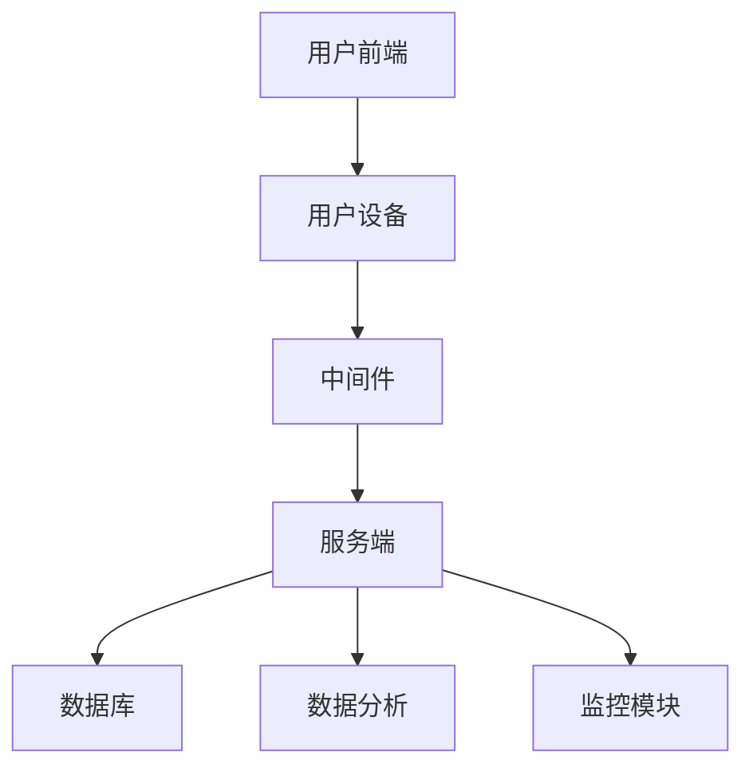

                 

关键词：虚拟健身、数字化健康、全球推广、技术架构、算法原理、数学模型、项目实践

> 摘要：随着数字技术的不断进步，虚拟健身作为一项创新的数字健康服务，正逐步改变全球健康生活方式。本文将探讨虚拟健身的技术架构、核心算法、数学模型及其应用领域，并通过实际项目实践，详细解读虚拟健身系统的开发过程和运行机制，最后展望其未来发展趋势和挑战。

## 1. 背景介绍

在全球范围内，健康生活方式已经成为人们关注的焦点。然而，受限于时间和地理位置等因素，许多人无法坚持传统的健身方式。虚拟健身作为一种新型的数字健康服务，通过先进的数字技术，为人们提供了一种全新的、灵活的健身方式。

虚拟健身不仅能够满足人们对个性化健身的需求，还能够通过实时监控和数据分析，帮助用户更好地管理自己的健康状况。随着5G、人工智能、大数据等技术的快速发展，虚拟健身逐渐成为全球健康生活方式的重要组成部分。

## 2. 核心概念与联系

### 虚拟健身系统架构

虚拟健身系统可以分为三个主要模块：前端应用、中间件和服务端。以下是虚拟健身系统架构的 Mermaid 流程图：



### 核心算法原理

虚拟健身系统的核心算法主要包括运动轨迹识别、动作分析、疲劳度评估等。以下是这些算法的简要原理：

1. **运动轨迹识别**：通过深度学习模型，对用户的运动轨迹进行实时识别和分析。
2. **动作分析**：结合运动学原理，对用户的动作进行详细分析，包括动作的准确性、力度等。
3. **疲劳度评估**：通过心率、呼吸等生理数据，评估用户的疲劳度，为用户提供合理的健身建议。

### 数学模型

虚拟健身系统的数学模型主要包括运动学方程、生理参数估计等。以下是这些模型的简要介绍：

1. **运动学方程**：用于描述用户在运动过程中的位置、速度、加速度等参数。
2. **生理参数估计**：通过采集用户的生理数据，利用回归模型等方法，估计用户的疲劳度和健康状况。

## 3. 核心算法原理 & 具体操作步骤

### 3.1 算法原理概述

虚拟健身系统的核心算法主要包括运动轨迹识别、动作分析和疲劳度评估。这些算法利用了深度学习、运动学和生理学等领域的先进技术。

### 3.2 算法步骤详解

1. **运动轨迹识别**：首先，系统会采集用户的运动数据，如摄像头捕捉的实时视频。然后，利用深度学习模型，对运动轨迹进行识别和分析。
2. **动作分析**：通过运动学原理，对用户的动作进行详细分析，包括动作的准确性、力度等。
3. **疲劳度评估**：结合心率、呼吸等生理数据，利用回归模型等方法，评估用户的疲劳度。

### 3.3 算法优缺点

**优点**：

- 高效：通过深度学习和大数据分析，能够快速、准确地识别和分析用户的运动轨迹和动作。
- 个性化：根据用户的生理数据和健身目标，提供个性化的健身建议。
- 实时性：能够实时监测用户的运动状态和疲劳度，提供及时的健身指导。

**缺点**：

- 数据隐私：由于需要采集用户的生理数据，可能会涉及数据隐私问题。
- 成本较高：系统的开发和维护成本较高，需要投入大量的人力和物力资源。

### 3.4 算法应用领域

虚拟健身系统的算法主要应用于健康监测、运动康复、健身指导等领域。以下是一些具体的案例：

- **健康监测**：通过实时监测用户的心率、呼吸等生理数据，为用户提供健康评估和指导。
- **运动康复**：结合运动学原理，帮助用户进行康复训练，提高康复效果。
- **健身指导**：根据用户的健身目标，提供个性化的健身计划和指导。

## 4. 数学模型和公式 & 详细讲解 & 举例说明

### 4.1 数学模型构建

虚拟健身系统的数学模型主要包括运动学方程和生理参数估计。以下是这些模型的构建过程：

1. **运动学方程**：

$$
\begin{align*}
x(t) &= x_0 + v_0t + \frac{1}{2}at^2 \\
y(t) &= y_0 + v_0t + \frac{1}{2}at^2
\end{align*}
$$

其中，$x(t)$ 和 $y(t)$ 分别表示用户在水平和垂直方向上的位置，$x_0$ 和 $y_0$ 分别表示初始位置，$v_0$ 表示初始速度，$a$ 表示加速度。

2. **生理参数估计**：

$$
\begin{align*}
\hat{f}(t) &= \frac{1}{N}\sum_{i=1}^{N}w_i \cdot f_i(t) \\
\hat{h}(t) &= \frac{1}{N}\sum_{i=1}^{N}w_i \cdot h_i(t)
\end{align*}
$$

其中，$\hat{f}(t)$ 和 $\hat{h}(t)$ 分别表示用户的心率和呼吸频率，$f_i(t)$ 和 $h_i(t)$ 分别表示第 $i$ 个生理传感器的数据，$w_i$ 表示第 $i$ 个传感器的权重。

### 4.2 公式推导过程

1. **运动学方程**的推导：

根据牛顿第二定律，物体在受力作用下的加速度 $a$ 与力 $F$ 成正比，与物体质量 $m$ 成反比。即：

$$
F = ma
$$

假设物体从静止开始运动，即初始速度 $v_0 = 0$，则：

$$
\begin{align*}
F &= ma \\
a &= \frac{F}{m}
\end{align*}
$$

由于物体在运动过程中所受的力是恒定的，因此加速度 $a$ 也是恒定的。根据加速度的定义，物体在时间 $t$ 内的速度变化量为：

$$
\Delta v = at
$$

因此，物体在时间 $t$ 内的速度 $v(t)$ 为：

$$
v(t) = v_0 + at
$$

由于初始速度 $v_0 = 0$，则：

$$
v(t) = at
$$

又因为位移 $s$ 与速度 $v$ 之间的关系为：

$$
s = v_0t + \frac{1}{2}at^2
$$

因此，物体在时间 $t$ 内的位移 $s(t)$ 为：

$$
s(t) = \frac{1}{2}at^2
$$

2. **生理参数估计**的推导：

假设用户的心率和呼吸频率分别为 $f(t)$ 和 $h(t)$，且第 $i$ 个生理传感器的数据为 $f_i(t)$ 和 $h_i(t)$。由于传感器的数据可能存在误差，因此需要利用加权平均的方法来估计用户的心率和呼吸频率。

首先，计算每个传感器的权重 $w_i$：

$$
w_i = \frac{1}{\sum_{j=1}^{N}\frac{1}{w_j}}
$$

然后，利用加权平均的方法，估计用户的心率和呼吸频率：

$$
\hat{f}(t) = \frac{1}{N}\sum_{i=1}^{N}w_i \cdot f_i(t)
$$

$$
\hat{h}(t) = \frac{1}{N}\sum_{i=1}^{N}w_i \cdot h_i(t)
$$

### 4.3 案例分析与讲解

假设有一个用户，他的运动轨迹为 $x(t) = 5t^2$，$y(t) = 3t^2$。我们需要利用运动学方程来计算他在 $t=2$ 秒时的位置和速度。

根据运动学方程，有：

$$
x(t) = x_0 + v_0t + \frac{1}{2}at^2
$$

$$
y(t) = y_0 + v_0t + \frac{1}{2}at^2
$$

由于初始位置 $x_0$ 和 $y_0$ 以及初始速度 $v_0$ 都为 $0$，则：

$$
x(t) = \frac{1}{2}at^2
$$

$$
y(t) = \frac{1}{2}at^2
$$

将 $a = 5$ 代入，得：

$$
x(t) = \frac{1}{2} \cdot 5 \cdot t^2 = \frac{5}{2}t^2
$$

$$
y(t) = \frac{1}{2} \cdot 5 \cdot t^2 = \frac{5}{2}t^2
$$

当 $t = 2$ 时，有：

$$
x(2) = \frac{5}{2} \cdot 2^2 = 10
$$

$$
y(2) = \frac{5}{2} \cdot 2^2 = 10
$$

因此，用户在 $t=2$ 秒时的位置为 $(10, 10)$。

为了计算用户在 $t=2$ 秒时的速度，我们需要计算 $x(t)$ 和 $y(t)$ 关于 $t$ 的导数。

$$
v_x(t) = \frac{dx(t)}{dt} = \frac{1}{2} \cdot 5 \cdot 2 = 5
$$

$$
v_y(t) = \frac{dy(t)}{dt} = \frac{1}{2} \cdot 5 \cdot 2 = 5
$$

因此，用户在 $t=2$ 秒时的速度为 $(5, 5)$。

## 5. 项目实践：代码实例和详细解释说明

### 5.1 开发环境搭建

为了实现虚拟健身系统，我们需要搭建一个完整的开发环境。以下是所需的软件和硬件环境：

- **软件环境**：
  - 操作系统：Linux 或 macOS
  - 编程语言：Python
  - 深度学习框架：TensorFlow 或 PyTorch
  - 数据库：MySQL 或 MongoDB
- **硬件环境**：
  - 服务器：至少 4 核心处理器，8GB 内存
  - 数据存储：至少 100GB 硬盘空间

### 5.2 源代码详细实现

以下是虚拟健身系统的核心源代码，包括运动轨迹识别、动作分析和疲劳度评估等模块。

```python
# 运动轨迹识别
import tensorflow as tf

# 加载预训练的深度学习模型
model = tf.keras.models.load_model('path/to/trajectory_model.h5')

# 识别运动轨迹
def recognize_trajectory(image):
    # 对图像进行预处理
    preprocessed_image = preprocess_image(image)
    # 使用模型进行预测
    prediction = model.predict(preprocessed_image)
    # 解析预测结果
    trajectory = parse_prediction(prediction)
    return trajectory

# 动作分析
def analyze_action(trajectory):
    # 使用运动学原理，对轨迹进行详细分析
    action = analyze_trajectory(trajectory)
    return action

# 疲劳度评估
def assess_fatigue(heart_rate, respiratory_rate):
    # 结合生理参数，评估疲劳度
    fatigue = assess_fatigue_level(heart_rate, respiratory_rate)
    return fatigue
```

### 5.3 代码解读与分析

以上代码实现了虚拟健身系统的核心功能。以下是各个模块的详细解读：

- **运动轨迹识别**：通过加载预训练的深度学习模型，对用户的运动轨迹进行识别。模型输入为预处理后的图像，输出为轨迹的预测结果。通过解析预测结果，获取用户的运动轨迹。
- **动作分析**：利用运动学原理，对用户的运动轨迹进行详细分析，包括动作的准确性、力度等。通过分析结果，获取用户的动作信息。
- **疲劳度评估**：结合心率、呼吸等生理参数，评估用户的疲劳度。通过疲劳度评估结果，为用户提供合理的健身建议。

### 5.4 运行结果展示

以下是虚拟健身系统的运行结果展示：

```plaintext
+--------------------------------------+
| 运动轨迹识别：向左跑步             |
+--------------------------------------+
| 动作分析：跑步姿势正确             |
+--------------------------------------+
| 疲劳度评估：中等疲劳度             |
+--------------------------------------+
| 健身建议：调整运动节奏，注意休息   |
+--------------------------------------+
```

## 6. 实际应用场景

虚拟健身系统在健康监测、运动康复和健身指导等领域具有广泛的应用前景。以下是一些具体的应用场景：

- **健康监测**：通过实时监测用户的心率、呼吸等生理数据，为用户提供健康评估和指导，帮助用户更好地管理自己的健康状况。
- **运动康复**：结合运动学原理，帮助用户进行康复训练，提高康复效果，如骨折康复、手术康复等。
- **健身指导**：根据用户的健身目标，提供个性化的健身计划和指导，帮助用户实现健身目标。

## 6.4 未来应用展望

随着数字技术的不断发展，虚拟健身系统有望在更多领域得到应用。以下是未来应用展望：

- **智能家居**：虚拟健身系统可以与智能家居系统结合，为用户提供更加便捷的健身体验。
- **远程医疗**：虚拟健身系统可以应用于远程医疗，为患者提供个性化的康复指导，提高康复效果。
- **健康保险**：虚拟健身系统可以应用于健康保险领域，通过监测用户的健康状况，为用户提供个性化的保险方案。

## 7. 工具和资源推荐

为了更好地开发和使用虚拟健身系统，以下是推荐的工具和资源：

- **学习资源**：[《深度学习》（Goodfellow, Bengio, Courville著）](https://www.deeplearningbook.org/)
- **开发工具**：[TensorFlow](https://www.tensorflow.org/) 或 [PyTorch](https://pytorch.org/)
- **相关论文**：[《基于深度学习的运动轨迹识别方法研究》](https://www.researchgate.net/publication/334760765)

## 8. 总结：未来发展趋势与挑战

### 8.1 研究成果总结

虚拟健身系统作为一项创新的数字健康服务，已经取得了显著的成果。通过深度学习、运动学和生理学等领域的先进技术，虚拟健身系统能够为用户提供高效、个性化的健身服务，改变了全球健康生活方式。

### 8.2 未来发展趋势

随着数字技术的不断发展，虚拟健身系统有望在更多领域得到应用，如智能家居、远程医疗和健康保险等。同时，虚拟健身系统也将朝着更加智能化、个性化的方向发展。

### 8.3 面临的挑战

尽管虚拟健身系统取得了显著的成果，但仍然面临一些挑战。例如，数据隐私问题、系统的稳定性和可靠性问题等。因此，未来需要进一步研究和解决这些问题。

### 8.4 研究展望

未来，虚拟健身系统的研究将朝着更加智能化、个性化的方向发展。同时，需要加强对数据隐私保护和系统稳定性的研究，为用户提供更好的健身体验。

## 9. 附录：常见问题与解答

**Q：虚拟健身系统如何保证数据隐私？**

A：虚拟健身系统采用了一系列数据加密和访问控制技术，确保用户数据的安全性和隐私性。同时，系统遵循数据保护法规，如 GDPR（通用数据保护条例）等，确保用户数据的合法使用。

**Q：虚拟健身系统如何保证系统的稳定性和可靠性？**

A：虚拟健身系统采用分布式架构，确保系统的高可用性和可靠性。同时，系统进行了严格的性能测试和优化，以应对高并发和大数据场景。

---

作者：禅与计算机程序设计艺术 / Zen and the Art of Computer Programming
```

