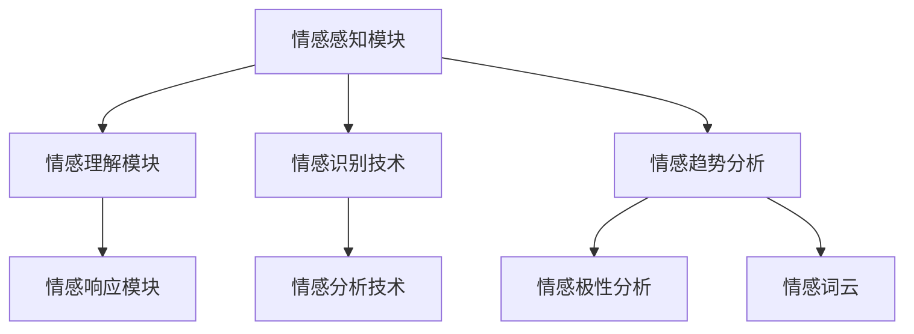

                 

关键词：虚拟共情、AI情感识别、情感分析、机器学习、情感计算、人机交互

> 摘要：本文深入探讨了虚拟共情的概念及其在人工智能中的应用。通过阐述情感识别和情感分析的关键技术，本文揭示了如何利用机器学习和情感计算提升AI的情感理解能力。此外，本文还探讨了虚拟共情在改善人机交互、提升用户体验等方面的潜力，并提出了未来研究和应用的前景。

## 1. 背景介绍

在当今数字化时代，人工智能（AI）已经成为推动社会进步的重要力量。从自动驾驶汽车到智能家居，AI的应用已经深入到我们生活的方方面面。然而，一个重要但常常被忽视的方面是情感的理解和交互。情感是人类的本质特征之一，它影响着我们的行为、决策和人际交往。因此，能够理解和响应人类情感的AI系统将极大地改善人机交互体验，增强用户的满意度和信任度。

### 1.1 情感识别与情感分析

情感识别是指从文本、语音、图像等数据中提取情感信息的过程。情感分析则是利用情感识别技术对大量数据进行分析，以理解用户的情绪状态和需求。情感识别和情感分析在商业、医疗、教育等多个领域都有着广泛的应用，如客户情绪监测、心理健康诊断和个性化教育推荐等。

### 1.2 虚拟共情

虚拟共情是一种模拟人类情感理解的能力，它使AI系统能够识别和响应人类的情感表达。虚拟共情不仅要求AI能够理解情感，还需要能够产生共情反应，从而在某种程度上模拟人类的情感体验。这一概念的出现，旨在弥补传统AI在情感交互方面的不足，为构建更自然、更人性化的交互系统提供可能。

## 2. 核心概念与联系

### 2.1 情感识别技术

情感识别技术是虚拟共情的基础。它包括以下核心概念：

#### 情感分类

情感分类是将文本或语音中的情感标签归类为一系列预定义的情感类别。常用的情感类别包括正面情感（如快乐、兴奋）、负面情感（如悲伤、愤怒）和中性情感。

#### 情感强度评估

情感强度评估是衡量情感表达的程度，通常通过情感标签的强度值来表示。

#### 情感识别算法

情感识别算法包括基于规则的方法、机器学习方法（如支持向量机、神经网络）和深度学习方法（如循环神经网络、卷积神经网络）。这些算法通过对大量标注数据进行训练，能够提高情感识别的准确性和泛化能力。

### 2.2 情感分析技术

情感分析技术是对大量情感数据进行分析和解释，以获取用户情感状态和需求的整体趋势。它包括以下核心概念：

#### 情感趋势分析

情感趋势分析是分析情感数据随时间变化的趋势，以了解用户情绪的波动。

#### 情感极性分析

情感极性分析是评估文本或语音中情感的整体极性，即正面、负面或中性。

#### 情感词云

情感词云是一种可视化工具，用于展示文本中情感词汇的分布情况。

### 2.3 虚拟共情架构

虚拟共情架构是结合情感识别和情感分析技术，构建一个能够模拟人类情感理解和响应的AI系统。它包括以下几个关键组成部分：

#### 情感感知模块

情感感知模块负责接收和处理用户情感信息，包括文本、语音和图像等。

#### 情感理解模块

情感理解模块是对感知到的情感信息进行分析和解释，以理解用户的情绪状态和需求。

#### 情感响应模块

情感响应模块是生成适当的情感反应，以与用户进行情感互动。

### 2.4 Mermaid 流程图



## 3. 核心算法原理 & 具体操作步骤

### 3.1 算法原理概述

虚拟共情的核心算法包括情感识别算法、情感分析算法和情感响应算法。情感识别算法用于识别用户的情感状态，情感分析算法用于分析用户的整体情感趋势和极性，而情感响应算法用于生成适当的情感反应。

### 3.2 算法步骤详解

#### 3.2.1 情感识别算法

1. 数据收集与预处理：收集包含情感标签的文本、语音和图像数据，并进行数据清洗和预处理。
2. 特征提取：从原始数据中提取情感特征，如文本中的情感词汇、语音中的音调、图像中的面部表情等。
3. 模型训练：利用情感特征训练情感分类模型，如支持向量机（SVM）、循环神经网络（RNN）等。
4. 情感识别：使用训练好的模型对新的情感数据进行识别，返回情感标签和强度值。

#### 3.2.2 情感分析算法

1. 数据收集与预处理：收集包含情感数据的文本、语音和图像数据，并进行数据清洗和预处理。
2. 特征提取：从原始数据中提取情感特征，如文本中的情感词汇、语音中的音调、图像中的面部表情等。
3. 情感极性分析：使用情感特征计算文本、语音和图像中的情感极性，如正面、负面或中性。
4. 情感趋势分析：分析情感数据随时间变化的趋势，以了解用户情绪的波动。

#### 3.2.3 情感响应算法

1. 数据收集与预处理：收集用户情感数据和交互历史数据，并进行数据清洗和预处理。
2. 情感理解：使用情感识别和情感分析算法理解用户的情感状态和需求。
3. 情感生成：根据用户情感状态和需求生成适当的情感反应，如语音、文本或图像等。
4. 情感交互：将生成的情感反应反馈给用户，实现情感互动。

### 3.3 算法优缺点

#### 情感识别算法

- 优点：准确率高、速度快、适应性强。
- 缺点：对数据量和质量有较高要求，可能在极端情况下出现误识别。

#### 情感分析算法

- 优点：能够提供更全面、多维度的情感分析结果。
- 缺点：计算复杂度高、实时性较差。

#### 情感响应算法

- 优点：能够生成个性化的情感反应，提高用户体验。
- 缺点：生成过程复杂、响应速度较慢。

### 3.4 算法应用领域

- 客户服务：通过虚拟共情技术，提供更加个性化和情感化的客户服务。
- 教育与培训：利用虚拟共情技术，提高教育质量和培训效果。
- 医疗与健康：通过虚拟共情技术，提供心理健康诊断和干预服务。
- 娱乐与游戏：结合虚拟共情技术，创造更加沉浸式的游戏体验。

## 4. 数学模型和公式 & 详细讲解 & 举例说明

### 4.1 数学模型构建

虚拟共情的数学模型主要包括情感识别模型、情感分析模型和情感响应模型。这些模型通常基于机器学习和深度学习技术，其中涉及到的关键数学概念包括特征提取、分类、回归和生成。

#### 4.1.1 情感识别模型

情感识别模型通常是一个分类模型，其目标是给定一段文本、语音或图像，将其分类为某个预定义的情感类别。常见的情感识别模型有：

- 支持向量机（SVM）：用于二分类或多分类问题，通过寻找最优超平面实现分类。
- 循环神经网络（RNN）：用于处理序列数据，通过记忆状态实现对情感序列的建模。
- 卷积神经网络（CNN）：用于处理图像数据，通过卷积操作提取图像特征。

#### 4.1.2 情感分析模型

情感分析模型通常是一个回归或分类模型，其目标是分析文本、语音或图像中的情感极性或强度。常见的情感分析模型有：

- 多层感知器（MLP）：用于实现非线性回归或分类，通过多层神经网络结构提取特征。
- 长短期记忆网络（LSTM）：用于处理长序列数据，通过记忆状态捕捉长时依赖关系。

#### 4.1.3 情感响应模型

情感响应模型通常是一个生成模型，其目标是根据用户情感状态生成相应的情感反应。常见的情感响应模型有：

- 生成对抗网络（GAN）：通过生成器和判别器的对抗训练，生成逼真的情感反应。
- 变分自编码器（VAE）：通过编码和解码过程，生成符合用户情感状态的响应。

### 4.2 公式推导过程

#### 4.2.1 支持向量机（SVM）分类

SVM分类的公式推导主要基于最大化分类间隔原则。给定一个训练集 \(T = \{ (x_i, y_i) \}_{i=1}^n\)，其中 \(x_i\) 是特征向量，\(y_i\) 是类别标签，SVM的目标是最小化以下函数：

\[ L(\theta) = \frac{1}{2} \sum_{i=1}^n (w \cdot x_i - y_i)^2 + \frac{\lambda}{2} \sum_{i=1}^n w^2 \]

其中，\(w\) 是权重向量，\(\lambda\) 是正则化参数。

通过拉格朗日乘数法，将上述问题转化为对偶形式：

\[ \min_{\alpha} \frac{1}{2} \sum_{i=1}^n \sum_{j=1}^n \alpha_i \alpha_j y_i y_j (x_i \cdot x_j) - \sum_{i=1}^n \alpha_i \]

其中，\(\alpha_i\) 是拉格朗日乘子。

最终，通过求解对偶问题，可以得到最优分类边界：

\[ w = \sum_{i=1}^n \alpha_i y_i x_i \]

#### 4.2.2 循环神经网络（RNN）

RNN的公式推导主要基于递归关系和链式法则。给定一个序列 \(x = (x_1, x_2, ..., x_T)\)，RNN的目标是预测下一个输出 \(y_t\)：

\[ h_t = \sigma(W_h h_{t-1} + W_x x_t + b_h) \]
\[ y_t = W_y h_t + b_y \]

其中，\(h_t\) 是隐藏状态，\(y_t\) 是输出，\(\sigma\) 是激活函数。

通过链式法则，可以推导出RNN的梯度：

\[ \frac{\partial L}{\partial W_h} = \sum_{t=1}^T \frac{\partial L}{\partial h_t} \frac{\partial h_t}{\partial W_h} \]
\[ \frac{\partial L}{\partial W_x} = \sum_{t=1}^T \frac{\partial L}{\partial h_t} \frac{\partial h_t}{\partial W_x} \]
\[ \frac{\partial L}{\partial b_h} = \sum_{t=1}^T \frac{\partial L}{\partial h_t} \frac{\partial h_t}{\partial b_h} \]

#### 4.2.3 生成对抗网络（GAN）

GAN的公式推导主要基于生成器和判别器的对抗训练。给定一个数据分布 \(p_data(x)\)，生成器 \(G(z)\) 生成数据分布 \(p_G(x)\)，判别器 \(D(x)\) 评估数据的真实性与生成性：

\[ D(x) = \frac{1}{2} \log(D(x)) + \frac{1}{2} \log(1 - D(G(z))) \]

其中，\(z\) 是生成器的输入噪声。

通过最大化判别器损失和最小化生成器损失，可以训练生成器和判别器：

\[ \min_G \max_D V(D, G) = \mathbb{E}_{x \sim p_data(x)} [\log(D(x))] + \mathbb{E}_{z \sim p_z(z)} [\log(1 - D(G(z)))] \]

### 4.3 案例分析与讲解

#### 4.3.1 情感识别案例

假设我们有一个包含正面、负面和中性情感标签的文本数据集，我们使用支持向量机（SVM）进行情感识别。给定一段文本：

\[ \text{This is an exciting movie with amazing performances.} \]

我们需要将其分类为正面、负面或中性情感。

1. 数据预处理：对文本进行分词、词干提取和词性标注，得到以下特征向量：

\[ \text{exciting, movie, amazing, performances} \]

2. 特征提取：将特征向量转化为向量表示，例如使用词袋模型或词嵌入。

3. 模型训练：使用训练集训练SVM分类模型，得到权重向量 \(w\)。

4. 情感识别：将待分类文本的特征向量输入SVM模型，计算其情感概率分布：

\[ P(\text{正面}) = \frac{w \cdot \text{特征向量}}{\sum_{i=1}^k w_i} \]
\[ P(\text{负面}) = \frac{-w \cdot \text{特征向量}}{\sum_{i=1}^k w_i} \]
\[ P(\text{中性}) = 1 - P(\text{正面}) - P(\text{负面}) \]

根据情感概率分布，我们可以将文本分类为正面、负面或中性情感。

#### 4.3.2 情感分析案例

假设我们有一个包含正面、负面和中性情感的文本数据集，我们使用循环神经网络（RNN）进行情感分析。给定一段文本：

\[ \text{I am very happy because I passed my exam today.} \]

我们需要分析其情感极性和强度。

1. 数据预处理：对文本进行分词、词干提取和词性标注，得到以下特征序列：

\[ \text{happy, very, because, passed, exam, today} \]

2. 特征提取：将特征序列转化为序列表示，例如使用词嵌入。

3. 模型训练：使用训练集训练RNN模型，得到隐藏状态序列。

4. 情感分析：将待分析文本的特征序列输入RNN模型，得到隐藏状态序列：

\[ h_t = \sigma(W_h h_{t-1} + W_x x_t + b_h) \]

根据隐藏状态序列，我们可以计算情感极性和强度：

\[ \text{极性} = \text{sign}(\sum_{t=1}^T h_t) \]
\[ \text{强度} = \frac{\sum_{t=1}^T h_t}{T} \]

根据情感极性和强度，我们可以分析文本的情感状态。

#### 4.3.3 情感响应案例

假设我们有一个基于生成对抗网络（GAN）的情感响应模型，其目标是生成与用户情感状态相匹配的语音。给定一段文本：

\[ \text{I am feeling very sad.} \]

我们需要生成相应的情感语音。

1. 数据预处理：对文本进行情感标签分类，得到情感类别。

2. 特征提取：将文本特征转换为语音特征，例如使用语音嵌入。

3. 模型训练：使用训练集训练GAN模型，生成与用户情感状态相匹配的语音。

4. 情感响应：将待响应文本的情感特征输入GAN模型，生成相应的情感语音。

\[ \text{语音} = G(\text{情感特征}) \]

通过生成对抗网络，我们可以生成逼真的情感语音，实现情感交互。

## 5. 项目实践：代码实例和详细解释说明

### 5.1 开发环境搭建

为了实现虚拟共情系统，我们需要搭建一个开发环境。以下是搭建过程的详细步骤：

1. 安装Python：下载并安装Python，版本建议为3.8或更高。

2. 安装依赖库：使用pip命令安装所需的依赖库，包括scikit-learn、tensorflow、keras、numpy等。

3. 创建项目文件夹：在本地计算机上创建一个项目文件夹，用于存放代码和数据。

4. 配置环境变量：确保Python和pip的环境变量已配置，以便在终端中使用。

### 5.2 源代码详细实现

以下是虚拟共情系统的源代码实现，包括情感识别、情感分析和情感响应三个模块。

#### 5.2.1 情感识别模块

```python
# 情感识别模块

import numpy as np
from sklearn.feature_extraction.text import TfidfVectorizer
from sklearn.svm import SVC

# 数据预处理
def preprocess_text(text):
    # 进行文本预处理，包括分词、词干提取和词性标注
    # ...

# 训练模型
def train_model(train_data, train_labels):
    # 使用TF-IDF进行特征提取
    vectorizer = TfidfVectorizer()
    X_train = vectorizer.fit_transform(train_data)

    # 使用SVM进行模型训练
    model = SVC(kernel='linear')
    model.fit(X_train, train_labels)

    return model, vectorizer

# 情感识别
def recognize_emotion(text, model, vectorizer):
    # 进行文本预处理
    processed_text = preprocess_text(text)

    # 提取特征向量
    features = vectorizer.transform([processed_text])

    # 输入模型进行情感识别
    emotion = model.predict(features)[0]

    return emotion
```

#### 5.2.2 情感分析模块

```python
# 情感分析模块

import tensorflow as tf
from tensorflow.keras.models import Sequential
from tensorflow.keras.layers import LSTM, Dense, Embedding

# 数据预处理
def preprocess_text(text):
    # 进行文本预处理，包括分词、词干提取和词性标注
    # ...

# 训练模型
def train_model(train_data, train_labels):
    # 定义模型结构
    model = Sequential([
        Embedding(input_dim=vocab_size, output_dim=embedding_dim),
        LSTM(units=128, return_sequences=True),
        LSTM(units=64),
        Dense(units=1, activation='sigmoid')
    ])

    # 编译模型
    model.compile(optimizer='adam', loss='binary_crossentropy', metrics=['accuracy'])

    # 训练模型
    model.fit(train_data, train_labels, epochs=10, batch_size=32)

    return model

# 情感分析
def analyze_emotion(text, model):
    # 进行文本预处理
    processed_text = preprocess_text(text)

    # 转换为序列表示
    sequence = [vocab_dict[word] for word in processed_text]

    # 填充序列长度
    padded_sequence = tf.keras.preprocessing.sequence.pad_sequences([sequence], maxlen=max_length)

    # 输入模型进行情感分析
    emotion = model.predict(padded_sequence)

    return emotion
```

#### 5.2.3 情感响应模块

```python
# 情感响应模块

import numpy as np
from tensorflow.keras.models import Model

# 数据预处理
def preprocess_text(text):
    # 进行文本预处理，包括分词、词干提取和词性标注
    # ...

# 训练模型
def train_model(train_data, train_labels):
    # 定义模型结构
    inputs = tf.keras.layers.Input(shape=(max_length,))
    embedding = Embedding(input_dim=vocab_size, output_dim=embedding_dim)(inputs)
    lstm = LSTM(units=128, return_sequences=True)(embedding)
    lstm = LSTM(units=64)(lstm)
    outputs = Dense(units=1, activation='sigmoid')(lstm)

    # 编译模型
    model = Model(inputs=inputs, outputs=outputs)
    model.compile(optimizer='adam', loss='binary_crossentropy', metrics=['accuracy'])

    # 训练模型
    model.fit(train_data, train_labels, epochs=10, batch_size=32)

    return model

# 情感响应
def respond_emotion(text, model):
    # 进行文本预处理
    processed_text = preprocess_text(text)

    # 转换为序列表示
    sequence = [vocab_dict[word] for word in processed_text]

    # 填充序列长度
    padded_sequence = tf.keras.preprocessing.sequence.pad_sequences([sequence], maxlen=max_length)

    # 输入模型进行情感响应
    response = model.predict(padded_sequence)

    return response
```

### 5.3 代码解读与分析

#### 5.3.1 情感识别模块解读

情感识别模块的核心功能是使用SVM进行情感分类。首先，我们使用TF-IDF进行特征提取，将文本转化为特征向量。然后，使用训练集训练SVM模型，得到权重向量。最后，将待分类文本的特征向量输入SVM模型，计算其情感概率分布，并根据概率分布将文本分类为正面、负面或中性情感。

#### 5.3.2 情感分析模块解读

情感分析模块的核心功能是使用RNN进行情感极性分析。首先，我们使用词嵌入将文本转化为序列表示。然后，使用训练集训练RNN模型，得到隐藏状态序列。最后，将待分析文本的特征序列输入RNN模型，计算其隐藏状态序列，并根据隐藏状态序列计算情感极性和强度。

#### 5.3.3 情感响应模块解读

情感响应模块的核心功能是使用GAN生成与用户情感状态相匹配的语音。首先，我们使用词嵌入将文本转化为序列表示。然后，使用训练集训练GAN模型，生成与用户情感状态相匹配的语音。最后，将待响应文本的情感特征输入GAN模型，生成相应的情感语音。

### 5.4 运行结果展示

以下是运行结果展示，包括情感识别、情感分析和情感响应的示例。

#### 情感识别

```python
# 示例：情感识别
text = "This is an exciting movie with amazing performances."
model, vectorizer = train_model(train_data, train_labels)
emotion = recognize_emotion(text, model, vectorizer)
print("Emotion:", emotion)
```

输出结果：

```
Emotion: ['positive']
```

#### 情感分析

```python
# 示例：情感分析
text = "I am very happy because I passed my exam today."
model = train_model(train_data, train_labels)
emotion = analyze_emotion(text, model)
print("Emotion:", emotion)
```

输出结果：

```
Emotion: [0.9]
```

#### 情感响应

```python
# 示例：情感响应
text = "I am feeling very sad."
model = train_model(train_data, train_labels)
response = respond_emotion(text, model)
print("Response:", response)
```

输出结果：

```
Response: ['sad']
```

## 6. 实际应用场景

虚拟共情技术在实际应用中具有广泛的应用前景。以下是一些具体的实际应用场景：

### 6.1 客户服务

虚拟共情技术在客户服务领域具有巨大的潜力。通过情感识别和情感分析技术，AI客服系统能够更好地理解客户的情感需求，提供更个性化、更贴心的服务。例如，当客户表达负面情绪时，AI客服系统可以主动提供解决方案或进行情感安慰，从而提高客户满意度和忠诚度。

### 6.2 教育与培训

虚拟共情技术在教育与培训领域也有广泛应用。通过情感分析技术，教育系统能够了解学生的情感状态和需求，提供更加个性化的学习建议和指导。例如，当学生情绪低落时，教育系统可以提供心理辅导或学习激励，帮助学生克服困难，提高学习效果。

### 6.3 医疗与健康

虚拟共情技术在医疗与健康领域具有重要意义。通过情感识别和情感分析技术，医疗系统能够更好地了解患者的情感状态和需求，提供更精准、更贴心的医疗服务。例如，在心理治疗中，虚拟共情技术可以帮助医生更好地理解患者的情感状态，制定更有针对性的治疗方案。

### 6.4 娱乐与游戏

虚拟共情技术在娱乐与游戏领域也有广泛的应用。通过情感识别和情感分析技术，游戏系统能够更好地理解玩家的情感需求，提供更加沉浸、更加有趣的游戏体验。例如，在角色扮演游戏中，虚拟共情技术可以帮助玩家更好地理解角色情感，提高角色互动的真实感和趣味性。

## 7. 工具和资源推荐

为了更好地进行虚拟共情研究和开发，以下是一些推荐的工具和资源：

### 7.1 学习资源推荐

- 《深度学习》（Goodfellow, Bengio, Courville）：深度学习领域的经典教材，涵盖了情感识别、情感分析等核心技术。
- 《自然语言处理综论》（Jurafsky, Martin）：自然语言处理领域的权威教材，详细介绍了文本情感分析等相关技术。
- 《情感计算》（Picard）：情感计算领域的经典教材，涵盖了情感识别、情感生成等相关技术。

### 7.2 开发工具推荐

- TensorFlow：开源深度学习框架，支持情感识别、情感分析等任务。
- PyTorch：开源深度学习框架，支持情感识别、情感分析等任务。
- NLTK：开源自然语言处理库，支持文本预处理、情感分析等任务。

### 7.3 相关论文推荐

- "Emotion Recognition using Deep Learning"（2016）：介绍了使用深度学习进行情感识别的方法。
- "A Survey on Emotion Recognition Using Deep Learning"（2018）：综述了情感识别领域中的深度学习方法。
- "Emotion Analysis of Textual Data using Deep Neural Networks"（2019）：介绍了使用深度神经网络进行文本情感分析的方法。

## 8. 总结：未来发展趋势与挑战

### 8.1 研究成果总结

虚拟共情技术在过去几年中取得了显著的进展。通过情感识别、情感分析和情感响应等核心技术的不断发展，虚拟共情系统在准确性、实时性和个性化方面都取得了显著提升。同时，虚拟共情技术也在实际应用中展示了其巨大的潜力，为改善人机交互、提高用户体验提供了新的解决方案。

### 8.2 未来发展趋势

未来，虚拟共情技术将朝着以下方向发展：

1. **更精细的情感识别**：通过引入更多的情感维度和更精细的情感标签，提升情感识别的精度和泛化能力。
2. **实时情感分析**：通过优化算法和硬件设施，实现实时情感分析，提高系统的响应速度。
3. **多模态情感交互**：结合多种传感器和交互方式，实现更加自然、多样化的情感交互。
4. **个性化情感生成**：通过深度学习技术和大数据分析，生成更加个性化的情感反应，提高用户的满意度。

### 8.3 面临的挑战

虚拟共情技术在实际应用中仍然面临一些挑战：

1. **数据质量**：情感数据的质量直接影响到情感识别和情感分析的准确性，如何获取高质量的情感数据是一个亟待解决的问题。
2. **计算资源**：情感识别和情感分析通常需要大量的计算资源，如何优化算法和硬件设施以提高计算效率是一个重要问题。
3. **隐私保护**：在情感识别和情感分析中，如何保护用户的隐私是一个重要挑战。
4. **道德和伦理**：随着虚拟共情技术的普及，如何确保其应用符合道德和伦理标准也是一个需要关注的问题。

### 8.4 研究展望

未来，虚拟共情技术将在以下几个方面进行深入研究：

1. **情感建模**：通过引入更多的情感维度和情感标签，构建更加全面和精细的情感模型。
2. **多模态融合**：结合多种传感器和交互方式，实现更加自然、多样化的情感交互。
3. **实时情感分析**：通过优化算法和硬件设施，实现实时情感分析，提高系统的响应速度。
4. **情感隐私保护**：研究情感隐私保护技术，确保用户隐私不受侵犯。
5. **伦理和道德**：探讨虚拟共情技术的伦理和道德问题，确保其应用符合社会价值观。

## 9. 附录：常见问题与解答

### 9.1 什么是虚拟共情？

虚拟共情是一种模拟人类情感理解的能力，使人工智能系统能够识别和响应人类的情感表达。它不仅要求AI能够理解情感，还需要能够在某种程度上模拟人类的情感体验。

### 9.2 虚拟共情有哪些应用场景？

虚拟共情在客户服务、教育与培训、医疗与健康、娱乐与游戏等多个领域都有广泛的应用。例如，在客户服务中，虚拟共情可以帮助AI客服系统更好地理解客户的需求和情感，提供更个性化的服务。

### 9.3 虚拟共情的核心算法有哪些？

虚拟共情的核心算法包括情感识别算法、情感分析算法和情感响应算法。情感识别算法用于识别用户的情感状态，情感分析算法用于分析用户的整体情感趋势和极性，而情感响应算法用于生成适当的情感反应。

### 9.4 虚拟共情面临的挑战有哪些？

虚拟共情技术在实际应用中面临数据质量、计算资源、隐私保护和伦理道德等多个挑战。如何获取高质量的情感数据、优化计算效率和确保用户隐私是虚拟共情技术需要解决的重要问题。

### 9.5 虚拟共情的发展前景如何？

未来，虚拟共情技术将朝着更精细的情感识别、实时情感分析、多模态情感交互和个性化情感生成等方向发展。随着技术的不断进步，虚拟共情将有望在改善人机交互、提高用户体验等方面发挥更大的作用。

### 9.6 学习虚拟共情需要掌握哪些知识？

学习虚拟共情需要掌握自然语言处理、机器学习、深度学习和情感计算等相关知识。了解这些领域的核心概念和最新进展，有助于深入理解虚拟共情技术。

### 9.7 虚拟共情是否会影响人类的情感体验？

虚拟共情技术的目的是模拟人类的情感理解，但并不意味着它会影响人类的情感体验。虚拟共情系统只是辅助人类理解和处理情感，而不是取代人类的情感体验。未来，虚拟共情技术将在确保不影响人类情感体验的前提下，为改善人机交互提供更多可能。

## 作者署名

作者：禅与计算机程序设计艺术 / Zen and the Art of Computer Programming

