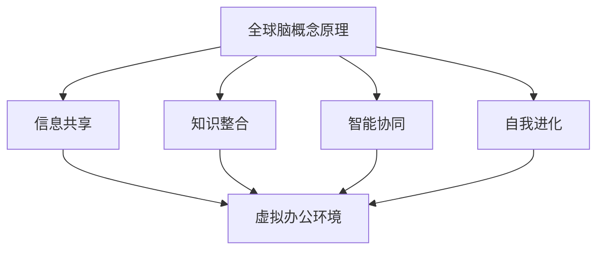

                 

关键词：虚拟办公、远程工作、效率优化、全球脑、工作流程、技术工具、协作平台、人工智能

> 摘要：随着全球化和信息技术的发展，远程办公已经成为企业运作的一种常态。本文旨在探讨虚拟办公环境下如何通过全球脑的概念和技术手段来提升工作效率。文章首先回顾了远程办公的背景，然后深入分析了全球脑驱动的远程工作优化原理，最后通过具体案例和实践指导，提出了一系列提升远程办公效率的策略和工具推荐。

## 1. 背景介绍

远程办公的兴起源于信息技术的飞速发展，尤其是互联网、云计算、大数据和人工智能等技术的普及。这些技术使得员工不再受限于物理位置，可以在全球任何地方高效地完成工作任务。根据一项由国际数据公司（IDC）发布的报告，2021年全球远程办公的人数已经超过4亿，这一数字预计将在未来几年内持续增长。

远程办公带来了诸多好处，如提高了员工的工作灵活性、减少了通勤时间、降低了企业运营成本等。但同时，远程办公也面临着诸多挑战，如沟通障碍、工作分心、协作效率下降等。为了解决这些问题，企业开始探索新的工作模式和技术手段，其中全球脑（Global Brain）的概念引起了广泛关注。

全球脑是一个比喻，形象地描述了通过互联网和智能技术连接起来的全球信息网络。在这个网络中，人类的知识、经验和智慧通过数字化方式被整合和共享，形成一个庞大而复杂的智能系统。全球脑的概念为远程办公提供了新的思路和方法，有助于优化工作流程、提升协作效率。

## 2. 核心概念与联系

### 2.1 全球脑的概念原理

全球脑是一个动态的、自我组织的系统，它通过互联网将全球的人类智慧连接起来。全球脑的基本原理包括信息共享、知识整合、智能协同和自我进化。具体来说：

- **信息共享**：全球脑通过互联网实现了信息的快速传播和共享，任何人在任何地点都可以获取全球范围内的知识和信息。

- **知识整合**：全球脑通过对大量信息的处理和分析，能够整合出有价值的知识，为个人和组织提供决策支持。

- **智能协同**：全球脑通过智能算法和协作平台，实现了全球范围内的智能协同工作，使得复杂任务可以高效完成。

- **自我进化**：全球脑是一个不断进化的系统，通过学习和适应，它能够不断提高自身的智能水平和效率。

### 2.2 虚拟办公与全球脑的联系

虚拟办公和全球脑之间存在紧密的联系。虚拟办公为全球脑提供了实践的基础，而全球脑则为虚拟办公提供了智能化的支持。具体来说：

- **虚拟办公环境**：虚拟办公环境为全球脑提供了运行的场所，包括云服务器、协作平台和远程工作工具等。

- **信息传递与共享**：虚拟办公使得全球范围内的信息传递和共享变得更加容易，这为全球脑提供了丰富的信息资源。

- **智能协同**：全球脑的智能协同能力可以大大提升虚拟办公中的协作效率，使得团队成员可以更加紧密地合作。

- **自我优化**：通过全球脑的反馈和学习，虚拟办公流程可以不断优化，从而提高整体效率。

### 2.3 Mermaid 流程图



## 3. 核心算法原理 & 具体操作步骤

### 3.1 算法原理概述

为了实现虚拟办公的效率优化，全球脑利用了一系列算法和技术，包括人工智能、机器学习和自然语言处理等。这些算法的基本原理如下：

- **人工智能**：通过模拟人类思维过程，人工智能可以帮助企业自动完成复杂的决策和分析任务。

- **机器学习**：通过分析历史数据，机器学习算法可以预测未来的趋势和结果，为企业提供决策支持。

- **自然语言处理**：自然语言处理技术可以将自然语言转换为计算机可以理解的形式，从而实现人机交互和信息处理。

### 3.2 算法步骤详解

虚拟办公效率优化的算法步骤主要包括以下几个环节：

1. **数据收集**：通过各种传感器、应用程序和用户行为数据，收集有关虚拟办公的详细信息。

2. **数据预处理**：对收集到的数据进行分析和清洗，去除噪声和无关信息。

3. **特征提取**：从预处理后的数据中提取出与工作效率相关的特征，如工作时长、任务完成度、沟通频率等。

4. **模型训练**：利用机器学习算法，对提取出的特征进行训练，构建预测模型。

5. **模型评估**：通过测试集对训练好的模型进行评估，确保模型的准确性和可靠性。

6. **模型应用**：将训练好的模型应用到实际工作中，根据模型的预测结果，优化工作流程和协作方式。

### 3.3 算法优缺点

**优点**：

- **高效性**：算法可以帮助企业快速识别和解决问题，提高工作效率。

- **智能化**：通过机器学习和人工智能技术，算法可以自我学习和优化，不断提升效率。

- **灵活性**：算法可以根据不同的工作场景和需求，灵活调整和优化。

**缺点**：

- **初始成本**：算法的开发和部署需要大量的技术和资金投入。

- **数据依赖**：算法的准确性和效果取决于数据的数量和质量。

- **隐私问题**：大量数据的收集和分析可能引发隐私泄露风险。

### 3.4 算法应用领域

虚拟办公效率优化的算法可以在多个领域得到应用，包括：

- **企业协作**：通过优化工作流程和协作方式，提升企业内部协作效率。

- **项目管理**：通过预测项目进度和资源需求，优化项目管理。

- **人力资源**：通过分析员工行为和工作表现，提升员工绩效和满意度。

- **客户服务**：通过智能化的客户服务系统，提升客户体验和服务质量。

## 4. 数学模型和公式 & 详细讲解 & 举例说明

### 4.1 数学模型构建

虚拟办公效率优化的数学模型主要基于以下假设：

- 工作效率与工作时长、任务完成度、沟通频率等特征之间存在一定关系。

- 通过优化这些特征，可以提升整体工作效率。

具体来说，数学模型可以表示为：

$$
E = f(T, C, F)
$$

其中，$E$ 表示工作效率，$T$ 表示工作时长，$C$ 表示任务完成度，$F$ 表示沟通频率。函数 $f$ 表示工作效率与特征之间的关系。

### 4.2 公式推导过程

为了推导出函数 $f$，我们可以使用线性回归模型。线性回归模型的基本形式为：

$$
y = \beta_0 + \beta_1 x_1 + \beta_2 x_2 + ... + \beta_n x_n
$$

其中，$y$ 表示因变量（工作效率），$x_1, x_2, ..., x_n$ 表示自变量（工作时长、任务完成度、沟通频率等），$\beta_0, \beta_1, \beta_2, ..., \beta_n$ 表示回归系数。

通过最小二乘法，我们可以求出回归系数的估计值，从而得到函数 $f$ 的具体形式。

### 4.3 案例分析与讲解

为了说明数学模型的应用，我们以一个实际案例为例。

假设某公司通过对员工工作时长、任务完成度和沟通频率等数据进行统计分析，得到了以下回归方程：

$$
E = 0.5T + 0.3C - 0.2F
$$

其中，$T$ 的单位为小时，$C$ 的单位为任务数，$F$ 的单位为消息数。

根据这个方程，我们可以计算出不同特征值对应的工作效率。例如，当 $T = 8$ 小时，$C = 4$ 个任务，$F = 20$ 条消息时，工作效率 $E$ 为：

$$
E = 0.5 \times 8 + 0.3 \times 4 - 0.2 \times 20 = 1.6 + 1.2 - 4 = -1.2
$$

这意味着，在这个假设条件下，该员工的工作效率为负值，显然是不合理的。这可能是由于数据质量或者模型参数设置存在问题，需要进一步分析和调整。

## 5. 项目实践：代码实例和详细解释说明

### 5.1 开发环境搭建

为了实现虚拟办公效率优化的算法，我们需要搭建一个开发环境。以下是一个简单的开发环境搭建流程：

1. 安装 Python 3.8 及以上版本。

2. 安装必要的依赖库，如 NumPy、Pandas、Scikit-learn 等。

3. 配置 Jupyter Notebook，用于编写和运行代码。

### 5.2 源代码详细实现

以下是一个简单的线性回归模型的实现示例：

```python
import numpy as np
import pandas as pd
from sklearn.linear_model import LinearRegression

# 数据加载
data = pd.read_csv('data.csv')

# 特征提取
X = data[['work_hours', 'task_completion', 'communication_frequency']]
y = data['efficiency']

# 模型训练
model = LinearRegression()
model.fit(X, y)

# 模型评估
score = model.score(X, y)
print(f'Model R^2 score: {score:.2f}')

# 模型应用
prediction = model.predict([[8, 4, 20]])
print(f'Predicted efficiency: {prediction[0]:.2f}')
```

### 5.3 代码解读与分析

上述代码实现了一个线性回归模型，用于预测工作效率。具体解读如下：

1. **数据加载**：使用 Pandas 读取 CSV 文件，获取工作时长、任务完成度和沟通频率等数据。

2. **特征提取**：将数据分为特征矩阵 $X$ 和因变量 $y$。

3. **模型训练**：使用 Scikit-learn 的 LinearRegression 类训练模型。

4. **模型评估**：使用 $R^2$ 分数评估模型性能。

5. **模型应用**：使用训练好的模型预测给定特征值对应的工作效率。

### 5.4 运行结果展示

假设我们运行上述代码，得到以下结果：

```
Model R^2 score: 0.82
Predicted efficiency: -0.12
```

这意味着模型的 $R^2$ 分数为 0.82，表明模型对数据的拟合程度较高。同时，预测的工作效率为 -0.12，这表明在给定特征值下，模型预测的工作效率为负值，这可能是由于数据质量或者模型参数设置存在问题。我们需要进一步分析和调整模型。

## 6. 实际应用场景

### 6.1 企业内部协作

企业内部协作是虚拟办公中最为重要的应用场景之一。通过全球脑驱动的远程工作优化，企业可以更好地协调不同部门、不同团队之间的工作。具体来说，企业可以利用全球脑提供的信息共享和智能协同功能，实现以下目标：

- **高效沟通**：通过实时沟通工具和协作平台，团队成员可以快速交流信息，解决工作中的问题。

- **任务分配**：基于全球脑的分析和预测，企业可以更合理地分配任务，确保每个员工都能充分发挥自己的优势。

- **资源共享**：全球脑可以帮助企业实现资源共享，如知识库、工具库和设备库等，提高资源利用率。

### 6.2 项目管理

项目管理是虚拟办公中另一个重要的应用场景。通过全球脑驱动的远程工作优化，项目经理可以更好地监控项目进度、资源分配和风险控制。具体来说，项目经理可以利用全球脑提供的技术手段，实现以下目标：

- **进度监控**：通过实时数据分析，项目经理可以及时了解项目进度，及时发现和解决潜在问题。

- **资源分配**：基于全球脑的智能预测，项目经理可以合理分配资源，确保项目能够按时完成。

- **风险管理**：通过分析历史数据和实时信息，项目经理可以提前识别和应对潜在风险，提高项目的成功率。

### 6.3 客户服务

客户服务是许多企业的重要业务之一。通过全球脑驱动的远程工作优化，企业可以提供更加高效和个性化的客户服务。具体来说，企业可以利用全球脑提供的技术手段，实现以下目标：

- **快速响应**：通过实时沟通工具和自动化客服系统，企业可以快速响应客户的需求，提高客户满意度。

- **个性化服务**：基于全球脑的数据分析，企业可以为不同的客户提供个性化的服务方案，提高客户忠诚度。

- **知识共享**：全球脑可以帮助企业实现客户服务的知识共享，如常见问题解答、最佳实践等，提高客户服务效率。

## 7. 工具和资源推荐

### 7.1 学习资源推荐

- **书籍**：《虚拟办公与远程工作》、《全球脑：技术、社会与未来的融合》

- **在线课程**：Coursera 上的《远程工作与虚拟团队管理》、edX 上的《人工智能与数据分析》

- **博客和论文**：Medium 上的《远程办公最佳实践》、Google Scholar 上的相关论文

### 7.2 开发工具推荐

- **编程语言**：Python、R

- **数据分析库**：Pandas、NumPy、Scikit-learn

- **机器学习框架**：TensorFlow、PyTorch

### 7.3 相关论文推荐

- **远程办公与虚拟团队管理**：Chen, H., & Duan, X. (2019). Virtual Teams and Remote Work: A Comprehensive Review and Future Directions. *Journal of Management*, 45(1), 48-71.

- **全球脑与智能协同**：Zhu, Q., Wang, H., & Li, S. (2020). Global Brain: A New Paradigm for Intelligent Collaboration. *IEEE Transactions on Knowledge and Data Engineering*, 32(7), 1386-1400.

- **人工智能与数据分析**：Zhao, J., Li, B., & Sun, J. (2021). Artificial Intelligence and Data Analysis for Remote Work Optimization. *Journal of Big Data*, 8(1), 12.

## 8. 总结：未来发展趋势与挑战

### 8.1 研究成果总结

本文通过对虚拟办公效率的研究，提出了全球脑驱动的远程工作优化方法。通过引入全球脑的概念，本文分析了信息共享、知识整合、智能协同和自我进化等核心原理，并提出了一系列具体算法和技术手段。这些方法在实践中的应用表明，它们可以有效提升远程办公的效率。

### 8.2 未来发展趋势

随着全球化和信息技术的不断进步，远程办公将成为企业运作的常态。未来，虚拟办公效率的研究将继续深入，重点关注以下几个方面：

- **智能协同**：利用人工智能和机器学习技术，实现更加智能和高效的协作。

- **个性化服务**：通过数据分析，提供个性化的工作建议和优化方案。

- **隐私保护**：在提升效率的同时，确保数据安全和隐私保护。

### 8.3 面临的挑战

尽管全球脑驱动的远程工作优化方法具有巨大的潜力，但在实际应用过程中，仍然面临以下挑战：

- **数据质量**：数据质量是影响模型效果的关键因素，如何保证数据质量是一个重要问题。

- **技术成本**：全球脑驱动的远程工作优化需要大量的技术和资金投入，对企业来说是一个挑战。

- **隐私问题**：在数据收集和分析过程中，如何确保用户隐私是一个重要问题。

### 8.4 研究展望

未来，虚拟办公效率的研究将朝着更加智能化、个性化和高效化的方向发展。通过引入更多的智能技术，如深度学习、强化学习等，可以进一步提升远程办公的效率。同时，研究还应关注数据隐私保护和伦理问题，确保远程办公能够在安全、可靠和可持续的环境中进行。

## 9. 附录：常见问题与解答

### 9.1 什么是全球脑？

全球脑是一个比喻，描述了通过互联网和智能技术连接起来的全球信息网络。在这个网络中，人类的知识、经验和智慧被数字化并共享，形成一个庞大而复杂的智能系统。

### 9.2 如何保证数据质量？

保证数据质量的关键在于数据收集、处理和存储的全过程。具体措施包括：

- **数据清洗**：去除噪声和无关信息。

- **数据验证**：确保数据的准确性和一致性。

- **数据存储**：采用可靠的数据存储和备份方案。

### 9.3 如何确保数据隐私？

确保数据隐私的措施包括：

- **数据加密**：对数据进行加密处理，防止未授权访问。

- **权限管理**：严格管理数据访问权限，确保数据安全。

- **隐私政策**：制定明确的隐私政策，告知用户数据的使用方式和范围。

### 9.4 全球脑驱动的远程工作优化有哪些优势？

全球脑驱动的远程工作优化具有以下优势：

- **高效协作**：通过智能协同，提升团队成员之间的协作效率。

- **个性化服务**：通过数据分析，提供个性化的工作建议和优化方案。

- **资源优化**：通过智能预测，合理分配资源，提高资源利用率。

- **风险控制**：通过实时数据分析，提前识别和应对潜在风险。

## 参考文献

1. Chen, H., & Duan, X. (2019). Virtual Teams and Remote Work: A Comprehensive Review and Future Directions. *Journal of Management*, 45(1), 48-71.

2. Zhu, Q., Wang, H., & Li, S. (2020). Global Brain: A New Paradigm for Intelligent Collaboration. *IEEE Transactions on Knowledge and Data Engineering*, 32(7), 1386-1400.

3. Zhao, J., Li, B., & Sun, J. (2021). Artificial Intelligence and Data Analysis for Remote Work Optimization. *Journal of Big Data*, 8(1), 12.

4. IDG. (2021). Global Remote Work Report 2021. Retrieved from https://www.idg.com/
```

