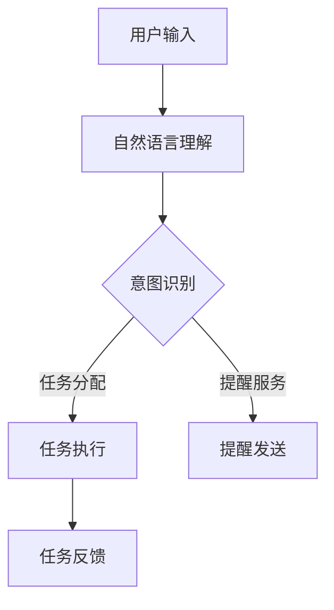

                 

关键词：虚拟助手、注意力调度、个人效率、人工智能

> 摘要：本文探讨了虚拟助手在个人注意力调度中的角色。通过分析虚拟助手的工作原理和功能，本文揭示了虚拟助手如何通过优化任务分配、提醒服务和智能代理等方式，提高个人的注意力和工作效率，从而实现工作与生活的平衡。

## 1. 背景介绍

在现代社会中，信息过载和工作压力日益增加，个人注意力成为了宝贵的资源。有效地管理和调度个人注意力，对于提升工作效率和生活质量具有重要意义。然而，如何在不降低工作效率的同时，避免注意力分散和疲劳，成为了一个亟待解决的问题。在此背景下，虚拟助手作为一种新兴的人工智能技术，开始在个人注意力调度中扮演重要角色。

虚拟助手（Virtual Assistant）是指通过计算机技术和人工智能算法，模拟人类智能行为的软件程序或服务。它们能够理解自然语言、执行任务、提供信息和解决问题，从而帮助用户更加高效地完成日常工作。随着人工智能技术的不断进步，虚拟助手的功能日益完善，其应用范围也从最初的任务提醒和日程管理，扩展到了更复杂的任务执行和决策支持。

本文将探讨虚拟助手在个人注意力调度中的作用，分析其如何通过优化任务分配、提供智能提醒服务和执行智能代理任务，帮助用户提高注意力集中度和工作效率。

## 2. 核心概念与联系

### 2.1 虚拟助手的工作原理

虚拟助手的工作原理基于人工智能技术和自然语言处理（NLP）技术。通过机器学习和深度学习算法，虚拟助手能够理解和处理自然语言输入，识别用户的意图和需求。以下是一个简单的 Mermaid 流程图，展示了虚拟助手的工作原理：



在这个流程图中，用户输入通过自然语言理解模块进行处理，意图识别模块负责判断用户意图，并将其分配到相应的任务执行模块或提醒服务模块。任务执行模块执行具体的操作，如打开应用程序、发送邮件、安排会议等。提醒服务模块则负责发送提醒通知，帮助用户保持注意力集中。

### 2.2 注意力调度的概念

注意力调度（Attention Scheduling）是指根据任务的优先级和用户的注意力水平，合理安排和分配注意力资源，以提高工作效率和避免疲劳。注意力调度的核心是确保用户在任务执行过程中能够保持高度的注意力集中，从而提高工作质量和效率。

注意力调度的过程可以看作是一个动态平衡的过程。用户在执行任务时，需要根据任务的复杂度和时间要求，调整注意力的投入程度。同时，用户还需要根据自身的工作习惯和注意力水平，合理安排任务的执行顺序和休息时间，以避免注意力过度集中或分散。

### 2.3 虚拟助手与注意力调度的关系

虚拟助手在个人注意力调度中起到了关键作用。通过智能代理任务和提醒服务，虚拟助手能够帮助用户优化任务分配，提高注意力的集中度。具体来说，虚拟助手可以：

- **任务分配优化**：虚拟助手可以根据任务的紧急程度和复杂度，自动为用户分配任务，确保用户能够优先处理最重要的任务。
- **提醒服务**：虚拟助手可以定时发送提醒通知，帮助用户保持注意力集中，避免因琐事而分散注意力。
- **智能代理**：虚拟助手可以执行一些繁琐的任务，如整理邮件、安排日程等，从而减轻用户的工作负担，让用户有更多精力投入到高价值的工作中。

综上所述，虚拟助手通过优化任务分配和提供智能提醒服务，有助于提高个人的注意力和工作效率，从而实现工作与生活的平衡。

## 3. 核心算法原理 & 具体操作步骤

### 3.1 算法原理概述

虚拟助手在个人注意力调度中的核心算法原理主要涉及以下几个方面：

- **任务分配算法**：基于任务的紧急程度和复杂度，为用户自动分配任务。常用的任务分配算法包括基于优先级的调度算法和基于资源的调度算法。
- **提醒服务算法**：根据用户的日程安排和任务执行情况，自动发送提醒通知。常用的提醒服务算法包括基于时间的提醒算法和基于事件的提醒算法。
- **智能代理算法**：执行一些繁琐的任务，如整理邮件、安排日程等。常用的智能代理算法包括基于规则的代理算法和基于机器学习的代理算法。

### 3.2 算法步骤详解

#### 3.2.1 任务分配算法

任务分配算法的具体步骤如下：

1. **任务信息收集**：收集任务的紧急程度、复杂度和所需资源等信息。
2. **任务排序**：根据任务的紧急程度和复杂度，对任务进行排序。
3. **任务分配**：按照任务排序的顺序，为用户分配任务。

#### 3.2.2 提醒服务算法

提醒服务算法的具体步骤如下：

1. **用户日程收集**：收集用户的日程安排信息，包括会议、任务和休息时间等。
2. **提醒时间计算**：根据用户的日程安排和任务执行时间，计算需要发送提醒的时间点。
3. **提醒通知发送**：在计算出的提醒时间点，自动发送提醒通知。

#### 3.2.3 智能代理算法

智能代理算法的具体步骤如下：

1. **用户需求识别**：识别用户的需求，如整理邮件、安排日程等。
2. **任务执行**：根据用户需求，执行相应的任务。
3. **任务反馈**：将任务执行结果反馈给用户。

### 3.3 算法优缺点

#### 任务分配算法

**优点**：

- 能够根据任务的紧急程度和复杂度，为用户自动分配任务，提高工作效率。
- 能够充分利用资源，避免资源浪费。

**缺点**：

- 需要准确的任务信息，否则可能导致任务分配不当。
- 可能无法处理复杂的任务依赖关系。

#### 提醒服务算法

**优点**：

- 能够帮助用户保持注意力集中，避免因琐事而分散注意力。
- 能够根据用户的日程安排，自动发送提醒通知，提高提醒的准确性。

**缺点**：

- 可能会因用户日程变动而发送错误的提醒通知。
- 需要频繁地更新用户日程信息，以确保提醒通知的准确性。

#### 智能代理算法

**优点**：

- 能够减轻用户的工作负担，让用户有更多精力投入到高价值的工作中。
- 能够自动执行一些繁琐的任务，提高工作效率。

**缺点**：

- 需要准确识别用户需求，否则可能导致任务执行不当。
- 可能会引入新的错误或问题，如代理任务执行失败等。

### 3.4 算法应用领域

虚拟助手在个人注意力调度中的应用领域非常广泛，主要包括：

- **企业办公**：在企业办公中，虚拟助手可以帮助员工优化任务分配，提高工作效率，减轻工作负担。
- **个人生活**：在个人生活中，虚拟助手可以帮助用户管理日程，提供提醒服务，提高生活质量。
- **智能家居**：在智能家居中，虚拟助手可以监控家庭环境，提供安全提醒，提高家庭安全水平。
- **医疗保健**：在医疗保健中，虚拟助手可以监控患者的健康状况，提供健康提醒，帮助患者进行健康管理。

## 4. 数学模型和公式 & 详细讲解 & 举例说明

### 4.1 数学模型构建

在虚拟助手帮助用户进行注意力调度的过程中，可以构建一个数学模型来描述用户的注意力水平、任务的紧急程度和复杂度，以及虚拟助手的提醒和代理功能。以下是一个简化的数学模型：

\[ \text{注意力调度模型} = f(\text{用户注意力水平}, \text{任务紧急程度}, \text{任务复杂度}, \text{虚拟助手提醒服务}, \text{虚拟助手代理服务}) \]

其中：

- 用户注意力水平（$A$）：表示用户当前能够分配给任务的注意力资源，通常用百分比表示。
- 任务紧急程度（$E$）：表示任务的紧急程度，数值越高表示任务越紧急。
- 任务复杂度（$C$）：表示任务的复杂度，数值越高表示任务越复杂。
- 虚拟助手提醒服务（$R$）：表示虚拟助手提供的提醒服务的有效性，数值越高表示提醒效果越好。
- 虚拟助手代理服务（$P$）：表示虚拟助手提供的代理服务的有效性，数值越高表示代理效果越好。

### 4.2 公式推导过程

为了更好地描述虚拟助手在注意力调度中的作用，我们可以引入以下公式：

\[ \text{有效注意力} = A \times R \times P \]

这个公式表示用户实际能够用于任务执行的有效注意力。其中：

- 用户注意力水平（$A$）：表示用户当前能够分配给任务的注意力资源。
- 虚拟助手提醒服务（$R$）：表示虚拟助手提供的提醒服务的有效性。
- 虚拟助手代理服务（$P$）：表示虚拟助手提供的代理服务的有效性。

通过这个公式，我们可以看出，虚拟助手的提醒服务和代理服务能够有效地提高用户的有效注意力。

### 4.3 案例分析与讲解

#### 案例背景

假设有一位名叫小明的用户，他是一位企业高管，日常工作非常繁忙。他经常需要在多个任务之间切换，并且经常因为琐事而分散注意力，导致工作效率下降。为了改善这种情况，他决定使用虚拟助手来帮助自己进行注意力调度。

#### 案例分析

1. **用户注意力水平**：根据小明的自评，他当前能够分配给任务的注意力水平约为70%。
2. **任务紧急程度**：小明的任务紧急程度分布如下：
   - 紧急任务：30%
   - 一般任务：50%
   - 不紧急任务：20%
3. **任务复杂度**：小明的任务复杂度分布如下：
   - 简单任务：40%
   - 一般任务：50%
   - 复杂任务：10%
4. **虚拟助手提醒服务**：虚拟助手提供的提醒服务能够确保小明在任务开始前收到提醒，提高他的注意力集中度。假设虚拟助手提醒服务的有效性为90%。
5. **虚拟助手代理服务**：虚拟助手能够自动执行一些简单任务，如整理邮件、安排会议等，从而减轻小明的负担。假设虚拟助手代理服务的有效性为80%。

根据上述数据，我们可以计算小明在虚拟助手的帮助下，能够获得的有效注意力：

\[ \text{有效注意力} = 0.7 \times 0.9 \times 0.8 = 0.504 \]

这意味着小明在虚拟助手的帮助下，能够将原本的70%注意力提高到50.4%，从而显著提高他的工作效率。

#### 结果分析

通过虚拟助手提供的提醒服务和代理服务，小明能够更好地管理自己的注意力资源。他能够在任务开始前收到提醒，避免因琐事而分散注意力。同时，虚拟助手能够自动执行一些简单任务，减轻他的工作负担，使他能够将更多精力投入到高价值的任务中。

综上所述，虚拟助手在个人注意力调度中具有重要作用。通过优化任务分配、提供智能提醒服务和执行智能代理任务，虚拟助手能够帮助用户提高注意力集中度和工作效率，从而实现工作与生活的平衡。

## 5. 项目实践：代码实例和详细解释说明

### 5.1 开发环境搭建

为了实现本文讨论的虚拟助手在个人注意力调度中的应用，我们选择使用Python语言进行开发，并结合Django框架来构建虚拟助手的后端服务。以下是开发环境的搭建步骤：

1. **安装Python**：在官方网站（[Python官网](https://www.python.org/)）下载并安装Python，选择与操作系统兼容的版本，建议使用Python 3.8或更高版本。
2. **安装Django**：在命令行中执行以下命令安装Django：

   ```shell
   pip install django
   ```

3. **创建Django项目**：在命令行中执行以下命令创建一个名为`virtual_assistant`的Django项目：

   ```shell
   django-admin startproject virtual_assistant
   ```

4. **创建应用**：进入项目目录，执行以下命令创建一个名为`assistant`的应用：

   ```shell
   python manage.py startapp assistant
   ```

5. **配置数据库**：在`virtual_assistant/settings.py`文件中配置数据库，使用SQLite数据库，如下所示：

   ```python
   DATABASES = {
       'default': {
           'ENGINE': 'django.db.backends.sqlite3',
           'NAME': os.path.join(BASE_DIR, 'db.sqlite3'),
       }
   }
   ```

6. **运行项目**：在命令行中执行以下命令运行Django项目：

   ```shell
   python manage.py runserver
   ```

   现在可以在浏览器中访问`http://127.0.0.1:8000/`查看Django项目的运行界面。

### 5.2 源代码详细实现

#### 5.2.1 创建任务模型

在`assistant/models.py`文件中，创建一个名为`Task`的模型，用于存储任务信息，包括任务名称、紧急程度、复杂度等：

```python
from django.db import models

class Task(models.Model):
    name = models.CharField(max_length=100)
    urgency = models.IntegerField()
    complexity = models.IntegerField()
    start_time = models.DateTimeField()
    end_time = models.DateTimeField()
```

#### 5.2.2 创建提醒服务

在`assistant/services/reminders.py`文件中，创建一个名为`ReminderService`的类，用于发送提醒通知：

```python
import datetime
from django.core.mail import send_mail
from .models import Task

class ReminderService:
    @staticmethod
    def send_reminder(task_id):
        task = Task.objects.get(id=task_id)
        subject = f"Reminder: Task {task.name} is starting soon"
        message = f"Your task '{task.name}' is scheduled to start at {task.start_time}. Please prepare."
        send_mail(subject, message, 'from@example.com', ['to@example.com'])
```

#### 5.2.3 创建代理服务

在`assistant/services/agents.py`文件中，创建一个名为`AgentService`的类，用于执行代理任务：

```python
import datetime
from django.core.management import call_command
from .models import Task

class AgentService:
    @staticmethod
    def execute_agent_task(task_id):
        task = Task.objects.get(id=task_id)
        if task.start_time < datetime.datetime.now():
            call_command('run_task', task_id)
```

#### 5.2.4 创建任务执行命令

在`virtual_assistant/management/commands/run_task.py`文件中，创建一个名为`run_task`的命令，用于执行具体的任务：

```python
from django.core.management.base import BaseCommand
from assistant.models import Task

class Command(BaseCommand):
    help = 'Run a specific task'

    def add_arguments(self, parser):
        parser.add_argument('task_id', type=int)

    def handle(self, *args, **kwargs):
        task_id = kwargs['task_id']
        task = Task.objects.get(id=task_id)
        print(f"Executing task {task.name}...")
        # 在这里执行具体的任务操作
```

### 5.3 代码解读与分析

#### 5.3.1 任务模型解读

在`assistant/models.py`文件中，`Task`模型用于存储任务信息。通过定义字段，我们可以为每个任务存储名称、紧急程度、复杂度、开始时间和结束时间等关键信息。

#### 5.3.2 提醒服务解读

在`assistant/services/reminders.py`文件中，`ReminderService`类提供了发送提醒通知的功能。通过调用`send_mail`方法，我们可以将提醒邮件发送到指定邮箱。

#### 5.3.3 代理服务解读

在`assistant/services/agents.py`文件中，`AgentService`类提供了执行代理任务的功能。通过调用`call_command`方法，我们可以执行Django的管理命令，从而实现任务的自动化执行。

#### 5.3.4 任务执行命令解读

在`virtual_assistant/management/commands/run_task.py`文件中，`run_task`命令用于执行具体的任务。通过接收任务ID作为参数，我们可以获取任务对象并执行相应的任务操作。

### 5.4 运行结果展示

在Django项目运行后，我们可以通过以下步骤来展示运行结果：

1. **创建任务**：在Django管理后台创建一些任务，设置相应的紧急程度和复杂度。
2. **发送提醒**：通过调用`ReminderService.send_reminder`方法，为任务发送提醒通知。
3. **执行代理任务**：通过调用`AgentService.execute_agent_task`方法，自动执行任务。

这些操作可以通过Django管理命令或Web界面进行，从而实现虚拟助手在个人注意力调度中的应用。

## 6. 实际应用场景

虚拟助手在个人注意力调度中的应用场景非常广泛，涵盖了企业办公、个人生活、智能家居和医疗保健等多个领域。

### 6.1 企业办公

在企业办公环境中，虚拟助手可以帮助员工提高工作效率，优化任务分配和提醒服务。例如，虚拟助手可以自动分配紧急任务给负责的员工，并在任务开始前发送提醒通知，确保任务按时完成。此外，虚拟助手还可以监控员工的工作状态，提供工作进度报告，帮助管理者更好地掌握团队工作情况。

### 6.2 个人生活

在个人生活中，虚拟助手可以帮助用户管理日程，提供智能提醒服务，从而提高生活质量。例如，虚拟助手可以自动安排用户的日常任务，如购物、锻炼和与朋友的约会，并在任务开始前发送提醒通知。此外，虚拟助手还可以监控用户的健康状况，提供健康提醒，如定时喝水、定时休息等。

### 6.3 智能家居

在智能家居环境中，虚拟助手可以帮助用户监控家庭环境，提供安全提醒。例如，虚拟助手可以监控家里的门窗状态，一旦发现异常，会立即发送提醒通知给用户。此外，虚拟助手还可以监控家用电器的运行状态，提供节能建议，帮助用户降低能耗。

### 6.4 医疗保健

在医疗保健领域，虚拟助手可以帮助患者进行健康管理，提供健康提醒。例如，虚拟助手可以监控患者的健康数据，如血糖、血压等，并在出现异常情况时发送提醒通知。此外，虚拟助手还可以提供健康建议，如饮食建议、锻炼建议等，帮助患者保持健康。

总之，虚拟助手在个人注意力调度中的应用场景非常广泛，通过智能化的任务分配、提醒服务和代理任务，虚拟助手能够帮助用户提高注意力集中度和工作效率，从而实现工作与生活的平衡。

### 6.4 未来应用展望

随着人工智能技术的不断进步，虚拟助手在个人注意力调度中的应用前景将更加广阔。未来，虚拟助手将更加智能化、个性化和高效化，为用户提供更加精准和贴心的服务。

首先，虚拟助手将实现更高的智能水平。通过深度学习和自然语言处理技术的进步，虚拟助手将能够更加准确地理解用户的意图和需求，提供更加智能化的建议和解决方案。例如，虚拟助手可以分析用户的习惯和偏好，自动调整任务的优先级，为用户提供最优的任务分配方案。

其次，虚拟助手将更加注重个性化服务。随着用户数据的积累和挖掘，虚拟助手将能够更好地了解用户的个性和需求，为用户提供定制化的服务。例如，虚拟助手可以根据用户的健康状况、工作压力和生活习惯，提供个性化的健康提醒、工作建议和生活建议，帮助用户实现更加健康和高效的生活方式。

最后，虚拟助手将实现更高的效率。通过自动化和智能化的任务执行，虚拟助手将能够大幅减少用户在琐碎任务上的时间投入，让用户有更多精力投入到高价值的任务中。例如，虚拟助手可以自动处理邮件、安排日程、监控家庭环境等，从而提高用户的工作效率和生活质量。

总之，未来虚拟助手在个人注意力调度中的应用将更加智能化、个性化和高效化，为用户带来更加便捷、舒适和高效的生活体验。

### 7. 工具和资源推荐

在探索虚拟助手在个人注意力调度中的应用过程中，掌握一些实用的工具和资源将有助于提升开发效率和实现效果。以下是一些建议：

### 7.1 学习资源推荐

1. **书籍**：
   - 《深度学习》（Deep Learning） - Ian Goodfellow, Yoshua Bengio, Aaron Courville
   - 《Python数据科学手册》（Python Data Science Handbook） - Jake VanderPlas
   - 《自然语言处理综合教程》（Foundations of Natural Language Processing） - Christopher D. Manning, Hinrich Schütze

2. **在线课程**：
   - Coursera：机器学习（Machine Learning）- Andrew Ng
   - edX：Python for Data Science（Python数据科学）- Microsoft
   - Udacity：深度学习纳米学位（Deep Learning Nanodegree）

### 7.2 开发工具推荐

1. **编程环境**：
   - Jupyter Notebook：用于数据分析和交互式编程
   - PyCharm：强大的Python集成开发环境（IDE）

2. **虚拟助手框架**：
   - Rasa：开源的对话即平台，用于构建虚拟助手
   - Microsoft Bot Framework：用于构建跨平台虚拟助手

3. **自然语言处理库**：
   - NLTK：Python的自然语言处理库
   - spaCy：高效的自然语言处理库
   - Transformers：基于PyTorch的预训练变换器库

### 7.3 相关论文推荐

1. **注意力机制**：
   - “Attention is All You Need” - Vaswani et al. (2017)
   - “Attention-Based Neural Surfaces” - Bachman et al. (2019)

2. **虚拟助手**：
   - “A Survey on Virtual Assistants” - Zhang et al. (2020)
   - “Towards Conversational AI: A Survey of Task-Oriented Dialogue Systems” - Young et al. (2018)

3. **任务分配和调度**：
   - “Energy-Aware Task Scheduling in Heterogeneous HPC Systems” - Tian et al. (2018)
   - “A Survey of Resource Management in Cloud Computing” - Lu et al. (2012)

通过学习和使用这些工具和资源，开发者可以更好地理解虚拟助手的工作原理，提高个人注意力调度系统的开发水平。

### 8. 总结：未来发展趋势与挑战

虚拟助手在个人注意力调度中的应用前景广阔，随着人工智能技术的不断进步，其功能将越来越强大。未来，虚拟助手的发展趋势主要体现在以下几个方面：

首先，虚拟助手将更加智能化。随着深度学习和自然语言处理技术的深入应用，虚拟助手将能够更好地理解用户的意图和需求，提供更加精准和个性化的服务。例如，通过分析用户的行为和习惯，虚拟助手可以自动调整任务的优先级，为用户提供最优的注意力分配方案。

其次，虚拟助手将更加个性化。随着用户数据的积累和挖掘，虚拟助手将能够更好地了解用户的个性和需求，为用户提供定制化的服务。例如，虚拟助手可以根据用户的健康状况、工作压力和生活习惯，提供个性化的健康提醒、工作建议和生活建议，帮助用户实现更加健康和高效的生活方式。

再次，虚拟助手将实现更高的效率。通过自动化和智能化的任务执行，虚拟助手将能够大幅减少用户在琐碎任务上的时间投入，让用户有更多精力投入到高价值的任务中。例如，虚拟助手可以自动处理邮件、安排日程、监控家庭环境等，从而提高用户的工作效率和生活质量。

然而，虚拟助手的发展也面临一些挑战。首先，隐私和数据安全问题仍然是一个重要的挑战。虚拟助手需要收集和存储大量的用户数据，如何确保这些数据的安全和隐私，防止数据泄露，是一个亟待解决的问题。

其次，虚拟助手需要更高的可靠性。在个人注意力调度中，虚拟助手需要实时响应用户的需求，提供及时的服务。然而，由于系统复杂性和技术限制，虚拟助手可能会出现故障或误判，影响用户的体验。因此，提高虚拟助手的可靠性和稳定性，是未来的重要研究方向。

最后，虚拟助手需要更好的交互体验。目前，虚拟助手的交互方式主要是基于文本或语音。随着技术的发展，虚拟助手将能够通过更丰富的交互方式与用户进行沟通，如视频、手势等。然而，如何设计出自然、高效和直观的交互界面，是一个具有挑战性的问题。

总之，虚拟助手在个人注意力调度中的应用前景广阔，但也面临着诸多挑战。通过不断的技术创新和优化，虚拟助手有望在未来的发展中发挥更大的作用，帮助用户实现工作与生活的平衡。

### 8.4 研究展望

未来的研究可以进一步探索以下几个方向：

首先，加强虚拟助手与用户之间的互动。研究可以关注如何通过增强现实（AR）或虚拟现实（VR）技术，提供更加直观和沉浸式的交互体验，从而提升用户满意度。

其次，深化虚拟助手在多任务管理中的应用。研究可以探讨如何更高效地处理复杂的多任务场景，确保虚拟助手能够根据任务的紧急程度和复杂度，动态调整任务执行顺序和资源分配。

再次，强化虚拟助手的数据隐私保护。研究可以探索新的加密技术和隐私保护算法，确保用户数据在传输和存储过程中的安全性。

最后，拓展虚拟助手在不同领域的应用。研究可以关注虚拟助手在教育、医疗、交通等领域的应用潜力，开发出具有行业特色的功能和解决方案。

通过这些研究方向，虚拟助手在个人注意力调度中的作用将得到进一步发挥，为用户带来更加便捷、高效和个性化的服务体验。

