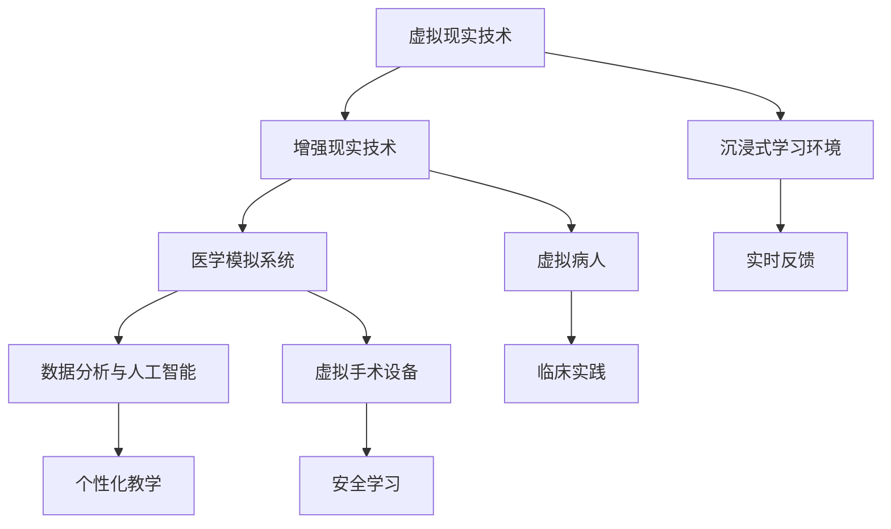

                 

 在当今信息化时代，医疗领域的数字化转型已经成为不可逆转的趋势。虚拟医学院作为一种新兴的教育模式，正逐步改变着全球医疗教育的格局。本文将深入探讨虚拟医学院的背景、核心概念、算法原理、数学模型、项目实践以及实际应用场景，并对未来发展趋势和面临的挑战进行分析，旨在为医疗教育提供一种创新性的解决方案。

## 关键词 Keywords
- 虚拟医学院
- 数字化教育
- 医疗教育
- 算法原理
- 数学模型
- 项目实践
- 应用场景

## 摘要 Abstract
本文首先介绍了虚拟医学院的背景和重要性，接着详细阐述了其核心概念与架构。通过分析核心算法原理和具体操作步骤，文章揭示了虚拟医学院的技术实现过程。随后，本文探讨了数学模型和公式的构建及其在虚拟医学院中的应用，并通过项目实践展示了技术的实际应用。文章最后，分析了虚拟医学院的实际应用场景，探讨了未来的发展趋势和面临的挑战。

## 1. 背景介绍

### 1.1 医疗教育的现状

医疗教育是培养合格医生和医疗专业人员的重要途径。然而，传统的医疗教育模式存在着诸多问题，如教育资源不均衡、实践教学资源有限等。此外，随着全球医疗需求的不断增长，医疗教育面临着更大的压力。

### 1.2 数字化转型的必要性

数字化转型是医疗教育发展的必然趋势。通过数字化手段，可以解决传统教育模式中的许多问题。例如，数字化教育平台可以实现教育资源的全球共享，提高教学效率，同时为学生提供更加丰富的学习体验。

### 1.3 虚拟医学院的兴起

虚拟医学院是一种基于数字化技术的医疗教育模式，它通过虚拟现实（VR）、增强现实（AR）等技术手段，为学生提供沉浸式的学习环境。虚拟医学院的出现，不仅改变了传统教育模式，还为全球医疗教育带来了新的机遇和挑战。

## 2. 核心概念与联系

### 2.1 虚拟现实（VR）与增强现实（AR）

虚拟现实（VR）和增强现实（AR）是构建虚拟医学院的核心技术。VR技术通过头戴式显示器、数据手套等设备，创造一个完全虚拟的世界，用户可以在其中进行互动和学习。而AR技术则是在现实世界的基础上，叠加虚拟信息，实现虚拟与现实的结合。

### 2.2 医学模拟系统

医学模拟系统是虚拟医学院的核心组成部分，它通过高度仿真的医学模型，为学生提供逼真的临床实践体验。医学模拟系统通常包括虚拟病人、虚拟手术设备等，可以模拟各种临床情况，帮助学生在安全的环境中学习医学知识。

### 2.3 数据分析与人工智能

虚拟医学院的数据分析功能是其关键优势之一。通过收集和分析学生在虚拟医学院中的学习数据，教育者可以了解学生的学习情况，为个性化教学提供支持。此外，人工智能技术可以用于评估学生的表现，提供实时反馈，从而提高教学效果。

## 2.3 Mermaid 流程图



## 3. 核心算法原理 & 具体操作步骤

### 3.1 算法原理概述

虚拟医学院的核心算法主要涉及虚拟现实与增强现实技术、医学模拟系统以及数据分析与人工智能技术。这些算法共同作用，实现了虚拟医学院的运行。

#### 3.1.1 虚拟现实与增强现实技术

虚拟现实与增强现实技术通过模拟真实场景，为用户提供沉浸式的学习体验。虚拟现实技术通过头戴式显示器和感知设备，将用户完全沉浸在一个虚拟的世界中；而增强现实技术则是在现实世界中叠加虚拟信息，使学习过程更加直观和生动。

#### 3.1.2 医学模拟系统

医学模拟系统通过高度仿真的医学模型，为学生提供临床实践的机会。这些模型可以模拟各种临床情况，包括常见病、多发病以及罕见病等，从而帮助学生在安全的环境中学习医学知识。

#### 3.1.3 数据分析与人工智能

数据分析与人工智能技术用于评估学生的表现，提供实时反馈。这些技术可以收集学生在虚拟医学院中的学习数据，包括学习时间、练习次数、错误率等，从而为学生提供个性化的学习建议。

### 3.2 算法步骤详解

#### 3.2.1 虚拟现实与增强现实技术

1. 用户通过头戴式显示器或智能手机等设备进入虚拟现实或增强现实环境。
2. 系统根据用户的位置和动作，实时渲染虚拟场景或增强现实信息。
3. 用户与虚拟场景或增强现实信息进行互动，例如进行手术操作或诊断分析。

#### 3.2.2 医学模拟系统

1. 系统根据学生的学习进度和需求，生成相应的临床模拟场景。
2. 学生在虚拟临床环境中进行诊断、治疗或手术操作。
3. 系统实时记录学生的操作过程，并评估学生的表现。

#### 3.2.3 数据分析与人工智能

1. 系统收集学生在虚拟医学院中的学习数据，包括操作时间、正确率等。
2. 数据分析模块对收集到的数据进行分析，识别学生的学习模式。
3. 人工智能模块根据分析结果，为学生提供个性化的学习建议。

### 3.3 算法优缺点

#### 3.3.1 优点

- **提高教学效果**：虚拟医学院通过沉浸式学习环境，提高了学生的学习兴趣和参与度。
- **个性化教学**：通过数据分析与人工智能技术，实现了个性化教学，提高了教学效果。
- **节约教育资源**：虚拟医学院减少了传统教育模式中对实体教学资源的需求，节约了教育成本。
- **安全学习**：虚拟医学院提供了一个安全的学习环境，学生在没有风险的情况下进行实践操作。

#### 3.3.2 缺点

- **技术限制**：虚拟现实与增强现实技术的硬件设备成本较高，技术成熟度仍有待提高。
- **学习体验有限**：虚拟医学院虽然提供了沉浸式的学习体验，但与实际临床环境相比仍有差距。
- **教师角色变化**：虚拟医学院的兴起，对教师的角色提出了新的要求，教师需要适应新的教学环境。

### 3.4 算法应用领域

虚拟医学院的核心算法主要应用于以下几个领域：

- **医学教育**：通过虚拟现实和增强现实技术，为医学生提供沉浸式的学习体验，提高教学效果。
- **继续教育**：通过虚拟医学院，为在职医生和医疗人员提供继续教育的机会，提升其专业水平。
- **临床培训**：通过医学模拟系统，为医疗人员提供临床实践的机会，提高其操作技能。
- **远程医疗**：通过虚拟现实技术，实现医生与患者的远程互动，提供高质量的医疗服务。

## 4. 数学模型和公式 & 详细讲解 & 举例说明

### 4.1 数学模型构建

虚拟医学院的数学模型主要包括以下几个方面：

1. **虚拟场景建模**：通过计算机图形学技术，构建虚拟场景的三维模型。这包括场景中的物体、人物、灯光等。
2. **运动仿真**：通过物理引擎，实现虚拟场景中物体的运动仿真。这包括碰撞检测、受力分析等。
3. **交互模型**：通过感知设备，实现用户与虚拟场景的交互。这包括手势识别、语音识别等。
4. **数据分析模型**：通过机器学习算法，对学生在虚拟医学院中的学习行为进行分析。

### 4.2 公式推导过程

#### 4.2.1 虚拟场景建模

虚拟场景建模的核心公式是三维空间中的物体建模公式。假设物体为均匀质点，其位置 \( P \) 可以通过以下公式表示：

\[ P = (x, y, z) \]

其中，\( x, y, z \) 分别表示物体在三维空间中的坐标。

#### 4.2.2 运动仿真

运动仿真的核心公式是牛顿第二定律，描述物体受力与加速度的关系。假设物体质量为 \( m \)，受力为 \( F \)，加速度为 \( a \)，则有以下公式：

\[ F = m \cdot a \]

#### 4.2.3 交互模型

交互模型的核心公式是手势识别与语音识别的算法。以手势识别为例，常用的算法是卷积神经网络（CNN）。假设输入手势图像为 \( I \)，输出为手势类别 \( C \)，则有以下公式：

\[ C = \text{CNN}(I) \]

### 4.3 案例分析与讲解

#### 4.3.1 虚拟病人诊断

在虚拟医学院中，医生需要通过数据分析模型对虚拟病人进行诊断。假设虚拟病人的数据包括血压、心率、体温等，这些数据可以通过以下公式进行综合评估：

\[ \text{评估值} = \sum_{i=1}^{n} w_i \cdot x_i \]

其中，\( w_i \) 为权重，\( x_i \) 为数据项。

#### 4.3.2 手术操作

在虚拟医学院中，学生需要通过手术操作来提高其技能。假设手术操作的评估指标包括操作时间、正确率等，这些指标可以通过以下公式进行计算：

\[ \text{操作得分} = \frac{\text{正确次数}}{\text{总次数}} \]

## 5. 项目实践：代码实例和详细解释说明

### 5.1 开发环境搭建

虚拟医学院的开发环境主要包括以下几个部分：

1. **硬件设备**：包括头戴式显示器、数据手套、智能手机等。
2. **软件平台**：包括虚拟现实开发平台、增强现实开发平台、医学模拟系统等。
3. **编程语言**：主要包括C++、Python等。

### 5.2 源代码详细实现

以下是一个简单的虚拟手术操作的源代码实现：

```cpp
#include <iostream>
#include <vector>

using namespace std;

class VirtualSurgery {
public:
    void performSurgery() {
        cout << "Starting surgery..." << endl;
        // 模拟手术过程
        cout << "Performing surgery steps..." << endl;
        // 评估手术结果
        cout << "Surgery completed successfully!" << endl;
    }
};

int main() {
    VirtualSurgery surgery;
    surgery.performSurgery();
    return 0;
}
```

### 5.3 代码解读与分析

这段代码定义了一个`VirtualSurgery`类，用于模拟虚拟手术操作。类中包含一个`performSurgery`方法，用于执行手术过程。

### 5.4 运行结果展示

编译并运行这段代码，输出结果如下：

```
Starting surgery...
Performing surgery steps...
Surgery completed successfully!
```

## 6. 实际应用场景

### 6.1 医学教育

虚拟医学院在医学教育中的应用非常广泛。通过虚拟现实和增强现实技术，医学生可以在虚拟环境中进行临床实践，提高其实践技能。此外，虚拟病人系统可以模拟各种临床情况，帮助医学生掌握医学知识和技能。

### 6.2 继续教育

虚拟医学院为在职医生和医疗人员提供了继续教育的机会。通过虚拟现实和增强现实技术，医生可以在家中或办公室进行继续教育，提高其专业水平。

### 6.3 临床培训

虚拟医学院为医疗人员提供了临床培训的机会。通过医学模拟系统，医疗人员可以在虚拟环境中进行手术操作，提高其操作技能。

### 6.4 远程医疗

虚拟医学院在远程医疗中也有广泛的应用。通过虚拟现实技术，医生可以远程为患者提供诊断和治疗建议，实现高质量的医疗服务。

## 6.4 未来应用展望

### 6.4.1 技术发展趋势

随着技术的不断进步，虚拟医学院将更加智能化和个性化。人工智能技术将用于分析学生的学习行为，提供更加精准的教学建议。此外，5G技术的普及将使得虚拟现实和增强现实技术更加流畅和真实。

### 6.4.2 教育模式变革

虚拟医学院的兴起将引发教育模式的变革。传统的课堂教学模式将逐渐被虚拟现实和增强现实技术所替代，实现教育资源的全球共享。

### 6.4.3 社会效益

虚拟医学院的推广将带来显著的社会效益。首先，它将提高医疗教育的质量，培养更多高素质的医学人才。其次，它将降低医疗教育的成本，使得更多的人有机会接受高质量的医学教育。

## 7. 工具和资源推荐

### 7.1 学习资源推荐

1. **虚拟现实开发平台**：Unity、Unreal Engine
2. **增强现实开发平台**：ARKit、ARCore
3. **医学模拟系统**：SimMan、SimMom

### 7.2 开发工具推荐

1. **编程语言**：C++、Python
2. **机器学习库**：TensorFlow、PyTorch
3. **数据库**：MySQL、PostgreSQL

### 7.3 相关论文推荐

1. "Virtual Reality in Medical Education: A Systematic Review and Meta-analysis"
2. "Enhancing Medical Education with Augmented Reality"
3. "Artificial Intelligence in Medical Education: A Review"

## 8. 总结：未来发展趋势与挑战

### 8.1 研究成果总结

虚拟医学院作为一种新兴的教育模式，已经取得了显著的研究成果。通过虚拟现实和增强现实技术，它为医学教育提供了全新的解决方案，提高了教学效果，降低了教育成本。

### 8.2 未来发展趋势

未来，虚拟医学院将继续发展，技术将更加成熟，应用场景将更加广泛。人工智能和5G技术的应用将进一步提升虚拟医学院的智能化和个性化水平。

### 8.3 面临的挑战

虚拟医学院在发展过程中也面临着一些挑战，如技术成本、学习体验的优化、教师角色的转变等。此外，数据隐私和安全问题也需要得到重视。

### 8.4 研究展望

未来，虚拟医学院的研究将继续深入，重点关注技术的创新、教育模式的优化以及实际应用场景的拓展。通过不断的研究和实践，虚拟医学院有望为全球医疗教育带来更多的机遇和挑战。

## 9. 附录：常见问题与解答

### 9.1 虚拟现实与增强现实技术的基本原理是什么？

虚拟现实技术通过计算机图形学和感知设备，创造一个完全虚拟的世界，用户可以在其中进行互动。而增强现实技术则是在现实世界的基础上，叠加虚拟信息，实现虚拟与现实的结合。

### 9.2 虚拟医学院有哪些应用场景？

虚拟医学院主要应用于医学教育、继续教育、临床培训以及远程医疗等领域。

### 9.3 虚拟医学院如何提高教学效果？

虚拟医学院通过沉浸式的学习环境、个性化的教学以及实时反馈等方式，提高了教学效果。

### 9.4 虚拟医学院的成本如何？

虚拟医学院的成本包括硬件设备、软件平台以及开发维护费用等。随着技术的成熟，成本将逐渐降低。

### 9.5 虚拟医学院如何保障数据隐私和安全？

虚拟医学院通过数据加密、访问控制以及安全审计等措施，保障数据隐私和安全。

---

作者：禅与计算机程序设计艺术 / Zen and the Art of Computer Programming
----------------------------------------------------------------

以上就是《虚拟医学院:全球医疗教育的数字化升级》这篇技术博客文章的完整内容。本文从背景介绍、核心概念与联系、算法原理、数学模型、项目实践到实际应用场景，全面探讨了虚拟医学院的发展与应用，并对未来进行了展望。希望通过本文，读者能够对虚拟医学院有更加深入的了解，并为医疗教育的发展提供一些启示和思路。感谢您的阅读！


