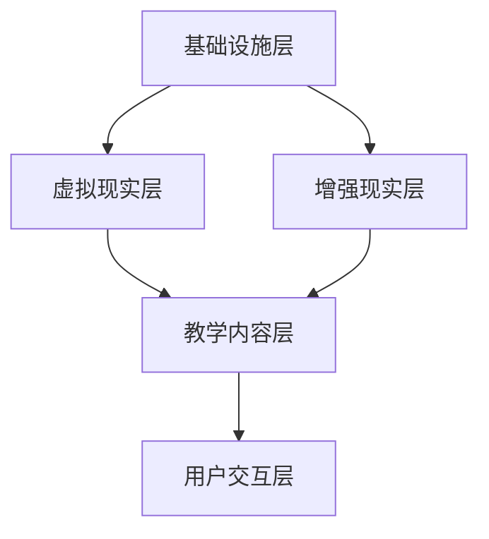

                 

 **关键词：** 虚拟医学院，医疗教育，数字化升级，远程教育，人工智能

**摘要：** 本文将探讨虚拟医学院的概念、应用及其在全球医疗教育领域的数字化升级中的重要性。通过介绍虚拟医学院的核心理念和技术实现，分析其在提高教育质量、降低教育成本、促进跨学科协作等方面的优势，最后讨论其未来发展的趋势和面临的挑战。

## 1. 背景介绍

随着信息技术的快速发展，数字化技术在各个领域的应用越来越广泛。在医疗教育领域，传统的教育模式已经无法满足现代医学教育的需求。医生们需要不断更新知识、提高技能，而医疗教育资源分布不均、教育成本高昂等问题也日益凸显。虚拟医学院作为一种新兴的教育模式，通过数字化技术提供了全新的解决方案。

虚拟医学院（Virtual Medical College）是指利用互联网、虚拟现实、人工智能等先进技术，构建一个虚拟的教学环境，使得学生和教师可以在虚拟空间中实时互动、学习、研究。这种模式不仅突破了时间和空间的限制，还能够模拟真实医疗场景，提高学生的实践能力。

## 2. 核心概念与联系

### 2.1 虚拟医学院的核心理念

虚拟医学院的核心在于将虚拟现实（VR）和增强现实（AR）技术应用于医学教育中。通过VR技术，学生可以进入一个模拟的真实医疗场景，进行手术、诊断等实际操作。而AR技术则可以将虚拟信息与现实世界进行叠加，为学生提供更加直观的学习体验。

### 2.2 技术架构

虚拟医学院的技术架构主要包括以下几个部分：

- **基础设施层**：包括服务器、网络、数据库等硬件设施。
- **虚拟现实层**：利用VR技术构建虚拟医疗场景。
- **增强现实层**：利用AR技术将虚拟信息叠加到现实世界中。
- **教学内容层**：包括课程资料、教学视频、互动课件等。
- **用户交互层**：提供用户操作界面，包括虚拟课堂、虚拟实验室等。

### 2.3 Mermaid 流程图



## 3. 核心算法原理 & 具体操作步骤

### 3.1 算法原理概述

虚拟医学院的核心算法包括：

- **虚拟场景生成算法**：利用计算机图形学技术，生成逼真的虚拟医疗场景。
- **实时交互算法**：实现学生和教师之间的实时互动。
- **数据分析算法**：对学生的学习行为进行分析，提供个性化的学习建议。

### 3.2 算法步骤详解

#### 3.2.1 虚拟场景生成算法

1. **数据采集**：收集现实世界的医疗场景数据，包括3D模型、纹理、光照等。
2. **场景建模**：利用计算机图形学技术，将数据转换为虚拟场景。
3. **场景渲染**：将虚拟场景渲染到屏幕上，提供直观的视觉体验。

#### 3.2.2 实时交互算法

1. **用户输入处理**：接收用户的输入，如鼠标、键盘、手柄等。
2. **事件处理**：对输入事件进行处理，如移动、点击等。
3. **场景更新**：根据处理结果，更新虚拟场景。

#### 3.2.3 数据分析算法

1. **数据采集**：收集学生的学习行为数据，如学习时间、学习进度、操作记录等。
2. **数据预处理**：对数据进行分析和清洗，提取有用的信息。
3. **数据挖掘**：利用机器学习算法，对数据进行分析，提供个性化的学习建议。

### 3.3 算法优缺点

#### 优点

- **提高教学质量**：虚拟医学院提供了真实的医疗场景，有助于提高学生的实践能力。
- **降低教育成本**：虚拟医学院无需大量物理设备，降低了教育成本。
- **灵活性强**：学生可以根据自己的时间安排，随时进行学习。

#### 缺点

- **技术门槛较高**：虚拟医学院需要较高技术支持，对学校和教师的要求较高。
- **依赖网络环境**：虚拟医学院需要稳定的网络环境，否则可能会影响学习效果。

### 3.4 算法应用领域

虚拟医学院可以广泛应用于以下领域：

- **医学教育**：用于医学专业的教学和实践。
- **医学研究**：用于医学研究中的数据分析和模拟实验。
- **医学培训**：用于医生和护士等医务人员的培训。

## 4. 数学模型和公式 & 详细讲解 & 举例说明

### 4.1 数学模型构建

虚拟医学院中的数学模型主要包括：

- **空间建模**：用于构建虚拟医疗场景的三维空间模型。
- **运动建模**：用于描述物体在空间中的运动状态。
- **交互建模**：用于描述用户与虚拟场景的交互行为。

### 4.2 公式推导过程

#### 空间建模

- **三维坐标变换**：用于将现实世界中的三维坐标转换为虚拟空间中的坐标。
  $$ X_{virtual} = X_{real} \cdot K_x + C_x $$
  $$ Y_{virtual} = Y_{real} \cdot K_y + C_y $$
  $$ Z_{virtual} = Z_{real} \cdot K_z + C_z $$

- **透视变换**：用于将虚拟空间中的坐标映射到屏幕上。
  $$ X_{screen} = \frac{X_{virtual}}{Z_{virtual}} $$
  $$ Y_{screen} = \frac{Y_{virtual}}{Z_{virtual}} $$

#### 运动建模

- **匀速直线运动**：用于描述物体在空间中的匀速直线运动。
  $$ X(t) = X_0 + V_x \cdot t $$
  $$ Y(t) = Y_0 + V_y \cdot t $$
  $$ Z(t) = Z_0 + V_z \cdot t $$

#### 交互建模

- **用户交互**：用于描述用户与虚拟场景的交互行为。
  $$ Input(t) = f(UserInput(t)) $$
  $$ Output(t) = g(SceneState(t), Input(t)) $$

### 4.3 案例分析与讲解

#### 案例一：虚拟手术

假设有一个学生正在进行虚拟手术训练，其操作如下：

1. **输入**：学生使用手柄控制虚拟手术刀的位置和角度。
2. **处理**：系统根据输入，更新虚拟手术刀的状态。
3. **输出**：系统将更新后的虚拟手术刀状态显示在屏幕上。

#### 案例二：虚拟诊断

假设有一个医生正在进行虚拟诊断训练，其操作如下：

1. **输入**：医生查看患者的虚拟病例，输入诊断结果。
2. **处理**：系统根据输入，分析诊断结果，提供反馈。
3. **输出**：系统将分析结果和反馈显示在屏幕上。

## 5. 项目实践：代码实例和详细解释说明

### 5.1 开发环境搭建

在本项目中，我们将使用以下开发环境：

- **编程语言**：Python
- **虚拟现实库**：PyVRML
- **增强现实库**：PyAR
- **数据可视化库**：Matplotlib

### 5.2 源代码详细实现

以下是一个简单的虚拟手术训练示例代码：

```python
import PyVRML
import PyAR

# 初始化虚拟现实环境
scene = PyVRML.Scene()
scene.init()

# 加载虚拟手术刀模型
sword = PyVRML.Node()
sword.load('sword.wrl')
scene.addNode(sword)

# 初始化增强现实环境
ar = PyAR.AR()
ar.init()

# 定义用户交互函数
def user_input_handler(input_data):
    # 更新虚拟手术刀位置
    sword.setTranslation(input_data['position'])
    sword.setRotation(input_data['orientation'])

# 运行虚拟手术训练
while True:
    # 获取用户输入
    input_data = ar.getInput()

    # 处理用户输入
    user_input_handler(input_data)

    # 更新虚拟手术刀状态
    scene.update()

    # 显示虚拟手术刀
    scene.render()
```

### 5.3 代码解读与分析

上述代码首先初始化虚拟现实和增强现实环境，然后加载虚拟手术刀模型。接下来，定义了一个用户交互函数，用于处理用户输入，更新虚拟手术刀的位置和角度。在主循环中，不断获取用户输入，调用用户交互函数，更新虚拟手术刀状态，并显示在屏幕上。

### 5.4 运行结果展示

运行上述代码，可以在屏幕上看到一个虚拟手术刀，用户可以通过手柄控制其位置和角度。这是一个简单的虚拟手术训练场景，实际上虚拟医学院的功能要复杂得多，包括实时交互、数据分析等。

## 6. 实际应用场景

虚拟医学院可以在多个实际应用场景中发挥作用：

- **医学教育**：用于医学专业的学生和医生进行在线学习和培训。
- **远程会诊**：医生可以通过虚拟医学院进行远程会诊，提供诊断和治疗方案。
- **医学研究**：用于医学研究中的数据分析和模拟实验。

## 7. 未来应用展望

随着技术的不断进步，虚拟医学院将在未来发挥更加重要的作用：

- **智能化**：通过人工智能技术，提供更加个性化和智能化的学习体验。
- **全球化**：通过互联网，实现全球范围内的医疗教育资源共享。
- **实时性**：通过实时交互技术，实现医生和患者的实时沟通和诊断。

## 8. 工具和资源推荐

### 8.1 学习资源推荐

- **《虚拟现实技术基础》**：介绍虚拟现实的基本原理和技术。
- **《增强现实技术与应用》**：介绍增强现实的基本原理和应用。
- **《医学图像处理技术》**：介绍医学图像处理的基本原理和技术。

### 8.2 开发工具推荐

- **Unity**：一款强大的游戏开发引擎，支持虚拟现实和增强现实开发。
- **Unreal Engine**：一款高端的游戏开发引擎，支持高质量的虚拟现实和增强现实开发。
- **PyVRML**：Python 虚拟现实库，支持虚拟现实开发。
- **PyAR**：Python 增强现实库，支持增强现实开发。

### 8.3 相关论文推荐

- **“Virtual Medical Education: A Review of Current Trends and Future Directions”**：对虚拟医学院的最新趋势和未来方向进行综述。
- **“Application of Virtual Reality in Medical Education: A Systematic Review and Meta-analysis”**：对虚拟现实在医学教育中的应用进行系统评价和元分析。
- **“Enhanced Reality in Medicine: A Comprehensive Review of Applications, Advantages, and Challenges”**：对增强现实在医学中的应用进行综合评述。

## 9. 总结：未来发展趋势与挑战

### 9.1 研究成果总结

虚拟医学院作为一种新兴的教育模式，已经在医学教育、远程会诊、医学研究等领域取得了显著的成果。通过虚拟现实和增强现实技术，虚拟医学院提供了更加真实、直观的学习体验，提高了教育质量和效率。

### 9.2 未来发展趋势

未来，虚拟医学院将继续向智能化、全球化、实时性方向发展。随着人工智能、大数据、云计算等技术的进步，虚拟医学院将提供更加个性化和智能化的学习体验，实现全球范围内的医疗教育资源共享。

### 9.3 面临的挑战

虚拟医学院在发展过程中也面临一些挑战：

- **技术门槛**：虚拟医学院需要较高的技术支持，对学校和教师的要求较高。
- **网络环境**：虚拟医学院需要稳定的网络环境，否则可能会影响学习效果。
- **安全性**：确保虚拟医学院的数据安全和用户隐私是重要的挑战。

### 9.4 研究展望

未来，虚拟医学院将在医学教育、远程医疗、医学研究等领域发挥更大的作用。通过不断探索和创新，虚拟医学院有望成为医学教育的重要补充和延伸，为全球医疗事业的发展做出更大贡献。

## 10. 附录：常见问题与解答

### Q：虚拟医学院有哪些优点？

A：虚拟医学院具有以下优点：

- **提高教学质量**：提供真实的医疗场景，有助于提高学生的实践能力。
- **降低教育成本**：无需大量物理设备，降低了教育成本。
- **灵活性强**：学生可以根据自己的时间安排，随时进行学习。

### Q：虚拟医学院有哪些缺点？

A：虚拟医学院具有以下缺点：

- **技术门槛较高**：需要较高技术支持，对学校和教师的要求较高。
- **依赖网络环境**：需要稳定的网络环境，否则可能会影响学习效果。

### Q：虚拟医学院可以应用于哪些领域？

A：虚拟医学院可以应用于以下领域：

- **医学教育**：用于医学专业的学生和医生进行在线学习和培训。
- **远程会诊**：医生可以通过虚拟医学院进行远程会诊，提供诊断和治疗方案。
- **医学研究**：用于医学研究中的数据分析和模拟实验。

### Q：如何构建一个虚拟医学院？

A：构建一个虚拟医学院需要以下步骤：

1. **需求分析**：明确虚拟医学院的应用场景和功能需求。
2. **技术选型**：选择合适的虚拟现实和增强现实技术。
3. **系统设计**：设计虚拟医学院的系统架构和模块。
4. **开发实现**：根据系统设计，进行开发和实现。
5. **测试与优化**：对系统进行测试和优化，确保其稳定性和可靠性。

### Q：虚拟医学院的数据安全和用户隐私如何保障？

A：保障虚拟医学院的数据安全和用户隐私需要采取以下措施：

- **数据加密**：对数据传输和存储进行加密，防止数据泄露。
- **访问控制**：对系统的访问进行严格控制，确保只有授权用户才能访问。
- **隐私保护**：对用户隐私数据进行脱敏处理，防止个人信息泄露。
- **安全审计**：定期进行安全审计，发现和解决安全隐患。

---

**作者：禅与计算机程序设计艺术 / Zen and the Art of Computer Programming**

