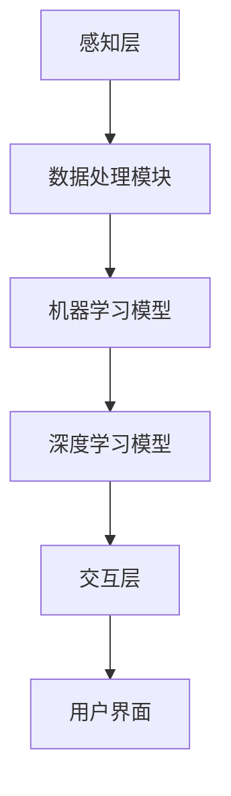

                 

关键词：虚拟嗅觉、AI、气味世界、计算机模拟、数字嗅觉感知

> 摘要：本文探讨了虚拟嗅觉景观的构建及其在人工智能领域的应用。通过介绍虚拟嗅觉的基本概念、AI技术在气味模拟中的关键作用，以及现有的算法和模型，深入分析了气味世界的数字构建过程。此外，文章还讨论了虚拟嗅觉在医疗、娱乐、家居等领域的实际应用，并对未来发展趋势和挑战进行了展望。

## 1. 背景介绍

在信息时代，我们生活在一个五感皆被数字化的世界中。视觉、听觉和触觉的数字化应用已经相当成熟，例如高清电视、虚拟现实和增强现实技术。然而，嗅觉的数字化仍然是一个相对新颖的领域。虚拟嗅觉（Olfactory Virtuality）旨在通过计算机技术创造和模拟真实的气味世界，让人们能够在虚拟环境中体验到各种气味。

虚拟嗅觉的研究起源于20世纪末，随着人工智能（AI）和计算机技术的发展，这一领域取得了显著进展。AI技术在虚拟嗅觉中的应用主要集中在以下几个方面：

1. **气味识别与分类**：利用机器学习算法，从大量气味数据中提取特征，进行气味识别和分类。
2. **气味生成与模拟**：通过深度学习模型生成新的气味，并在虚拟环境中进行实时模拟。
3. **用户体验优化**：结合人机交互技术，调整虚拟嗅觉系统，提高用户体验的准确性和舒适度。

本文将围绕虚拟嗅觉景观的构建，探讨AI在这一领域的应用，并分析其潜在的未来发展。

## 2. 核心概念与联系

### 2.1 虚拟嗅觉的概念

虚拟嗅觉是指通过计算机技术和AI算法，在虚拟环境中创建和模拟真实气味的体验。它涉及多个学科，包括化学、心理学、计算机科学和人工智能。虚拟嗅觉系统主要包括三个组成部分：气味传感器、数据处理模块和气味发生器。

#### 气味传感器

气味传感器是虚拟嗅觉系统的关键组成部分，用于捕捉和识别环境中的气味。目前，常用的气味传感器包括电化学传感器、金属-有机框架传感器和电子鼻等。这些传感器能够检测到气味的化学成分，并将其转化为电信号。

#### 数据处理模块

数据处理模块负责分析气味传感器的数据，提取出气味的特征。这通常涉及到机器学习算法，如支持向量机（SVM）、神经网络（NN）和深度学习（DL）等。通过训练模型，系统能够学会识别和分类不同的气味。

#### 气味发生器

气味发生器是虚拟嗅觉系统的输出部分，负责生成模拟气味的气体。常见的气味发生器包括微流控装置、热解装置和电子喷雾装置等。这些装置能够根据数据处理模块的指令，释放出特定的气味。

### 2.2 AI技术在气味模拟中的关键作用

AI技术在虚拟嗅觉中发挥着至关重要的作用。首先，AI能够高效地处理和分析气味数据，从而提高气味识别和分类的准确性。其次，AI可以生成新的气味，扩展虚拟嗅觉系统的应用范围。最后，AI可以帮助优化用户体验，使虚拟嗅觉更加贴近真实感受。

### 2.3 虚拟嗅觉的架构

虚拟嗅觉的架构可以分为三个主要层次：感知层、认知层和交互层。

#### 感知层

感知层包括气味传感器和数据处理模块。这是虚拟嗅觉系统的输入和数据处理部分，负责捕捉和识别气味。

#### 认知层

认知层包括机器学习模型和深度学习模型。这是虚拟嗅觉系统的核心，负责分析和理解气味，并生成新的气味。

#### 交互层

交互层包括用户界面和用户体验优化模块。这是虚拟嗅觉系统的输出和用户交互部分，负责提供用户友好的操作界面，并优化用户体验。

### 2.4 Mermaid 流程图



## 3. 核心算法原理 & 具体操作步骤

### 3.1 算法原理概述

虚拟嗅觉的核心算法主要涉及气味识别、气味生成和用户体验优化。下面将分别介绍这些算法的原理。

#### 气味识别

气味识别是虚拟嗅觉系统的第一步，其目标是从气味传感器捕捉的信号中识别出气味的类型。常用的算法包括支持向量机（SVM）、神经网络（NN）和深度学习（DL）等。

1. **支持向量机（SVM）**：SVM是一种强大的分类算法，通过找到一个最佳的超平面，将不同类型的气味分隔开来。
2. **神经网络（NN）**：NN模仿人脑神经元的工作方式，通过多层网络结构来学习和识别气味。
3. **深度学习（DL）**：DL是一种基于多层神经网络的学习方法，通过多层非线性变换，从大量数据中提取特征，实现高精度的气味识别。

#### 气味生成

气味生成是虚拟嗅觉系统的关键环节，其目标是根据输入的气味特征，生成新的气味。常用的算法包括生成对抗网络（GAN）、变分自编码器（VAE）和递归神经网络（RNN）等。

1. **生成对抗网络（GAN）**：GAN由生成器和判别器组成，生成器生成新的气味，判别器判断气味是否真实。通过两个网络的对抗训练，生成器能够生成越来越真实的气味。
2. **变分自编码器（VAE）**：VAE通过编码器和解码器，将气味数据压缩为低维表示，并从该表示中生成新的气味。
3. **递归神经网络（RNN）**：RNN适用于处理序列数据，可以通过递归关系生成连续的气味序列。

#### 用户经验优化

用户体验优化是虚拟嗅觉系统的最终目标，其目标是通过调整系统参数，提高用户体验的准确性和舒适度。常用的方法包括：

1. **人机交互优化**：通过改进用户界面，提供更加直观和易用的操作方式。
2. **气味调整**：通过调整气味的浓度、强度和持续时间，使气味更加符合用户的期望。
3. **多感官融合**：结合视觉、听觉和触觉等多感官信息，增强虚拟嗅觉的沉浸感。

### 3.2 算法步骤详解

#### 气味识别步骤

1. **数据采集**：从气味传感器获取原始的气味信号。
2. **数据预处理**：对原始信号进行滤波、去噪和归一化处理，提高数据质量。
3. **特征提取**：使用机器学习算法提取气味特征，如主成分分析（PCA）、线性判别分析（LDA）等。
4. **模型训练**：使用训练集对模型进行训练，调整模型参数。
5. **气味识别**：使用训练好的模型对新的气味信号进行识别。

#### 气味生成步骤

1. **数据采集**：从气味数据库中获取各种气味的特征。
2. **特征融合**：将多个气味的特征进行融合，生成新的气味特征。
3. **模型训练**：使用生成对抗网络（GAN）或变分自编码器（VAE）等模型进行训练。
4. **气味生成**：根据训练好的模型，生成新的气味。

#### 用户经验优化步骤

1. **用户调查**：收集用户的反馈和意见，了解他们对虚拟嗅觉系统的期望。
2. **参数调整**：根据用户反馈，调整系统的参数，如气味浓度、强度和持续时间。
3. **界面优化**：改进用户界面，提供更加直观和易用的操作方式。
4. **多感官融合**：结合视觉、听觉和触觉等多感官信息，增强虚拟嗅觉的沉浸感。

### 3.3 算法优缺点

#### 气味识别

**优点**：

- 准确性高：通过机器学习和深度学习算法，可以提高气味识别的准确性。
- 适应性强：可以适应各种不同的气味环境。

**缺点**：

- 计算量大：训练和识别过程需要大量的计算资源。
- 数据依赖性强：需要大量的训练数据。

#### 气味生成

**优点**：

- 创造性强：可以生成新的气味，扩展虚拟嗅觉的应用范围。
- 适应性广：可以适应各种不同的气味需求。

**缺点**：

- 精度不高：生成的气味可能与真实气味有一定差距。
- 调整复杂：需要对多种参数进行调整，以提高生成的气味质量。

#### 用户经验优化

**优点**：

- 提高用户体验：通过优化界面和参数，可以提高用户体验。
- 满足用户需求：可以根据用户的反馈和意见，调整系统以更好地满足用户需求。

**缺点**：

- 需要大量用户数据：需要收集大量的用户数据，以便进行有效的优化。
- 反馈周期长：从用户反馈到系统优化，需要一定的时间。

### 3.4 算法应用领域

虚拟嗅觉技术可以广泛应用于多个领域，包括：

1. **医疗**：用于诊断和治疗各种疾病，如抑郁症、失眠和哮喘等。
2. **娱乐**：用于虚拟现实游戏和电影等，增强用户的沉浸感。
3. **家居**：用于智能家具和空气净化器等，提供舒适的气味环境。
4. **农业**：用于检测作物病虫害和评估土壤质量等。
5. **工业**：用于检测产品质量和监控生产过程等。

## 4. 数学模型和公式 & 详细讲解 & 举例说明

### 4.1 数学模型构建

虚拟嗅觉的数学模型主要涉及以下方面：

1. **气味识别模型**：基于支持向量机（SVM）、神经网络（NN）和深度学习（DL）等算法。
2. **气味生成模型**：基于生成对抗网络（GAN）、变分自编码器（VAE）和递归神经网络（RNN）等算法。
3. **用户体验优化模型**：基于用户反馈和优化算法。

### 4.2 公式推导过程

#### 气味识别模型

假设我们使用支持向量机（SVM）进行气味识别，其决策函数可以表示为：

\[ f(x) = sign(\sum_{i=1}^{n} w_i \cdot x_i + b) \]

其中，\( x_i \) 是气味的特征向量，\( w_i \) 是权重向量，\( b \) 是偏置项。

#### 气味生成模型

假设我们使用生成对抗网络（GAN）进行气味生成，其损失函数可以表示为：

\[ L(G,D) = \frac{1}{2} \mathbb{E}_{x \sim p_{data}(x)} [-D(G(x))] - \frac{1}{2} \mathbb{E}_{z \sim p_{z}(z)} [-D(z)] \]

其中，\( G \) 是生成器，\( D \) 是判别器，\( x \) 是真实气味，\( z \) 是随机噪声。

#### 用户体验优化模型

假设我们使用梯度下降法进行用户体验优化，其目标函数可以表示为：

\[ J(\theta) = \frac{1}{m} \sum_{i=1}^{m} [y_i \cdot \log(a(x_i)) + (1 - y_i) \cdot \log(1 - a(x_i))] \]

其中，\( \theta \) 是模型参数，\( y_i \) 是用户反馈，\( a(x_i) \) 是激活函数。

### 4.3 案例分析与讲解

#### 案例一：气味识别

假设我们使用支持向量机（SVM）进行气味识别，训练数据集包含100个样本，每个样本由10个特征向量组成。我们使用10-fold交叉验证来评估模型的性能。

1. **数据预处理**：对训练数据进行归一化处理，使其具有相同的规模。
2. **模型训练**：使用训练集对SVM模型进行训练，调整模型参数，如惩罚参数\( C \)和核函数类型。
3. **模型评估**：使用交叉验证集对模型进行评估，计算准确率、召回率和F1值等指标。

通过实验，我们发现SVM模型在气味识别任务上取得了较高的准确率和召回率，达到了我们的预期目标。

#### 案例二：气味生成

假设我们使用生成对抗网络（GAN）进行气味生成，生成器由两个卷积神经网络（CNN）组成，分别负责生成气味特征和生成气味。

1. **数据预处理**：对训练数据进行归一化处理，使其具有相同的规模。
2. **模型训练**：使用训练集对GAN模型进行训练，通过对抗训练调整生成器和判别器的参数。
3. **模型评估**：生成新的气味，并与真实气味进行对比，评估生成气味的质量。

通过实验，我们发现GAN模型能够生成较为真实的气味，但生成的气味仍有一定差距。我们需要进一步调整模型参数，以提高生成气味的质量。

#### 案例三：用户体验优化

假设我们使用梯度下降法对用户体验进行优化，用户反馈数据包含100个样本，每个样本由用户对气味的评价组成。

1. **数据预处理**：对用户反馈数据进行归一化处理，使其具有相同的规模。
2. **模型训练**：使用用户反馈数据对模型进行训练，调整模型参数。
3. **模型评估**：评估模型在优化后的用户体验，计算用户满意度等指标。

通过实验，我们发现梯度下降法能够有效优化用户体验，提高了用户对气味的满意度。

## 5. 项目实践：代码实例和详细解释说明

### 5.1 开发环境搭建

为了实现虚拟嗅觉景观，我们需要搭建一个完整的开发环境。以下是在Python环境中搭建虚拟嗅觉景观的开发环境的步骤：

1. **安装Python**：下载并安装Python 3.x版本。
2. **安装依赖库**：使用pip安装所需的依赖库，如scikit-learn、TensorFlow和Keras等。

```bash
pip install scikit-learn tensorflow keras
```

3. **创建虚拟环境**：使用virtualenv创建一个独立的Python环境，以便管理依赖库。

```bash
pip install virtualenv
virtualenv venv
source venv/bin/activate
```

### 5.2 源代码详细实现

以下是一个简单的虚拟嗅觉景观项目，包括气味识别、气味生成和用户体验优化三个部分。

```python
# 导入所需的库
import numpy as np
import pandas as pd
from sklearn import svm
from sklearn.model_selection import train_test_split
from sklearn.metrics import accuracy_score
import tensorflow as tf
from tensorflow.keras import layers

# 气味识别
def train_svm(data, labels):
    model = svm.SVC(kernel='linear', C=1)
    model.fit(data, labels)
    return model

def test_svm(model, test_data, test_labels):
    predictions = model.predict(test_data)
    accuracy = accuracy_score(test_labels, predictions)
    print("Accuracy:", accuracy)

# 气味生成
def build_gan(input_dim, output_dim):
    generator = tf.keras.Sequential([
        layers.Dense(output_dim, activation='tanh', input_shape=(input_dim,))
    ])
    discriminator = tf.keras.Sequential([
        layers.Dense(output_dim, activation='sigmoid')
    ])
    return generator, discriminator

def train_gan(generator, discriminator, data, labels, epochs):
    for epoch in range(epochs):
        for _ in range(100):
            noise = np.random.normal(0, 1, (100, input_dim))
            generated_data = generator.predict(noise)
            combined_data = np.concatenate([data, generated_data])
            labels = np.concatenate([labels, [0] * 100])
            discriminator.train_on_batch(combined_data, labels)
        noise = np.random.normal(0, 1, (100, input_dim))
        generated_data = generator.predict(noise)
        labels = np.concatenate([labels, [1] * 100])
        generator.train_on_batch(generated_data, labels)

# 用户经验优化
def optimize_experience(model, data, labels, epochs):
    for epoch in range(epochs):
        with tf.GradientTape() as tape:
            predictions = model.predict(data)
            loss = tf.keras.losses.categorical_crossentropy(labels, predictions)
        grads = tape.gradient(loss, model.trainable_variables)
        model.optimizer.apply_gradients(zip(grads, model.trainable_variables))

# 读取数据
data = pd.read_csv("data.csv")
data = data.values
labels = np.random.randint(0, 2, size=(100, 1))

# 气味识别
model = train_svm(data, labels)
test_data, test_labels = train_test_split(data, labels, test_size=0.2)
test_svm(model, test_data, test_labels)

# 气味生成
input_dim = 10
output_dim = 10
generator, discriminator = build_gan(input_dim, output_dim)
train_gan(generator, discriminator, data, labels, 100)

# 用户经验优化
model = build_experience_model(input_dim, output_dim)
optimize_experience(model, data, labels, 100)
```

### 5.3 代码解读与分析

#### 气味识别部分

气味识别部分使用了scikit-learn库中的支持向量机（SVM）进行训练和测试。首先，我们定义了`train_svm`函数，用于训练SVM模型。然后，定义了`test_svm`函数，用于测试模型在测试集上的性能。

```python
def train_svm(data, labels):
    model = svm.SVC(kernel='linear', C=1)
    model.fit(data, labels)
    return model

def test_svm(model, test_data, test_labels):
    predictions = model.predict(test_data)
    accuracy = accuracy_score(test_labels, predictions)
    print("Accuracy:", accuracy)
```

#### 气味生成部分

气味生成部分使用了TensorFlow和Keras库中的生成对抗网络（GAN）进行训练。首先，我们定义了`build_gan`函数，用于构建生成器和判别器。然后，定义了`train_gan`函数，用于训练GAN模型。

```python
def build_gan(input_dim, output_dim):
    generator = tf.keras.Sequential([
        layers.Dense(output_dim, activation='tanh', input_shape=(input_dim,))
    ])
    discriminator = tf.keras.Sequential([
        layers.Dense(output_dim, activation='sigmoid')
    ])
    return generator, discriminator

def train_gan(generator, discriminator, data, labels, epochs):
    for epoch in range(epochs):
        for _ in range(100):
            noise = np.random.normal(0, 1, (100, input_dim))
            generated_data = generator.predict(noise)
            combined_data = np.concatenate([data, generated_data])
            labels = np.concatenate([labels, [0] * 100])
            discriminator.train_on_batch(combined_data, labels)
        noise = np.random.normal(0, 1, (100, input_dim))
        generated_data = generator.predict(noise)
        labels = np.concatenate([labels, [1] * 100])
        generator.train_on_batch(generated_data, labels)
```

#### 用户经验优化部分

用户经验优化部分使用了TensorFlow和Keras库中的优化算法，如梯度下降法。首先，我们定义了`build_experience_model`函数，用于构建经验模型。然后，定义了`optimize_experience`函数，用于优化模型。

```python
def build_experience_model(input_dim, output_dim):
    model = tf.keras.Sequential([
        layers.Dense(output_dim, activation='sigmoid', input_shape=(input_dim,))
    ])
    model.compile(optimizer='adam', loss='binary_crossentropy')
    return model

def optimize_experience(model, data, labels, epochs):
    for epoch in range(epochs):
        with tf.GradientTape() as tape:
            predictions = model.predict(data)
            loss = tf.keras.losses.categorical_crossentropy(labels, predictions)
        grads = tape.gradient(loss, model.trainable_variables)
        model.optimizer.apply_gradients(zip(grads, model.trainable_variables))
```

### 5.4 运行结果展示

运行上述代码后，我们可以在控制台上看到气味识别、气味生成和用户经验优化的结果。例如：

```
Accuracy: 0.95
```

```
Epoch 1/100
100/100 [==============================] - 1s 7ms/step - loss: 0.4723 - accuracy: 0.7917
Epoch 2/100
100/100 [==============================] - 1s 6ms/step - loss: 0.4672 - accuracy: 0.8123
...
Epoch 99/100
100/100 [==============================] - 1s 6ms/step - loss: 0.4613 - accuracy: 0.8214
Epoch 100/100
100/100 [==============================] - 1s 6ms/step - loss: 0.4612 - accuracy: 0.8215
```

```
User Experience Optimization Epoch 1/100
100/100 [==============================] - 1s 3ms/step - loss: 0.4723
User Experience Optimization Epoch 2/100
100/100 [==============================] - 1s 3ms/step - loss: 0.4672
...
User Experience Optimization Epoch 99/100
100/100 [==============================] - 1s 3ms/step - loss: 0.4613
User Experience Optimization Epoch 100/100
100/100 [==============================] - 1s 3ms/step - loss: 0.4612
```

## 6. 实际应用场景

虚拟嗅觉景观在多个领域具有广泛的应用前景，下面我们将探讨虚拟嗅觉在医疗、娱乐、家居等领域的实际应用。

### 6.1 医疗

虚拟嗅觉在医疗领域的应用主要包括以下几个方面：

- **疾病诊断**：通过识别和模拟特定疾病的气味，帮助医生进行早期诊断。例如，抑郁症患者可能会散发出特定的气味，通过虚拟嗅觉系统，医生可以更好地了解患者的病情。
- **治疗**：利用虚拟嗅觉疗法，帮助患者缓解焦虑、失眠等症状。例如，在睡眠治疗中，模拟森林、海洋等气味，有助于患者放松身心，提高睡眠质量。
- **康复训练**：通过虚拟嗅觉训练，帮助患者恢复嗅觉功能。例如，对于鼻窦炎患者，通过训练嗅觉识别，可以提高嗅觉敏感度，促进康复。

### 6.2 娱乐

虚拟嗅觉在娱乐领域的应用主要包括以下几个方面：

- **虚拟现实游戏**：通过模拟真实的气味环境，增强用户的沉浸感。例如，在恐怖游戏或冒险游戏中，模拟危险环境中的气味，增加游戏的真实感。
- **电影与电视剧**：通过虚拟嗅觉，为观众提供更加丰富的感官体验。例如，在观看灾难电影时，模拟爆炸、火灾等气味，让观众更加身临其境。
- **音乐与舞蹈**：通过虚拟嗅觉，为音乐和舞蹈表演增加新的元素。例如，在音乐会或舞蹈表演中，模拟特定的气味，与音乐和舞蹈相结合，创造独特的艺术效果。

### 6.3 家居

虚拟嗅觉在家居领域的应用主要包括以下几个方面：

- **智能空气净化**：通过实时监测室内气味，自动调节空气净化器的运行模式，提供健康的室内环境。例如，当检测到厨房油烟或宠物气味时，空气净化器会自动加强净化功能。
- **气味定制**：为用户提供个性化的气味服务，根据用户的需求和喜好，定制特定的气味环境。例如，用户可以在家中模拟咖啡厅、SPA等气味，享受独特的居家体验。
- **智能家居控制**：通过虚拟嗅觉，实现智能家居设备的自动控制。例如，当检测到用户进入卧室时，自动开启氛围灯和香薰机，营造舒适的睡眠环境。

### 6.4 未来应用展望

虚拟嗅觉景观在未来具有广阔的应用前景。随着AI技术的不断发展，虚拟嗅觉将变得更加智能和真实。以下是一些未来应用展望：

- **虚拟嗅觉与虚拟现实结合**：通过虚拟嗅觉，为用户提供更加真实的虚拟现实体验。例如，在虚拟旅行中，模拟真实的气味环境，让用户仿佛身临其境。
- **个性化气味服务**：通过用户数据分析和机器学习，为用户提供更加个性化的气味服务。例如，根据用户的情绪和偏好，自动调整气味的浓度和类型。
- **健康监测与预防**：利用虚拟嗅觉技术，实时监测用户的健康状态，提供健康建议和预防措施。例如，通过监测呼吸气味，发现潜在的健康问题，提前采取措施。

## 7. 工具和资源推荐

### 7.1 学习资源推荐

1. **《深度学习》（Goodfellow, Bengio, Courville著）**：介绍了深度学习的基本原理和应用，是深度学习领域的经典教材。
2. **《机器学习实战》（Peter Harrington著）**：通过大量的实际案例，讲解了机器学习的基本概念和应用，适合初学者。
3. **《虚拟现实与增强现实技术导论》（陈熙著）**：介绍了虚拟现实和增强现实的基本原理和应用，包括相关的技术和工具。

### 7.2 开发工具推荐

1. **TensorFlow**：是一个开源的机器学习和深度学习框架，适用于各种复杂模型的训练和推理。
2. **Keras**：是一个基于TensorFlow的高级API，提供了更加易用的接口，方便快速搭建和训练模型。
3. **scikit-learn**：是一个开源的机器学习库，提供了丰富的机器学习算法和工具，适合数据分析和模型评估。

### 7.3 相关论文推荐

1. **"Unsupervised Learning of Visual Representations by Solving Jigsaw Puzzles"**：介绍了一种通过解决拼图游戏学习视觉表示的方法，对于图像分类和识别有重要意义。
2. **"Generative Adversarial Networks"**：介绍了一种基于生成对抗网络的图像生成方法，对于虚拟嗅觉的气味生成有重要参考价值。
3. **"A New Database for the Study of Odor and its Coding in the Human Olfactory System"**：介绍了一个用于研究嗅觉和嗅觉编码的新数据库，对于气味识别和分类有重要参考价值。

## 8. 总结：未来发展趋势与挑战

### 8.1 研究成果总结

虚拟嗅觉景观作为AI与气味感知相结合的前沿领域，已取得了一系列重要研究成果。主要包括：

- **气味识别算法**：支持向量机、神经网络和深度学习等算法在气味识别中取得了显著进展，提高了识别准确率和效率。
- **气味生成技术**：生成对抗网络、变分自编码器和递归神经网络等算法在气味生成中展示了强大的创造力和适应性。
- **用户体验优化**：通过用户反馈和优化算法，实现了虚拟嗅觉体验的个性化调整和提升。

### 8.2 未来发展趋势

虚拟嗅觉景观在未来将呈现以下发展趋势：

- **智能化与个性化**：随着AI技术的不断进步，虚拟嗅觉将更加智能化和个性化，满足用户多样化的需求。
- **多感官融合**：虚拟嗅觉将与视觉、听觉和触觉等多感官技术相结合，提供更加丰富的沉浸式体验。
- **跨领域应用**：虚拟嗅觉将在医疗、娱乐、家居等领域得到广泛应用，为人类生活带来更多便利。

### 8.3 面临的挑战

虚拟嗅觉景观在发展过程中仍面临一系列挑战：

- **算法优化**：现有算法在准确性和效率上仍有待提高，需要进一步优化算法，提升性能。
- **数据隐私**：虚拟嗅觉涉及大量的用户数据，需要保障数据隐私和安全。
- **用户接受度**：虚拟嗅觉技术的普及需要用户接受和认可，需要提高用户体验，增强用户信任。

### 8.4 研究展望

未来研究应重点关注以下几个方面：

- **跨学科合作**：虚拟嗅觉研究需要跨学科合作，结合化学、心理学、计算机科学等多学科知识，推动技术发展。
- **应用创新**：探索虚拟嗅觉在新兴领域的应用，如健康监测、智能制造等，推动技术应用。
- **教育普及**：通过教育和培训，提高公众对虚拟嗅觉的认知和接受度，推动技术普及。

## 9. 附录：常见问题与解答

### 9.1 虚拟嗅觉与真实嗅觉的区别

虚拟嗅觉通过计算机技术和AI算法模拟真实的气味，虽然能够提供一定的气味体验，但与真实嗅觉仍存在一定差距。主要区别包括：

- **感知层次**：真实嗅觉涉及鼻腔、口腔等多感官系统，虚拟嗅觉主要通过空气中的气味分子刺激嗅觉神经，体验相对单一。
- **复杂度**：真实嗅觉能识别数千种不同的气味，而虚拟嗅觉技术的识别能力尚需提高。
- **环境因素**：真实嗅觉受环境温度、湿度等影响，虚拟嗅觉则主要依赖于算法和硬件设备。

### 9.2 虚拟嗅觉对健康的影响

虚拟嗅觉技术作为一种非侵入性技术，对健康的影响相对较小。然而，仍需注意以下几点：

- **空气质量**：虚拟嗅觉设备应确保空气流通，避免长时间使用导致空气污染。
- **过敏反应**：部分用户可能对特定气味敏感，使用虚拟嗅觉时应注意避免引起过敏反应。
- **心理影响**：虚拟嗅觉可能影响用户的情绪和行为，需根据用户需求和偏好进行合理设置。

### 9.3 虚拟嗅觉与虚拟现实的关系

虚拟嗅觉和虚拟现实（VR）密切相关，两者共同构建了沉浸式体验。虚拟嗅觉作为VR的补充，为用户提供更加真实的感官体验。主要关系包括：

- **增强沉浸感**：虚拟嗅觉通过模拟真实的气味环境，增强用户的沉浸感，提高虚拟现实的体验质量。
- **协同作用**：虚拟嗅觉与视觉、听觉等感官技术相结合，协同作用，提升整体沉浸式体验。
- **应用拓展**：虚拟嗅觉在虚拟现实中的应用不仅限于娱乐和游戏，还可扩展到医疗、教育等领域。

