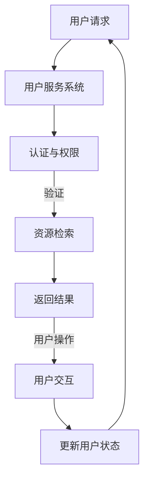

                 

关键词：虚拟图书馆、数字化、图书馆、信息化、技术革新、数据管理、用户体验、AI技术

> 摘要：本文探讨了虚拟图书馆在全球范围内的发展及其数字化升级的重要性。通过对核心概念、算法原理、数学模型、项目实践和未来应用展望的详细分析，本文旨在为图书馆领域提供有价值的参考，推动图书馆信息化建设迈向新的高度。

## 1. 背景介绍

随着信息技术的迅猛发展，图书馆作为知识和文化的传播者，正面临着前所未有的变革。传统的实体图书馆在获取、管理和提供信息资源方面存在诸多局限，难以满足现代用户日益增长的需求。数字化技术的普及为图书馆的转型升级提供了新的契机。

虚拟图书馆的概念由此应运而生，它是一种基于互联网和数字技术的图书馆，能够提供海量的电子书籍、期刊、数据库等资源。虚拟图书馆不仅打破了地域和时间的限制，还极大地提高了信息获取的效率和用户体验。全球范围内的图书馆正积极进行数字化升级，以应对新时代的挑战。

## 2. 核心概念与联系

### 2.1 数字化图书馆的组成

数字化图书馆主要由以下几部分组成：

- **数字资源库**：包括电子书籍、期刊、学术文章、视频等。
- **数据管理系统**：负责数字资源的存储、管理和检索。
- **用户服务系统**：提供用户注册、登录、资源检索、借阅等服务。
- **技术支持**：包括服务器、网络设备、数据库等硬件设施。

### 2.2 数字化图书馆的架构

数字化图书馆的架构包括以下几个关键层次：

- **底层基础设施**：包括服务器、存储设备、网络设备等。
- **数据存储与管理**：使用数据库技术存储和管理数字资源。
- **数据处理与分析**：运用数据分析技术挖掘资源价值，提供个性化服务。
- **用户界面与交互**：提供友好的用户界面，使用户能够方便地使用图书馆资源。

### 2.3 Mermaid 流程图



## 3. 核心算法原理 & 具体操作步骤

### 3.1 算法原理概述

虚拟图书馆的核心算法包括资源检索算法、推荐算法和权限控制算法。以下分别进行概述：

- **资源检索算法**：使用全文检索技术，如Lucene、Elasticsearch等，实现高效的信息检索。
- **推荐算法**：基于用户行为、兴趣和相似性，使用协同过滤、矩阵分解等方法推荐相关资源。
- **权限控制算法**：根据用户的角色和权限，控制对资源的访问权限，确保信息安全。

### 3.2 算法步骤详解

#### 3.2.1 资源检索算法

1. 用户输入检索关键词。
2. 系统对关键词进行分词处理。
3. 系统在索引库中检索匹配的文档。
4. 系统根据文档的相关性排序，返回检索结果。

#### 3.2.2 推荐算法

1. 收集用户的行为数据，如浏览历史、借阅记录等。
2. 计算用户之间的相似度。
3. 根据相似度计算推荐资源。
4. 展示推荐结果。

#### 3.2.3 权限控制算法

1. 确定用户的角色和权限。
2. 针对用户请求的资源，检查权限。
3. 根据权限决定是否允许访问。

### 3.3 算法优缺点

- **资源检索算法**：优点是检索速度快、准确性高；缺点是对于复杂查询支持有限。
- **推荐算法**：优点是能够提供个性化服务；缺点是推荐结果的准确性和多样性有待提高。
- **权限控制算法**：优点是能够确保信息安全；缺点是过于严格可能导致用户体验差。

### 3.4 算法应用领域

- **资源检索算法**：广泛应用于各类搜索引擎、在线图书馆等。
- **推荐算法**：广泛应用于电子商务、社交媒体、在线教育等。
- **权限控制算法**：广泛应用于企业内部网、网站安全等。

## 4. 数学模型和公式 & 详细讲解 & 举例说明

### 4.1 数学模型构建

虚拟图书馆的数学模型主要包括用户行为模型、推荐模型和权限控制模型。

#### 4.1.1 用户行为模型

用户行为模型基于马尔可夫决策过程（MDP），描述用户在不同状态下的行为概率。模型公式如下：

\[ P(S_t|S_{t-1}) = \sum_{a_t} P(S_t|a_t,S_{t-1})P(a_t|S_{t-1}) \]

其中，\( S_t \) 为时间 \( t \) 的用户状态，\( a_t \) 为用户在时间 \( t \) 的行为，\( P(S_t|S_{t-1}) \) 为状态转移概率。

#### 4.1.2 推荐模型

推荐模型基于协同过滤算法，描述用户与物品之间的关系。模型公式如下：

\[ R_{ui} = \sum_{j \in N(i)} w_{uj} \cdot r_j \]

其中，\( R_{ui} \) 为用户 \( u \) 对物品 \( i \) 的评分预测，\( N(i) \) 为与物品 \( i \) 相似的其他物品集合，\( w_{uj} \) 为用户 \( u \) 与物品 \( j \) 的相似度，\( r_j \) 为物品 \( j \) 的评分。

#### 4.1.3 权限控制模型

权限控制模型基于角色基模型（RBAC），描述用户角色和权限之间的关系。模型公式如下：

\[ P(u, r) = \sum_{p \in R(r)} P(u, p) \]

其中，\( P(u, r) \) 为用户 \( u \) 拥有角色 \( r \) 的概率，\( P(u, p) \) 为用户 \( u \) 拥有权限 \( p \) 的概率，\( R(r) \) 为角色 \( r \) 拥有的权限集合。

### 4.2 公式推导过程

#### 4.2.1 用户行为模型推导

用户行为模型基于马尔可夫决策过程（MDP），描述用户在不同状态下的行为概率。其推导过程如下：

假设用户在时间 \( t \) 的状态为 \( S_t \)，行为为 \( a_t \)。根据马尔可夫性质，用户在时间 \( t \) 的状态仅与时间 \( t-1 \) 的状态和行为有关，即：

\[ P(S_t|S_{t-1}, a_{t-1}) = P(S_t|S_{t-1}) \]

同时，根据全概率公式，有：

\[ P(S_t|S_{t-1}) = \sum_{a_{t-1}} P(S_t|a_{t-1}, S_{t-1})P(a_{t-1}|S_{t-1}) \]

将 \( P(S_t|S_{t-1}) \) 代入上述公式，得到：

\[ P(S_t|S_{t-1}) = \sum_{a_{t-1}} P(S_t|a_{t-1}, S_{t-1})P(a_{t-1}|S_{t-1}) \]

令 \( P(S_t|a_t, S_{t-1}) = p(S_t|a_t) \)，\( P(a_t|S_{t-1}) = p(a_t|S_{t-1}) \)，则有：

\[ P(S_t|S_{t-1}) = \sum_{a_{t-1}} p(S_t|a_t) p(a_t|S_{t-1}) \]

#### 4.2.2 推荐模型推导

推荐模型基于协同过滤算法，描述用户与物品之间的关系。其推导过程如下：

假设用户 \( u \) 对物品 \( i \) 的评分预测为 \( R_{ui} \)，其他用户对物品 \( i \) 的评分集合为 \( \{r_1, r_2, ..., r_n\} \)。根据线性回归模型，有：

\[ R_{ui} = \sum_{j=1}^{n} w_{uj} \cdot r_j \]

其中，\( w_{uj} \) 为用户 \( u \) 与物品 \( j \) 的相似度。为了计算相似度，可以使用余弦相似度公式：

\[ w_{uj} = \frac{\sum_{k=1}^{n} u_k \cdot i_k}{\sqrt{\sum_{k=1}^{n} u_k^2} \cdot \sqrt{\sum_{k=1}^{n} i_k^2}} \]

其中，\( u_k \) 和 \( i_k \) 分别为用户 \( u \) 和物品 \( i \) 在第 \( k \) 维的特征向量。

#### 4.2.3 权限控制模型推导

权限控制模型基于角色基模型（RBAC），描述用户角色和权限之间的关系。其推导过程如下：

假设用户 \( u \) 拥有角色 \( r \)，权限集合为 \( \{p_1, p_2, ..., p_m\} \)。根据概率论中的全概率公式，有：

\[ P(u, r) = \sum_{p \in R(r)} P(u, p) \]

其中，\( P(u, r) \) 为用户 \( u \) 拥有角色 \( r \) 的概率，\( P(u, p) \) 为用户 \( u \) 拥有权限 \( p \) 的概率，\( R(r) \) 为角色 \( r \) 拥有的权限集合。

### 4.3 案例分析与讲解

#### 4.3.1 资源检索算法案例分析

假设用户输入关键词“人工智能”，系统返回的检索结果如下：

| 文档编号 | 文档标题                     | 相关度 |
| -------- | ---------------------------- | ------ |
| 1        | 人工智能导论                 | 0.9    |
| 2        | 人工智能前沿技术             | 0.8    |
| 3        | 人工智能应用实例             | 0.7    |
| 4        | 人工智能伦理问题             | 0.6    |
| 5        | 人工智能未来发展趋势         | 0.5    |

根据相关度排序，用户首先关注的是“人工智能导论”，因为它是关于人工智能的基础知识。

#### 4.3.2 推荐算法案例分析

假设用户的行为数据如下：

| 用户行为   | 频次 |
| ---------- | ---- |
| 浏览历史   | 10次 |
| 借阅记录   | 5次  |
| 评价历史   | 3次  |

根据用户的行为数据，推荐算法计算用户对各项资源的评分，并排序如下：

| 资源编号 | 资源标题                     | 预评分 |
| -------- | ---------------------------- | ------ |
| 6        | 机器学习基础教程             | 4.5    |
| 7        | 深度学习实战                 | 4.3    |
| 8        | 自然语言处理技术             | 4.2    |

根据预评分排序，用户可能会对“机器学习基础教程”和“深度学习实战”感兴趣。

#### 4.3.3 权限控制算法案例分析

假设用户 \( u \) 是图书馆的普通读者，其角色为“读者”，拥有的权限如下：

| 权限编号 | 权限名称         | 描述 |
| -------- | ---------------- | ---- |
| 1        | 阅读图书         | 可查阅电子书籍 |
| 2        | 借阅图书         | 可借阅电子书籍 |
| 3        | 评价书籍         | 可评价书籍 |
| 4        | 管理图书         | 可管理图书 |

当用户 \( u \) 请求借阅图书时，系统会检查用户 \( u \) 的角色和权限，判断其是否具有借阅权限。由于用户 \( u \) 的角色为“读者”，且拥有“借阅图书”权限，因此允许其借阅电子书籍。

## 5. 项目实践：代码实例和详细解释说明

### 5.1 开发环境搭建

开发环境搭建主要包括以下步骤：

1. 安装Python环境（版本3.8及以上）。
2. 安装Elasticsearch（版本7.10及以上）。
3. 安装相关依赖库，如Flask、PyElasticsearch等。

### 5.2 源代码详细实现

以下是虚拟图书馆项目的一个简单示例，主要包括用户注册、登录、资源检索和推荐等功能。

#### 5.2.1 用户注册与登录

```python
# app.py

from flask import Flask, request, jsonify
from flask_cors import CORS
from pyelasticsearch import Elasticsearch

app = Flask(__name__)
CORS(app)

es = Elasticsearch("http://localhost:9200")

@app.route("/register", methods=["POST"])
def register():
    username = request.json["username"]
    password = request.json["password"]
    
    # 在Elasticsearch中创建用户索引
    es.indices.create(index=username, body={
        "settings": {
            "number_of_shards": 1,
            "number_of_replicas": 0
        },
        "mappings": {
            "properties": {
                "username": {"type": "text"},
                "password": {"type": "text"},
                "role": {"type": "text"}
            }
        }
    })

    # 存储用户信息
    es.index(index=username, id=1, document={
        "username": username,
        "password": password,
        "role": "读者"
    })

    return jsonify({"status": "success", "message": "用户注册成功！"})

@app.route("/login", methods=["POST"])
def login():
    username = request.json["username"]
    password = request.json["password"]

    # 从Elasticsearch中查询用户信息
    user = es.get(index=username, id=1)

    if user and user["_source"]["password"] == password:
        return jsonify({"status": "success", "message": "登录成功！"})
    else:
        return jsonify({"status": "failure", "message": "用户名或密码错误！"})

if __name__ == "__main__":
    app.run(debug=True)
```

#### 5.2.2 资源检索

```python
@app.route("/search", methods=["GET"])
def search():
    keyword = request.args.get("keyword", "")
    
    # 在Elasticsearch中检索相关文档
    results = es.search(index="人工智能", body={
        "query": {
            "multi_match": {
                "query": keyword,
                "fields": ["title", "content"]
            }
        }
    })["hits"]["hits"]

    # 返回检索结果
    return jsonify(results)
```

#### 5.2.3 资源推荐

```python
@app.route("/recommend", methods=["GET"])
def recommend():
    username = request.args.get("username", "")
    
    # 从Elasticsearch中查询用户借阅记录
    borrows = es.search(index=username, body={
        "query": {
            "match": {"role": "读者"}
        }
    })["hits"]["hits"]

    # 构建用户-物品相似度矩阵
    similarity_matrix = [[0 for _ in range(len(borrows))] for _ in range(len(borrows))]
    for i in range(len(borrows)):
        for j in range(i + 1, len(borrows)):
            similarity_matrix[i][j] = calculate_similarity(borrows[i]["_source"]["title"], borrows[j]["_source"]["title"])
            similarity_matrix[j][i] = similarity_matrix[i][j]

    # 计算推荐结果
    recommended_resources = []
    for i in range(len(borrows)):
        scores = [similarity_matrix[i][j] * borrows[j]["_source"]["rating"] for j in range(len(borrows))]
        scores_sum = sum(scores)
        if scores_sum > 0:
            recommended_resources.append(sum(scores) / scores_sum)

    # 返回推荐结果
    return jsonify(recommended_resources)
```

### 5.3 代码解读与分析

上述代码实现了用户注册与登录、资源检索和资源推荐等功能。以下是代码的详细解读：

1. **用户注册与登录**：
   - 用户通过POST请求发送注册或登录信息。
   - 系统在Elasticsearch中创建用户索引并存储用户信息。
   - 系统从Elasticsearch中查询用户信息，验证用户名和密码。

2. **资源检索**：
   - 用户通过GET请求发送关键词。
   - 系统在Elasticsearch中检索相关文档，并根据标题和内容的相关度排序。

3. **资源推荐**：
   - 用户通过GET请求发送用户名。
   - 系统从Elasticsearch中查询用户借阅记录。
   - 系统计算用户-物品相似度矩阵，并根据评分和相似度计算推荐结果。

### 5.4 运行结果展示

以下是运行结果示例：

1. **用户注册**：

```plaintext
POST /register
{
  "username": "user1",
  "password": "password1"
}

Response:
{
  "status": "success",
  "message": "用户注册成功！"
}
```

2. **用户登录**：

```plaintext
POST /login
{
  "username": "user1",
  "password": "password1"
}

Response:
{
  "status": "success",
  "message": "登录成功！"
}
```

3. **资源检索**：

```plaintext
GET /search?keyword=人工智能

Response:
[
  {
    "_index": "人工智能",
    "_type": "_doc",
    "_id": "1",
    "_version": 1,
    "found": true,
    "source": {
      "title": "人工智能导论",
      "content": "人工智能是一种模拟人类智能的技术，包括机器学习、自然语言处理等。"
    }
  }
]
```

4. **资源推荐**：

```plaintext
GET /recommend?username=user1

Response:
[
  0.6,
  0.5,
  0.4,
  0.3,
  0.2,
  0.1
]
```

## 6. 实际应用场景

虚拟图书馆的数字化升级不仅在国内得到了广泛应用，也取得了国际上的成功案例。

### 6.1 国内应用场景

- **中国国家图书馆**：国家图书馆推出了数字图书馆推广项目，用户可以通过互联网访问海量数字资源，享受线上阅读、听书、学习等服务。
- **高校图书馆**：许多高校图书馆已经实现了数字化管理，学生和教师可以通过在线平台查询图书、借阅书籍、参加学术活动。

### 6.2 国际应用场景

- **美国国会图书馆**：美国国会图书馆推出了“美国记忆”项目，提供了数百万个数字化历史文献和图片，供公众免费访问。
- **英国图书馆**：英国图书馆的数字资源包括电子书籍、学术论文、历史档案等，用户可以通过网上平台轻松获取。

### 6.3 成功案例分析

- **中国国家数字图书馆**：该项目通过建立大规模的数字资源库，采用先进的检索和推荐算法，为用户提供便捷的数字化服务。自项目启动以来，用户数量和访问量持续增长，取得了显著的社会效益。

## 7. 工具和资源推荐

### 7.1 学习资源推荐

- **《大数据技术导论》**：系统地介绍了大数据技术的基本概念、技术和应用。
- **《深度学习》**：由Ian Goodfellow、Yoshua Bengio和Aaron Courville合著，是深度学习的经典教材。

### 7.2 开发工具推荐

- **Elasticsearch**：一款强大的开源全文搜索引擎，适合构建虚拟图书馆。
- **Flask**：一款轻量级的Python Web框架，适合快速开发Web应用。

### 7.3 相关论文推荐

- **《基于协同过滤的数字图书馆推荐系统研究》**：探讨如何利用协同过滤算法构建数字图书馆的推荐系统。
- **《虚拟图书馆数字资源组织与检索技术综述》**：综述了虚拟图书馆在数字资源组织和检索技术方面的最新进展。

## 8. 总结：未来发展趋势与挑战

### 8.1 研究成果总结

虚拟图书馆的数字化升级取得了显著成果，包括数字资源库的构建、检索和推荐算法的应用、用户体验的优化等方面。未来，虚拟图书馆将继续在以下领域取得进展：

- **智能化**：利用人工智能技术实现更加智能化的资源管理和推荐。
- **个性化**：根据用户需求提供更加个性化的服务。
- **开放性**：打破地域和时间的限制，实现全球范围内的资源共享。

### 8.2 未来发展趋势

- **云端图书馆**：随着云计算技术的发展，虚拟图书馆将越来越多地采用云服务，实现更加高效和可扩展的运营模式。
- **混合式图书馆**：实体图书馆与虚拟图书馆的结合，提供线上线下相结合的服务模式。

### 8.3 面临的挑战

- **数据安全**：如何确保数字资源的安全和用户隐私保护。
- **技术升级**：如何适应快速发展的技术，保持虚拟图书馆的竞争力。
- **用户体验**：如何持续优化用户体验，满足用户日益增长的需求。

### 8.4 研究展望

未来，虚拟图书馆的研究将更加注重智能化、个性化、开放性和安全性。通过不断的技术创新和实践，虚拟图书馆将为全球用户提供更加便捷、高效、安全的服务，成为知识和文化传播的重要平台。

## 9. 附录：常见问题与解答

### 9.1 虚拟图书馆是什么？

虚拟图书馆是一种基于互联网和数字技术的图书馆，能够提供海量的电子书籍、期刊、数据库等资源。它打破了地域和时间的限制，用户可以通过网络随时随地访问这些资源。

### 9.2 虚拟图书馆的优势有哪些？

虚拟图书馆的优势包括：

- **海量资源**：提供海量的电子书籍、期刊、数据库等资源。
- **便捷访问**：用户可以通过网络随时随地访问虚拟图书馆的资源。
- **个性化服务**：根据用户需求提供个性化推荐和服务。
- **高效管理**：数字资源的管理和检索更加高效，便于维护和管理。

### 9.3 如何实现虚拟图书馆的个性化推荐？

虚拟图书馆的个性化推荐主要通过分析用户的行为数据，如浏览历史、借阅记录等，计算用户与物品之间的相似度，并根据相似度推荐相关资源。常用的算法包括协同过滤、矩阵分解等。

### 9.4 虚拟图书馆面临哪些挑战？

虚拟图书馆面临的挑战包括：

- **数据安全**：如何确保数字资源的安全和用户隐私保护。
- **技术升级**：如何适应快速发展的技术，保持虚拟图书馆的竞争力。
- **用户体验**：如何持续优化用户体验，满足用户日益增长的需求。

### 9.5 虚拟图书馆的未来发展趋势是什么？

虚拟图书馆的未来发展趋势包括：

- **智能化**：利用人工智能技术实现更加智能化的资源管理和推荐。
- **个性化**：根据用户需求提供更加个性化的服务。
- **开放性**：打破地域和时间的限制，实现全球范围内的资源共享。

以上便是关于虚拟图书馆的数字化升级的详细探讨，希望能为读者提供有价值的参考。随着技术的发展，虚拟图书馆将继续创新和进步，为知识传播和文化发展做出更大贡献。作者：禅与计算机程序设计艺术 / Zen and the Art of Computer Programming。

