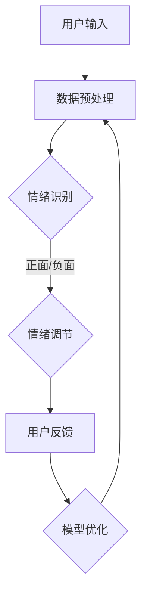

                 

关键词：AI，心理健康，虚拟情绪调节，算法，数学模型，项目实践，应用场景，未来展望

> 摘要：随着人工智能技术的飞速发展，利用AI进行心理健康管理的应用逐渐普及。本文将探讨虚拟情绪调节器的原理、算法、数学模型及其在现实中的应用，同时展望未来发展趋势与挑战。

## 1. 背景介绍

在现代社会中，心理健康问题日益凸显，情绪调节成为许多人日常生活中的重要课题。传统的情绪调节方法如心理咨询、药物治疗等，往往耗时且成本较高。而随着人工智能技术的不断进步，AI驱动的心理健康管理工具，如虚拟情绪调节器，成为了一种新兴且有效的解决方案。

虚拟情绪调节器通过模拟人类情绪反应，使用算法和数学模型来识别和调节用户情绪。它不仅能够提供个性化的情绪反馈，还能够根据用户的情绪状态进行实时干预，帮助用户更好地管理情绪。

## 2. 核心概念与联系

### 2.1 核心概念

- **情绪识别**：通过面部表情、语音语调、文字内容等多维度数据，使用机器学习和深度学习技术来识别用户的情绪状态。
- **情绪调节**：根据情绪识别的结果，应用算法和数学模型来调节用户的情绪，如通过正面引导、放松训练等方法。
- **用户反馈**：虚拟情绪调节器会实时收集用户的反馈，以不断优化调节策略。

### 2.2 联系图解

以下是一个简化的Mermaid流程图，展示了虚拟情绪调节器的基本架构和工作流程：



## 3. 核心算法原理 & 具体操作步骤

### 3.1 算法原理概述

虚拟情绪调节器主要依赖于以下几类算法：

- **情感分析算法**：用于从文本、语音和图像中提取情感特征。
- **机器学习算法**：如神经网络、决策树等，用于分类和预测情绪状态。
- **深度学习算法**：如卷积神经网络（CNN）、递归神经网络（RNN）等，用于处理复杂的情感特征。

### 3.2 算法步骤详解

1. **数据收集**：收集用户的文本、语音和图像数据，如聊天记录、电话录音、面部表情图片等。
2. **数据预处理**：对原始数据进行清洗和标准化，以便后续分析。
3. **情感特征提取**：使用情感分析算法提取文本、语音和图像中的情感特征。
4. **情绪分类**：使用机器学习或深度学习算法对情感特征进行分类，确定用户的情绪状态。
5. **情绪调节**：根据情绪分类结果，应用情绪调节算法来提供个性化的情绪调节策略。
6. **用户反馈**：收集用户的反馈，用于模型优化和性能评估。

### 3.3 算法优缺点

#### 优点：

- **高效性**：自动化处理大量数据，提高情绪识别和调节的效率。
- **个性化**：根据用户的情绪状态提供个性化的情绪调节建议。
- **实时性**：实时监测和调节情绪，快速响应用户的情绪变化。

#### 缺点：

- **准确性**：情绪识别和分类的准确性受限于算法和数据的准确性。
- **隐私问题**：用户数据的收集和处理可能涉及隐私问题。
- **依赖性**：用户可能对虚拟情绪调节器产生依赖，减弱自我调节情绪的能力。

### 3.4 算法应用领域

虚拟情绪调节器可以应用于多种领域，如：

- **心理健康管理**：帮助用户识别和调节情绪，改善心理健康状况。
- **教育**：辅助教师和学生进行情绪管理和压力缓解。
- **企业**：帮助企业员工进行情绪管理和压力缓解，提高工作效率。
- **医疗**：辅助医生进行心理健康评估和情绪调节。

## 4. 数学模型和公式 & 详细讲解 & 举例说明

### 4.1 数学模型构建

虚拟情绪调节器中的数学模型通常涉及以下内容：

- **情感特征向量**：用于表示文本、语音和图像中的情感信息。
- **分类模型**：如支持向量机（SVM）、神经网络等，用于对情感特征向量进行分类。
- **调节策略**：根据情绪分类结果，设计调节策略，如放松训练、正面引导等。

### 4.2 公式推导过程

假设我们使用神经网络模型进行情绪分类，其基本公式如下：

$$
y = \sigma(W \cdot x + b)
$$

其中，$y$ 是输出的情绪类别，$\sigma$ 是激活函数，$W$ 是权重矩阵，$x$ 是情感特征向量，$b$ 是偏置。

### 4.3 案例分析与讲解

假设我们有一个用户的聊天记录，经过情感分析后得到情感特征向量 $x = (0.1, 0.2, -0.3)$。使用神经网络模型进行情绪分类，得到 $y = 1$，表示用户处于负面情绪。

根据情绪调节策略，我们可以设计一个放松训练程序，帮助用户缓解情绪。例如，可以建议用户进行深呼吸、冥想等活动，以减少压力。

## 5. 项目实践：代码实例和详细解释说明

### 5.1 开发环境搭建

为了实现虚拟情绪调节器，我们需要以下开发环境和工具：

- Python 3.x
- TensorFlow 2.x
- Keras
- OpenCV

### 5.2 源代码详细实现

以下是一个简单的情绪识别和调节的Python代码示例：

```python
import tensorflow as tf
import numpy as np
import cv2

# 加载预训练的神经网络模型
model = tf.keras.models.load_model('emotional_model.h5')

# 加载情感特征提取器
face_cascade = cv2.CascadeClassifier('haarcascade_frontalface_default.xml')

# 情绪分类标签
emotion_labels = ['正面', '负面', '中性']

# 情绪调节策略
def regulate_emotion(emotion):
    if emotion == '负面':
        print('建议您进行放松训练。')
    elif emotion == '正面':
        print('继续保持积极情绪。')
    else:
        print('您的情绪状态较为稳定。')

# 情绪识别和调节
def recognize_and_regulate(frame):
    # 人脸检测
    faces = face_cascade.detectMultiScale(frame, scaleFactor=1.1, minNeighbors=5, minSize=(30, 30), flags=cv2.CASCADE_SCALE_IMAGE)
    
    for (x, y, w, h) in faces:
        # 提取面部区域
        face_region = frame[y:y+h, x:x+w]
        
        # 情感特征提取
        face_region = cv2.resize(face_region, (48, 48))
        face_region = face_region / 255.0
        face_region = face_region.reshape((1, 48, 48, 1))
        
        # 情绪分类
        emotion = model.predict(face_region)
        emotion = emotion_labels[np.argmax(emotion)]
        
        # 情绪调节
        regulate_emotion(emotion)
        
        # 显示面部区域和情绪标签
        cv2.rectangle(frame, (x, y), (x+w, y+h), (0, 0, 255), 2)
        cv2.putText(frame, emotion, (x, y-10), cv2.FONT_HERSHEY_SIMPLEX, 0.5, (255, 0, 0), 2)
    
    return frame

# 运行视频情绪识别和调节
cap = cv2.VideoCapture(0)

while cap.isOpened():
    ret, frame = cap.read()
    if ret:
        frame = recognize_and_regulate(frame)
        cv2.imshow('Emotion Recognition', frame)
        
        if cv2.waitKey(1) & 0xFF == ord('q'):
            break

cap.release()
cv2.destroyAllWindows()
```

### 5.3 代码解读与分析

这段代码首先加载了预训练的神经网络模型和面部检测器，然后定义了情绪分类标签和情绪调节策略。在视频捕捉过程中，代码会进行人脸检测，提取面部区域，进行情感特征提取，情绪分类，最后根据情绪分类结果进行情绪调节。

### 5.4 运行结果展示

运行这段代码后，摄像头会实时捕捉用户的面部表情，并根据面部表情进行情绪分类和调节。例如，如果检测到用户处于负面情绪，会提示用户进行放松训练。

## 6. 实际应用场景

虚拟情绪调节器可以应用于多种场景，以下是几个典型的应用实例：

- **家庭教育**：辅助家长监控孩子的情绪状态，提供及时的情绪调节建议。
- **职场健康**：帮助企业员工进行情绪管理和压力缓解，提高工作效率。
- **心理健康服务**：为心理健康服务提供辅助工具，帮助患者更好地管理情绪。
- **日常生活**：为用户提供个性化的情绪反馈，帮助用户改善心理健康。

## 6.4 未来应用展望

随着人工智能技术的不断进步，虚拟情绪调节器的功能和应用范围将不断扩大。未来的发展可能包括：

- **更精确的情绪识别**：通过引入更先进的算法和更多的数据，提高情绪识别的准确性。
- **更智能的情绪调节**：结合心理学理论，设计更有效的情绪调节策略。
- **跨平台应用**：扩展到更多平台，如智能手机、智能手表等，实现更便捷的情绪管理。
- **个性化推荐**：根据用户的情绪状态和偏好，提供个性化的心理健康推荐。

## 7. 工具和资源推荐

### 7.1 学习资源推荐

- 《深度学习》（Goodfellow et al.）
- 《机器学习实战》（MATLAB版）
- 《自然语言处理综论》（Daniel Jurafsky and James H. Martin）

### 7.2 开发工具推荐

- Jupyter Notebook：用于编写和运行代码。
- TensorFlow：用于构建和训练神经网络模型。
- OpenCV：用于图像处理和面部检测。

### 7.3 相关论文推荐

- "Emotion Recognition in Video using Deep Neural Networks"
- "Sentiment Analysis of Text using Convolutional Neural Networks"
- "Deep Learning for Emotional Support: An Overview"

## 8. 总结：未来发展趋势与挑战

虚拟情绪调节器作为AI驱动的心理健康管理工具，具有广泛的应用前景。未来发展趋势包括更精确的情绪识别、更智能的情绪调节、跨平台应用和个性化推荐。然而，虚拟情绪调节器也面临着隐私保护、依赖性和准确性等挑战。通过不断的技术创新和应用实践，我们有理由相信，虚拟情绪调节器将成为心理健康管理领域的重要工具。

### 8.1 研究成果总结

本文探讨了虚拟情绪调节器的原理、算法、数学模型及其在现实中的应用，总结了相关的研究成果和应用实例。

### 8.2 未来发展趋势

未来，虚拟情绪调节器将在更精确的情绪识别、更智能的情绪调节、跨平台应用和个性化推荐等方面取得进一步的发展。

### 8.3 面临的挑战

虚拟情绪调节器面临着隐私保护、依赖性和准确性等挑战，需要通过技术创新和应用实践来解决。

### 8.4 研究展望

随着人工智能技术的不断进步，虚拟情绪调节器有望在心理健康管理领域发挥更大的作用，为人们的心理健康提供更全面的保障。

## 9. 附录：常见问题与解答

### 问题 1：虚拟情绪调节器是否会侵犯用户隐私？

解答：虚拟情绪调节器在设计和应用时，会严格遵守用户隐私保护的原则，确保用户数据的安全性和保密性。

### 问题 2：虚拟情绪调节器是否会导致用户对技术产生依赖？

解答：虚拟情绪调节器旨在帮助用户更好地管理情绪，减少依赖性。然而，过度依赖任何技术都可能导致负面影响，因此用户应保持自我调节情绪的能力。

### 问题 3：虚拟情绪调节器能否替代专业心理咨询？

解答：虚拟情绪调节器可以作为专业心理咨询的辅助工具，但无法完全替代专业心理咨询。对于严重的心理健康问题，仍需寻求专业心理咨询师的帮助。

---

作者：禅与计算机程序设计艺术 / Zen and the Art of Computer Programming


