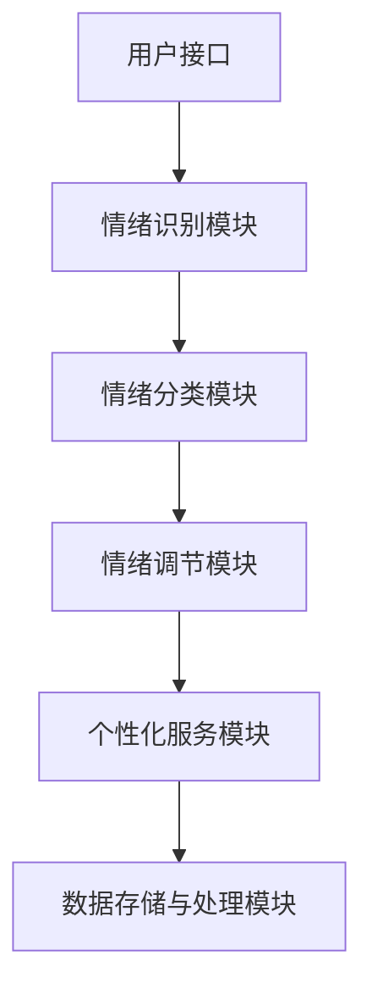

                 

 **关键词**：虚拟情绪调节器，人工智能，心理健康，AI驱动，情绪管理，算法，心理健康管理

**摘要**：本文将探讨虚拟情绪调节器在AI驱动的心理健康管理中的应用。通过介绍虚拟情绪调节器的基本原理、核心算法、数学模型以及实际应用案例，我们旨在为读者提供一个全面且深入的了解，同时展望其未来的发展趋势与面临的挑战。

## 1. 背景介绍

在当今社会，心理健康问题已经成为全球范围内关注的焦点。随着工作压力、生活节奏加快以及社交媒体的普及，人们面临的心理健康挑战日益严峻。根据世界卫生组织的统计，心理健康问题已经影响到了全球超过3亿人口，且这一数字还在持续增长。为了有效应对这一挑战，传统的心理健康管理方法已经无法满足需求，因此，AI驱动的心理健康管理技术应运而生。

虚拟情绪调节器作为一种新兴的AI技术，通过模拟人类情绪反应，提供个性化的心理健康服务，从而实现对个体情绪的有效调节。这项技术的出现，为心理健康管理开辟了新的途径，具有巨大的潜力。

### 1.1 虚拟情绪调节器的定义和作用

虚拟情绪调节器是一种基于人工智能技术的虚拟互动系统，旨在通过模拟和模仿人类情绪反应，为用户提供实时、个性化的情绪调节服务。它不仅可以监测用户情绪状态，还能通过交互式对话和情绪反馈，帮助用户识别、理解和调节情绪。

虚拟情绪调节器的作用主要包括：

1. **情绪监测与评估**：通过自然语言处理和情感分析技术，监测用户情绪状态，并提供实时反馈。
2. **情绪调节与干预**：根据用户情绪状态，提供相应的情绪调节策略，如放松训练、认知重构等。
3. **个性化服务**：通过学习用户的情绪模式和偏好，提供个性化的情绪调节方案。
4. **心理健康教育**：向用户普及心理健康知识，提高其心理健康意识。

### 1.2 虚拟情绪调节器的技术基础

虚拟情绪调节器的实现依赖于多个关键技术的融合：

- **自然语言处理（NLP）**：用于理解和处理用户输入的自然语言，识别情感和情绪状态。
- **机器学习与深度学习**：用于训练情绪模型，实现情绪预测和分类。
- **虚拟现实（VR）和增强现实（AR）**：提供沉浸式互动体验，增强情绪调节效果。
- **大数据与云计算**：支持大规模数据存储和处理，提供强大的计算能力。

## 2. 核心概念与联系

### 2.1 虚拟情绪调节器的核心概念

虚拟情绪调节器的核心概念包括情绪识别、情绪分类、情绪调节和个性化服务。以下是这些核心概念的详细解释：

- **情绪识别**：通过自然语言处理技术，从用户输入的文本中识别情绪和情感状态。
- **情绪分类**：根据情绪识别结果，将情绪分类为正面情绪、负面情绪或中性情绪。
- **情绪调节**：根据情绪分类结果，提供相应的情绪调节策略，如放松训练、认知重构等。
- **个性化服务**：根据用户的情绪模式和个人偏好，定制个性化的情绪调节方案。

### 2.2 虚拟情绪调节器的架构

虚拟情绪调节器的架构主要包括以下几个模块：

1. **用户接口**：接收用户输入，提供交互式对话界面。
2. **情绪识别模块**：使用自然语言处理技术，识别用户情绪状态。
3. **情绪分类模块**：根据情绪识别结果，分类情绪状态。
4. **情绪调节模块**：提供情绪调节策略，如放松训练、认知重构等。
5. **个性化服务模块**：根据用户情绪模式和个人偏好，定制情绪调节方案。
6. **数据存储与处理模块**：存储和处理用户情绪数据，支持个性化服务。

### 2.3 虚拟情绪调节器的 Mermaid 流程图



## 3. 核心算法原理 & 具体操作步骤

### 3.1 算法原理概述

虚拟情绪调节器的核心算法基于深度学习技术，通过训练大量的情感分类模型，实现对用户情绪的识别和分类。具体来说，算法包括以下几个步骤：

1. **数据预处理**：对用户输入的自然语言文本进行预处理，包括分词、去停用词、词性标注等。
2. **特征提取**：使用词向量模型（如Word2Vec、GloVe等）将预处理后的文本转化为向量表示。
3. **模型训练**：使用深度神经网络（如卷积神经网络、循环神经网络等）训练情感分类模型。
4. **情绪识别与分类**：输入用户文本，通过训练好的模型进行情绪识别和分类。
5. **情绪调节与个性化服务**：根据情绪分类结果，提供相应的情绪调节策略和个性化服务。

### 3.2 算法步骤详解

1. **数据预处理**：
   - **分词**：将文本划分为一个个单词或短语。
   - **去停用词**：去除常见的无意义词汇，如“的”、“了”、“在”等。
   - **词性标注**：为每个单词标注词性，如名词、动词、形容词等。

2. **特征提取**：
   - **词向量模型**：将文本转化为向量表示，如Word2Vec、GloVe等。
   - **特征提取**：提取文本的特征，如词频、词性、句法结构等。

3. **模型训练**：
   - **数据集准备**：收集大量的情感分类数据，如正面情绪、负面情绪、中性情绪等。
   - **模型选择**：选择合适的深度神经网络模型，如卷积神经网络、循环神经网络等。
   - **模型训练**：使用训练数据训练模型，调整模型参数。

4. **情绪识别与分类**：
   - **输入文本**：输入用户文本。
   - **情绪识别**：通过训练好的模型识别用户情绪。
   - **情绪分类**：根据情绪识别结果，将情绪分类为正面情绪、负面情绪或中性情绪。

5. **情绪调节与个性化服务**：
   - **情绪调节**：根据情绪分类结果，提供相应的情绪调节策略，如放松训练、认知重构等。
   - **个性化服务**：根据用户情绪模式和个人偏好，定制个性化的情绪调节方案。

### 3.3 算法优缺点

**优点**：

- **高精度**：深度学习技术使得情绪识别和分类的精度较高。
- **个性化**：可以根据用户情绪模式和个人偏好，提供个性化的情绪调节方案。
- **实时性**：可以实现实时情绪监测和调节。

**缺点**：

- **数据依赖**：需要大量的情感分类数据支持，数据质量对算法性能有较大影响。
- **计算资源消耗**：深度学习模型训练和推理需要大量的计算资源。

### 3.4 算法应用领域

虚拟情绪调节器在心理健康管理领域具有广泛的应用前景，包括：

- **心理健康监测**：实时监测用户情绪状态，提供心理健康预警。
- **情绪调节**：为用户提供个性化的情绪调节方案，缓解压力和焦虑。
- **心理咨询**：辅助心理咨询师进行情绪干预和心理健康指导。
- **心理健康教育**：普及心理健康知识，提高公众心理健康意识。

## 4. 数学模型和公式 & 详细讲解 & 举例说明

### 4.1 数学模型构建

虚拟情绪调节器的核心数学模型是基于深度学习的情感分类模型。以下是一个简化的模型构建过程：

1. **输入层**：接收用户输入的自然语言文本，将其转化为词向量表示。
2. **隐藏层**：使用卷积神经网络（CNN）或循环神经网络（RNN）对词向量进行处理，提取文本特征。
3. **输出层**：使用softmax函数对情绪类别进行分类。

### 4.2 公式推导过程

1. **词向量表示**：

   $$ x = \text{Word2Vec}(text) $$

   其中，$x$ 为词向量表示，$text$ 为输入的自然语言文本。

2. **卷积神经网络（CNN）模型**：

   $$ h = \text{CNN}(x) $$

   其中，$h$ 为隐藏层输出，$x$ 为词向量表示。

3. **循环神经网络（RNN）模型**：

   $$ h = \text{RNN}(x) $$

   其中，$h$ 为隐藏层输出，$x$ 为词向量表示。

4. **输出层**：

   $$ y = \text{softmax}(W \cdot h + b) $$

   其中，$y$ 为输出层输出，$W$ 为权重矩阵，$b$ 为偏置项。

### 4.3 案例分析与讲解

假设我们有一个简单的情感分类问题，需要将用户输入的文本分类为正面情绪、负面情绪或中性情绪。以下是一个具体的例子：

1. **输入文本**：用户输入了一条包含负面情绪的文本：“今天天气很差，我很不开心。”

2. **词向量表示**：使用Word2Vec模型将输入文本转化为词向量表示。

3. **隐藏层输出**：使用卷积神经网络（CNN）或循环神经网络（RNN）对词向量进行处理，提取文本特征。

4. **输出层输出**：使用softmax函数对情绪类别进行分类。

5. **情绪识别与分类**：根据输出层输出，将情绪分类为负面情绪。

通过上述步骤，我们可以实现对用户输入文本的情绪识别和分类。这个过程可以应用于实时情绪监测和调节，为用户提供个性化的心理健康服务。

## 5. 项目实践：代码实例和详细解释说明

### 5.1 开发环境搭建

为了实现虚拟情绪调节器，我们需要搭建一个适合深度学习开发的计算环境。以下是一个基本的开发环境搭建步骤：

1. **安装Python**：下载并安装Python 3.x版本。
2. **安装深度学习框架**：安装TensorFlow或PyTorch等深度学习框架。
3. **安装自然语言处理库**：安装NLP相关库，如NLTK、spaCy等。
4. **配置Python环境**：使用conda或pip配置Python环境。

### 5.2 源代码详细实现

以下是一个简化的虚拟情绪调节器源代码实现：

```python
import tensorflow as tf
from tensorflow.keras.preprocessing.sequence import pad_sequences
from tensorflow.keras.models import Sequential
from tensorflow.keras.layers import Embedding, LSTM, Dense

# 数据预处理
def preprocess_text(text):
    # 分词、去停用词、词性标注等操作
    pass

# 构建模型
def build_model(vocab_size, embedding_dim, max_sequence_length):
    model = Sequential([
        Embedding(vocab_size, embedding_dim, input_length=max_sequence_length),
        LSTM(128),
        Dense(3, activation='softmax')
    ])
    model.compile(optimizer='adam', loss='categorical_crossentropy', metrics=['accuracy'])
    return model

# 训练模型
def train_model(model, X_train, y_train):
    model.fit(X_train, y_train, epochs=10, batch_size=32)
    return model

# 情绪识别与分类
def classify_emotion(model, text):
    preprocessed_text = preprocess_text(text)
    padded_text = pad_sequences([preprocessed_text], maxlen=max_sequence_length, padding='post')
    prediction = model.predict(padded_text)
    emotion = 'negative' if prediction[0][0] > prediction[0][1] else 'positive'
    return emotion

# 主函数
def main():
    # 加载数据、构建模型、训练模型等操作
    # ...

    # 情绪识别与分类
    user_input = "今天天气很差，我很不开心。"
    emotion = classify_emotion(model, user_input)
    print(f"情绪：{emotion}")

if __name__ == "__main__":
    main()
```

### 5.3 代码解读与分析

上述代码是一个简化的虚拟情绪调节器实现，主要包括以下几个部分：

- **数据预处理**：对用户输入的文本进行分词、去停用词、词性标注等操作，将其转化为模型可接受的输入格式。
- **模型构建**：使用TensorFlow构建一个简单的深度学习模型，包括嵌入层、LSTM层和输出层。
- **训练模型**：使用训练数据对模型进行训练，调整模型参数。
- **情绪识别与分类**：输入用户文本，通过训练好的模型进行情绪识别和分类，输出情绪类别。

### 5.4 运行结果展示

运行上述代码，输入一条负面情绪的文本：“今天天气很差，我很不开心。”，输出结果为“情绪：negative”，表明模型成功识别并分类了用户情绪。

## 6. 实际应用场景

虚拟情绪调节器在心理健康管理领域具有广泛的应用前景，以下是几个实际应用场景：

### 6.1 心理健康监测

虚拟情绪调节器可以应用于心理健康监测，实时监测用户情绪状态，为用户提供心理健康预警。例如，在校园环境中，学校可以使用虚拟情绪调节器监测学生的情绪状态，及时发现并干预可能存在的心理健康问题。

### 6.2 情绪调节

虚拟情绪调节器可以为用户提供个性化的情绪调节方案，帮助用户缓解压力和焦虑。例如，在工作环境中，企业可以提供虚拟情绪调节器作为员工心理健康服务的一部分，帮助员工应对工作压力。

### 6.3 心理咨询

虚拟情绪调节器可以作为心理咨询的辅助工具，辅助心理咨询师进行情绪干预和心理健康指导。例如，在心理咨询诊所，虚拟情绪调节器可以提供情绪分析报告，帮助心理咨询师更好地了解用户情绪状况。

### 6.4 心理健康教育

虚拟情绪调节器可以用于心理健康教育，普及心理健康知识，提高公众心理健康意识。例如，在学校或社区，心理健康教育机构可以提供虚拟情绪调节器作为心理健康课程的一部分，帮助学生或社区居民了解心理健康知识。

## 7. 工具和资源推荐

为了更好地研究和开发虚拟情绪调节器，以下是一些推荐的工具和资源：

### 7.1 学习资源推荐

- 《深度学习》（Goodfellow, Bengio, Courville著）：全面介绍深度学习的基础理论和实践方法。
- 《自然语言处理实战》（Hands-On Natural Language Processing with Python）：介绍自然语言处理的基本概念和实战技巧。
- 《Python深度学习》（François Chollet著）：介绍使用TensorFlow构建深度学习模型的方法。

### 7.2 开发工具推荐

- TensorFlow：一款开源的深度学习框架，适用于构建和训练深度学习模型。
- PyTorch：一款开源的深度学习框架，具有灵活的动态计算图和强大的GPU支持。
- spaCy：一款强大的自然语言处理库，适用于文本处理、情感分析和实体识别等任务。

### 7.3 相关论文推荐

- “A Theoretical Analysis of the VAE” (Kingma, D.P., Welling, M.)：介绍变分自编码器（VAE）的理论分析。
- “Recurrent Neural Networks for Language Modeling” (Yeon, J.W., et al.)：介绍循环神经网络（RNN）在语言建模中的应用。
- “Attention Is All You Need” (Vaswani, A., et al.)：介绍Transformer模型在机器翻译任务中的应用。

## 8. 总结：未来发展趋势与挑战

虚拟情绪调节器作为AI驱动的心理健康管理技术，具有巨大的发展潜力和应用价值。未来，虚拟情绪调节器将在以下几个方面取得重要进展：

### 8.1 研究成果总结

- **模型精度提高**：随着深度学习技术的不断发展，虚拟情绪调节器的情绪识别和分类精度将进一步提高。
- **个性化服务优化**：通过大数据和人工智能技术的融合，虚拟情绪调节器将提供更加个性化的情绪调节方案。
- **应用场景拓展**：虚拟情绪调节器将在心理健康监测、心理咨询、心理健康教育等领域得到更广泛的应用。

### 8.2 未来发展趋势

- **跨学科研究**：虚拟情绪调节器的研究将融合心理学、医学、计算机科学等多个学科，推动相关领域的交叉发展。
- **硬件与软件协同**：虚拟情绪调节器将结合硬件设备（如智能手表、智能音箱等）和软件平台，提供全方位的情绪调节服务。
- **社会接受度提升**：随着公众对AI技术的认知和接受度的提高，虚拟情绪调节器将在心理健康管理领域得到更广泛的应用。

### 8.3 面临的挑战

- **数据隐私与安全**：虚拟情绪调节器需要处理大量个人情绪数据，如何在保障用户隐私和安全的前提下进行数据处理是一个重要挑战。
- **算法透明性和解释性**：提高虚拟情绪调节器算法的透明性和解释性，使其更易于被用户理解和接受。
- **技术标准化**：建立统一的技术标准和规范，确保虚拟情绪调节器的可靠性和有效性。

### 8.4 研究展望

未来，虚拟情绪调节器的研究将围绕以下几个方面展开：

- **多模态情绪识别**：结合文本、语音、面部表情等多种数据源，实现更加全面和准确的情绪识别。
- **个性化情绪调节方案**：通过深度学习和大数据分析，为用户提供更加个性化的情绪调节方案。
- **实时情绪调节**：开发实时情绪调节技术，为用户提供即时情绪反馈和干预。

总之，虚拟情绪调节器作为AI驱动的心理健康管理技术，具有广阔的发展前景和重要的应用价值。通过不断的技术创新和优化，虚拟情绪调节器将为人们的心理健康提供更加全面和有效的支持。

## 9. 附录：常见问题与解答

### 9.1 虚拟情绪调节器的基本原理是什么？

虚拟情绪调节器是一种基于人工智能技术的虚拟互动系统，通过模拟和模仿人类情绪反应，为用户提供实时、个性化的情绪调节服务。其核心原理包括情绪识别、情绪分类、情绪调节和个性化服务。

### 9.2 虚拟情绪调节器如何实现情绪识别？

虚拟情绪调节器通过自然语言处理技术，从用户输入的文本中识别情绪和情感状态。具体方法包括文本预处理、特征提取和深度学习模型训练等。

### 9.3 虚拟情绪调节器的算法有哪些优缺点？

虚拟情绪调节器的算法主要基于深度学习技术，具有高精度、个性化、实时性等优点。但其缺点包括数据依赖、计算资源消耗等。

### 9.4 虚拟情绪调节器在心理健康管理中的应用有哪些？

虚拟情绪调节器在心理健康管理中的应用包括心理健康监测、情绪调节、心理咨询和心理健康教育等。通过实时情绪监测、个性化情绪调节和心理健康教育，虚拟情绪调节器为人们的心理健康提供全面支持。

### 9.5 虚拟情绪调节器的发展前景如何？

虚拟情绪调节器的发展前景非常广阔。随着深度学习、大数据和人工智能技术的不断发展，虚拟情绪调节器的精度和个性化水平将不断提高，应用领域也将进一步拓展。未来，虚拟情绪调节器将在心理健康管理领域发挥重要作用。

