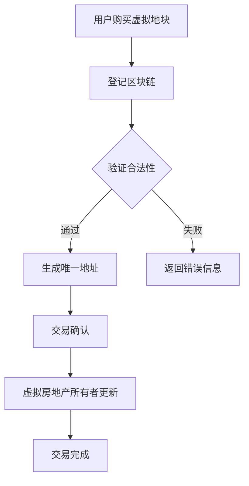

                 

关键词：虚拟房地产、元宇宙、数字资产、区块链技术、虚拟资产定价

摘要：随着元宇宙的兴起，虚拟房地产作为一种新兴的资产形式，正逐渐成为人们关注的焦点。本文将探讨虚拟房地产的定义、核心概念、技术基础及其在元宇宙中的应用，并对未来的发展趋势和面临的挑战进行分析。

## 1. 背景介绍

近年来，随着区块链技术和虚拟现实技术的发展，元宇宙（Metaverse）的概念逐渐兴起。元宇宙被视为一个虚拟的共享空间，用户可以通过虚拟角色在虚拟世界中互动、社交、工作和娱乐。在这个新兴领域中，虚拟房地产作为一种独特的资产形式，引起了广泛关注。

虚拟房地产指的是在元宇宙中占据的虚拟地块、建筑物或其他实体资产。这些资产通常通过区块链技术进行登记和交易，保证了透明性和安全性。与传统房地产相比，虚拟房地产具有更高的流动性和更低的进入门槛，因此吸引了大量投资者的关注。

## 2. 核心概念与联系

在探讨虚拟房地产之前，我们需要了解一些关键概念和技术。以下是相关核心概念和技术的简要介绍，以及它们在元宇宙中的联系。

### 2.1 区块链技术

区块链技术是一种分布式数据库技术，通过加密算法和共识机制确保数据的不可篡改性和透明性。在元宇宙中，区块链技术被广泛应用于虚拟资产的登记、交易和管理。

### 2.2 虚拟货币

虚拟货币是一种数字资产，通常用于购买、交换和支付虚拟商品和服务。在元宇宙中，虚拟货币是购买虚拟房地产和其他资产的主要手段。

### 2.3 虚拟现实（VR）和增强现实（AR）

虚拟现实和增强现实技术为用户提供了沉浸式的虚拟体验。在元宇宙中，这些技术为用户创造了与现实世界互动的虚拟环境，为虚拟房地产的应用提供了基础。

### 2.4 虚拟资产定价

虚拟资产定价是指确定虚拟资产价值的过程。在元宇宙中，虚拟资产定价受到多种因素影响，包括供需关系、市场情绪和项目前景等。

### 2.5 Mermaid 流程图

以下是一个用于描述虚拟房地产登记和交易流程的 Mermaid 流程图。



## 3. 核心算法原理 & 具体操作步骤

### 3.1 算法原理概述

虚拟房地产的交易和登记主要基于区块链技术和智能合约。智能合约是一种自动执行的合约，当满足特定条件时，会自动执行预定义的操作。

### 3.2 算法步骤详解

1. **用户购买虚拟地块**：用户使用虚拟货币购买虚拟地块，并发起交易请求。
2. **登记区块链**：交易请求通过区块链网络进行广播，并由节点验证交易合法性。
3. **验证合法性**：节点检查交易是否符合预定规则，如购买者是否拥有足够的虚拟货币等。
4. **生成唯一地址**：如果交易合法，系统会为交易生成一个唯一的地址，并将其记录在区块链上。
5. **交易确认**：交易经过网络共识机制确认后，虚拟地块的所有权将转移给购买者。
6. **虚拟房地产所有者更新**：所有者信息将更新到区块链上，确保透明性和不可篡改性。
7. **交易完成**：交易完成后，购买者将获得虚拟地块的所有权。

### 3.3 算法优缺点

**优点**：

- **透明性**：区块链技术确保了虚拟房地产交易的透明性，用户可以随时查看交易记录。
- **安全性**：智能合约和区块链技术确保了虚拟房地产交易的安全性和不可篡改性。
- **流动性**：虚拟房地产具有较高的流动性，可以随时买卖。

**缺点**：

- **交易成本**：区块链交易可能涉及较高的手续费和计算成本。
- **市场波动**：虚拟资产价格可能受到市场波动的影响，导致投资风险。

### 3.4 算法应用领域

虚拟房地产的交易和登记算法可以应用于多个领域，包括虚拟城市开发、虚拟旅游、虚拟游戏等。以下是一些应用实例：

- **虚拟城市开发**：开发商可以通过购买虚拟地块开发虚拟建筑，创建一个虚拟城市。
- **虚拟旅游**：旅游公司可以利用虚拟房地产开发虚拟景点，提供沉浸式旅游体验。
- **虚拟游戏**：游戏公司可以在虚拟游戏中引入虚拟房地产，增加游戏趣味性和用户互动性。

## 4. 数学模型和公式 & 详细讲解 & 举例说明

### 4.1 数学模型构建

虚拟资产定价的数学模型可以基于供需关系和市场竞争模型构建。以下是一个简单的模型：

\[ V = f(S, D, M) \]

其中，\( V \) 表示虚拟资产的价格，\( S \) 表示虚拟资产的供应量，\( D \) 表示虚拟资产的需求量，\( M \) 表示市场情绪。

### 4.2 公式推导过程

虚拟资产的价格取决于供需关系和市场情绪。以下是公式的推导过程：

1. **需求函数**：

\[ D = D_0 - k \cdot (V - V_0) \]

其中，\( D \) 表示需求量，\( D_0 \) 表示基准需求量，\( k \) 表示需求敏感系数，\( V \) 表示价格，\( V_0 \) 表示基准价格。

2. **供应函数**：

\[ S = S_0 + m \cdot (V - V_0) \]

其中，\( S \) 表示供应量，\( S_0 \) 表示基准供应量，\( m \) 表示供应敏感系数。

3. **市场情绪函数**：

\[ M = M_0 + h \cdot (V - V_0) \]

其中，\( M \) 表示市场情绪，\( M_0 \) 表示基准市场情绪，\( h \) 表示情绪敏感系数。

4. **虚拟资产价格函数**：

\[ V = \frac{D \cdot S \cdot M}{D \cdot S + M} \]

### 4.3 案例分析与讲解

以下是一个虚拟房地产定价的案例分析：

- **基准需求量**：\( D_0 = 100 \)
- **需求敏感系数**：\( k = 0.1 \)
- **基准价格**：\( V_0 = 1000 \)
- **基准供应量**：\( S_0 = 50 \)
- **供应敏感系数**：\( m = 0.2 \)
- **基准市场情绪**：\( M_0 = 500 \)
- **情绪敏感系数**：\( h = 0.3 \)

1. **需求函数**：

\[ D = 100 - 0.1 \cdot (V - 1000) \]

2. **供应函数**：

\[ S = 50 + 0.2 \cdot (V - 1000) \]

3. **市场情绪函数**：

\[ M = 500 + 0.3 \cdot (V - 1000) \]

4. **虚拟资产价格函数**：

\[ V = \frac{D \cdot S \cdot M}{D \cdot S + M} \]

代入以上函数，我们可以得到虚拟资产的价格。

## 5. 项目实践：代码实例和详细解释说明

### 5.1 开发环境搭建

在本节中，我们将使用以太坊智能合约开发工具 Truffle 搭建开发环境。以下是具体步骤：

1. **安装 Node.js 和 npm**：从官方网站下载并安装 Node.js（https://nodejs.org/）和 npm（npm.js.com/）。
2. **安装 Truffle**：在终端中运行以下命令：

```shell
npm install -g truffle
```

3. **创建新项目**：运行以下命令创建一个新的 Truffle 项目：

```shell
truffle init
```

4. **安装 Solidity 编译器**：在终端中运行以下命令：

```shell
npm install --save solc
```

### 5.2 源代码详细实现

在本节中，我们将实现一个简单的虚拟房地产智能合约。以下是具体步骤：

1. **创建智能合约**：在项目根目录下创建一个名为 `VirtualRealEstate.sol` 的文件。
2. **编写智能合约**：将以下代码复制到 `VirtualRealEstate.sol` 文件中：

```solidity
pragma solidity ^0.8.0;

contract VirtualRealEstate {
    mapping(address => mapping(uint => bool)) public ownership;
    mapping(uint => uint) public prices;

    address public admin;

    constructor() {
        admin = msg.sender;
    }

    function buyProperty(uint propertyId) public payable {
        require(!ownership[msg.sender][propertyId], "Already owns this property");
        require(msg.value >= prices[propertyId], "Insufficient payment");

        ownership[msg.sender][propertyId] = true;
        payable(admin).transfer(msg.value);
    }

    function sellProperty(uint propertyId) public {
        require(ownership[msg.sender][propertyId], "Not the owner of this property");

        ownership[msg.sender][propertyId] = false;
        payable(msg.sender).transfer(prices[propertyId]);
    }

    function updatePrice(uint propertyId, uint price) public {
        require(msg.sender == admin, "Only the admin can update prices");

        prices[propertyId] = price;
    }
}
```

3. **编译智能合约**：在终端中运行以下命令编译智能合约：

```shell
truffle compile
```

### 5.3 代码解读与分析

在本节中，我们将对源代码进行解读和分析。

1. **合约结构**：`VirtualRealEstate` 合约包含三个主要数据结构：

    - `ownership`：一个映射结构，用于存储每个用户对所有虚拟地块的所有权信息。
    - `prices`：一个映射结构，用于存储每个虚拟地块的价格。
    - `admin`：一个存储变量，用于存储合约管理员地址。

2. **函数实现**：

    - `buyProperty`：用户使用虚拟货币购买虚拟地块的函数。函数包含以下逻辑：

        - 检查用户是否已经拥有该地块。
        - 检查用户支付金额是否大于等于地块价格。
        - 更新所有权信息和合约管理员地址。

    - `sellProperty`：用户出售虚拟地块的函数。函数包含以下逻辑：

        - 检查用户是否拥有该地块。
        - 更新所有权信息和合约管理员地址。

    - `updatePrice`：管理员更新虚拟地块价格的函数。函数包含以下逻辑：

        - 检查调用者是否为管理员。

3. **运行结果展示**：

    - 我们可以使用 Truffle console 工具来测试智能合约的功能。在终端中运行以下命令：

```shell
truffle console
```

    - 在 console 中执行以下命令：

```javascript
await contract.buyProperty(1, {value: web3.utils.toWei("1", "ether")});
await contract.sellProperty(1);
await contract.updatePrice(1, web3.utils.toWei("2", "ether")});
```

    - 执行结果将显示合约的状态更新和交易记录。

## 6. 实际应用场景

虚拟房地产在元宇宙中具有广泛的应用场景，以下是一些具体的应用实例：

### 6.1 虚拟城市开发

虚拟城市开发是虚拟房地产的一个重要应用场景。开发商可以在元宇宙中购买虚拟地块，建设虚拟建筑和设施，创建一个完整的虚拟城市。这种应用模式可以吸引大量用户参与，为开发商带来丰厚的收益。

### 6.2 虚拟旅游

虚拟旅游是另一个具有巨大潜力的应用场景。旅游公司可以在元宇宙中购买虚拟地块，创建虚拟景点和旅游线路，提供沉浸式的虚拟旅游体验。这种模式不仅可以帮助旅游公司降低成本，还可以吸引更多游客。

### 6.3 虚拟游戏

虚拟房地产在虚拟游戏中也具有广泛的应用。游戏开发商可以在元宇宙中购买虚拟地块，创建虚拟游戏世界，提供丰富的游戏内容和体验。这种模式可以增加游戏的趣味性和用户互动性，提高游戏的盈利能力。

## 7. 工具和资源推荐

为了更好地了解虚拟房地产和元宇宙，以下是一些推荐的工具和资源：

### 7.1 学习资源推荐

- 《区块链技术指南》
- 《元宇宙：虚拟世界的技术与未来》
- 《虚拟现实与增强现实技术》

### 7.2 开发工具推荐

- Truffle：以太坊智能合约开发框架（https://www.trufflesuite.com/）
- Remix：在线智能合约编辑器（https://remix.ethereum.org/）
- MetaMask：以太坊钱包（https://metamask.io/）

### 7.3 相关论文推荐

- “Blockchain Technology: A Comprehensive Review”
- “Metaverse: The Next Evolution of the Internet”
- “Virtual Real Estate in the Metaverse: Opportunities and Challenges”

## 8. 总结：未来发展趋势与挑战

虚拟房地产作为一种新兴的资产形式，正逐渐成为元宇宙中的重要组成部分。未来，虚拟房地产将继续保持高速增长，并带来更多的商业机会。以下是虚拟房地产未来发展趋势和面临的挑战：

### 8.1 未来发展趋势

1. **市场规模扩大**：随着元宇宙的普及，虚拟房地产的市场规模将不断壮大。
2. **应用场景丰富**：虚拟房地产将在虚拟城市、虚拟旅游、虚拟游戏等领域得到广泛应用。
3. **技术进步**：区块链技术、虚拟现实技术和增强现实技术的不断进步，将为虚拟房地产的发展提供强大动力。

### 8.2 面临的挑战

1. **监管政策**：虚拟房地产的监管政策尚未明确，需要制定相关法律法规来规范市场。
2. **技术风险**：虚拟房地产交易涉及区块链技术，可能面临技术故障和网络安全风险。
3. **市场波动**：虚拟资产价格可能受到市场波动的影响，导致投资者面临投资风险。

### 8.3 研究展望

未来的研究将重点关注虚拟房地产的定价机制、风险管理、市场监管等方面。同时，跨学科的研究也将成为趋势，如计算机科学、经济学、法律等领域的研究人员将共同探讨虚拟房地产的发展方向。

## 9. 附录：常见问题与解答

### 9.1 虚拟房地产是什么？

虚拟房地产是指在元宇宙中占据的虚拟地块、建筑物或其他实体资产。这些资产通常通过区块链技术进行登记和交易，保证了透明性和安全性。

### 9.2 虚拟房地产的价值如何确定？

虚拟房地产的价值取决于供需关系、市场情绪和项目前景等因素。通常，通过建立数学模型和公式来预测虚拟房地产的价格。

### 9.3 虚拟房地产投资有哪些风险？

虚拟房地产投资面临的主要风险包括市场波动、技术故障、网络安全问题和监管政策不确定性等。

### 9.4 如何购买虚拟房地产？

购买虚拟房地产通常需要使用虚拟货币进行支付。用户可以通过虚拟货币交易所购买虚拟货币，然后使用虚拟货币购买虚拟房地产。

### 9.5 虚拟房地产是否具有实物属性？

虚拟房地产是一种数字资产，不具备实物属性。用户只能在元宇宙中拥有虚拟房地产的所有权，无法将其转化为现实世界的资产。

---

作者：禅与计算机程序设计艺术 / Zen and the Art of Computer Programming

