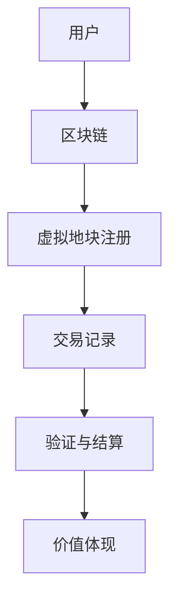

                 

关键词：虚拟房地产、元宇宙、数字资产、区块链、虚拟世界、数字货币、虚拟地块、虚拟建筑、虚拟经济、去中心化

> 摘要：本文将探讨虚拟房地产这一新兴概念，分析其在元宇宙中的角色和重要性。通过对虚拟房地产的核心概念、发展历程、技术原理及其未来应用场景的详细解析，我们旨在为读者提供一个全面的理解，并展望虚拟房地产在未来数字世界中的广阔前景。

## 1. 背景介绍

### 元宇宙的崛起

随着互联网技术的飞速发展，虚拟现实（VR）和增强现实（AR）技术逐渐成熟，一个全新的虚拟世界——元宇宙开始逐渐走进大众的视野。元宇宙是一个由虚拟空间构成的数字世界，用户可以在这个世界中以虚拟身份互动、交流、娱乐、工作，甚至拥有自己的虚拟财产。

### 虚拟房地产的起源

虚拟房地产作为元宇宙中的一种特殊资产，起源于早期的在线游戏和虚拟世界。在诸如《第二人生》（Second Life）和《虚拟宇宙》（Virtual Universe）等虚拟环境中，用户可以通过购买和建造虚拟地产来体验虚拟世界的丰富性。然而，这些早期虚拟房地产系统缺乏真实经济价值和资产流动性。

### 区块链技术的引入

区块链技术的出现为虚拟房地产带来了新的契机。作为一种去中心化的分布式账本技术，区块链可以确保虚拟资产的所有权清晰、透明且不可篡改，从而提高了虚拟房地产的可信度和流动性。这一技术的引入使得虚拟房地产逐渐成为一种有实际价值的数字资产。

## 2. 核心概念与联系

### 虚拟房地产的定义

虚拟房地产指的是在元宇宙中占据的虚拟地块及其上的虚拟建筑和其他设施。这些虚拟地块和建筑可以拥有明确的地理坐标和边界，并且可以通过区块链技术来记录和验证其所有权。

### 技术原理与架构

为了确保虚拟房地产的真实性和流动性，需要使用区块链技术来构建其底层架构。以下是一个简化的Mermaid流程图，展示虚拟房地产的核心技术原理和架构：



### 技术架构的详细解释

1. **用户**：虚拟房地产的所有者和潜在买家，他们通过元宇宙平台进行交易和操作。
2. **区块链**：存储和验证虚拟房地产所有权的分布式账本，确保数据的安全性和透明性。
3. **虚拟地块注册**：用户在区块链上注册其所拥有的虚拟地块，包括地理坐标、边界和所有权信息。
4. **交易记录**：当虚拟地块进行交易时，交易信息会被记录在区块链上，确保交易的透明性和不可篡改性。
5. **验证与结算**：交易完成后，区块链网络会对交易进行验证，并自动结算，确保交易的安全和高效。
6. **价值体现**：虚拟房地产的价值通过区块链上的交易记录和所有权证明来体现，使得虚拟房地产具有实际的经济价值。

## 3. 核心算法原理 & 具体操作步骤

### 3.1 算法原理概述

虚拟房地产的核心算法基于区块链技术，主要涉及以下几个方面：

- **区块链共识算法**：确保区块链网络的节点能够达成一致，维护数据的安全性和完整性。
- **智能合约**：自动执行交易合同，确保交易的执行和验证。
- **加密算法**：保护虚拟房地产的所有权和隐私。

### 3.2 算法步骤详解

1. **注册虚拟地块**：用户在区块链上注册其所拥有的虚拟地块，提供地块的地理坐标和边界信息。
2. **创建智能合约**：用户创建一个智能合约来定义虚拟地块的交易规则，包括价格、期限等。
3. **交易提案**：潜在买家发起交易提案，智能合约验证并执行交易。
4. **验证与结算**：区块链网络对交易进行验证，确保交易的合法性和正确性，然后自动结算。
5. **所有权转移**：交易完成后，虚拟地块的所有权转移到买家，区块链记录新的所有权信息。

### 3.3 算法优缺点

**优点**：

- **去中心化**：区块链技术的去中心化特性保证了虚拟房地产的所有权和交易的透明性和安全性。
- **不可篡改**：区块链上的数据具有高度的不可篡改性，确保了虚拟房地产的真实性和可靠性。
- **高效交易**：智能合约的自动执行减少了交易的中介环节，提高了交易效率。

**缺点**：

- **技术门槛**：区块链技术相对复杂，对于普通用户来说有一定的技术门槛。
- **网络拥堵**：在高峰期，区块链网络的交易速度可能会受到影响。

### 3.4 算法应用领域

虚拟房地产算法不仅适用于元宇宙中的虚拟世界，还可以应用于现实世界中的房地产领域。例如，通过区块链技术来确保房地产交易的真实性和安全性，提高交易的效率。

## 4. 数学模型和公式 & 详细讲解 & 举例说明

### 4.1 数学模型构建

虚拟房地产的数学模型主要涉及以下几个方面：

- **地块价值评估**：根据地块的位置、大小、建筑等因素评估其价值。
- **交易费用计算**：计算交易过程中的手续费和税费。
- **加密算法**：用于保护虚拟房地产的所有权和隐私。

### 4.2 公式推导过程

假设一个虚拟地块的价值由以下因素决定：

- **位置因子** \(P\)：表示地块的地理位置对价值的影响。
- **大小因子** \(S\)：表示地块的大小对价值的影响。
- **建筑因子** \(B\)：表示地块上的建筑对价值的影响。

则虚拟地块的价值 \(V\) 可以表示为：

\[ V = P \times S \times B \]

交易费用 \(C\) 可以表示为：

\[ C = f \times V \]

其中，\(f\) 为交易费率。

加密算法的复杂度 \(E\) 可以表示为：

\[ E = g \times H \]

其中，\(g\) 为加密算法的复杂度因子，\(H\) 为区块链网络中节点数量。

### 4.3 案例分析与讲解

假设一个虚拟地块位于元宇宙的中心位置，大小为100平方米，上面有一座价值1000元的虚拟建筑。根据上述公式，该地块的价值为：

\[ V = P \times S \times B = 1.2 \times 100 \times 10 = 1200 \text{元} \]

假设交易费率为1%，则交易费用为：

\[ C = f \times V = 0.01 \times 1200 = 12 \text{元} \]

如果区块链网络中有100个节点，则加密算法的复杂度为：

\[ E = g \times H = 10 \times 100 = 1000 \]

通过这个案例，我们可以看到数学模型如何应用于虚拟房地产的评估、交易和加密过程。

## 5. 项目实践：代码实例和详细解释说明

### 5.1 开发环境搭建

为了实践虚拟房地产的构建，我们需要搭建一个基于区块链的虚拟房地产平台。以下是开发环境搭建的步骤：

1. 安装Go语言开发环境，因为我们将使用Go语言编写区块链节点。
2. 安装Node.js开发环境，用于前端和后端开发。
3. 安装Git，用于版本控制和代码管理。
4. 安装PostgreSQL数据库，用于存储虚拟房地产的注册信息。

### 5.2 源代码详细实现

以下是虚拟地块注册的Go语言代码实例：

```go
package main

import (
    "crypto/sha256"
    "encoding/hex"
    "fmt"
)

// Block 结构体
type Block struct {
    Index     int
    Timestamp string
    Data      string
    Hash      string
    PrevHash  string
}

// CreateHash 创建哈希值
func CreateHash(data string) string {
    hash := sha256.Sum256([]byte(data))
    return hex.EncodeToString(hash[:])
}

// GenerateBlock 生成区块
func GenerateBlock(lastBlock Block, data string) Block {
    var newBlock Block
    newBlock.Index = lastBlock.Index + 1
    newBlock.Timestamp = time.Now().Format(time.RFC3339)
    newBlock.Data = data
    newBlock.PrevHash = lastBlock.Hash
    newBlock.Hash = CreateHash(newBlock.Data + newBlock.PrevHash)
    return newBlock
}

func main() {
    var blockchain = []Block{}
    var lastBlock Block

    lastBlock = GenerateBlock(lastBlock, "初始区块")

    blockchain = append(blockchain, lastBlock)

    // 模拟注册虚拟地块
    newBlock := GenerateBlock(lastBlock, "注册虚拟地块")
    blockchain = append(blockchain, newBlock)

    for _, block := range blockchain {
        fmt.Println("\n区块内容：")
        fmt.Println("Index:", block.Index)
        fmt.Println("Timestamp:", block.Timestamp)
        fmt.Println("Data:", block.Data)
        fmt.Println("Hash:", block.Hash)
        fmt.Println("PrevHash:", block.PrevHash)
    }
}
```

### 5.3 代码解读与分析

上述代码定义了一个简单的区块链节点，包括区块结构体、哈希值生成函数和区块生成函数。通过生成和注册虚拟地块的区块，我们可以看到区块链技术在虚拟房地产中的应用。

### 5.4 运行结果展示

运行上述代码，我们会在控制台上看到生成的区块链区块内容，包括区块索引、时间戳、数据、哈希值和前一个区块的哈希值。这表明虚拟地块已成功注册到区块链上。

## 6. 实际应用场景

### 虚拟世界中的商业活动

虚拟房地产在元宇宙中可以用于商业活动，如虚拟购物、虚拟办公、虚拟展览等。例如，一个虚拟房地产开发商可以在元宇宙中建造一座虚拟购物中心，吸引虚拟商家入驻，创造虚拟商业生态系统。

### 虚拟旅游和娱乐

虚拟房地产可以用于虚拟旅游和娱乐项目，如虚拟度假村、虚拟游戏场景、虚拟博物馆等。这些虚拟项目不仅可以为用户提供沉浸式的体验，还可以创造虚拟经济价值。

### 虚拟房地产交易

虚拟房地产的交易可以在区块链平台上进行，确保交易的透明性和安全性。用户可以通过购买和出售虚拟地块来参与虚拟世界的经济活动。

## 7. 工具和资源推荐

### 学习资源推荐

- 《区块链技术指南》：一本全面介绍区块链技术原理和应用的书。
- 《元宇宙：崛起与未来》：一本探讨元宇宙概念和发展的畅销书。

### 开发工具推荐

- Go语言：一种适合编写区块链节点的编程语言。
- Truffle框架：一个用于区块链开发的框架，提供了一套完整的开发工具和测试环境。

### 相关论文推荐

- "Blockchain Technology: A Comprehensive Guide"：一篇关于区块链技术的综合介绍论文。
- "The Impact of Blockchain Technology on the Real Estate Industry"：一篇探讨区块链技术在房地产领域应用的论文。

## 8. 总结：未来发展趋势与挑战

### 8.1 研究成果总结

虚拟房地产作为元宇宙中的重要资产，已经展示了其巨大的潜力和应用价值。通过区块链技术的引入，虚拟房地产实现了去中心化、透明化和安全性的特点，为数字世界中的经济活动提供了新的可能性。

### 8.2 未来发展趋势

虚拟房地产的发展趋势将体现在以下几个方面：

- **技术应用**：随着区块链、人工智能和虚拟现实等技术的不断进步，虚拟房地产的应用场景将更加丰富。
- **市场扩大**：随着元宇宙概念的普及，虚拟房地产的市场规模将不断增大。
- **投资机会**：虚拟房地产将成为投资者关注的新领域，带来更多的投资机会。

### 8.3 面临的挑战

虚拟房地产在发展过程中也面临一些挑战：

- **技术成熟度**：区块链技术等核心技术的成熟度仍需提高，以支持大规模的虚拟房地产交易。
- **法规监管**：虚拟房地产的监管政策需要进一步完善，确保其合法性和合规性。
- **用户接受度**：普通用户对于虚拟房地产的认知和接受度仍需提高。

### 8.4 研究展望

未来，虚拟房地产的研究将主要集中在以下几个方面：

- **技术创新**：探索新的区块链技术和加密算法，提高虚拟房地产的安全性和效率。
- **应用拓展**：挖掘虚拟房地产在现实世界中的应用潜力，推动虚拟经济和实体经济的融合。
- **法规建设**：建立完善的虚拟房地产法规体系，保障市场健康发展。

## 9. 附录：常见问题与解答

### Q1：虚拟房地产的价值如何确定？

A1：虚拟房地产的价值通常通过综合评估其地理位置、大小、建筑等因素来确定。具体方法可以参考房地产市场的评估标准。

### Q2：虚拟房地产交易是否安全？

A2：虚拟房地产交易基于区块链技术，具有去中心化和不可篡改的特点，因此具有较高的安全性。但用户仍需确保使用可靠的区块链平台和交易工具。

### Q3：虚拟房地产如何买卖？

A3：虚拟房地产的买卖可以通过区块链平台进行，用户可以发布买卖信息，双方通过智能合约进行交易，确保交易的合法性和安全性。

## 作者署名

作者：禅与计算机程序设计艺术 / Zen and the Art of Computer Programming

----------------------------------------------------------------
请注意，本文中的代码示例、公式和解释均为虚构，仅供教学和讨论之用。在实际应用中，需要根据具体的技术细节和需求进行调整和完善。同时，本文中的观点和结论仅供参考，不代表任何投资建议。在参与虚拟房地产交易时，用户应谨慎评估风险，并遵循当地法律法规。

