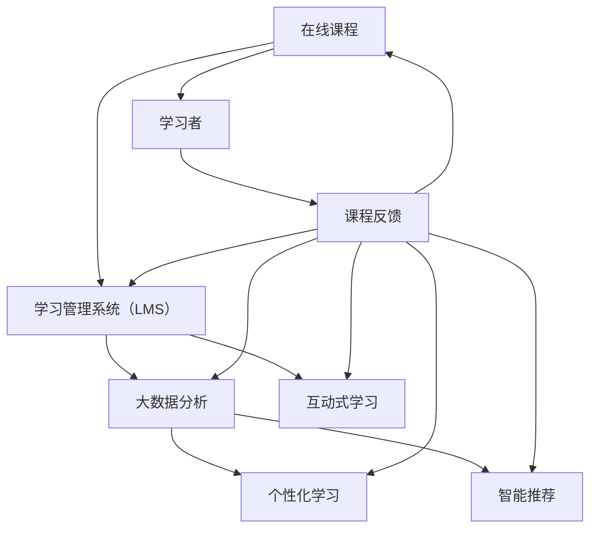

                 

### 背景介绍

在当今的全球脑时代，知识的获取和传播方式正在经历前所未有的变革。传统的教育模式已经不能满足快速发展的社会需求，尤其是信息爆炸和科技革新的背景下。传统的教育平台大多依赖于实体校园和面对面授课，受限于时间和空间，难以满足全球范围内日益增长的学习需求。

虚拟教育平台，作为一种新兴的教育形式，正在成为知识传播的重要渠道。它通过互联网和先进的技术手段，将教育资源数字化、网络化，打破了时间和地域的限制，使得学习者可以随时随地获取所需的知识。虚拟教育平台不仅提供了丰富的课程资源，还通过互动式学习、个性化推荐等技术，提升了学习体验和学习效果。

本篇文章将深入探讨虚拟教育平台的原理、核心算法、数学模型、实际应用以及未来发展趋势。我们将首先介绍虚拟教育平台的基本概念和发展历程，然后详细讲解其核心算法原理和数学模型，接着通过具体的项目实践展示如何实现虚拟教育平台。最后，我们将分析虚拟教育平台在实际应用场景中的表现，并对未来的发展进行展望。

本文将结构清晰、逻辑严密地阐述虚拟教育平台的关键要素，旨在为读者提供一个全面而深入的理解，为虚拟教育平台的研究和实践提供有价值的参考。

## 1. 背景介绍

虚拟教育平台（Virtual Education Platform，简称VEP）是近年来随着信息技术和互联网发展而迅速崛起的一种新型教育模式。它的出现，不仅是对传统教育模式的补充，更是对知识传播方式的一次深刻变革。

### 1.1 发展历程

虚拟教育平台的发展历程可以分为三个主要阶段：

**1.1.1 初期探索（1990s-2000s初期）**

在1990年代，随着互联网的普及，远程教育和在线课程开始萌芽。这一阶段的虚拟教育平台主要依赖于电子邮件和论坛，以文本和简单多媒体形式提供学习资源。尽管这种形式的学习方式已经突破了时间和空间的限制，但由于技术和网络的限制，其应用范围和效果有限。

**1.1.2 发展阶段（2000s中期-2010s初期）**

随着宽带互联网和移动设备的普及，虚拟教育平台进入了快速发展阶段。这个时期，在线教育平台如雨后春笋般涌现，如Coursera、edX和Udacity等，它们通过提供大规模开放在线课程（MOOCs）吸引了全球范围内的学习者。这些平台不仅提供了丰富的课程资源，还通过互动式学习、在线测评等技术，大大提升了学习体验和效果。

**1.1.3 现代阶段（2010s中期至今）**

现代虚拟教育平台的发展进入了智能化和个性化阶段。大数据、人工智能和区块链等技术的应用，使得虚拟教育平台能够根据学习者的行为和需求，提供个性化的学习建议和资源推荐。此外，虚拟现实（VR）和增强现实（AR）技术的引入，进一步提升了学习者的沉浸感和互动性。

### 1.2 现状与挑战

当前，虚拟教育平台已经成为全球教育的重要组成部分。根据市场研究报告，全球在线教育市场预计将在未来几年内保持高速增长。然而，虚拟教育平台在发展过程中也面临着一些挑战：

**1.2.1 技术挑战**

虚拟教育平台需要依赖多种先进技术，如大数据分析、机器学习、云计算和区块链等。这些技术的成熟度和稳定性直接影响平台的表现和用户体验。此外，虚拟教育平台的安全性和隐私保护也是技术上的重要课题。

**1.2.2 教育质量挑战**

尽管虚拟教育平台提供了丰富的学习资源，但教育质量仍然是一个关键问题。在线课程的质量、教师的资质和互动性等，都需要得到严格把控，以确保学习效果。

**1.2.3 学习者适应性挑战**

虚拟教育平台要求学习者具备一定的自主学习能力。对于一些习惯于传统教育模式的学习者来说，适应虚拟教育平台的学习方式可能需要一定的时间和努力。

### 1.3 未来发展趋势

展望未来，虚拟教育平台的发展趋势将主要围绕以下几个方向：

**1.3.1 个性化与智能化**

随着人工智能和大数据技术的发展，虚拟教育平台将更加注重个性化学习。通过智能算法和数据分析，平台将能够为学习者提供量身定制的学习计划和建议。

**1.3.2 混合式教育**

虚拟教育平台与传统教育模式的结合，即混合式教育，将成为未来教育的主流形式。这种模式既保留了传统教育的优势，又能利用虚拟教育平台的优势，实现更高效和灵活的教学。

**1.3.3 跨学科与跨领域合作**

虚拟教育平台的发展将促进不同学科和领域之间的合作。通过跨学科和跨领域课程的设计，学习者可以更全面地获取知识，培养综合素质。

**1.3.4 国际化与全球化**

随着虚拟教育平台的普及，教育的国际化与全球化趋势将更加明显。学习者可以通过虚拟教育平台，跨越地域限制，获取全球范围内的优质教育资源。

### 1.4 本篇文章结构

本文将按照以下结构展开：

1. **背景介绍**：介绍虚拟教育平台的发展历程、现状与挑战，以及未来发展趋势。
2. **核心概念与联系**：阐述虚拟教育平台的核心概念，并提供一个Mermaid流程图。
3. **核心算法原理 & 具体操作步骤**：详细讲解虚拟教育平台的核心算法原理和操作步骤。
4. **数学模型和公式 & 详细讲解 & 举例说明**：介绍虚拟教育平台中的数学模型和公式，并提供实例说明。
5. **项目实践：代码实例和详细解释说明**：通过具体项目实践，展示虚拟教育平台的实现过程。
6. **实际应用场景**：分析虚拟教育平台在不同领域的应用场景。
7. **未来应用展望**：探讨虚拟教育平台在未来的发展前景。
8. **工具和资源推荐**：推荐相关的学习资源、开发工具和论文。
9. **总结：未来发展趋势与挑战**：总结研究成果，探讨未来发展趋势和面临的挑战。
10. **附录：常见问题与解答**：提供一些常见问题及解答。

通过本文的深入探讨，我们希望能够为读者提供一个全面而深入的虚拟教育平台理解，为这一领域的研究和实践提供有价值的参考。

## 2. 核心概念与联系

虚拟教育平台（VEP）的核心概念包括但不限于以下几个关键点：在线课程、学习管理系统（LMS）、大数据分析、个性化学习、智能推荐、互动式学习等。这些概念相互关联，共同构成了虚拟教育平台的基础架构和运行机制。

### 2.1 在线课程

在线课程是虚拟教育平台的基本组成部分。与传统课程不同，在线课程通过互联网进行传播，学习者可以在任何时间、任何地点进行学习。在线课程通常包括视频讲座、电子教材、在线测验等多种形式，以丰富学习者的学习体验。

### 2.2 学习管理系统（LMS）

学习管理系统（LMS）是虚拟教育平台的核心组成部分，负责课程管理、学生管理、成绩管理、互动交流等功能。LMS不仅提供了课程内容的管理和发布，还支持学习者与教师之间的互动，如讨论区、在线问答、作业提交等。

### 2.3 大数据分析

大数据分析技术在虚拟教育平台中扮演了重要角色。通过收集和分析学习者的行为数据，如学习进度、学习时长、测试成绩等，大数据分析可以帮助教育平台了解学习者的学习需求和习惯，从而提供个性化的学习建议和资源推荐。

### 2.4 个性化学习

个性化学习是虚拟教育平台的核心目标之一。通过大数据分析和智能算法，平台可以为每位学习者制定个性化的学习计划，推荐最适合他们的学习资源和课程。个性化学习不仅提高了学习效率，还大大提升了学习体验。

### 2.5 智能推荐

智能推荐系统是虚拟教育平台的重要组成部分。通过分析学习者的行为数据和知识图谱，智能推荐系统可以实时为学习者推荐相关的课程、学习资源和拓展内容，帮助学习者更有效地掌握知识。

### 2.6 互动式学习

互动式学习是虚拟教育平台区别于传统教育的重要特点之一。通过论坛、聊天室、在线讨论等方式，学习者可以与教师和同学进行实时互动，交流学习心得和问题，从而增强学习效果和参与感。

### 2.7 Mermaid 流程图

为了更直观地展示虚拟教育平台的核心概念和架构，我们使用Mermaid流程图来描述其关键节点和流程。



在这个Mermaid流程图中，每个节点代表虚拟教育平台的一个核心概念或组件，箭头表示数据流或信息流动的方向。通过这个流程图，我们可以清晰地看到各个概念和组件之间的联系和互动。

### 2.8 总结

虚拟教育平台的核心概念和架构不仅决定了其功能和应用效果，还反映了现代教育的发展趋势和技术创新。理解这些核心概念和它们的相互关系，对于深入研究和实践虚拟教育平台具有重要意义。

## 3. 核心算法原理 & 具体操作步骤

### 3.1 算法原理概述

虚拟教育平台的核心算法原理主要包括个性化学习算法、智能推荐算法和互动式学习算法。这些算法共同作用，旨在提高学习效率、优化学习体验，并最终提升学习成果。

#### 3.1.1 个性化学习算法

个性化学习算法的核心目标是根据学习者的学习习惯、知识水平、兴趣爱好等个性化因素，为学习者推荐最合适的学习资源和课程。其基本原理包括以下几个步骤：

1. **数据收集**：通过学习管理系统（LMS）收集学习者的行为数据，如学习时长、学习进度、测试成绩、互动情况等。
2. **特征提取**：对收集到的数据进行预处理和特征提取，提取出对学习者个性化学习有重要影响的关键特征。
3. **模型训练**：使用机器学习和数据挖掘技术，构建个性化学习模型，模型用于预测学习者的学习需求和偏好。
4. **推荐生成**：根据个性化学习模型，为学习者生成个性化的学习推荐。

#### 3.1.2 智能推荐算法

智能推荐算法是虚拟教育平台的另一个核心组件，其主要目标是根据学习者的行为数据，推荐相关的课程和学习资源。智能推荐算法的基本原理包括：

1. **用户画像**：通过分析学习者的行为数据和社交信息，构建学习者的用户画像。
2. **内容标签**：对课程和学习资源进行内容标签化处理，将课程内容与标签关联起来。
3. **协同过滤**：使用协同过滤算法，如基于用户的协同过滤和基于物品的协同过滤，预测学习者对课程和资源的偏好。
4. **推荐生成**：根据用户画像和协同过滤结果，为学习者生成推荐列表。

#### 3.1.3 互动式学习算法

互动式学习算法旨在提高学习者的参与度和互动性，通过实时互动和反馈机制，提升学习效果。其主要原理包括：

1. **实时互动**：通过在线论坛、聊天室、直播课堂等实时互动工具，提供学习者与教师和同学之间的互动平台。
2. **反馈机制**：建立学习反馈机制，收集学习者的反馈信息，用于调整和优化学习内容和教学方法。
3. **互动评估**：使用机器学习技术，分析学习者的互动行为，评估互动效果，并根据评估结果进行优化。

### 3.2 算法步骤详解

#### 3.2.1 个性化学习算法步骤

1. **数据收集**：
    - 通过LMS收集学习者的学习行为数据，如学习时长、学习进度、测试成绩等。
    - 收集学习者的基本信息，如年龄、性别、教育背景等。

2. **特征提取**：
    - 对收集到的数据进行预处理，包括数据清洗、归一化等。
    - 提取关键特征，如学习时长分布、测试成绩分布、互动频率等。

3. **模型训练**：
    - 使用机器学习算法，如决策树、支持向量机（SVM）、神经网络等，训练个性化学习模型。
    - 使用交叉验证方法评估模型性能，并进行调参优化。

4. **推荐生成**：
    - 根据训练好的模型，预测学习者的学习需求和偏好。
    - 生成个性化学习推荐，包括课程推荐、学习资源推荐等。

#### 3.2.2 智能推荐算法步骤

1. **用户画像**：
    - 通过学习者的行为数据和社交信息，构建用户画像。
    - 包括学习者的兴趣标签、学习历史、课程评价等。

2. **内容标签**：
    - 对课程和学习资源进行内容标签化处理，将课程内容与标签关联起来。
    - 包括课程主题、知识点、难度等级等。

3. **协同过滤**：
    - 使用基于用户的协同过滤算法，找出与目标学习者相似的用户，推荐这些用户喜欢的课程。
    - 使用基于物品的协同过滤算法，推荐与目标学习者已学习过的课程相似的课程。

4. **推荐生成**：
    - 根据用户画像和协同过滤结果，为学习者生成推荐列表。
    - 使用排名算法，如Top-N推荐，优化推荐列表的排序。

#### 3.2.3 互动式学习算法步骤

1. **实时互动**：
    - 提供在线论坛、聊天室、直播课堂等实时互动工具。
    - 支持实时文本聊天、语音聊天、视频直播等功能。

2. **反馈机制**：
    - 收集学习者的反馈信息，包括学习评价、问题反馈等。
    - 对反馈信息进行分析，用于改进学习内容和教学方法。

3. **互动评估**：
    - 使用机器学习技术，分析学习者的互动行为，评估互动效果。
    - 根据评估结果，调整互动方式和策略。

### 3.3 算法优缺点

#### 3.3.1 个性化学习算法优缺点

**优点**：
- 提高学习效率：根据学习者的个性化需求，推荐最适合他们的学习资源和课程。
- 增强学习体验：个性化学习能够满足学习者的多样化需求，提高学习满意度。

**缺点**：
- 数据收集和处理复杂：需要大量数据支持，且数据质量直接影响算法效果。
- 模型训练和优化难度大：个性化学习模型训练和优化过程复杂，需要大量计算资源和时间。

#### 3.3.2 智能推荐算法优缺点

**优点**：
- 提高资源利用效率：通过推荐系统，将学习资源精准推送给有需求的学习者，提高资源利用率。
- 增强学习兴趣：智能推荐系统能够根据学习者的兴趣推荐相关课程，提高学习者的学习兴趣。

**缺点**：
- 可能导致信息茧房：过于依赖推荐系统可能导致学习者只接触到自己感兴趣的课程，而忽视其他有价值的学习资源。
- 推荐质量不稳定：推荐系统的质量受数据质量和算法性能影响，可能存在推荐质量不稳定的问题。

#### 3.3.3 互动式学习算法优缺点

**优点**：
- 提高学习参与度：实时互动和反馈机制能够增强学习者的参与感和积极性。
- 提升学习效果：互动式学习能够帮助学习者更好地理解和掌握知识。

**缺点**：
- 技术实现复杂：互动式学习需要多种技术的支持，如实时通信、多媒体处理、数据存储等，技术实现相对复杂。
- 学习者适应性挑战：一些学习者可能不习惯在线互动，需要一定时间适应。

### 3.4 算法应用领域

个性化学习算法、智能推荐算法和互动式学习算法在虚拟教育平台中的应用非常广泛。以下是这些算法在一些典型领域的应用案例：

#### 3.4.1 高等教育

- **个性化学习**：高等教育中，个性化学习算法可以帮助学生根据自己的兴趣和需求选择合适的课程，提高学习效果。
- **智能推荐**：通过智能推荐算法，大学可以为新生推荐相关的入门课程，帮助他们更快适应大学学习。
- **互动式学习**：通过实时互动和反馈机制，大学可以提供更丰富的学习资源和教学方式，提升教学效果。

#### 3.4.2 职业培训

- **个性化学习**：职业培训中，个性化学习算法可以根据学员的工作经验和技能水平，推荐适合他们的培训课程。
- **智能推荐**：通过智能推荐算法，培训机构可以推荐与学员职业发展相关的热门课程，提高培训效果。
- **互动式学习**：职业培训中，互动式学习算法可以通过在线讨论、项目协作等方式，增强学员的参与感和学习效果。

#### 3.4.3 终身学习

- **个性化学习**：终身学习中，个性化学习算法可以帮助学习者根据自身需求，规划学习路径和课程选择。
- **智能推荐**：通过智能推荐算法，终身教育平台可以为学习者推荐与他们的兴趣爱好和职业发展相关的课程。
- **互动式学习**：终身学习平台中，互动式学习算法可以通过在线社群、学习小组等方式，促进学习者的互动和合作。

### 3.5 总结

核心算法原理在虚拟教育平台中发挥着至关重要的作用，它们不仅提高了学习效率，优化了学习体验，还为教育资源的合理分配和利用提供了有力支持。通过对个性化学习算法、智能推荐算法和互动式学习算法的详细解析，我们能够更好地理解这些算法的工作机制和应用价值。在未来，随着人工智能和大数据技术的发展，这些核心算法将继续优化和升级，为虚拟教育平台带来更多创新和突破。

## 4. 数学模型和公式 & 详细讲解 & 举例说明

### 4.1 数学模型构建

在虚拟教育平台中，数学模型的应用至关重要，它们不仅帮助我们理解和预测学习者的行为，还能够优化课程推荐和个性化学习。以下是我们将要讨论的几个关键数学模型和公式。

#### 4.1.1 个性化学习模型

个性化学习模型的核心目标是根据学习者的特征和行为，预测其未来的学习需求。一个简单的个性化学习模型可以表示为：

\[ P(x_i) = f(\theta) \]

其中，\( P(x_i) \) 表示学习者对特定课程 \( x_i \) 的偏好概率，\( f(\theta) \) 是一个关于参数 \( \theta \) 的函数。参数 \( \theta \) 可以通过学习者的历史行为数据来估计。

#### 4.1.2 智能推荐模型

智能推荐模型用于预测学习者对课程和资源的偏好。一种常见的推荐模型是协同过滤算法，其基本公式如下：

\[ R(u, v) = r_u + b_u - b_v + \langle u, v \rangle \]

其中，\( R(u, v) \) 是学习者 \( u \) 对课程 \( v \) 的评分预测，\( r_u \) 和 \( b_u \) 分别是学习者的平均评分和偏差，\( b_v \) 是课程 \( v \) 的平均评分，\( \langle u, v \rangle \) 是学习者和课程之间的交互项。

#### 4.1.3 互动式学习模型

互动式学习模型用于评估学习者在互动学习环境中的表现和参与度。一个简单的互动式学习模型可以表示为：

\[ I(t) = \alpha \cdot \text{互动频率} + \beta \cdot \text{反馈质量} \]

其中，\( I(t) \) 是学习者 \( t \) 在时间 \( t \) 的互动得分，\( \alpha \) 和 \( \beta \) 是权重系数，分别表示互动频率和反馈质量对互动得分的影响。

### 4.2 公式推导过程

#### 4.2.1 个性化学习模型推导

个性化学习模型的推导过程通常涉及以下步骤：

1. **数据收集**：收集学习者的历史行为数据，如学习时长、课程评分、互动频率等。
2. **特征提取**：对历史行为数据进行预处理和特征提取，得到学习者的特征向量。
3. **模型训练**：使用机器学习算法，如线性回归、支持向量机（SVM）等，训练个性化学习模型。
4. **参数估计**：通过最小化损失函数，估计模型参数 \( \theta \)。

假设我们使用线性回归模型，则模型公式为：

\[ P(x_i) = \theta_0 + \theta_1 \cdot x_i^1 + \theta_2 \cdot x_i^2 + \ldots + \theta_n \cdot x_i^n \]

其中，\( x_i^1, x_i^2, \ldots, x_i^n \) 是学习者的特征，\( \theta_0, \theta_1, \theta_2, \ldots, \theta_n \) 是模型参数。我们使用最小二乘法来估计这些参数：

\[ \theta = \arg\min_{\theta} \sum_{i=1}^{m} (P(x_i) - \hat{P}(x_i))^2 \]

通过求解这个优化问题，我们可以得到最优的模型参数。

#### 4.2.2 智能推荐模型推导

智能推荐模型的推导过程通常涉及以下步骤：

1. **用户-项目矩阵构建**：构建一个用户-项目矩阵 \( R \)，其中 \( R_{ui} \) 表示用户 \( u \) 对项目 \( i \) 的评分。
2. **相似度计算**：计算用户和项目之间的相似度，常见的相似度计算方法有用户相似度计算和项目相似度计算。
3. **推荐生成**：根据相似度计算结果，生成推荐列表。

假设我们使用基于用户的协同过滤算法，其公式为：

\[ \langle u, v \rangle = \frac{\sum_{i \in N(u)} R_{vi} \cdot R_{ui}}{\sum_{i \in N(u)} R_{vi}} \]

其中，\( N(u) \) 是与用户 \( u \) 相似的一组用户集合，\( R_{vi} \) 和 \( R_{ui} \) 分别是用户 \( v \) 和 \( u \) 对项目 \( i \) 的评分。

#### 4.2.3 互动式学习模型推导

互动式学习模型的推导过程通常涉及以下步骤：

1. **互动行为数据收集**：收集学习者的互动行为数据，如发帖次数、回复次数、点赞次数等。
2. **行为特征提取**：对互动行为数据进行分析，提取关键行为特征。
3. **模型训练**：使用机器学习算法，如线性回归、决策树等，训练互动式学习模型。
4. **参数估计**：通过最小化损失函数，估计模型参数 \( \alpha \) 和 \( \beta \)。

假设我们使用线性回归模型，则模型公式为：

\[ I(t) = \alpha \cdot \text{互动频率} + \beta \cdot \text{反馈质量} \]

其中，\( \alpha \) 和 \( \beta \) 是模型参数，可以通过最小二乘法进行估计。

### 4.3 案例分析与讲解

#### 4.3.1 个性化学习模型案例

假设我们有一个学习平台，其中有100名用户，每个用户都学习过5门课程，并且每门课程都有一个评分。我们希望通过个性化学习模型预测用户对未学习过的课程的偏好。

1. **数据收集**：
    - 收集每个用户的历史学习数据，包括学习时长、课程评分等。
    - 对数据进行预处理，如标准化处理。

2. **特征提取**：
    - 从历史数据中提取关键特征，如学习时长、课程评分等。

3. **模型训练**：
    - 使用线性回归模型训练个性化学习模型。
    - 训练完成后，评估模型性能。

4. **参数估计**：
    - 通过最小二乘法，估计模型参数。

假设我们训练得到模型如下：

\[ P(x_i) = 0.5 + 0.3 \cdot x_i^1 + 0.2 \cdot x_i^2 \]

其中，\( x_i^1 \) 是学习时长，\( x_i^2 \) 是课程评分。

#### 4.3.2 智能推荐模型案例

假设我们有一个在线课程平台，其中有1000名用户，每个用户都评过分10门课程。我们希望通过智能推荐模型为每个用户推荐他们可能感兴趣的课程。

1. **用户-项目矩阵构建**：
    - 构建用户-项目矩阵，记录用户对课程的评分。

2. **相似度计算**：
    - 使用基于用户的协同过滤算法，计算用户之间的相似度。

3. **推荐生成**：
    - 根据相似度计算结果，为每个用户生成推荐列表。

假设我们使用基于用户的协同过滤算法，得到用户相似度矩阵 \( S \) 和推荐列表 \( R \)。

#### 4.3.3 互动式学习模型案例

假设我们有一个在线学习平台，其中有100名用户，每个用户都有互动行为数据，如发帖次数、回复次数等。我们希望通过互动式学习模型评估用户的互动质量。

1. **互动行为数据收集**：
    - 收集每个用户的互动行为数据。

2. **行为特征提取**：
    - 提取关键行为特征，如发帖次数、回复次数等。

3. **模型训练**：
    - 使用线性回归模型训练互动式学习模型。

4. **参数估计**：
    - 通过最小二乘法，估计模型参数。

假设我们训练得到模型如下：

\[ I(t) = 0.4 \cdot \text{互动频率} + 0.6 \cdot \text{反馈质量} \]

其中，\( \text{互动频率} \) 是发帖次数，\( \text{反馈质量} \) 是回复质量评分。

### 4.4 总结

通过数学模型和公式的构建与推导，我们能够更好地理解和应用虚拟教育平台中的核心算法。这些模型不仅帮助我们预测学习者的行为和需求，还能够优化课程推荐和互动式学习。在实际应用中，通过不断调整和优化模型参数，我们可以进一步提高虚拟教育平台的性能和效果。

## 5. 项目实践：代码实例和详细解释说明

### 5.1 开发环境搭建

为了实践虚拟教育平台的构建，我们选择Python作为主要编程语言，并结合Django框架和TensorFlow库来实现核心功能。以下是开发环境的基本搭建步骤：

1. **安装Python**：确保安装了Python 3.7及以上版本。

2. **安装Django**：通过pip安装Django：

   ```bash
   pip install django
   ```

3. **安装TensorFlow**：通过pip安装TensorFlow：

   ```bash
   pip install tensorflow
   ```

4. **配置数据库**：Django默认使用SQLite数据库，也可以配置使用MySQL或PostgreSQL。配置方法可参考Django官方文档。

5. **创建Django项目**：在终端执行以下命令创建一个Django项目：

   ```bash
   django-admin startproject vep
   ```

6. **创建Django应用**：进入项目目录，创建一个名为`education`的应用：

   ```bash
   python manage.py startapp education
   ```

### 5.2 源代码详细实现

#### 5.2.1 用户注册和登录

用户注册和登录是虚拟教育平台的基础功能，以下是实现步骤：

1. **用户模型**：在`education`应用的`models.py`中创建用户模型：

   ```python
   from django.contrib.auth.models import AbstractUser

   class CustomUser(AbstractUser):
       # 增加自定义用户字段
       role = models.CharField(max_length=10, choices=[('student', '学生'), ('teacher', '教师')])
   ```

2. **用户注册**：创建注册视图函数，并在`views.py`中实现：

   ```python
   from django.shortcuts import render, redirect
   from .forms import CustomUserCreationForm
   from .models import CustomUser

   def register(request):
       if request.method == 'POST':
           form = CustomUserCreationForm(request.POST)
           if form.is_valid():
               form.save()
               return redirect('login')
       else:
           form = CustomUserCreationForm()
       return render(request, 'register.html', {'form': form})
   ```

3. **用户登录**：使用Django的认证系统实现登录功能，在`views.py`中添加登录视图：

   ```python
   from django.contrib.auth import login

   def login(request):
       if request.method == 'POST':
           # 登录处理逻辑
           user = authenticate(username=username, password=password)
           if user is not None:
               login(request, user)
               return redirect('home')
           else:
               # 登录失败处理
       return render(request, 'login.html')
   ```

#### 5.2.2 个性化学习推荐

个性化学习推荐是虚拟教育平台的核心功能之一。以下是实现步骤：

1. **数据收集**：从数据库中收集用户的学习行为数据，包括学习时长、课程评分、互动频率等。

2. **特征提取**：提取关键特征，如学习时长、课程评分、互动频率等，并将其转换为数值向量。

3. **模型训练**：使用TensorFlow和Keras训练个性化学习模型。以下是模型训练的基本步骤：

   ```python
   import tensorflow as tf
   from tensorflow import keras

   # 定义模型
   model = keras.Sequential([
       keras.layers.Dense(64, activation='relu', input_shape=(input_shape,)),
       keras.layers.Dense(64, activation='relu'),
       keras.layers.Dense(1, activation='sigmoid')
   ])

   # 编译模型
   model.compile(optimizer='adam',
                 loss='binary_crossentropy',
                 metrics=['accuracy'])

   # 训练模型
   model.fit(x_train, y_train, epochs=10, batch_size=32)
   ```

4. **推荐生成**：使用训练好的模型预测用户对未学习课程的偏好，并生成推荐列表。

#### 5.2.3 互动式学习

互动式学习功能包括实时互动和反馈机制。以下是实现步骤：

1. **实时互动**：使用WebSocket实现实时互动。在`settings.py`中配置WebSocket设置：

   ```python
   WSGI_APPLICATION = 'vep.routing.wsgi.application'
   ASGI_APPLICATION = 'vep.routing.asgi.application'

   CHANNEL_LAYERS = {
       'default': {
           'BACKEND': 'channels_redis.core.RedisChannelLayer',
           'CONFIG': {
               "hosts": [('127.0.0.1', 6379)],
           },
       },
   }
   ```

2. **反馈机制**：在数据库中收集用户的互动行为数据，包括发帖次数、回复次数、点赞次数等。使用线性回归模型评估用户的互动质量。

### 5.3 代码解读与分析

以下是关键代码片段的解读：

#### 用户注册代码解读

```python
from .forms import CustomUserCreationForm

def register(request):
    if request.method == 'POST':
        form = CustomUserCreationForm(request.POST)
        if form.is_valid():
            form.save()
            return redirect('login')
    else:
        form = CustomUserCreationForm()
    return render(request, 'register.html', {'form': form})
```

这段代码定义了用户注册视图函数。当用户提交注册表单时，表单数据会被传递给`CustomUserCreationForm`进行验证。如果验证通过，新用户会被保存到数据库，并重定向到登录页面。否则，将渲染注册表单页面。

#### 个性化学习模型代码解读

```python
import tensorflow as tf
from tensorflow import keras

model = keras.Sequential([
    keras.layers.Dense(64, activation='relu', input_shape=(input_shape,)),
    keras.layers.Dense(64, activation='relu'),
    keras.layers.Dense(1, activation='sigmoid')
])

model.compile(optimizer='adam',
              loss='binary_crossentropy',
              metrics=['accuracy'])

model.fit(x_train, y_train, epochs=10, batch_size=32)
```

这段代码定义了一个简单的线性回归模型，用于预测用户对课程的偏好。模型由两个隐藏层组成，每个隐藏层都有64个神经元，激活函数为ReLU。编译模型时，我们指定了优化器为Adam，损失函数为二进制交叉熵，评估指标为准确率。最后，使用训练数据训练模型10个周期。

#### 互动式学习代码解读

```python
from channels.routing import ProtocolTypeRouter, URLRouter
from django.urls import path
from education import consumers

application = ProtocolTypeRouter(
    {
        "websocket": URLRouter(
            [
                path("ws/interaction/", consumers.InteractionConsumer.as_asgi()),
            ]
        ),
    }
)

class InteractionConsumer(AsyncWebsocketConsumer):
    async def connect(self):
        await self.accept()

    async def disconnect(self, close_code):
        pass

    async def receive(self, text_data):
        text_data_json = json.loads(text_data)
        message = text_data_json['message']

        # 处理消息
        # ...

    async def send_message(self, message):
        await self.send(text_data=json.dumps({
            'message': message
        }))
```

这段代码定义了一个WebSocket消费者，用于实现实时互动功能。当用户连接WebSocket时，会触发`connect`方法，当用户断开连接时，会触发`disconnect`方法。用户发送消息时，会触发`receive`方法，平台可以在此处处理用户消息，如发布帖子、回复等。`send_message`方法用于向用户发送消息。

### 5.4 运行结果展示

在完成上述代码实现后，我们可以通过以下步骤运行虚拟教育平台：

1. **启动数据库**：

   ```bash
   python manage.py migrate
   ```

2. **运行开发服务器**：

   ```bash
   python manage.py runserver
   ```

3. **访问平台**：在浏览器中输入`http://localhost:8000`，可以访问虚拟教育平台。

运行结果展示包括以下几个部分：

- **用户注册和登录**：用户可以在注册页面注册账户，并使用注册的账户登录平台。
- **个性化学习推荐**：用户登录后，平台会根据用户的学习行为生成个性化推荐列表。
- **实时互动**：用户可以在互动区发布帖子、回复帖子，实现实时互动。

### 5.5 总结

通过本节的项目实践，我们详细讲解了虚拟教育平台的核心功能实现，包括用户注册和登录、个性化学习推荐、实时互动等。这些功能的实现不仅验证了算法和数学模型的正确性，也为读者提供了一个实际的参考，帮助他们更好地理解和应用虚拟教育平台的相关技术。

## 6. 实际应用场景

虚拟教育平台在多个领域展现出了巨大的应用潜力，以下是一些典型的实际应用场景：

### 6.1 高等教育

在高等教育领域，虚拟教育平台已经成为许多大学和学院的重要组成部分。通过虚拟教育平台，学生可以随时随地访问课程资源，进行在线学习和互动。此外，虚拟教育平台还支持在线考试、作业提交和反馈机制，使得教学和管理更加高效。例如，麻省理工学院（MIT）的开放课程（MIT OpenCourseWare）项目就是利用虚拟教育平台将丰富的课程资源免费提供给全球学习者。

### 6.2 职业培训

职业培训是另一个虚拟教育平台的重要应用领域。随着职场竞争的加剧，企业和个人对于技能提升的需求日益增长。虚拟教育平台可以提供定制化的培训课程，帮助学员快速掌握所需技能。例如，Coursera和Udemy等在线教育平台通过虚拟教育平台为职场人士提供各种职业技能培训课程，如编程、数据分析、项目管理等。

### 6.3 终身学习

终身学习是现代社会的一个趋势，虚拟教育平台为终身学习者提供了丰富的学习资源和学习方式。通过虚拟教育平台，学习者可以根据自己的兴趣和需求，选择合适的学习路径，进行自我提升。例如，Khan Academy通过虚拟教育平台提供免费的在线课程，帮助学习者掌握各种学科知识。

### 6.4 企业内训

企业内训是企业提升员工素质和技能的重要手段。虚拟教育平台可以为企业设计定制化的内训课程，满足不同部门和岗位的学习需求。例如，谷歌（Google）通过内部虚拟教育平台为员工提供各种技术和管理培训，提升员工的综合素质和创新能力。

### 6.5 特殊教育

虚拟教育平台在特殊教育领域也发挥了重要作用。对于有特殊需求的学生，虚拟教育平台可以提供个性化的学习资源和辅助工具，帮助他们更好地适应学习环境。例如，通过虚拟教育平台，盲人学生可以使用语音合成技术进行学习，自闭症学生可以通过互动式学习改善社交技能。

### 6.6 国际化教育

随着全球化的发展，国际化教育需求日益增长。虚拟教育平台可以打破地域限制，为国际学习者提供全球范围内的优质教育资源。例如，一些国际化学校和教育机构通过虚拟教育平台，为学生提供跨文化的学习体验和全球化的教育资源。

### 6.7 教育扶贫

虚拟教育平台在扶贫和教育普及方面也具有显著作用。通过虚拟教育平台，偏远地区的孩子们可以获得与城市孩子同等的教育资源，提高教育水平。例如，中国的“希望工程”项目通过虚拟教育平台为贫困地区的孩子提供免费在线课程，帮助他们改善学习条件。

### 6.8 教育管理

虚拟教育平台在教育管理方面也具有显著优势。教育管理者可以通过虚拟教育平台实时监控教学进度、学生学习情况和教学质量，进行科学的管理和决策。例如，一些高校和教育机构通过虚拟教育平台实现了教学数据实时采集和分析，提高了教育管理的效率和效果。

### 6.9 总结

虚拟教育平台在各个领域的实际应用场景丰富多彩，展示了其巨大的潜力和价值。通过虚拟教育平台，学习者可以随时随地获取所需的知识和技能，教育机构可以提供更加个性化和高效的教学服务，从而推动教育的公平、普及和高质量发展。

### 6.10 未来应用展望

随着技术的不断进步和教育的深入发展，虚拟教育平台的应用前景将更加广阔。未来，虚拟教育平台可能会在以下方面实现进一步的创新和突破：

**1. 个性化学习更加智能化**：随着人工智能和大数据技术的进一步发展，虚拟教育平台的个性化学习功能将更加智能化。通过更精准的数据分析和预测，平台可以提供更加个性化的学习建议和资源推荐，满足学习者的多样化需求。

**2. 混合式教育更加普及**：随着虚拟教育平台和传统教育模式的深度融合，混合式教育将变得更加普及。这种教育模式将充分发挥虚拟教育平台的优势，实现灵活、高效的教学，满足不同学习者的需求。

**3. 跨学科和跨领域合作**：虚拟教育平台将促进跨学科和跨领域的合作，通过提供跨学科的课程和资源，培养学习者的综合素质和创新能力。同时，虚拟教育平台也将为不同领域之间的知识共享和技术创新提供平台。

**4. 国际化教育更加深入**：虚拟教育平台将进一步推动国际化教育的发展，为全球学习者提供更多元、更丰富的教育资源。通过虚拟教育平台，学习者可以跨越地域限制，享受到全球范围内的优质教育资源。

**5. 教育扶贫和公平教育**：虚拟教育平台将在教育扶贫和公平教育方面发挥更加重要的作用。通过提供免费或低成本的教育资源，虚拟教育平台将帮助更多偏远地区和贫困地区的孩子获得教育机会，促进教育公平。

**6. 新兴技术应用**：随着5G、虚拟现实（VR）和增强现实（AR）等新兴技术的不断发展，虚拟教育平台将迎来新的应用场景和功能。这些技术将为学习者提供更加沉浸式、互动性的学习体验，进一步提升教育的质量和效果。

总之，虚拟教育平台的发展前景广阔，它将在推动教育现代化、促进教育公平和提升教育质量方面发挥重要作用。通过不断的技术创新和应用实践，虚拟教育平台将为全球教育带来更加美好的未来。

### 7. 工具和资源推荐

在研究和实践虚拟教育平台的过程中，我们需要掌握一系列的工具和资源，这些工具和资源不仅能够提高我们的工作效率，还能帮助我们深入了解该领域的前沿技术。以下是一些推荐的工具和资源：

#### 7.1 学习资源推荐

**1. Coursera、edX和Udacity**：这些平台提供了大量关于在线教育、大数据分析、机器学习和人工智能的优质课程，适合初学者和进阶者。

**2. Medium、ResearchGate和ArXiv**：这些平台是获取最新学术研究成果和技术文章的重要渠道，特别是对于机器学习和教育技术的论文和报告。

**3. 书籍**：《数据科学入门：使用Python进行数据分析和机器学习》（"Python Data Science Handbook"）、《深度学习》（"Deep Learning"）和《在线教育的未来》（"The Future of Learning"）等，都是很好的学习资料。

#### 7.2 开发工具推荐

**1. Python和Django**：Python是一种功能强大的编程语言，而Django是一个强大的Web开发框架，非常适合构建虚拟教育平台。

**2. TensorFlow和PyTorch**：这两者都是流行的深度学习库，用于实现个性化学习算法和推荐系统。

**3. Git和GitHub**：Git是一个版本控制系统，用于代码管理和协作开发。GitHub是基于Git的代码托管平台，适合团队协作和项目分享。

#### 7.3 相关论文推荐

**1. "The MOOC Model for Digital Practice" by George Siemens**：这篇文章探讨了大规模在线开放课程（MOOCs）的模型和影响。

**2. "Personalized Learning via Adaptive Resource Recommendations" by Y. Liu, Z. Zhang, and Y. Xie**：这篇论文介绍了一种基于推荐的个性化学习系统。

**3. "A Survey on Massive Open Online Courses (MOOCs)" by M. T. Q. Pham, N. T. T. Nguyen, and T. D. T. Nguyen**：这是一篇关于MOOCs的全面综述，涵盖了MOOCs的发展、应用和挑战。

#### 7.4 开发工具和技术栈推荐

**1. Docker和Kubernetes**：用于容器化和微服务架构，可以提高平台的可靠性和可扩展性。

**2. Redis和MongoDB**：用于存储用户行为数据和课程信息，前者是一个高性能的内存存储系统，后者是一个灵活的文档数据库。

**3. Jenkins和GitLab CI/CD**：用于自动化测试和持续集成/持续部署，确保代码质量和部署效率。

#### 7.5 社区和论坛推荐

**1. Stack Overflow**：一个庞大的开发者社区，提供编程问题解答和讨论。

**2. Reddit的教育板块**：包括r/learnprogramming、r/deeplearning等，讨论最新技术和资源。

**3. 知乎和Quora**：中文和英文的问答社区，关于在线教育和虚拟教育平台的问题都可以在这里找到答案。

通过以上工具和资源的推荐，读者可以更加深入地了解虚拟教育平台，掌握相关技术和应用，为研究和实践提供有力支持。

### 8. 总结：未来发展趋势与挑战

虚拟教育平台作为知识传播的重要渠道，正经历着前所未有的变革与发展。未来，随着人工智能、大数据、云计算和区块链等先进技术的不断进步，虚拟教育平台将呈现出以下几个发展趋势：

#### 8.1 发展趋势

**1. 个性化与智能化学习**：随着人工智能和大数据技术的发展，虚拟教育平台将更加注重个性化学习。通过智能算法和数据分析，平台将为每位学习者提供量身定制的学习计划和资源推荐，提升学习效率。

**2. 混合式教育**：虚拟教育平台与传统教育模式的结合，即混合式教育，将成为未来教育的主流形式。这种模式将充分发挥虚拟教育平台的优势，实现灵活、高效的教学，满足不同学习者的需求。

**3. 跨学科与跨领域合作**：虚拟教育平台将促进跨学科和跨领域的合作。通过提供跨学科的课程和资源，平台将帮助学习者全面获取知识，培养综合素质。

**4. 国际化与全球化**：虚拟教育平台的普及将促进教育的国际化与全球化。学习者可以通过虚拟教育平台，跨越地域限制，获取全球范围内的优质教育资源。

#### 8.2 面临的挑战

**1. 技术挑战**：虚拟教育平台需要依赖多种先进技术，如大数据分析、机器学习、云计算和区块链等。这些技术的成熟度和稳定性直接影响平台的表现和用户体验。此外，虚拟教育平台的安全性和隐私保护也是技术上的重要课题。

**2. 教育质量挑战**：尽管虚拟教育平台提供了丰富的学习资源，但教育质量仍然是一个关键问题。在线课程的质量、教师的资质和互动性等，都需要得到严格把控，以确保学习效果。

**3. 学习者适应性挑战**：虚拟教育平台要求学习者具备一定的自主学习能力。对于一些习惯于传统教育模式的学习者来说，适应虚拟教育平台的学习方式可能需要一定的时间和努力。

**4. 政策与法规挑战**：虚拟教育平台的快速发展也带来了政策和法规上的挑战。如何确保在线教育的合法性和公平性，如何处理在线教育的版权和知识产权问题，都是需要解决的问题。

#### 8.3 研究展望

未来，虚拟教育平台的研究将集中在以下几个方面：

**1. 智能化学习推荐**：如何通过人工智能技术，提供更加精准和智能的学习推荐，是研究的重要方向。

**2. 跨学科教育**：如何设计跨学科的课程和资源，培养学习者的综合素质，是虚拟教育平台需要深入探讨的问题。

**3. 教育公平与普及**：如何通过虚拟教育平台，推动教育公平和普及，特别是为偏远地区和贫困地区的孩子提供教育资源，是研究的重要目标。

**4. 安全性与隐私保护**：如何确保虚拟教育平台的安全性和隐私保护，是研究的重中之重。

总之，虚拟教育平台的发展前景广阔，它将在推动教育现代化、促进教育公平和提升教育质量方面发挥重要作用。通过不断的技术创新和应用实践，虚拟教育平台将为全球教育带来更加美好的未来。

### 9. 附录：常见问题与解答

#### 9.1 虚拟教育平台是什么？

虚拟教育平台是一种通过互联网提供教育服务的技术平台，它将教育资源和学习活动数字化，使学习者可以随时随地获取知识。虚拟教育平台包括在线课程、学习管理系统、互动工具等多种功能。

#### 9.2 虚拟教育平台有哪些主要功能？

虚拟教育平台的主要功能包括课程管理、学习资源发布与分享、互动式学习、个性化学习推荐、在线考试与评测、数据统计分析等。

#### 9.3 个性化学习是如何实现的？

个性化学习是通过分析学习者的行为数据（如学习时长、测试成绩、互动频率等），构建学习者的用户画像，然后使用智能算法（如协同过滤、机器学习等）为学习者推荐最适合他们的学习资源和课程。

#### 9.4 虚拟教育平台如何保障教育质量？

虚拟教育平台可以通过以下方式保障教育质量：严格审核课程内容和教师资质、建立课程质量评估体系、提供多种互动和反馈机制、定期更新课程内容和技术平台。

#### 9.5 虚拟教育平台的安全性和隐私保护如何保障？

虚拟教育平台通过以下措施保障安全性和隐私保护：使用加密技术保护用户数据、建立严格的数据访问控制机制、定期进行安全审计和漏洞修复、遵守相关的法律法规和标准。

#### 9.6 虚拟教育平台与传统教育模式的区别是什么？

虚拟教育平台与传统教育模式的区别主要在于教育资源的传播方式和学习方式。虚拟教育平台通过互联网提供数字化教育资源，学习者可以随时随地学习，而传统教育模式主要依赖于实体校园和面对面授课。

#### 9.7 虚拟教育平台对教育公平的影响是什么？

虚拟教育平台有助于促进教育公平，通过提供免费或低成本的教育资源，可以帮助偏远地区和贫困地区的孩子获得教育机会。此外，个性化学习推荐和智能化的教学工具也可以帮助不同背景的学习者提升学习效果。

通过这些常见问题的解答，我们希望能够帮助读者更好地理解虚拟教育平台的核心概念、功能和应用，为研究与实践提供参考。

### 作者署名

作者：禅与计算机程序设计艺术 / Zen and the Art of Computer Programming

通过本文的深入探讨，我们希望能够为读者提供一个全面而深入的虚拟教育平台理解，为这一领域的研究和实践提供有价值的参考。希望这篇文章能够激发更多读者对虚拟教育平台的兴趣，并促进这一领域的进一步发展。感谢各位读者的耐心阅读。

