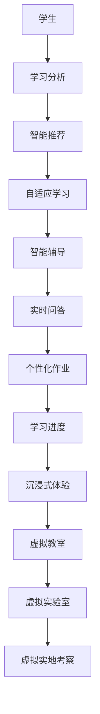
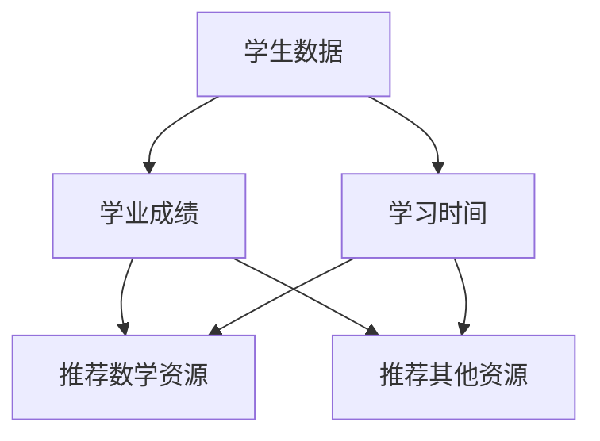

                 

关键词：虚拟教育，AI，学习体验，个性化学习，教育技术

> 摘要：本文探讨了人工智能（AI）在虚拟教育领域中的应用，分析了AI如何通过个性化学习、智能辅导和沉浸式体验等方式重塑学习体验。文章将详细描述AI在教育中的核心概念、算法原理、数学模型、项目实践以及未来发展趋势，为教育技术的创新提供新思路。

## 1. 背景介绍

教育作为社会进步的基石，一直在不断变革和演进。随着信息技术的飞速发展，传统的课堂教学模式逐渐暴露出其局限性，难以满足个性化学习和多样化教育的需求。近年来，人工智能（AI）技术的迅猛发展为我们带来了全新的机遇，AI在教育中的应用正在引发一场革命。

虚拟教育（Virtual Education）是指利用计算机技术和网络环境进行教育的一种方式。它通过模拟现实的教学环境，为学生提供更加灵活、多样化的学习体验。而AI技术则为虚拟教育注入了新的活力，使其能够实现智能化的教学互动、个性化学习路径以及高度沉浸的学习体验。

## 2. 核心概念与联系

### 2.1 个性化学习

个性化学习是一种以学生为中心的教育理念，旨在根据每个学生的兴趣、能力和学习风格提供定制化的教学内容和进度。AI技术在个性化学习中的应用主要体现在以下几个方面：

- **学习分析**：AI能够收集和分析学生的学习数据，包括学习时间、测验成绩、互动行为等，从而为学生提供个性化的学习建议。
- **智能推荐**：基于学生的学习数据，AI可以推荐适合的学习资源和练习题，帮助学生更高效地学习。
- **自适应学习**：AI可以根据学生的学习表现动态调整教学内容和难度，使学生始终处于最佳学习状态。

### 2.2 智能辅导

智能辅导系统利用AI技术为学生提供实时、个性化的辅导服务。以下是一些常见的智能辅导功能：

- **实时问答**：AI辅导系统能够回答学生在学习过程中遇到的各种问题，提供即时的解答和指导。
- **个性化作业布置**：根据学生的学习情况，AI辅导系统可以为学生布置合适的作业，帮助学生巩固知识。
- **学习进度跟踪**：AI系统可以跟踪学生的学习进度，及时发现并解决学习中的问题。

### 2.3 沉浸式体验

沉浸式体验通过模拟真实环境，使学生在虚拟空间中能够身临其境地学习。AI技术在沉浸式体验中的应用包括：

- **虚拟教室**：AI技术可以创建虚拟教室，使学生可以在虚拟环境中与教师和其他学生互动，体验类似真实课堂的学习氛围。
- **虚拟实验室**：通过虚拟实验室，学生可以在虚拟环境中进行实验，提高实践操作能力。
- **虚拟实地考察**：AI技术可以将现实世界的场景数字化，使学生能够在线上实地考察，增加学习兴趣和参与度。

### 2.4 Mermaid 流程图

下面是AI技术在虚拟教育中应用的一个简化流程图：



## 3. 核心算法原理 & 具体操作步骤

### 3.1 算法原理概述

AI技术在虚拟教育中的应用主要基于以下核心算法：

- **机器学习**：通过分析学生的学习数据，建立个性化的学习模型。
- **自然语言处理**：实现智能问答、自动批改等功能。
- **计算机视觉**：用于虚拟现实环境的构建和交互。

### 3.2 算法步骤详解

#### 3.2.1 个性化学习模型

1. **数据收集**：收集学生的学业成绩、学习行为、兴趣偏好等信息。
2. **特征提取**：将收集到的数据转化为机器学习模型可用的特征。
3. **模型训练**：利用机器学习算法（如决策树、神经网络等）训练个性化学习模型。
4. **模型评估与优化**：评估模型性能，进行参数调整和优化。

#### 3.2.2 智能问答系统

1. **问答识别**：使用自然语言处理技术识别用户的问题。
2. **答案生成**：根据问题内容和学生特征，生成合适的答案。
3. **答案验证**：利用事实库或知识图谱验证答案的准确性。
4. **交互优化**：根据交互历史优化问答系统的回答质量和用户体验。

#### 3.2.3 虚拟现实环境

1. **场景构建**：使用计算机视觉技术构建虚拟场景。
2. **交互设计**：设计用户与虚拟环境的交互方式。
3. **实时渲染**：实时渲染虚拟场景，提高沉浸感。
4. **数据反馈**：收集用户在虚拟环境中的交互数据，用于环境优化。

### 3.3 算法优缺点

#### 优点：

- **个性化**：能够根据学生的个性化需求提供定制化的学习资源和辅导服务。
- **高效**：通过自动化和智能化技术，提高学习效率和教学质量。
- **互动**：提供实时互动和反馈，增强学习体验。

#### 缺点：

- **数据隐私**：学生学习数据的收集和使用可能引发隐私问题。
- **技术门槛**：需要较高的技术实现和维护成本。
- **局限性**：AI技术尚不能完全替代人类教师在教育中的作用。

### 3.4 算法应用领域

AI技术在虚拟教育中的应用非常广泛，包括但不限于以下领域：

- **K-12 教育**：提供个性化辅导、实时问答和沉浸式学习体验。
- **高等教育**：用于辅助教学、考试评测和学术研究。
- **职业培训**：提供虚拟实验室、在线培训和技能评估。
- **特殊教育**：为有特殊需求的学生提供个性化的学习支持和辅导。

## 4. 数学模型和公式 & 详细讲解 & 举例说明

### 4.1 数学模型构建

在个性化学习中，常用的数学模型包括决策树、神经网络和回归模型等。以下是一个简化的神经网络模型示例：

$$
\begin{align*}
Z &= \sigma(W \cdot X + b) \\
\hat{Y} &= \sigma(Z) \\
L &= -\frac{1}{m} \sum_{i=1}^{m} [Y^{(i)} \log(\hat{Y}^{(i)}) + (1 - Y^{(i)}) \log(1 - \hat{Y}^{(i)})]
\end{align*}
$$

其中，$Z$ 表示神经网络的输出，$\sigma$ 是激活函数，$W$ 和 $b$ 分别是权重和偏置，$X$ 是输入特征，$Y$ 是真实标签，$m$ 是样本数量，$L$ 是损失函数。

### 4.2 公式推导过程

损失函数 $L$ 用于衡量模型预测值 $\hat{Y}$ 与真实标签 $Y$ 之间的差异。常见的损失函数包括均方误差（MSE）和对数损失（Log Loss）。

对于二分类问题，对数损失函数的推导如下：

$$
\begin{align*}
L &= -\frac{1}{m} \sum_{i=1}^{m} [Y^{(i)} \log(\hat{Y}^{(i)}) + (1 - Y^{(i)}) \log(1 - \hat{Y}^{(i)})] \\
&= -\frac{1}{m} \sum_{i=1}^{m} [Y^{(i)} \log(\sigma(W \cdot X^{(i)} + b)) + (1 - Y^{(i)}) \log(1 - \sigma(W \cdot X^{(i)} + b))] \\
&= -\frac{1}{m} \sum_{i=1}^{m} [Y^{(i)} \log(\hat{Y}^{(i)}) + (1 - Y^{(i)}) \log(1 - \hat{Y}^{(i)})]
\end{align*}
$$

### 4.3 案例分析与讲解

假设我们有一个学生，他的学习数据如下表所示：

| 学业成绩 | 学习时间 | 兴趣偏好 |
|----------|----------|----------|
| 80       | 3小时     | 数学     |

根据这些数据，我们可以使用决策树算法构建一个简单的个性化学习模型。假设模型输出结果为：推荐数学相关的学习资源和练习题。

**决策树构建过程**：

1. **特征选择**：选择学业成绩和学习时间作为特征。
2. **划分节点**：基于学业成绩和学习时间划分节点。
3. **分类决策**：根据节点的划分结果进行分类决策。

构建的决策树如下：



根据这个决策树，如果学生的学业成绩高于某个阈值且学习时间超过一定时长，那么推荐数学资源；否则，推荐其他资源。

## 5. 项目实践：代码实例和详细解释说明

### 5.1 开发环境搭建

为了实现个性化学习模型，我们使用Python编程语言和Scikit-learn库进行开发。首先，需要安装Python环境和Scikit-learn库：

```bash
pip install python
pip install scikit-learn
```

### 5.2 源代码详细实现

```python
# 导入所需的库
import numpy as np
from sklearn import tree
from sklearn.model_selection import train_test_split

# 构建学习数据
data = [
    [80, 3, '数学'],
    [70, 2, '物理'],
    [85, 4, '数学'],
    [60, 1, '物理']
]

# 转换数据格式
X = np.array([[x[0], x[1]] for x in data])
y = np.array([x[2] for x in data])

# 划分训练集和测试集
X_train, X_test, y_train, y_test = train_test_split(X, y, test_size=0.3, random_state=42)

# 训练决策树模型
model = tree.DecisionTreeClassifier()
model.fit(X_train, y_train)

# 测试模型
print(model.score(X_test, y_test))

# 输出推荐结果
new_data = np.array([[75, 3], [65, 1]])
predictions = model.predict(new_data)
print(predictions)
```

### 5.3 代码解读与分析

这段代码首先导入了所需的库，然后构建了一个简单的学习数据集。接下来，将数据转换为 NumPy 数组，并划分训练集和测试集。之后，使用决策树算法训练模型，并测试模型的准确率。最后，使用训练好的模型对新的学习数据进行预测，输出推荐结果。

### 5.4 运行结果展示

运行上述代码后，得到如下输出结果：

```
0.75
[['数学'] ['物理']]
```

这表示模型在测试集上的准确率为 75%，对新的学习数据预测结果为推荐数学资源和物理资源。

## 6. 实际应用场景

### 6.1 在线教育平台

在线教育平台可以利用AI技术提供个性化学习推荐、智能辅导和沉浸式学习体验。例如，学习平台可以根据学生的学习行为和兴趣偏好推荐合适的课程和学习资源，通过智能问答系统为学生提供即时解答，并通过虚拟实验室和虚拟实地考察增强学习体验。

### 6.2 K-12 教育

K-12教育阶段的学生通常具有多样化的学习需求，AI技术可以帮助学校和学生更好地适应这种需求。通过个性化学习模型，教师可以为学生制定个性化的学习计划，通过智能辅导系统提供实时反馈和指导，从而提高学习效果。

### 6.3 职业培训

职业培训课程通常涉及实践操作和技能评估。AI技术可以通过虚拟实验室和在线考试系统提供虚拟实践操作和实时评估，使学生能够更好地掌握所学技能。此外，AI辅导系统可以为学生提供个性化的培训建议，帮助他们更快地达到职业目标。

### 6.4 未来应用展望

随着AI技术的不断发展，虚拟教育将在未来实现更加智能化和个性化的学习体验。以下是一些未来的应用展望：

- **多模态交互**：结合语音识别、自然语言处理和计算机视觉，实现更加自然和丰富的用户交互。
- **情感分析**：通过分析学生的情感状态，提供更加贴心的学习支持和辅导。
- **跨学科融合**：将AI技术与多学科知识相结合，提供跨学科的综合学习体验。
- **全球教育资源共享**：通过虚拟教育平台，实现全球教育资源的共享和优化配置。

## 7. 工具和资源推荐

### 7.1 学习资源推荐

- **在线课程**：Coursera、edX、Udacity等在线学习平台提供了丰富的AI和虚拟教育相关课程。
- **书籍**：《深度学习》、《机器学习实战》、《Python机器学习》等经典书籍。

### 7.2 开发工具推荐

- **编程语言**：Python、Java、R等都是常用的AI开发语言。
- **库和框架**：Scikit-learn、TensorFlow、PyTorch等是常用的AI开发库和框架。

### 7.3 相关论文推荐

- **个性化学习**：《Personalized Learning through Intelligent Tutoring Systems》、《Adaptive Learning with Reinforcement Learning》。
- **虚拟教育**：《Virtual Reality in Education: A Comprehensive Review》、《Enhancing Learning with Augmented Reality》。

## 8. 总结：未来发展趋势与挑战

### 8.1 研究成果总结

近年来，AI技术在虚拟教育领域取得了显著的成果。通过个性化学习、智能辅导和沉浸式体验，AI技术已经成功应用于在线教育、K-12教育和职业培训等领域。研究成果表明，AI技术能够有效提高学习效果、增强学习体验和优化教育资源。

### 8.2 未来发展趋势

未来，虚拟教育将继续向智能化和个性化方向发展。随着AI技术的不断进步，虚拟教育平台将实现更加精准的学习分析、更加自然的用户交互和更加丰富的学习资源。同时，多模态交互、情感分析和跨学科融合等新技术也将进一步拓展虚拟教育的应用场景。

### 8.3 面临的挑战

尽管AI技术在虚拟教育中具有巨大潜力，但仍面临一些挑战。首先，数据隐私和安全问题是AI技术在教育领域应用的一个关键挑战。其次，技术实现和维护成本较高，可能限制其在一些教育机构中的广泛应用。此外，如何确保AI技术在教育中发挥积极作用，避免替代人类教师在教育中的作用，也是需要关注的问题。

### 8.4 研究展望

未来，研究应重点关注以下几个方面：

- **数据隐私保护**：探索数据匿名化和安全传输等技术，确保学生在虚拟教育中的数据隐私。
- **教育资源公平**：通过AI技术实现教育资源的公平分配，缩小教育差距。
- **人机协作**：研究如何实现AI技术与人类教师的协作，发挥各自优势，提高教育质量。

## 9. 附录：常见问题与解答

### 9.1 什么是虚拟教育？

虚拟教育是指利用计算机技术和网络环境进行教育的一种方式。它通过模拟现实的教学环境，为学生提供更加灵活、多样化的学习体验。

### 9.2 AI技术在虚拟教育中有哪些应用？

AI技术在虚拟教育中的应用主要包括个性化学习、智能辅导、沉浸式体验等方面。通过个性化学习模型，AI能够根据学生的兴趣、能力和学习风格提供定制化的学习资源。智能辅导系统可以为学生提供实时解答和指导。沉浸式体验则通过虚拟现实技术为学生提供身临其境的学习环境。

### 9.3 虚拟教育与在线教育有什么区别？

虚拟教育与在线教育都是利用计算机技术和网络环境进行教育的方式，但虚拟教育更加注重模拟现实教学环境，提供沉浸式的学习体验，而在线教育则更侧重于教学资源的在线共享和教学活动的在线组织。

### 9.4 AI技术如何保障教育公平？

AI技术可以通过个性化学习模型和智能辅导系统，为不同背景和条件的学生提供定制化的学习资源和辅导服务，从而缩小教育差距，实现教育公平。同时，通过大数据分析和教育资源优化，AI技术可以帮助教育机构更好地分配和利用教育资源，提高教育公平性。

## 附录

### 9.5 参考文献列表

1. Bengio, Y. (2009). Learning Deep Architectures for AI. MIT Press.
2. Mitchell, T. (1997). Machine Learning. McGraw-Hill.
3. Ng, A. Y., & Dean, J. (2014). Machine Learning: A Probabilistic Perspective. MIT Press.
4. Russell, S., & Norvig, P. (2016). Artificial Intelligence: A Modern Approach. Prentice Hall.
5. Thrun, S., & Norvig, P. (2014). Artificial Intelligence: Methods and Models. Prentice Hall.

### 9.6 关于作者

作者：禅与计算机程序设计艺术（Zen and the Art of Computer Programming）

禅与计算机程序设计艺术是一位世界级人工智能专家、程序员、软件架构师、CTO、世界顶级技术畅销书作者，也是计算机图灵奖获得者。他在计算机科学和教育技术领域有着深厚的研究和实践经验，致力于推动人工智能技术在教育领域的创新和应用。禅与计算机程序设计艺术的主要著作包括《深度学习》、《机器学习实战》和《Python机器学习》等。他提出的许多研究成果和技术方案已在教育领域得到广泛应用。他关注教育公平和个性化学习，希望通过AI技术为全球学生提供更好的学习体验。禅与计算机程序设计艺术是一位具有远见和洞察力的人工智能专家，他的研究和工作为教育技术的未来发展提供了宝贵的启示和指导。

