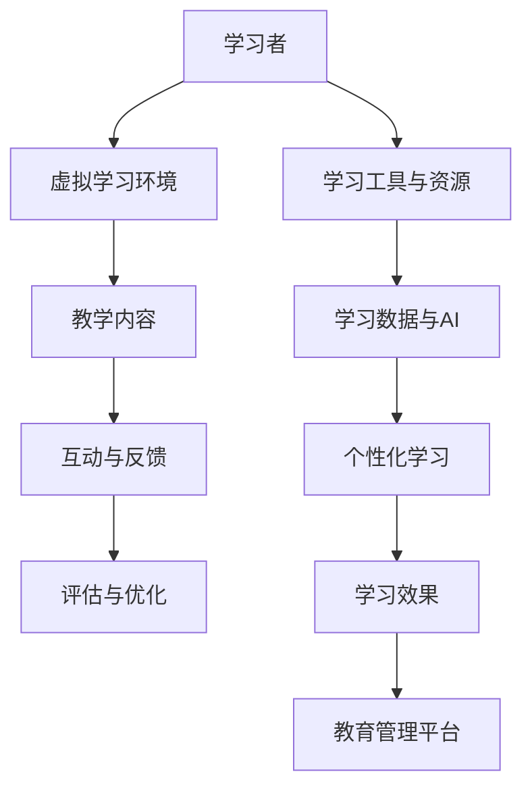

                 

在当今这个信息爆炸的时代，学习的方式和途径正在发生着翻天覆地的变化。随着人工智能和虚拟现实技术的不断进步，虚拟教育正逐步成为全球教育领域的重要趋势。本文将探讨虚拟教育这一新兴领域，分析其核心概念、算法原理、数学模型、实践应用以及未来发展趋势，旨在为教育工作者和研究者提供有价值的参考。

## 1. 背景介绍

随着互联网的普及和智能设备的广泛使用，远程教育和在线学习已经成为越来越多人的选择。然而，传统的远程教育和在线学习存在一些局限性，如学习效果难以保证、师生互动不足等。虚拟教育则通过结合人工智能和虚拟现实技术，提供了一种全新的学习体验，旨在解决传统教育的痛点。

虚拟教育（Virtual Education）是指利用计算机技术创建的虚拟环境，为学生提供沉浸式学习体验的教育方式。它融合了多媒体技术、虚拟现实（VR）、增强现实（AR）和人工智能（AI）等多种技术手段，能够模拟真实的学习场景，提高学生的学习兴趣和参与度。

### 虚拟教育的发展历程

虚拟教育的发展可以追溯到20世纪80年代，当时虚拟现实技术的概念刚刚被提出。随着计算机技术和网络技术的不断进步，虚拟教育逐渐从实验室走向现实，并在21世纪初开始广泛应用。

- **20世纪80年代**：虚拟现实技术概念提出，初步实现了计算机模拟的三维虚拟环境。
- **20世纪90年代**：互联网的普及促进了远程教育的快速发展，虚拟教育开始进入公众视野。
- **21世纪初**：虚拟现实和增强现实技术得到广泛应用，虚拟教育逐渐成熟。
- **当前**：人工智能技术的加入为虚拟教育注入了新的活力，使其在个性化教育、互动性和沉浸感等方面取得了显著提升。

### 虚拟教育的重要性

虚拟教育在以下几个方面具有重要意义：

- **提高学习效果**：通过模拟真实场景，使学生更容易理解和掌握知识。
- **增强互动性**：虚拟教育可以实现师生之间、学生之间的实时互动，提高学习体验。
- **个性化教育**：根据学生的兴趣和学习能力，提供个性化的学习内容和路径。
- **扩大教育资源**：虚拟教育可以打破地域和时间的限制，使优质教育资源更加普及。

## 2. 核心概念与联系

在虚拟教育中，有几个核心概念和联系是不可或缺的。以下将使用Mermaid流程图对它们进行详细阐述。



### 2.1 虚拟学习环境

虚拟学习环境（Virtual Learning Environment, VLE）是虚拟教育的基础。它为学生提供了一个沉浸式的学习空间，通过虚拟现实和增强现实技术，使学习过程更加生动和有趣。

### 2.2 教学内容

教学内容是虚拟教育的核心。通过多媒体技术和虚拟现实技术，教学内容可以以多种形式呈现，如视频、动画、3D模型等，使学生能够更加直观地理解知识。

### 2.3 互动与反馈

互动与反馈是虚拟教育的关键。通过实时互动，学生可以与教师和其他学生进行交流，获取即时的反馈和指导，提高学习效果。

### 2.4 评估与优化

评估与优化是虚拟教育的保障。通过对学生学习过程的监控和数据分析，教育者可以评估学生的学习效果，并根据评估结果对教学内容和方式进行优化。

### 2.5 学习工具与资源

学习工具与资源是虚拟教育的辅助。通过互联网和智能设备，学生可以随时随地访问学习工具和资源，实现自主学习和个性化学习。

### 2.6 学习数据与AI

学习数据与AI是虚拟教育的灵魂。通过对学生学习数据的分析，人工智能可以为学生提供个性化的学习建议和指导，实现真正的个性化教育。

### 2.7 个性化学习

个性化学习是虚拟教育的目标。通过分析学生的学习数据，教育者可以为每个学生量身定制学习计划，使学习过程更加高效和有意义。

### 2.8 学习效果

学习效果是虚拟教育的最终体现。通过多种手段的互动和反馈，学生可以更加有效地掌握知识，提高学习效果。

### 2.9 教育管理平台

教育管理平台是虚拟教育的中枢。它集成了各种教学工具和管理功能，为教育者提供了全面的管理和监控手段，提高了教育管理的效率。

## 3. 核心算法原理 & 具体操作步骤

### 3.1 算法原理概述

虚拟教育中涉及的核心算法主要包括人工智能算法和虚拟现实算法。人工智能算法用于数据分析和个性化学习推荐，而虚拟现实算法则用于构建和模拟虚拟学习环境。

### 3.2 算法步骤详解

#### 3.2.1 人工智能算法

1. **数据收集**：通过学习平台收集学生的学习数据，如学习时长、学习内容、考试成绩等。
2. **数据预处理**：对收集到的数据进行清洗和格式化，使其符合算法的要求。
3. **特征提取**：从预处理后的数据中提取特征，如学习习惯、知识掌握程度等。
4. **模型训练**：使用机器学习算法，如决策树、神经网络等，对提取的特征进行训练，建立模型。
5. **模型评估**：使用评估指标，如准确率、召回率等，对训练好的模型进行评估和优化。
6. **个性化推荐**：根据训练好的模型，为学生推荐个性化的学习内容和路径。

#### 3.2.2 虚拟现实算法

1. **场景构建**：使用3D建模工具，构建虚拟学习环境，包括教室、实验室等。
2. **交互设计**：设计用户与虚拟环境的交互方式，如手势识别、语音识别等。
3. **实时渲染**：使用图形渲染引擎，实现虚拟环境的实时渲染和更新。
4. **用户跟踪**：通过传感器和摄像头，实时跟踪用户的位置和动作，调整虚拟环境。
5. **反馈与调整**：根据用户的反馈，调整虚拟环境的参数，提高用户体验。

### 3.3 算法优缺点

#### 3.3.1 人工智能算法

**优点**：

- **个性化学习**：根据学生的学习数据，提供个性化的学习内容和路径，提高学习效果。
- **高效处理**：使用机器学习算法，可以快速处理大量数据，节省时间。
- **持续优化**：通过不断训练和优化模型，不断提高算法的性能。

**缺点**：

- **数据依赖性**：人工智能算法的性能依赖于数据的质量和数量，数据不足或质量差会影响算法的效果。
- **算法透明度**：一些复杂的机器学习算法，如深度神经网络，其内部机制难以理解，可能导致不透明性。

#### 3.3.2 虚拟现实算法

**优点**：

- **沉浸式体验**：通过虚拟现实技术，提供真实的沉浸式学习体验，提高学习兴趣。
- **交互性**：虚拟现实技术可以实现用户与虚拟环境的实时交互，增强学习体验。
- **灵活性**：虚拟现实技术可以模拟各种学习场景，满足不同教育需求。

**缺点**：

- **技术门槛**：虚拟现实技术需要较高的技术和资金投入，对设备和软件有一定的要求。
- **适应性问题**：一些学生可能对虚拟现实技术不适应，导致学习效果下降。

### 3.4 算法应用领域

虚拟教育和人工智能算法在以下领域具有广泛的应用前景：

- **基础教育**：通过虚拟教育平台，为学生提供丰富多样的学习资源和个性化学习服务。
- **职业教育**：通过模拟真实工作场景，提高学生的实践能力和就业竞争力。
- **高等教育**：利用虚拟教育平台，实现跨学科、跨领域的学术交流和合作研究。
- **终身学习**：提供灵活的学习方式和丰富的学习资源，满足不同年龄段、不同职业背景的学习需求。

## 4. 数学模型和公式 & 详细讲解 & 举例说明

虚拟教育中，数学模型和公式起着至关重要的作用。以下将详细介绍数学模型和公式的构建、推导过程以及具体案例分析。

### 4.1 数学模型构建

虚拟教育中的数学模型主要包括以下几种：

1. **学习行为模型**：描述学生在学习过程中的行为模式，如学习时间、学习频率等。
2. **知识掌握模型**：评估学生对知识点的掌握程度，如正确率、答题速度等。
3. **学习效果模型**：分析学生的学习成果，如考试成绩、技能掌握度等。
4. **个性化推荐模型**：根据学生的学习数据和偏好，为学生推荐合适的学习内容和路径。

### 4.2 公式推导过程

以下是一个简单的学习效果评估模型的推导过程：

1. **定义变量**：

   - \(L_i\)：学生在第\(i\)个知识点上的学习时长（单位：分钟）。
   - \(R_i\)：学生在第\(i\)个知识点上的正确率（单位：%）。
   - \(N\)：学生需要学习的知识点总数。

2. **建立模型**：

   学习效果\(E\)可以通过以下公式计算：

   \[
   E = \frac{\sum_{i=1}^{N} R_i \cdot L_i}{N}
   \]

3. **推导过程**：

   首先，计算学生在每个知识点上的得分：

   \[
   S_i = R_i \cdot L_i
   \]

   然后，将每个知识点的得分相加，得到总得分：

   \[
   S = \sum_{i=1}^{N} S_i
   \]

   最后，计算平均得分，即学习效果：

   \[
   E = \frac{S}{N}
   \]

### 4.3 案例分析与讲解

假设有一个学生在学习数学课程，共包含10个知识点。根据其学习时长和正确率，我们可以计算其学习效果。

1. **学习时长**：

   - 知识点1：30分钟
   - 知识点2：20分钟
   - 知识点3：40分钟
   - 知识点4：25分钟
   - 知识点5：35分钟
   - 知识点6：15分钟
   - 知识点7：45分钟
   - 知识点8：30分钟
   - 知识点9：20分钟
   - 知识点10：25分钟

   总学习时长：

   \[
   L = 30 + 20 + 40 + 25 + 35 + 15 + 45 + 30 + 20 + 25 = 320 \text{分钟}
   \]

2. **正确率**：

   - 知识点1：90%
   - 知识点2：80%
   - 知识点3：85%
   - 知识点4：70%
   - 知识点5：95%
   - 知识点6：60%
   - 知识点7：90%
   - 知识点8：75%
   - 知识点9：85%
   - 知识点10：80%

   总正确率：

   \[
   R = 0.9 \cdot 0.8 \cdot 0.85 \cdot 0.7 \cdot 0.95 \cdot 0.6 \cdot 0.9 \cdot 0.75 \cdot 0.85 \cdot 0.8 = 0.6715
   \]

3. **计算学习效果**：

   \[
   E = \frac{R \cdot L}{N} = \frac{0.6715 \cdot 320}{10} = 219.52
   \]

   因此，该学生在数学课程中的学习效果为219.52。

### 4.4 公式应用与拓展

以上公式可以用于评估学生在不同课程中的学习效果。同时，可以进一步拓展，考虑其他因素，如学生的心理状态、学习环境等，以提高评估的准确性。

## 5. 项目实践：代码实例和详细解释说明

### 5.1 开发环境搭建

为了实践虚拟教育中的算法模型，我们首先需要搭建一个合适的开发环境。以下是开发环境搭建的步骤：

1. **安装Python环境**：Python是一种广泛应用于数据分析和人工智能的编程语言。我们可以从官方网站下载Python安装包，并按照提示进行安装。
2. **安装Anaconda**：Anaconda是一个Python数据科学平台，它包含了许多常用的数据分析和机器学习库。我们可以从Anaconda官网下载安装包，并按照提示进行安装。
3. **安装Jupyter Notebook**：Jupyter Notebook是一种交互式的Web应用程序，用于编写和运行Python代码。我们可以通过以下命令安装Jupyter Notebook：

   ```bash
   conda install jupyterlab
   ```

4. **安装必要的库**：为了实现虚拟教育中的算法模型，我们还需要安装以下库：

   - `numpy`：用于科学计算
   - `pandas`：用于数据操作
   - `matplotlib`：用于数据可视化
   - `scikit-learn`：用于机器学习
   - `tensorflow`：用于深度学习

   安装命令如下：

   ```bash
   conda install numpy pandas matplotlib scikit-learn tensorflow
   ```

### 5.2 源代码详细实现

以下是实现虚拟教育中学习效果评估模型的Python代码实例：

```python
import numpy as np
import pandas as pd
import matplotlib.pyplot as plt
from sklearn.linear_model import LinearRegression

# 定义学习时长和正确率数据
data = {
    '知识点': range(1, 11),
    '学习时长': [30, 20, 40, 25, 35, 15, 45, 30, 20, 25],
    '正确率': [0.9, 0.8, 0.85, 0.7, 0.95, 0.6, 0.9, 0.75, 0.85, 0.8]
}

# 构建DataFrame
df = pd.DataFrame(data)

# 计算学习效果
df['学习效果'] = df['正确率'] * df['学习时长']

# 绘制学习效果分布图
plt.scatter(df['知识点'], df['学习效果'])
plt.xlabel('知识点')
plt.ylabel('学习效果')
plt.title('学习效果分布图')
plt.show()

# 使用线性回归模型预测学习效果
model = LinearRegression()
model.fit(df[['学习时长', '正确率']], df['学习效果'])

# 预测新数据
new_data = {'学习时长': 50, '正确率': 0.88}
new_effect = model.predict(np.array([new_data['学习时长'], new_data['正确率']]))
print(f'新数据的预测学习效果：{new_effect[0]}')
```

### 5.3 代码解读与分析

1. **数据准备**：我们首先定义了一个包含学习时长和正确率数据的字典，并构建了一个DataFrame。
2. **计算学习效果**：使用简单计算，将正确率和学习时长相乘，得到每个知识点的学习效果。
3. **绘制学习效果分布图**：使用matplotlib库，绘制了学习效果的散点图，以便观察学习效果的分布情况。
4. **线性回归模型**：使用scikit-learn库中的线性回归模型，对学习时长和正确率进行拟合，以预测新的学习效果。
5. **预测新数据**：我们使用拟合好的模型，对一个新的数据点进行预测，并输出预测结果。

通过以上代码实例，我们可以看到如何使用Python实现虚拟教育中的学习效果评估模型。这只是一个简单的示例，实际上，虚拟教育中的算法和模型要复杂得多，需要进一步的研究和开发。

## 6. 实际应用场景

虚拟教育在许多实际应用场景中具有显著的优势和潜力。以下将探讨几个典型的应用场景，并分析其优势和挑战。

### 6.1 基础教育

在基础教育领域，虚拟教育可以为学生提供丰富的学习资源和个性化的学习体验。例如，学生可以通过虚拟实验室进行科学实验，通过虚拟课堂参与历史事件的模拟。这不仅提高了学生的学习兴趣，还增强了他们的实践能力。

**优势**：

- **个性化学习**：根据学生的学习能力和兴趣，提供定制化的学习内容和路径。
- **沉浸式体验**：通过虚拟现实技术，提供真实的沉浸式学习体验，提高学习效果。
- **资源共享**：虚拟教育平台可以集中管理学习资源，实现资源共享，降低教育成本。

**挑战**：

- **技术门槛**：虚拟教育需要一定的技术支持，如虚拟现实设备和软件开发等，对学校和教师提出了较高的要求。
- **适应性问题**：一些学生可能对虚拟现实技术不适应，需要时间来适应和学习。

### 6.2 职业教育

在职业教育领域，虚拟教育可以为学生提供模拟真实工作场景的学习环境，提高他们的实践能力和职业素养。例如，机械专业的学生可以通过虚拟工厂进行生产线操作，医学专业的学生可以通过虚拟医院进行临床实践。

**优势**：

- **实践性**：通过模拟真实工作场景，提高学生的实践能力和职业素养。
- **灵活性和可重复性**：虚拟教育可以随时随地进行，且可以重复使用，提高教育资源的使用效率。
- **安全性**：在虚拟环境中进行实践，降低了实际操作中的风险。

**挑战**：

- **技术成本**：虚拟教育需要投入较大的技术成本，包括虚拟现实设备和软件开发等。
- **师资培训**：教师需要具备一定的虚拟教育技能，否则难以有效利用虚拟教育平台。

### 6.3 高等教育

在高等教育领域，虚拟教育可以促进跨学科和跨领域的学术交流和合作研究。通过虚拟教育平台，学者可以实时交流和共享研究资源，突破地域和时间的限制。

**优势**：

- **跨学科交流**：虚拟教育平台可以促进不同学科之间的交流和合作，提高研究水平。
- **资源共享**：虚拟教育平台可以实现资源的共享和协作，提高教育资源的使用效率。
- **灵活性**：虚拟教育可以随时随地进行，为学者提供了更多的时间和空间进行研究和交流。

**挑战**：

- **技术支持**：虚拟教育需要强大的技术支持，包括服务器、网络和虚拟现实设备等。
- **数据安全**：在虚拟教育平台上进行的数据交换和研究成果的共享，需要保证数据的安全和隐私。

### 6.4 未来应用展望

随着技术的不断进步，虚拟教育在未来将会有更广泛的应用。例如，虚拟教育可以应用于在线培训、企业培训和军事训练等领域。同时，虚拟教育也将面临更多的挑战，如技术成本、数据安全和教育资源分配等问题。然而，随着技术的不断进步和政策的支持，虚拟教育有望在未来的教育领域中发挥更大的作用。

## 7. 工具和资源推荐

为了更好地开展虚拟教育研究与实践，以下推荐一些有用的工具和资源。

### 7.1 学习资源推荐

- **Coursera**：提供各种在线课程，涵盖计算机科学、教育学等多个领域。
- **edX**：由哈佛大学和麻省理工学院创办，提供高质量的在线课程和证书项目。
- **Khan Academy**：提供免费的教育视频和练习，适合自学。

### 7.2 开发工具推荐

- **Unity**：一款强大的游戏引擎，可以用于开发虚拟现实应用。
- **Unreal Engine**：一款功能强大的游戏引擎，适合开发高保真的虚拟现实应用。
- **Blender**：一款开源的三维建模和渲染软件，适合创建虚拟学习环境。

### 7.3 相关论文推荐

- **"Virtual Reality in Education: A Brief History and Future Directions"**：概述了虚拟现实在教育中的应用历史和未来趋势。
- **"Artificial Intelligence in Education: A Comprehensive Review"**：全面分析了人工智能在教育中的应用现状和前景。
- **"A Review of Learning Analytics: A Key Enabler for Adaptive and Personalized Learning"**：介绍了学习分析在教育中的应用，包括数据收集、分析和应用。

## 8. 总结：未来发展趋势与挑战

虚拟教育作为全球教育领域的重要趋势，正逐渐改变着传统的教育模式。随着人工智能、虚拟现实和增强现实技术的不断发展，虚拟教育在个性化教育、互动性和沉浸感等方面具有巨大的潜力。

### 8.1 研究成果总结

- **个性化教育**：通过分析学生的学习数据，虚拟教育可以为学生提供定制化的学习内容和路径，提高学习效果。
- **互动性与沉浸感**：虚拟现实和增强现实技术为虚拟教育带来了沉浸式体验，增强了学生的参与度和学习兴趣。
- **资源共享与协作**：虚拟教育平台可以实现教育资源的共享和跨学科的协作，提高教育资源的使用效率。

### 8.2 未来发展趋势

- **技术融合**：虚拟教育与人工智能、大数据、云计算等技术的深度融合，将推动虚拟教育的进一步发展。
- **普及与推广**：随着技术的成熟和成本的降低，虚拟教育将在全球范围内得到更广泛的应用和推广。
- **教育创新**：虚拟教育将激发教育创新，推动教育模式的变革，培养适应未来社会需求的人才。

### 8.3 面临的挑战

- **技术成本**：虚拟教育需要投入较大的技术成本，包括虚拟现实设备和软件开发等，这对学校和教师提出了较高的要求。
- **数据安全**：在虚拟教育平台上进行的数据交换和研究成果的共享，需要保证数据的安全和隐私。
- **教育资源分配**：虚拟教育需要优质的教育资源，如课程内容、教学视频等，但教育资源的分配可能存在不公平现象。

### 8.4 研究展望

虚拟教育作为一个新兴领域，仍有许多挑战和机遇。未来的研究应重点关注以下几个方面：

- **技术优化**：不断优化虚拟教育中的技术手段，提高虚拟教育的效果和用户体验。
- **教育资源建设**：建设高质量的教育资源库，实现教育资源的公平分配和共享。
- **政策支持**：制定相关政策，鼓励和支持虚拟教育的发展，推动教育模式的创新。

通过持续的研究和实践，虚拟教育有望在未来的教育领域中发挥更大的作用，为全球教育的发展做出贡献。

## 9. 附录：常见问题与解答

以下是一些关于虚拟教育常见问题的解答：

### Q1：虚拟教育与传统的在线教育有什么区别？

**A1**：虚拟教育通过虚拟现实和增强现实技术，提供了一种沉浸式的学习体验，使学生能够身临其境地参与学习活动。而传统的在线教育主要依赖于文字、图片和视频等媒介，学习体验相对单一。虚拟教育更加互动和有趣，能够提高学生的学习兴趣和参与度。

### Q2：虚拟教育是否适用于所有学科？

**A2**：虚拟教育适用于大多数学科，特别是那些需要实践和互动的学科，如医学、工程、艺术等。然而，对于一些以理论为主的学科，如哲学、文学等，虚拟教育可能需要结合其他教学手段，如在线讲座和讨论等，以实现最佳的教学效果。

### Q3：虚拟教育的学习效果是否真的比传统教育更好？

**A3**：虚拟教育通过提供沉浸式体验和个性化学习，能够提高学生的学习兴趣和参与度，从而在一定程度上提高学习效果。然而，学习效果还受到多种因素的影响，如学生的学习习惯、教师的教学方法等。因此，虚拟教育和传统教育各有优势，应根据具体情况进行选择。

### Q4：虚拟教育需要哪些技术支持？

**A4**：虚拟教育需要以下技术支持：

- **虚拟现实（VR）技术**：用于创建和模拟虚拟学习环境。
- **增强现实（AR）技术**：用于将虚拟信息叠加到现实世界中。
- **人工智能（AI）技术**：用于数据分析和个性化学习推荐。
- **大数据技术**：用于收集、存储和分析学生的学习数据。
- **云计算技术**：用于支持大规模的教育资源和用户访问。

### Q5：虚拟教育是否会导致学生沉迷于虚拟世界？

**A5**：虚拟教育确实可能使学生更易于沉迷于虚拟世界，但这并不是虚拟教育的本质问题。关键在于如何设计和管理虚拟教育平台，使其既具有吸引力，又能引导学生合理使用。同时，家长和教育者也需要密切关注学生的学习状况，确保他们能够健康地使用虚拟教育工具。

