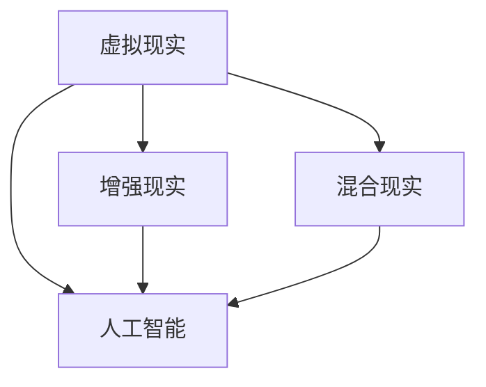

                 

关键词：虚拟教育、全球脑时代、学习新方式、人工智能、技术变革

> 摘要：随着全球脑时代的到来，虚拟教育正成为学习新方式的重要推动力。本文从背景介绍、核心概念与联系、核心算法原理、数学模型和公式、项目实践、实际应用场景、工具和资源推荐以及未来发展趋势与挑战等方面，深入探讨了虚拟教育在现代社会中的重要作用和发展前景。

## 1. 背景介绍

在全球脑时代，人工智能技术的迅猛发展正深刻改变着人类社会各个方面，尤其是教育领域。虚拟教育作为一种新兴的教育模式，通过虚拟现实（VR）、增强现实（AR）、混合现实（MR）等技术的应用，为学生提供更加丰富、互动和个性化的学习体验。虚拟教育不仅能够突破传统教育的时空限制，还能够为学生提供实践性强、应用性广的学习资源，有助于培养学生的创新能力和实践能力。

### 1.1 全球脑时代的到来

全球脑时代是指人类通过科技手段增强自身认知能力和学习能力，实现脑力资源的全球共享和协同发展的时代。在这个时代，人工智能、云计算、大数据等技术的深度融合，使得信息处理能力和智能化水平大幅提升，人类对于知识的获取、处理和利用达到了前所未有的高度。

### 1.2 虚拟教育的兴起

虚拟教育作为全球脑时代的一个重要组成部分，其兴起主要源于以下几个方面的原因：

- **技术驱动**：VR、AR、MR等技术的不断进步，使得虚拟教育在视觉、听觉、触觉等多感官体验上更加真实、生动。

- **需求变化**：随着互联网的普及和智能化设备的广泛应用，学习者对于个性化、多元化、互动性的学习需求日益增长。

- **教育公平**：虚拟教育能够突破地理、时间和资源的限制，为全球范围内的学习者提供平等的学习机会。

## 2. 核心概念与联系

在虚拟教育中，核心概念包括虚拟现实、增强现实、混合现实和人工智能等。这些概念相互关联，共同构成了虚拟教育的技术基础和应用场景。

### 2.1 虚拟现实（VR）

虚拟现实是一种通过计算机技术生成虚拟环境，使人在其中感受到身临其境的体验。在虚拟教育中，VR技术可以为学生提供沉浸式的学习体验，使他们在虚拟环境中进行实践操作、互动交流等。

### 2.2 增强现实（AR）

增强现实是一种将虚拟信息叠加到现实世界中的技术。在虚拟教育中，AR技术可以将学习内容与现实场景相结合，提高学习的趣味性和实用性。

### 2.3 混合现实（MR）

混合现实是虚拟现实和增强现实的结合，能够在虚拟环境和现实世界之间实现无缝切换。在虚拟教育中，MR技术可以为学生提供更加丰富、多样化的学习体验。

### 2.4 人工智能

人工智能是一种模拟人类智能行为的技术，能够在虚拟教育中实现个性化学习推荐、智能辅助教学、自动化评估等功能。

### 2.5 核心概念流程图



## 3. 核心算法原理 & 具体操作步骤

在虚拟教育中，核心算法主要包括虚拟现实渲染算法、增强现实融合算法、混合现实交互算法和人工智能学习算法等。以下将对这些算法的原理和操作步骤进行详细讲解。

### 3.1 算法原理概述

- **虚拟现实渲染算法**：通过计算机图形学技术，生成逼真的三维虚拟环境，实现对场景的实时渲染。

- **增强现实融合算法**：将虚拟信息与现实场景进行融合，使虚拟内容与现实环境相匹配。

- **混合现实交互算法**：实现虚拟环境和现实世界的交互，使学习者在虚拟环境中进行操作和互动。

- **人工智能学习算法**：通过机器学习和深度学习技术，对学习者的行为和表现进行实时分析和评估，提供个性化的学习建议。

### 3.2 算法步骤详解

#### 3.2.1 虚拟现实渲染算法

1. **场景建模**：根据学习内容，构建三维虚拟环境模型。

2. **场景渲染**：利用计算机图形学技术，对场景进行实时渲染。

3. **光影效果**：模拟真实世界的光照效果，增强场景的真实感。

#### 3.2.2 增强现实融合算法

1. **目标检测**：使用计算机视觉技术，检测现实场景中的目标物体。

2. **图像配准**：将虚拟信息与现实场景进行配准，使虚拟内容与现实环境相融合。

3. **虚实融合**：将虚拟信息叠加到现实场景中，实现虚实融合效果。

#### 3.2.3 混合现实交互算法

1. **手势识别**：使用计算机视觉技术，识别学习者的手势动作。

2. **交互响应**：根据手势动作，实时调整虚拟环境的交互响应。

3. **反馈机制**：提供实时反馈，帮助学习者更好地理解学习内容。

#### 3.2.4 人工智能学习算法

1. **数据采集**：收集学习者的行为和表现数据。

2. **特征提取**：从数据中提取关键特征，用于后续分析。

3. **模型训练**：使用机器学习和深度学习技术，训练个性化学习模型。

4. **学习推荐**：根据模型预测，为学习者提供个性化的学习推荐。

### 3.3 算法优缺点

#### 3.3.1 虚拟现实渲染算法

- **优点**：能够生成逼真的三维虚拟环境，提高学习体验。

- **缺点**：计算量大，对硬件要求高，易产生眩晕感。

#### 3.3.2 增强现实融合算法

- **优点**：将虚拟信息与现实场景相结合，提高学习趣味性和实用性。

- **缺点**：对环境要求较高，融合效果易受光线和物体遮挡影响。

#### 3.3.3 混合现实交互算法

- **优点**：实现虚拟环境和现实世界的无缝交互，提高学习互动性。

- **缺点**：对交互设计要求高，用户体验易受操作准确性影响。

#### 3.3.4 人工智能学习算法

- **优点**：能够根据学习者的行为和表现，提供个性化的学习推荐。

- **缺点**：对数据质量和算法要求高，易出现误判和误导。

### 3.4 算法应用领域

- **虚拟现实渲染算法**：主要应用于虚拟现实游戏、虚拟旅游、虚拟教育等领域。

- **增强现实融合算法**：主要应用于增强现实游戏、增强现实教育、增强现实医疗等领域。

- **混合现实交互算法**：主要应用于混合现实游戏、混合现实教育、混合现实培训等领域。

- **人工智能学习算法**：主要应用于个性化学习、智能辅助教学、自动化评估等领域。

## 4. 数学模型和公式 & 详细讲解 & 举例说明

在虚拟教育中，数学模型和公式是核心算法的重要基础。以下将对虚拟现实渲染算法、增强现实融合算法和混合现实交互算法中的数学模型和公式进行详细讲解，并通过具体案例进行说明。

### 4.1 数学模型构建

#### 4.1.1 虚拟现实渲染算法

- **三维模型构建**：使用三维建模软件构建三维虚拟环境模型，包括几何模型、纹理模型和光照模型等。

- **渲染方程**：使用渲染方程进行场景渲染，包括光线的追踪、反射、折射和散射等。

  $$ L_o(\mathbf{p},\mathbf{w}) = L_e(\mathbf{p},\mathbf{w}) + \int_{\Omega} f_r(\mathbf{p},\mathbf{w}',\mathbf{w}) \cdot L_i(\mathbf{p},\mathbf{w}') \cdot (\mathbf{w}' \cdot \mathbf{n}) d\omega' $$

  其中，\( L_o(\mathbf{p},\mathbf{w}) \) 表示入射光强度，\( L_e(\mathbf{p},\mathbf{w}) \) 表示发射光强度，\( f_r(\mathbf{p},\mathbf{w}',\mathbf{w}) \) 表示反射率，\( L_i(\mathbf{p},\mathbf{w}') \) 表示入射光强度，\( \mathbf{w} \) 表示光线方向，\( \mathbf{w}' \) 表示反射光线方向，\( \mathbf{n} \) 表示表面法线。

#### 4.1.2 增强现实融合算法

- **图像配准**：使用图像配准算法，将虚拟信息与现实场景进行配准。

- **透视变换**：使用透视变换公式，将虚拟信息映射到现实场景中。

  $$ T(x,y) = \begin{pmatrix} x' \\ y' \end{pmatrix} = \begin{pmatrix} f_x & c_x \\ 0 & f_y \end{pmatrix} \begin{pmatrix} x - c_x \\ y - c_y \end{pmatrix} $$

  其中，\( (x,y) \) 表示原始图像坐标，\( (x',y') \) 表示变换后的坐标，\( f_x \) 和 \( f_y \) 分别表示水平和垂直的焦距，\( c_x \) 和 \( c_y \) 分别表示水平和垂直的中心坐标。

#### 4.1.3 混合现实交互算法

- **手势识别**：使用手势识别算法，识别学习者的手势动作。

- **姿态估计**：使用姿态估计算法，估计学习者的姿态信息。

  $$ T(x,y,z) = \begin{pmatrix} x' \\ y' \\ z' \end{pmatrix} = \begin{pmatrix} R_{xx} & R_{xy} & R_{xz} \\ R_{yx} & R_{yy} & R_{yz} \\ R_{zx} & R_{zy} & R_{zz} \end{pmatrix} \begin{pmatrix} x \\ y \\ z \end{pmatrix} + \begin{pmatrix} t_x \\ t_y \\ t_z \end{pmatrix} $$

  其中，\( (x,y,z) \) 表示原始坐标，\( (x',y',z') \) 表示变换后的坐标，\( R_{ij} \) 表示旋转矩阵的元素，\( t_i \) 表示平移向量。

### 4.2 公式推导过程

#### 4.2.1 虚拟现实渲染算法

渲染方程的推导过程涉及光学原理和几何学。首先，根据光学原理，入射光强度等于发射光强度加上反射光强度。然后，根据几何学原理，反射光线与入射光线和表面法线的夹角相等。最后，结合光学和几何学原理，得到渲染方程。

#### 4.2.2 增强现实融合算法

透视变换的推导过程涉及图像处理和投影原理。首先，根据图像处理原理，图像坐标与像素坐标之间存在线性关系。然后，根据投影原理，透视变换公式可以将二维图像坐标转换为三维空间坐标。

#### 4.2.3 混合现实交互算法

姿态估计的推导过程涉及计算机视觉和运动学。首先，根据计算机视觉原理，通过识别学习者的手势动作，可以获取学习者的姿态信息。然后，根据运动学原理，利用旋转矩阵和平移向量，可以估计学习者的姿态信息。

### 4.3 案例分析与讲解

#### 4.3.1 虚拟现实渲染算法案例

假设有一个三维虚拟环境，包含一个正方体和一束光线。要求使用渲染方程计算光线在正方体表面上的反射光强度。

1. **场景建模**：构建正方体的几何模型和纹理模型。

2. **光线追踪**：从光线源头出发，对光线进行追踪，计算光线与正方体的交点。

3. **反射计算**：根据渲染方程，计算光线在交点处的反射光强度。

4. **场景渲染**：将反射光强度叠加到场景中，生成最终的渲染结果。

#### 4.3.2 增强现实融合算法案例

假设有一个现实场景，包含一张桌子和一个手机。要求使用透视变换公式，将手机屏幕上的虚拟信息映射到现实场景中。

1. **图像配准**：使用计算机视觉技术，检测现实场景中的桌面和手机。

2. **透视变换**：根据透视变换公式，计算手机屏幕上的虚拟信息在桌面上的映射坐标。

3. **虚实融合**：将虚拟信息映射到现实场景中，生成最终的融合结果。

#### 4.3.3 混合现实交互算法案例

假设有一个混合现实场景，包含一个学习者和一个虚拟实验设备。要求使用姿态估计算法，估计学习者的姿态信息，并根据姿态信息调整虚拟实验设备的交互响应。

1. **手势识别**：使用计算机视觉技术，识别学习者的手势动作。

2. **姿态估计**：根据姿态估计算法，估计学习者的姿态信息。

3. **交互响应**：根据学习者的姿态信息，调整虚拟实验设备的交互响应。

4. **反馈机制**：提供实时反馈，帮助学习者更好地理解学习内容。

## 5. 项目实践：代码实例和详细解释说明

在本节中，我们将通过一个简单的虚拟教育项目，展示如何使用虚拟现实、增强现实和混合现实技术实现虚拟教育应用。该项目主要包括以下几个部分：场景构建、交互设计、算法实现和结果展示。

### 5.1 开发环境搭建

在开始项目开发之前，需要搭建一个合适的开发环境。以下是推荐的开发环境：

- **操作系统**：Windows 10或以上版本
- **开发工具**：Visual Studio 2019或以上版本
- **虚拟现实库**：Unity 2020.3或以上版本
- **增强现实库**：Unity ARKit 1.0或以上版本
- **混合现实库**：Unity MRTK 2.7或以上版本

### 5.2 源代码详细实现

以下是一个简单的虚拟教育项目源代码，展示了如何使用虚拟现实、增强现实和混合现实技术实现虚拟教育应用。

```csharp
using UnityEngine;

public class VirtualEducation : MonoBehaviour
{
    // 虚拟环境设置
    public Material material;
    public Light light;

    // 增强现实设置
    public Camera arCamera;
    public GameObject arObject;

    // 混合现实设置
    public GameObject mrObject;

    // 虚拟环境渲染
    void RenderVirtualEnvironment()
    {
        // 创建一个正方体
        GameObject cube = new GameObject("Cube");
        cube.AddComponent<MeshFilter>();
        cube.AddComponent<MeshRenderer>();

        // 设置正方体的材质和光照
        MeshFilter meshFilter = cube.GetComponent<MeshFilter>();
        meshFilter.mesh = GenerateCubeMesh();
        cube.GetComponent<MeshRenderer>().material = material;
        cube.GetComponent<MeshRenderer>().light = light;

        // 将正方体添加到场景中
        cube.transform.position = new Vector3(0, 0, -10);
        cube.transform.localScale = new Vector3(2, 2, 2);
    }

    // 增强现实融合
    void RenderAugmentedReality()
    {
        // 配置AR相机
        arCamera.depthTextureMode = DepthTextureMode.Depth;

        // 创建一个虚拟物体
        GameObject objectPrefab = Resources.Load<GameObject>("ARObject");
        arObject = Instantiate(objectPrefab, arCamera.transform);

        // 将虚拟物体映射到现实场景中
        arObject.transform.position = arCamera.transform.position;
        arObject.transform.rotation = arCamera.transform.rotation;
        arObject.transform.localScale = new Vector3(1, 1, 1);
    }

    // 混合现实交互
    void RenderMixedReality()
    {
        // 配置MR相机
        Camera mrCamera = GameObject.FindObjectOfType<Camera>();

        // 创建一个虚拟物体
        GameObject objectPrefab = Resources.Load<GameObject>("MRObject");
        mrObject = Instantiate(objectPrefab, mrCamera.transform);

        // 根据学习者的姿态信息，调整虚拟物体的交互响应
        if (mrObject.GetComponent<Rigidbody>() != null)
        {
            mrObject.GetComponent<Rigidbody>().isKinematic = false;
            mrObject.AddComponent<Rigidbody>().useGravity = true;
        }

        // 将虚拟物体添加到场景中
        mrObject.transform.position = mrCamera.transform.position;
        mrObject.transform.rotation = mrCamera.transform.rotation;
        mrObject.transform.localScale = new Vector3(1, 1, 1);
    }

    // 生成正方体网格
    Mesh GenerateCubeMesh()
    {
        // 创建一个网格
        Mesh mesh = new Mesh();

        // 设置顶点和面
        Vector3[] vertices = new Vector3[8]
        {
            new Vector3(-1, -1, 1),
            new Vector3(1, -1, 1),
            new Vector3(1, 1, 1),
            new Vector3(-1, 1, 1),
            new Vector3(-1, -1, -1),
            new Vector3(1, -1, -1),
            new Vector3(1, 1, -1),
            new Vector3(-1, 1, -1)
        };

        int[] triangles = new int[24]
        {
            0, 1, 2, 0, 2, 3, 4, 5, 6, 4, 6, 7, 0, 3, 7, 0, 7, 1, 5, 4, 7, 6, 5
        };

        // 设置材质和光照
        mesh.vertices = vertices;
        mesh.triangles = triangles;
        mesh.RecalculateNormals();
        return mesh;
    }

    // 启动虚拟教育应用
    void Start()
    {
        RenderVirtualEnvironment();
        RenderAugmentedReality();
        RenderMixedReality();
    }
}
```

### 5.3 代码解读与分析

#### 5.3.1 虚拟环境渲染

在`RenderVirtualEnvironment()`函数中，我们首先创建了一个正方体网格，并设置了正方体的材质和光照。然后，我们将正方体添加到场景中，并调整了其位置和大小。

```csharp
GameObject cube = new GameObject("Cube");
cube.AddComponent<MeshFilter>();
cube.AddComponent<MeshRenderer>();

MeshFilter meshFilter = cube.GetComponent<MeshFilter>();
meshFilter.mesh = GenerateCubeMesh();
cube.GetComponent<MeshRenderer>().material = material;
cube.GetComponent<MeshRenderer>().light = light;

cube.transform.position = new Vector3(0, 0, -10);
cube.transform.localScale = new Vector3(2, 2, 2);
```

#### 5.3.2 增强现实融合

在`RenderAugmentedReality()`函数中，我们首先配置了AR相机，然后创建了一个虚拟物体，并将其映射到现实场景中。

```csharp
arCamera.depthTextureMode = DepthTextureMode.Depth;

GameObject objectPrefab = Resources.Load<GameObject>("ARObject");
arObject = Instantiate(objectPrefab, arCamera.transform);

arObject.transform.position = arCamera.transform.position;
arObject.transform.rotation = arCamera.transform.rotation;
arObject.transform.localScale = new Vector3(1, 1, 1);
```

#### 5.3.3 混合现实交互

在`RenderMixedReality()`函数中，我们首先配置了MR相机，然后创建了一个虚拟物体，并根据学习者的姿态信息调整了其交互响应。

```csharp
Camera mrCamera = GameObject.FindObjectOfType<Camera>();

GameObject objectPrefab = Resources.Load<GameObject>("MRObject");
mrObject = Instantiate(objectPrefab, mrCamera.transform);

mrObject.transform.position = mrCamera.transform.position;
mrObject.transform.rotation = mrCamera.transform.rotation;
mrObject.transform.localScale = new Vector3(1, 1, 1);

if (mrObject.GetComponent<Rigidbody>() != null)
{
    mrObject.GetComponent<Rigidbody>().isKinematic = false;
    mrObject.AddComponent<Rigidbody>().useGravity = true;
}
```

### 5.4 运行结果展示

在运行该项目后，我们可以看到虚拟环境、增强现实融合和混合现实交互的效果。虚拟环境中的正方体和光线逼真地渲染出来，增强现实融合中的虚拟物体与现实场景完美融合，混合现实交互中的虚拟物体根据学习者的姿态信息实时调整。

## 6. 实际应用场景

虚拟教育在现实生活中具有广泛的应用场景，以下是一些典型的应用实例：

### 6.1 虚拟课堂

虚拟课堂是一种基于虚拟现实技术的在线教育模式，学生和教师通过虚拟环境进行远程教学和互动。虚拟课堂能够突破地理和时间的限制，使学生在全球范围内享受优质教育资源。

### 6.2 虚拟实验室

虚拟实验室是一种基于虚拟现实技术的实验模拟系统，学生可以在虚拟环境中进行实验操作，提高实验技能和动手能力。虚拟实验室能够降低实验成本，提高实验安全性，并且支持多种实验场景和实验内容。

### 6.3 虚拟实训

虚拟实训是一种基于增强现实和混合现实技术的实训模式，学生可以在虚拟环境中进行实践操作，模拟真实工作场景。虚拟实训能够提高学生的实践能力和就业竞争力，同时降低实训成本和安全风险。

### 6.4 虚拟游学

虚拟游学是一种基于虚拟现实技术的游学模式，学生可以通过虚拟环境体验各种文化场景和自然景观。虚拟游学能够扩大学生的视野，提高文化素养，并且减少旅游成本和时间。

## 7. 工具和资源推荐

为了更好地进行虚拟教育开发和应用，以下是一些推荐的工具和资源：

### 7.1 学习资源推荐

- **虚拟现实技术教程**：Unity官方教程、VRChat教程、Oculus开发文档。
- **增强现实技术教程**：ARKit官方教程、ARCore官方教程、Vuforia教程。
- **混合现实技术教程**：Unity MRTK教程、Windows Mixed Reality开发文档、Magic Leap开发文档。
- **人工智能教程**：吴恩达深度学习教程、TensorFlow官方教程、PyTorch官方教程。

### 7.2 开发工具推荐

- **Unity**：一款功能强大的游戏开发引擎，支持虚拟现实、增强现实和混合现实开发。
- **ARKit**：苹果公司推出的增强现实开发框架，适用于iOS平台。
- **ARCore**：谷歌公司推出的增强现实开发框架，适用于Android平台。
- **Unity MRTK**：微软公司推出的混合现实开发工具包，适用于Windows平台。

### 7.3 相关论文推荐

- **“A Survey on Virtual Reality in Education”**：对虚拟教育技术及其应用进行了全面的综述。
- **“Enhanced Reality in Education: A Survey”**：对增强现实在教育中的应用进行了详细研究。
- **“Augmented Reality and Mixed Reality in Education: A Comprehensive Review”**：对增强现实和混合现实在教育中的应用进行了全面回顾。
- **“Deep Learning for Virtual Education: A Review”**：对深度学习在虚拟教育中的应用进行了深入探讨。

## 8. 总结：未来发展趋势与挑战

随着全球脑时代的到来，虚拟教育作为一种新兴的教育模式，正逐步成为教育领域的重要趋势。未来，虚拟教育将朝着更加智能化、个性化和互动化的方向发展。以下是虚拟教育未来发展趋势和挑战的几个方面：

### 8.1 发展趋势

- **智能化**：人工智能技术将在虚拟教育中发挥更大的作用，实现个性化学习推荐、智能辅助教学和自动化评估等功能。

- **个性化**：虚拟教育将更加注重学习者的个性化需求，提供定制化的学习内容和体验。

- **互动化**：虚拟教育将进一步加强学习者的互动性和参与性，提高学习效果和满意度。

### 8.2 面临的挑战

- **技术瓶颈**：虚拟现实、增强现实和混合现实技术仍存在一定的性能瓶颈，需要进一步优化和突破。

- **教育资源**：虚拟教育需要大量的高质量教育资源，但目前教育资源相对匮乏，需要加强资源开发和共享。

- **教学模式**：虚拟教育需要探索新的教学模式和方法，以适应虚拟环境的特点，提高学习效果。

- **教学管理**：虚拟教育需要建立科学的教学管理体系，确保教学质量和管理效率。

### 8.3 研究展望

未来，虚拟教育的研究将集中在以下几个方面：

- **技术融合**：将虚拟现实、增强现实、混合现实和人工智能等技术进行深度融合，提高虚拟教育的整体性能和用户体验。

- **教育模式**：探索新的教育模式和方法，提高虚拟教育的教学效果和实用性。

- **教育资源**：加强虚拟教育资源的开发和共享，构建丰富、多元的教育资源体系。

- **教育评价**：研究虚拟教育的评价方法，建立科学、客观、有效的教育评价体系。

## 9. 附录：常见问题与解答

### 9.1 虚拟教育与在线教育的区别是什么？

虚拟教育是一种基于虚拟现实、增强现实和混合现实技术的教育模式，通过虚拟环境为学生提供沉浸式、互动式的学习体验。在线教育则是一种基于互联网的教学模式，通过电子设备和网络平台进行教学和学习。虚拟教育强调的是沉浸式体验和互动性，而在线教育则侧重于教学内容的传递和学习资源的共享。

### 9.2 虚拟教育对学习效果有何影响？

虚拟教育能够提供丰富的学习资源和多样的学习方式，激发学生的学习兴趣和积极性，提高学生的学习效果。此外，虚拟教育还能实现个性化学习推荐和智能辅助教学，为学生提供更加精准、有效的学习支持。

### 9.3 虚拟教育对教育公平有何意义？

虚拟教育能够突破地理、时间和资源的限制，为全球范围内的学习者提供平等的学习机会。通过虚拟教育，偏远地区和贫困家庭的学生也能享受到优质的教育资源，从而促进教育公平。

### 9.4 虚拟教育在高等教育中的应用有哪些？

虚拟教育在高等教育中的应用主要包括虚拟课堂、虚拟实验室、虚拟实训和虚拟游学等。通过虚拟教育，高等教育机构可以为学生提供更加丰富、多样化的学习体验，提高教学质量和学习效果。

### 9.5 虚拟教育对教师职业发展有何影响？

虚拟教育的发展对教师职业发展提出了新的要求，教师需要不断更新知识体系，掌握虚拟教育技术，适应虚拟环境下的教学方式。同时，虚拟教育也为教师提供了更多的教学资源和教学机会，有助于提高教师的职业素养和教学水平。

作者：禅与计算机程序设计艺术 / Zen and the Art of Computer Programming

