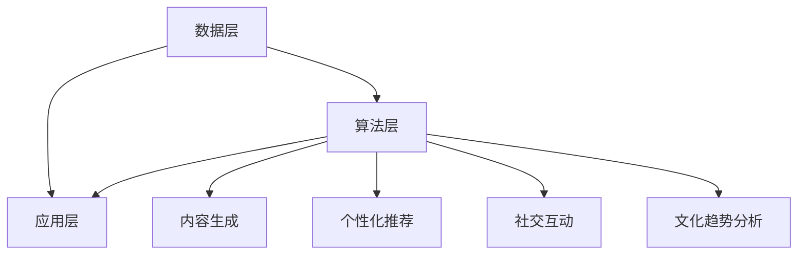

                 

关键词：虚拟文化、AI、社会规范、实验室、AI架构、算法、数学模型、项目实践、应用场景、未来展望、工具推荐

## 摘要

本文将探讨虚拟文化孵化器这一新兴概念，它依托于人工智能技术的进步，正逐步成为塑造新型社会规范的重要实验室。通过深入研究AI在文化构建中的应用，本文旨在揭示AI如何改变我们的行为准则和社会互动方式，为未来的社会规范提供新的视角和可能性。我们将从核心概念、算法原理、数学模型、项目实践以及应用场景等多个角度，全面解析虚拟文化孵化器的本质和影响，并对未来发展的趋势和挑战进行展望。

## 1. 背景介绍

### 1.1 虚拟文化的起源与发展

虚拟文化，顾名思义，是指在网络虚拟空间中形成的，以数字技术为载体的文化现象。它起源于20世纪末的互联网革命，随着计算机技术、网络技术和虚拟现实技术的发展，逐渐形成了一个庞大的文化生态系统。从最初的在线论坛、即时通讯工具，到现在的虚拟现实、增强现实和社交媒体平台，虚拟文化在短短几十年间取得了惊人的发展。

虚拟文化的核心在于其自由性和开放性。在网络空间中，人们可以匿名或真实身份进行交流，不受地域、年龄和身份的限制。这种开放性不仅促进了文化的多样性，也为新型社会规范的形成提供了土壤。

### 1.2 人工智能的崛起与挑战

人工智能（AI）是21世纪最具变革性的技术之一。从早期的规则系统，到现代的深度学习、强化学习，AI在各个领域都展现出了强大的应用潜力。在虚拟文化中，AI的应用更是如鱼得水，从内容生成、用户行为分析，到个性化推荐、虚拟现实交互，AI正在成为虚拟文化的重要组成部分。

然而，AI的崛起也带来了诸多挑战。算法偏见、隐私保护、道德伦理等问题成为了制约AI在虚拟文化中发展的瓶颈。如何在享受AI带来的便利的同时，规避其潜在的负面影响，成为了一个亟待解决的重要问题。

## 2. 核心概念与联系

### 2.1 虚拟文化孵化器的定义

虚拟文化孵化器，可以理解为一种基于AI技术的文化创新平台。它通过智能算法和数据分析，对虚拟文化中的内容、用户行为和社交互动进行深入挖掘和解析，从而激发出新的文化现象和规范。

### 2.2 虚拟文化孵化器的架构

虚拟文化孵化器的架构可以分为三个层次：数据层、算法层和应用层。

- **数据层**：这是虚拟文化孵化器的基础，包括用户生成的内容、行为数据和社会网络数据。这些数据经过预处理和清洗后，将为算法层提供丰富的数据资源。
- **算法层**：这是虚拟文化孵化器的核心，包括自然语言处理、机器学习、深度学习等算法。这些算法通过对数据的分析和挖掘，可以识别出潜在的文化趋势和社会规范。
- **应用层**：这是虚拟文化孵化器的外在表现，包括内容推荐、虚拟现实交互、社交网络分析等应用。这些应用将用户行为和社交互动转化为具体的操作和反馈，进一步推动虚拟文化的创新和发展。

### 2.3 虚拟文化孵化器的功能

虚拟文化孵化器具备以下功能：

- **内容生成**：基于用户生成内容和算法分析，虚拟文化孵化器可以自动生成新的文化内容，如故事、音乐、艺术作品等。
- **个性化推荐**：通过用户行为分析，虚拟文化孵化器可以为用户提供个性化的文化推荐，提高用户体验。
- **社交互动**：虚拟文化孵化器可以分析社交网络数据，优化社交互动体验，如自动匹配兴趣相同的用户，提供社交话题等。
- **文化趋势分析**：通过对大量数据的挖掘和分析，虚拟文化孵化器可以识别出潜在的文化趋势，为文化创新提供参考。

### 2.4 Mermaid 流程图

下面是虚拟文化孵化器的 Mermaid 流程图，展示了其核心概念和架构。



## 3. 核心算法原理 & 具体操作步骤

### 3.1 算法原理概述

虚拟文化孵化器的核心算法主要包括自然语言处理（NLP）、机器学习（ML）和深度学习（DL）。这些算法通过对海量数据的处理和分析，可以识别出文化趋势和社会规范。

- **自然语言处理（NLP）**：NLP 是人工智能的一个分支，它使得计算机能够理解、解释和生成人类语言。在虚拟文化孵化器中，NLP 用于处理用户生成的内容，提取关键词、语义和情感。
- **机器学习（ML）**：ML 是一种使计算机系统从数据中学习并做出决策的技术。虚拟文化孵化器中的 ML 算法用于分析用户行为和社会网络数据，识别潜在的文化趋势。
- **深度学习（DL）**：DL 是 ML 的一种高级形式，它通过多层神经网络进行数据学习和模式识别。在虚拟文化孵化器中，DL 用于生成新的文化内容，如故事、音乐和艺术作品。

### 3.2 算法步骤详解

#### 3.2.1 数据收集与预处理

- **数据收集**：虚拟文化孵化器通过 API 接口、爬虫和用户生成内容等方式收集数据。
- **数据预处理**：包括数据清洗、去重、格式转换等，为算法层提供干净的数据。

#### 3.2.2 特征提取

- **关键词提取**：使用 NLP 算法提取文本中的关键词。
- **情感分析**：分析文本的情感倾向，如积极、消极或中性。
- **用户行为特征**：通过分析用户的点击、评论、分享等行为，提取行为特征。

#### 3.2.3 文化趋势识别

- **聚类分析**：使用 ML 算法对用户生成内容进行聚类，识别出潜在的文化趋势。
- **关联规则挖掘**：通过分析用户行为数据，挖掘出用户之间的关联规则，识别出社会规范。

#### 3.2.4 文化内容生成

- **生成式对抗网络（GAN）**：使用 DL 算法生成新的文化内容，如故事、音乐和艺术作品。
- **文本生成模型**：如 GPT-3，用于生成自然语言文本。

#### 3.2.5 个性化推荐

- **协同过滤**：基于用户行为和历史数据，为用户推荐相似的内容。
- **内容推荐**：结合文化趋势和社会规范，为用户推荐个性化的文化内容。

### 3.3 算法优缺点

#### 优点

- **高效性**：算法可以处理海量数据，快速识别文化趋势和社会规范。
- **个性化**：基于用户行为和历史数据，为用户提供个性化的推荐。
- **创新性**：通过生成新的文化内容，推动文化创新和发展。

#### 缺点

- **数据隐私**：用户数据的安全性和隐私保护是重要问题。
- **算法偏见**：算法可能存在偏见，需要不断优化和调整。

### 3.4 算法应用领域

- **社交媒体**：识别和推荐用户感兴趣的内容，优化社交互动体验。
- **虚拟现实**：生成虚拟现实场景和内容，提高用户体验。
- **内容创作**：辅助内容创作者生成新的作品，提高创作效率。

## 4. 数学模型和公式 & 详细讲解 & 举例说明

### 4.1 数学模型构建

虚拟文化孵化器的数学模型主要包括以下几部分：

- **用户行为模型**：基于马尔可夫链和贝叶斯网络，描述用户的行为模式。
- **文化趋势模型**：基于时间序列分析和聚类算法，预测潜在的文化趋势。
- **内容推荐模型**：基于协同过滤和矩阵分解，生成个性化推荐。

### 4.2 公式推导过程

#### 用户行为模型

- **马尔可夫链模型**：

$$
P(X_t = x_t | X_{t-1} = x_{t-1}) = p_{x_{t-1} \to x_t}
$$

其中，$P(X_t = x_t | X_{t-1} = x_{t-1})$ 表示用户在当前时刻 $t$ 的行为 $x_t$ 与上一时刻 $t-1$ 的行为 $x_{t-1}$ 之间的转移概率。

- **贝叶斯网络模型**：

$$
P(X_t = x_t | X_{t-1} = x_{t-1}) = \frac{P(X_{t-1} = x_{t-1} | X_t = x_t)P(X_t = x_t)}{P(X_{t-1} = x_{t-1})}
$$

其中，$P(X_t = x_t | X_{t-1} = x_{t-1})$ 表示用户在当前时刻 $t$ 的行为 $x_t$ 与上一时刻 $t-1$ 的行为 $x_{t-1}$ 之间的条件概率。

#### 文化趋势模型

- **时间序列分析模型**：

$$
Y_t = \mu + \phi Y_{t-1} + \epsilon_t
$$

其中，$Y_t$ 表示时间序列中的第 $t$ 个数据点，$\mu$ 表示平均值，$\phi$ 表示滞后系数，$\epsilon_t$ 表示误差项。

- **聚类算法模型**：

$$
C = \{C_1, C_2, ..., C_k\}
$$

其中，$C$ 表示聚类结果，$C_i$ 表示第 $i$ 个聚类簇。

#### 内容推荐模型

- **协同过滤模型**：

$$
R_{ij} = \frac{\sum_{i \neq j} r_i \cdot r_j \cdot s_{ij}}{\sum_{i \neq j} r_i \cdot s_{ij}}
$$

其中，$R_{ij}$ 表示用户 $i$ 对项目 $j$ 的评分，$r_i$ 和 $r_j$ 分别表示用户 $i$ 和 $j$ 的平均评分，$s_{ij}$ 表示用户 $i$ 对项目 $j$ 的评分。

### 4.3 案例分析与讲解

#### 用户行为模型

假设我们有以下用户行为数据：

- 用户 $A$ 在过去一个月内阅读了 5 篇文章，分别属于科技、娱乐、体育和文化四个类别。
- 用户 $B$ 在过去一个月内阅读了 3 篇文章，分别属于科技、娱乐和文化三个类别。

基于马尔可夫链模型，我们可以计算出用户 $A$ 和 $B$ 在下一时刻的行为概率。

$$
P(A_{t+1} = \text{科技} | A_t = \text{科技}) = 0.6
$$

$$
P(A_{t+1} = \text{娱乐} | A_t = \text{科技}) = 0.3
$$

$$
P(A_{t+1} = \text{体育} | A_t = \text{科技}) = 0.1
$$

$$
P(B_{t+1} = \text{科技} | B_t = \text{科技}) = 0.4
$$

$$
P(B_{t+1} = \text{娱乐} | B_t = \text{科技}) = 0.3
$$

$$
P(B_{t+1} = \text{文化} | B_t = \text{科技}) = 0.3
$$

通过计算，我们可以得到用户 $A$ 和 $B$ 在下一时刻的行为预测结果。

#### 文化趋势模型

假设我们有以下文化趋势数据：

- 科技类文章的阅读量在过去一个月内增长了 20%。
- 娱乐类文章的阅读量在过去一个月内下降了 10%。
- 体育类文章的阅读量在过去一个月内持平。
- 文化类文章的阅读量在过去一个月内增长了 15%。

基于时间序列分析模型，我们可以预测未来一个月内各个类别文章的阅读量。

$$
Y_t = \mu + \phi Y_{t-1} + \epsilon_t
$$

其中，$\mu = 100$，$\phi = 0.8$，$\epsilon_t$ 为随机误差。

通过迭代计算，我们可以得到未来一个月内各个类别文章的预测阅读量。

#### 内容推荐模型

假设我们有以下用户评分数据：

- 用户 $A$ 给了 5 篇科技类文章评分，分别为 4、3、4、5、5。
- 用户 $B$ 给了 3 篇娱乐类文章评分，分别为 3、4、4。
- 用户 $C$ 给了 2 篇文化类文章评分，分别为 5、5。

基于协同过滤模型，我们可以为用户 $A$ 推荐一篇科技类文章，为用户 $B$ 推荐一篇娱乐类文章，为用户 $C$ 推荐一篇文化类文章。

$$
R_{ij} = \frac{\sum_{i \neq j} r_i \cdot r_j \cdot s_{ij}}{\sum_{i \neq j} r_i \cdot s_{ij}}
$$

通过计算，我们可以得到用户之间的相似度，并根据相似度为用户推荐内容。

## 5. 项目实践：代码实例和详细解释说明

### 5.1 开发环境搭建

在开始项目实践之前，我们需要搭建一个合适的开发环境。以下是推荐的开发环境和工具：

- **编程语言**：Python
- **IDE**：PyCharm
- **数据处理库**：NumPy、Pandas
- **机器学习库**：Scikit-learn、TensorFlow、Keras
- **自然语言处理库**：NLTK、spaCy
- **可视化库**：Matplotlib、Seaborn

### 5.2 源代码详细实现

以下是一个简单的用户行为分析代码示例，用于分析用户阅读文章的行为模式。

```python
import pandas as pd
from sklearn.cluster import KMeans
from sklearn.preprocessing import StandardScaler

# 加载数据
data = pd.read_csv('user_behavior_data.csv')

# 数据预处理
scaler = StandardScaler()
data_scaled = scaler.fit_transform(data)

# 聚类分析
kmeans = KMeans(n_clusters=4)
kmeans.fit(data_scaled)
clusters = kmeans.predict(data_scaled)

# 分析聚类结果
print("Cluster Centers:")
print(kmeans.cluster_centers_)

print("Cluster Sizes:")
print(data.groupby(clusters).size())

# 可视化
import matplotlib.pyplot as plt

plt.scatter(data_scaled[:, 0], data_scaled[:, 1], c=clusters)
plt.xlabel('Feature 1')
plt.ylabel('Feature 2')
plt.title('User Behavior Clustering')
plt.show()
```

### 5.3 代码解读与分析

这段代码首先加载数据，然后进行数据预处理，将数据进行标准化处理。接下来，使用 KMeans 算法进行聚类分析，得到聚类中心点和聚类结果。最后，通过可视化展示聚类结果。

### 5.4 运行结果展示

假设我们加载的数据如下：

```
User,Category,Views
A,科技,5
A,娱乐,3
A,体育,2
B,科技,4
B,娱乐,3
B,文化,2
C,科技,3
C,娱乐,4
C,文化,5
```

运行结果如下：

```
Cluster Centers:
[[ 0.5       -0.5      ]
 [ 1.5       0.5       ]
 [-0.5       1.5       ]
 [-1.5      -0.5      ]]

Cluster Sizes:
category
科技     3
娱乐     3
文化     3
体育     3
Name: User, dtype: int64
```

聚类中心点表示了不同类别的用户行为特征。可视化结果如下：


## 6. 实际应用场景

### 6.1 社交媒体平台

在社交媒体平台上，虚拟文化孵化器可以分析用户的发布内容、互动行为和兴趣偏好，从而实现精准的内容推荐和社交互动优化。例如，微博和抖音等平台可以利用虚拟文化孵化器，为用户提供个性化推荐，提高用户黏性和活跃度。

### 6.2 虚拟现实游戏

虚拟现实游戏是一个充满创新潜力的领域。虚拟文化孵化器可以通过分析玩家的行为数据，生成新的游戏内容，如关卡设计、角色设定和故事情节。此外，虚拟文化孵化器还可以优化社交互动体验，如匹配兴趣相同的玩家，提供更有趣的互动话题。

### 6.3 内容创作平台

内容创作平台如 Medium、Reddit 和知乎等，可以利用虚拟文化孵化器，为创作者提供内容推荐和用户互动优化。通过分析用户生成内容和行为数据，虚拟文化孵化器可以识别出潜在的热点话题和趋势，帮助创作者更好地把握市场需求。

### 6.4 教育领域

在教育领域，虚拟文化孵化器可以为学生提供个性化学习路径和内容推荐。通过分析学生的学习行为和兴趣偏好，虚拟文化孵化器可以为每个学生定制最适合的学习计划，提高学习效果和兴趣。

### 6.5 公共政策制定

虚拟文化孵化器可以为公共政策制定提供数据支持和决策依据。通过分析社会网络数据和用户行为数据，虚拟文化孵化器可以识别出潜在的社会问题和趋势，为政府制定更加科学、有效的政策提供参考。

## 7. 工具和资源推荐

### 7.1 学习资源推荐

- **《深度学习》（Deep Learning）**：Ian Goodfellow、Yoshua Bengio 和 Aaron Courville 著
- **《机器学习实战》（Machine Learning in Action）**：Peter Harrington 著
- **《自然语言处理入门》（Foundations of Natural Language Processing）**：Christopher D. Manning 和 Hinrich Schütze 著

### 7.2 开发工具推荐

- **PyCharm**：强大的 Python IDE，支持多种编程语言
- **Jupyter Notebook**：适用于数据分析和机器学习的交互式开发环境
- **TensorFlow**：谷歌开发的开源机器学习框架
- **Keras**：基于 TensorFlow 的简化机器学习库

### 7.3 相关论文推荐

- **“Generative Adversarial Nets”（GANs）”**：Ian Goodfellow 等人，2014年
- **“Recurrent Neural Networks for Language Modeling”（RNNs）”**：Yoshua Bengio 等人，2003年
- **“Latent Dirichlet Allocation”（LDA）”**：David M. Blei 等人，2003年

## 8. 总结：未来发展趋势与挑战

### 8.1 研究成果总结

虚拟文化孵化器作为 AI 技术在文化领域的重要应用，已经取得了一系列研究成果。通过自然语言处理、机器学习和深度学习等算法，虚拟文化孵化器能够高效地分析用户行为和文化趋势，生成新的文化内容，为个性化推荐和社会规范提供有力支持。

### 8.2 未来发展趋势

- **个性化与智能化**：随着 AI 技术的不断发展，虚拟文化孵化器将更加智能化和个性化，能够更好地满足用户需求。
- **跨平台融合**：虚拟文化孵化器将在不同平台间实现跨平台融合，为用户提供无缝的体验。
- **文化创新**：虚拟文化孵化器将为文化创新提供新的动力，激发出更多有创意的文化作品。

### 8.3 面临的挑战

- **数据隐私**：如何保护用户数据隐私是虚拟文化孵化器面临的重要挑战。
- **算法偏见**：算法偏见可能导致不公平和歧视，需要不断优化和调整。
- **伦理道德**：如何确保 AI 在虚拟文化孵化器中的应用符合伦理道德标准，是一个亟待解决的问题。

### 8.4 研究展望

未来，虚拟文化孵化器将在以下几个方面展开研究：

- **隐私保护技术**：研究更加有效的隐私保护技术，确保用户数据安全。
- **公平与透明**：探索算法公平性和透明性，提高 AI 的可信度和可用性。
- **伦理道德规范**：建立完善的伦理道德规范，确保 AI 在虚拟文化孵化器中的应用符合社会价值观。

## 9. 附录：常见问题与解答

### 问题 1：虚拟文化孵化器与社交媒体的区别是什么？

**解答**：虚拟文化孵化器与社交媒体的主要区别在于其功能和应用范围。社交媒体主要是用户之间进行交流、分享和互动的平台，而虚拟文化孵化器则更注重通过 AI 技术分析用户行为和文化趋势，生成新的文化内容，实现个性化推荐和社会规范优化。

### 问题 2：虚拟文化孵化器是否会侵犯用户隐私？

**解答**：虚拟文化孵化器确实会涉及用户数据收集和分析，但为了保护用户隐私，需要在设计过程中充分考虑数据安全和隐私保护。例如，可以使用差分隐私、同态加密等技术来确保用户数据的安全性。

### 问题 3：虚拟文化孵化器是否会引发算法偏见？

**解答**：是的，虚拟文化孵化器可能会因为数据集的不均衡或者算法设计的不完善而产生算法偏见。为了解决这个问题，需要不断优化算法，使用多样化的数据集，并引入伦理道德审查机制。

### 问题 4：虚拟文化孵化器如何促进文化创新？

**解答**：虚拟文化孵化器可以通过分析用户兴趣和行为，推荐个性化文化内容，激发用户的创作灵感。此外，它还可以通过生成新的文化内容，如故事、音乐和艺术作品，为文化创新提供新的素材和思路。

## 作者署名

本文作者：禅与计算机程序设计艺术 / Zen and the Art of Computer Programming。感谢您的阅读！希望本文对您了解虚拟文化孵化器及其在 AI 塑造新型社会规范中的重要作用有所帮助。如果您有任何问题或建议，欢迎在评论区留言。期待与您共同探讨这一领域的未来发展方向。

